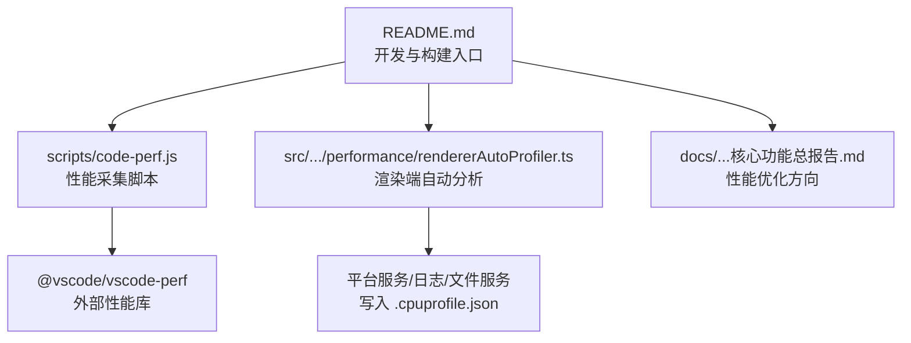
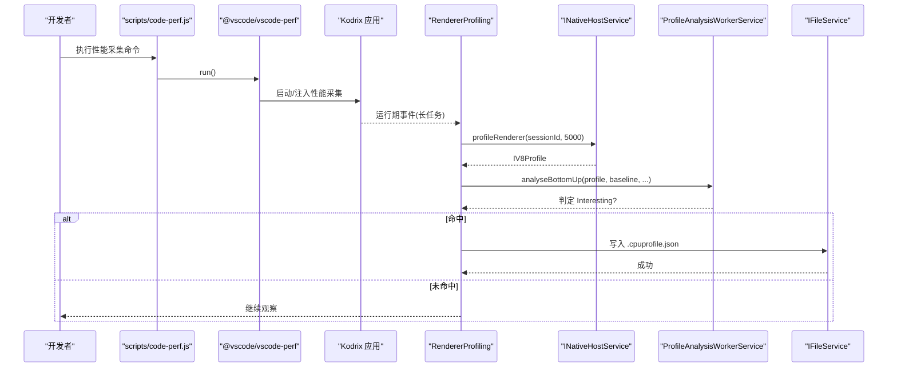
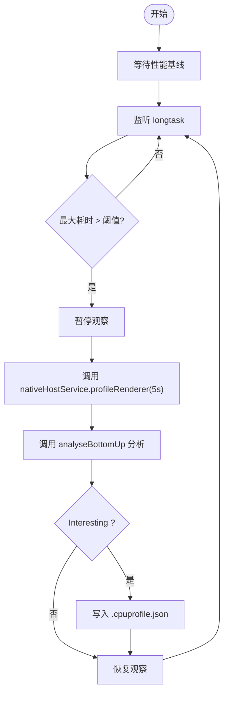
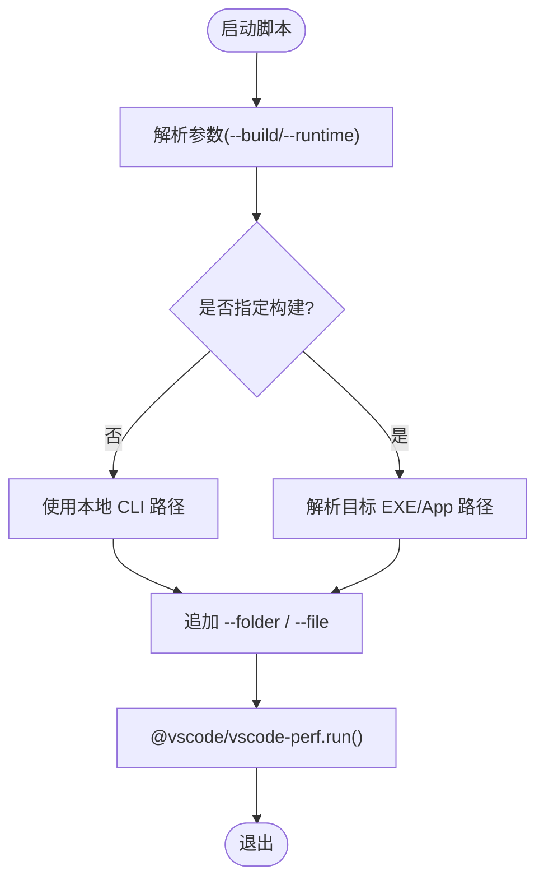
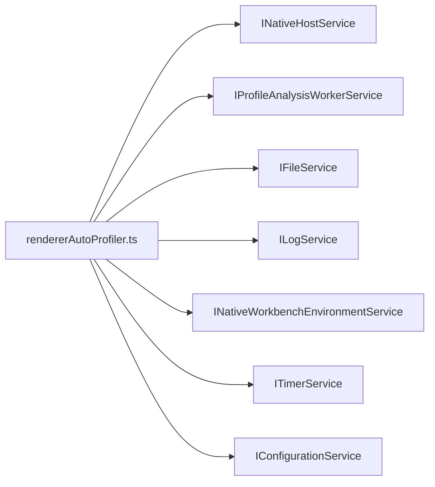

# 性能问题

<cite>
**本文引用的文件**
- [README.md](file://README.md)
- [code-perf.js](file://scripts/code-perf.js)
- [rendererAutoProfiler.ts](file://src/vs/workbench/contrib/performance/electron-browser/rendererAutoProfiler.ts)
- [项目非常有必要新实现的核心功能总报告.md](file://docs/项目非常有必要新实现的核心功能总报告.md)
- [test-chat-mem-leaks.js](file://scripts/chat-simulation/test-chat-mem-leaks.js)
- [merge-ci-summary.js](file://scripts/chat-simulation/merge-ci-summary.js)
- [AGENTS.md](file://AGENTS.md)
</cite>

## 目录
1. [简介](#简介)
2. [项目结构](#项目结构)
3. [核心组件](#核心组件)
4. [架构总览](#架构总览)
5. [详细组件分析](#详细组件分析)
6. [依赖关系分析](#依赖关系分析)
7. [性能考量与优化建议](#性能考量与优化建议)
8. [故障排查指南](#故障排查指南)
9. [结论](#结论)
10. [附录](#附录)

## 简介
本文件面向 Kodrix 的性能问题排查与优化，覆盖内存使用过高、启动速度慢、响应延迟大等常见问题。文档基于仓库中已有的性能脚本与内置性能能力，给出可操作的步骤：如何启用性能分析模式、收集与分析指标、定位瓶颈（渲染长任务、索引与检索、AI Agent 响应、终端命令执行），并提供内存泄漏检测、CPU 使用率监控、基准测试与回归检测的方法论，以及针对不同硬件配置的优化建议与最佳实践。

## 项目结构
Kodrix 在 VS Code/VSCodium 基础上进行深度定制，包含核心源码、扩展、构建与脚本等。性能相关的关键位置包括：
- 根级 README 提供开发入口与构建说明，便于快速复现与对比基线
- scripts 下提供性能运行脚本 code-perf.js，用于驱动 @vscode/vscode-perf 对应用进行性能采集
- workbench 贡献模块 performance 提供渲染端自动性能分析能力，可在检测到长任务时自动抓取并保存 CPU Profile
- docs 中的规划文档明确“性能优化”为持续项，涉及 Webview 延迟加载、索引增量、检索缓存等方向

**图示来源**
- [README.md:45-104](file://README.md#L45-L104)
- [code-perf.js:14-52](file://scripts/code-perf.js#L14-L52)
- [rendererAutoProfiler.ts:20-113](file://src/vs/workbench/contrib/performance/electron-browser/rendererAutoProfiler.ts#L20-L113)
- [项目非常有必要新实现的核心功能总报告.md:92-99](file://docs/项目非常有必要新实现的核心功能总报告.md#L92-L99)

**章节来源**
- [README.md:45-104](file://README.md#L45-L104)
- [项目非常有必要新实现的核心功能总报告.md:92-99](file://docs/项目非常有必要新实现的核心功能总报告.md#L92-L99)

## 核心组件
- 性能采集脚本 code-perf.js：封装参数解析与调用 @vscode/vscode-perf.run()，统一以本地 CLI 或指定构建产物作为目标，附加工作区与文件参数，便于重复执行与对比
- 渲染端自动分析器 RendererProfiling：监听浏览器长任务，超过阈值后触发 5 秒采样，通过平台服务获取 V8 Profile，交由分析 Worker 评估是否“有趣”，若命中则写入磁盘供后续分析
- 性能优化方向（规划）：Webview 延迟加载、索引增量更新、检索缓存等，贯穿跨扩展的规模化保障

**章节来源**
- [code-perf.js:14-52](file://scripts/code-perf.js#L14-L52)
- [rendererAutoProfiler.ts:20-113](file://src/vs/workbench/contrib/performance/electron-browser/rendererAutoProfiler.ts#L20-L113)
- [项目非常有必要新实现的核心功能总报告.md:92-99](file://docs/项目非常有必要新实现的核心功能总报告.md#L92-L99)

## 架构总览
下图展示从启动到性能数据采集与落盘的端到端流程，涵盖脚本层、运行时与存储层。

**图示来源**
- [code-perf.js:14-52](file://scripts/code-perf.js#L14-L52)
- [rendererAutoProfiler.ts:40-113](file://src/vs/workbench/contrib/performance/electron-browser/rendererAutoProfiler.ts#L40-L113)

## 详细组件分析

### 渲染端自动性能分析器（RendererProfiling）
- 职责：在渲染进程内监听长任务，当耗时超过基线的若干倍时，自动抓取 5 秒 CPU Profile，并通过分析 Worker 判断是否值得持久化
- 关键行为：
  - 读取性能基线，设置慢阈值
  - 使用 PerformanceObserver 监听 longtask
  - 达到阈值后暂停观察，调用 nativeHostService.profileRenderer 获取 V8 Profile
  - 调用 profileAnalysisService.analyseBottomUp 进行分析，若结果为 Interesting，则写入临时目录
  - 重新连接观察者，继续监控
- 配置开关：application.experimental.rendererProfiling 控制是否开启自动分析

**图示来源**
- [rendererAutoProfiler.ts:40-113](file://src/vs/workbench/contrib/performance/electron-browser/rendererAutoProfiler.ts#L40-L113)

**章节来源**
- [rendererAutoProfiler.ts:20-113](file://src/vs/workbench/contrib/performance/electron-browser/rendererAutoProfiler.ts#L20-L113)

### 性能采集脚本（code-perf.js）
- 职责：统一入口，解析命令行参数，选择本地 CLI 或指定构建产物，追加工作区与文件参数，最终调用 @vscode/vscode-perf.run()
- 适用场景：
  - 对比不同版本/分支的启动与交互性能
  - 自动化回归测试中集成性能采集
  - 配合 CI 输出性能报告

**图示来源**
- [code-perf.js:14-52](file://scripts/code-perf.js#L14-L52)
- [code-perf.js:55-95](file://scripts/code-perf.js#L55-L95)

**章节来源**
- [code-perf.js:14-95](file://scripts/code-perf.js#L14-L95)

### 性能优化方向（规划与落地）
- 规划要点：
  - Webview 延迟加载：减少非关键视图的初始开销
  - 索引增量更新：避免全量重建，降低 CPU/IO 压力
  - 检索缓存：命中热点查询，降低重复计算
- 这些方向将贯穿跨扩展，提升大规模工程下的整体体验

**章节来源**
- [项目非常有必要新实现的核心功能总报告.md:92-99](file://docs/项目非常有必要新实现的核心功能总报告.md#L92-L99)

## 依赖关系分析
- code-perf.js 依赖 @vscode/vscode-perf 完成底层采集；通过传入工作区与文件参数，确保被测对象一致
- rendererAutoProfiler.ts 依赖多个平台服务：
  - INativeWorkbenchEnvironmentService：环境信息（是否构建版、临时目录）
  - IFileService：写入 Profile 文件
  - ILogService：记录性能日志
  - INativeHostService：调用宿主能力抓取 V8 Profile
  - ITimerService：等待性能基线
  - IProfileAnalysisWorkerService：分析 Profile 结果
  - IConfigurationService：读取实验性开关

**图示来源**
- [rendererAutoProfiler.ts:20-32](file://src/vs/workbench/contrib/performance/electron-browser/rendererAutoProfiler.ts#L20-L32)

**章节来源**
- [rendererAutoProfiler.ts:20-32](file://src/vs/workbench/contrib/performance/electron-browser/rendererAutoProfiler.ts#L20-L32)

## 性能考量与优化建议

### 常见性能问题与定位思路
- 启动速度慢
  - 使用 code-perf.js 在不同构建/分支间对比启动曲线，定位冷启动阶段的重活
  - 结合 README 的开发入口与构建说明，保证环境一致性与可复现性
- 响应延迟大
  - 借助渲染端自动分析器捕获 UI 卡顿时的 CPU Profile，识别长任务与热路径
  - 关注 Webview 与大型索引/检索操作，按规划推进延迟加载与增量更新
- 内存使用过高
  - 使用脚本 chat-simulation 中的内存泄漏检查工具辅助发现异常增长
  - 结合 CI 汇总逻辑，将“检测到内存泄漏”纳入告警

**章节来源**
- [README.md:45-104](file://README.md#L45-L104)
- [code-perf.js:14-52](file://scripts/code-perf.js#L14-L52)
- [rendererAutoProfiler.ts:40-113](file://src/vs/workbench/contrib/performance/electron-browser/rendererAutoProfiler.ts#L40-L113)
- [test-chat-mem-leaks.js:1-90](file://scripts/chat-simulation/test-chat-mem-leaks.js#L1-L90)
- [merge-ci-summary.js:340-360](file://scripts/chat-simulation/merge-ci-summary.js#L340-L360)

### 启用性能分析模式与指标收集
- 使用 code-perf.js：
  - 支持传入 --build 指定桌面可执行文件或 URL（Web）
  - 自动追加工作区与 package.json 作为被测目标
  - 调用 @vscode/vscode-perf.run() 完成采集
- 渲染端自动分析：
  - 当 application.experimental.rendererProfiling 开启时，会在检测到长任务时自动抓取并保存 CPU Profile
  - 生成的 .cpuprofile.json 位于临时目录，可用 Chrome DevTools 或 VS Code 性能分析器打开

**章节来源**
- [code-perf.js:14-52](file://scripts/code-perf.js#L14-L52)
- [rendererAutoProfiler.ts:62-113](file://src/vs/workbench/contrib/performance/electron-browser/rendererAutoProfiler.ts#L62-L113)

### 代码库索引与检索优化
- 推进索引增量更新，避免全量重建带来的 CPU/IO 峰值
- 引入检索缓存，命中热点查询，降低重复计算
- 对非关键 Webview 实施延迟加载，减少首屏与交互时的瞬时负载

**章节来源**
- [项目非常有必要新实现的核心功能总报告.md:92-99](file://docs/项目非常有必要新实现的核心功能总报告.md#L92-L99)

### AI Agent 响应速度提升
- 将 Agent 相关请求与重计算进行批处理与去抖
- 对模型路由与上下文准备进行预热与缓存
- 结合性能基线与 Profile 分析，定位阻塞主线程的操作并异步化

[本节为通用优化建议，不直接分析具体文件]

### 终端命令执行优化
- 对频繁执行的终端命令进行结果缓存与幂等设计
- 限制并发度，避免 IO/CPU 抖动影响 UI 响应
- 利用性能分析确认是否存在长时间阻塞的同步调用

[本节为通用优化建议，不直接分析具体文件]

### 内存泄漏检测与修复
- 使用 chat-simulation 提供的内存泄漏检查脚本，基于状态变化检测异常增长
- 在 CI 中合并报告时，将“检测到内存泄漏”作为失败条件之一，形成回归门禁
- 修复策略：
  - 审查长生命周期对象的引用链，确保正确释放
  - 避免不必要的闭包持有全局引用
  - 对 Observable/Derived 等机制，遵循框架的 dispose 约定

**章节来源**
- [test-chat-mem-leaks.js:1-90](file://scripts/chat-simulation/test-chat-mem-leaks.js#L1-L90)
- [merge-ci-summary.js:340-360](file://scripts/chat-simulation/merge-ci-summary.js#L340-L360)

### CPU 使用率监控与降载
- 通过渲染端自动分析器捕获高 CPU 时段，定位热点函数
- 将长任务拆分为微任务或分片执行，避免阻塞主线程
- 对批量数据处理采用流式或惰性求值，降低峰值内存与 CPU

**章节来源**
- [rendererAutoProfiler.ts:40-113](file://src/vs/workbench/contrib/performance/electron-browser/rendererAutoProfiler.ts#L40-L113)

### 基准测试与性能回归检测
- 将 code-perf.js 集成至 CI，固定工作区与输入，定期跑基线
- 对比不同提交/分支的启动时间、首帧时间、长任务数量等指标
- 设定阈值告警，出现回归时阻断合并

[本节为通用方法论，不直接分析具体文件]

### 不同硬件配置的优化建议
- 低配设备：
  - 优先启用 Webview 延迟加载与索引增量
  - 降低并行度，避免抢占 UI 线程
- 高配设备：
  - 可适当提高并行度，缩短批处理时间
  - 充分利用多核进行后台计算，但仍需避免主线程阻塞

[本节为通用建议，不直接分析具体文件]

## 故障排查指南
- 启动卡死或过慢
  - 使用 code-perf.js 采集启动阶段 Profile，定位初始化阶段的耗时点
  - 核对 README 的环境要求与构建步骤，确保 Node/Electron 版本匹配
- 界面卡顿
  - 开启渲染端自动分析，捕获长任务对应的 CPU Profile
  - 打开生成的 .cpuprofile.json，聚焦自顶向下热点
- 内存持续增长
  - 使用 chat-simulation 的内存泄漏检查脚本复现问题
  - 在 CI 中合并报告时关注“memory leak detected”标记
- 性能回归
  - 将 code-perf.js 纳入 CI 流水线，固定场景与数据
  - 对比历史基线，定位引入问题的提交

**章节来源**
- [README.md:45-104](file://README.md#L45-L104)
- [code-perf.js:14-52](file://scripts/code-perf.js#L14-L52)
- [rendererAutoProfiler.ts:62-113](file://src/vs/workbench/contrib/performance/electron-browser/rendererAutoProfiler.ts#L62-L113)
- [test-chat-mem-leaks.js:1-90](file://scripts/chat-simulation/test-chat-mem-leaks.js#L1-L90)
- [merge-ci-summary.js:340-360](file://scripts/chat-simulation/merge-ci-summary.js#L340-L360)

## 结论
Kodrix 已具备完善的性能采集与分析基础设施：脚本层可通过 code-perf.js 统一采集，运行时可通过渲染端自动分析器捕获 UI 卡顿并生成 CPU Profile，同时规划了针对索引、检索与 Webview 的持续优化方向。结合内存泄漏检测与 CI 门禁，可形成从发现问题到回归防护的完整闭环。建议在团队内推广标准化性能基线与回归流程，并在不同硬件环境下验证优化效果。

## 附录
- 开发入口与构建说明参见 README，便于快速复现与对比
- 如需更细的项目导读与架构说明，可参考 AGENTS.md

**章节来源**
- [README.md:45-104](file://README.md#L45-L104)
- [AGENTS.md](file://AGENTS.md)