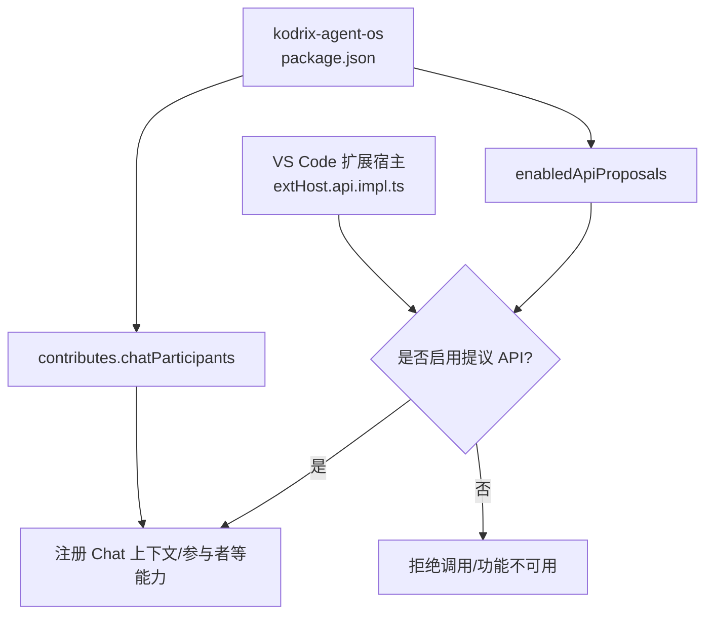
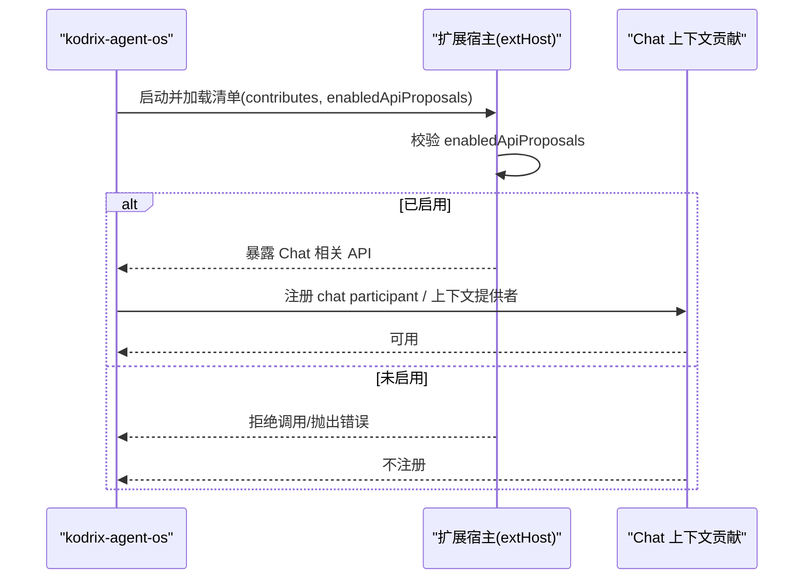
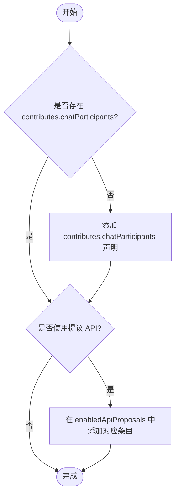
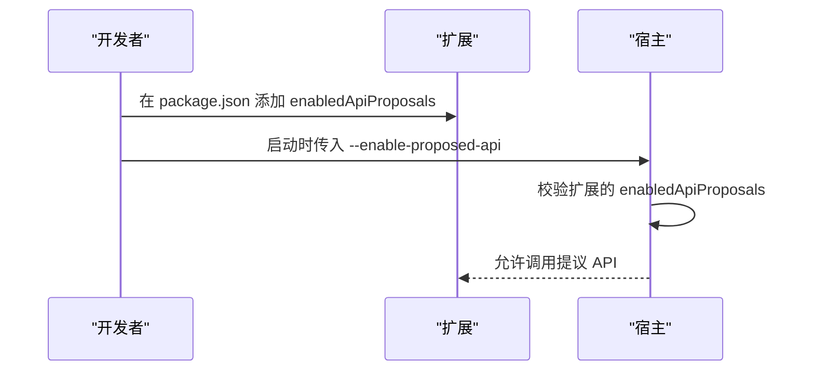
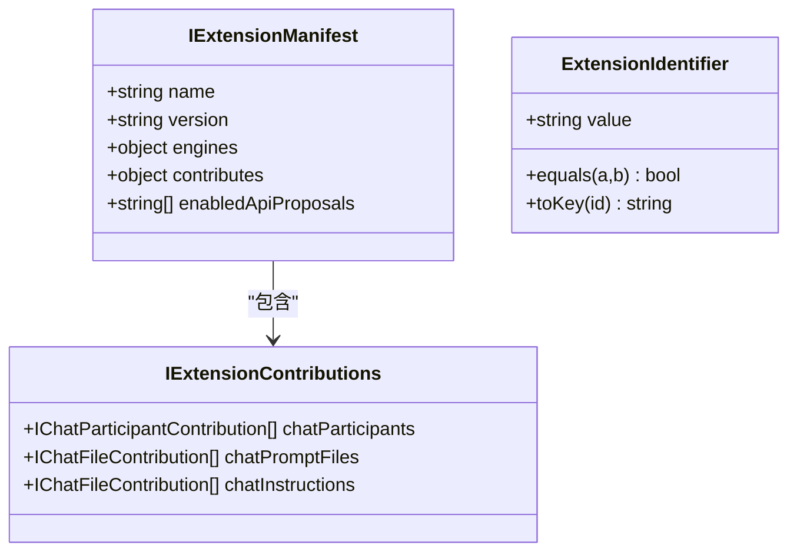

# 扩展问题

<cite>
**本文引用的文件**
- [extensions/kodrix-agent-os/package.json](file://extensions/kodrix-agent-os/package.json)
- [src/vs/platform/extensions/common/extensions.ts](file://src/vs/platform/extensions/common/extensions.ts)
- [src/vs/workbench/api/common/extHost.api.impl.ts](file://src/vs/workbench/api/common/extHost.api.impl.ts)
- [src/vs/workbench/contrib/chat/browser/contextContrib/chatContext.contribution.ts](file://src/vs/workbench/contrib/chat/browser/contextContrib/chatContext.contribution.ts)
- [.claude/CLAUDE.md](file://.claude/CLAUDE.md)
</cite>

## 目录
1. [简介](#简介)
2. [项目结构](#项目结构)
3. [核心组件](#核心组件)
4. [架构总览](#架构总览)
5. [详细组件分析](#详细组件分析)
6. [依赖关系分析](#依赖关系分析)
7. [性能考虑](#性能考虑)
8. [故障排查指南](#故障排查指南)
9. [结论](#结论)
10. [附录](#附录)

## 简介
本文件面向 Kodrix 扩展系统的开发与运维，聚焦“扩展问题”的排查与解决。内容覆盖：
- 扩展加载失败、API 兼容性、权限配置等常见问题定位方法
- kodrix-agent-os 扩展中 chat participant 的配置要求与 contributes.chatParticipants 声明的必要性
- proposed API 的使用指南（enabledApiProposals 与 --enable-proposed-api）
- 扩展调试技巧与日志分析方法
- 扩展间依赖关系与冲突检测思路
- 性能优化建议与最佳实践
- 完整的扩展开发测试流程（单元、集成、端到端）

## 项目结构
Kodrix 仓库包含大量内置扩展，kodrix-agent-os 是核心 Agent OS 扩展之一。其能力通过 package.json 的 contributes 字段声明，并通过 enabledApiProposals 启用提议 API。VS Code 内核在扩展宿主层对提议 API 进行白名单校验，未声明或未启用将导致运行时不可用或报错。

图表来源
- [extensions/kodrix-agent-os/package.json:19-55](file://extensions/kodrix-agent-os/package.json#L19-L55)
- [src/vs/workbench/api/common/extHost.api.impl.ts:1755-1774](file://src/vs/workbench/api/common/extHost.api.impl.ts#L1755-L1774)

章节来源
- [extensions/kodrix-agent-os/package.json:1-861](file://extensions/kodrix-agent-os/package.json#L1-L861)
- [src/vs/platform/extensions/common/extensions.ts:230-245](file://src/vs/platform/extensions/common/extensions.ts#L230-L245)

## 核心组件
- 扩展清单与贡献点：kodrix-agent-os 通过 contributes.chatParticipants 声明 chat participant，并定义 commands、视图、命令、快捷键等。
- 提议 API 开关：enabledApiProposals 列出该扩展使用的提议 API，如 chatContextProvider、settingsEditorRenderer。
- 宿主校验：extHost.api.impl.ts 在暴露 API 时调用 checkProposedApiEnabled，确保扩展已声明并启用对应提议 API。
- 上下文贡献：chatContext.contribution.ts 在浏览器侧检查扩展是否启用了 chatContextProvider，否则不注册相关上下文贡献。

章节来源
- [extensions/kodrix-agent-os/package.json:19-55](file://extensions/kodrix-agent-os/package.json#L19-L55)
- [src/vs/workbench/api/common/extHost.api.impl.ts:1755-1774](file://src/vs/workbench/api/common/extHost.api.impl.ts#L1755-L1774)
- [src/vs/workbench/contrib/chat/browser/contextContrib/chatContext.contribution.ts:61-61](file://src/vs/workbench/contrib/chat/browser/contextContrib/chatContext.contribution.ts#LL61-L61)

## 架构总览
下图展示了从扩展清单到宿主注册的完整链路，以及提议 API 的校验点。

图表来源
- [extensions/kodrix-agent-os/package.json:19-55](file://extensions/kodrix-agent-os/package.json#L19-L55)
- [src/vs/workbench/api/common/extHost.api.impl.ts:1755-1774](file://src/vs/workbench/api/common/extHost.api.impl.ts#L1755-L1774)
- [src/vs/workbench/contrib/chat/browser/contextContrib/chatContext.contribution.ts:61-61](file://src/vs/workbench/contrib/chat/browser/contextContrib/chatContext.contribution.ts#L61-L61)

## 详细组件分析

### kodrix-agent-os 的 chat participant 配置
- 必要性：contributes.chatParticipants 是 VS Code 识别并渲染 chat participant 的必要声明；缺少该声明，即使代码实现了处理逻辑，也不会出现在聊天面板或路由中。
- 关键项：id、name、fullName、description、isSticky、commands 等。
- 关联能力：若使用 chatContextProvider 等提议 API，必须在 enabledApiProposals 中声明，并在宿主侧被允许。

图表来源
- [extensions/kodrix-agent-os/package.json:23-55](file://extensions/kodrix-agent-os/package.json#L23-L55)

章节来源
- [extensions/kodrix-agent-os/package.json:23-55](file://extensions/kodrix-agent-os/package.json#L23-L55)

### 提议 API 使用指南（enabledApiProposals 与 --enable-proposed-api）
- 扩展侧：在 package.json 的 enabledApiProposals 中声明所需提议 API（例如 chatContextProvider）。
- 运行侧：如需在开发环境启用提议 API，可通过启动参数 --enable-proposed-api 开启全局提议 API 支持。
- 宿主侧：extHost.api.impl.ts 在暴露 API 前会检查扩展是否声明了相应提议 API，未声明则拒绝。

图表来源
- [extensions/kodrix-agent-os/package.json:19-22](file://extensions/kodrix-agent-os/package.json#L19-L22)
- [src/vs/workbench/api/common/extHost.api.impl.ts:1755-1774](file://src/vs/workbench/api/common/extHost.api.impl.ts#L1755-L1774)

章节来源
- [extensions/kodrix-agent-os/package.json:19-22](file://extensions/kodrix-agent-os/package.json#L19-L22)
- [src/vs/workbench/api/common/extHost.api.impl.ts:1755-1774](file://src/vs/workbench/api/common/extHost.api.impl.ts#L1755-L1774)

### 扩展加载失败的常见原因与修复
- 引擎版本不匹配：engines.vscode 要求过低或过高可能导致无法加载。
- 入口文件缺失：main 指向的文件不存在或编译产物路径不正确。
- 激活事件不当：onStartupFinished 可能延迟激活，影响响应性；可改用 onCommand、onView、onChatParticipant 等按需激活。
- 资源路径错误：图标、语言包等资源路径需与 package.json 一致。

章节来源
- [extensions/kodrix-agent-os/package.json:8-18](file://extensions/kodrix-agent-os/package.json#L8-L18)

### API 兼容性与权限配置
- 提议 API 必须声明：未在 enabledApiProposals 中声明的提议 API 将被宿主拒绝。
- 上下文贡献受控：chatContext.contribution.ts 会检查扩展是否启用了 chatContextProvider，未启用则不注册上下文贡献。
- 安全与权限：避免在扩展中硬编码密钥；网络请求需设置超时与大小限制；文件 I/O 使用异步 API。

章节来源
- [extensions/kodrix-agent-os/package.json:19-22](file://extensions/kodrix-agent-os/package.json#L19-L22)
- [src/vs/workbench/contrib/chat/browser/contextContrib/chatContext.contribution.ts:61-61](file://src/vs/workbench/contrib/chat/browser/contextContrib/chatContext.contribution.ts#L61-L61)
- [.claude/CLAUDE.md:39-57](file://.claude/CLAUDE.md#L39-L57)

### 扩展间的依赖关系与冲突检测
- 依赖声明：extensionDependencies 用于声明对其他扩展的依赖，确保加载顺序与可用性。
- 冲突检测：当多个扩展贡献相同命令、视图或菜单项时，可能出现冲突；应通过 when 条件、命令命名空间隔离或合并策略解决。
- 建议：在 CI 中增加扩展清单校验任务，提前发现重复贡献与无效依赖。

章节来源
- [src/vs/platform/extensions/common/extensions.ts:300-332](file://src/vs/platform/extensions/common/extensions.ts#L300-L332)

## 依赖关系分析
- 扩展清单类型：IExtensionManifest 定义了 name、version、engines、contributes、enabledApiProposals 等关键字段。
- 贡献点类型：IExtensionContributions 包含 chatParticipants、chatPromptFiles、chatInstructions 等 Chat 相关贡献。
- 扩展标识：ExtensionIdentifier 提供扩展 ID 的规范化与比较。

图表来源
- [src/vs/platform/extensions/common/extensions.ts:300-332](file://src/vs/platform/extensions/common/extensions.ts#L300-L332)
- [src/vs/platform/extensions/common/extensions.ts:230-245](file://src/vs/platform/extensions/common/extensions.ts#L230-L245)
- [src/vs/platform/extensions/common/extensions.ts:391-429](file://src/vs/platform/extensions/common/extensions.ts#L391-L429)

章节来源
- [src/vs/platform/extensions/common/extensions.ts:230-429](file://src/vs/platform/extensions/common/extensions.ts#L230-L429)

## 性能考虑
- 激活策略：避免在新扩展中使用 onStartupFinished；优先使用 onCommand、onView、onChatParticipant 等按需激活，减少冷启动开销。
- 资源释放：在 deactivate() 中释放所有订阅与定时器，防止内存泄漏。
- I/O 与事件：使用异步 fs.promises；将 onDidDispose、onDidChange 等监听器加入 context.subscriptions。
- 日志输出：使用 vscode.OutputChannel 记录日志，避免 console.log 阻塞主线程。

章节来源
- [.claude/CLAUDE.md:39-57](file://.claude/CLAUDE.md#L39-L57)

## 故障排查指南
- 扩展未加载
  - 检查 engines.vscode 是否与当前版本兼容
  - 确认 main 指向的编译产物存在且路径正确
  - 查看激活事件是否合理（避免过度延迟）
- Chat participant 不显示
  - 确认 contributes.chatParticipants 已声明
  - 若使用 chatContextProvider，需在 enabledApiProposals 中声明
  - 检查宿主是否允许提议 API（必要时使用 --enable-proposed-api）
- 提议 API 调用失败
  - 核对 enabledApiProposals 列表
  - 查看 extHost.api.impl.ts 中的 checkProposedApiEnabled 行为
- 上下文贡献未生效
  - 检查 chatContext.contribution.ts 的条件判断
- 日志与调试
  - 使用 OutputChannel 输出结构化日志
  - 在开发环境启用提议 API 后复现问题
  - 结合单元测试与集成测试逐步缩小范围

章节来源
- [extensions/kodrix-agent-os/package.json:19-55](file://extensions/kodrix-agent-os/package.json#L19-L55)
- [src/vs/workbench/api/common/extHost.api.impl.ts:1755-1774](file://src/vs/workbench/api/common/extHost.api.impl.ts#L1755-L1774)
- [src/vs/workbench/contrib/chat/browser/contextContrib/chatContext.contribution.ts:61-61](file://src/vs/workbench/contrib/chat/browser/contextContrib/chatContext.contribution.ts#L61-L61)
- [.claude/CLAUDE.md:39-57](file://.claude/CLAUDE.md#L39-L57)

## 结论
- kodrix-agent-os 的 chat participant 必须通过 contributes.chatParticipants 声明，否则无法在聊天面板中可见。
- 使用提议 API 需要在 package.json 中声明 enabledApiProposals，并在开发环境中通过 --enable-proposed-api 启用。
- 宿主层对提议 API 有严格校验，未声明将导致调用失败。
- 遵循最佳实践（按需激活、资源释放、异步 I/O、OutputChannel 日志）可显著提升稳定性与性能。
- 通过依赖声明与冲突检测策略，降低多扩展协作风险。

## 附录
- 开发测试流程建议
  - 单元测试：针对核心模块编写单测，验证边界条件与异常路径
  - 集成测试：模拟跨扩展命令交互与 Chat 上下文装配
  - 端到端测试：在真实工作区中验证 chat participant 可见性与功能闭环
  - 发布前检查：校验 package.json 的 engines、main、contributes、enabledApiProposals 一致性