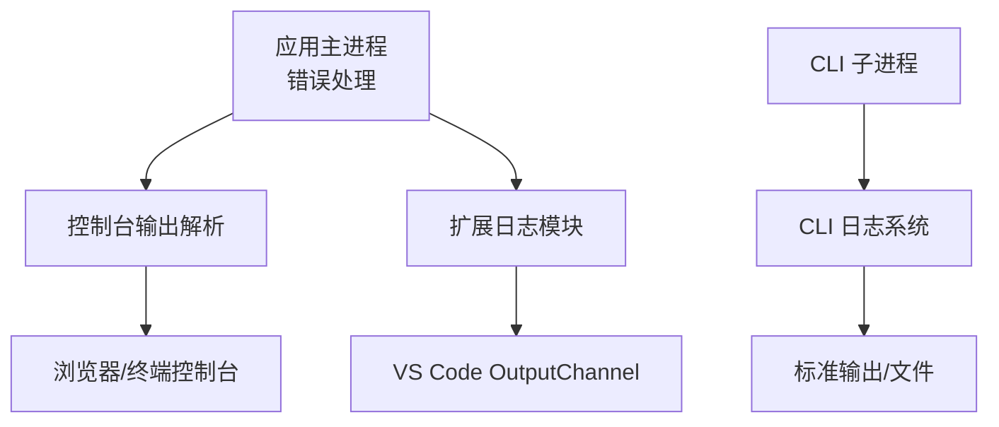
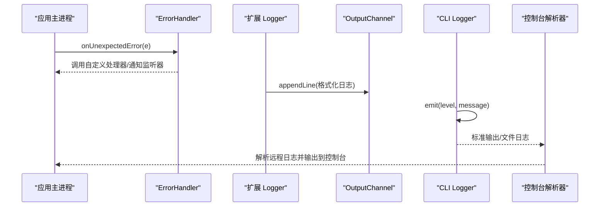
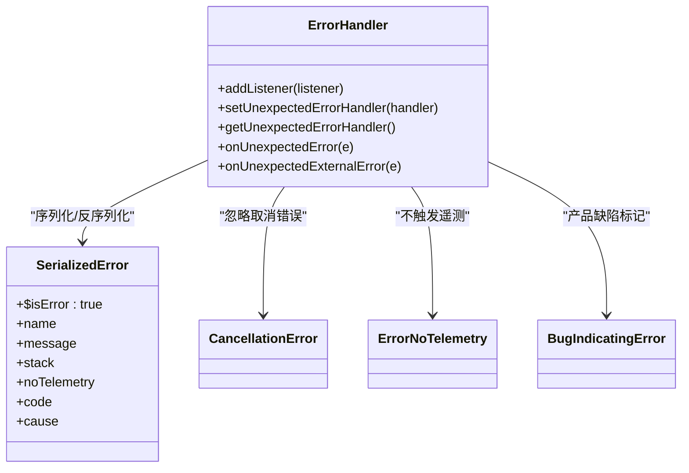
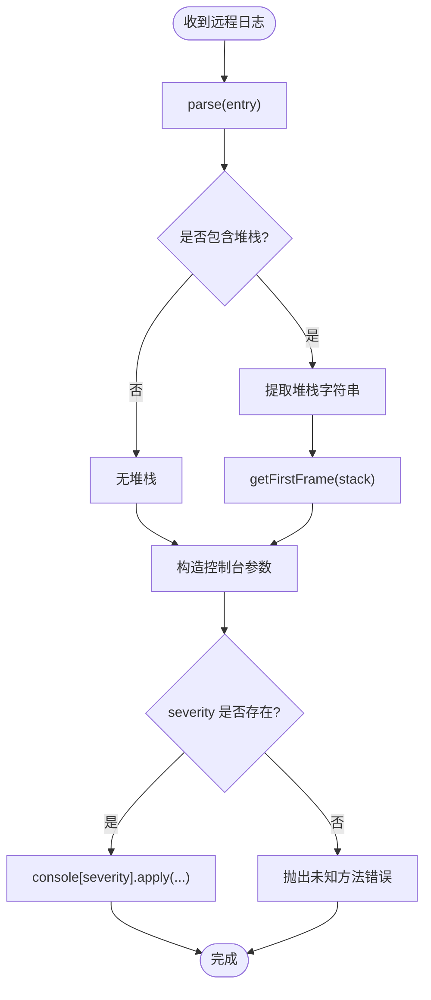
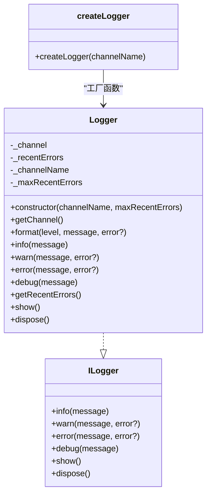
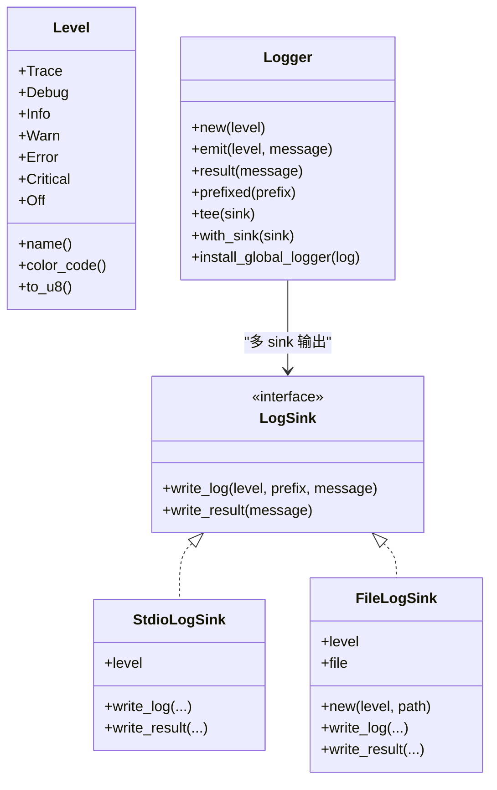
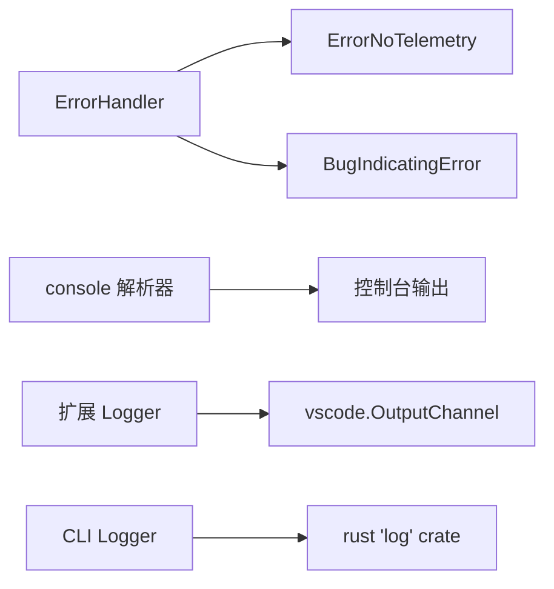

# 故障排除

<cite>
**本文引用的文件**   
- [src/vs/base/common/errors.ts](file://src/vs/base/common/errors.ts)
- [src/vs/base/common/console.ts](file://src/vs/base/common/console.ts)
- [extensions/kodrix-agent-os/src/logger.ts](file://extensions/kodrix-agent-os/src/logger.ts)
- [cli/src/log.rs](file://cli/src/log.rs)
</cite>

## 目录
1. [简介](#简介)
2. [项目结构](#项目结构)
3. [核心组件](#核心组件)
4. [架构总览](#架构总览)
5. [详细组件分析](#详细组件分析)
6. [依赖关系分析](#依赖关系分析)
7. [性能注意事项](#性能注意事项)
8. [故障排除指南](#故障排除指南)
9. [结论](#结论)
10. [附录](#附录)

## 简介
本指南面向 Kodrix 用户与开发者，提供从“启动失败、性能问题、扩展冲突、网络连接”到“日志分析与调试方法”的完整自助排障手册。文档基于仓库中的错误处理、控制台输出、扩展日志以及 CLI 日志实现进行说明，帮助你快速定位问题根源并给出可操作的修复建议。

## 项目结构
Kodrix 的排障相关能力分布在以下位置：
- 运行时错误处理与序列化：src/vs/base/common/errors.ts
- 远程/跨进程控制台消息解析与输出：src/vs/base/common/console.ts
- 扩展侧统一日志模块（OutputChannel、最近错误追踪、DEBUG 开关）：extensions/kodrix-agent-os/src/logger.ts
- CLI Rust 端日志系统（级别、颜色、文件/标准输出、全局安装）：cli/src/log.rs

图示来源
- [src/vs/base/common/errors.ts:15-75](file://src/vs/base/common/errors.ts#L15-L75)
- [src/vs/base/common/console.ts:30-140](file://src/vs/base/common/console.ts#L30-L140)
- [extensions/kodrix-agent-os/src/logger.ts:40-124](file://extensions/kodrix-agent-os/src/logger.ts#L40-L124)
- [cli/src/log.rs:100-244](file://cli/src/log.rs#L100-L244)

章节来源
- [src/vs/base/common/errors.ts:15-75](file://src/vs/base/common/errors.ts#L15-L75)
- [src/vs/base/common/console.ts:30-140](file://src/vs/base/common/console.ts#L30-L140)
- [extensions/kodrix-agent-os/src/logger.ts:40-124](file://extensions/kodrix-agent-os/src/logger.ts#L40-L124)
- [cli/src/log.rs:100-244](file://cli/src/log.rs#L100-L244)

## 核心组件
- 错误处理器 ErrorHandler：集中捕获未预期错误，支持自定义异常处理器、监听器、外部错误隔离、取消错误识别、错误序列化/反序列化等。
- 控制台解析器 console：解析远程控制台日志条目，提取参数与堆栈，格式化并输出到当前环境控制台。
- 扩展 Logger：为扩展提供结构化日志、最近错误缓存、按模块独立 OutputChannel、DEBUG 级别控制。
- CLI Logger：Rust 实现的日志子系统，支持多级别、彩色输出、文件与标准输出双写、全局安装与第三方库桥接。

章节来源
- [src/vs/base/common/errors.ts:15-75](file://src/vs/base/common/errors.ts#L15-L75)
- [src/vs/base/common/console.ts:30-140](file://src/vs/base/common/console.ts#L30-L140)
- [extensions/kodrix-agent-os/src/logger.ts:40-124](file://extensions/kodrix-agent-os/src/logger.ts#L40-L124)
- [cli/src/log.rs:100-244](file://cli/src/log.rs#L100-L244)

## 架构总览
下图展示错误与日志在应用中的流转路径：主进程抛出或捕获错误，通过 ErrorHandler 分发；扩展使用 Logger 写入 OutputChannel；CLI 子进程通过 Rust Logger 输出到标准输出或文件；控制台解析器将远程日志转换为本地控制台输出。

图示来源
- [src/vs/base/common/errors.ts:64-75](file://src/vs/base/common/errors.ts#L64-L75)
- [extensions/kodrix-agent-os/src/logger.ts:69-104](file://extensions/kodrix-agent-os/src/logger.ts#L69-L104)
- [cli/src/log.rs:209-244](file://cli/src/log.rs#L209-L244)
- [src/vs/base/common/console.ts:102-140](file://src/vs/base/common/console.ts#L102-L140)

## 详细组件分析

### 错误处理与序列化
- 未预期错误入口：onUnexpectedError/onUnexpectedExternalError 会委托给 ErrorHandler，避免被取消错误污染。
- 自定义异常处理器：setUnexpectedErrorHandler 允许替换默认行为，便于集成监控或上报。
- 错误序列化：transformErrorForSerialization 将 Error 对象转为可传输结构，保留 name/message/stack/code/cause/noTelemetry。
- 特殊错误类型：CancellationError、ExpectedError、ErrorNoTelemetry、BugIndicatingError 等用于区分正常取消、预期错误、不应上报的错误与产品缺陷。

图示来源
- [src/vs/base/common/errors.ts:15-75](file://src/vs/base/common/errors.ts#L15-L75)
- [src/vs/base/common/errors.ts:123-176](file://src/vs/base/common/errors.ts#L123-L176)
- [src/vs/base/common/errors.ts:196-215](file://src/vs/base/common/errors.ts#L196-L215)
- [src/vs/base/common/errors.ts:300-341](file://src/vs/base/common/errors.ts#L300-L341)

章节来源
- [src/vs/base/common/errors.ts:15-75](file://src/vs/base/common/errors.ts#L15-L75)
- [src/vs/base/common/errors.ts:123-176](file://src/vs/base/common/errors.ts#L123-L176)
- [src/vs/base/common/errors.ts:196-215](file://src/vs/base/common/errors.ts#L196-L215)
- [src/vs/base/common/errors.ts:300-341](file://src/vs/base/common/errors.ts#L300-L341)

### 控制台日志解析与输出
- 远程日志条目 IRemoteConsoleLog：包含 type/severity/arguments，支持最后一条参数作为堆栈信息。
- parse：解析 arguments JSON，分离堆栈字符串，返回 args 与 stack。
- getFirstFrame：从堆栈中提取首个帧的文件 URI、行号、列号，便于定位源码位置。
- log：根据 severity 调用对应 console 方法，附加标签与首帧信息，增强可读性。

图示来源
- [src/vs/base/common/console.ts:30-51](file://src/vs/base/common/console.ts#L30-L51)
- [src/vs/base/common/console.ts:53-87](file://src/vs/base/common/console.ts#L53-L87)
- [src/vs/base/common/console.ts:102-140](file://src/vs/base/common/console.ts#L102-L140)

章节来源
- [src/vs/base/common/console.ts:30-51](file://src/vs/base/common/console.ts#L30-L51)
- [src/vs/base/common/console.ts:53-87](file://src/vs/base/common/console.ts#L53-L87)
- [src/vs/base/common/console.ts:102-140](file://src/vs/base/common/console.ts#L102-L140)

### 扩展日志模块（kodrix-agent-os）
- ILogger 接口：info/warn/error/debug/show/dispose，便于单元测试注入 mock。
- Logger 生产实现：
  - 使用 vscode.window.createOutputChannel 创建独立通道。
  - format 方法统一时间戳、级别、消息与可选 error 对象（含 message/stack）。
  - error 方法维护最近错误列表（环形缓冲），便于 UI 展示。
  - debug 方法受 KODRIX_DEBUG 环境变量控制。
- createLogger：为不同模块创建独立 Logger，避免共享状态。
- 向后兼容 logger 单例：供主扩展入口使用。

图示来源
- [extensions/kodrix-agent-os/src/logger.ts:14-36](file://extensions/kodrix-agent-os/src/logger.ts#L14-L36)
- [extensions/kodrix-agent-os/src/logger.ts:40-111](file://extensions/kodrix-agent-os/src/logger.ts#L40-L111)
- [extensions/kodrix-agent-os/src/logger.ts:115-124](file://extensions/kodrix-agent-os/src/logger.ts#L115-L124)

章节来源
- [extensions/kodrix-agent-os/src/logger.ts:14-36](file://extensions/kodrix-agent-os/src/logger.ts#L14-L36)
- [extensions/kodrix-agent-os/src/logger.ts:40-111](file://extensions/kodrix-agent-os/src/logger.ts#L40-L111)
- [extensions/kodrix-agent-os/src/logger.ts:115-124](file://extensions/kodrix-agent-os/src/logger.ts#L115-L124)

### CLI 日志系统（Rust）
- Level 枚举：Trace/Debug/Info/Warn/Error/Critical/Off，支持名称映射与颜色代码。
- LogSink 抽象：StdioLogSink（标准输出）、FileLogSink（文件输出，带大小限制与清理）。
- Logger：
  - new/emit/result：基础日志输出。
  - prefixed/tee/with_sink：组合多个 sink，支持前缀与多路输出。
  - install_global_logger：安装全局日志器，桥接到第三方 rust “log” crate。
- 宏：error/debug/info/warning/trace 简化调用。

图示来源
- [cli/src/log.rs:24-85](file://cli/src/log.rs#L24-L85)
- [cli/src/log.rs:120-192](file://cli/src/log.rs#L120-L192)
- [cli/src/log.rs:194-244](file://cli/src/log.rs#L194-L244)
- [cli/src/log.rs:316-358](file://cli/src/log.rs#L316-L358)
- [cli/src/log.rs:360-409](file://cli/src/log.rs#L360-L409)

章节来源
- [cli/src/log.rs:24-85](file://cli/src/log.rs#L24-L85)
- [cli/src/log.rs:120-192](file://cli/src/log.rs#L120-L192)
- [cli/src/log.rs:194-244](file://cli/src/log.rs#L194-L244)
- [cli/src/log.rs:316-358](file://cli/src/log.rs#L316-L358)
- [cli/src/log.rs:360-409](file://cli/src/log.rs#L360-L409)

## 依赖关系分析
- 错误处理与遥测：ErrorHandler 与 ErrorNoTelemetry/BugIndicatingError 协作，确保非预期错误与产品缺陷的可观测性。
- 控制台解析与 UI：console.parse/getFirstFrame/log 将远程日志转化为本地控制台输出，便于前端/终端调试。
- 扩展日志与 VS Code API：Logger 依赖 vscode.window.createOutputChannel，提供模块化输出与最近错误缓存。
- CLI 与第三方库：install_global_logger 将 Rust Logger 接入 “log” crate，统一第三方库日志输出。

图示来源
- [src/vs/base/common/errors.ts:300-341](file://src/vs/base/common/errors.ts#L300-L341)
- [src/vs/base/common/console.ts:102-140](file://src/vs/base/common/console.ts#L102-L140)
- [extensions/kodrix-agent-os/src/logger.ts:51-56](file://extensions/kodrix-agent-os/src/logger.ts#L51-L56)
- [cli/src/log.rs:316-358](file://cli/src/log.rs#L316-L358)

章节来源
- [src/vs/base/common/errors.ts:300-341](file://src/vs/base/common/errors.ts#L300-L341)
- [src/vs/base/common/console.ts:102-140](file://src/vs/base/common/console.ts#L102-L140)
- [extensions/kodrix-agent-os/src/logger.ts:51-56](file://extensions/kodrix-agent-os/src/logger.ts#L51-L56)
- [cli/src/log.rs:316-358](file://cli/src/log.rs#L316-L358)

## 性能注意事项
- 日志级别控制：CLI Logger 支持 Off/Trace/Debug/Info/Warn/Error/Critical，生产环境建议关闭 Trace 以减少 IO 开销。
- 文件日志轮转：FileLogSink 在超过 10MB 时自动删除旧日志，避免磁盘增长。
- 扩展日志缓冲：Logger 仅保留最近 N 条错误，减少内存占用。
- 控制台输出优化：console.log 仅在存在有效 severity 时调用，避免无效方法调用。

章节来源
- [cli/src/log.rs:151-176](file://cli/src/log.rs#L151-L176)
- [extensions/kodrix-agent-os/src/logger.ts:80-90](file://extensions/kodrix-agent-os/src/logger.ts#L80-L90)
- [src/vs/base/common/console.ts:134-140](file://src/vs/base/common/console.ts#L134-L140)

## 故障排除指南

### 启动失败
常见原因与排查步骤：
- Node.js 版本不兼容
  - 现象：原生模块加载失败、Electron 启动崩溃。
  - 排查：确认 Node.js 版本与项目要求一致；检查原生模块构建产物是否匹配当前平台。
  - 解决：升级/降级 Node.js 至兼容版本；重新构建原生模块。
- 端口占用
  - 现象：服务无法绑定端口，启动即退出。
  - 排查：使用系统工具查看端口占用进程；必要时释放端口或更换端口。
  - 解决：终止占用进程或修改配置端口。
- 权限与环境变量
  - 现象：读取配置失败、写入日志失败。
  - 排查：检查运行账户权限；确认工作目录可写。
  - 解决：提升权限或调整目录权限；设置必要环境变量。

参考实现要点：
- CLI 日志级别与输出：可通过 CLI Logger 的 Level 与 tee/with_sink 组合输出到文件或标准输出，辅助定位启动阶段错误。
- 扩展日志：若扩展在启动阶段报错，查看其 OutputChannel 中 ERROR 级别日志与最近错误列表。

章节来源
- [cli/src/log.rs:24-85](file://cli/src/log.rs#L24-L85)
- [extensions/kodrix-agent-os/src/logger.ts:77-90](file://extensions/kodrix-agent-os/src/logger.ts#L77-L90)

### 性能问题
典型症状与优化建议：
- 内存使用过高
  - 排查：观察扩展 Logger 的最近错误数量与堆栈；检查是否有大量未释放资源。
  - 优化：减少不必要的日志输出；启用 DEBUG 条件输出；避免大对象常驻内存。
- 启动速度慢
  - 排查：关注 CLI 日志中初始化阶段的 Trace/Debug 输出；检查扩展加载顺序。
  - 优化：延迟加载非关键扩展；减少同步阻塞操作。
- 响应延迟
  - 排查：通过 console.parse 提取远程日志中的堆栈，定位慢调用点。
  - 优化：异步化长耗时任务；引入缓存与批处理。

参考实现要点：
- CLI Logger 的 Tee/WithSink：可将日志同时输出到文件与标准输出，便于对比不同阶段的性能指标。
- 扩展 Logger 的 DEBUG 开关：通过 KODRIX_DEBUG 环境变量控制详细日志，降低生产环境开销。

章节来源
- [cli/src/log.rs:232-244](file://cli/src/log.rs#L232-L244)
- [extensions/kodrix-agent-os/src/logger.ts:92-96](file://extensions/kodrix-agent-os/src/logger.ts#L92-L96)
- [src/vs/base/common/console.ts:30-51](file://src/vs/base/common/console.ts#L30-L51)

### 扩展冲突
常见表现：
- 多个扩展同时注册命令或输出通道导致冲突。
- 扩展间共享状态引发竞争条件。
- 日志互相覆盖难以区分来源。

排查与解决：
- 使用 createLogger 为每个扩展模块创建独立 OutputChannel，避免共享状态。
- 在扩展日志中加入模块前缀与时间戳，便于区分来源。
- 禁用可疑扩展后复现问题，逐步缩小范围。

参考实现要点：
- 扩展 Logger 的 createLogger：为不同模块创建独立 Logger，避免共享 OutputChannel。
- Logger.format：统一时间戳与级别，便于排序与分析。

章节来源
- [extensions/kodrix-agent-os/src/logger.ts:115-118](file://extensions/kodrix-agent-os/src/logger.ts#L115-L118)
- [extensions/kodrix-agent-os/src/logger.ts:58-67](file://extensions/kodrix-agent-os/src/logger.ts#L58-L67)

### 网络连接
常见问题：
- 代理或防火墙阻止出站连接。
- 证书校验失败。
- 超时或重试策略不当。

排查与解决：
- 检查系统网络设置与代理配置。
- 查看 CLI 日志中下载/隧道相关 Trace/Debug 输出，定位失败阶段。
- 调整超时与重试参数（如适用），并记录错误码与堆栈。

参考实现要点：
- CLI Logger 的 DownloadLogger：报告下载进度与字节数，便于判断网络瓶颈。
- ErrorHandler 的错误序列化：保留 code/cause 字段，便于分析底层网络错误。

章节来源
- [cli/src/log.rs:257-290](file://cli/src/log.rs#L257-L290)
- [src/vs/base/common/errors.ts:137-176](file://src/vs/base/common/errors.ts#L137-L176)

### 日志分析与调试方法
- 收集应用日志
  - 扩展日志：打开对应扩展的 OutputChannel，查看 INFO/WARN/ERROR/DEBUG 级别日志。
  - CLI 日志：设置合适 Level，并将输出重定向到文件，便于离线分析。
- 分析错误堆栈
  - 使用 console.getFirstFrame 提取首个堆栈帧，定位源码位置。
  - 结合 ErrorHandler.transformErrorForSerialization 获取结构化错误信息（name/message/stack/code/cause）。
- 性能指标
  - 通过 CLI Logger 的 Trace 级别输出下载/隧道进度，评估网络与 IO 性能。
  - 观察扩展 Logger 的最近错误频率与堆栈深度，识别热点问题。

参考实现要点：
- console.parse/getFirstFrame：解析远程日志并提取堆栈帧。
- ErrorHandler.transformErrorForSerialization：序列化错误以便跨进程传输。
- CLI Logger 的 emit/DownloadLogger：输出详细进度与级别。

章节来源
- [src/vs/base/common/console.ts:30-87](file://src/vs/base/common/console.ts#L30-L87)
- [src/vs/base/common/errors.ts:137-176](file://src/vs/base/common/errors.ts#L137-L176)
- [cli/src/log.rs:209-290](file://cli/src/log.rs#L209-L290)

### 环境问题排查
- Node.js 版本不兼容
  - 现象：原生模块加载失败、Electron 启动崩溃。
  - 解决：切换至兼容版本；重新构建原生模块。
- 原生模块加载失败
  - 现象：require 原生模块时报错。
  - 解决：检查 ABI 版本匹配；清理 node_modules 后重装依赖。
- 端口占用
  - 现象：服务无法启动，提示端口已被占用。
  - 解决：查找并终止占用进程；或更改端口配置。

参考实现要点：
- CLI Logger 的 Level 与颜色输出：帮助快速识别错误级别与来源。
- 扩展 Logger 的 error 方法：记录错误消息与堆栈，便于定位。

章节来源
- [cli/src/log.rs:24-85](file://cli/src/log.rs#L24-L85)
- [extensions/kodrix-agent-os/src/logger.ts:77-90](file://extensions/kodrix-agent-os/src/logger.ts#L77-L90)

### 启用调试模式与查看详细错误
- 启用扩展 DEBUG 日志
  - 设置环境变量 KODRIX_DEBUG=1，扩展 Logger.debug 将输出详细信息。
- 查看最近错误
  - 调用 Logger.getRecentErrors 获取最近错误列表，包含时间戳、级别、消息与错误信息。
- 自定义异常处理器
  - 使用 setUnexpectedErrorHandler 替换默认行为，集成监控或上报逻辑。

参考实现要点：
- 扩展 Logger.debug：受 KODRIX_DEBUG 控制。
- ErrorHandler.setUnexpectedErrorHandler：允许自定义异常处理逻辑。

章节来源
- [extensions/kodrix-agent-os/src/logger.ts:92-96](file://extensions/kodrix-agent-os/src/logger.ts#L92-L96)
- [extensions/kodrix-agent-os/src/logger.ts:98-100](file://extensions/kodrix-agent-os/src/logger.ts#L98-L100)
- [src/vs/base/common/errors.ts:77-80](file://src/vs/base/common/errors.ts#L77-L80)

### 社区支持与问题反馈
- 提交问题前准备
  - 收集扩展 OutputChannel 日志与 CLI 日志文件。
  - 附上错误堆栈与最近错误列表。
  - 描述复现步骤与环境信息（操作系统、Node.js 版本、端口配置）。
- 反馈渠道
  - 通过项目仓库的 Issue 模板提交问题，附上日志附件与最小复现代码。
  - 在社区频道讨论常见问题的解决方案与最佳实践。

[本节为通用指导，不直接分析具体文件]

## 结论
通过 ErrorHandler、console 解析器、扩展 Logger 与 CLI Logger 的组合，Kodrix 提供了完善的错误捕获、日志输出与调试能力。遵循本指南的步骤，你可以快速定位启动失败、性能问题、扩展冲突与网络连接等典型故障，并通过结构化日志与错误序列化获得准确的诊断信息。在生产环境中，合理设置日志级别与输出目标，既能保障可观测性，又能控制性能开销。

## 附录
- 常用命令与配置
  - 设置扩展 DEBUG：export KODRIX_DEBUG=1
  - CLI 日志级别：通过 Level 枚举选择 Trace/Debug/Info/Warn/Error/Critical/Off
  - 输出到文件：使用 FileLogSink 指定路径，注意 10MB 自动清理策略

章节来源
- [extensions/kodrix-agent-os/src/logger.ts:92-96](file://extensions/kodrix-agent-os/src/logger.ts#L92-L96)
- [cli/src/log.rs:24-85](file://cli/src/log.rs#L24-L85)
- [cli/src/log.rs:151-176](file://cli/src/log.rs#L151-L176)