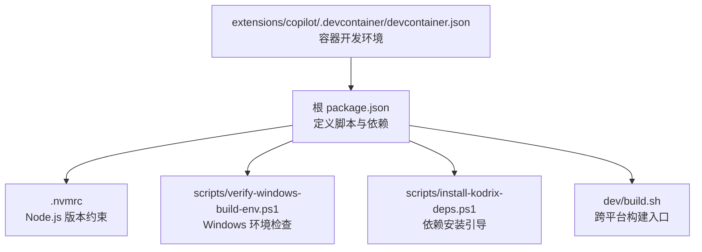
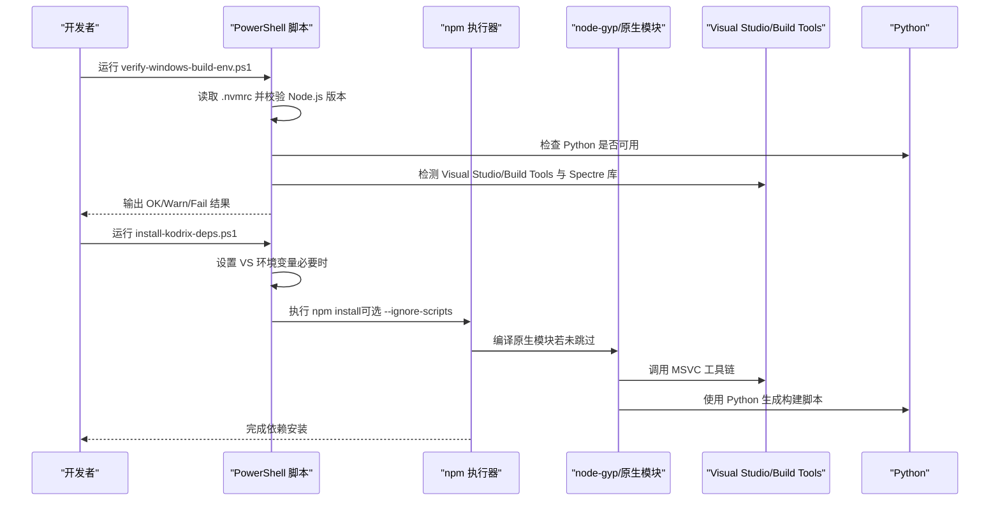
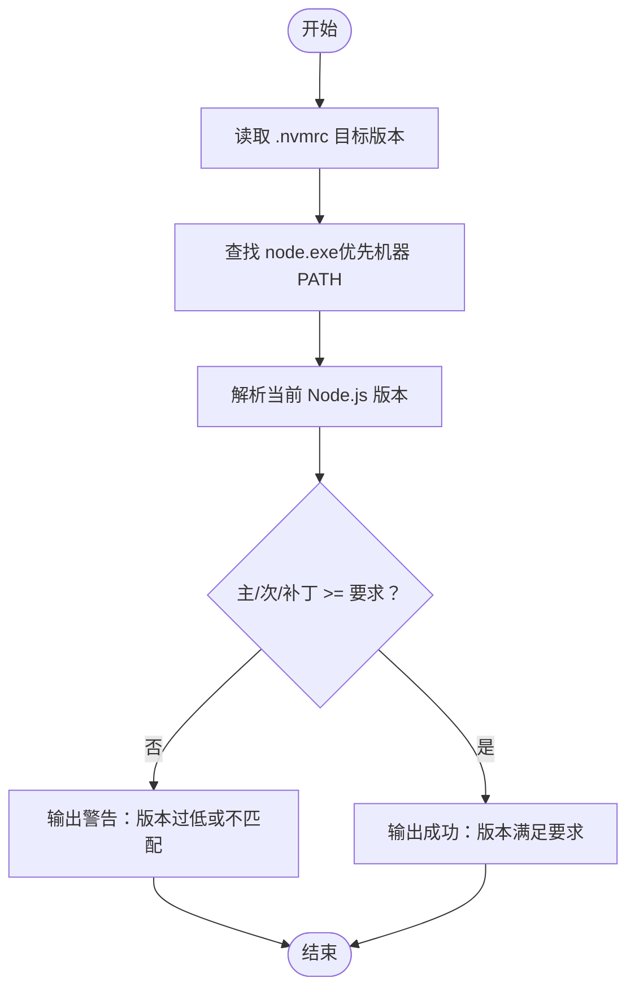
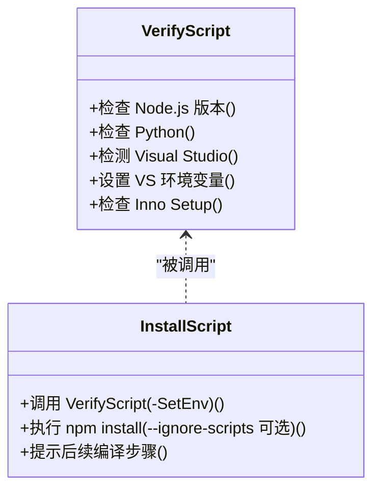
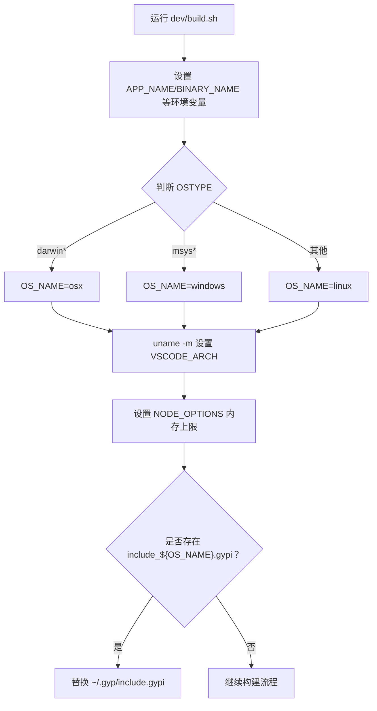
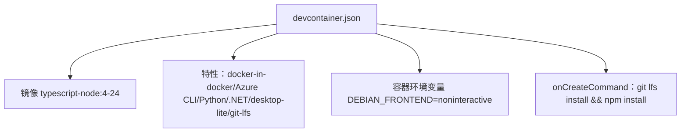
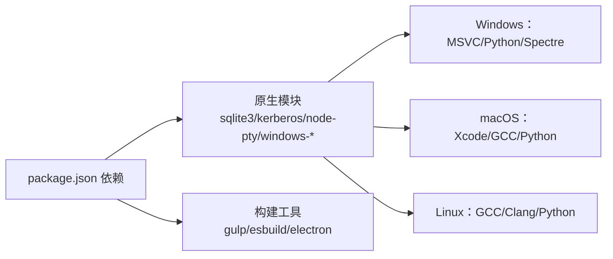

# 环境问题

<cite>
**本文引用的文件**   
- [.nvmrc](file://.nvmrc)
- [package.json](file://package.json)
- [dev/build.sh](file://dev/build.sh)
- [scripts/verify-windows-build-env.ps1](file://scripts/verify-windows-build-env.ps1)
- [scripts/install-kodrix-deps.ps1](file://scripts/install-kodrix-deps.ps1)
- [extensions/copilot/.devcontainer/devcontainer.json](file://extensions/copilot/.devcontainer/devcontainer.json)
- [REPAIR-NOTES.md](file://REPAIR-NOTES.md)
</cite>

## 目录
1. [简介](#简介)
2. [项目结构与环境入口](#项目结构与环境入口)
3. [核心环境依赖](#核心环境依赖)
4. [架构总览](#架构总览)
5. [详细组件分析](#详细组件分析)
6. [依赖关系分析](#依赖关系分析)
7. [性能与构建注意事项](#性能与构建注意事项)
8. [故障排查指南](#故障排查指南)
9. [结论](#结论)
10. [附录：环境与脚本速查](#附录环境与脚本速查)

## 简介
本文件面向 Kodrix 开发环境的常见问题，系统性说明 Node.js 版本要求、npm 包管理器行为、原生模块编译依赖、Windows/macOS/Linux 差异、端口与权限等系统级问题，以及 Docker 容器化环境配置与验证方法。文档以仓库中的实际配置文件和脚本为依据，帮助开发者快速定位并解决环境问题。

## 项目结构与环境入口
Kodrix 的环境准备与构建由根目录的 npm 脚本、平台相关脚本以及 dev 工具链共同驱动：
- 根 package.json 定义了安装、编译、测试、打包等脚本，并在 preinstall/postinstall 中调用构建钩子。
- .nvmrc 固定了 Node.js 版本，确保团队一致性。
- scripts 目录下提供 Windows 环境检查与依赖安装脚本。
- dev/build.sh 是跨平台构建辅助脚本，负责环境变量设置、架构识别与后续构建流程。
- extensions/copilot/.devcontainer/devcontainer.json 提供了基于 Node.js 24 的容器开发环境。

**图示来源**
- [package.json:12-100](file://package.json#L12-L100)
- [.nvmrc:1-2](file://.nvmrc#L1-L2)
- [scripts/verify-windows-build-env.ps1:96-127](file://scripts/verify-windows-build-env.ps1#L96-L127)
- [scripts/install-kodrix-deps.ps1:1-59](file://scripts/install-kodrix-deps.ps1#L1-L59)
- [dev/build.sh:1-21](file://dev/build.sh#L1-L21)
- [extensions/copilot/.devcontainer/devcontainer.json:1-39](file://extensions/copilot/.devcontainer/devcontainer.json#L1-L39)

**章节来源**
- [package.json:12-100](file://package.json#L12-L100)
- [.nvmrc:1-2](file://.nvmrc#L1-L2)
- [dev/build.sh:1-21](file://dev/build.sh#L1-L21)
- [extensions/copilot/.devcontainer/devcontainer.json:1-39](file://extensions/copilot/.devcontainer/devcontainer.json#L1-L39)

## 核心环境依赖
- Node.js 版本
  - 通过 .nvmrc 指定 Node.js 24.17.0，确保 TypeScript、Electron、原生模块与工具链兼容。
  - verify-windows-build-env.ps1 会读取 .nvmrc 或回退到 24.17.0，并与当前 node.exe 版本进行主/次/补丁级别比较。
- npm 与脚本钩子
  - package.json 的 preinstall/postinstall 调用 build/npm 下的脚本，用于预处理与后处理依赖。
  - 依赖中包含大量原生模块（如 sqlite3、kerberos、node-pty、windows-* 系列），需要正确的编译器与运行时。
- Windows 构建工具
  - verify-windows-build-env.ps1 检测 Visual Studio / Build Tools、Python、Inno Setup，并提示 Spectre 缓解库缺失风险。
  - install-kodrix-deps.ps1 在运行 npm install 前自动设置 VS 环境变量，避免非默认盘符导致的检测失败。
- macOS/Linux 构建
  - dev/build.sh 设置 NODE_OPTIONS、架构变量，并根据操作系统名选择构建路径；同时可覆盖 ~/.gyp/include.gypi 以适配原生模块编译。

**章节来源**
- [.nvmrc:1-2](file://.nvmrc#L1-L2)
- [package.json:12-23](file://package.json#L12-L23)
- [package.json:101-166](file://package.json#L101-L166)
- [scripts/verify-windows-build-env.ps1:96-191](file://scripts/verify-windows-build-env.ps1#L96-L191)
- [scripts/install-kodrix-deps.ps1:13-32](file://scripts/install-kodrix-deps.ps1#L13-L32)
- [dev/build.sh:74-75](file://dev/build.sh#L74-L75)
- [dev/build.sh:124-142](file://dev/build.sh#L124-L142)

## 架构总览
下图展示从“环境检查”到“依赖安装”再到“构建/启动”的关键流程，体现 Node.js 版本、VS Build Tools、Python、npm 钩子之间的协作关系。

**图示来源**
- [scripts/verify-windows-build-env.ps1:96-191](file://scripts/verify-windows-build-env.ps1#L96-L191)
- [scripts/install-kodrix-deps.ps1:13-32](file://scripts/install-kodrix-deps.ps1#L13-L32)
- [package.json:12-23](file://package.json#L12-L23)

## 详细组件分析

### Node.js 版本管理与 .nvmrc
- .nvmrc 固定 Node.js 24.17.0，作为项目最低且推荐的运行时版本。
- verify-windows-build-env.ps1 优先从机器 PATH 解析 node.exe，避免被会话注入的其他 Node 抢占；随后比较主/次/补丁版本，给出警告或成功提示。
- 建议通过 nvm/nvs 等版本管理工具安装并切换至 24.17.0，确保全局与项目一致。

**图示来源**
- [.nvmrc:1-2](file://.nvmrc#L1-L2)
- [scripts/verify-windows-build-env.ps1:96-127](file://scripts/verify-windows-build-env.ps1#L96-L127)

**章节来源**
- [.nvmrc:1-2](file://.nvmrc#L1-L2)
- [scripts/verify-windows-build-env.ps1:96-127](file://scripts/verify-windows-build-env.ps1#L96-L127)

### Windows 构建工具与 node-gyp
- verify-windows-build-env.ps1 检测 vswhere.exe，进而定位 Visual Studio 安装实例；若注册表存在 SxS\VC7 键值，则回退检测。
- 脚本支持设置 vs2026_install/vs2022_install/vs2019_install 环境变量，便于 npm preinstall 正确识别 VS 路径。
- 原生模块编译依赖 Python 与 MSVC 工具链；若缺少 Spectre 缓解库，npm install 可能失败。
- install-kodrix-deps.ps1 在运行 npm install 前自动调用 verify-windows-build-env.ps1 -SetEnv，减少手动配置成本。

**图示来源**
- [scripts/verify-windows-build-env.ps1:25-91](file://scripts/verify-windows-build-env.ps1#L25-L91)
- [scripts/verify-windows-build-env.ps1:138-191](file://scripts/verify-windows-build-env.ps1#L138-L191)
- [scripts/install-kodrix-deps.ps1:13-32](file://scripts/install-kodrix-deps.ps1#L13-L32)

**章节来源**
- [scripts/verify-windows-build-env.ps1:25-91](file://scripts/verify-windows-build-env.ps1#L25-L91)
- [scripts/verify-windows-build-env.ps1:138-191](file://scripts/verify-windows-build-env.ps1#L138-L191)
- [scripts/install-kodrix-deps.ps1:13-32](file://scripts/install-kodrix-deps.ps1#L13-L32)

### macOS/Linux 构建差异
- dev/build.sh 根据 OSTYPE 设置 OS_NAME（darwin/windows/linux），并依据 uname -m 设置 VSCODE_ARCH。
- 设置 NODE_OPTIONS 以提升内存上限，避免大型工程构建时内存不足。
- 当存在 include_osx.gypi 时，脚本会替换 ~/.gyp/include.gypi，以适配原生模块编译需求。

**图示来源**
- [dev/build.sh:8-21](file://dev/build.sh#L8-L21)
- [dev/build.sh:46-75](file://dev/build.sh#L46-L75)
- [dev/build.sh:124-142](file://dev/build.sh#L124-L142)

**章节来源**
- [dev/build.sh:8-21](file://dev/build.sh#L8-L21)
- [dev/build.sh:46-75](file://dev/build.sh#L46-L75)
- [dev/build.sh:124-142](file://dev/build.sh#L124-L142)

### Docker 容器化环境
- extensions/copilot/.devcontainer/devcontainer.json 使用 mcr.microsoft.com/devcontainers/typescript-node:4-24 镜像，内置 Node.js 24 与 TypeScript 工具链。
- 启用 docker-in-docker、Azure CLI、Python、.NET、desktop-lite、git-lfs 等特性，便于扩展开发与调试。
- onCreateCommand 初始化 git lfs 并尝试 npm install，保证容器内依赖就绪。

**图示来源**
- [extensions/copilot/.devcontainer/devcontainer.json:1-39](file://extensions/copilot/.devcontainer/devcontainer.json#L1-L39)

**章节来源**
- [extensions/copilot/.devcontainer/devcontainer.json:1-39](file://extensions/copilot/.devcontainer/devcontainer.json#L1-L39)

## 依赖关系分析
- Node.js 与原生模块
  - package.json 的 dependencies 包含多个原生模块（sqlite3、kerberos、node-pty、windows-* 系列），这些模块在 Windows 上需要 MSVC 工具链，在 Linux/macOS 上需要系统头文件与编译器。
  - overrides 中对 node-gyp-build、kerberos、ssh2 等进行版本锁定，以减少依赖冲突。
- npm 钩子与构建脚本
  - preinstall/postinstall 调用 build/npm 下的脚本，用于预处理与后处理依赖；具体逻辑位于 build 目录（不在本文引用范围内）。
- 构建工具链
  - Windows：Visual Studio/Build Tools、Python、Inno Setup。
  - macOS/Linux：Xcode Command Line Tools 或 GCC/Clang、Python、gyp/gypi 配置。

**图示来源**
- [package.json:101-166](file://package.json#L101-L166)
- [package.json:273-283](file://package.json#L273-L283)

**章节来源**
- [package.json:101-166](file://package.json#L101-L166)
- [package.json:273-283](file://package.json#L273-L283)

## 性能与构建注意事项
- 构建内存
  - dev/build.sh 设置 NODE_OPTIONS="--max-old-space-size=8192"，提升 Node.js 堆内存上限，避免大型工程构建时内存不足。
- 并行任务
  - package.json 的 gulp 脚本使用较大的 max-old-space-size，确保 gulp 任务稳定运行。
- 原生模块缓存
  - 若多次安装失败，建议清理 node_modules 与 npm cache，并重新安装；Windows 下确保 VS 环境变量正确。

**章节来源**
- [dev/build.sh:74-75](file://dev/build.sh#L74-L75)
- [package.json:56-56](file://package.json#L56-L56)

## 故障排查指南

### Node.js 版本不兼容
- 现象
  - 构建或运行时报 Node.js API 不兼容、TypeScript 类型错误、Electron 预编译二进制不匹配。
- 原因
  - 当前 Node.js 版本低于 .nvmrc 要求的 24.17.0，或主/次版本不一致。
- 解决
  - 使用 nvm/nvs 安装并切换到 Node.js 24.17.0。
  - 在 PowerShell 中运行 verify-windows-build-env.ps1 确认版本匹配。

**章节来源**
- [.nvmrc:1-2](file://.nvmrc#L1-L2)
- [scripts/verify-windows-build-env.ps1:96-127](file://scripts/verify-windows-build-env.ps1#L96-L127)

### npm 包管理器冲突
- 现象
  - npm install 报依赖树冲突、overrides 不生效、某些包版本异常。
- 原因
  - 全局 npm 与项目锁文件不一致，或第三方包引入的依赖版本与 overrides 冲突。
- 解决
  - 删除 node_modules 与 package-lock.json，重新执行 npm install。
  - 检查 package.json 的 overrides 是否正确锁定关键依赖（如 node-gyp-build、kerberos、ssh2）。

**章节来源**
- [package.json:273-283](file://package.json#L273-L283)

### 原生模块编译失败（node-gyp）
- 现象
  - npm install 报 MSB4019、找不到 python、找不到 cl.exe、Spectre 库缺失等错误。
- 原因
  - 缺少 Visual Studio/Build Tools、Python、Spectre 缓解库，或 VS 安装在非默认盘符导致环境变量未设置。
- 解决
  - 运行 verify-windows-build-env.ps1 查看缺失项；按需安装 Visual Studio 工作负载与 Spectre 组件。
  - 运行 install-kodrix-deps.ps1 自动设置 VS 环境变量后再执行 npm install。
  - 若已跳过原生模块（--ignore-scripts），需补装完整依赖并重新编译。

**章节来源**
- [scripts/verify-windows-build-env.ps1:138-191](file://scripts/verify-windows-build-env.ps1#L138-L191)
- [scripts/install-kodrix-deps.ps1:13-32](file://scripts/install-kodrix-deps.ps1#L13-L32)
- [REPAIR-NOTES.md:39-48](file://REPAIR-NOTES.md#L39-L48)

### 端口占用
- 现象
  - 启动 code-server 或 web 服务时报端口已被占用。
- 原因
  - 已有进程监听相同端口，或上次进程未正常退出。
- 解决
  - 使用系统命令（如 netstat、Get-NetTCPConnection）查找占用端口的进程并终止。
  - 重启终端或 IDE，确保无残留进程。

[本节为通用排查建议，不直接分析具体文件]

### 权限不足
- 现象
  - npm install 或写入 node_modules 时报权限错误；Windows 下出现管理员权限提示。
- 原因
  - 项目路径受系统保护，或用户账户权限不足。
- 解决
  - 以管理员身份运行终端（Windows）或使用 sudo（Linux/macOS）。
  - 将项目移动到用户目录，避免系统目录权限限制。

[本节为通用排查建议，不直接分析具体文件]

### 路径过长（Windows）
- 现象
  - npm install 或构建时报路径过长、无法访问文件。
- 原因
  - Windows 路径长度限制（MAX_PATH）导致文件系统操作失败。
- 解决
  - 启用长路径支持（组策略或注册表），或将项目移动到较短路径（如 D:\kodrix）。
  - 清理 node_modules 后重试安装。

[本节为通用排查建议，不直接分析具体文件]

### Docker 容器化部署问题
- 现象
  - 容器内 npm install 失败、git lfs 未初始化、依赖缺失。
- 原因
  - 镜像未包含必要工具、网络受限、git lfs 未安装。
- 解决
  - 使用 extensions/copilot/.devcontainer/devcontainer.json 提供的镜像与特性。
  - 确保 onCreateCommand 执行 git lfs install 与 npm install。
  - 检查容器网络与代理设置。

**章节来源**
- [extensions/copilot/.devcontainer/devcontainer.json:1-39](file://extensions/copilot/.devcontainer/devcontainer.json#L1-L39)

## 结论
Kodrix 的开发环境以 Node.js 24.17.0 为核心，配合 npm 脚本与平台相关工具链完成依赖安装与构建。Windows 环境下需重点配置 Visual Studio/Build Tools、Python 与 Spectre 库；macOS/Linux 需关注 gyp/gypi 配置与系统编译器。Docker 容器环境提供一致的 Node.js 24 基础镜像，便于团队协作与持续集成。通过 verify-windows-build-env.ps1 与 install-kodrix-deps.ps1 可快速定位并修复常见环境问题。

## 附录：环境与脚本速查
- 版本管理
  - .nvmrc：固定 Node.js 24.17.0。
- Windows 环境检查
  - scripts/verify-windows-build-env.ps1：检查 Node.js、Python、Visual Studio、Inno Setup，并可设置 VS 环境变量。
- 依赖安装
  - scripts/install-kodrix-deps.ps1：自动设置 VS 环境变量并执行 npm install（可选跳过原生模块）。
- 构建入口
  - dev/build.sh：设置环境变量、架构、NODE_OPTIONS，并处理 gyp 配置。
- 容器环境
  - extensions/copilot/.devcontainer/devcontainer.json：基于 typescript-node:4-24 的容器开发环境。

**章节来源**
- [.nvmrc:1-2](file://.nvmrc#L1-L2)
- [scripts/verify-windows-build-env.ps1:96-191](file://scripts/verify-windows-build-env.ps1#L96-L191)
- [scripts/install-kodrix-deps.ps1:1-59](file://scripts/install-kodrix-deps.ps1#L1-L59)
- [dev/build.sh:74-75](file://dev/build.sh#L74-L75)
- [dev/build.sh:124-142](file://dev/build.sh#L124-L142)
- [extensions/copilot/.devcontainer/devcontainer.json:1-39](file://extensions/copilot/.devcontainer/devcontainer.json#L1-L39)