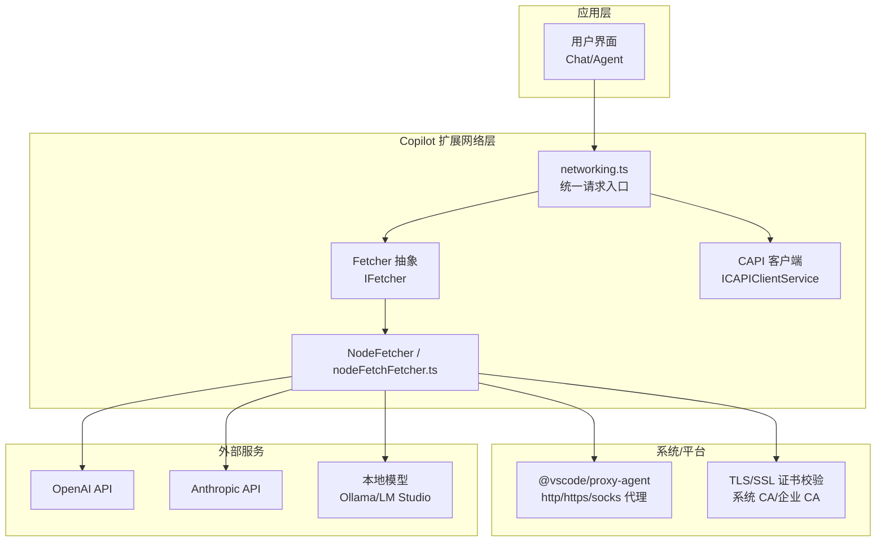
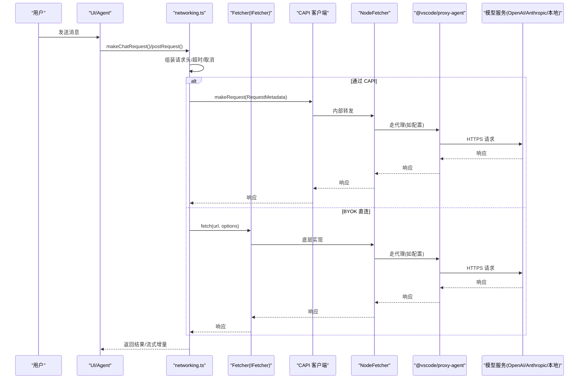
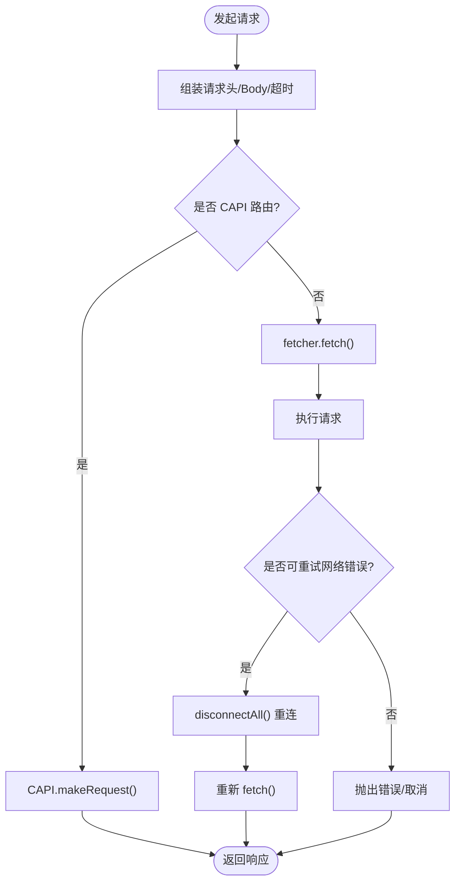
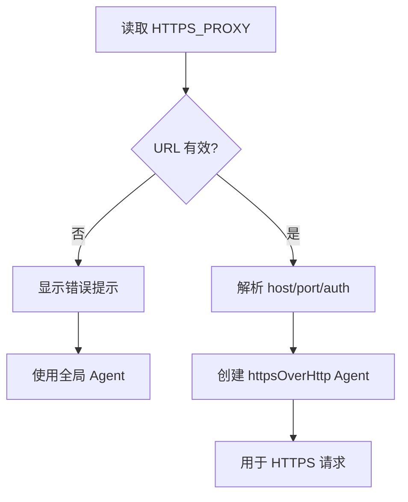
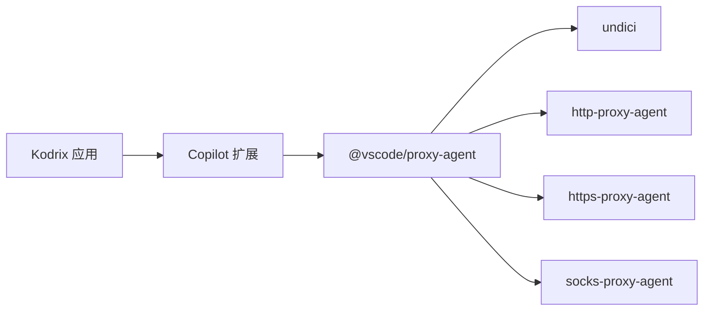

# 网络问题

<cite>
**本文引用的文件**   
- [extensions/copilot/src/platform/networking/common/networking.ts](file://extensions/copilot/src/platform/networking/common/networking.ts)
- [extensions/configuration-editing/src/node/net.ts](file://extensions/configuration-editing/src/node/net.ts)
- [src/vs/base/common/network.ts](file://src/vs/base/common/network.ts)
- [remote/package-lock.json](file://remote/package-lock.json)
- [extensions/copilot/src/extension/chatSessions/claude/common/claudeMessageDispatch.ts](file://extensions/copilot/src/extension/chatSessions/claude/common/claudeMessageDispatch.ts)
- [extensions/copilot/src/platform/networking/node/nodeFetchFetcher.ts](file://extensions/copilot/src/platform/networking/node/nodeFetchFetcher.ts)
- [extensions/copilot/src/platform/networking/node/nodeFetcher.ts](file://extensions/copilot/src/platform/networking/node/nodeFetcher.ts)
</cite>

## 目录
1. [简介](#简介)
2. [项目结构](#项目结构)
3. [核心组件](#核心组件)
4. [架构总览](#架构总览)
5. [详细组件分析](#详细组件分析)
6. [依赖关系分析](#依赖关系分析)
7. [性能与可靠性优化](#性能与可靠性优化)
8. [故障排查指南](#故障排查指南)
9. [结论](#结论)
10. [附录：错误码与诊断清单](#附录错误码与诊断清单)

## 简介
本文件面向 Kodrix 在网络连接方面的常见问题与解决方案，覆盖 AI 模型服务连接失败、代理配置、SSL/TLS 证书、企业内网策略、WebSocket 连接、超时与重试机制、日志分析与错误码对照等。文档基于代码库中的网络层实现与扩展（Copilot）的网络请求路径进行梳理，帮助你在不同供应商（OpenAI、Anthropic、本地模型等）与企业网络环境下快速定位并解决问题。

## 项目结构
Kodrix 的网络能力由两部分组成：
- 基础网络与协议工具：定义 URI scheme、远程资源重写、COOP/COEP 安全头处理等。
- Copilot 扩展的网络栈：统一的 fetcher 抽象、CAPI（Copilot 代理）路由、BYOK（自带密钥）直连、超时与重试、WebSocket 支持、头部注入与遥测。

图表来源
- [extensions/copilot/src/platform/networking/common/networking.ts:470-548](file://extensions/copilot/src/platform/networking/common/networking.ts#L470-L548)
- [remote/package-lock.json:649-667](file://remote/package-lock.json#L649-L667)

章节来源
- [extensions/copilot/src/platform/networking/common/networking.ts:26-42](file://extensions/copilot/src/platform/networking/common/networking.ts#L26-L42)
- [remote/package-lock.json:649-667](file://remote/package-lock.json#L649-L667)

## 核心组件
- 统一网络请求入口：负责组装请求头、选择 CAPI 或直连、设置超时、处理取消与重试。
- Fetcher 抽象：屏蔽底层 HTTP/WebSocket 差异，提供断线检测、用户友好错误信息、分页拉取等能力。
- CAPI 客户端：当 endpoint 为 RequestMetadata 时，通过 Copilot 代理发起请求；否则直接调用 fetcher。
- 代理与 TLS：通过 @vscode/proxy-agent 支持 http/https/socks 代理，结合系统 CA 与企业 CA 完成证书校验。
- 基础网络工具：URI scheme、远程资源重写、COOP/COEP 头处理等。

章节来源
- [extensions/copilot/src/platform/networking/common/networking.ts:470-548](file://extensions/copilot/src/platform/networking/common/networking.ts#L470-L548)
- [extensions/copilot/src/platform/networking/common/networking.ts:31-42](file://extensions/copilot/src/platform/networking/common/networking.ts#L31-L42)
- [src/vs/base/common/network.ts:385-440](file://src/vs/base/common/network.ts#L385-L440)

## 架构总览
下图展示了从 Chat/Agent 到模型服务的完整网络流程，包括 CAPI 代理与 BYOK 直连两种路径，以及代理与 TLS 的作用点。

图表来源
- [extensions/copilot/src/platform/networking/common/networking.ts:470-548](file://extensions/copilot/src/platform/networking/common/networking.ts#L470-L548)
- [remote/package-lock.json:649-667](file://remote/package-lock.json#L649-L667)

## 详细组件分析

### 统一网络请求与重试
- 请求构造：统一注入 Authorization、X-Request-Id、OpenAI-Intent、X-GitHub-Api-Version、X-Interaction-Type、X-Agent-Task-Id 等头部。
- 超时控制：默认请求超时 30 秒。
- 取消支持：通过 AbortController 将 CancellationToken 映射为信号，取消时上报遥测。
- 重试策略：对特定网络错误（如 ECONNRESET、ETIMEDOUT、ERR_CONNECTION_RESET、ERR_NETWORK_CHANGED、HTTP/2 相关错误、ERR_FAILED）在断开后自动重连并重试一次。

图表来源
- [extensions/copilot/src/platform/networking/common/networking.ts:470-548](file://extensions/copilot/src/platform/networking/common/networking.ts#L470-L548)
- [extensions/copilot/src/platform/networking/common/networking.ts:551-563](file://extensions/copilot/src/platform/networking/common/networking.ts#L551-L563)

章节来源
- [extensions/copilot/src/platform/networking/common/networking.ts:470-548](file://extensions/copilot/src/platform/networking/common/networking.ts#L470-L548)
- [extensions/copilot/src/platform/networking/common/networking.ts:551-563](file://extensions/copilot/src/platform/networking/common/networking.ts#L551-L563)

### 代理配置与 HTTPS_PROXY
- 配置来源：读取环境变量 HTTPS_PROXY，解析 host/port/auth，使用 tunnel 创建 httpsOverHttp Agent。
- 异常处理：若环境变量无效，弹出错误提示并回退到全局 Agent。
- 依赖：@vscode/proxy-agent 支持 http/https/socks 代理，可选 Windows CA 证书包。

图表来源
- [extensions/configuration-editing/src/node/net.ts:17-29](file://extensions/configuration-editing/src/node/net.ts#L17-L29)
- [remote/package-lock.json:649-667](file://remote/package-lock.json#L649-L667)

章节来源
- [extensions/configuration-editing/src/node/net.ts:1-30](file://extensions/configuration-editing/src/node/net.ts#L1-L30)
- [remote/package-lock.json:649-667](file://remote/package-lock.json#L649-L667)

### SSL/TLS 证书与安全头
- COOP/COEP：根据 URL 参数动态注入 Cross-Origin-Opener-Policy/Cross-Origin-Embedder-Policy 头，以启用跨源隔离能力。
- 证书校验：依赖系统 CA 与企业 CA（Windows 可选 @vscode/windows-ca-certs），确保代理与目标站点证书链正确。

章节来源
- [src/vs/base/common/network.ts:393-440](file://src/vs/base/common/network.ts#L393-L440)
- [remote/package-lock.json:649-667](file://remote/package-lock.json#L649-L667)

### WebSocket 与流式响应
- 支持 useWebSocket 选项，适用于长连接场景（如流式生成）。
- 会话复用：conversationId 可用于连接级状态复用，减少握手开销。
- 错误透传：代理侧错误可通过前缀标记（VSCODE_PROXY_ERROR）嵌入 SDK 文本，便于上层识别与处理。

章节来源
- [extensions/copilot/src/platform/networking/common/networking.ts:190-252](file://extensions/copilot/src/platform/networking/common/networking.ts#L190-L252)
- [extensions/copilot/src/extension/chatSessions/claude/common/claudeMessageDispatch.ts:132-149](file://extensions/copilot/src/extension/chatSessions/claude/common/claudeMessageDispatch.ts#L132-L149)
- [extensions/copilot/src/extension/chatSessions/claude/common/claudeMessageDispatch.ts:749-791](file://extensions/copilot/src/extension/chatSessions/claude/common/claudeMessageDispatch.ts#L749-L791)

### 多模型供应商连接要点
- OpenAI：通过 CAPI 或 BYOK 直连均可；注意 Authorization 头归属（ownsAuthorization）避免泄露 CAPI Token。
- Anthropic：同样支持 CAPI/BYOK；注意 thinking/reasoning 字段与流式 delta 的兼容。
- 本地模型（Ollama/LM Studio）：通常 BYOK 直连，需确保本地端口可达、防火墙放行、代理不拦截。

章节来源
- [extensions/copilot/src/platform/networking/common/networking.ts:321-418](file://extensions/copilot/src/platform/networking/common/networking.ts#L321-L418)

## 依赖关系分析
- @vscode/proxy-agent：封装 http-proxy-agent、https-proxy-agent、socks-proxy-agent，统一代理接入。
- undici：高性能 HTTP/HTTPS 客户端，被 proxy-agent 依赖。
- 其他：debug、agent-base 等辅助库。

图表来源
- [remote/package-lock.json:649-667](file://remote/package-lock.json#L649-L667)

章节来源
- [remote/package-lock.json:649-667](file://remote/package-lock.json#L649-L667)

## 性能与可靠性优化
- 连接池：优先复用连接（WebSocket conversationId），减少握手成本。
- 超时与重试：合理设置超时（默认 30s），对瞬态网络错误自动重连并重试一次。
- 缓存策略：对非敏感元数据（如模型列表）启用短 TTL 缓存，降低频繁请求。
- 负载均衡：多实例本地模型或网关后端时，按健康检查轮询。
- 头部精简：仅注入必要头部，避免触发严格 APIM 策略拒绝。

[本节为通用建议，无需源码引用]

## 故障排查指南

### 常见症状与定位
- 无法连接 OpenAI/Anthropic：
  - 检查 HTTPS_PROXY 是否正确，代理类型（http/https/socks）是否匹配。
  - 确认企业 CA 已导入，证书链完整。
  - 观察是否出现 ERR_HTTP2_* 或 ERR_FAILED，必要时触发 disconnectAll 后重试。
- 本地模型不可达：
  - 确认本地端口开放、防火墙放行。
  - 若经过代理，确保代理白名单包含 localhost 或指定地址。
- WebSocket 连接不稳定：
  - 检查中间设备（防火墙/代理）是否阻断 ws/wss。
  - 关注 VSCODE_PROXY_ERROR 前缀的错误文本，定位代理侧拦截原因。

章节来源
- [extensions/copilot/src/platform/networking/common/networking.ts:551-563](file://extensions/copilot/src/platform/networking/common/networking.ts#L551-L563)
- [extensions/copilot/src/platform/networking/node/nodeFetcher.ts:141-141](file://extensions/copilot/src/platform/networking/node/nodeFetcher.ts#L141-L141)
- [extensions/copilot/src/platform/networking/node/nodeFetchFetcher.ts:55-55](file://extensions/copilot/src/platform/networking/node/nodeFetchFetcher.ts#L55-L55)
- [extensions/copilot/src/extension/chatSessions/claude/common/claudeMessageDispatch.ts:749-791](file://extensions/copilot/src/extension/chatSessions/claude/common/claudeMessageDispatch.ts#L749-L791)

### 代理配置检查清单
- 环境变量 HTTPS_PROXY 格式正确（含协议、主机、端口、认证）。
- 代理支持所需协议（http/https/socks）。
- 企业 CA 已安装至系统信任库。
- 防火墙允许出站访问目标域名与端口。
- 若使用 SOCKS，确认 socks-proxy-agent 可用。

章节来源
- [extensions/configuration-editing/src/node/net.ts:17-29](file://extensions/configuration-editing/src/node/net.ts#L17-L29)
- [remote/package-lock.json:649-667](file://remote/package-lock.json#L649-L667)

### SSL/TLS 证书问题
- 现象：证书不受信任、吊销检查失败、自签名证书报错。
- 处理：
  - 安装企业 CA 根证书。
  - 对于自签名本地模型，仅在受控环境临时禁用校验（不推荐生产）。
  - 检查代理是否进行 MITM 解密，确保代理证书可信。

章节来源
- [src/vs/base/common/network.ts:393-440](file://src/vs/base/common/network.ts#L393-L440)
- [remote/package-lock.json:649-667](file://remote/package-lock.json#L649-L667)

### 超时与重试调优
- 默认超时 30 秒，可根据网络质量调整。
- 对 ECONNRESET/ETIMEDOUT/ERR_CONNECTION_RESET/ERR_NETWORK_CHANGED/HTTP/2 错误自动重连并重试一次。
- 若频繁触发，检查代理稳定性、DNS 解析、运营商劫持。

章节来源
- [extensions/copilot/src/platform/networking/common/networking.ts:55-57](file://extensions/copilot/src/platform/networking/common/networking.ts#L55-L57)
- [extensions/copilot/src/platform/networking/common/networking.ts:551-563](file://extensions/copilot/src/platform/networking/common/networking.ts#L551-L563)

### WebSocket 连接问题
- 现象：连接建立成功但中断、流式输出卡顿。
- 排查：
  - 检查代理是否支持 wss 透传。
  - 观察是否出现代理侧错误前缀（VSCODE_PROXY_ERROR）。
  - 使用 conversationId 复用连接，减少握手失败概率。

章节来源
- [extensions/copilot/src/platform/networking/common/networking.ts:190-252](file://extensions/copilot/src/platform/networking/common/networking.ts#L190-L252)
- [extensions/copilot/src/extension/chatSessions/claude/common/claudeMessageDispatch.ts:132-149](file://extensions/copilot/src/extension/chatSessions/claude/common/claudeMessageDispatch.ts#L132-L149)

## 结论
Kodrix 的网络层通过统一的 fetcher 抽象与 CAPI 路由，兼顾了代理、TLS、超时重试与 WebSocket 等关键能力。在企业环境中，重点保障代理配置正确、CA 证书可信、防火墙放行目标域名与端口，并结合日志与错误码快速定位问题。针对多模型供应商，遵循 CAPI/BYOK 的鉴权边界与头部规范，可有效避免令牌泄露与策略拒绝。

[本节为总结性内容，无需源码引用]

## 附录：错误码与诊断清单

### 错误码对照表
- ECONNREFUSED：目标端口不可达或被拒绝。
- ETIMEDOUT：请求超时。
- EADDRINUSE：端口已被占用。
- ENOTFOUND：DNS 解析失败。
- EPIPE：管道破裂（上游关闭）。
- ECONNRESET：连接被重置。
- ERR_CONNECTION_RESET：连接重置。
- ERR_NETWORK_CHANGED：网络变化。
- ERR_HTTP2_INVALID_SESSION：HTTP/2 会话无效。
- ERR_HTTP2_STREAM_CANCEL：HTTP/2 流被取消。
- ERR_HTTP2_GOAWAY_SESSION：服务端 GOAWAY。
- ERR_HTTP2_PROTOCOL_ERROR：HTTP/2 协议错误。
- ERR_FAILED：通用失败。

章节来源
- [extensions/copilot/src/platform/networking/common/networking.ts:551-563](file://extensions/copilot/src/platform/networking/common/networking.ts#L551-L563)
- [extensions/copilot/src/platform/networking/node/nodeFetcher.ts:141-141](file://extensions/copilot/src/platform/networking/node/nodeFetcher.ts#L141-L141)
- [extensions/copilot/src/platform/networking/node/nodeFetchFetcher.ts:55-55](file://extensions/copilot/src/platform/networking/node/nodeFetchFetcher.ts#L55-L55)

### 诊断步骤
- 验证代理：检查 HTTPS_PROXY 环境变量与代理类型。
- 验证证书：确认系统 CA 与企业 CA 已安装。
- 验证连通性：curl/wget/curl --resolve 测试目标域名与端口。
- 捕获日志：开启调试日志，关注 VSCODE_PROXY_ERROR 前缀。
- 重试与重连：观察是否触发 disconnectAll 与自动重试。
- 浏览器/代理抓包：使用 Wireshark/mitmproxy 分析握手与证书链。

[本节为通用操作指南，无需源码引用]