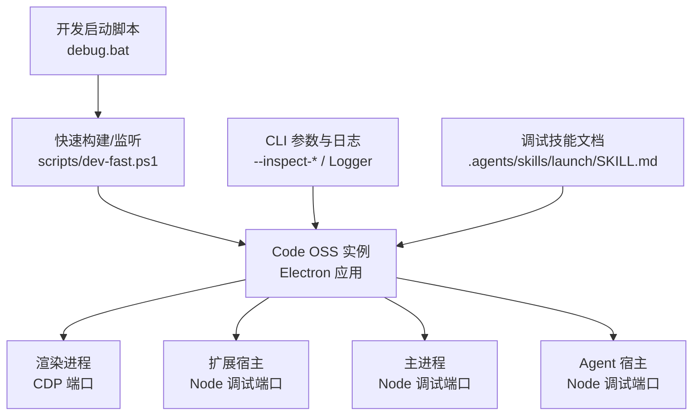
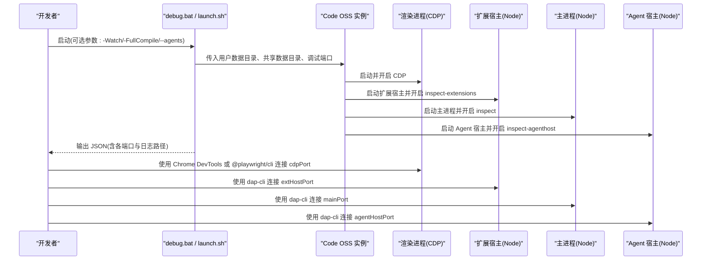
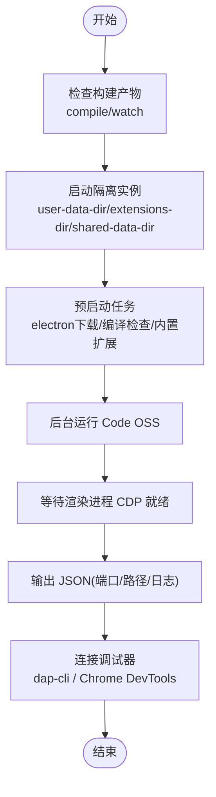
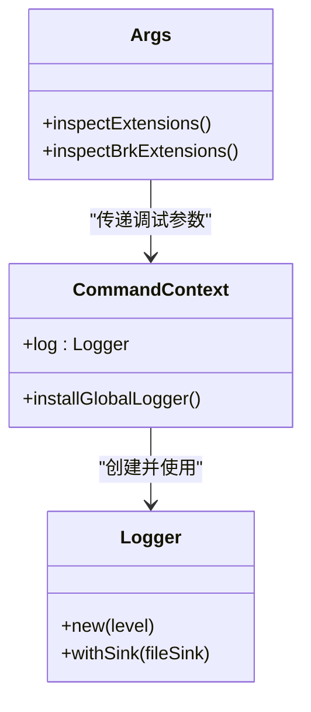
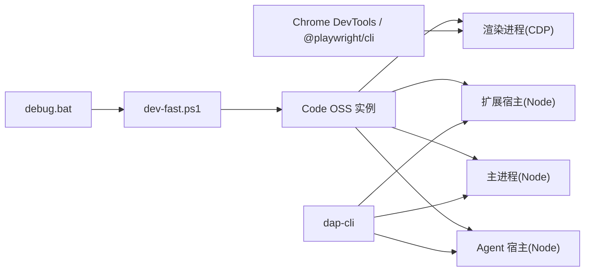

# 调试指南

<cite>
**本文引用的文件**   
- [SKILL.md](file://.agents/skills/launch/SKILL.md)
- [launch.sh](file://.agents/skills/launch/scripts/launch.sh)
- [debug.bat](file://debug.bat)
- [CLAUDE.md](file://.claude/CLAUDE.md)
- [args.rs](file://cli/src/commands/args.rs)
- [main.rs](file://cli/src/bin/code/main.rs)
</cite>

## 目录
1. [简介](#简介)
2. [项目结构](#项目结构)
3. [核心组件](#核心组件)
4. [架构总览](#架构总览)
5. [详细组件分析](#详细组件分析)
6. [依赖关系分析](#依赖关系分析)
7. [性能与内存优化](#性能与内存优化)
8. [故障排查指南](#故障排查指南)
9. [结论](#结论)
10. [附录](#附录)

## 简介
本指南面向 Kodrix（基于 VS Code 源码构建的 IDE）开发者，系统化介绍断点调试、日志分析、性能分析与远程/容器化调试方法。内容覆盖：
- 如何启用调试模式并启动多进程实例
- 如何在 VS Code 中配置 Node 与 CDP 调试器
- 如何设置断点、观察变量、附加到渲染进程/扩展宿主/主进程/Agent 宿主
- 日志系统的使用与定位（CLI 日志、Electron 日志、输出通道）
- 错误堆栈分析方法与常见错误模式
- Electron 主进程与渲染进程的调试要点
- 扩展宿主与 Agent 宿主的调试方式
- 远程调试与容器化环境注意事项
- Chrome DevTools 调试 Webview 界面
- 最佳实践与常见问题解决方案

## 项目结构
Kodrix 的调试入口主要分布在以下位置：
- 开发启动脚本：根目录 debug.bat 调用 scripts/dev-fast.ps1，支持快速编译、监听与全量编译模式
- CLI 参数与日志：Rust CLI 提供 --inspect-* 系列参数与全局日志安装
- 调试技能文档：.agents/skills/launch/SKILL.md 提供完整的“启动 + 调试”工作流，包括端口分配、CDP、dap-cli 使用
- 扩展开发规范：.claude/CLAUDE.md 强调使用 OutputChannel 进行日志记录，避免 console.log

**图示来源**
- [debug.bat:1-58](file://debug.bat#L1-L58)
- [SKILL.md:86-93](file://.agents/skills/launch/SKILL.md#L86-L93)
- [args.rs:730-733](file://cli/src/commands/args.rs#L730-L733)
- [main.rs:153-163](file://cli/src/bin/code/main.rs#L153-L163)

**章节来源**
- [debug.bat:1-58](file://debug.bat#L1-L58)
- [SKILL.md:1-339](file://.agents/skills/launch/SKILL.md#L1-L339)
- [args.rs:730-733](file://cli/src/commands/args.rs#L730-L733)
- [main.rs:153-163](file://cli/src/bin/code/main.rs#L153-L163)

## 核心组件
- 启动与调试流程
  - 通过 debug.bat 或 SKILL.md 提供的 launch.sh 启动隔离的用户数据目录与独立端口
  - 自动等待渲染进程 CDP 就绪后输出 JSON，包含 pid、cdpPort、extHostPort、mainPort、agentHostPort、userDataDir、extensionsDir、sharedDataDir、runDir、logFile 等关键信息
- 调试端口与目标
  - cdpPort：渲染进程（浏览器侧），用于 @playwright/cli 与 Chrome DevTools
  - extHostPort：扩展宿主（Node），用于 dap-cli
  - mainPort：Electron 主进程（Node），用于 dap-cli
  - agentHostPort：Agent 宿主（Node），用于 dap-cli
- CLI 日志与全局日志
  - Rust CLI 提供 make_logger 初始化日志级别、文件输出；命令上下文可安装全局 logger
- 扩展日志规范
  - 扩展应使用 vscode.OutputChannel 进行日志输出，避免 console.log/console.warn

**章节来源**
- [SKILL.md:68-93](file://.agents/skills/launch/SKILL.md#L68-L93)
- [SKILL.md:273-284](file://.agents/skills/launch/SKILL.md#L273-L284)
- [main.rs:43-58](file://cli/src/bin/code/main.rs#L43-L58)
- [main.rs:153-163](file://cli/src/bin/code/main.rs#L153-L163)
- [CLAUDE.md:39-46](file://.claude/CLAUDE.md#L39-L46)

## 架构总览
下图展示从启动到调试的关键路径：开发脚本触发构建与运行，Electron 应用启动多个子进程，分别暴露调试端口；开发者通过 dap-cli 或 Chrome DevTools 连接对应端口进行断点调试与 UI 自动化。

**图示来源**
- [SKILL.md:68-93](file://.agents/skills/launch/SKILL.md#L68-L93)
- [SKILL.md:273-284](file://.agents/skills/launch/SKILL.md#L273-L284)
- [args.rs:730-733](file://cli/src/commands/args.rs#L730-L733)

## 详细组件分析

### 启动与调试流程（SKILL.md 与 launch.sh）
- 启动前准备
  - 确保已执行 npm run compile 或 watch，以生成客户端与内置扩展输出
  - 使用隔离的用户数据目录与 extensions 目录，避免冲突
- 启动后行为
  - 预启动阶段完成 electron 下载、编译检查、内置扩展处理
  - 后台启动 Code OSS，阻塞直到渲染进程 CDP 端口可用
  - 输出 JSON 行，供外部工具解析（jq 示例）
- 端口用途
  - cdpPort：渲染进程，适合 UI 自动化与浏览器侧调试
  - extHostPort：扩展宿主，适合扩展代码断点
  - mainPort：主进程，适合 Electron 生命周期与 IPC 调试
  - agentHostPort：Agent 宿主，适合 Agent 会话与 Provider 调试

**图示来源**
- [SKILL.md:19-30](file://.agents/skills/launch/SKILL.md#L19-L30)
- [SKILL.md:68-84](file://.agents/skills/launch/SKILL.md#L68-L84)
- [SKILL.md:86-93](file://.agents/skills/launch/SKILL.md#L86-L93)

**章节来源**
- [SKILL.md:19-30](file://.agents/skills/launch/SKILL.md#L19-L30)
- [SKILL.md:68-93](file://.agents/skills/launch/SKILL.md#L68-L93)
- [SKILL.md:273-284](file://.agents/skills/launch/SKILL.md#L273-L284)

### CLI 参数与日志（args.rs 与 main.rs）
- 调试参数
  - --inspect-extensions：为扩展宿主启用 Node 调试
  - --inspect-brk-extensions：为扩展宿主启用带断点的 Node 调试
- 日志系统
  - make_logger 根据 CLI 核心参数创建 Logger，支持控制台与文件输出
  - 命令上下文可选择安装全局 logger，便于后续模块统一输出

**图示来源**
- [args.rs:730-733](file://cli/src/commands/args.rs#L730-L733)
- [main.rs:153-163](file://cli/src/bin/code/main.rs#L153-L163)
- [main.rs:43-58](file://cli/src/bin/code/main.rs#L43-L58)

**章节来源**
- [args.rs:730-733](file://cli/src/commands/args.rs#L730-L733)
- [main.rs:43-58](file://cli/src/bin/code/main.rs#L43-L58)
- [main.rs:153-163](file://cli/src/bin/code/main.rs#L153-L163)

### 扩展日志规范（CLAUDE.md）
- 在扩展宿主中使用 vscode.OutputChannel 进行日志输出
- 避免使用 console.log/console.warn，保证日志集中管理与可观测性
- 所有异步 I/O 必须使用 fs.promises，避免阻塞宿主线程

**章节来源**
- [CLAUDE.md:39-46](file://.claude/CLAUDE.md#L39-L46)

### 开发启动脚本（debug.bat）
- 支持三种模式：
  - 快速启动（esbuild 转译）
  - 监听模式（-Watch）
  - 全量编译（-FullCompile）
- 内部委托至 scripts/dev-fast.ps1，便于统一开发与构建流程

**章节来源**
- [debug.bat:1-58](file://debug.bat#L1-L58)

## 依赖关系分析
- 启动脚本与构建流程
  - debug.bat 作为 Windows 入口，调用 PowerShell 脚本进行快速构建与运行
- CLI 与 Electron 应用
  - CLI 负责参数解析与日志初始化，Electron 应用负责进程管理与调试端口暴露
- 调试工具链
  - dap-cli 用于 Node 进程调试（扩展宿主、主进程、Agent 宿主）
  - Chrome DevTools 或 @playwright/cli 用于渲染进程与 UI 自动化

**图示来源**
- [debug.bat:1-58](file://debug.bat#L1-L58)
- [SKILL.md:86-93](file://.agents/skills/launch/SKILL.md#L86-L93)
- [SKILL.md:273-284](file://.agents/skills/launch/SKILL.md#L273-L284)

**章节来源**
- [debug.bat:1-58](file://debug.bat#L1-L58)
- [SKILL.md:86-93](file://.agents/skills/launch/SKILL.md#L86-L93)
- [SKILL.md:273-284](file://.agents/skills/launch/SKILL.md#L273-L284)

## 性能与内存优化
- 启动与构建
  - 使用 watch 模式减少重复编译时间
  - 避免频繁重启实例，保持构建产物最新
- 内存管理
  - Electron 应用可能占用大量内存，及时清理临时用户数据目录与共享数据目录
  - 合理控制并行实例数量，避免系统资源耗尽
- 日志与输出
  - 使用 OutputChannel 集中日志，避免 console.log 带来的不可控开销
  - 在长时间运行的扩展中，注意清理定时器与事件监听器，防止内存泄漏

[本节为通用指导，不直接分析具体文件]

## 故障排查指南
- 启动失败或端口冲突
  - 确认用户数据目录与 extensions 目录隔离，避免共享 .obsolete 文件导致崩溃
  - 检查是否已有其他 Code OSS 实例占用相同端口或 profile
- 内置扩展加载失败
  - 确保已执行 npm run compile 或 watch，生成 extensions/*/out/ 输出
  - 若仅执行了 transpile-client，可能缺少扩展输出
- CDP 未就绪或 UI 自动化异常
  - 确认 launch.sh 已等待 CDP 端口可用后再输出 JSON
  - 使用 tab-list 与 tab-select 选择正确的 Electron 目标
- 输入框无法输入文本
  - Monaco 编辑器不支持 fill/type，建议使用 press 或剪贴板粘贴
  - 使用 monaco-paste.sh 辅助脚本进行可靠粘贴
- 认证缺失
  - 确认源 profile 已登录，User/globalStorage 存在扩展状态
  - 部分认证保存在系统密钥环，需在同一用户下运行
- 日志定位
  - CLI 日志：查看 make_logger 输出的文件日志路径
  - Electron 日志：查看 runDir/code.log
  - 扩展日志：在 OutputChannel 中查看

**章节来源**
- [SKILL.md:292-338](file://.agents/skills/launch/SKILL.md#L292-L338)
- [main.rs:153-163](file://cli/src/bin/code/main.rs#L153-L163)

## 结论
通过 debug.bat 与 SKILL.md 提供的启动与调试流程，Kodrix 支持对渲染进程、扩展宿主、主进程与 Agent 宿主进行全方位调试。结合 CLI 日志系统与扩展日志规范，开发者可以高效定位问题、分析性能瓶颈并进行持续优化。建议在开发过程中遵循隔离实例、集中日志、合理内存管理的最佳实践，并在远程与容器化环境中注意端口映射与环境变量配置。

[本节为总结性内容，不直接分析具体文件]

## 附录
- 常用调试命令与端口
  - 渲染进程：cdpPort（@playwright/cli、Chrome DevTools）
  - 扩展宿主：extHostPort（dap-cli）
  - 主进程：mainPort（dap-cli）
  - Agent 宿主：agentHostPort（dap-cli）
- 调试最佳实践
  - 使用隔离用户数据目录与 extensions 目录
  - 优先使用 OutputChannel 进行扩展日志输出
  - 避免同步 I/O 与 console.log
  - 合理管理定时器与事件监听器，防止内存泄漏
- 远程与容器化调试
  - 确保调试端口在容器内对外暴露
  - 配置环境变量（如 NODE_OPTIONS）以启用调试参数
  - 在 CI/CD 中记录日志与截图，便于回溯

[本节为补充说明，不直接分析具体文件]