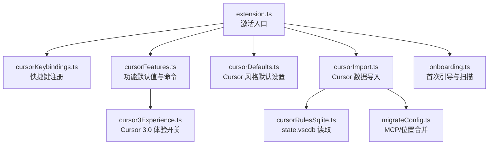
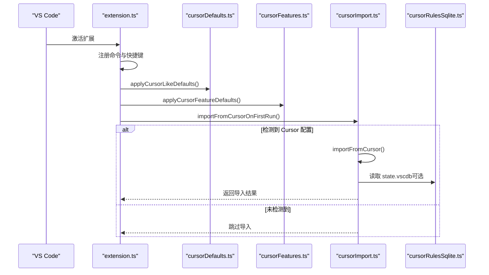
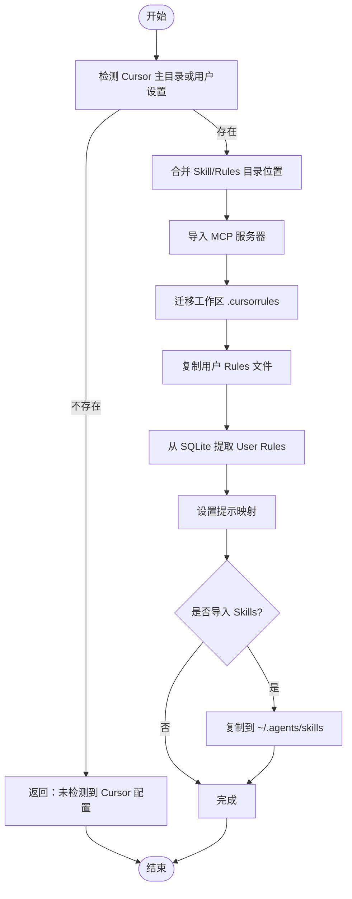
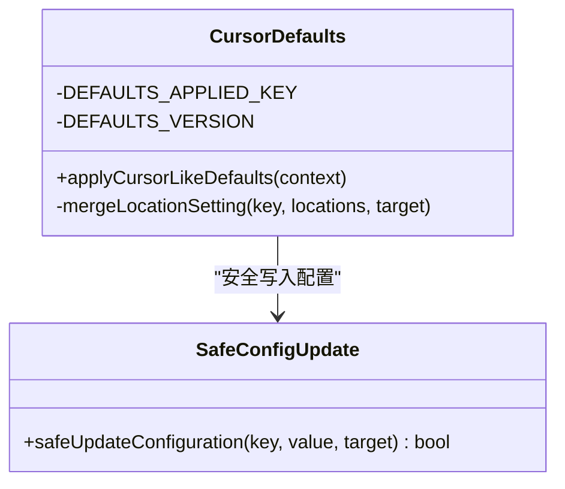
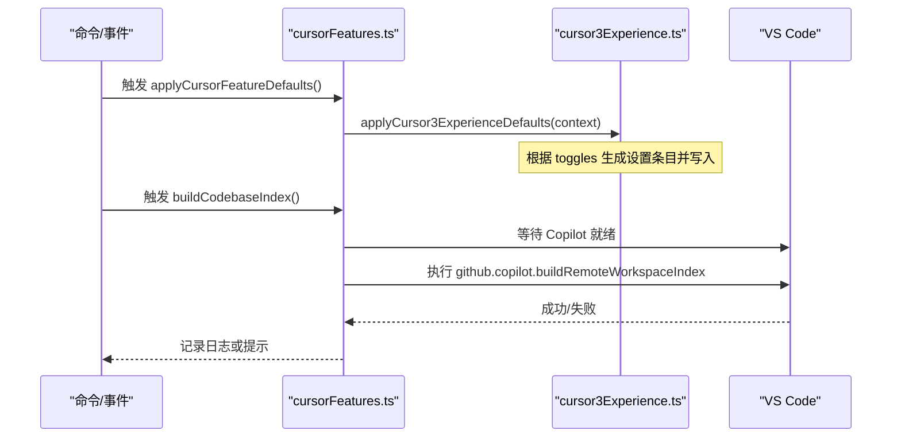
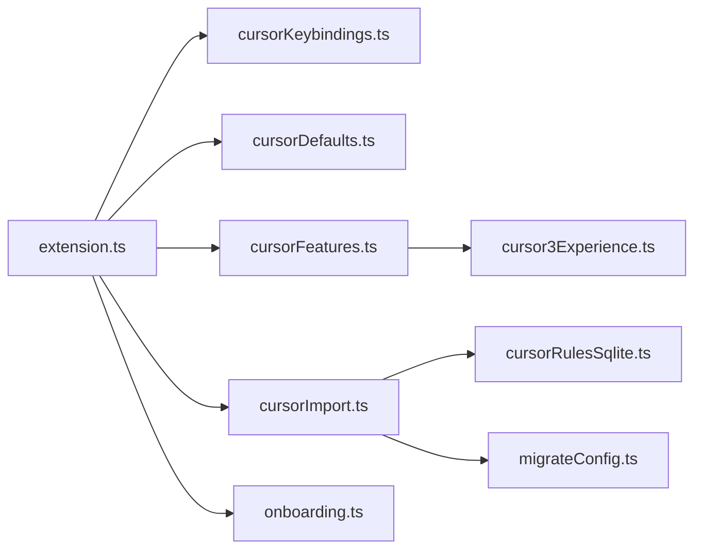

# Cursor 迁移工具

<cite>
**本文引用的文件**
- [cursorImport.ts](file://extensions/kodrix-local/src/cursorImport.ts)
- [cursorDefaults.ts](file://extensions/kodrix-local/src/cursorDefaults.ts)
- [cursorFeatures.ts](file://extensions/kodrix-local/src/cursorFeatures.ts)
- [cursorKeybindings.ts](file://extensions/kodrix-local/src/cursorKeybindings.ts)
- [extension.ts](file://extensions/kodrix-local/src/extension.ts)
- [cursor3Experience.ts](file://extensions/kodrix-local/src/cursor3Experience.ts)
- [cursorRulesSqlite.ts](file://extensions/kodrix-local/src/cursorRulesSqlite.ts)
- [migrateConfig.ts](file://extensions/kodrix-local/src/migrateConfig.ts)
- [onboarding.ts](file://extensions/kodrix-local/src/onboarding.ts)
- [safeConfigUpdate.ts](file://extensions/kodrix-local/src/safeConfigUpdate.ts)
</cite>

## 目录
1. [简介](#简介)
2. [项目结构](#项目结构)
3. [核心组件](#核心组件)
4. [架构总览](#架构总览)
5. [详细组件分析](#详细组件分析)
6. [依赖关系分析](#依赖关系分析)
7. [性能考量](#性能考量)
8. [故障排查指南](#故障排查指南)
9. [结论](#结论)
10. [附录](#附录)

## 简介
本文件面向从 Cursor 3.0 迁移到 Kodrix 的用户与企业管理员，系统性说明如何无缝导入用户设置、工作区配置、MCP 服务器、Skills、Rules（含 SQLite 中的 User Rules）等数据，并自动应用 Cursor 风格的默认体验与快捷键映射。文档重点覆盖：
- importFromCursor 与 importFromCursorOnFirstRun 的用法与行为
- applyCursorLikeDefaults 与 applyCursorFeatureDefaults 的工作原理
- cursorKeybindings 的快捷键映射规则
- 错误处理与回滚机制
- 常见迁移问题排查与手动修复
- 企业批量迁移最佳实践

## 项目结构
Kodrix 的 Cursor 迁移能力集中在本地扩展 kodrix-local 中，按职责拆分为导入、默认值、功能特性、快捷键、SQLite 读取、配置迁移与引导界面等模块。激活流程在 extension.ts 中编排，确保命令注册优先、默认值与应用在后台安全执行。

**图示来源**
- [extension.ts:84-107](file://extensions/kodrix-local/src/extension.ts#L84-L107)
- [cursorImport.ts:320-381](file://extensions/kodrix-local/src/cursorImport.ts#L320-L381)
- [cursorDefaults.ts:75-102](file://extensions/kodrix-local/src/cursorDefaults.ts#L75-L102)
- [cursorFeatures.ts:21-23](file://extensions/kodrix-local/src/cursorFeatures.ts#L21-L23)
- [cursor3Experience.ts:199-212](file://extensions/kodrix-local/src/cursor3Experience.ts#L199-L212)
- [cursorRulesSqlite.ts:130-174](file://extensions/kodrix-local/src/cursorRulesSqlite.ts#L130-L174)
- [migrateConfig.ts:95-113](file://extensions/kodrix-local/src/migrateConfig.ts#L95-L113)
- [onboarding.ts:38-61](file://extensions/kodrix-local/src/onboarding.ts#L38-L61)

**章节来源**
- [extension.ts:84-107](file://extensions/kodrix-local/src/extension.ts#L84-L107)

## 核心组件
- 导入器：负责检测并导入 Cursor 的配置项（Settings、MCP、Skills、Rules、工作区 .cursorrules），以及将 Cursor 的指令目录与技能目录合并到 Kodrix 配置中。
- 默认值应用器：应用 Cursor 风格的默认设置，包括 Agent、内联建议、会话布局、权限策略等，并记录版本避免重复应用。
- 功能特性应用器：应用 Cursor 3.0 相关体验开关（Tab 补全、Composer UI、代码库索引、Agents Window 等），并提供命令触发与自动构建索引。
- 快捷键映射：提供与 Cursor 一致的常用操作快捷方式（如添加选中内容到聊天、打开内联编辑、进入 Plan 模式）。
- SQLite 读取：从 Cursor 的 state.vscdb 提取 User Rules，兼容 JSON 与文本格式，并写入 ~/.kodrix/instructions。
- 配置迁移：将旧版 Cursormini/Kodrix 配置迁移至新模型与供应商体系，同时合并 MCP 与 Skills。
- 引导界面：提供只读扫描与一键导入，避免在预览阶段修改用户环境。

**章节来源**
- [cursorImport.ts:280-381](file://extensions/kodrix-local/src/cursorImport.ts#L280-L381)
- [cursorDefaults.ts:19-102](file://extensions/kodrix-local/src/cursorDefaults.ts#L19-L102)
- [cursorFeatures.ts:21-159](file://extensions/kodrix-local/src/cursorFeatures.ts#L21-L159)
- [cursorKeybindings.ts:7-25](file://extensions/kodrix-local/src/cursorKeybindings.ts#L7-L25)
- [cursorRulesSqlite.ts:130-174](file://extensions/kodrix-local/src/cursorRulesSqlite.ts#L130-L174)
- [migrateConfig.ts:277-444](file://extensions/kodrix-local/src/migrateConfig.ts#L277-L444)
- [onboarding.ts:38-61](file://extensions/kodrix-local/src/onboarding.ts#L38-L61)

## 架构总览
激活时，扩展先注册轻量命令与快捷键，再异步应用默认值与首次运行导入；导入失败不会阻断扩展启动。首次运行会检查是否已导入过 Cursor 配置，若未导入且开启自动导入，则尝试执行一次导入。

**图示来源**
- [extension.ts:94-107](file://extensions/kodrix-local/src/extension.ts#L94-L107)
- [cursorImport.ts:360-381](file://extensions/kodrix-local/src/cursorImport.ts#L360-L381)
- [cursorRulesSqlite.ts:130-174](file://extensions/kodrix/local/src/cursorRulesSqlite.ts#L130-L174)

## 详细组件分析

### 导入器：importFromCursor 与 importFromCursorOnFirstRun
- importFromCursor(options?)
  - 检测 Cursor 主目录与用户 settings.json；若均不存在则直接返回“未检测到”。
  - 依次执行：
    - 合并 Skill/Rules 目录位置到 chat.agentSkillsLocations / chat.instructionsFilesLocations
    - 导入 MCP 服务器（~/.cursor/mcp.json → Kodrix mcp.json）
    - 工作区 .cursorrules → .github/copilot-instructions.md（仅当目标不存在）
    - 用户 Rules 文件（~/.cursor/rules/*.md/.mdc/.instructions.md → ~/.kodrix/instructions）
    - 从 SQLite 提取 User Rules（state.vscdb → cursor-user-rules.instructions.md）
    - 根据 Cursor settings.json 提示性映射部分设置（如内联建议、仓库信息）
    - 可选导入 Skills（~/.cursor/skills → ~/.agents/skills，非破坏性，已存在不覆盖）
  - 返回导入结果（是否导入、消息、已应用项列表）。
- importFromCursorOnFirstRun(context)
  - 通过全局状态键判断是否已导入；若未导入且开启自动导入，则调用 importFromCursor。
  - 导入失败不阻断扩展激活，仅记录警告。
  - 完成后标记已导入，避免重复执行。

**图示来源**
- [cursorImport.ts:320-381](file://extensions/kodrix-local/src/cursorImport.ts#L320-L381)
- [cursorRulesSqlite.ts:130-174](file://extensions/kodrix/local/src/cursorRulesSqlite.ts#L130-L174)

**章节来源**
- [cursorImport.ts:280-381](file://extensions/kodrix/local/src/cursorImport.ts#L280-L381)

### 默认值应用器：applyCursorLikeDefaults
- 作用：应用 Cursor 风格的基础体验设置（Agent、内联建议、会话布局、权限策略等），并合并 Skill/Rules 目录位置。
- 幂等性：通过全局状态记录已应用版本，避免重复写入；支持 force 逻辑对关键键强制写回。
- 安全写入：使用 safeUpdateConfiguration 包装，遇到未注册键或策略拒绝时记录警告并跳过，不中断流程。

**图示来源**
- [cursorDefaults.ts:75-102](file://extensions/kodrix/local/src/cursorDefaults.ts#L75-L102)
- [safeConfigUpdate.ts:11-24](file://extensions/kodrix/local/src/safeConfigUpdate.ts#L11-L24)

**章节来源**
- [cursorDefaults.ts:19-102](file://extensions/kodrix/local/src/cursorDefaults.ts#L19-L102)
- [safeConfigUpdate.ts:11-24](file://extensions/kodrix/local/src/safeConfigUpdate.ts#L11-L24)

### 功能特性应用器：applyCursorFeatureDefaults
- 作用：应用 Cursor 3.0 相关体验（Tab 补全、Composer UI、代码库索引、Agents Window、隐式上下文等），并通过命令暴露手动触发。
- 自动构建索引：在未登录 GitHub 时跳过；等待 Copilot 就绪后执行索引命令；失败时仅记录日志（silent）或给出可操作提示。
- 工作区布局：首次打开工作区时最大化辅助栏并打开 Agent 聊天，提升“以 Agent 为中心”的体验。

**图示来源**
- [cursorFeatures.ts:21-79](file://extensions/kodrix/local/src/cursorFeatures.ts#L21-L79)
- [cursor3Experience.ts:199-212](file://extensions/kodrix/local/src/cursor3Experience.ts#L199-L212)

**章节来源**
- [cursorFeatures.ts:21-159](file://extensions/kodrix/local/src/cursorFeatures.ts#L21-L159)
- [cursor3Experience.ts:159-212](file://extensions/kodrix/local/src/cursor3Experience.ts#L159-L212)

### 快捷键映射：cursorKeybindings
- 注册以下命令以便与 Cursor 习惯一致：
  - 添加选中内容到聊天：打开聊天并附加选区
  - 打开内联编辑：启动 inlineChat.start
  - 打开 Plan 模式：打开聊天并预填 /plan
- 这些命令由 extension.ts 统一注册，便于后续绑定快捷键。

**章节来源**
- [cursorKeybindings.ts:7-25](file://extensions/kodrix/local/src/cursorKeybindings.ts#L7-L25)
- [extension.ts:98-100](file://extensions/kodrix/local/src/extension.ts#L98-L100)

### SQLite 读取：cursorRulesSqlite
- 路径解析：跨平台定位 Cursor 的 state.vscdb。
- 读取策略：优先使用 sqlite3 CLI 查询 ItemTable；失败时回退为二进制扫描，提取 JSON 或文本。
- 安全校验：白名单允许的 key，防止注入与越权访问。
- 输出：将提取的规则文本写入 ~/.kodrix/instructions/cursor-user-rules.instructions.md，并去重避免重复导入。

**章节来源**
- [cursorRulesSqlite.ts:14-97](file://extensions/kodrix/local/src/cursorRulesSqlite.ts#L14-L97)
- [cursorRulesSqlite.ts:130-174](file://extensions/kodrix/local/src/cursorRulesSqlite.ts#L130-L174)

### 配置迁移：migrateConfig
- 读取旧版 config.json/providers.json/plugins，迁移供应商、模型路由、MCP 服务器与 Skills。
- 仅在键未设置时写入默认值，避免覆盖用户自定义。
- 提供 applyPreset 与 loadPresets，配合向导选择预设并应用。

**章节来源**
- [migrateConfig.ts:277-444](file://extensions/kodrix/local/src/migrateConfig.ts#L277-L444)
- [migrateConfig.ts:459-472](file://extensions/kodrix/local/src/migrateConfig.ts#L459-L472)

### 引导界面：onboarding
- 只读扫描：detectCursorImportables 报告可导入项，不修改任何配置。
- 一键导入：doImport 调用 importFromCursor，并在成功后更新全局状态。
- 快速开始：提供 Agent、模型、导入等快捷入口。

**章节来源**
- [onboarding.ts:38-61](file://extensions/kodrix/local/src/onboarding.ts#L38-L61)
- [onboarding.ts:116-129](file://extensions/kodrix/local/src/onboarding.ts#L116-L129)

## 依赖关系分析
- 低耦合：导入器、默认值、功能特性、快捷键各自独立，通过 extension.ts 协调。
- 外部依赖：
  - VS Code API：workspace 配置、命令、Webview、认证会话。
  - 文件系统：读取/写入 JSON、Markdown、目录拷贝。
  - 系统工具：sqlite3 CLI（可选，失败回退）。
- 潜在循环：无直接循环依赖；各模块通过函数导出被 extension.ts 组合。

**图示来源**
- [extension.ts:10-20](file://extensions/kodrix/local/src/extension.ts#L10-L20)
- [cursorImport.ts:5-12](file://extensions/kodrix/local/src/cursorImport.ts#L5-L12)
- [cursorFeatures.ts:5-12](file://extensions/kodrix/local/src/cursorFeatures.ts#L5-L12)

**章节来源**
- [extension.ts:10-20](file://extensions/kodrix/local/src/extension.ts#L10-L20)

## 性能考量
- 首次运行导入采用异步与非阻塞设计，失败不阻断激活。
- 代码库索引构建等待 Copilot 就绪，避免频繁失败重试；自动构建使用静默模式减少弹窗干扰。
- SQLite 读取设置超时与回退策略，降低因工具缺失导致的失败概率。
- 配置写入使用安全封装，遇到未注册键立即跳过，避免长时间异常。

[本节为通用指导，无需具体文件引用]

## 故障排查指南
- 未检测到 Cursor 配置
  - 现象：导入返回“未检测到 Cursor 配置”。
  - 排查：确认 ~/.cursor 是否存在，或平台特定的用户 settings.json 路径是否正确。
  - 参考：[cursorImport.ts:320-328](file://extensions/kodrix/local/src/cursorImport.ts#L320-L328)
- SQLite 读取失败
  - 现象：无法从 state.vscdb 提取 User Rules。
  - 排查：检查 sqlite3 是否可用；若不可用，将回退到二进制扫描；仍失败需确认数据库路径与权限。
  - 参考：[cursorRulesSqlite.ts:42-97](file://extensions/kodrix/local/src/cursorRulesSqlite.ts#L42-L97)
- 代码库索引构建失败
  - 现象：弹出“无法构建代码库索引”。
  - 排查：确认已登录 GitHub；等待 Copilot 就绪后再试；或直接在聊天中使用 #codebase。
  - 参考：[cursorFeatures.ts:37-79](file://extensions/kodrix/local/src/cursorFeatures.ts#L37-L79)
- 配置写入被拒绝
  - 现象：某些键写入失败但其他键成功。
  - 排查：该键可能未注册或被策略拒绝；查看日志中的跳过记录；必要时手动在设置中启用。
  - 参考：[safeConfigUpdate.ts:11-24](file://extensions/kodrix/local/src/safeConfigUpdate.ts#L11-L24)
- 重复导入或覆盖风险
  - 现象：担心覆盖已有文件或设置。
  - 处理：导入为非破坏性，已存在的 Skill 与 Instructions 不会被覆盖；工作区 .cursorrules 仅当目标不存在时才迁移。
  - 参考：[cursorImport.ts:136-161](file://extensions/kodrix/local/src/cursorImport.ts#L136-L161), [cursorImport.ts:219-248](file://extensions/kodrix/local/src/cursorImport.ts#L219-L248)

**章节来源**
- [cursorImport.ts:320-381](file://extensions/kodrix/local/src/cursorImport.ts#L320-L381)
- [cursorRulesSqlite.ts:42-97](file://extensions/kodrix/local/src/cursorRulesSqlite.ts#L42-L97)
- [cursorFeatures.ts:37-79](file://extensions/kodrix/local/src/cursorFeatures.ts#L37-L79)
- [safeConfigUpdate.ts:11-24](file://extensions/kodrix/local/src/safeConfigUpdate.ts#L11-L24)

## 结论
Kodrix 提供了完整的 Cursor 迁移能力：自动检测并导入用户设置、工作区配置、MCP、Skills、Rules（含 SQLite），并以 Cursor 风格默认值与快捷键保持一致体验。导入过程具备幂等性与容错机制，首次运行自动导入失败不影响扩展激活。企业可通过向导与命令进行批量迁移，结合安全配置写入与回退策略，确保迁移稳定可靠。

[本节为总结，无需具体文件引用]

## 附录

### 支持的导入数据类型
- 用户设置提示：基于 Cursor settings.json 的部分键映射（如内联建议、仓库信息）。
- 工作区配置：.cursorrules → .github/copilot-instructions.md（仅目标不存在时）。
- 密钥与服务器：MCP 服务器（mcp.json）合并到 Kodrix mcp.json。
- 指令与技能：~/.cursor/rules → ~/.kodrix/instructions；~/.cursor/skills → ~/.agents/skills。
- SQLite 用户规则：state.vscdb 中的 personalContext/composerState 提取并写入 instructions。

**章节来源**
- [cursorImport.ts:100-134](file://extensions/kodrix/local/src/cursorImport.ts#L100-L134)
- [cursorImport.ts:163-217](file://extensions/kodrix/local/src/cursorImport.ts#L163-L217)
- [cursorImport.ts:250-278](file://extensions/kodrix/local/src/cursorImport.ts#L250-L278)

### 快捷键映射规则（Cursor 风格）
- 添加选中内容到聊天：打开聊天并附加选区。
- 打开内联编辑：启动内联聊天。
- 打开 Plan 模式：打开聊天并预填 /plan。

**章节来源**
- [cursorKeybindings.ts:7-25](file://extensions/kodrix/local/src/cursorKeybindings.ts#L7-L25)

### 企业批量迁移最佳实践
- 集中部署：通过扩展激活流程自动应用默认值与首次导入，减少人工干预。
- 控制导入范围：使用 onboarding 的只读扫描预览可导入项，再执行导入。
- 安全策略：利用 safeUpdateConfiguration 避免未注册键导致失败；对关键键使用 force 覆盖。
- 监控与回滚：关注日志中的跳过与失败记录；如需回滚，可在设置中手动关闭相应开关或清理生成的文件。
- 自动化脚本：结合命令面板与 Webview 接口，在企业环境中批量触发导入与配置应用。

[本节为通用指导，无需具体文件引用]