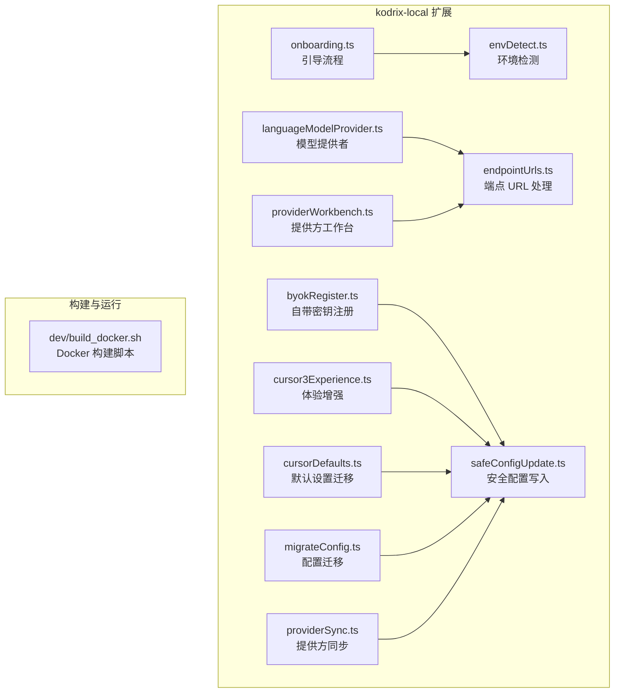
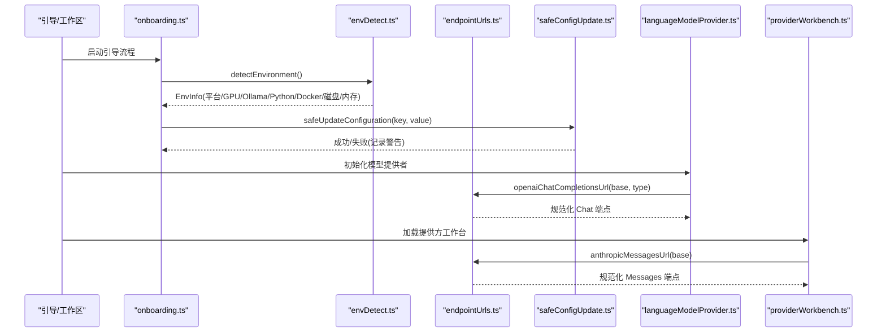
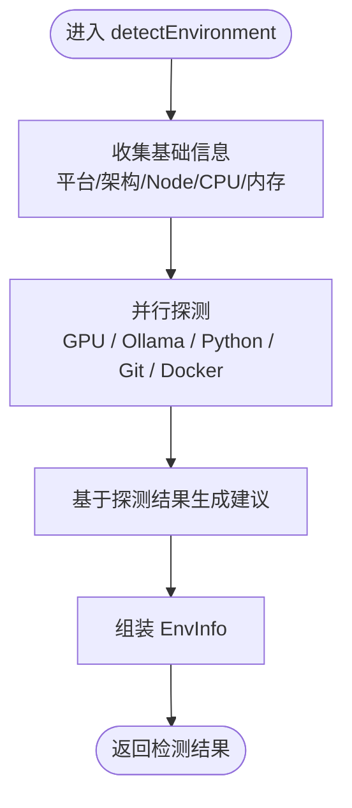
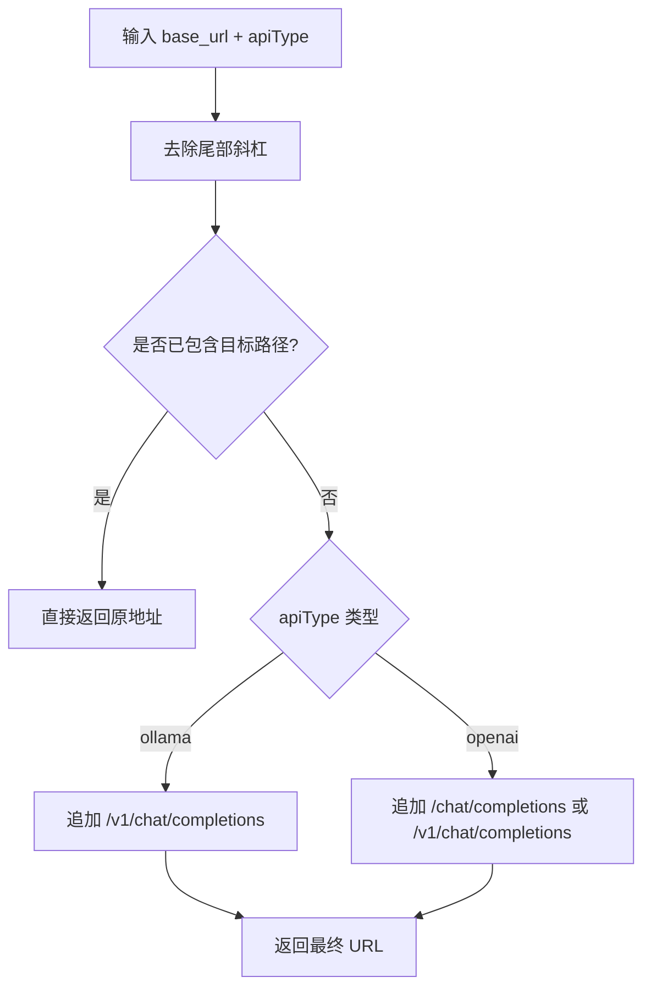
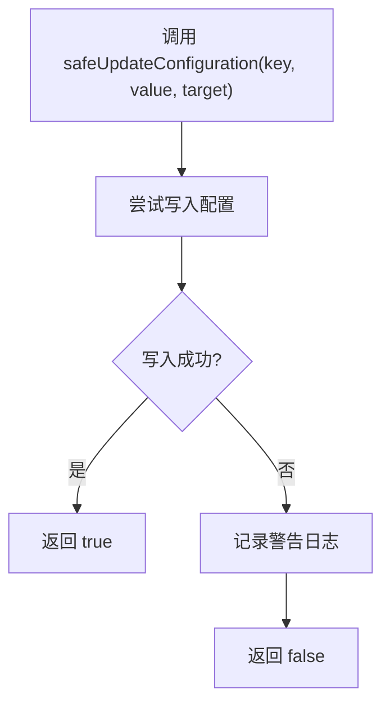
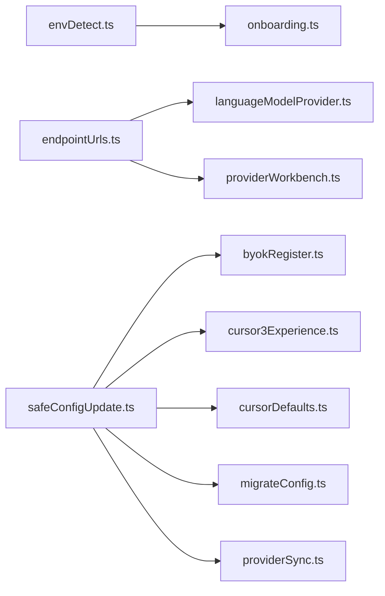

# 本地部署指南

<cite>
**本文引用的文件**   
- [envDetect.ts](file://extensions/kodrix-local/src/envDetect.ts)
- [endpointUrls.ts](file://extensions/kodrix-local/src/endpointUrls.ts)
- [safeConfigUpdate.ts](file://extensions/kodrix-local/src/safeConfigUpdate.ts)
- [onboarding.ts](file://extensions/kodrix-local/src/onboarding.ts)
- [languageModelProvider.ts](file://extensions/kodrix-local/src/languageModelProvider.ts)
- [providerWorkbench.ts](file://extensions/kodrix-local/src/providerWorkbench.ts)
- [byokRegister.ts](file://extensions/kodrix-local/src/byokRegister.ts)
- [cursor3Experience.ts](file://extensions/kodrix-local/src/cursor3Experience.ts)
- [cursorDefaults.ts](file://extensions/kodrix-local/src/cursorDefaults.ts)
- [migrateConfig.ts](file://extensions/kodrix-local/src/migrateConfig.ts)
- [providerSync.ts](file://extensions/kodrix-local/src/providerSync.ts)
- [build_docker.sh](file://dev/build_docker.sh)
</cite>

## 目录
1. [引言](#引言)
2. [项目结构](#项目结构)
3. [核心组件](#核心组件)
4. [架构总览](#架构总览)
5. [详细组件分析](#详细组件分析)
6. [依赖关系分析](#依赖关系分析)
7. [性能与容量规划](#性能与容量规划)
8. [安全与企业合规](#安全与企业合规)
9. [Docker 容器化部署](#docker-容器化部署)
10. [监控与告警](#监控与告警)
11. [故障排查](#故障排查)
12. [结论](#结论)

## 引言
本指南面向企业环境，提供 Kodrix 的本地部署与生产化建议。重点覆盖：
- 环境检测机制 envDetect：自动识别操作系统、Node.js、GPU、Ollama、Python、Git、Docker 等依赖，并给出智能建议。
- 网络端点配置 endpointUrls：统一处理 OpenAI/Anthropic/Ollama 兼容端点拼接、代理与自定义 API 地址。
- 安全配置更新 safeConfigUpdate：防止未注册键写入与恶意配置注入，失败不阻断业务流程。
- Docker 容器化构建与运行、数据卷挂载、环境变量配置。
- 防火墙、SSL、审计日志等企业安全要求。
- 性能调优与容量规划、监控与告警落地方案。

## 项目结构
Kodrix 的本地部署相关能力主要位于扩展 kodrix-local 中，关键源码如下：
- 环境检测：extensions/kodrix-local/src/envDetect.ts
- 端点 URL 处理：extensions/kodrix-local/src/endpointUrls.ts
- 安全配置写入：extensions/kodrix-local/src/safeConfigUpdate.ts
- 使用方示例：onboarding.ts、languageModelProvider.ts、providerWorkbench.ts、byokRegister.ts、cursor3Experience.ts、cursorDefaults.ts、migrateConfig.ts、providerSync.ts
- 容器构建脚本：dev/build_docker.sh

**图示来源**
- [envDetect.ts:1-279](file://extensions/kodrix-local/src/envDetect.ts#L1-L279)
- [endpointUrls.ts:1-59](file://extensions/kodrix-local/src/endpointUrls.ts#L1-L59)
- [safeConfigUpdate.ts:1-24](file://extensions/kodrix-local/src/safeConfigUpdate.ts#L1-L24)
- [onboarding.ts:10-10](file://extensions/kodrix-local/src/onboarding.ts#L10-L10)
- [languageModelProvider.ts:8-8](file://extensions/kodrix-local/src/languageModelProvider.ts#L8-L8)
- [providerWorkbench.ts:10-10](file://extensions/kodrix-local/src/providerWorkbench.ts#L10-L10)
- [byokRegister.ts:10-10](file://extensions/kodrix-local/src/byokRegister.ts#L10-L10)
- [cursor3Experience.ts:7-7](file://extensions/kodrix-local/src/cursor3Experience.ts#L7-L7)
- [cursorDefaults.ts:6-6](file://extensions/kodrix-local/src/cursorDefaults.ts#L6-L6)
- [migrateConfig.ts:20-20](file://extensions/kodrix-local/src/migrateConfig.ts#L20-L20)
- [providerSync.ts:8-8](file://extensions/kodrix-local/src/providerSync.ts#L8-L8)
- [build_docker.sh:1-200](file://dev/build_docker.sh#L1-L200)

**章节来源**
- [envDetect.ts:1-279](file://extensions/kodrix-local/src/envDetect.ts#L1-L279)
- [endpointUrls.ts:1-59](file://extensions/kodrix-local/src/endpointUrls.ts#L1-L59)
- [safeConfigUpdate.ts:1-24](file://extensions/kodrix-local/src/safeConfigUpdate.ts#L1-L24)
- [build_docker.sh:1-200](file://dev/build_docker.sh#L1-L200)

## 核心组件
- 环境检测 envDetect：并行异步探测系统信息、GPU、Ollama、Python、Git、Docker，输出结构化 EnvInfo，并生成用户建议。
- 端点 URL 处理 endpointUrls：将供应商 base_url 转换为可请求的 Chat/Messages 地址，兼容 Ollama、OpenAI、Anthropic 风格路径。
- 安全配置更新 safeConfigUpdate：封装 VS Code 配置写入，失败时记录警告且不中断业务流。

**章节来源**
- [envDetect.ts:17-36](file://extensions/kodrix-local/src/envDetect.ts#L17-L36)
- [envDetect.ts:221-278](file://extensions/kodrix-local/src/envDetect.ts#L221-L278)
- [endpointUrls.ts:12-43](file://extensions/kodrix-local/src/endpointUrls.ts#L12-L43)
- [safeConfigUpdate.ts:8-23](file://extensions/kodrix-local/src/safeConfigUpdate.ts#L8-L23)

## 架构总览
Kodrix 在本地运行时，通过扩展模块完成环境探测、端点拼装与安全配置写入；上层功能（如模型提供者、提供方工作台、引导流程）消费这些能力以完成初始化与联网调用。

**图示来源**
- [onboarding.ts:10-10](file://extensions/kodrix-local/src/onboarding.ts#L10-L10)
- [envDetect.ts:221-278](file://extensions/kodrix-local/src/envDetect.ts#L221-L278)
- [safeConfigUpdate.ts:11-23](file://extensions/kodrix-local/src/safeConfigUpdate.ts#L11-L23)
- [languageModelProvider.ts:8-8](file://extensions/kodrix-local/src/languageModelProvider.ts#L8-L8)
- [endpointUrls.ts:12-43](file://extensions/kodrix-local/src/endpointUrls.ts#L12-L43)
- [providerWorkbench.ts:10-10](file://extensions/kodrix-local/src/providerWorkbench.ts#L10-L10)

## 详细组件分析

### 环境检测 envDetect
- 设计要点
  - 全异步并行探测：避免 Windows 上阻塞扩展宿主，保证有限时间内返回结果。
  - 命令白名单与管道分段校验：仅允许预定义命令，防止任意命令执行。
  - 超时与兜底：每条命令独立超时，绝对兜底确保 Promise 结算。
  - 跨平台 GPU 探测：Windows/macOS/Linux 分别采用不同工具链。
  - 智能建议：根据 GPU、内存、磁盘、Ollama、Python 状态生成引导建议。

- 关键流程
  - 并行探测 GPU、Ollama、Python、Git、Docker。
  - 计算可用磁盘空间、CPU 数量、总内存。
  - 组合 EnvInfo 并生成 suggestions。

**图示来源**
- [envDetect.ts:221-278](file://extensions/kodrix-local/src/envDetect.ts#L221-L278)

**章节来源**
- [envDetect.ts:38-94](file://extensions/kodrix-local/src/envDetect.ts#L38-L94)
- [envDetect.ts:96-148](file://extensions/kodrix-local/src/envDetect.ts#L96-L148)
- [envDetect.ts:150-202](file://extensions/kodrix-local/src/envDetect.ts#L150-L202)
- [envDetect.ts:204-219](file://extensions/kodrix-local/src/envDetect.ts#L204-L219)
- [envDetect.ts:221-278](file://extensions/kodrix-local/src/envDetect.ts#L221-L278)

### 端点 URL 处理 endpointUrls
- 设计要点
  - 统一裁剪尾部斜杠，避免重复拼接。
  - OpenAI 兼容：支持 /v1/chat/completions 或已包含 /chat/completions 的地址。
  - Anthropic 兼容：支持 /v1/messages 或 /messages。
  - Ollama 兼容：自动追加 /v1/chat/completions。
  - 模型名解析：支持逗号、中文逗号、换行分隔，去重并保持顺序。

**图示来源**
- [endpointUrls.ts:8-32](file://extensions/kodrix-local/src/endpointUrls.ts#L8-L32)

**章节来源**
- [endpointUrls.ts:8-32](file://extensions/kodrix-local/src/endpointUrls.ts#L8-L32)
- [endpointUrls.ts:34-43](file://extensions/kodrix-local/src/endpointUrls.ts#L34-L43)
- [endpointUrls.ts:45-58](file://extensions/kodrix-local/src/endpointUrls.ts#L45-L58)

### 安全配置更新 safeConfigUpdate
- 设计要点
  - 封装 VS Code workspace.getConfiguration().update。
  - 捕获未注册键、策略拒绝或其他异常，记录警告并返回失败。
  - 不影响主业务流程，提升鲁棒性。

**图示来源**
- [safeConfigUpdate.ts:11-23](file://extensions/kodrix-local/src/safeConfigUpdate.ts#L11-L23)

**章节来源**
- [safeConfigUpdate.ts:1-24](file://extensions/kodrix-local/src/safeConfigUpdate.ts#L1-24)

### 使用方集成点
- onboarding.ts：在引导阶段调用环境检测，展示建议与自动配置提示。
- languageModelProvider.ts：使用 endpointUrls 构造 OpenAI 兼容 Chat 端点。
- providerWorkbench.ts：使用 endpointUrls 构造 Anthropic Messages 端点。
- byokRegister.ts、cursor3Experience.ts、cursorDefaults.ts、migrateConfig.ts、providerSync.ts：统一通过 safeConfigUpdate 进行配置写入，确保失败不中断。

**章节来源**
- [onboarding.ts:10-10](file://extensions/kodrix-local/src/onboarding.ts#L10-L10)
- [languageModelProvider.ts:8-8](file://extensions/kodrix-local/src/languageModelProvider.ts#L8-L8)
- [providerWorkbench.ts:10-10](file://extensions/kodrix-local/src/providerWorkbench.ts#L10-L10)
- [byokRegister.ts:10-10](file://extensions/kodrix-local/src/byokRegister.ts#L10-L10)
- [cursor3Experience.ts:7-7](file://extensions/kodrix-local/src/cursor3Experience.ts#L7-L7)
- [cursorDefaults.ts:6-6](file://extensions/kodrix-local/src/cursorDefaults.ts#L6-L6)
- [migrateConfig.ts:20-20](file://extensions/kodrix-local/src/migrateConfig.ts#L20-L20)
- [providerSync.ts:8-8](file://extensions/kodrix-local/src/providerSync.ts#L8-L8)

## 依赖关系分析
- 内聚与耦合
  - envDetect 高内聚于系统探测逻辑，对外暴露 EnvInfo，被引导流程消费。
  - endpointUrls 纯函数式处理 URL，被多个网络调用模块复用。
  - safeConfigUpdate 作为配置写入的统一入口，降低各模块对 VS Code API 的直接依赖风险。
- 外部依赖
  - Node.js child_process、fs、os、path 用于系统探测。
  - vscode.workspace.getConfiguration 用于配置写入。
  - dev/build_docker.sh 用于容器构建。

**图示来源**
- [envDetect.ts:1-279](file://extensions/kodrix-local/src/envDetect.ts#L1-L279)
- [endpointUrls.ts:1-59](file://extensions/kodrix-local/src/endpointUrls.ts#L1-L59)
- [safeConfigUpdate.ts:1-24](file://extensions/kodrix-local/src/safeConfigUpdate.ts#L1-L24)
- [onboarding.ts:10-10](file://extensions/kodrix-local/src/onboarding.ts#L10-L10)
- [languageModelProvider.ts:8-8](file://extensions/kodrix-local/src/languageModelProvider.ts#L8-L8)
- [providerWorkbench.ts:10-10](file://extensions/kodrix-local/src/providerWorkbench.ts#L10-L10)
- [byokRegister.ts:10-10](file://extensions/kodrix-local/src/byokRegister.ts#L10-L10)
- [cursor3Experience.ts:7-7](file://extensions/kodrix-local/src/cursor3Experience.ts#L7-L7)
- [cursorDefaults.ts:6-6](file://extensions/kodrix-local/src/cursorDefaults.ts#L6-L6)
- [migrateConfig.ts:20-20](file://extensions/kodrix-local/src/migrateConfig.ts#L20-L20)
- [providerSync.ts:8-8](file://extensions/kodrix-local/src/providerSync.ts#L8-L8)

**章节来源**
- [envDetect.ts:1-279](file://extensions/kodrix-local/src/envDetect.ts#L1-L279)
- [endpointUrls.ts:1-59](file://extensions/kodrix-local/src/endpointUrls.ts#L1-L59)
- [safeConfigUpdate.ts:1-24](file://extensions/kodrix-local/src/safeConfigUpdate.ts#L1-L24)

## 性能与容量规划
- 环境检测性能
  - 并行探测避免串行阻塞，整体耗时取决于最慢单项探测（约 6-8 秒）。
  - 命令级超时与 killSignal 保障子进程不会泄漏。
- 资源建议
  - 内存：若本机内存小于 8GB，建议使用云端 API 模型；具备 16GB+ 内存且带独显时，可考虑本地推理。
  - 磁盘：预留至少 10GB 以上空间用于模型下载与缓存。
  - CPU：多核有助于并行任务与索引构建。
- 网络与并发
  - 合理设置代理服务器与重试策略，避免频繁超时。
  - 控制并发连接数，避免对上游 API 造成压力。

[本节为通用指导，无需代码引用]

## 安全与企业合规
- 命令执行安全
  - 仅允许白名单命令，并对管道分段逐一校验首个二进制，防止绕过。
  - 所有命令执行均带超时与错误兜底，避免长时间阻塞。
- 配置写入安全
  - 通过 safeConfigUpdate 统一写入，失败不阻断业务，减少误写风险。
- 网络与代理
  - 使用 endpointUrls 统一拼装端点，便于集中管理代理与证书。
  - 在企业环境中，建议通过反向代理（Nginx/Traefik）统一出口，集中配置 SSL 与访问控制。
- 防火墙与端口
  - 仅开放必要端口（例如 80/443），内部服务通过反向代理暴露。
  - 限制出站访问至受信任的 API 域名/IP。
- SSL 证书
  - 使用企业 CA 签发证书，确保证书链完整。
  - 在反向代理层终止 TLS，后端服务使用内网 HTTP。
- 审计日志
  - 启用应用日志与系统审计，记录配置变更、网络访问与错误事件。
  - 将日志集中到 SIEM 或日志平台，设置告警规则。

[本节为通用指导，无需代码引用]

## Docker 容器化部署
- 镜像构建
  - 使用 dev/build_docker.sh 进行构建，确保依赖安装与产物打包一致。
- 环境变量
  - 通过环境变量注入 API Key、代理地址、日志级别等敏感或环境相关配置。
- 数据卷挂载
  - 挂载持久化目录保存模型缓存、配置文件与日志，避免容器重建丢失。
- 健康检查与重启策略
  - 配置健康检查探针，结合编排平台实现自动重启与滚动升级。
- 资源限制
  - 为容器设置 CPU/内存上限，防止单实例占用过多资源。

**章节来源**
- [build_docker.sh:1-200](file://dev/build_docker.sh#L1-L200)

## 监控与告警
- 指标采集
  - 采集应用指标（QPS、延迟、错误率）、系统指标（CPU、内存、磁盘、网络）。
- 日志聚合
  - 集中收集应用日志与系统日志，建立检索与可视化看板。
- 告警规则
  - 针对错误率突增、响应时间劣化、磁盘不足、API 超时等设置阈值告警。
- 可观测性
  - 引入分布式追踪，关联用户请求与后端调用链路。

[本节为通用指导，无需代码引用]

## 故障排查
- 环境检测卡住
  - 检查命令白名单与管道语法，确认无非法命令。
  - 查看日志中的超时与子进程错误，确认命令是否被正确终止。
- 配置写入失败
  - 确认键是否已注册，是否存在策略拒绝。
  - 查看 safeConfigUpdate 的警告日志，定位具体原因。
- 端点不可达
  - 检查 endpointUrls 生成的最终 URL 是否符合预期。
  - 验证代理配置与 DNS 解析，确认防火墙放行。
- 模型调用失败
  - 核对 API Key、base_url、apiType 是否正确。
  - 观察上游 API 返回的错误码与消息，定位鉴权或限流问题。

**章节来源**
- [envDetect.ts:38-94](file://extensions/kodrix-local/src/envDetect.ts#L38-L94)
- [safeConfigUpdate.ts:11-23](file://extensions/kodrix-local/src/safeConfigUpdate.ts#L11-L23)
- [endpointUrls.ts:12-43](file://extensions/kodrix-local/src/endpointUrls.ts#L12-L43)

## 结论
通过 envDetect、endpointUrls 与 safeConfigUpdate 的组合，Kodrix 在本地部署时能够：
- 快速、安全地完成环境探测与依赖建议。
- 统一、可靠地拼装各类 AI 服务的端点地址。
- 安全、稳健地写入配置，避免业务中断。
结合 Docker 容器化、反向代理、SSL、审计日志与监控告警，可在企业环境中实现稳定、可控、可观测的生产部署。