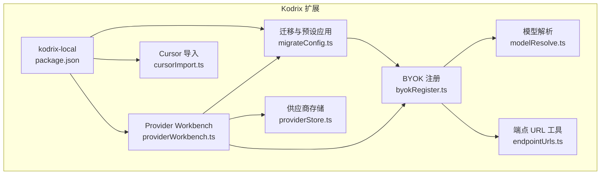
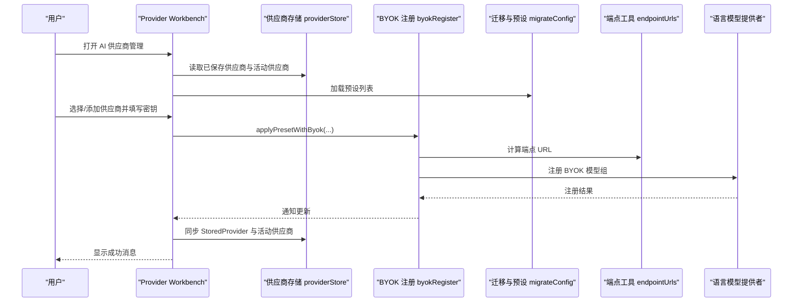
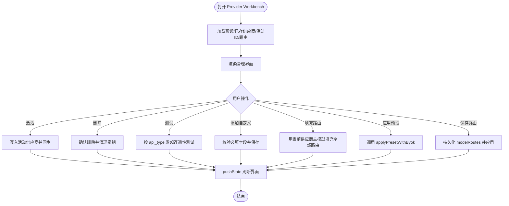
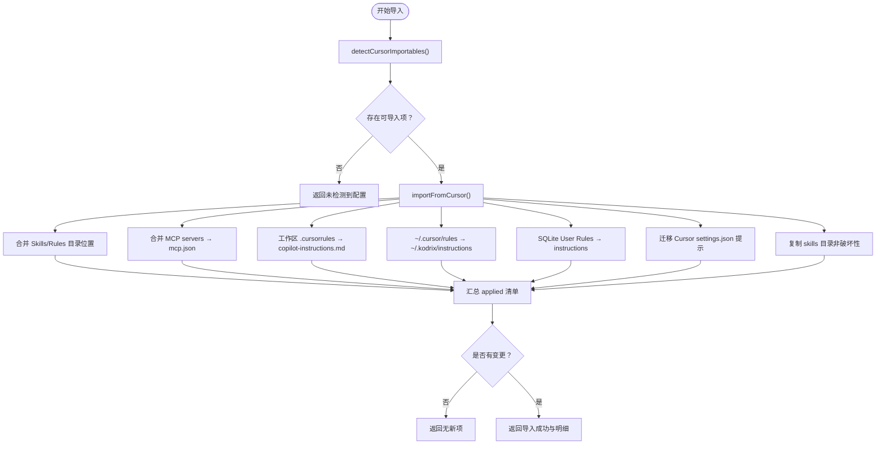
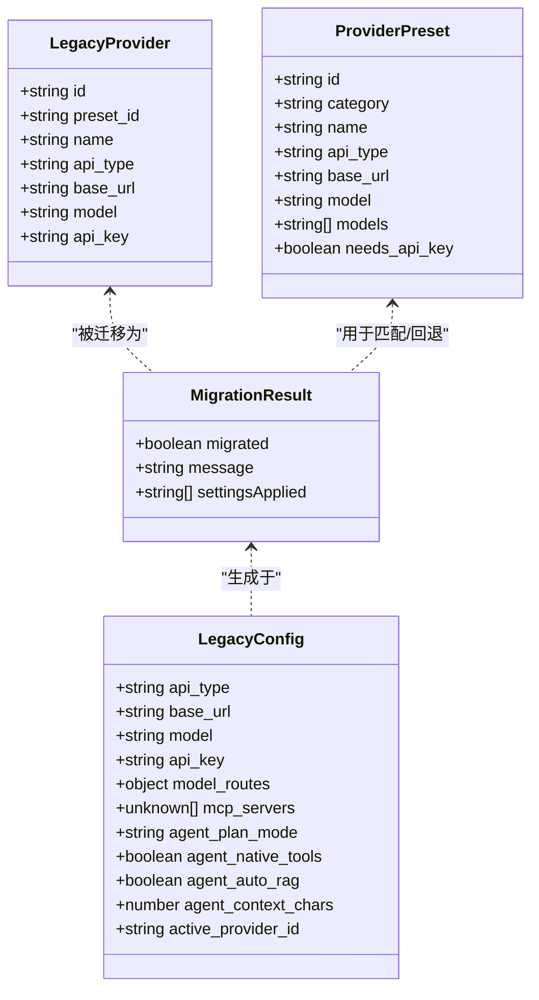
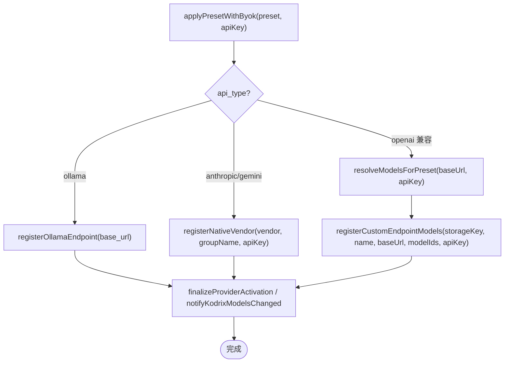
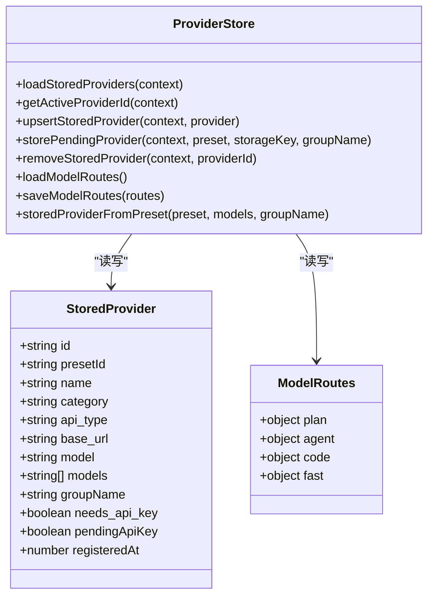
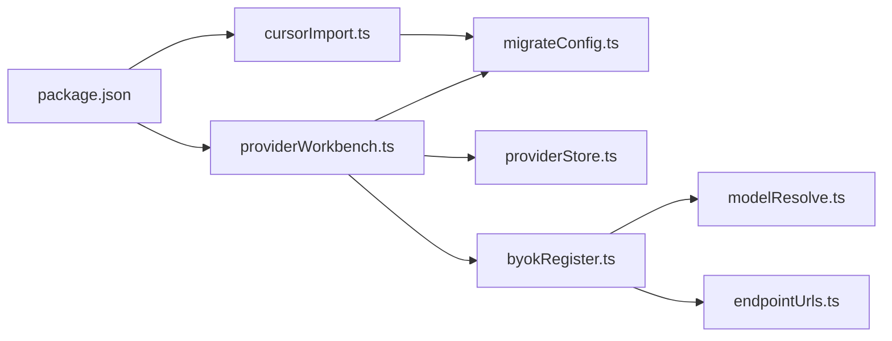

# 本地集成

<cite>
**本文引用的文件**   
- [README.md](file://README.md)
- [package.json](file://extensions/kodrix-local/package.json)
- [providerWorkbench.ts](file://extensions/kodrix-local/src/providerWorkbench.ts)
- [cursorImport.ts](file://extensions/kodrix-local/src/cursorImport.ts)
- [migrateConfig.ts](file://extensions/kodrix-local/src/migrateConfig.ts)
- [byokRegister.ts](file://extensions/kodrix-local/src/byokRegister.ts)
- [modelResolve.ts](file://extensions/kodrix-local/src/modelResolve.ts)
- [providerStore.ts](file://extensions/kodrix-local/src/providerStore.ts)
- [endpointUrls.ts](file://extensions/kodrix-local/src/endpointUrls.ts)
</cite>

## 目录
1. [引言](#引言)
2. [项目结构](#项目结构)
3. [核心组件](#核心组件)
4. [架构总览](#架构总览)
5. [详细组件分析](#详细组件分析)
6. [依赖关系分析](#依赖关系分析)
7. [性能与可靠性](#性能与可靠性)
8. [故障排查指南](#故障排查指南)
9. [结论](#结论)
10. [附录：配置项速查](#附录配置项速查)

## 引言
本文件面向企业用户与集成工程师，系统性说明 Kodrix 的“本地优先”策略与本地集成功能。内容覆盖：
- Cursor 体验迁移与一键导入
- 模型供应商管理与多模型路由（含 13 个预设与 BYOK）
- Provider Workbench 配置界面与管理能力
- 本地部署最佳实践（网络、安全、性能）
- 常见问题排查与企业级落地建议

Kodrix 在 VS Code/VSCodium 之上提供多 Agent 协作、智能补全、Idea Flow 等能力，并内置 `kodrix-local` 扩展实现本地大模型与云端 API 供应商配置、Cursor 风格快捷键与一键导入。

**章节来源**
- [README.md:22-34](file://README.md#L22-L34)

## 项目结构
Kodrix 仓库以 VS Code 源码为基础，AI 相关能力通过内置扩展组织。与本地集成最相关的代码位于 `extensions/kodrix-local`，其职责包括：
- 暴露命令、设置与快捷键，提供 Provider Workbench 设置渲染器
- 管理模型供应商、BYOK 注册、多模型路由
- 从 Cursor/Cursormini/Kodrix 迁移配置与数据
- 解析端点 URL、发现模型、持久化状态

**图表来源**
- [package.json:23-273](file://extensions/kodrix-local/package.json#L23-L273)
- [providerWorkbench.ts:1-346](file://extensions/kodrix-local/src/providerWorkbench.ts#L1-L346)
- [cursorImport.ts:1-381](file://extensions/kodrix-local/src/cursorImport.ts#L1-L381)
- [migrateConfig.ts:1-472](file://extensions/kodrix-local/src/migrateConfig.ts#L1-L472)
- [byokRegister.ts:1-423](file://extensions/kodrix-local/src/byokRegister.ts#L1-L423)
- [modelResolve.ts:1-50](file://extensions/kodrix-local/src/modelResolve.ts#L1-L50)
- [providerStore.ts:1-111](file://extensions/kodrix-local/src/providerStore.ts#L1-L111)
- [endpointUrls.ts:1-59](file://extensions/kodrix-local/src/endpointUrls.ts#L1-L59)

**章节来源**
- [README.md:69-85](file://README.md#L69-L85)
- [package.json:1-283](file://extensions/kodrix-local/package.json#L1-L283)

## 核心组件
- Provider Workbench（AI 供应商管理）
  - 以设置页内嵌渲染器或独立面板形式提供可视化配置
  - 支持添加自定义供应商、测试连通性、激活当前供应商、删除供应商
  - 支持按当前供应商主模型批量填充多模型路由
  - 支持打开 Copilot “Manage Models” 与外部网站（仅 http/https）
- Cursor 导入工具
  - 自动检测并导入 Rules、MCP、Skills、User Rules、设置提示
  - 提供只读扫描预览与一次性导入流程
- 迁移与预设应用
  - 从 ~/.cursormini / ~/.kodrix 迁移旧配置
  - 加载 13 个供应商预设，支持 Ollama、Anthropic、Gemini、OpenAI 兼容端点
- BYOK（自带密钥）注册
  - 将供应商与模型注册到 Copilot BYOK（Custom Endpoint / Native Vendor）
  - 支持 Anthropic/Gemini 原生 vendor 与 Ollama 专用路径
- 模型解析与端点工具
  - 根据预设与探测结果确定模型 ID
  - 规范化 OpenAI/Anthropic 端点 URL

**章节来源**
- [providerWorkbench.ts:1-346](file://extensions/kodrix-local/src/providerWorkbench.ts#L1-L346)
- [cursorImport.ts:1-381](file://extensions/kodrix-local/src/cursorImport.ts#L1-L381)
- [migrateConfig.ts:1-472](file://extensions/kodrix-local/src/migrateConfig.ts#L1-L472)
- [byokRegister.ts:1-423](file://extensions/kodrix-local/src/byokRegister.ts#L1-L423)
- [modelResolve.ts:1-50](file://extensions/kodrix-local/src/modelResolve.ts#L1-L50)
- [endpointUrls.ts:1-59](file://extensions/kodrix-local/src/endpointUrls.ts#L1-L59)

## 架构总览
Kodrix 本地集成的关键交互如下：用户在 Provider Workbench 中完成供应商选择与密钥配置后，系统通过 BYOK 机制将模型注册到 Copilot；随后 Chat/Agent 通过多模型路由将不同意图分发到对应模型。

**图表来源**
- [providerWorkbench.ts:152-301](file://extensions/kodrix-local/src/providerWorkbench.ts#L152-L301)
- [byokRegister.ts:253-361](file://extensions/kodrix-local/src/byokRegister.ts#L253-L361)
- [endpointUrls.ts:12-43](file://extensions/kodrix-local/src/endpointUrls.ts#L12-L43)
- [providerStore.ts:13-37](file://extensions/kodrix-local/src/providerStore.ts#L13-L37)
- [migrateConfig.ts:459-471](file://extensions/kodrix-local/src/migrateConfig.ts#L459-L471)

## 详细组件分析

### Provider Workbench（AI 供应商管理）
Provider Workbench 是本地集成的中枢控制面，负责：
- 初始化与推送状态（供应商列表、活动供应商、预设、路由）
- 处理 Webview 消息：激活、删除、测试、添加自定义、填充路由、应用预设、保存路由
- 安全校验外部链接（仅允许 http/https）
- 与 Copilot “Manage Models” 联动

**图表来源**
- [providerWorkbench.ts:66-78](file://extensions/kodrix-local/src/providerWorkbench.ts#L66-L78)
- [providerWorkbench.ts:152-301](file://extensions/kodrix-local/src/providerWorkbench.ts#L152-L301)

**章节来源**
- [providerWorkbench.ts:1-346](file://extensions/kodrix-local/src/providerWorkbench.ts#L1-L346)

### Cursor 导入工具
Cursor 导入工具提供“只读扫描 + 一键导入”的双阶段体验：
- 只读扫描 detectCursorImportables：检测 .cursor 目录、settings.json、Rules/Skills/MCP/User Rules 等
- 一键导入 importFromCursor：合并 Skill/Rules 目录、迁移 MCP servers、复制 workspace .cursorrules、导入 User Rules、迁移设置提示
- 首次运行可自动导入（受配置开关控制），失败不阻断扩展激活

**图表来源**
- [cursorImport.ts:284-318](file://extensions/kodrix-local/src/cursorImport.ts#L284-L318)
- [cursorImport.ts:320-358](file://extensions/kodrix-local/src/cursorImport.ts#L320-L358)
- [cursorImport.ts:60-134](file://extensions/kodrix-local/src/cursorImport.ts#L60-L134)
- [cursorImport.ts:136-217](file://extensions/kodrix-local/src/cursorImport.ts#L136-L217)
- [cursorImport.ts:219-278](file://extensions/kodrix-local/src/cursorImport.ts#L219-L278)

**章节来源**
- [cursorImport.ts:1-381](file://extensions/kodrix-local/src/cursorImport.ts#L1-L381)

### 迁移与预设应用（Cursormini/Kodrix → Kodrix）
迁移模块负责：
- 定位配置目录（支持环境变量 KODRIX_CONFIG_DIR 的安全校验）
- 读取 config.json/providers.json/plugins
- 迁移 Legacy Provider 为 BYOK 注册（Ollama/Anthropic/Gemini/OpenAI 兼容）
- 迁移多模型路由、Plan/Agent/Code/Fast 模型映射
- 迁移 MCP servers、Plugins→Skills、Agent 默认开关
- 加载 presets.json 并提供 applyPreset 入口

**图表来源**
- [migrateConfig.ts:25-53](file://extensions/kodrix-local/src/migrateConfig.ts#L25-L53)
- [migrateConfig.ts:217-275](file://extensions/kodrix-local/src/migrateConfig.ts#L217-L275)
- [migrateConfig.ts:277-444](file://extensions/kodrix-local/src/migrateConfig.ts#L277-L444)
- [migrateConfig.ts:459-471](file://extensions/kodrix-local/src/migrateConfig.ts#L459-L471)

**章节来源**
- [migrateConfig.ts:1-472](file://extensions/kodrix-local/src/migrateConfig.ts#L1-L472)

### BYOK（自带密钥）注册与模型路由
BYOK 注册模块负责：
- 将供应商与模型注册到 Copilot BYOK（Custom Endpoint / Native Vendor）
- 支持 Anthropic/Gemini 原生 vendor 与 Ollama 专用路径
- 对 OpenAI 兼容端点动态探测模型，支持多选与手动输入
- 将 StoredProvider 与活动供应商同步至 providerStore，并触发模型变更通知

**图表来源**
- [byokRegister.ts:253-361](file://extensions/kodrix-local/src/byokRegister.ts#L253-L361)
- [byokRegister.ts:145-200](file://extensions/kodrix-local/src/byokRegister.ts#L145-L200)
- [byokRegister.ts:202-238](file://extensions/kodrix-local/src/byokRegister.ts#L202-L238)
- [modelResolve.ts:8-49](file://extensions/kodrix-local/src/modelResolve.ts#L8-L49)

**章节来源**
- [byokRegister.ts:1-423](file://extensions/kodrix-local/src/byokRegister.ts#L1-L423)
- [modelResolve.ts:1-50](file://extensions/kodrix-local/src/modelResolve.ts#L1-L50)

### 供应商存储与多模型路由
- 供应商存储 providerStore：持久化 StoredProvider 列表、活动供应商 ID、待处理供应商、模型路由
- 多模型路由 modelRoutes：按 plan/agent/code/fast 等场景选择模型，仅在 Provider Workbench 中编辑 model 字段
- 活动供应商切换时，自动同步路由并通知语言模型提供者刷新

**图表来源**
- [providerStore.ts:13-111](file://extensions/kodrix-local/src/providerStore.ts#L13-L111)

**章节来源**
- [providerStore.ts:1-111](file://extensions/kodrix-local/src/providerStore.ts#L1-L111)

### 端点 URL 工具
- openaiChatCompletionsUrl：统一 OpenAI 兼容端点拼接规则，兼容 v1 后缀、openrouter.ai/openai.com 特殊主机
- anthropicMessagesUrl：统一 Anthropic messages 端点拼接规则
- parseModelNames：解析逗号/中文逗号/换行分隔的模型名列表，去重并保持顺序

**章节来源**
- [endpointUrls.ts:1-59](file://extensions/kodrix-local/src/endpointUrls.ts#L1-L59)

## 依赖关系分析
- package.json 声明了命令、设置、键绑定与设置渲染器视图类型，驱动 Provider Workbench 与 Cursor 导入等入口
- Provider Workbench 依赖：
  - migrateConfig（加载预设、应用预设）
  - modelDiscovery（连通性测试）
  - endpointUrls（Anthropic 端点）
  - languageModelProvider（模型变更通知）
  - providerSecrets（API Key 存取）
  - providerStore（供应商与路由持久化）
  - cursorDefaults（应用路由默认值）
  - providerSync（从 StoredProvider 同步到运行时）
- Cursor 导入依赖：
  - cursorRulesSqlite（SQLite User Rules 读取）
  - migrateConfig（mcp.json 路径解析）

**图表来源**
- [package.json:23-273](file://extensions/kodrix-local/package.json#L23-L273)
- [providerWorkbench.ts:1-346](file://extensions/kodrix-local/src/providerWorkbench.ts#L1-L346)
- [cursorImport.ts:1-381](file://extensions/kodrix-local/src/cursorImport.ts#L1-L381)
- [migrateConfig.ts:1-472](file://extensions/kodrix-local/src/migrateConfig.ts#L1-L472)
- [byokRegister.ts:1-423](file://extensions/kodrix-local/src/byokRegister.ts#L1-L423)
- [modelResolve.ts:1-50](file://extensions/kodrix-local/src/modelResolve.ts#L1-L50)
- [providerStore.ts:1-111](file://extensions/kodrix-local/src/providerStore.ts#L1-L111)
- [endpointUrls.ts:1-59](file://extensions/kodrix-local/src/endpointUrls.ts#L1-L59)

**章节来源**
- [package.json:1-283](file://extensions/kodrix-local/package.json#L1-L283)

## 性能与可靠性
- 连通性测试带超时保护（如 Anthropic ping 使用 AbortSignal.timeout）
- 外部链接仅允许 http/https，避免任意 scheme 风险
- 首次导入失败不阻断扩展激活，提升鲁棒性
- 非破坏性导入：Skill 与 Rules 已存在则跳过，避免覆盖用户本地版本
- 配置写入遵循“仅当未设置时写入”的策略，减少意外覆盖

**章节来源**
- [providerWorkbench.ts:99-138](file://extensions/kodrix-local/src/providerWorkbench.ts#L99-L138)
- [providerWorkbench.ts:247-256](file://extensions/kodrix-local/src/providerWorkbench.ts#L247-L256)
- [cursorImport.ts:236-247](file://extensions/kodrix-local/src/cursorImport.ts#L236-L247)
- [migrateConfig.ts:198-208](file://extensions/kodrix-local/src/migrateConfig.ts#L198-L208)

## 故障排查指南
- 无法连接 Anthropic/OpenAI 兼容端点
  - 检查 base_url 是否以正确路径结尾（/v1 或 /chat/completions）
  - 使用 Provider Workbench 的“测试”按钮查看错误信息
- 模型未出现在 Chat 模型列表
  - 确认 BYOK 注册是否成功（Anthropic/Gemini 原生 vendor 或 Custom Endpoint）
  - 重新应用预设或在 Manage Models 中检查
- Cursor 导入未生效
  - 确认 ~/.cursor 是否存在，或 Cursor User/settings.json 是否可读
  - 查看导入摘要中的 itemsApplied 清单
- 路由未生效
  - 在 Provider Workbench 中点击“填充路由”或手动保存 modelRoutes
  - 确保活动供应商已设置且包含可用模型

**章节来源**
- [providerWorkbench.ts:80-150](file://extensions/kodrix-local/src/providerWorkbench.ts#L80-L150)
- [byokRegister.ts:253-361](file://extensions/kodrix-local/src/byokRegister.ts#L253-L361)
- [cursorImport.ts:320-358](file://extensions/kodrix-local/src/cursorImport.ts#L320-L358)

## 结论
Kodrix 的本地优先策略通过 Provider Workbench、BYOK 注册、多模型路由与 Cursor 导入工具形成闭环：用户可在本地快速接入多种模型供应商，同时保留云端灵活性与企业可控性。结合安全校验、非破坏性导入与稳健的错误处理，适合在企业环境中进行可靠部署与持续运维。

## 附录：配置项速查
- kodrix.migrateOnFirstRun：首次启动自动迁移 Cursormini/Kodrix 配置
- kodrix.importCursorOnFirstRun：首次启动自动从 Cursor 导入 Rules/MCP/Skills
- kodrix.modelRoutes：多模型路由（plan/agent/code/fast），每项仅使用 model 字段
- github.copilot.chat.implementAgent.model：Plan 交接后的 Implement Agent 所用模型（兜底注册）
- kodrix.features.*：Tab 补全、Background Agent、Cloud Agent、Composer、@Codebase、Agents 窗口等开关
- kodrix.providerWorkbench.panel：设置页内嵌 AI 供应商管理界面

**章节来源**
- [package.json:145-233](file://extensions/kodrix-local/package.json#L145-L233)