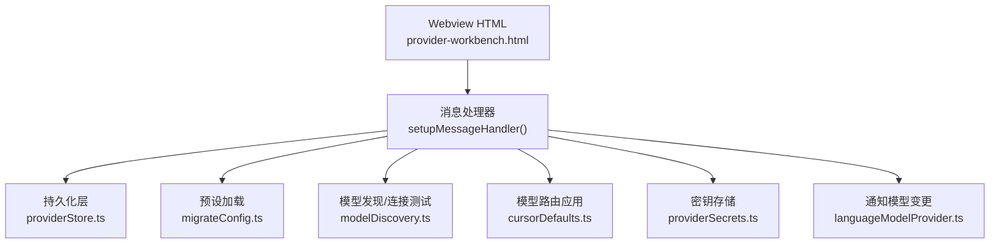
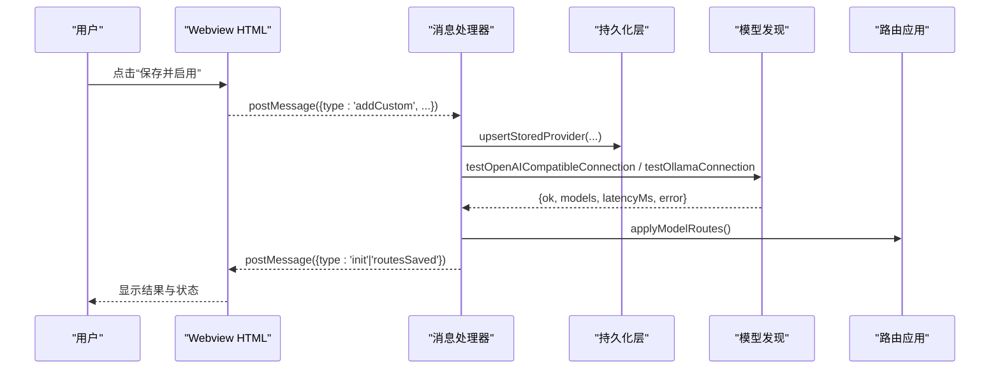
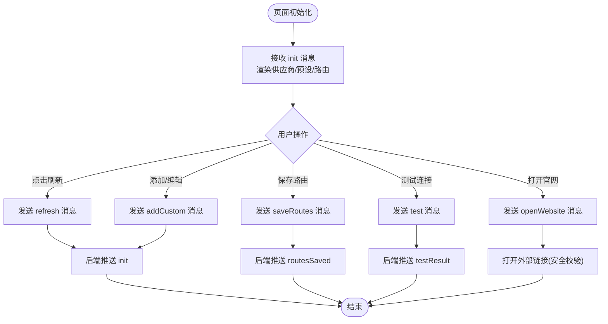
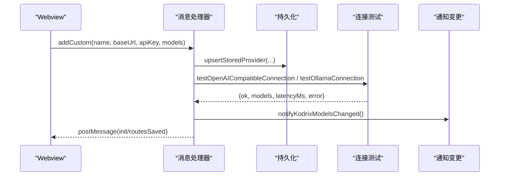
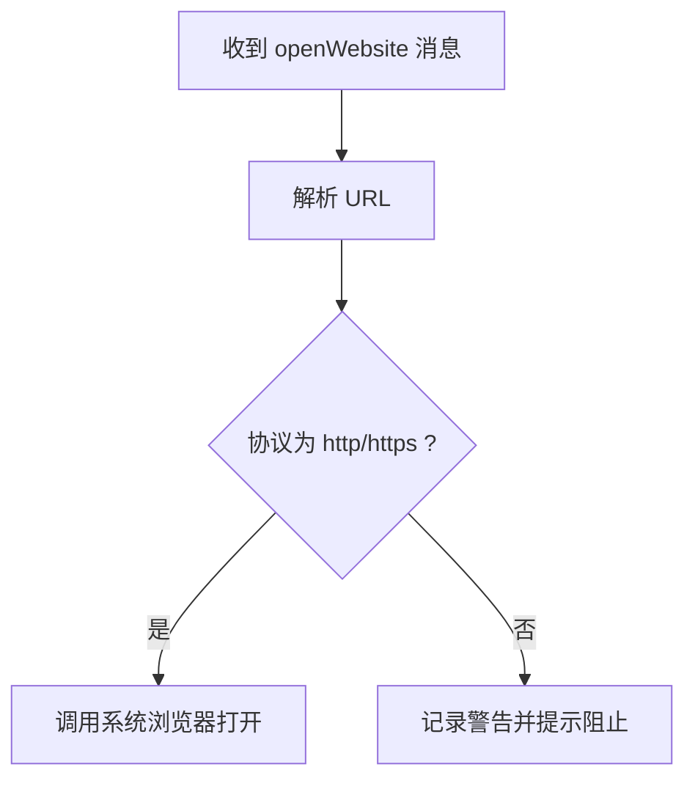
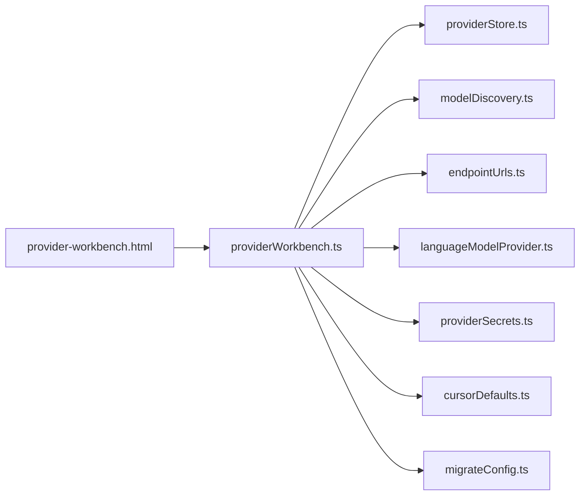

# Provider Workbench 界面

<cite>
**本文引用的文件**
- [provider-workbench.html](file://extensions/kodrix-local/resources/provider-workbench.html)
- [providerWorkbench.ts](file://extensions/kodrix-local/src/providerWorkbench.ts)
- [types.ts](file://extensions/kodrix-local/src/types.ts)
- [providerStore.ts](file://extensions/kodrix-local/src/providerStore.ts)
</cite>

## 目录
1. [简介](#简介)
2. [项目结构](#项目结构)
3. [核心组件](#核心组件)
4. [架构总览](#架构总览)
5. [详细组件分析](#详细组件分析)
6. [依赖关系分析](#依赖关系分析)
7. [性能考虑](#性能考虑)
8. [故障排查指南](#故障排查指南)
9. [结论](#结论)
10. [附录](#附录)

## 简介
Provider Workbench 是 Kodrix 扩展中的“AI 供应商管理”Webview，提供可视化的供应商列表、添加/编辑/删除、连接测试、多模型路由配置与预设模板应用等功能。它通过 VS Code Webview 与宿主扩展通信，将用户操作转换为后端逻辑（保存配置、持久化、调用模型发现接口等），并以友好的状态反馈呈现给用户。

## 项目结构
Provider Workbench 由两部分组成：
- 前端 UI：HTML + CSS + 内联脚本，负责渲染供应商列表、表单、路由设置，并通过 postMessage 与宿主通信。
- 后端处理：TypeScript 模块负责消息路由、数据持久化、安全校验、外部链接打开、连接测试与模型路由应用。

图表来源
- [providerWorkbench.ts:39-78](file://extensions/kodrix-local/src/providerWorkbench.ts#L39-L78)
- [providerStore.ts:13-89](file://extensions/kodrix-local/src/providerStore.ts#L13-L89)

章节来源
- [provider-workbench.html:1-460](file://extensions/kodrix-local/resources/provider-workbench.html#L1-L460)
- [providerWorkbench.ts:1-346](file://extensions/kodrix-local/src/providerWorkbench.ts#L1-L346)

## 核心组件
- Webview 面板与设置编辑器渲染器：注册并创建 Webview，注入 HTML，绑定消息处理器。
- 消息处理器：统一接收来自前端的命令（刷新、激活、删除、测试、保存路由、打开网站、填充路由等），并执行对应后端逻辑。
- 数据持久化：使用 VS Code 全局状态保存已配置的供应商和当前活动供应商；工作区配置保存模型路由。
- 连接测试：根据供应商类型（OpenAI 兼容、Anthropic、Ollama）发起最小请求探测连通性与可用模型。
- 安全校验：对外部链接进行白名单过滤（仅允许 http/https）。
- 预设模板：加载内置预设，支持一键应用或填入表单。

章节来源
- [providerWorkbench.ts:152-301](file://extensions/kodrix-local/src/providerWorkbench.ts#L152-L301)
- [providerStore.ts:13-89](file://extensions/kodrix-local/src/providerStore.ts#L13-L89)
- [provider-workbench.html:239-457](file://extensions/kodrix-local/resources/provider-workbench.html#L239-L457)

## 架构总览
Provider Workbench 采用典型的 Webview + 扩展宿主的双向通信架构。前端只负责展示与事件收集，所有业务逻辑在宿主侧完成，确保数据安全与一致性。

图表来源
- [providerWorkbench.ts:199-295](file://extensions/kodrix-local/src/providerWorkbench.ts#L199-L295)
- [provider-store.ts:21-89](file://extensions/kodrix-local/src/providerStore.ts#L21-L89)

## 详细组件分析

### Webview 界面与交互流程
- 顶部标题栏包含“刷新”按钮，用于重新拉取供应商列表与路由。
- 三个标签页：
  - 供应商：展示已配置的供应商卡片，支持设为当前、编辑、测试连接、移除。
  - 多模型路由：为 Plan/Agent/Code/Fast 四个角色分别指定模型名，支持保存与用当前供应商填充。
  - 添加接口：支持选择云端/本地、OpenAI/Anthropic base_url、填写 API Key、输入多个模型名；下方提供预设列表，点击可自动填充表单。
- 表单交互：
  - 切换接口模式时自动调整 base_url 占位符与默认值。
  - 从预设或已有供应商填充表单时，会保留 id/presetId 以区分新增与编辑。
- 状态反馈：
  - 测试结果以绿色/红色状态行显示延迟与模型数量或错误信息。
  - 路由保存后显示成功提示。

图表来源
- [provider-workbench.html:249-457](file://extensions/kodrix-local/resources/provider-workbench.html#L249-L457)
- [providerWorkbench.ts:152-301](file://extensions/kodrix-local/src/providerWorkbench.ts#L152-L301)

章节来源
- [provider-workbench.html:1-460](file://extensions/kodrix-local/resources/provider-workbench.html#L1-L460)

### 消息处理机制与后端通信
- 消息类型与职责：
  - ready/refresh：触发 pushState，向后端请求最新数据并渲染。
  - activate/remove/test/addCustom/openWebsite/fillRoutesFromActive/saveRoutes：分别对应激活供应商、删除供应商、测试连接、新增/编辑供应商、打开官网、填充路由、保存路由。
- 关键处理逻辑：
  - 激活：更新全局活动供应商，同步到运行时，并通知模型列表变更。
  - 删除：二次确认后删除配置与密钥，通知模型列表变更。
  - 测试：按供应商类型调用不同探测方法，返回连通性、延迟、模型列表或错误。
  - 新增/编辑：校验必填字段，保存密钥（云端必须），写入持久化，通知模型列表变更。
  - 打开网站：仅允许 http/https 协议，否则拒绝并提示。
  - 填充路由：读取当前活动供应商主模型，应用到各路由并保存。
  - 保存路由：写入工作区配置并应用。

图表来源
- [providerWorkbench.ts:199-245](file://extensions/kodrix-local/src/providerWorkbench.ts#L199-L245)
- [providerStore.ts:21-37](file://extensions/kodrix-local/src/providerStore.ts#L21-L37)

章节来源
- [providerWorkbench.ts:152-301](file://extensions/kodrix-local/src/providerWorkbench.ts#L152-L301)

### 安全验证机制
- URL 白名单过滤：
  - 仅允许 http/https 的外部链接，其他协议一律拒绝并记录警告。
- CSP 限制：
  - HTML 中设置了严格的内容安全策略，仅允许来自 cspSource 的样式、脚本与字体资源，图片允许 data URI。
- 密钥保护：
  - API Key 通过专用服务保存与读取，避免明文暴露。

图表来源
- [providerWorkbench.ts:29-37](file://extensions/kodrix-local/src/providerWorkbench.ts#L29-L37)
- [provider-workbench.html:6](file://extensions/kodrix-local/resources/provider-workbench.html#L6)

章节来源
- [providerWorkbench.ts:29-37](file://extensions/kodrix-local/src/providerWorkbench.ts#L29-L37)
- [provider-workbench.html:6](file://extensions/kodrix-local/resources/provider-workbench.html#L6)

### 预设模板应用与自定义配置
- 预设加载：
  - 启动时加载内置预设，分为本地与云端两类，并在“添加接口”页展示。
- 应用预设：
  - 点击预设可自动填充名称、类型、base_url、模型名等信息，支持后续手动补充。
  - 需要 API Key 的云端预设会在后端弹出输入框，支持密码输入。
- 自定义配置：
  - 支持选择 OpenAI 或 Anthropic base_url，支持 Ollama 本地模型（自动补全 /v1）。
  - 模型名支持每行一个或逗号分隔，后端会解析为数组。

章节来源
- [providerWorkbench.ts:275-288](file://extensions/kodrix-local/src/providerWorkbench.ts#L275-L288)
- [provider-workbench.html:387-420](file://extensions/kodrix-local/resources/provider-workbench.html#L387-L420)

### 模型路由设置
- 路由项：Plan、Agent、Code、Fast，每项可独立指定模型名。
- 保存与应用：
  - 保存后将路由写入工作区配置，并立即应用到运行环境。
  - 支持“用当前供应商填充”，将当前活动供应商的主模型应用到全部路由。

章节来源
- [providerWorkbench.ts:258-295](file://extensions/kodrix-local/src/providerWorkbench.ts#L258-L295)
- [providerStore.ts:79-89](file://extensions/kodrix-local/src/providerStore.ts#L79-L89)

### 错误处理与用户反馈
- 前端：
  - 测试结果以状态行显示成功/失败，包含延迟与模型数量或错误信息。
  - 路由保存成功后显示成功提示。
- 后端：
  - 未知消息类型记录警告日志。
  - 异常捕获后以错误消息弹窗反馈。
  - 删除操作提供确认对话框，防止误删。

章节来源
- [provider-workbench.html:441-453](file://extensions/kodrix-local/resources/provider-workbench.html#L441-L453)
- [providerWorkbench.ts:297-301](file://extensions/kodrix-local/src/providerWorkbench.ts#L297-L301)

## 依赖关系分析
- 前端依赖：
  - VS Code Webview API（acquireVsCodeApi）用于与宿主通信。
  - 主题变量与 codicons 图标用于样式与图标渲染。
- 后端依赖：
  - providerStore：读写全局状态与工作区配置。
  - modelDiscovery：连接测试（OpenAI 兼容、Anthropic、Ollama）。
  - endpointUrls：构造 Anthropic 消息接口地址。
  - languageModelProvider：通知模型列表变更。
  - providerSecrets：安全地保存与读取 API Key。
  - cursorDefaults：应用模型路由到运行环境。
  - migrateConfig：加载与套用预设模板。

图表来源
- [providerWorkbench.ts:8-24](file://extensions/kodrix-local/src/providerWorkbench.ts#L8-L24)

章节来源
- [providerWorkbench.ts:8-24](file://extensions/kodrix-local/src/providerWorkbench.ts#L8-L24)

## 性能考虑
- Webview 选项：
  - 启用脚本与隐藏时保持上下文，减少重复初始化开销。
  - 限定本地资源根目录，提升资源加载安全性与效率。
- 网络请求：
  - 连接测试使用超时信号，避免长时间阻塞。
- 渲染优化：
  - 列表与表单按需渲染，避免不必要的重绘。
  - 使用 CSS 变量与主题适配，减少样式计算成本。

[本节为通用指导，不直接分析具体文件]

## 故障排查指南
- 无法加载 HTML 资源：
  - 检查扩展资源路径是否正确，查看日志警告。
- 连接测试失败：
  - 确认 base_url 与 API Key 正确；Anthropic 需携带版本头；OpenAI 兼容需确保接口可达。
- 路由未生效：
  - 检查是否点击“保存路由”；确认工作区配置已更新。
- 外部链接被阻止：
  - 仅允许 http/https；其他协议会被拒绝并提示。

章节来源
- [providerWorkbench.ts:49-55](file://extensions/kodrix-local/src/providerWorkbench.ts#L49-L55)
- [providerWorkbench.ts:99-149](file://extensions/kodrix-local/src/providerWorkbench.ts#L99-L149)
- [providerWorkbench.ts:250-256](file://extensions/kodrix-local/src/providerWorkbench.ts#L250-L256)

## 结论
Provider Workbench 提供了完整的 AI 供应商管理能力，涵盖可视化列表、增删改查、连接测试、预设模板与模型路由配置。其前后端分离的消息驱动架构确保了安全性与可扩展性，配合严格的 URL 白名单与 CSP 策略，有效降低了安全风险。通过清晰的错误处理与用户反馈，提升了配置体验与可维护性。

## 附录

### 数据类型定义
- 预设与存储供应商：
  - ProviderPreset：描述内置预设的元数据（id、category、name、api_type、base_url、model(s)、needs_api_key、hint、icon、website）。
  - StoredProvider：持久化的供应商实体（id、presetId、name、category、api_type、base_url、model(s)、groupName、needs_api_key、pendingApiKey、registeredAt）。
  - ModelRouteEntry/ModelRoutes：模型路由条目与映射。

章节来源
- [types.ts:5-40](file://extensions/kodrix-local/src/types.ts#L5-L40)

### 界面定制指南与样式覆盖
- 主题变量：
  - 使用 --vscode-* 变量（背景、前景、边框、强调色、危险色、成功色）实现主题自适应。
- 覆盖建议：
  - 通过 VS Code 主题扩展或工作区设置覆盖 CSS 变量，即可改变整体外观。
  - 如需更细粒度控制，可在 Webview 中引入自定义样式表（需遵守 CSP 限制）。

章节来源
- [provider-workbench.html:11-20](file://extensions/kodrix-local/resources/provider-workbench.html#L11-L20)