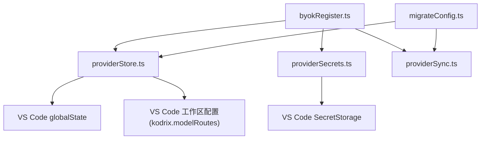
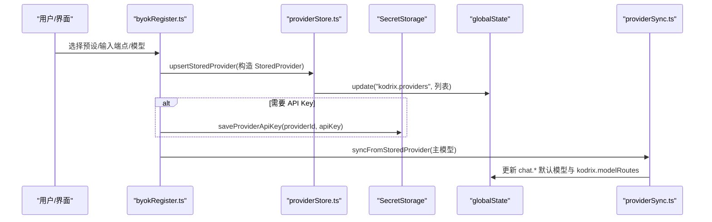
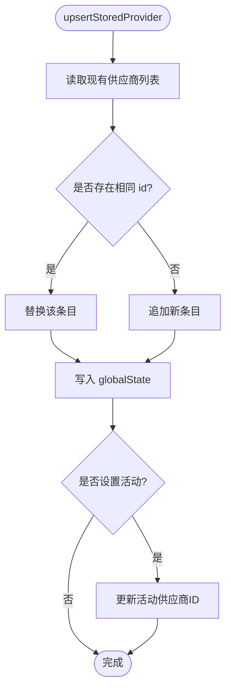
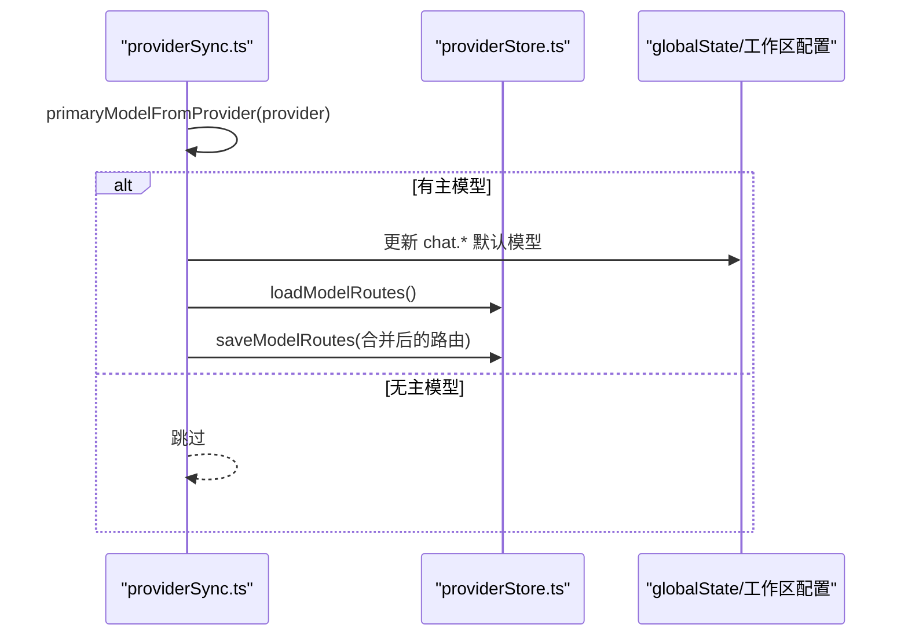
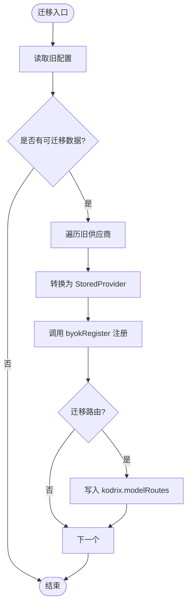
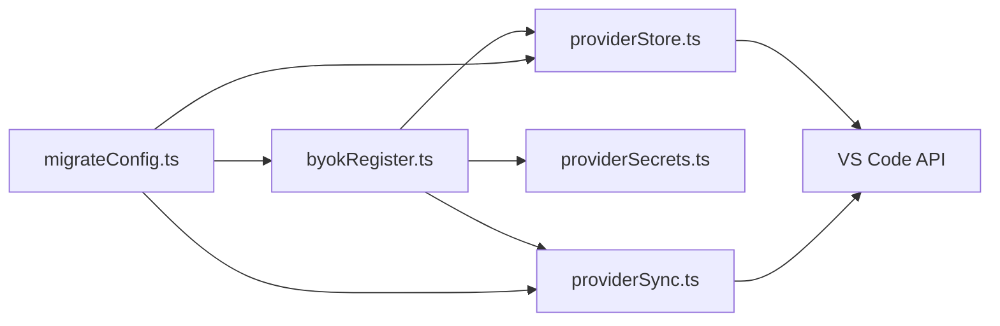

# 供应商数据存储

<cite>
**本文引用的文件**
- [providerStore.ts](file://extensions/kodrix-local/src/providerStore.ts)
- [types.ts](file://extensions/kodrix-local/src/types.ts)
- [byokRegister.ts](file://extensions/kodrix-local/src/byokRegister.ts)
- [migrateConfig.ts](file://extensions/kodrix-local/src/migrateConfig.ts)
- [providerSecrets.ts](file://extensions/kodrix-local/src/providerSecrets.ts)
- [providerSync.ts](file://extensions/kodrix-local/src/providerSync.ts)
</cite>

## 目录
1. [简介](#简介)
2. [项目结构](#项目结构)
3. [核心组件](#核心组件)
4. [架构总览](#架构总览)
5. [详细组件分析](#详细组件分析)
6. [依赖关系分析](#依赖关系分析)
7. [性能考虑](#性能考虑)
8. [故障排查指南](#故障排查指南)
9. [结论](#结论)
10. [附录](#附录)

## 简介
本文件围绕“供应商数据存储”展开，聚焦 providerStore 的数据持久化机制与相关协作模块。内容涵盖：
- StoredProvider 数据模型定义、字段含义与约束规则
- VS Code globalState 的安全使用方式（存储/检索）
- 数据迁移策略（不同版本间数据结构变更的处理）
- CRUD 操作实现细节（upsertStoredProvider、removeStoredProvider、loadStoredProviders 等）
- 备份与恢复机制建议
- 数据完整性验证方法
- 性能优化建议与最佳实践

## 项目结构
该功能位于扩展 kodrix-local 中，核心文件与职责如下：
- types.ts：定义共享类型，包括 ProviderPreset、StoredProvider、ModelRoutes 等
- providerStore.ts：基于 VS Code context.globalState 的供应商配置持久化层，提供加载、更新、删除、活动供应商管理以及模型路由读写
- byokRegister.ts：通过 Copilot BYOK（Custom Endpoint）注册自定义模型，并调用 providerStore 保存状态
- migrateConfig.ts：从旧版配置文件迁移至新结构，必要时写入 globalState 或工作区配置
- providerSecrets.ts：将敏感信息（API Key）存入 VS Code SecretStorage，避免明文落盘
- providerSync.ts：将当前供应商的主模型同步到 Chat 默认模型与 kodrix 路由

图表来源
- [providerStore.ts:13-89](file://extensions/kodrix-local/src/providerStore.ts#L13-L89)
- [byokRegister.ts:145-237](file://extensions/kodrix-local/src/byokRegister.ts#L145-L237)
- [migrateConfig.ts:277-360](file://extensions/kodrix-local/src/migrateConfig.ts#L277-L360)
- [providerSecrets.ts:11-35](file://extensions/kodrix-local/src/providerSecrets.ts#L11-L35)
- [providerSync.ts:21-55](file://extensions/kodrix-local/src/providerSync.ts#L21-L55)

章节来源
- [providerStore.ts:1-111](file://extensions/kodrix-local/src/providerStore.ts#L1-L111)
- [types.ts:1-40](file://extensions/kodrix-local/src/types.ts#L1-L40)

## 核心组件
- 数据模型
  - StoredProvider：表示一个已配置的 AI 供应商实例，包含标识、名称、类别、API 类型、基础地址、主模型、模型列表、分组名、是否需要 API Key、是否待填密钥、注册时间等
  - ModelRoutes：按用途（如 plan/agent/code/fast）映射到具体模型的配置记录
- 持久化层
  - loadStoredProviders：从 globalState 读取供应商列表
  - upsertStoredProvider：新增或更新供应商，并可选设置活动供应商
  - removeStoredProvider：删除指定供应商，并在需要时清理活动供应商
  - storePendingProvider：为需要后续补全 API Key 的供应商创建“待激活”条目
  - storedProviderFromPreset：根据预设生成 StoredProvider
- 同步层
  - syncFromStoredProvider：将当前供应商的主模型同步到 Chat 默认模型与 kodrix 路由
- 安全层
  - saveProviderApiKey/readProviderApiKey/deleteProviderApiKey：通过 SecretStorage 安全存取 API Key

章节来源
- [types.ts:5-40](file://extensions/kodrix-local/src/types.ts#L5-L40)
- [providerStore.ts:13-111](file://extensions/kodrix-local/src/providerStore.ts#L13-L111)
- [providerSync.ts:10-55](file://extensions/kodrix-local/src/providerSync.ts#L10-L55)
- [providerSecrets.ts:7-35](file://extensions/kodrix-local/src/providerSecrets.ts#L7-L35)

## 架构总览
providerStore 作为“供应商配置”的单一事实来源，负责在 VS Code 全局状态中维护供应商集合与活动供应商 ID；byokRegister 负责用户交互与外部系统（Copilot BYOK）注册；migrateConfig 负责历史配置迁移；providerSecrets 负责密钥安全存储；providerSync 负责将供应商配置同步到 Chat 默认模型与路由。

图表来源
- [byokRegister.ts:145-237](file://extensions/kodrix-local/src/byokRegister.ts#L145-L237)
- [providerStore.ts:21-37](file://extensions/kodrix-local/src/providerStore.ts#L21-L37)
- [providerSecrets.ts:11-21](file://extensions/kodrix-local/src/providerSecrets.ts#L11-L21)
- [providerSync.ts:21-55](file://extensions/kodrix-local/src/providerSync.ts#L21-L55)

## 详细组件分析

### 数据模型：StoredProvider 与 ModelRoutes
- StoredProvider 关键字段
  - id：唯一标识，用于定位与删除
  - presetId：关联的预设 ID（可选）
  - name：显示名称
  - category：local/cloud，区分本地与云端
  - api_type：API 类型（如 openai/ollama/anthropic/gemini 等）
  - base_url：API 基础地址
  - model：主模型
  - models：模型列表
  - groupName：分组名（用于 BYOK 注册组名）
  - needs_api_key：是否需要 API Key
  - pendingApiKey：是否处于“待填写密钥”状态
  - registeredAt：注册时间戳
- ModelRoutes
  - 以用途键（plan/agent/code/fast）为 key，值为 { model?: string } 的结构，用于将主模型写入对应路由

章节来源
- [types.ts:5-40](file://extensions/kodrix-local/src/types.ts#L5-L40)

### 持久化层：providerStore 的实现要点
- 存储键
  - PROVIDERS_KEY：供应商数组
  - ACTIVE_PROVIDER_KEY：活动供应商 ID
- 关键方法
  - loadStoredProviders(context)：读取供应商列表，空则返回空数组
  - getActiveProviderId(context)：读取活动供应商 ID
  - upsertStoredProvider(context, provider, options?)：
    - 查找是否存在同 id 的条目，存在则替换，否则追加
    - 写回 globalState
    - 若未显式关闭 setActive，则同时更新活动供应商 ID
  - storePendingProvider(context, preset, storageKey, groupName, overrides?)：
    - 根据预设构建 StoredProvider，标记 pendingApiKey=true，不设为活动
  - removeStoredProvider(context, providerId)：
    - 过滤掉目标 id 后写回
    - 若被删除的是活动供应商，则将活动切换到剩余第一个
  - loadModelRoutes()/saveModelRoutes(routes)：读写工作区配置中的 kodrix.modelRoutes

图表来源
- [providerStore.ts:21-37](file://extensions/kodrix-local/src/providerStore.ts#L21-L37)

章节来源
- [providerStore.ts:13-89](file://extensions/kodrix-local/src/providerStore.ts#L13-L89)

### 安全存储：API Key 的 SecretStorage 使用
- 通过 providerSecrets.ts 提供的接口，将 API Key 以 providerId 为命名空间存入 SecretStorage
- 优点：避免将密钥写入 settings.json 等明文位置
- 使用场景：注册原生供应商或自定义端点时，若检测到需要 API Key，则调用保存

章节来源
- [providerSecrets.ts:7-35](file://extensions/kodrix-local/src/providerSecrets.ts#L7-L35)
- [byokRegister.ts:145-237](file://extensions/kodrix-local/src/byokRegister.ts#L145-L237)

### 同步层：将供应商配置同步到 Chat 默认模型与路由
- primaryModelFromProvider：优先取 model，其次取 models 中首个非空项
- syncDefaultChatModels：将主模型写入多个 Chat 默认模型键，并写入 kodrix.modelRoutes（支持仅填充空路由模式）
- syncFromStoredProvider：从 StoredProvider 提取主模型并执行同步

图表来源
- [providerSync.ts:10-55](file://extensions/kodrix-local/src/providerSync.ts#L10-L55)
- [providerStore.ts:79-89](file://extensions/kodrix-local/src/providerStore.ts#L79-L89)

章节来源
- [providerSync.ts:10-55](file://extensions/kodrix-local/src/providerSync.ts#L10-L55)

### 迁移策略：跨版本数据结构变更处理
- 迁移入口：migrateConfig.ts 的 migrateFromLegacy
- 行为
  - 读取旧版 config.json 与 providers.json
  - 将每个 LegacyProvider 转换为新的 StoredProvider 并通过 byokRegister 注册（Ollama/Anthropic/Gemini/自定义端点）
  - 将 active_provider_id 映射为新结构的 kodrix.activeProviderId
  - 将 model_routes 迁移到 kodrix.modelRoutes，并尝试回填各 Agent 默认模型
  - 对 MCP 服务器、插件等资源进行迁移与合并
- 关键点
  - 迁移过程中会调用 loadStoredProviders 与 syncFromStoredProvider，确保新状态生效
  - 对路径访问做安全检查，防止越界读取

图表来源
- [migrateConfig.ts:277-360](file://extensions/kodrix-local/src/migrateConfig.ts#L277-L360)
- [migrateConfig.ts:329-359](file://extensions/kodrix-local/src/migrateConfig.ts#L329-L359)

章节来源
- [migrateConfig.ts:277-472](file://extensions/kodrix-local/src/migrateConfig.ts#L277-L472)

### CRU/D 操作实现细节
- 创建/更新（Upsert）
  - upsertStoredProvider：按 id 去重更新或追加，并可选设置为活动供应商
  - storePendingProvider：为需要后续补全 API Key 的供应商创建“待激活”条目
  - storedProviderFromPreset：由预设生成 StoredProvider
- 读取（Load）
  - loadStoredProviders：读取全部供应商
  - getActiveProviderId：读取活动供应商 ID
  - loadModelRoutes：读取模型路由
- 删除（Remove）
  - removeStoredProvider：删除指定供应商，必要时清理活动供应商
- 补充说明
  - 所有写操作均通过 context.globalState.update 持久化
  - 活动供应商切换逻辑保证始终有一个有效活动项（当列表非空时）

章节来源
- [providerStore.ts:13-89](file://extensions/kodrix-local/src/providerStore.ts#L13-L89)

### 数据备份与恢复机制
- 现状
  - 供应商配置存储在 VS Code globalState 中，可通过导出/导入扩展数据的方式备份（例如 VS Code 的“导出设置/数据”功能）
  - 模型路由存储在工作区配置中，可通过 settings.json 备份
  - API Key 存储在 SecretStorage，通常随账户/机器绑定，不建议直接导出
- 建议方案
  - 定期导出 VS Code 数据（含 globalState），以便恢复供应商配置
  - 单独备份 kodrix.modelRoutes（settings.json 中）
  - 如需跨设备迁移，需重新输入 API Key（受限于 SecretStorage 安全策略）
  - 可在业务层增加“导出/导入 JSON”命令，将 StoredProvider 列表与路由导出为文件，便于归档与审计（注意脱敏）

[本节为通用建议，不直接分析具体代码文件]

### 数据完整性验证方法
- 基本校验
  - 检查 StoredProvider.id 唯一性（upsert 已保证）
  - 检查 base_url 非空且格式合理（建议在注册流程中校验）
  - 检查 models 至少包含一个非空模型（或在同步前允许为空）
  - 检查 category/api_type/name 等必填字段
- 运行时校验
  - 在 reapplyStoredProvider 中，依据 api_type 分支校验必要参数（如 Ollama/base_url、Anthropic/Gemini 的 API Key）
  - 在 syncFromStoredProvider 中，若主模型为空则跳过写入，避免污染默认模型
- 迁移期校验
  - 迁移时对旧配置进行容错解析，缺失字段采用默认值或跳过
  - 对路径访问进行边界检查，防止越界读取

章节来源
- [byokRegister.ts:363-422](file://extensions/kodrix-local/src/byokRegister.ts#L363-L422)
- [providerSync.ts:10-55](file://extensions/kodrix-local/src/providerSync.ts#L10-L55)
- [migrateConfig.ts:57-93](file://extensions/kodrix-local/src/migrateConfig.ts#L57-L93)

## 依赖关系分析
- byokRegister.ts 依赖 providerStore.ts 进行状态持久化，依赖 providerSecrets.ts 保存密钥，依赖 providerSync.ts 同步默认模型
- migrateConfig.ts 依赖 byokRegister.ts 进行注册，依赖 providerStore.ts 读取/写入状态，依赖 providerSync.ts 同步路由
- providerStore.ts 依赖 VS Code API（context.globalState、workspace.getConfiguration）
- providerSync.ts 依赖 providerStore.ts 读取路由，依赖 safeUpdateConfiguration 写入默认模型

图表来源
- [byokRegister.ts:1-22](file://extensions/kodrix-local/src/byokRegister.ts#L1-L22)
- [migrateConfig.ts:1-23](file://extensions/kodrix-local/src/migrateConfig.ts#L1-L23)
- [providerStore.ts:1-11](file://extensions/kodrix-local/src/providerStore.ts#L1-L11)
- [providerSync.ts:1-9](file://extensions/kodrix-local/src/providerSync.ts#L1-L9)

章节来源
- [byokRegister.ts:1-423](file://extensions/kodrix-local/src/byokRegister.ts#L1-L423)
- [migrateConfig.ts:1-472](file://extensions/kodrix-local/src/migrateConfig.ts#L1-L472)
- [providerStore.ts:1-111](file://extensions/kodrix-local/src/providerStore.ts#L1-L111)
- [providerSync.ts:1-57](file://extensions/kodrix-local/src/providerSync.ts#L1-L57)

## 性能考虑
- 批量写入优化
  - 在频繁更新场景下，尽量合并多次 upsert 为一次 write，减少 globalState.update 调用次数
- 缓存与惰性加载
  - 启动时一次性加载 loadStoredProviders，并在内存中缓存，避免重复读取
- 异步与错误隔离
  - 对网络相关的注册流程（BYOK）进行重试与超时控制，避免阻塞 UI
- 路由更新节流
  - 对 syncDefaultChatModels 的写入进行节流，避免短时间内多次覆盖默认模型
- 大对象存储
  - StoredProvider 列表应保持精简，避免冗余字段导致 globalState 膨胀

[本节为通用建议，不直接分析具体代码文件]

## 故障排查指南
- 常见问题
  - 活动供应商被误删：检查 removeStoredProvider 后是否正确更新活动供应商
  - 默认模型未生效：确认 syncFromStoredProvider 是否被调用，以及主模型是否为空
  - API Key 丢失：检查 SecretStorage 中对应 providerId 的密钥是否存在
  - 迁移失败：查看日志输出，确认旧配置路径与权限
- 诊断步骤
  - 读取 loadStoredProviders 结果，核对 id、category、api_type、base_url、models 等字段
  - 读取 getActiveProviderId，确认活动供应商是否指向预期条目
  - 读取 kodrix.modelRoutes，确认路由是否被正确写入
  - 检查 providerSecrets 中是否存在对应密钥
- 日志与提示
  - byokRegister 与 migrateConfig 中包含警告与错误提示，结合 VS Code 输出面板定位问题

章节来源
- [providerStore.ts:67-77](file://extensions/kodrix-local/src/providerStore.ts#L67-L77)
- [providerSync.ts:21-55](file://extensions/kodrix-local/src/providerSync.ts#L21-L55)
- [providerSecrets.ts:23-35](file://extensions/kodrix-local/src/providerSecrets.ts#L23-L35)
- [migrateConfig.ts:115-123](file://extensions/kodrix-local/src/migrateConfig.ts#L115-L123)

## 结论
providerStore 通过 VS Code globalState 实现了稳定、易用的供应商配置持久化，配合 byokRegister、migrateConfig、providerSecrets 与 providerSync，形成了完整的“注册—存储—同步—迁移”闭环。遵循本文的最佳实践与性能建议，可进一步提升系统的可靠性与用户体验。

## 附录
- 关键函数路径参考
  - 加载供应商：[loadStoredProviders:13-15](file://extensions/kodrix-local/src/providerStore.ts#L13-L15)
  - 更新/新增供应商：[upsertStoredProvider:21-37](file://extensions/kodrix-local/src/providerStore.ts#L21-L37)
  - 删除供应商：[removeStoredProvider:67-77](file://extensions/kodrix-local/src/providerStore.ts#L67-L77)
  - 读取活动供应商：[getActiveProviderId:17-19](file://extensions/kodrix-local/src/providerStore.ts#L17-L19)
  - 写入模型路由：[saveModelRoutes:83-89](file://extensions/kodrix-local/src/providerStore.ts#L83-L89)
  - 同步默认模型：[syncFromStoredProvider:48-55](file://extensions/kodrix-local/src/providerSync.ts#L48-L55)
  - 保存 API Key：[saveProviderApiKey:11-21](file://extensions/kodrix-local/src/providerSecrets.ts#L11-L21)
  - 迁移入口：[migrateFromLegacy:277-360](file://extensions/kodrix-local/src/migrateConfig.ts#L277-L360)