# 凭据安全管理

<cite>
**本文引用的文件**   
- [providerSecrets.ts](file://extensions/kodrix-local/src/providerSecrets.ts)
- [byokRegister.ts](file://extensions/kodrix-local/src/byokRegister.ts)
- [providerWorkbench.ts](file://extensions/kodrix-local/src/providerWorkbench.ts)
- [secretStorage.ts](file://extensions/kodrix-agent-os/src/secretStorage.ts)
- [settingsPage.ts](file://extensions/kodrix-agent-os/src/codebase/settingsPage.ts)
- [tabCompletion.ts](file://extensions/kodrix-agent-os/src/completion/tabCompletion.ts)
- [extension.ts](file://extensions/kodrix-agent-os/src/extension.ts)
- [SECURITY.md](file://SECURITY.md)
- [betterSecretStorage.ts](file://extensions/microsoft-authentication/src/betterSecretStorage.ts)
</cite>

## 更新摘要
**变更内容**   
- 新增 FIM（Fill-In-Middle）API 密钥的 SecretStorage 支持
- 新增 Embedding（语义检索）API 密钥的 SecretStorage 支持  
- 改进用户界面，实时显示密钥配置状态
- 增强密钥生命周期管理和状态同步机制
- **新增** 未知密钥处理的调试能力，使用 console.warn 记录未识别的秘密密钥警告

## 目录
1. [引言](#引言)
2. [项目结构](#项目结构)
3. [核心组件](#核心组件)
4. [架构总览](#架构总览)
5. [详细组件分析](#详细组件分析)
6. [依赖关系分析](#依赖关系分析)
7. [性能与可用性考虑](#性能与可用性考虑)
8. [故障排查指南](#故障排查指南)
9. [结论](#结论)
10. [附录：最佳实践与集成方案](#附录最佳实践与集成方案)

## 引言
本文件聚焦 Kodrix 扩展中的凭据安全管理，围绕 providerSecrets 的安全机制展开，覆盖 API Key 的加密存储、访问控制、生命周期管理、密钥轮换与失效处理、安全最佳实践、审计日志、导入导出与第三方密码管理器集成，以及漏洞防护与异常处理。文档同时结合 VS Code SecretStorage API 的使用方式，说明如何在扩展中安全地保存和读取敏感信息。

**更新** 本次更新重点增强了 FIM 和 Embedding API 密钥的安全管理，并改进了用户界面的密钥配置状态显示功能。**特别新增了未知密钥处理的调试能力**，当处理秘密配置时，系统现在使用 console.warn 记录未识别的秘密密钥的警告，提供更好的配置问题调试能力。

## 项目结构
与凭据安全直接相关的代码主要位于 kodrix-local 扩展、kodrix-agent-os 扩展与 microsoft-authentication 扩展中：
- kodrix-local 扩展负责供应商（Provider）注册、模型发现、Webview 管理界面与凭据读写。
- kodrix-agent-os 扩展提供 FIM 和 Embedding 专用密钥管理，以及增强的设置页面 UI。
- microsoft-authentication 扩展提供 BetterTokenStorage，演示基于 SecretStorage 的多窗口同步与事件驱动更新模式。

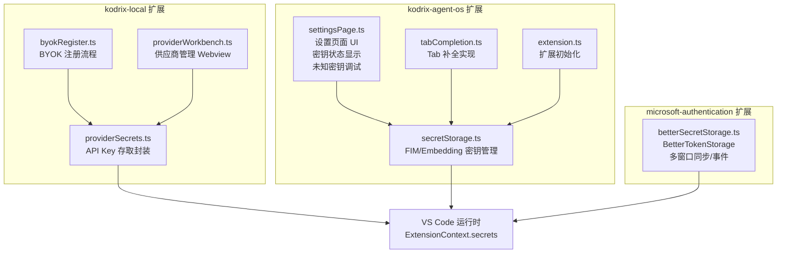

**图表来源**
- [providerSecrets.ts:1-37](file://extensions/kodrix-local/src/providerSecrets.ts#L1-L37)
- [byokRegister.ts:1-424](file://extensions/kodrix-local/src/byokRegister.ts#L1-L424)
- [providerWorkbench.ts:1-346](file://extensions/kodrix-local/src/providerWorkbench.ts#L1-L346)
- [secretStorage.ts:1-46](file://extensions/kodrix-agent-os/src/secretStorage.ts#L1-L46)
- [settingsPage.ts:1-765](file://extensions/kodrix-agent-os/src/codebase/settingsPage.ts#L1-L765)
- [tabCompletion.ts:1-235](file://extensions/kodrix-agent-os/src/completion/tabCompletion.ts#L1-L235)
- [extension.ts:150-168](file://extensions/kodrix-agent-os/src/extension.ts#L150-L168)
- [betterSecretStorage.ts:1-249](file://extensions/microsoft-authentication/src/betterSecretStorage.ts#L1-L249)

**章节来源**
- [providerSecrets.ts:1-37](file://extensions/kodrix-local/src/providerSecrets.ts#L1-L37)
- [byokRegister.ts:1-424](file://extensions/kodrix-local/src/byokRegister.ts#L1-L424)
- [providerWorkbench.ts:1-346](file://extensions/kodrix-local/src/providerWorkbench.ts#L1-L346)
- [secretStorage.ts:1-46](file://extensions/kodrix-agent-os/src/secretStorage.ts#L1-L46)
- [settingsPage.ts:1-765](file://extensions/kodrix-agent-os/src/codebase/settingsPage.ts#L1-L765)
- [tabCompletion.ts:1-235](file://extensions/kodrix-agent-os/src/completion/tabCompletion.ts#L1-L235)
- [extension.ts:150-168](file://extensions/kodrix-agent-os/src/extension.ts#L150-L168)
- [betterSecretStorage.ts:1-249](file://extensions/microsoft-authentication/src/betterSecretStorage.ts#L1-L249)

## 核心组件
- providerSecrets：对 VS Code ExtensionContext.secrets 的轻量封装，提供按 providerId 命名空间化的 API Key 存取接口。
- byokRegister：实现 BYOK（Bring Your Own Key）注册流程，将用户提供的 API Key 写入 SecretStorage，并触发模型路由与应用。
- providerWorkbench：提供"AI 供应商管理"Webview，支持测试连接、添加/删除/激活供应商、保存/应用模型路由，并在删除时清理 SecretStorage。
- secretStorage：**新增** 专门管理 FIM 和 Embedding API 密钥的 SecretStorage 封装，提供独立的密钥存储键名和存取方法。
- settingsPage：**新增** 增强的设置页面，支持实时显示密钥配置状态，提供直观的用户界面，**新增未知密钥调试功能**。
- tabCompletion：**新增** Tab 补全功能的实现，使用 FIM API 密钥进行代码补全。
- extension：**新增** 扩展初始化逻辑，自动同步 Embedding 提供者状态。
- betterSecretStorage：展示 SecretStorage 的高级用法，包括键列表维护、多窗口变更监听、并发操作保护与序列化/反序列化。

**章节来源**
- [providerSecrets.ts:1-37](file://extensions/kodrix-local/src/providerSecrets.ts#L1-L37)
- [byokRegister.ts:1-424](file://extensions/kodrix-local/src/byokRegister.ts#L1-L424)
- [providerWorkbench.ts:1-346](file://extensions/kodrix-local/src/providerWorkbench.ts#L1-L346)
- [secretStorage.ts:1-46](file://extensions/kodrix-agent-os/src/secretStorage.ts#L1-L46)
- [settingsPage.ts:1-765](file://extensions/kodrix-agent-os/src/codebase/settingsPage.ts#L1-L765)
- [tabCompletion.ts:1-235](file://extensions/kodrix-agent-os/src/completion/tabCompletion.ts#L1-L235)
- [extension.ts:150-168](file://extensions/kodrix-agent-os/src/extension.ts#L150-L168)
- [betterSecretStorage.ts:1-249](file://extensions/microsoft-authentication/src/betterSecretStorage.ts#L1-L249)

## 架构总览
下图展示了从用户输入到凭据落盘、再到模型路由应用的完整调用链，包括新增的 FIM 和 Embedding 密钥管理流程以及未知密钥处理机制。

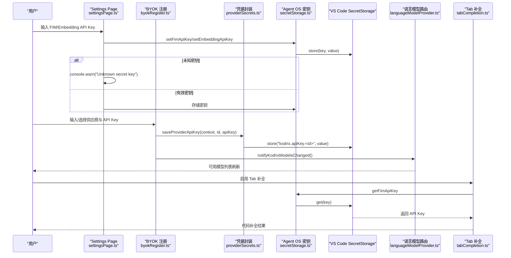

**图表来源**
- [settingsPage.ts:109-144](file://extensions/kodrix-agent-os/src/codebase/settingsPage.ts#L109-L144)
- [secretStorage.ts:22-45](file://extensions/kodrix-agent-os/src/secretStorage.ts#L22-L45)
- [providerWorkbench.ts:152-301](file://extensions/kodrix-local/src/providerWorkbench.ts#L152-L301)
- [byokRegister.ts:253-361](file://extensions/kodrix-local/src/byokRegister.ts#L253-L361)
- [providerSecrets.ts:11-21](file://extensions/kodrix-local/src/providerSecrets.ts#L11-L21)
- [tabCompletion.ts:166-189](file://extensions/kodrix-agent-os/src/completion/tabCompletion.ts#L166-L189)

## 详细组件分析

### 组件一：providerSecrets（API Key 加密存储）
- 设计要点
  - 使用 ExtensionContext.secrets 进行加密存储，避免写入 settings.json 或仓库。
  - 通过 apiKeySecretId(providerId) 生成唯一键名，形成按供应商隔离的命名空间。
  - 提供 save/read/delete 三件套，统一 trim 空值与未找到返回 undefined。
- 安全特性
  - 不暴露明文到配置或日志。
  - 删除操作确保 SecretStorage 对应键被移除。
- 复杂度
  - 时间 O(1)，空间 O(1)。

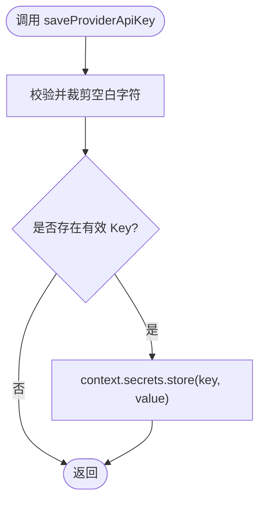

**图表来源**
- [providerSecrets.ts:11-21](file://extensions/kodrix-local/src/providerSecrets.ts#L11-L21)

**章节来源**
- [providerSecrets.ts:1-37](file://extensions/kodrix-local/src/providerSecrets.ts#L1-L37)

### 组件二：byokRegister（BYOK 注册与密钥写入）
- 功能概述
  - 根据预设（Anthropic/Gemini/Ollama/OpenAI 兼容）构建 Provider 配置。
  - 在注册过程中调用 saveProviderApiKey 将 API Key 写入 SecretStorage。
  - 注册成功后通知模型路由刷新，必要时进入"待补充 Key"状态。
- 关键路径
  - registerNativeVendor：原生供应商注册，写入 Key 并持久化 StoredProvider。
  - registerCustomEndpointModels：自定义端点注册，同样写入 Key。
  - applyPresetWithByok：统一入口，分支处理不同 api_type，必要时引导用户打开供应商管理。
- 错误与重试
  - 对 Copilot 命令迁移失败进行有限次重试与警告日志。

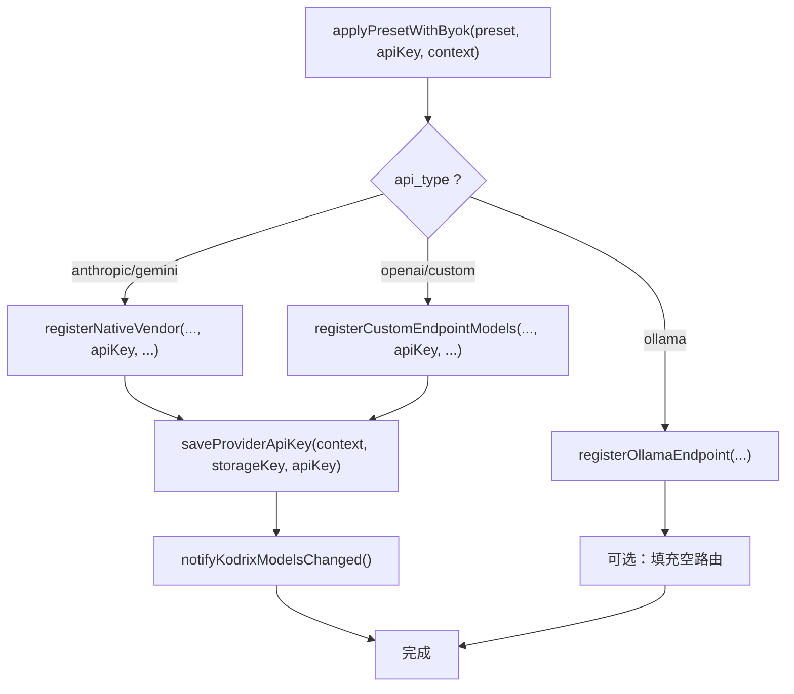

**图表来源**
- [byokRegister.ts:145-167](file://extensions/kodrix-local/src/byokRegister.ts#L145-L167)
- [byokRegister.ts:202-237](file://extensions/kodrix-local/src/byokRegister.ts#L202-L237)
- [byokRegister.ts:253-361](file://extensions/kodrix-local/src/byokRegister.ts#L253-L361)

**章节来源**
- [byokRegister.ts:1-424](file://extensions/kodrix-local/src/byokRegister.ts#L1-L424)

### 组件三：providerWorkbench（供应商管理与密钥生命周期）
- 功能概述
  - 提供 Webview 面板，用于添加/删除/激活供应商，测试连通性，保存/应用模型路由。
  - 删除供应商时同步删除 SecretStorage 中的对应 API Key。
  - 对外部链接进行白名单校验（仅允许 http/https）。
- 生命周期
  - 新增：保存 API Key → 持久化 StoredProvider → 刷新模型列表。
  - 删除：确认 → 删除 StoredProvider → 删除 SecretStorage Key → 刷新。
  - 激活：设置 activeProviderId → 同步路由 → 刷新。
- 安全加固
  - isSafeExternalUrl 限制外部 URL scheme。
  - 云端供应商强制要求 API Key。

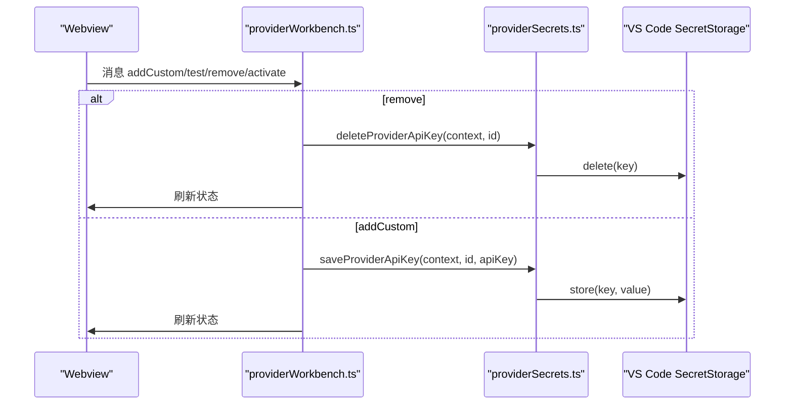

**图表来源**
- [providerWorkbench.ts:152-301](file://extensions/kodrix-local/src/providerWorkbench.ts#L152-L301)
- [providerSecrets.ts:31-36](file://extensions/kodrix-local/src/providerSecrets.ts#L31-L36)

**章节来源**
- [providerWorkbench.ts:1-346](file://extensions/kodrix-local/src/providerWorkbench.ts#L1-L346)

### 组件四：secretStorage（FIM 和 Embedding 密钥管理）**新增**
- 设计要点
  - 为 FIM 和 Embedding 功能提供专用的 SecretStorage 管理。
  - 定义独立的密钥存储键名：`kodrix.agent-os.tabCompletion.fimApiKey` 和 `kodrix.agent-os.semanticEmbedding.apiKey`。
  - 提供统一的 get/set 接口，支持密钥的创建、读取和删除。
- 安全特性
  - 自动 trim 空白字符，防止无效密钥存储。
  - 传 undefined 时自动删除对应密钥，支持密钥清理。
  - 与 settings.json 完全分离，确保密钥安全性。
- 集成方式
  - 被 settingsPage 用于密钥配置界面。
  - 被 tabCompletion 用于获取 FIM API Key。
  - 被 extension 用于同步 Embedding 提供者状态。

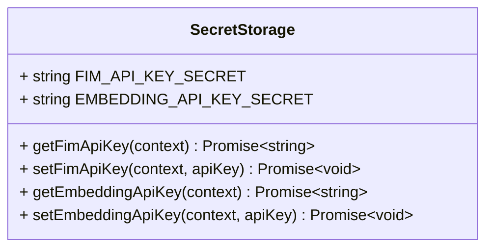

**图表来源**
- [secretStorage.ts:9-45](file://extensions/kodrix-agent-os/src/secretStorage.ts#L9-L45)

**章节来源**
- [secretStorage.ts:1-46](file://extensions/kodrix-agent-os/src/secretStorage.ts#L1-L46)

### 组件五：settingsPage（增强的设置页面 UI）**新增**
- 功能概述
  - 提供现代化的设置页面，包含常规、代码库、AI 供应商、FIM 配置、Embedding 配置等标签页。
  - 实时显示密钥配置状态，通过 placeholder 文本提示用户是否已配置密钥。
  - 支持密钥的动态设置和状态同步。
  - **新增** 未知密钥调试功能，当接收到未识别的密钥时记录警告日志。
- 密钥状态显示机制
  - 通过 `getSecretStatus` 消息请求当前密钥配置状态。
  - 前端监听 `secretStatus` 消息，动态更新输入框的 placeholder。
  - 已配置的密钥显示"✓ 已配置"，未配置的显示"未配置，请输入"。
- 用户体验优化
  - 密码字段自动隐藏输入内容。
  - 保存后显示"已保存"提示。
  - 支持条件显示（如 custom 提供方时显示 endpoint）。
- **新增** 未知密钥处理机制
  - 当接收到未识别的密钥键名时，使用 `console.warn` 记录警告信息。
  - 格式：`[Settings] Unknown secret key: ${secretKey}`
  - 便于开发者快速定位配置问题。

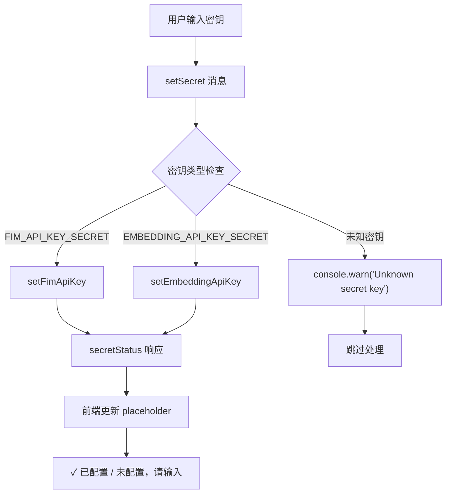

**图表来源**
- [settingsPage.ts:109-144](file://extensions/kodrix-agent-os/src/codebase/settingsPage.ts#L109-L144)
- [settingsPage.ts:484-495](file://extensions/kodrix-agent-os/src/codebase/settingsPage.ts#L484-L495)

**章节来源**
- [settingsPage.ts:1-765](file://extensions/kodrix-agent-os/src/codebase/settingsPage.ts#L1-L765)

### 组件六：tabCompletion（Tab 补全实现）**新增**
- 功能概述
  - 实现 Tab 补全功能，支持 FIM 模式和 fast 模式两种通道。
  - 优先使用 FIM 通道（需要 API Key），失败时自动降级到 fast 通道。
  - 集成 FIM API Key 管理，从 SecretStorage 读取密钥。
- 双通道机制
  - FIM 通道：直接调用外部 FIM 端点（默认 DeepSeek），需要有效的 API Key。
  - Fast 通道：走模型路由 fast 档，作为 FIM 失败的降级方案。
- 密钥集成
  - 启动时从 SecretStorage 读取 FIM API Key。
  - 无 Key 或请求失败时自动切换到 fast 通道。
  - 记录补全统计信息，便于性能监控。

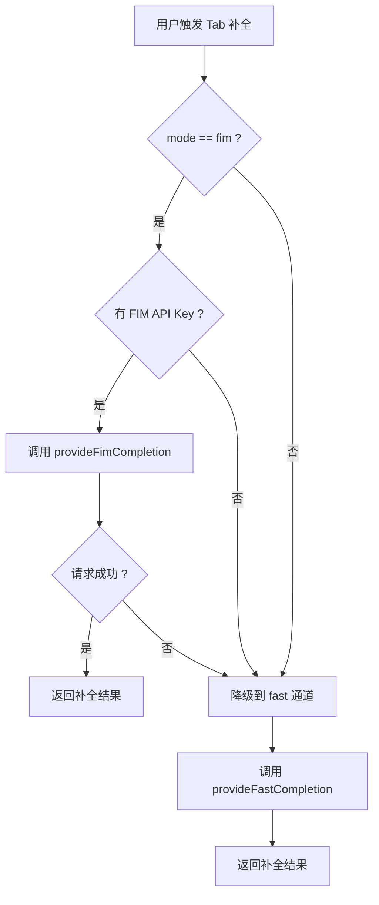

**图表来源**
- [tabCompletion.ts:166-189](file://extensions/kodrix-agent-os/src/completion/tabCompletion.ts#L166-L189)
- [tabCompletion.ts:89-126](file://extensions/kodrix-agent-os/src/completion/tabCompletion.ts#L89-L126)

**章节来源**
- [tabCompletion.ts:1-235](file://extensions/kodrix-agent-os/src/completion/tabCompletion.ts#L1-L235)

### 组件七：extension（扩展初始化）**新增**
- 功能概述
  - 管理扩展的生命周期和各个模块的初始化。
  - 自动同步 Embedding 提供者状态，根据配置和密钥状态启用/禁用语义检索功能。
  - 监听配置变更，动态调整功能状态。
- Embedding 同步机制
  - 检查 `kodrix.semanticEmbedding.enabled` 配置和 SecretStorage 中的 API Key。
  - 两者都满足条件时，创建并注册智谱 Embedding 提供者。
  - 监听配置变更事件，实时更新提供者状态。

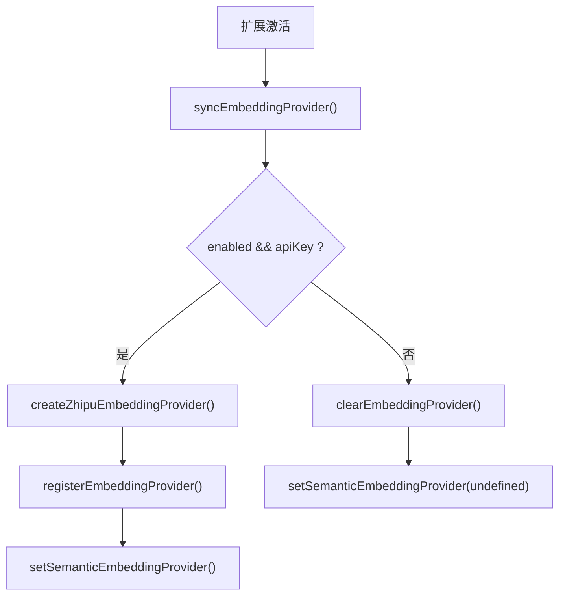

**图表来源**
- [extension.ts:150-168](file://extensions/kodrix-agent-os/src/extension.ts#L150-L168)

**章节来源**
- [extension.ts:150-168](file://extensions/kodrix-agent-os/src/extension.ts#L150-L168)

### 组件八：betterSecretStorage（高级用法参考）
- 设计要点
  - 维护键列表以加速启动加载。
  - 监听 SecretStorage 变更事件，跨窗口同步增删改。
  - 使用 Promise 队列保证并发写操作的顺序一致性。
  - 提供序列化/反序列化钩子，便于存储复杂对象。
- 适用场景
  - 需要多窗口共享、变更感知与批量操作的凭据管理。

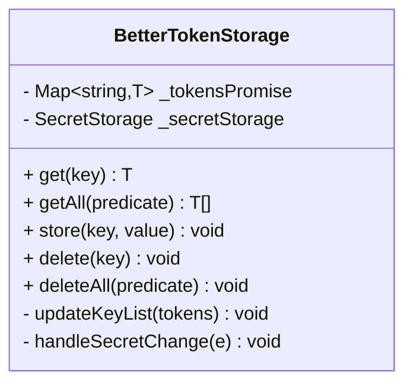

**图表来源**
- [betterSecretStorage.ts:15-249](file://extensions/microsoft-authentication/src/betterSecretStorage.ts#L15-L249)

**章节来源**
- [betterSecretStorage.ts:1-249](file://extensions/microsoft-authentication/src/betterSecretStorage.ts#L1-L249)

## 依赖关系分析
- 模块耦合
  - byokRegister 依赖 providerSecrets 进行密钥落盘，并依赖 languageModelProvider 通知模型变化。
  - providerWorkbench 依赖 providerSecrets 进行密钥的读取与删除，依赖 providerStore 与 providerSync 管理供应商元数据与路由。
  - **新增** settingsPage 依赖 secretStorage 进行 FIM 和 Embedding 密钥的管理，提供用户界面，**新增未知密钥调试功能**。
  - **新增** tabCompletion 依赖 secretStorage 获取 FIM API Key，实现代码补全功能。
  - **新增** extension 依赖 secretStorage 同步 Embedding 提供者状态。
- 外部依赖
  - 所有密钥均通过 VS Code ExtensionContext.secrets 访问，底层由 VS Code 使用系统钥匙串/受保护的存储机制加密。

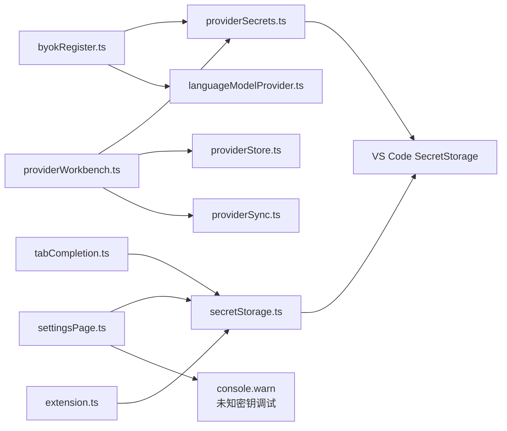

**图表来源**
- [byokRegister.ts:1-424](file://extensions/kodrix-local/src/byokRegister.ts#L1-L424)
- [providerWorkbench.ts:1-346](file://extensions/kodrix-local/src/providerWorkbench.ts#L1-L346)
- [providerSecrets.ts:1-37](file://extensions/kodrix-local/src/providerSecrets.ts#L1-L37)
- [settingsPage.ts:1-765](file://extensions/kodrix-agent-os/src/codebase/settingsPage.ts#L1-L765)
- [tabCompletion.ts:1-235](file://extensions/kodrix-agent-os/src/completion/tabCompletion.ts#L1-L235)
- [extension.ts:150-168](file://extensions/kodrix-agent-os/src/extension.ts#L150-L168)
- [secretStorage.ts:1-46](file://extensions/kodrix-agent-os/src/secretStorage.ts#L1-L46)

**章节来源**
- [byokRegister.ts:1-424](file://extensions/kodrix-local/src/byokRegister.ts#L1-L424)
- [providerWorkbench.ts:1-346](file://extensions/kodrix-local/src/providerWorkbench.ts#L1-L346)
- [providerSecrets.ts:1-37](file://extensions/kodrix-local/src/providerSecrets.ts#L1-L37)
- [settingsPage.ts:1-765](file://extensions/kodrix-agent-os/src/codebase/settingsPage.ts#L1-L765)
- [tabCompletion.ts:1-235](file://extensions/kodrix-agent-os/src/completion/tabCompletion.ts#L1-L235)
- [extension.ts:150-168](file://extensions/kodrix-agent-os/src/extension.ts#L150-L168)
- [secretStorage.ts:1-46](file://extensions/kodrix-agent-os/src/secretStorage.ts#L1-L46)

## 性能与可用性考虑
- 存储开销
  - providerSecrets 每次操作为单次 SecretStorage 调用，时间复杂度 O(1)，适合高频读写的 API Key。
  - **新增** secretStorage 采用相同的 O(1) 复杂度，专为 FIM 和 Embedding 功能优化。
- 并发与一致性
  - 若需多窗口共享与变更感知，可参考 betterSecretStorage 的键列表与事件驱动模式，避免竞态条件。
  - **新增** settingsPage 通过消息机制实现前后端状态同步，确保 UI 与存储的一致性。
- 用户体验
  - 在注册失败或网络不可达时提供明确提示；对需要 Key 的云端供应商强制校验。
  - 删除供应商时二次确认，防止误删。
  - **新增** 实时显示密钥配置状态，用户可立即看到配置是否生效。
  - **新增** Tab 补全自动降级机制，提升功能可用性。
  - **新增** 未知密钥调试功能，帮助开发者快速定位配置问题。

## 故障排查指南
- 现象：无法读取已保存的 API Key
  - 检查是否通过 readProviderApiKey 读取，且 providerId 一致。
  - 确认 SecretStorage 未被其他扩展或手动清理。
- 现象：删除供应商后仍显示旧 Key
  - 确认 providerWorkbench 的 remove 流程调用了 deleteProviderApiKey。
- 现象：外部链接被阻止
  - 检查 isSafeExternalUrl 白名单逻辑，仅允许 http/https。
- 现象：多窗口状态不一致
  - 参考 betterSecretStorage 的事件监听与键列表维护模式。
- **新增** 现象：FIM 或 Embedding 密钥无法保存
  - 检查 settingsPage 的 setSecret 消息处理是否正确。
  - 确认 secretStorage 的密钥键名配置正确。
  - **查看控制台日志**：如果出现 `[Settings] Unknown secret key: ${secretKey}` 警告，说明密钥键名不正确。
- **新增** 现象：Tab 补全不工作
  - 检查 FIM API Key 是否正确保存到 SecretStorage。
  - 确认 tabCompletion 的 mode 配置为 "fim"。
  - 查看日志中是否有"FIM 失败或未配置，降级 fast 通道"的提示。
- **新增** 现象：语义检索功能未启用
  - 检查 `kodrix.semanticEmbedding.enabled` 配置是否为 true。
  - 确认 SecretStorage 中存在有效的 Embedding API Key。
  - 查看 extension 的 syncEmbeddingProvider 函数执行日志。
- **新增** 现象：未知密钥警告
  - 检查前端发送的密钥键名是否与后端期望的常量匹配。
  - 确认 FIM_API_KEY_SECRET 和 EMBEDDING_API_KEY_SECRET 常量定义正确。
  - 查看浏览器控制台输出，定位具体的未知密钥名称。

**章节来源**
- [providerWorkbench.ts:29-37](file://extensions/kodrix-local/src/providerWorkbench.ts#L29-L37)
- [providerWorkbench.ts:177-190](file://extensions/kodrix-local/src/providerWorkbench.ts#L177-L190)
- [betterSecretStorage.ts:194-247](file://extensions/microsoft-authentication/src/betterSecretStorage.ts#L194-L247)
- [settingsPage.ts:109-144](file://extensions/kodrix-agent-os/src/codebase/settingsPage.ts#L109-L144)
- [tabCompletion.ts:166-189](file://extensions/kodrix-agent-os/src/completion/tabCompletion.ts#L166-L189)
- [extension.ts:150-168](file://extensions/kodrix-agent-os/src/extension.ts#L150-L168)

## 结论
Kodrix 的凭据安全管理以 providerSecrets 为核心，严格遵循 VS Code SecretStorage 规范，避免明文泄露；byokRegister 与 providerWorkbench 分别承担注册流程与管理界面职责，形成完整的密钥生命周期闭环。**新增的 secretStorage 组件**为 FIM 和 Embedding 功能提供了专门的密钥管理支持，**增强的 settingsPage** 提供了直观的密钥配置状态显示和**未知密钥调试功能**，**改进的 tabCompletion** 实现了智能的密钥使用和降级机制。对于更复杂的场景，可借鉴 betterSecretStorage 的多窗口同步与事件驱动模式，提升一致性与可观测性。**新增的未知密钥处理机制**显著提升了配置问题的调试效率，通过 console.warn 记录详细的警告信息，帮助开发者快速定位和解决配置问题。

## 附录：最佳实践与调试指南

### 安全最佳实践
- 永不提交密钥：始终使用 SecretStorage 或环境变量，禁止写入 settings.json 或仓库。
- 最小权限原则：仅向必要组件暴露 API Key，避免全局缓存。
- 输入校验：对用户输入进行 trim、长度与格式校验。
- 外部资源白名单：仅允许可信协议（如 http/https）。
- 审计与日志：记录关键操作（新增/删除/更新），但不得记录密钥本身。
- **新增** 密钥状态可视化：通过 UI 实时显示密钥配置状态，提升用户体验。
- **新增** 自动降级机制：当主密钥不可用时，自动切换到备用方案。
- **新增** 未知密钥调试：利用 console.warn 记录未识别的密钥，快速定位配置问题。

**章节来源**
- [SECURITY.md:44-65](file://SECURITY.md#L44-L65)
- [settingsPage.ts:109-144](file://extensions/kodrix-agent-os/src/codebase/settingsPage.ts#L109-L144)
- [settingsPage.ts:484-495](file://extensions/kodrix-agent-os/src/codebase/settingsPage.ts#L484-L495)
- [tabCompletion.ts:166-189](file://extensions/kodrix-agent-os/src/completion/tabCompletion.ts#L166-L189)

### 密钥轮换与失效处理
- 动态更新
  - 通过 providerWorkbench 或 byokRegister 重新保存新 Key，覆盖旧值。
  - **新增** 通过 settingsPage 直接更新 FIM 和 Embedding 密钥，即时生效。
- 失效检测
  - 在网络请求失败或鉴权错误时，提示用户轮换 Key。
  - **新增** Tab 补全自动检测 FIM 密钥有效性，失败时自动降级。
- 回滚策略
  - 保留最近一次成功 Key 的备份（例如本地临时变量或会话级缓存），以便快速回滚。
- 自动化建议
  - 结合 CI/CD 或运维脚本定期轮换，并通过 SecretStorage 注入。

### 导入导出与第三方集成
- 导出
  - 可通过 SecretStorage 枚举当前扩展的密钥键（需 VS Code 提供相应能力），或结合 betterSecretStorage 的键列表思路自行维护索引。
- 导入
  - 从受信任源（如企业密码管理器）读取密文，经解密后写入 SecretStorage。
- 第三方密码管理器
  - 推荐通过 CLI 或 IPC 与 1Password、Bitwarden、KeePass 等集成，仅在内存中持有明文，不落盘。

### 漏洞防护与异常处理
- 防注入
  - 对外部 URL 进行协议白名单校验。
- 防越权
  - 仅允许扩展自身访问其命名空间的 SecretStorage 键。
- 异常捕获
  - 对所有异步操作进行 try/catch，并向用户提供友好错误信息。
- 超时与限流
  - 网络请求设置超时与大小上限，避免资源耗尽。
- **新增** 前端状态同步
  - 通过消息机制确保 UI 状态与后端存储保持一致。
- **新增** 降级容错
  - 主功能失败时自动切换到备用方案，提升系统鲁棒性。
- **新增** 未知密钥防护
  - 通过严格的密钥键名验证，防止恶意或错误的密钥键名被处理。

**章节来源**
- [providerWorkbench.ts:29-37](file://extensions/kodrix-local/src/providerWorkbench.ts#L29-L37)
- [SECURITY.md:57-65](file://SECURITY.md#L57-L65)
- [settingsPage.ts:109-144](file://extensions/kodrix-agent-os/src/codebase/settingsPage.ts#L109-L144)
- [tabCompletion.ts:166-189](file://extensions/kodrix-agent-os/src/completion/tabCompletion.ts#L166-L189)

### 调试指南：未知密钥处理
**新增** 当遇到未知密钥问题时，可以按照以下步骤进行调试：

1. **查看控制台日志**
   - 打开浏览器开发者工具的控制台
   - 查找形如 `[Settings] Unknown secret key: ${secretKey}` 的警告信息
   - 记录具体的未知密钥名称

2. **检查密钥常量定义**
   - 确认 FIM_API_KEY_SECRET 和 EMBEDDING_API_KEY_SECRET 常量定义正确
   - 检查前端发送的密钥键名是否与后端期望的常量完全匹配

3. **验证前端消息发送**
   - 检查前端是否正确发送了 setSecret 消息
   - 确认消息中的 key 字段使用了正确的常量值

4. **调试步骤示例**
   ```javascript
   // 前端发送消息
   vscode.postMessage({
     type: 'setSecret',
     key: FIM_API_KEY_SECRET, // 应该使用常量
     value: 'your-api-key'
   });
   
   // 后端处理（settingsPage.ts）
   if (secretKey === FIM_API_KEY_SECRET) {
     await setFimApiKey(sctx, secretValue);
   } else if (secretKey === EMBEDDING_API_KEY_SECRET) {
     await setEmbeddingApiKey(sctx, secretValue);
   } else {
     console.warn(`[Settings] Unknown secret key: ${secretKey}`);
     break;
   }
   ```

5. **常见问题排查**
   - 常量导入错误：确认前端正确导入了密钥常量
   - 字符串拼写错误：检查密钥键名的拼写是否完全一致
   - 版本不匹配：确认前后端使用的常量定义版本一致

**章节来源**
- [settingsPage.ts:122-133](file://extensions/kodrix-agent-os/src/codebase/settingsPage.ts#L122-L133)
- [secretStorage.ts:9-13](file://extensions/kodrix-agent-os/src/secretStorage.ts#L9-L13)