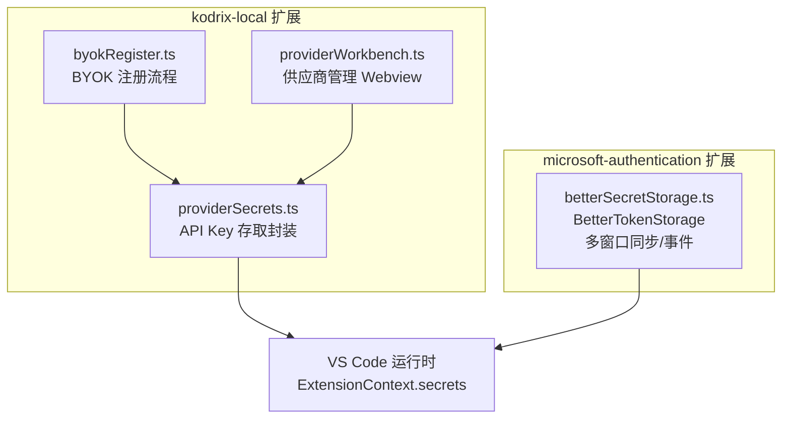
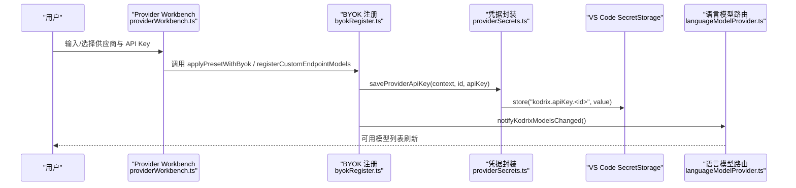
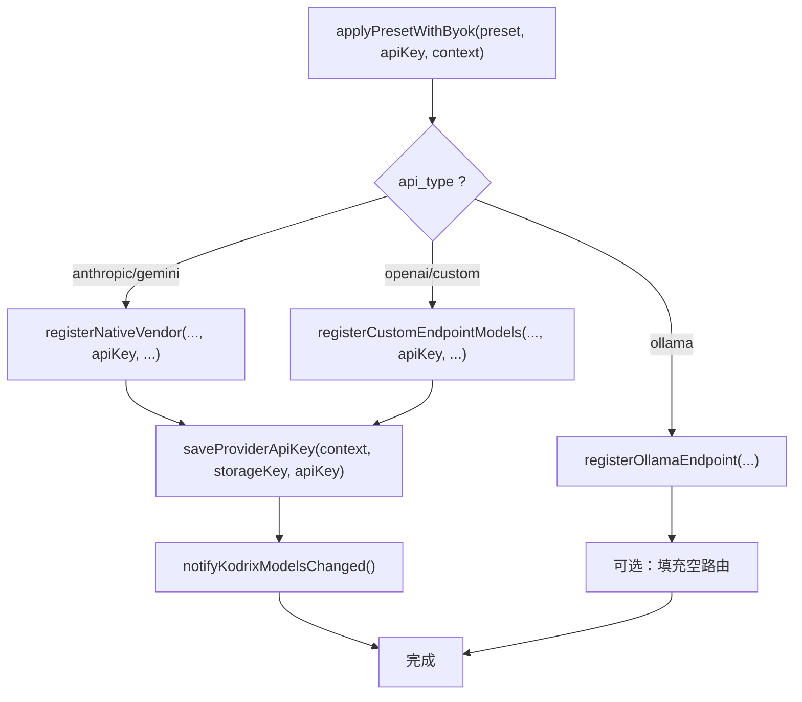
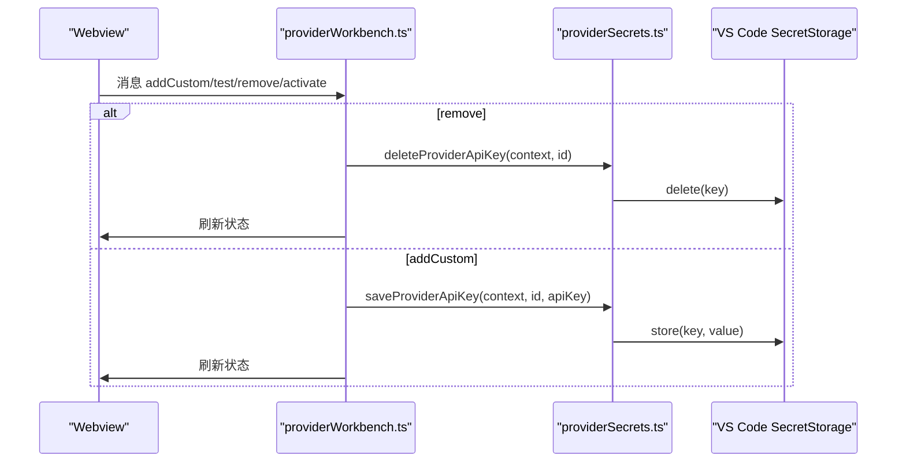
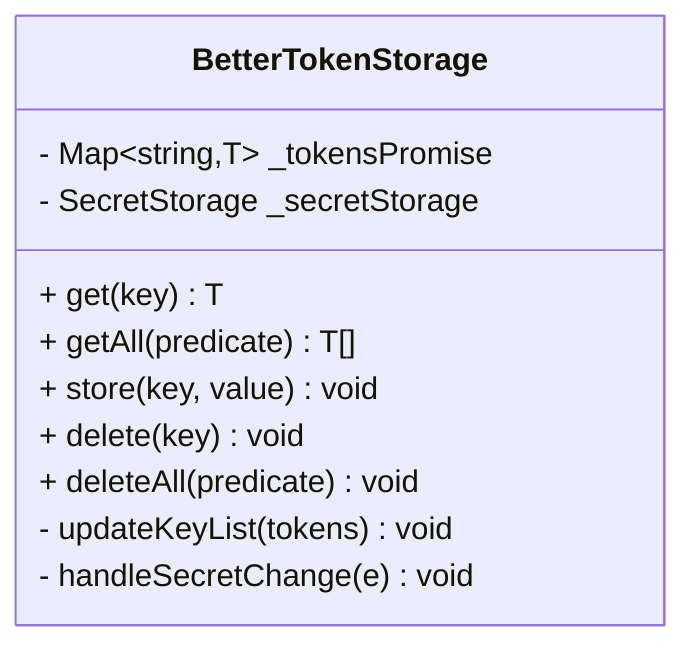
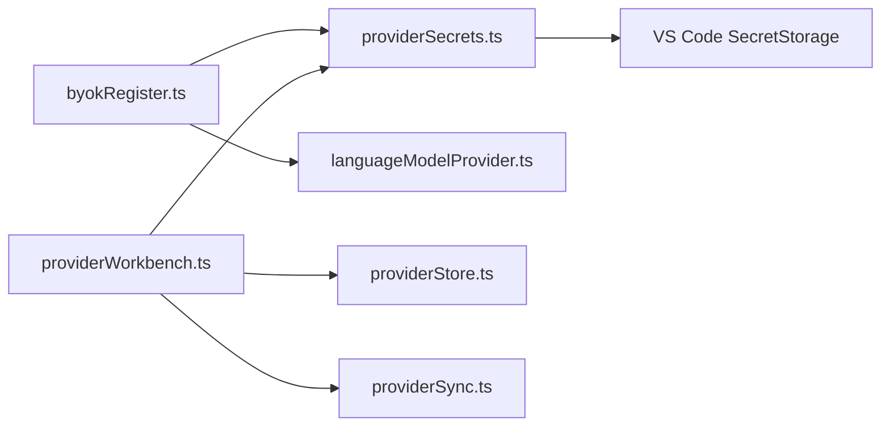

# 凭据安全管理

<cite>
**本文引用的文件**   
- [providerSecrets.ts](file://extensions/kodrix-local/src/providerSecrets.ts)
- [byokRegister.ts](file://extensions/kodrix-local/src/byokRegister.ts)
- [providerWorkbench.ts](file://extensions/kodrix-local/src/providerWorkbench.ts)
- [SECURITY.md](file://SECURITY.md)
- [betterSecretStorage.ts](file://extensions/microsoft-authentication/src/betterSecretStorage.ts)
</cite>

## 目录
1. [引言](#引言)
2. [项目结构](#项目结构)
3. [核心组件](#核心组件)
4. [架构总览](#架构总览)
5. [详细组件分析](#详细组件分析)
6. [依赖关系分析](#依赖关系分析)
7. [性能与可用性考虑](#性能与可用性考虑)
8. [故障排查指南](#故障排查指南)
9. [结论](#结论)
10. [附录：最佳实践与集成方案](#附录最佳实践与集成方案)

## 引言
本文件聚焦 Kodrix 扩展中的凭据安全管理，围绕 providerSecrets 的安全机制展开，覆盖 API Key 的加密存储、访问控制、生命周期管理、密钥轮换与失效处理、安全最佳实践、审计日志、导入导出与第三方密码管理器集成，以及漏洞防护与异常处理。文档同时结合 VS Code SecretStorage API 的使用方式，说明如何在扩展中安全地保存和读取敏感信息。

## 项目结构
与凭据安全直接相关的代码主要位于 kodrix-local 扩展与 microsoft-authentication 扩展中：
- kodrix-local 扩展负责供应商（Provider）注册、模型发现、Webview 管理界面与凭据读写。
- microsoft-authentication 扩展提供 BetterTokenStorage，演示基于 SecretStorage 的多窗口同步与事件驱动更新模式。

**图表来源**
- [providerSecrets.ts:1-37](file://extensions/kodrix-local/src/providerSecrets.ts#L1-L37)
- [byokRegister.ts:1-423](file://extensions/kodrix-local/src/byokRegister.ts#L1-L423)
- [providerWorkbench.ts:1-346](file://extensions/kodrix-local/src/providerWorkbench.ts#L1-L346)
- [betterSecretStorage.ts:1-249](file://extensions/microsoft-authentication/src/betterSecretStorage.ts#L1-L249)

**章节来源**
- [providerSecrets.ts:1-37](file://extensions/kodrix-local/src/providerSecrets.ts#L1-L37)
- [byokRegister.ts:1-423](file://extensions/kodrix-local/src/byokRegister.ts#L1-L423)
- [providerWorkbench.ts:1-346](file://extensions/kodrix-local/src/providerWorkbench.ts#L1-L346)
- [betterSecretStorage.ts:1-249](file://extensions/microsoft-authentication/src/betterSecretStorage.ts#L1-L249)

## 核心组件
- providerSecrets：对 VS Code ExtensionContext.secrets 的轻量封装，提供按 providerId 命名空间化的 API Key 存取接口。
- byokRegister：实现 BYOK（Bring Your Own Key）注册流程，将用户提供的 API Key 写入 SecretStorage，并触发模型路由与应用。
- providerWorkbench：提供“AI 供应商管理”Webview，支持测试连接、添加/删除/激活供应商、保存/应用模型路由，并在删除时清理 SecretStorage。
- betterSecretStorage：展示 SecretStorage 的高级用法，包括键列表维护、多窗口变更监听、并发操作保护与序列化/反序列化。

**章节来源**
- [providerSecrets.ts:1-37](file://extensions/kodrix-local/src/providerSecrets.ts#L1-L37)
- [byokRegister.ts:1-423](file://extensions/kodrix-local/src/byokRegister.ts#L1-L423)
- [providerWorkbench.ts:1-346](file://extensions/kodrix-local/src/providerWorkbench.ts#L1-L346)
- [betterSecretStorage.ts:1-249](file://extensions/microsoft-authentication/src/betterSecretStorage.ts#L1-L249)

## 架构总览
下图展示了从用户输入到凭据落盘、再到模型路由应用的完整调用链。

**图表来源**
- [providerWorkbench.ts:152-301](file://extensions/kodrix-local/src/providerWorkbench.ts#L152-L301)
- [byokRegister.ts:253-361](file://extensions/kodrix-local/src/byokRegister.ts#L253-L361)
- [providerSecrets.ts:11-21](file://extensions/kodrix-local/src/providerSecrets.ts#L11-L21)

## 详细组件分析

### 组件一：providerSecrets（API Key 加密存储）
- 设计要点
  - 使用 ExtensionContext.secrets 进行加密存储，避免写入 settings.json 或仓库。
  - 通过 apiKeySecretId(providerId) 生成唯一键名，形成按供应商隔离的命名空间。
  - 提供 save/read/delete 三件套，统一 trim 空值与未找到返回 undefined。
- 安全特性
  - 不暴露明文到配置或日志。
  - 删除操作确保 SecretStorage 对应键被移除。
- 复杂度
  - 时间 O(1)，空间 O(1)。

**图表来源**
- [providerSecrets.ts:11-21](file://extensions/kodrix-local/src/providerSecrets.ts#L11-L21)

**章节来源**
- [providerSecrets.ts:1-37](file://extensions/kodrix-local/src/providerSecrets.ts#L1-L37)

### 组件二：byokRegister（BYOK 注册与密钥写入）
- 功能概述
  - 根据预设（Anthropic/Gemini/Ollama/OpenAI 兼容）构建 Provider 配置。
  - 在注册过程中调用 saveProviderApiKey 将 API Key 写入 SecretStorage。
  - 注册成功后通知模型路由刷新，必要时进入“待补充 Key”状态。
- 关键路径
  - registerNativeVendor：原生供应商注册，写入 Key 并持久化 StoredProvider。
  - registerCustomEndpointModels：自定义端点注册，同样写入 Key。
  - applyPresetWithByok：统一入口，分支处理不同 api_type，必要时引导用户打开供应商管理。
- 错误与重试
  - 对 Copilot 命令迁移失败进行有限次重试与警告日志。

**图表来源**
- [byokRegister.ts:145-167](file://extensions/kodrix-local/src/byokRegister.ts#L145-L167)
- [byokRegister.ts:202-237](file://extensions/kodrix-local/src/byokRegister.ts#L202-L237)
- [byokRegister.ts:253-361](file://extensions/kodrix-local/src/byokRegister.ts#L253-L361)

**章节来源**
- [byokRegister.ts:1-423](file://extensions/kodrix-local/src/byokRegister.ts#L1-L423)

### 组件三：providerWorkbench（供应商管理与密钥生命周期）
- 功能概述
  - 提供 Webview 面板，用于添加/删除/激活供应商，测试连通性，保存/应用模型路由。
  - 删除供应商时同步删除 SecretStorage 中的对应 API Key。
  - 对外部链接进行白名单校验（仅允许 http/https）。
- 生命周期
  - 新增：保存 API Key → 持久化 StoredProvider → 刷新模型列表。
  - 删除：确认 → 删除 StoredProvider → 删除 SecretStorage Key → 刷新。
  - 激活：设置 activeProviderId → 同步路由 → 刷新。
- 安全加固
  - isSafeExternalUrl 限制外部 URL scheme。
  - 云端供应商强制要求 API Key。

**图表来源**
- [providerWorkbench.ts:152-301](file://extensions/kodrix-local/src/providerWorkbench.ts#L152-L301)
- [providerSecrets.ts:31-36](file://extensions/kodrix-local/src/providerSecrets.ts#L31-L36)

**章节来源**
- [providerWorkbench.ts:1-346](file://extensions/kodrix-local/src/providerWorkbench.ts#L1-L346)

### 组件四：betterSecretStorage（高级用法参考）
- 设计要点
  - 维护键列表以加速启动加载。
  - 监听 SecretStorage 变更事件，跨窗口同步增删改。
  - 使用 Promise 队列保证并发写操作的顺序一致性。
  - 提供序列化/反序列化钩子，便于存储复杂对象。
- 适用场景
  - 需要多窗口共享、变更感知与批量操作的凭据管理。

**图表来源**
- [betterSecretStorage.ts:15-249](file://extensions/microsoft-authentication/src/betterSecretStorage.ts#L15-L249)

**章节来源**
- [betterSecretStorage.ts:1-249](file://extensions/microsoft-authentication/src/betterSecretStorage.ts#L1-L249)

## 依赖关系分析
- 模块耦合
  - byokRegister 依赖 providerSecrets 进行密钥落盘，并依赖 languageModelProvider 通知模型变化。
  - providerWorkbench 依赖 providerSecrets 进行密钥的读取与删除，依赖 providerStore 与 providerSync 管理供应商元数据与路由。
- 外部依赖
  - 所有密钥均通过 VS Code ExtensionContext.secrets 访问，底层由 VS Code 使用系统钥匙串/受保护的存储机制加密。

**图表来源**
- [byokRegister.ts:1-423](file://extensions/kodrix-local/src/byokRegister.ts#L1-L423)
- [providerWorkbench.ts:1-346](file://extensions/kodrix-local/src/providerWorkbench.ts#L1-L346)
- [providerSecrets.ts:1-37](file://extensions/kodrix-local/src/providerSecrets.ts#L1-L37)

**章节来源**
- [byokRegister.ts:1-423](file://extensions/kodrix-local/src/byokRegister.ts#L1-L423)
- [providerWorkbench.ts:1-346](file://extensions/kodrix-local/src/providerWorkbench.ts#L1-L346)
- [providerSecrets.ts:1-37](file://extensions/kodrix-local/src/providerSecrets.ts#L1-L37)

## 性能与可用性考虑
- 存储开销
  - providerSecrets 每次操作为单次 SecretStorage 调用，时间复杂度 O(1)，适合高频读写的 API Key。
- 并发与一致性
  - 若需多窗口共享与变更感知，可参考 betterSecretStorage 的键列表与事件驱动模式，避免竞态条件。
- 用户体验
  - 在注册失败或网络不可达时提供明确提示；对需要 Key 的云端供应商强制校验。
  - 删除供应商时二次确认，防止误删。

[本节为通用指导，无需具体文件引用]

## 故障排查指南
- 现象：无法读取已保存的 API Key
  - 检查是否通过 readProviderApiKey 读取，且 providerId 一致。
  - 确认 SecretStorage 未被其他扩展或手动清理。
- 现象：删除供应商后仍显示旧 Key
  - 确认 providerWorkbench 的 remove 流程调用了 deleteProviderApiKey。
- 现象：外部链接被阻止
  - 检查 isSafeExternalUrl 白名单逻辑，仅允许 http/https。
- 现象：多窗口状态不一致
  - 参考 betterSecretStorage 的事件监听与键列表维护模式。

**章节来源**
- [providerWorkbench.ts:29-37](file://extensions/kodrix-local/src/providerWorkbench.ts#L29-L37)
- [providerWorkbench.ts:177-190](file://extensions/kodrix-local/src/providerWorkbench.ts#L177-L190)
- [betterSecretStorage.ts:194-247](file://extensions/microsoft-authentication/src/betterSecretStorage.ts#L194-L247)

## 结论
Kodrix 的凭据安全管理以 providerSecrets 为核心，严格遵循 VS Code SecretStorage 规范，避免明文泄露；byokRegister 与 providerWorkbench 分别承担注册流程与管理界面职责，形成完整的密钥生命周期闭环。对于更复杂的场景，可借鉴 betterSecretStorage 的多窗口同步与事件驱动模式，提升一致性与可观测性。

[本节为总结性内容，无需具体文件引用]

## 附录：最佳实践与集成方案

### 安全最佳实践
- 永不提交密钥：始终使用 SecretStorage 或环境变量，禁止写入 settings.json 或仓库。
- 最小权限原则：仅向必要组件暴露 API Key，避免全局缓存。
- 输入校验：对用户输入进行 trim、长度与格式校验。
- 外部资源白名单：仅允许可信协议（如 http/https）。
- 审计与日志：记录关键操作（新增/删除/更新），但不得记录密钥本身。

**章节来源**
- [SECURITY.md:44-65](file://SECURITY.md#L44-L65)

### 密钥轮换与失效处理
- 动态更新
  - 通过 providerWorkbench 或 byokRegister 重新保存新 Key，覆盖旧值。
- 失效检测
  - 在网络请求失败或鉴权错误时，提示用户轮换 Key。
- 回滚策略
  - 保留最近一次成功 Key 的备份（例如本地临时变量或会话级缓存），以便快速回滚。
- 自动化建议
  - 结合 CI/CD 或运维脚本定期轮换，并通过 SecretStorage 注入。

[本节为通用指导，无需具体文件引用]

### 导入导出与第三方集成
- 导出
  - 可通过 SecretStorage 枚举当前扩展的密钥键（需 VS Code 提供相应能力），或结合 betterSecretStorage 的键列表思路自行维护索引。
- 导入
  - 从受信任源（如企业密码管理器）读取密文，经解密后写入 SecretStorage。
- 第三方密码管理器
  - 推荐通过 CLI 或 IPC 与 1Password、Bitwarden、KeePass 等集成，仅在内存中持有明文，不落盘。

[本节为通用指导，无需具体文件引用]

### 漏洞防护与异常处理
- 防注入
  - 对外部 URL 进行协议白名单校验。
- 防越权
  - 仅允许扩展自身访问其命名空间的 SecretStorage 键。
- 异常捕获
  - 对所有异步操作进行 try/catch，并向用户提供友好错误信息。
- 超时与限流
  - 网络请求设置超时与大小上限，避免资源耗尽。

**章节来源**
- [providerWorkbench.ts:29-37](file://extensions/kodrix-local/src/providerWorkbench.ts#L29-L37)
- [SECURITY.md:57-65](file://SECURITY.md#L57-L65)