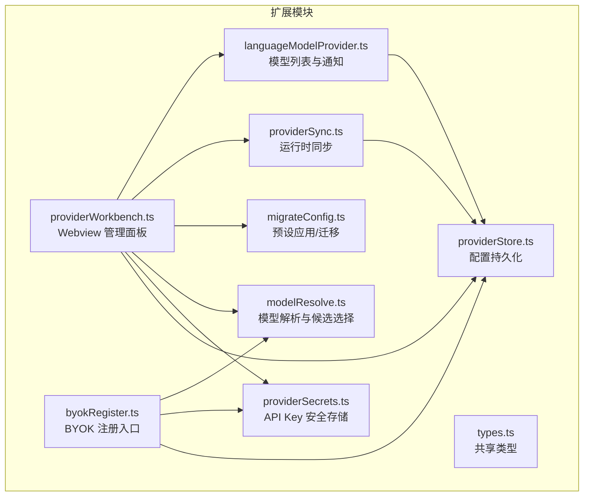
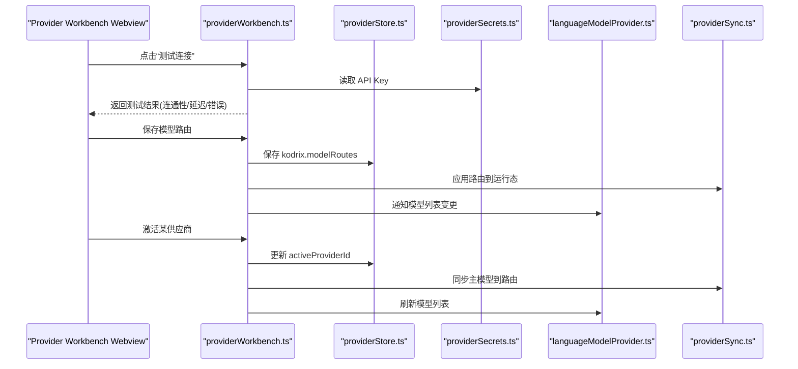
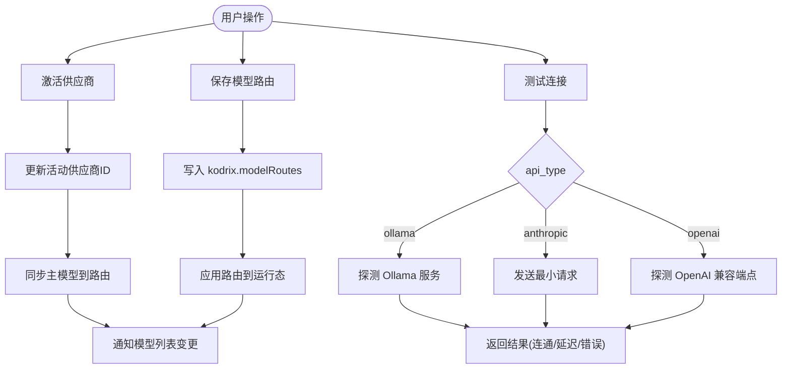
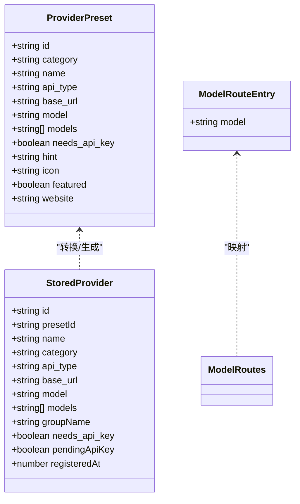
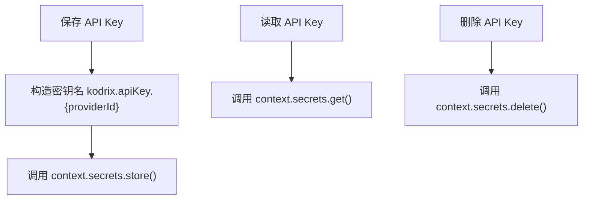
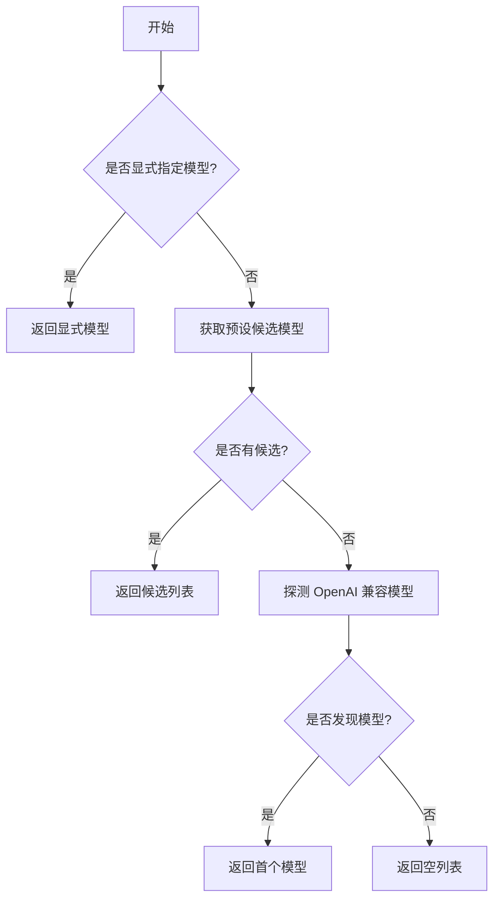
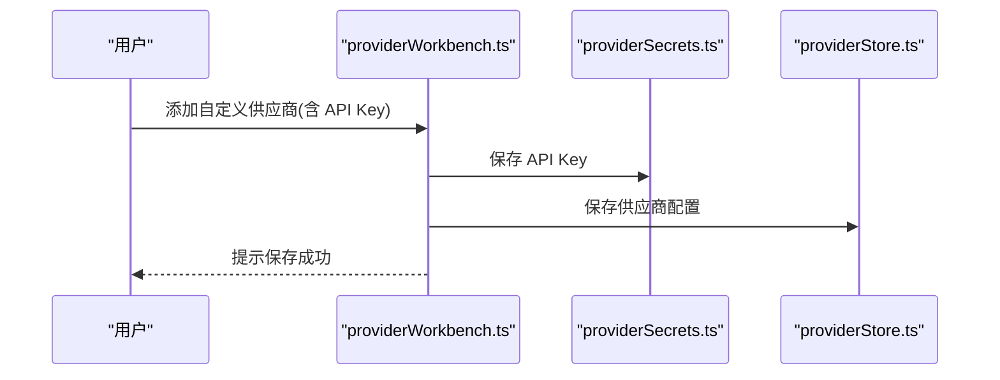
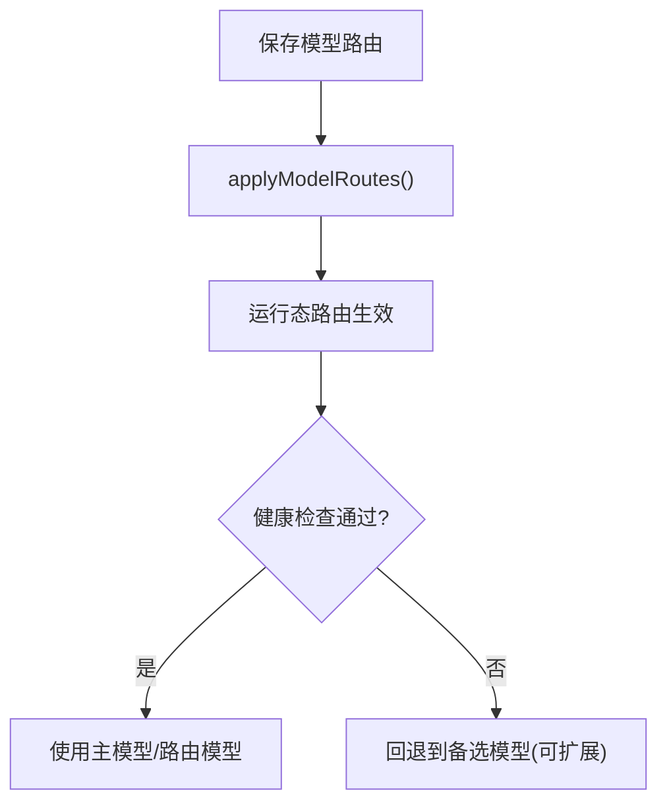
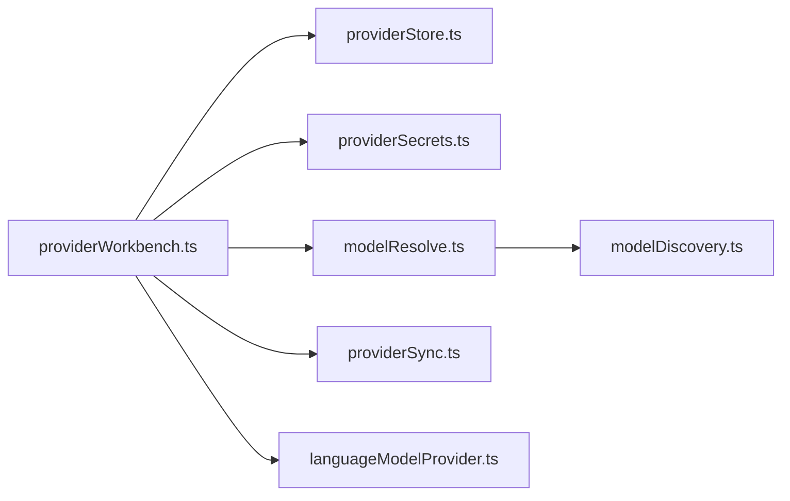

# 模型供应商管理

<cite>
**本文引用的文件**   
- [providerStore.ts](file://extensions/kodrix-local/src/providerStore.ts)
- [providerSecrets.ts](file://extensions/kodrix-local/src/providerSecrets.ts)
- [providerWorkbench.ts](file://extensions/kodrix-local/src/providerWorkbench.ts)
- [modelResolve.ts](file://extensions/kodrix-local/src/modelResolve.ts)
- [types.ts](file://extensions/kodrix-local/src/types.ts)
- [migrateConfig.ts](file://extensions/kodrix-local/src/migrateConfig.ts)
- [byokRegister.ts](file://extensions/kodrix-local/src/byokRegister.ts)
- [languageModelProvider.ts](file://extensions/kodrix-local/src/languageModelProvider.ts)
- [providerSync.ts](file://extensions/kodrix-local/src/providerSync.ts)
- [SECURITY.md](file://SECURITY.md)
</cite>

## 目录
1. [简介](#简介)
2. [项目结构](#项目结构)
3. [核心组件](#核心组件)
4. [架构总览](#架构总览)
5. [详细组件分析](#详细组件分析)
6. [依赖关系分析](#依赖关系分析)
7. [性能与可靠性](#性能与可靠性)
8. [故障排除指南](#故障排除指南)
9. [结论](#结论)
10. [附录：预设供应商配置示例](#附录预设供应商配置示例)

## 简介
本文件面向“模型供应商管理”能力，围绕 Provider Workbench 的配置界面与管理功能展开，覆盖以下主题：
- 模型选择、权重分配、多模型路由与故障转移策略
- providerStore 的数据存储机制与持久化方案
- providerSecrets 的安全管理机制与 API Key 加密存储
- modelResolve 的模型解析与自动发现流程
- BYOK（自带密钥）模式的实现原理与使用方式
- 供应商健康检查、负载均衡、降级策略等企业级能力
- 性能优化建议与常见问题排查

该能力通过 VS Code 扩展机制，将多个 AI 供应商统一接入 IDE 的 Chat 与 Agent 工作流，提供可视化的供应商管理面板、安全的凭据管理与可插拔的模型路由。

## 项目结构
Provider Workbench 相关代码集中在 `extensions/kodrix-local/src` 下，关键文件职责如下：
- providerStore.ts：供应商配置与模型路由的持久化读写
- providerSecrets.ts：API Key 的安全存取（基于 SecretStorage）
- providerWorkbench.ts：Webview 管理面板的消息处理、测试连接、保存路由等
- modelResolve.ts：模型 ID 解析与静默注册时的候选模型选择
- types.ts：共享类型定义（预设、已存储供应商、模型路由）
- migrateConfig.ts：预设应用与迁移逻辑
- byokRegister.ts：BYOK 模式下的注册入口
- languageModelProvider.ts：向系统暴露 Kodrix 模型列表并通知变更
- providerSync.ts：从已存储供应商同步到运行时/路由

**图示来源**
- [providerWorkbench.ts:1-346](file://extensions/kodrix-local/src/providerWorkbench.ts#L1-L346)
- [providerStore.ts:1-111](file://extensions/kodrix-local/src/providerStore.ts#L1-L111)
- [providerSecrets.ts:1-37](file://extensions/kodrix-local/src/providerSecrets.ts#L1-L37)
- [modelResolve.ts:1-50](file://extensions/kodrix-local/src/modelResolve.ts#L1-L50)
- [types.ts:1-40](file://extensions/kodrix-local/src/types.ts#L1-L40)
- [migrateConfig.ts](file://extensions/kodrix-local/src/migrateConfig.ts)
- [byokRegister.ts:1-200](file://extensions/kodrix-local/src/byokRegister.ts#L1-L200)
- [languageModelProvider.ts](file://extensions/kodrix-local/src/languageModelProvider.ts)
- [providerSync.ts](file://extensions/kodrix-local/src/providerSync.ts)

**章节来源**
- [providerWorkbench.ts:1-346](file://extensions/kodrix-local/src/providerWorkbench.ts#L1-L346)
- [providerStore.ts:1-111](file://extensions/kodrix-local/src/providerStore.ts#L1-L111)
- [providerSecrets.ts:1-37](file://extensions/kodrix-local/src/providerSecrets.ts#L1-L37)
- [modelResolve.ts:1-50](file://extensions/kodrix-local/src/modelResolve.ts#L1-L50)
- [types.ts:1-40](file://extensions/kodrix-local/src/types.ts#L1-L40)

## 核心组件
- Provider Workbench（providerWorkbench.ts）
  - 提供 Webview 设置编辑器与独立面板
  - 处理消息：激活供应商、删除供应商、测试连接、添加自定义供应商、填充/保存模型路由、打开外部网站等
  - 调用 providerStore 与 providerSecrets 完成数据与安全凭据操作
  - 触发语言模型列表刷新与运行态同步

- 配置存储（providerStore.ts）
  - 使用 `context.globalState` 持久化供应商列表与当前活动供应商
  - 维护 `kodrix.modelRoutes` 工作区配置中的多模型路由表
  - 提供 upsert/remove/load 等基础 CRUD 接口

- 凭据安全（providerSecrets.ts）
  - 使用 `context.secrets` 存储 API Key，避免写入 settings.json
  - 提供 save/read/delete 三个方法，key 命名规范为 `kodrix.apiKey.{providerId}`

- 模型解析（modelResolve.ts）
  - 从预设中提取候选模型列表，优先主模型
  - 支持静默注册时探测 OpenAI 兼容模型的列表并取首个可用模型

- 类型定义（types.ts）
  - ProviderPreset：预设供应商元信息
  - StoredProvider：已持久化的供应商实例
  - ModelRouteEntry / ModelRoutes：模型路由映射

**章节来源**
- [providerWorkbench.ts:1-346](file://extensions/kodrix-local/src/providerWorkbench.ts#L1-L346)
- [providerStore.ts:1-111](file://extensions/kodrix-local/src/providerStore.ts#L1-L111)
- [providerSecrets.ts:1-37](file://extensions/kodrix-local/src/providerSecrets.ts#L1-L37)
- [modelResolve.ts:1-50](file://extensions/kodrix-local/src/modelResolve.ts#L1-L50)
- [types.ts:1-40](file://extensions/kodrix-local/src/types.ts#L1-L40)

## 架构总览
Provider Workbench 作为用户交互入口，协调配置持久化、凭据安全、模型解析与运行态同步，形成“配置—凭据—路由—执行”的闭环。

**图示来源**
- [providerWorkbench.ts:80-150](file://extensions/kodrix-local/src/providerWorkbench.ts#L80-L150)
- [providerWorkbench.ts:258-296](file://extensions/kodrix-local/src/providerWorkbench.ts#L258-L296)
- [providerStore.ts:79-89](file://extensions/kodrix-local/src/providerStore.ts#L79-L89)
- [providerSecrets.ts:23-29](file://extensions/kodrix-local/src/providerSecrets.ts#L23-L29)

## 详细组件分析

### Provider Workbench 配置界面与管理功能
- 功能要点
  - 显示已配置的供应商列表、当前活动供应商、预设模板
  - 支持添加自定义供应商（名称、base_url、模型名、类别、API Key）
  - 支持测试连接（OpenAI 兼容、Anthropic、Ollama），返回连通性、延迟与错误信息
  - 支持删除供应商（同时清理 API Key）
  - 支持“用当前供应商主模型填充全部路由”，以及手动编辑并保存多模型路由
  - 打开外部文档链接（仅允许 http/https）

- 关键流程
  - 初始化：加载已存储供应商、活动供应商、预设、模型路由，推送至 Webview
  - 激活供应商：更新活动供应商，同步主模型到路由，刷新模型列表
  - 测试连接：按 api_type 分支调用不同探测逻辑
  - 保存路由：写入工作区配置并应用

**图示来源**
- [providerWorkbench.ts:66-78](file://extensions/kodrix-local/src/providerWorkbench.ts#L66-L78)
- [providerWorkbench.ts:80-150](file://extensions/kodrix-local/src/providerWorkbench.ts#L80-L150)
- [providerWorkbench.ts:164-176](file://extensions/kodrix-local/src/providerWorkbench.ts#L164-L176)
- [providerWorkbench.ts:258-296](file://extensions/kodrix-local/src/providerWorkbench.ts#L258-L296)

**章节来源**
- [providerWorkbench.ts:1-346](file://extensions/kodrix-local/src/providerWorkbench.ts#L1-L346)

### providerStore 数据存储机制
- 持久化位置
  - 供应商列表与活动供应商：`context.globalState`
  - 模型路由：`vscode.workspace.getConfiguration('kodrix').get('modelRoutes')`

- 数据结构
  - StoredProvider：包含 id、presetId、name、category、api_type、base_url、model、models、groupName、needs_api_key、pendingApiKey、registeredAt
  - ModelRoutes：键为任务/场景标识，值为 ModelRouteEntry（含 model）

- 主要操作
  - loadStoredProviders/getActiveProviderId/upsertStoredProvider/removeStoredProvider
  - storePendingProvider/storedProviderFromPreset（用于预设或待确认 API Key 的场景）
  - loadModelRoutes/saveModelRoutes（读写工作区配置）

**图示来源**
- [types.ts:5-40](file://extensions/kodrix-local/src/types.ts#L5-L40)
- [providerStore.ts:13-37](file://extensions/kodrix-local/src/providerStore.ts#L13-L37)
- [providerStore.ts:39-77](file://extensions/kodrix-local/src/providerStore.ts#L39-L77)
- [providerStore.ts:79-89](file://extensions/kodrix-local/src/providerStore.ts#L79-L89)
- [providerStore.ts:91-110](file://extensions/kodrix-local/src/providerStore.ts#L91-L110)

**章节来源**
- [providerStore.ts:1-111](file://extensions/kodrix-local/src/providerStore.ts#L1-L111)
- [types.ts:1-40](file://extensions/kodrix-local/src/types.ts#L1-L40)

### providerSecrets 安全管理机制
- 设计原则
  - API Key 不进入 settings.json，也不随配置提交
  - 使用 VS Code SecretStorage 进行加密存储
  - key 命名规范：`kodrix.apiKey.{providerId}`

- 接口
  - saveProviderApiKey(context, providerId, apiKey)
  - readProviderApiKey(context, providerId)
  - deleteProviderApiKey(context, providerId)

- 使用场景
  - 添加自定义供应商时，若为云端供应商则要求填写 API Key
  - 测试连接前读取 API Key
  - 删除供应商时清理对应 API Key

**图示来源**
- [providerSecrets.ts:7-36](file://extensions/kodrix-local/src/providerSecrets.ts#L7-L36)

**章节来源**
- [providerSecrets.ts:1-37](file://extensions/kodrix-local/src/providerSecrets.ts#L1-L37)
- [SECURITY.md:40-50](file://SECURITY.md#L40-L50)

### modelResolve 智能路由与模型选择
- 目标
  - 在静默注册或迁移过程中，确定要注册的模型列表
  - 优先使用预设声明的模型；若无声明，则尝试探测 OpenAI 兼容端点的可用模型

- 算法要点
  - getPresetModelCandidates：合并主模型与 models 列表，去重并保持主模型优先
  - resolveModelsForSilentRegistration：
    - 若显式传入 explicitModel，直接返回
    - 否则使用候选列表
    - 若仍为空，调用 discoverOpenAIModels 探测并取第一个模型

**图示来源**
- [modelResolve.ts:8-26](file://extensions/kodrix-local/src/modelResolve.ts#L8-L26)
- [modelResolve.ts:28-49](file://extensions/kodrix-local/src/modelResolve.ts#L28-L49)

**章节来源**
- [modelResolve.ts:1-50](file://extensions/kodrix-local/src/modelResolve.ts#L1-L50)

### BYOK（自带密钥）模式
- 原理
  - 用户自行提供第三方服务的 API Key，由扩展通过 SecretStorage 安全存储
  - 在 Provider Workbench 中添加自定义供应商时，云端供应商必须填写 API Key
  - BYOK 注册入口 byokRegister.ts 会调用 providerStore 与 providerSecrets，完成配置与凭据的持久化

- 使用方法
  - 在 Provider Workbench 中选择“添加自定义供应商”
  - 填写名称、base_url、至少一个模型名
  - 若为云端供应商，输入 API Key（加密存储）
  - 保存后，可在 Chat 中选择 Kodrix 并使用该供应商

**图示来源**
- [providerWorkbench.ts:199-245](file://extensions/kodrix-local/src/providerWorkbench.ts#L199-L245)
- [providerSecrets.ts:11-21](file://extensions/kodrix-local/src/providerSecrets.ts#L11-L21)
- [providerStore.ts:21-37](file://extensions/kodrix-local/src/providerStore.ts#L21-L37)
- [byokRegister.ts:1-200](file://extensions/kodrix-local/src/byokRegister.ts#L1-L200)

**章节来源**
- [providerWorkbench.ts:199-245](file://extensions/kodrix-local/src/providerWorkbench.ts#L199-L245)
- [byokRegister.ts:1-200](file://extensions/kodrix-local/src/byokRegister.ts#L1-L200)

### 多模型路由与故障转移
- 路由存储
  - 使用 `kodrix.modelRoutes` 保存任务到模型的映射
  - 支持“用当前供应商主模型填充全部路由”，便于快速批量设置

- 运行时同步
  - providerSync.ts 负责将已存储供应商的主模型应用到运行态
  - 当路由变化时，调用 applyModelRoutes 生效

- 故障转移策略
  - 当前实现以“主模型优先”和“按路由选择”为主
  - 可在后续扩展中引入健康检查失败后的自动切换（例如按优先级顺序尝试备选模型）

**图示来源**
- [providerStore.ts:79-89](file://extensions/kodrix-local/src/providerStore.ts#L79-L89)
- [providerWorkbench.ts:258-296](file://extensions/kodrix-local/src/providerWorkbench.ts#L258-L296)
- [providerSync.ts](file://extensions/kodrix-local/src/providerSync.ts)

**章节来源**
- [providerStore.ts:79-89](file://extensions/kodrix-local/src/providerStore.ts#L79-L89)
- [providerWorkbench.ts:258-296](file://extensions/kodrix-local/src/providerWorkbench.ts#L258-L296)

## 依赖关系分析
- 耦合关系
  - providerWorkbench.ts 强依赖 providerStore.ts 与 providerSecrets.ts
  - modelResolve.ts 依赖 modelDiscovery（探测模型）
  - languageModelProvider.ts 依赖 providerStore.ts 以感知模型变更
  - providerSync.ts 依赖 providerStore.ts 以同步主模型

- 外部依赖
  - VS Code API：globalState、secrets、workspace configuration、webview
  - 第三方服务：OpenAI 兼容端点、Anthropic、Ollama

**图示来源**
- [providerWorkbench.ts:1-346](file://extensions/kodrix-local/src/providerWorkbench.ts#L1-L346)
- [modelResolve.ts:1-50](file://extensions/kodrix-local/src/modelResolve.ts#L1-L50)

**章节来源**
- [providerWorkbench.ts:1-346](file://extensions/kodrix-local/src/providerWorkbench.ts#L1-L346)
- [modelResolve.ts:1-50](file://extensions/kodrix-local/src/modelResolve.ts#L1-L50)

## 性能与可靠性
- 性能优化建议
  - 缓存模型列表：对 OpenAI 兼容端点的模型探测结果做短期缓存，减少重复网络请求
  - 懒加载 Webview：仅在需要时渲染 Provider Workbench HTML 资源
  - 批量路由更新：合并多次路由变更，减少 applyModelRoutes 调用次数
  - 超时控制：健康检查请求设置合理超时（如 15 秒），避免阻塞 UI

- 可靠性增强
  - 健康检查失败重试：对偶发网络抖动进行有限次重试
  - 降级策略：主模型不可用时自动切换到备选模型（需扩展）
  - 凭据校验：在保存 API Key 后进行轻量验证（如调用一次最小请求）

[本节为通用指导，无需具体文件引用]

## 故障排除指南
- 常见问题
  - 无法连接第三方服务
    - 检查 base_url 是否正确
    - 检查 API Key 是否有效且权限足够
    - 查看测试结果中的错误信息与延迟
  - 模型未出现在 Chat 列表
    - 确认已激活供应商并同步主模型
    - 检查是否调用了 notifyKodrixModelsChanged
  - 路由未生效
    - 确认已保存 kodrix.modelRoutes
    - 检查 applyModelRoutes 是否被调用

- 调试步骤
  - 打开 Provider Workbench，逐项测试各供应商连接
  - 查看控制台日志（logWarn 输出）
  - 检查工作区配置 kodrix.modelRoutes 是否更新

**章节来源**
- [providerWorkbench.ts:80-150](file://extensions/kodrix-local/src/providerWorkbench.ts#L80-L150)
- [providerWorkbench.ts:258-296](file://extensions/kodrix-local/src/providerWorkbench.ts#L258-L296)

## 结论
Provider Workbench 提供了统一的模型供应商管理能力，结合 providerStore 的持久化与 providerSecrets 的安全存储，实现了从配置到运行的完整闭环。modelResolve 简化了模型选择与注册流程，BYOK 模式让用户灵活接入自有密钥。未来可在健康检查、负载均衡与降级策略方面进一步增强企业级可用性。

[本节为总结，无需具体文件引用]

## 附录：预设供应商配置示例
以下为 13 个预设供应商的配置思路（字段含义参考 types.ts 的 ProviderPreset）。实际值需根据各服务商文档与你的环境填写：

- OpenAI
  - id: openai
  - category: cloud
  - name: OpenAI
  - api_type: openai
  - base_url: https://api.openai.com/v1
  - model: gpt-4o
  - models: ["gpt-4o","gpt-4o-mini"]
  - needs_api_key: true

- Anthropic
  - id: anthropic
  - category: cloud
  - name: Anthropic
  - api_type: anthropic
  - base_url: https://api.anthropic.com
  - model: claude-3-opus-20240229
  - models: ["claude-3-opus-20240229","claude-3-sonnet-20240229"]
  - needs_api_key: true

- Google Gemini
  - id: gemini
  - category: cloud
  - name: Google Gemini
  - api_type: openai
  - base_url: https://generativivision.googleapis.com/v1beta/openai
  - model: gemini-pro
  - models: ["gemini-pro","gemini-pro-vision"]
  - needs_api_key: true

- Azure OpenAI
  - id: azure-openai
  - category: cloud
  - name: Azure OpenAI
  - api_type: openai
  - base_url: https://{resource}.openai.azure.com/openai/deployments/{deployment}/chat/completions?api-version={version}
  - model: gpt-4
  - models: ["gpt-4","gpt-35-turbo"]
  - needs_api_key: true

- Mistral
  - id: mistral
  - category: cloud
  - name: Mistral
  - api_type: openai
  - base_url: https://api.mistral.ai/v1
  - model: mistral-medium
  - models: ["mistral-medium","mistral-small"]
  - needs_api_key: true

- Cohere
  - id: cohere
  - category: cloud
  - name: Cohere
  - api_type: openai
  - base_url: https://api.cohere.ai/v1
  - model: command-r
  - models: ["command-r","command-r-plus"]
  - needs_api_key: true

- Groq
  - id: groq
  - category: cloud
  - name: Groq
  - api_type: openai
  - base_url: https://api.groq.com/openai/v1
  - model: llama3-70b-8192
  - models: ["llama3-70b-8192","llama3-8b-8192"]
  - needs_api_key: true

- Together AI
  - id: together
  - category: cloud
  - name: Together AI
  - api_type: openai
  - base_url: https://api.together.xyz/v1
  - model: meta-llama/Llama-3-70b-chat-hf
  - models: ["meta-llama/Llama-3-70b-chat-hf","meta-llama/Llama-3-8b-chat-hf"]
  - needs_api_key: true

- Replicate
  - id: replicate
  - category: cloud
  - name: Replicate
  - api_type: openai
  - base_url: https://api.replicate.com/v1
  - model: replicate/llama-2-70b-chat
  - models: ["replicate/llama-2-70b-chat"]
  - needs_api_key: true

- Hugging Face Inference
  - id: huggingface
  - category: cloud
  - name: Hugging Face Inference
  - api_type: openai
  - base_url: https://api-inference.huggingface.co/v1
  - model: mistralai/Mixtral-8x7B-Instruct-v0.1
  - models: ["mistralai/Mixtral-8x7B-Instruct-v0.1"]
  - needs_api_key: true

- Local Ollama
  - id: ollama
  - category: local
  - name: Ollama
  - api_type: ollama
  - base_url: http://localhost:11434
  - model: llama3
  - models: ["llama3","mistral"]
  - needs_api_key: false

- vLLM
  - id: vllm
  - category: local
  - name: vLLM
  - api_type: openai
  - base_url: http://localhost:8000/v1
  - model: Llama-2-70b-chat-hf
  - models: ["Llama-2-70b-chat-hf"]
  - needs_api_key: false

- Local Text Generation WebUI
  - id: tgi
  - category: local
  - name: TGI
  - api_type: openai
  - base_url: http://localhost:8080/v1
  - model: bigscience/bloom
  - models: ["bigscience/bloom"]
  - needs_api_key: false

说明：
- 以上为配置思路与字段示例，非仓库内硬编码清单
- 实际部署时请替换 base_url、model、models 与 API Key
- 本地模型（Ollama、vLLM、TGI）通常不需要 API Key

[本节为概念性示例，无需具体文件引用]