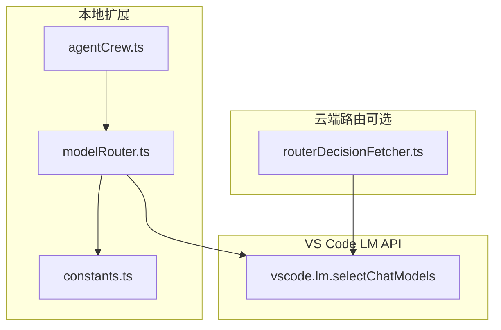
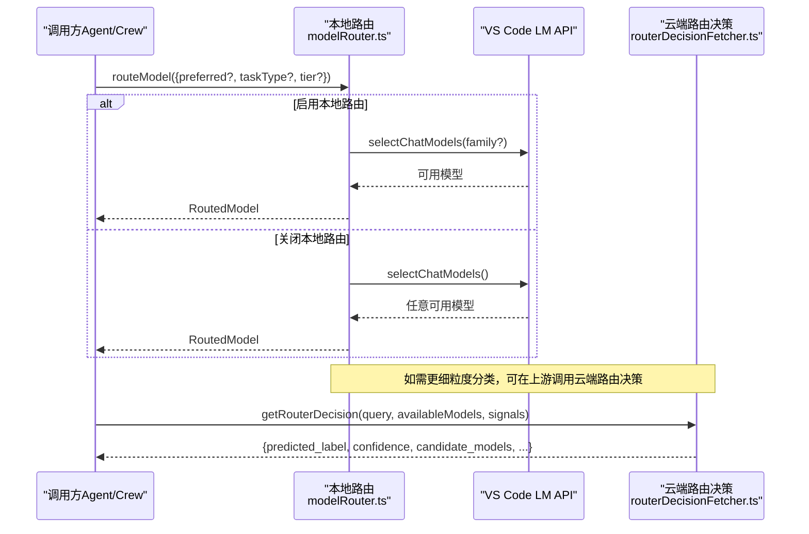
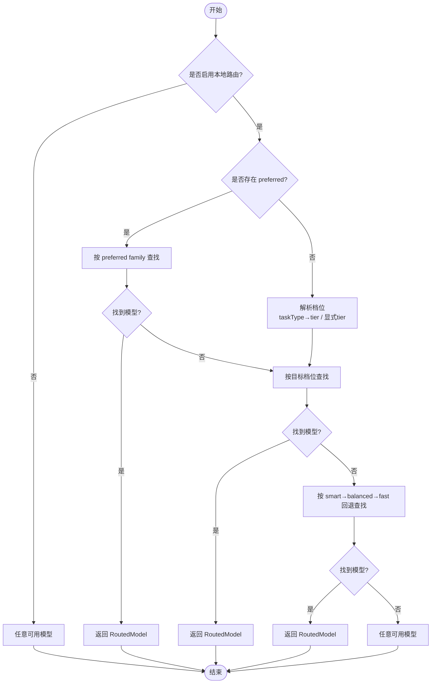
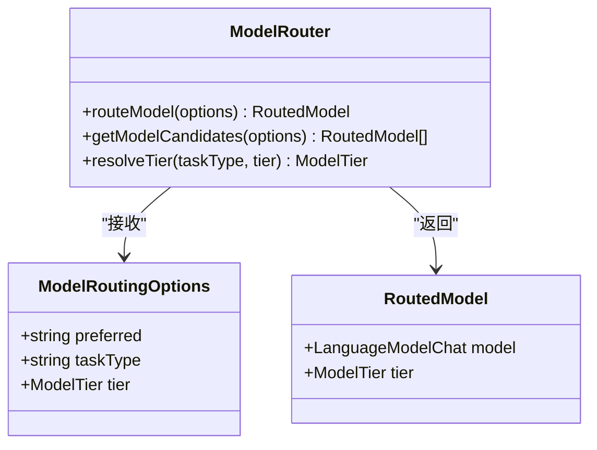
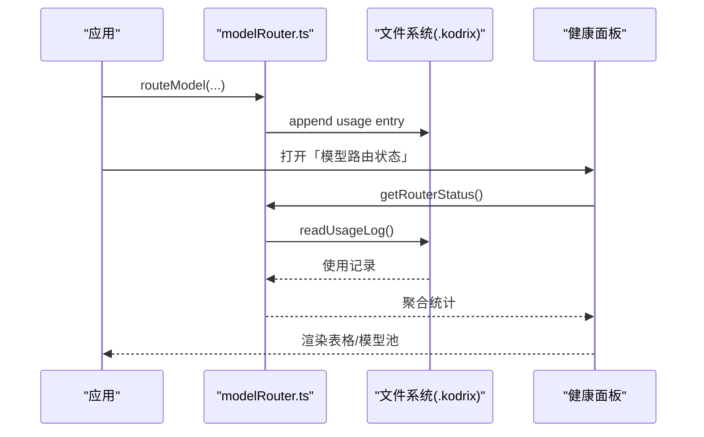
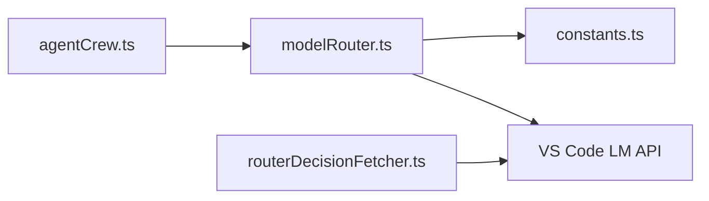

# 模型解析与路由

<cite>
**本文引用的文件**
- [modelRouter.ts](file://extensions/kodrix-agent-os/src/model/modelRouter.ts)
- [constants.ts](file://extensions/kodrix-agent-os/src/shared/constants.ts)
- [agentCrew.ts](file://extensions/kodrix-agent-os/src/crew/agentCrew.ts)
- [routerDecisionFetcher.ts](file://extensions/copilot/src/platform/endpoint/node/routerDecisionFetcher.ts)
- [package.nls.json（kodrix-agent-os）](file://extensions/kodrix-agent-os/package.nls.json)
- [package.nls.json（kodrix-local）](file://extensions/kodrix-local/package.nls.json)
</cite>

## 目录
1. [简介](#简介)
2. [项目结构](#项目结构)
3. [核心组件](#核心组件)
4. [架构总览](#架构总览)
5. [详细组件分析](#详细组件分析)
6. [依赖关系分析](#依赖关系分析)
7. [性能考量](#性能考量)
8. [故障排查指南](#故障排查指南)
9. [结论](#结论)
10. [附录](#附录)

## 简介
本文件聚焦 Kodrix 的“模型解析与智能路由”能力，围绕 modelResolve 的智能路由算法、多模型路由配置、与 Cursor 默认配置的兼容性、路由决策树与权重计算、监控统计以及扩展与调试方法展开。Kodrix 在本地通过 VS Code Language Model API 实现三档模型池（smart/balanced/fast），按任务类型自动选择模型；同时兼容 Copilot 的云端路由决策接口，用于更细粒度的推理/非推理分类与候选模型推荐。

## 项目结构
- 本地智能路由：位于 kodrix-agent-os 扩展的 modelRouter.ts，负责档位解析、候选模型查找、使用记录与健康面板。
- 共享常量：位于 constants.ts，集中管理路由配置键、档位模型族、日志上限等。
- 调用方集成：Agent Crew 在任务执行时通过 routeModel 进行模型选择。
- 云端路由决策：Copilot 的 routerDecisionFetcher.ts 提供远程分类与候选模型建议，供 Auto Mode 场景参考。
- 配置与文案：两个 package.nls.json 暴露路由开关、最后路由结果、自动执行等用户可见配置项。

图表来源
- [modelRouter.ts:146-267](file://extensions/kodrix-agent-os/src/model/modelRouter.ts#L146-L267)
- [constants.ts:459-477](file://extensions/kodrix-agent-os/src/shared/constants.ts#L459-L477)
- [agentCrew.ts:400-421](file://extensions/kodrix-agent-os/src/crew/agentCrew.ts#L400-L421)
- [routerDecisionFetcher.ts:70-112](file://extensions/copilot/src/platform/endpoint/node/routerDecisionFetcher.ts#L70-L112)

章节来源
- [modelRouter.ts:1-363](file://extensions/kodrix-agent-os/src/model/modelRouter.ts#L1-L363)
- [constants.ts:459-477](file://extensions/kodrix-agent-os/src/shared/constants.ts#L459-L477)
- [agentCrew.ts:400-421](file://extensions/kodrix-agent-os/src/crew/agentCrew.ts#L400-L421)
- [routerDecisionFetcher.ts:1-215](file://extensions/copilot/src/platform/endpoint/node/routerDecisionFetcher.ts#L1-L215)

## 核心组件
- 模型路由主入口：routeModel(options)
  - 支持精确指定 preferred family、任务类型映射到档位、显式 tier 覆盖。
  - 失败降级：目标档位不可用则回退到其他档位，最终兜底任意可用模型。
- 候选模型生成：getModelCandidates(options)
  - 返回按优先级排序的多候选模型列表，便于上层做故障转移逐个尝试。
- 档位解析：resolveTier(taskType, tier)
  - 将任务类型映射为 smart/balanced/fast，未匹配时默认 balanced。
- 使用记录与健康面板：recordUsage/readUsageLog/getRouterStatus
  - 以 .kodrix/model-router.jsonl 持久化每次路由与推理调用，聚合成功率、平均耗时、最近错误等指标。
- 与 Agent Crew 集成：selectCrewModel(roleToTaskType(...))
  - 根据角色推导任务类型，再走路由选择模型。

章节来源
- [modelRouter.ts:65-89](file://extensions/kodrix-agent-os/src/model/modelRouter.ts#L65-L89)
- [modelRouter.ts:166-267](file://extensions/kodrix-agent-os/src/model/modelRouter.ts#L166-L267)
- [modelRouter.ts:100-144](file://extensions/kodrix-agent-os/src/model/modelRouter.ts#L100-L144)
- [modelRouter.ts:269-363](file://extensions/kodrix-agent-os/src/model/modelRouter.ts#L269-L363)
- [agentCrew.ts:400-421](file://extensions/kodrix-agent-os/src/crew/agentCrew.ts#L400-L421)

## 架构总览
Kodrix 的路由体系由“本地智能路由 + 可选云端路由决策”组成：
- 本地路由优先：基于 VS Code LM API 在三档模型池中查找可用模型，结合任务类型与显式偏好快速决策。
- 云端路由辅助：在需要更精细的分类（如是否需要深度推理）或 A/B 实验路径时，可调用 Copilot 的 Router Decision API，获取 predicted_label、confidence、candidate_models 等信号。
- 统一输出：无论来源如何，上层均以 RoutedModel 形式消费（包含 model 与 tier）。

图表来源
- [modelRouter.ts:208-267](file://extensions/kodrix-agent-os/src/model/modelRouter.ts#L208-L267)
- [routerDecisionFetcher.ts:70-112](file://extensions/copilot/src/platform/endpoint/node/routerDecisionFetcher.ts#L70-L112)

## 详细组件分析

### 智能路由算法（routeModel）
- 优先级顺序
  1) 精确指定 preferred family：直接查找该 family 的第一个可用模型。
  2) 任务类型映射档位：analysis/review/plan → smart；coding/edit/terminal → balanced；quick/extract → fast。
  3) 显式 tier 覆盖：若传入 tier，则优先使用该档位。
  4) 回退策略：目标档位不可用时，按 smart → balanced → fast 顺序依次尝试。
  5) 最终兜底：任意可用模型。
- 复杂度
  - 时间复杂度：O(T+F)，T 为档位数（常数 3），F 为每个档位的 family 数量（常数级），整体近似 O(1)。
  - 空间复杂度：O(1)，仅维护少量状态集合。
- 容错
  - 对单个 family 查询异常进行捕获并继续尝试下一个。
  - 所有失败路径均保留降级选项，确保始终尽可能返回可用模型。

图表来源
- [modelRouter.ts:208-267](file://extensions/kodrix-agent-os/src/model/modelRouter.ts#L208-L267)

章节来源
- [modelRouter.ts:65-89](file://extensions/kodrix-agent-os/src/model/modelRouter.ts#L65-L89)
- [modelRouter.ts:146-206](file://extensions/kodrix-agent-os/src/model/modelRouter.ts#L146-L206)
- [modelRouter.ts:208-267](file://extensions/kodrix-agent-os/src/model/modelRouter.ts#L208-L267)

### 多模型路由配置（优先级、负载均衡、故障转移）
- 优先级设置
  - preferred > 显式 tier > 任务类型映射 > 全池回退。
  - 档位模型族顺序由 constants 中的 MODEL_ROUTER_TIERS 定义，可按需调整。
- 负载均衡
  - 当前实现取各 family 第一个可用模型；如需轮询/加权，可在 findInTier 中引入计数器或随机选择。
  - 可通过 getModelCandidates 返回多候选，上层实现按权重或健康度挑选。
- 故障转移
  - 单 family 失败不影响其他 family 尝试。
  - 目标档位失败后自动回退到其他档位，最终兜底任意模型。
  - 上层（如 Agent 推理循环）可使用候选列表逐个尝试，提升鲁棒性。

章节来源
- [constants.ts:469-477](file://extensions/kodrix-agent-os/src/shared/constants.ts#L469-L477)
- [modelRouter.ts:146-206](file://extensions/kodrix-agent-os/src/model/modelRouter.ts#L146-L206)
- [modelRouter.ts:208-267](file://extensions/kodrix-agent-os/src/model/modelRouter.ts#L208-L267)

### 与 Cursor 默认配置的兼容性
- 功能对齐
  - 多模型路由：通过 kodrix.modelRouter.enabled 控制开关，行为对标 Cursor 的多模型路由。
  - 自动执行：当路由置信度高时可自动执行（config.router.autoExecute）。
  - 导入与迁移：支持从 Cursor 导入 Rules/MCP/Skills，应用 Cursor 风格默认配置。
- 配置键说明
  - modelRoutes：多模型路由（plan/agent/code/fast），每项仅使用 model 字段。
  - lastRoute：记录最近一次智能路由结果。
  - applyCursorFeatures / applyCursor3Experience：一键应用 Cursor 体验默认配置。
- 实践建议
  - 首次运行可开启 migrateOnFirstRun/importCursorOnFirstRun，自动迁移与导入。
  - 在 Manage Models 中配置 BYOK 模型，确保路由能找到可用 family。

章节来源
- [package.nls.json（kodrix-agent-os）:110-117](file://extensions/kodrix-agent-os/package.nls.json#L110-L117)
- [package.nls.json（kodrix-local）:24-28](file://extensions/kodrix-local/package.nls.json#L24-L28)
- [package.nls.json（kodrix-local）:18-19](file://extensions/kodrix-local/package.nls.json#L18-L19)

### 路由决策树设计原理、条件判断与权重计算
- 决策树
  - 根节点：是否启用本地路由。
  - 分支一：是否存在 preferred family → 命中则直接返回。
  - 分支二：任务类型映射档位 → 命中则在该档位查找。
  - 分支三：回退顺序 smart → balanced → fast → 任意模型。
- 条件判断
  - 任务类型到档位的映射表 TASK_TIER_MAP 决定初始档位。
  - 显式 tier 可覆盖任务类型映射。
- 权重计算
  - 本地路由采用确定性优先级，不引入概率权重。
  - 云端路由决策返回 scores（needs_reasoning/no_reasoning）、confidence、hydra_scores 等，可用于上层策略（如高置信度自动执行、低置信度人工确认）。

图表来源
- [modelRouter.ts:29-43](file://extensions/kodrix-agent-os/src/model/modelRouter.ts#L29-L43)
- [modelRouter.ts:65-89](file://extensions/kodrix-agent-os/src/model/modelRouter.ts#L65-L89)
- [modelRouter.ts:166-267](file://extensions/kodrix-agent-os/src/model/modelRouter.ts#L166-L267)

章节来源
- [modelRouter.ts:65-89](file://extensions/kodrix-agent-os/src/model/modelRouter.ts#L65-L89)
- [modelRouter.ts:166-267](file://extensions/kodrix-agent-os/src/model/modelRouter.ts#L166-L267)
- [routerDecisionFetcher.ts:16-32](file://extensions/copilot/src/platform/endpoint/node/routerDecisionFetcher.ts#L16-L32)

### 监控与统计（使用记录、健康面板）
- 使用记录
  - recordUsage：记录每次路由与推理调用的模型名、档位、任务类型、耗时、成功/失败及错误信息。
  - readUsageLog：读取最近 N 条记录（默认 200），用于统计与展示。
- 健康面板
  - getRouterStatus：聚合每个模型的调用次数、成功率、失败次数、平均耗时、最近错误与时间戳。
  - 命令「Kodrix: 模型路由状态」打开 Webview 面板，支持刷新查看最新数据。
- 云端遥测
  - routerDecisionFetcher 上报 automode.routerDecision 事件，包含 predicted_label、confidence、latency、candidate/chosen models、hydra_scores 等。

图表来源
- [modelRouter.ts:100-144](file://extensions/kodrix-agent-os/src/model/modelRouter.ts#L100-L144)
- [modelRouter.ts:269-363](file://extensions/kodrix-agent-os/src/model/modelRouter.ts#L269-L363)
- [routerDecisionFetcher.ts:119-210](file://extensions/copilot/src/platform/endpoint/node/routerDecisionFetcher.ts#L119-L210)

章节来源
- [modelRouter.ts:100-144](file://extensions/kodrix-agent-os/src/model/modelRouter.ts#L100-L144)
- [modelRouter.ts:269-363](file://extensions/kodrix-agent-os/src/model/modelRouter.ts#L269-L363)
- [routerDecisionFetcher.ts:119-210](file://extensions/copilot/src/platform/endpoint/node/routerDecisionFetcher.ts#L119-L210)

### 自定义路由规则扩展方法与调试工具
- 扩展点
  - 修改档位模型族：在 constants.ts 的 MODEL_ROUTER_TIERS 中增删 family，影响路由候选范围。
  - 自定义任务类型映射：扩展 TASK_TIER_MAP，新增业务任务类型到档位的映射。
  - 自定义选择策略：在 findInTier 中实现轮询/加权/健康度感知选择；或使用 getModelCandidates 在上层实现复杂策略。
- 调试工具
  - 使用「模型路由状态」面板观察模型池与最近调用情况。
  - 检查 .kodrix/model-router.jsonl 原始记录，定位失败原因与耗时分布。
  - 结合 Agent Crew 的角色→任务类型映射，验证不同角色的路由效果。

章节来源
- [constants.ts:469-477](file://extensions/kodrix-agent-os/src/shared/constants.ts#L469-L477)
- [modelRouter.ts:65-89](file://extensions/kodrix-agent-os/src/model/modelRouter.ts#L65-L89)
- [modelRouter.ts:146-206](file://extensions/kodrix-agent-os/src/model/modelRouter.ts#L146-L206)
- [modelRouter.ts:269-363](file://extensions/kodrix-agent-os/src/model/modelRouter.ts#L269-L363)

## 依赖关系分析
- 模块耦合
  - modelRouter.ts 依赖 constants.ts 的配置与默认值，依赖 VS Code LM API 进行模型选择。
  - agentCrew.ts 通过 routeModel 接入路由，roleToTaskType 将角色映射为任务类型。
  - routerDecisionFetcher.ts 独立于本地路由，提供云端决策信号，可与本地路由组合使用。
- 外部依赖
  - VS Code Language Model API：作为唯一模型发现与选择通道，零外部依赖。
  - 文件系统：用于写入/读取使用记录。
- 潜在循环依赖
  - 当前无循环依赖；路由模块被上层调用，不反向依赖上层。

图表来源
- [agentCrew.ts:400-421](file://extensions/kodrix-agent-os/src/crew/agentCrew.ts#L400-L421)
- [modelRouter.ts:146-267](file://extensions/kodrix-agent-os/src/model/modelRouter.ts#L146-L267)
- [constants.ts:459-477](file://extensions/kodrix-agent-os/src/shared/constants.ts#L459-L477)
- [routerDecisionFetcher.ts:70-112](file://extensions/copilot/src/platform/endpoint/node/routerDecisionFetcher.ts#L70-L112)

章节来源
- [agentCrew.ts:400-421](file://extensions/kodrix-agent-os/src/crew/agentCrew.ts#L400-L421)
- [modelRouter.ts:146-267](file://extensions/kodrix-agent-os/src/model/modelRouter.ts#L146-L267)
- [constants.ts:459-477](file://extensions/kodrix-agent-os/src/shared/constants.ts#L459-L477)
- [routerDecisionFetcher.ts:70-112](file://extensions/copilot/src/platform/endpoint/node/routerDecisionFetcher.ts#L70-L112)

## 性能考量
- 路由开销
  - 本地路由为常数级操作，主要开销来自 LM API 查询；应尽量避免频繁重复查询，可缓存短期结果。
- 并发与超时
  - Agent Crew 支持受限并发与任务超时，避免资源耗尽；路由本身无阻塞等待。
- 日志滚动
  - 使用记录按上限滚动清理，防止磁盘膨胀。
- 云端路由
  - 云端决策有超时保护（约 2.5s），失败时不应阻断本地路由流程。

[本节为通用指导，无需特定文件引用]

## 故障排查指南
- 无法找到模型
  - 检查 Manage Models 是否正确配置 BYOK 模型，确保 family 存在于 MODEL_ROUTER_TIERS。
  - 查看健康面板与 .kodrix/model-router.jsonl 最近错误。
- 路由未生效
  - 确认 kodrix.modelRouter.enabled 已启用。
  - 检查任务类型映射是否覆盖预期；必要时使用显式 tier。
- 云端路由失败
  - 关注 RouterDecisionError 的错误码与消息，检查网络与鉴权。
  - 结合 telemetry 事件 automode.routerDecision 分析延迟与候选模型。

章节来源
- [modelRouter.ts:208-267](file://extensions/kodrix-agent-os/src/model/modelRouter.ts#L208-L267)
- [modelRouter.ts:269-363](file://extensions/kodrix-agent-os/src/model/modelRouter.ts#L269-L363)
- [routerDecisionFetcher.ts:47-52](file://extensions/copilot/src/platform/endpoint/node/routerDecisionFetcher.ts#L47-L52)
- [routerDecisionFetcher.ts:102-112](file://extensions/copilot/src/platform/endpoint/node/routerDecisionFetcher.ts#L102-L112)

## 结论
Kodrix 的模型解析与路由以本地智能路由为核心，结合可选的云端路由决策，形成稳定、可扩展、可观测的多模型调度体系。通过三档模型池、任务类型映射、显式覆盖与多级回退，系统能在成本、性能与质量之间取得平衡。配合使用记录与健康面板，用户可直观掌握模型使用情况并进行调优。未来可在负载均衡、健康度感知与策略可插拔方面进一步增强。

## 附录
- 关键配置键
  - kodrix.modelRouter.enabled：启用/禁用本地路由。
  - config.router.lastRoute：最近一次路由结果。
  - config.router.autoExecute：高置信度自动执行。
  - config.modelRoutes：多模型路由（plan/agent/code/fast），每项仅使用 model 字段。
- 常用命令
  - 「Kodrix: 模型路由状态」：打开健康面板。
  - 「应用 Cursor 功能默认配置」/「应用 Cursor 3.0 Agent 中心体验」：快速对齐 Cursor 体验。

章节来源
- [package.nls.json（kodrix-agent-os）:110-117](file://extensions/kodrix-agent-os/package.nls.json#L110-L117)
- [package.nls.json（kodrix-local）:24-28](file://extensions/kodrix-local/package.nls.json#L24-L28)
- [package.nls.json（kodrix-local）:18-19](file://extensions/kodrix-local/package.nls.json#L18-L19)