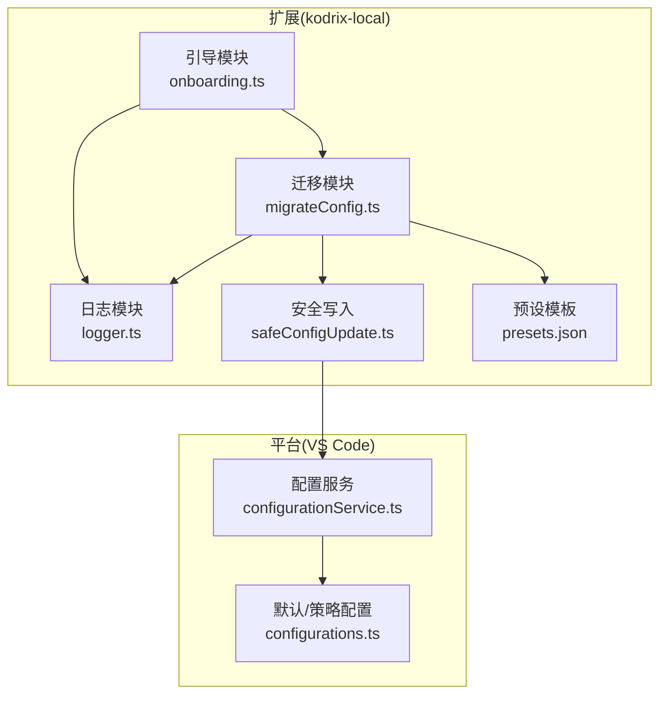
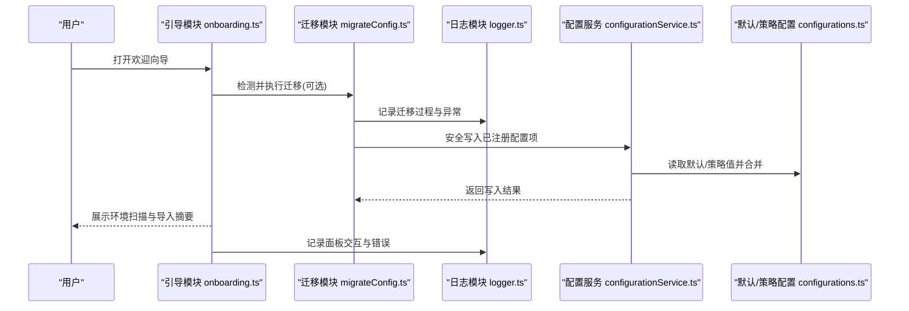
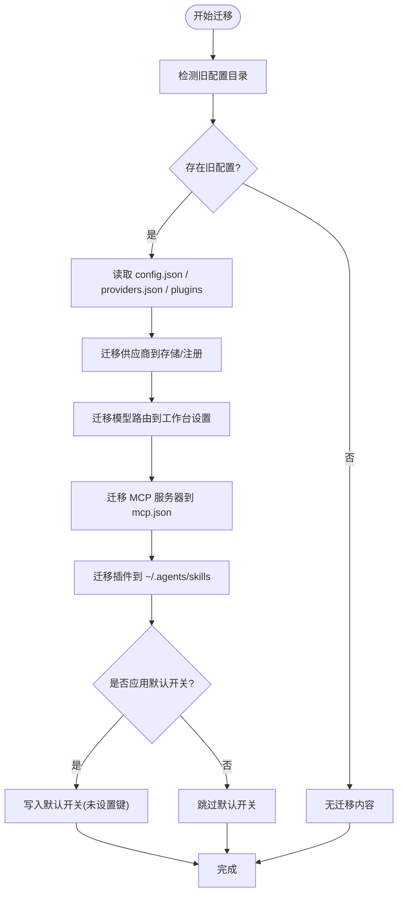
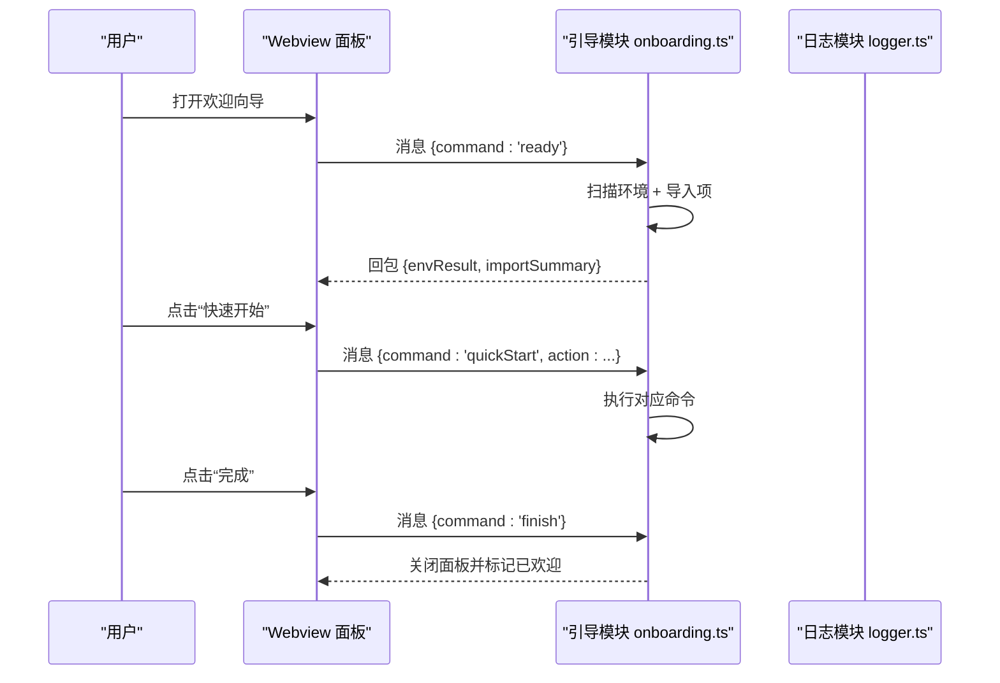
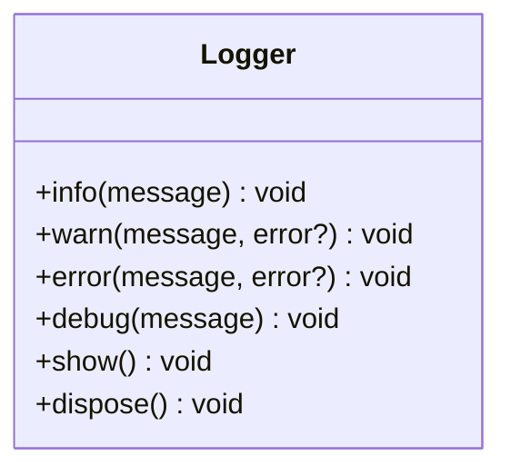
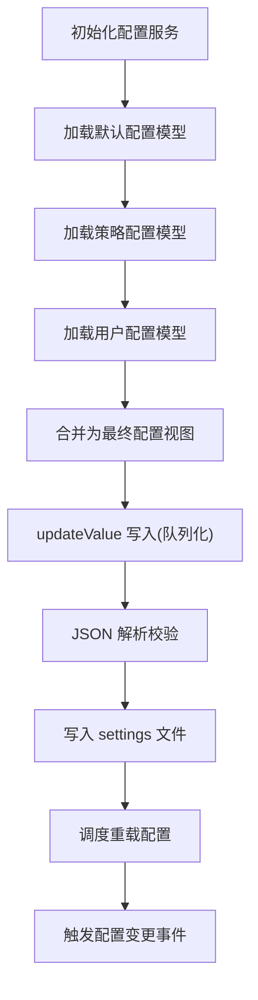
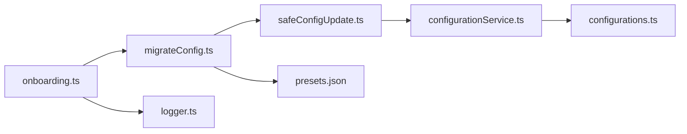

# 配置管理系统

<cite>
**本文引用的文件**
- [migrateConfig.ts](file://extensions/kodrix-local/src/migrateConfig.ts)
- [onboarding.ts](file://extensions/kodrix-local/src/onboarding.ts)
- [logger.ts](file://extensions/kodrix-local/src/logger.ts)
- [configurationService.ts](file://src/vs/platform/configuration/common/configurationService.ts)
- [configurations.ts](file://src/vs/platform/configuration/common/configurations.ts)
- [safeConfigUpdate.ts](file://extensions/kodrix-local/src/safeConfigUpdate.ts)
- [presets.json](file://extensions/kodrix-local/resources/presets.json)
</cite>

## 目录
1. [简介](#简介)
2. [项目结构](#项目结构)
3. [核心组件](#核心组件)
4. [架构总览](#架构总览)
5. [详细组件分析](#详细组件分析)
6. [依赖关系分析](#依赖关系分析)
7. [性能考虑](#性能考虑)
8. [故障排查指南](#故障排查指南)
9. [结论](#结论)
10. [附录](#附录)

## 简介
本文件面向“配置管理系统”，围绕以下目标展开：
- 配置迁移机制（migrateConfig）：从旧版本平滑升级到新版本，覆盖模型供应商、路由、MCP、插件等。
- 用户引导流程（onboarding）：首次启动向导、功能介绍、快速配置入口。
- 日志记录机制（logger）：统一输出配置变更、错误与调试信息。
- 配置文件结构与约束：基于 VS Code 配置体系与预设模板，说明默认值与校验策略。
- 配置同步与一致性：多设备间保持一致性的方法与注意事项。
- 备份与恢复、冲突解决与手动修复工具：提供可操作建议与定位手段。

## 项目结构
本项目在扩展层实现了配置迁移、引导与日志能力；在工作台平台层提供了统一的配置服务与默认/策略配置管理。关键路径如下：
- 扩展层（kodrix-local）
  - 迁移：extensions/kodrix-local/src/migrateConfig.ts
  - 引导：extensions/kodrix-local/src/onboarding.ts
  - 日志：extensions/kodrix-local/src/logger.ts
  - 安全写入：extensions/kodrix-local/src/safeConfigUpdate.ts
  - 预设模板：extensions/kodrix-local/resources/presets.json
- 平台层（VS Code）
  - 配置服务：src/vs/platform/configuration/common/configurationService.ts
  - 默认/策略配置：src/vs/platform/configuration/common/configurations.ts

**图表来源**
- [migrateConfig.ts:1-472](file://extensions/kodrix-local/src/migrateConfig.ts#L1-L472)
- [onboarding.ts:1-198](file://extensions/kodrix-local/src/onboarding.ts#L1-L198)
- [logger.ts:1-99](file://extensions/kodrix-local/src/logger.ts#L1-L99)
- [configurationService.ts:1-264](file://src/vs/platform/configuration/common/configurationService.ts#L1-L264)
- [configurations.ts:1-349](file://src/vs/platform/configuration/common/configurations.ts#L1-L349)
- [safeConfigUpdate.ts:1-24](file://extensions/kodrix-local/src/safeConfigUpdate.ts#L1-L24)
- [presets.json:1-188](file://extensions/kodrix-local/resources/presets.json#L1-L188)

**章节来源**
- [migrateConfig.ts:1-472](file://extensions/kodrix-local/src/migrateConfig.ts#L1-L472)
- [onboarding.ts:1-198](file://extensions/kodrix-local/src/onboarding.ts#L1-L198)
- [logger.ts:1-99](file://extensions/kodrix-local/src/logger.ts#L1-L99)
- [configurationService.ts:1-264](file://src/vs/platform/configuration/common/configurationService.ts#L1-L264)
- [configurations.ts:1-349](file://src/vs/platform/configuration/common/configurations.ts#L1-L349)
- [safeConfigUpdate.ts:1-24](file://extensions/kodrix-local/src/safeConfigUpdate.ts#L1-L24)
- [presets.json:1-188](file://extensions/kodrix-local/resources/presets.json#L1-L188)

## 核心组件
- 配置迁移（migrateConfig）
  - 负责读取旧版配置（~/.cursormini、~/.kodrix），将供应商、路由、MCP、插件等迁移到当前系统。
  - 通过安全写入封装 safeUpdateConfiguration 更新已注册配置项，避免阻断业务流程。
  - 支持应用 Agent/Skill 默认开关，提升开箱即用体验。
- 用户引导（onboarding）
  - 打开 Webview 面板，扫描环境与导入项，提供“快速开始”命令入口。
  - 维护全局状态标记，避免重复展示。
- 日志（logger）
  - 统一输出通道，支持 INFO/WARN/ERROR/DEBUG，DEBUG 受环境变量控制。
  - 提供 show/dispose 生命周期方法，便于诊断与资源释放。
- 配置服务（platform configurationService）
  - 提供配置的读取、更新、监听与重载，保证并发写安全与解析校验。
  - 合并默认、策略、用户与工作区配置，形成最终配置视图。
- 默认/策略配置（configurations）
  - DefaultConfiguration 聚合注册属性并生成默认值。
  - PolicyConfiguration 将策略值映射为配置值，支持类型转换与错误处理。

**章节来源**
- [migrateConfig.ts:1-472](file://extensions/kodrix-local/src/migrateConfig.ts#L1-L472)
- [onboarding.ts:1-198](file://extensions/kodrix-local/src/onboarding.ts#L1-L198)
- [logger.ts:1-99](file://extensions/kodrix-local/src/logger.ts#L1-L99)
- [configurationService.ts:1-264](file://src/vs/platform/configuration/common/configurationService.ts#L1-L264)
- [configurations.ts:1-349](file://src/vs/platform/configuration/common/configurations.ts#L1-L349)
- [safeConfigUpdate.ts:1-24](file://extensions/kodrix-local/src/safeConfigUpdate.ts#L1-L24)

## 架构总览
下图展示了从旧配置到新系统的迁移与引导流程，以及日志与配置服务的协作关系。

**图表来源**
- [onboarding.ts:1-198](file://extensions/kodrix-local/src/onboarding.ts#L1-L198)
- [migrateConfig.ts:1-472](file://extensions/kodrix-local/src/migrateConfig.ts#L1-L472)
- [logger.ts:1-99](file://extensions/kodrix-local/src/logger.ts#L1-L99)
- [configurationService.ts:1-264](file://src/vs/platform/configuration/common/configurationService.ts#L1-L264)
- [configurations.ts:1-349](file://src/vs/platform/configuration/common/configurations.ts#L1-L349)

## 详细组件分析

### 配置迁移（migrateConfig）
- 能力概览
  - 自动发现旧配置目录（~/.cursormini、~/.kodrix），读取 config.json/providers.json/plugins。
  - 将供应商（OpenAI/Anthropic/Gemini/Ollama/自定义）迁移至新存储与注册流程。
  - 迁移 model_routes 到对应工作台的 Agent/Chat 模型设置。
  - 迁移 MCP 服务器列表到用户级 mcp.json。
  - 迁移 plugins（含 SKILL.md）到 ~/.agents/skills，并更新 Skills 位置配置。
  - 可选应用 Agent/Skill 默认开关，减少初始配置成本。
- 安全与健壮性
  - 路径穿越防护：限制 KODRIX_CONFIG_DIR 必须在用户主目录下。
  - 安全写入：仅对已注册键进行更新，失败时记录警告不中断流程。
  - 幂等与去重：MCP 名称冲突时追加序号；重复迁移跳过已有目标。
- 数据流与复杂度
  - 读取 JSON 与合并记录的时间复杂度近似 O(n)，n 为供应商/MCP/插件数量。
  - 模型解析与注册可能涉及网络探测，需关注超时与重试策略。

**图表来源**
- [migrateConfig.ts:1-472](file://extensions/kodrix-local/src/migrateConfig.ts#L1-L472)
- [safeConfigUpdate.ts:1-24](file://extensions/kodrix-local/src/safeConfigUpdate.ts#L1-L24)

**章节来源**
- [migrateConfig.ts:1-472](file://extensions/kodrix-local/src/migrateConfig.ts#L1-L472)
- [safeConfigUpdate.ts:1-24](file://extensions/kodrix-local/src/safeConfigUpdate.ts#L1-L24)

### 用户引导（onboarding）
- 能力概览
  - 打开 Webview 欢迎面板，加载本地 HTML/CSS/Logo 资源。
  - 扫描环境（detectEnvironment）与可导入项（Cursor/Kodrix 状态）。
  - 提供“快速开始”命令：打开 Agent 聊天、进入供应商工作台、导入 Cursor 配置。
  - 维护全局状态（welcomed/cursorImported），避免重复展示。
- 交互流程
  - ready → 发送 envResult/importSummary
  - doImport → 执行导入并上报结果
  - quickStart → 触发具体命令
  - finish → 关闭面板并标记已欢迎

**图表来源**
- [onboarding.ts:1-198](file://extensions/kodrix-local/src/onboarding.ts#L1-L198)

**章节来源**
- [onboarding.ts:1-198](file://extensions/kodrix-local/src/onboarding.ts#L1-L198)

### 日志记录（logger）
- 能力概览
  - 统一输出通道，格式化时间戳与级别。
  - DEBUG 模式受环境变量控制，便于生产与开发切换。
  - 提供 show/dispose 以显示通道与释放资源。
- 使用建议
  - 迁移与引导过程中记录关键步骤与异常堆栈。
  - 配置写入失败时记录警告，便于审计与排障。

**图表来源**
- [logger.ts:1-99](file://extensions/kodrix-local/src/logger.ts#L1-L99)

**章节来源**
- [logger.ts:1-99](file://extensions/kodrix-local/src/logger.ts#L1-L99)

### 配置服务与默认/策略配置（platform）
- 配置服务（configurationService）
  - 初始化默认、策略、用户配置模型，合并为最终配置视图。
  - 提供 updateValue 写入，内部队列化防止竞态，写入前解析校验 JSON。
  - 监听用户配置变化，延迟调度重载，触发事件通知。
- 默认/策略配置（configurations）
  - DefaultConfiguration 根据注册属性生成默认值。
  - PolicyConfiguration 将策略值转换为配置值，处理类型与解析错误。

**图表来源**
- [configurationService.ts:1-264](file://src/vs/platform/configuration/common/configurationService.ts#L1-L264)
- [configurations.ts:1-349](file://src/vs/platform/configuration/common/configurations.ts#L1-L349)

**章节来源**
- [configurationService.ts:1-264](file://src/vs/platform/configuration/common/configurationService.ts#L1-L264)
- [configurations.ts:1-349](file://src/vs/platform/configuration/common/configurations.ts#L1-L349)

### 预设模板（presets.json）
- 作用
  - 定义内置供应商预设（本地/云端），包含基础 URL、默认模型、是否需要 API Key 等元信息。
  - 用于迁移与注册流程中快速匹配或构造 Provider 信息。
- 典型字段
  - id/category/name/icon/featured/api_type/base_url/model/models/needs_api_key/website/hint
- 使用方式
  - 迁移时按 api_type 选择对应注册路径（Ollama/OpenAI/Anthropic/Gemini/自定义）。
  - 引导界面可据此展示推荐与提示。

**章节来源**
- [presets.json:1-188](file://extensions/kodrix-local/resources/presets.json#L1-L188)

## 依赖关系分析
- 模块耦合
  - migrateConfig 依赖 safeConfigUpdate 进行安全写入，依赖 presets.json 获取预设信息。
  - onboarding 依赖 migrateConfig 与 logger，提供用户入口与状态管理。
  - platform 配置服务独立于扩展，提供稳定的配置读写与事件机制。
- 外部依赖
  - VS Code 工作区配置 API（workspace.getConfiguration().update）。
  - 文件系统 I/O（fs、path、os）用于读取旧配置与写入 MCP。
- 潜在循环依赖
  - 当前结构无直接循环依赖；onboarding 调用 migrateConfig，migrateConfig 不反向引用 onboarding。

**图表来源**
- [onboarding.ts:1-198](file://extensions/kodrix-local/src/onboarding.ts#L1-L198)
- [migrateConfig.ts:1-472](file://extensions/kodrix-local/src/migrateConfig.ts#L1-L472)
- [logger.ts:1-99](file://extensions/kodrix-local/src/logger.ts#L1-L99)
- [safeConfigUpdate.ts:1-24](file://extensions/kodrix-local/src/safeConfigUpdate.ts#L1-L24)
- [configurationService.ts:1-264](file://src/vs/platform/configuration/common/configurationService.ts#L1-L264)
- [configurations.ts:1-349](file://src/vs/platform/configuration/common/configurations.ts#L1-L349)

**章节来源**
- [onboarding.ts:1-198](file://extensions/kodrix-local/src/onboarding.ts#L1-L198)
- [migrateConfig.ts:1-472](file://extensions/kodrix-local/src/migrateConfig.ts#L1-L472)
- [logger.ts:1-99](file://extensions/kodrix-local/src/logger.ts#L1-L99)
- [safeConfigUpdate.ts:1-24](file://extensions/kodrix-local/src/safeConfigUpdate.ts#L1-L24)
- [configurationService.ts:1-264](file://src/vs/platform/configuration/common/configurationService.ts#L1-L264)
- [configurations.ts:1-349](file://src/vs/platform/configuration/common/configurations.ts#L1-L349)

## 性能考虑
- 迁移阶段
  - 文件读取与 JSON 解析为 I/O 密集操作，建议批量处理与错误隔离。
  - 模型注册可能涉及网络请求，应设置超时与重试上限，避免阻塞 UI。
- 配置写入
  - 配置服务内部使用队列串行化写入，避免竞态条件。
  - 大量键更新时注意节流与合并，减少频繁重载。
- 引导流程
  - 环境扫描与导入扫描采用缓存，避免重复计算。
  - Webview 资源加载失败有兜底 HTML，确保用户体验。

[本节为通用指导，无需特定文件来源]

## 故障排查指南
- 常见问题
  - 迁移未生效：检查是否存在旧配置目录与权限问题；查看日志中的警告与错误。
  - 配置写入失败：确认键是否已注册；若被策略拒绝，需在策略侧调整。
  - 引导面板异常：检查 Webview 资源路径与 CSP 设置；查看日志中的面板消息错误。
- 定位手段
  - 启用 DEBUG 日志：设置环境变量以输出调试信息。
  - 查看输出通道：通过日志模块的 show 方法打开输出面板。
  - 检查配置变更事件：监听配置服务的事件以追踪变更来源。

**章节来源**
- [logger.ts:1-99](file://extensions/kodrix-local/src/logger.ts#L1-L99)
- [configurationService.ts:1-264](file://src/vs/platform/configuration/common/configurationService.ts#L1-L264)
- [onboarding.ts:1-198](file://extensions/kodrix-local/src/onboarding.ts#L1-L198)

## 结论
本配置管理系统通过迁移、引导与日志三大模块，结合平台配置服务，实现了从旧版本到新版本的安全、平滑升级。预设模板降低了初始配置门槛，统一日志提升了可观测性与可维护性。建议在多设备环境中配合版本控制与策略管理，保持配置一致性与合规性。

[本节为总结，无需特定文件来源]

## 附录

### 配置文件结构与约束
- 配置来源
  - 默认配置：由 DefaultConfiguration 根据注册属性生成。
  - 策略配置：由 PolicyConfiguration 将策略值映射为配置值。
  - 用户配置：由 ConfigurationService 加载并合并。
- 验证规则
  - 写入前进行 JSON 解析校验，非法内容阻止写入并提示修复。
  - 策略值类型转换失败会记录错误并跳过该键。
- 默认值与约束
  - 各配置项的默认值来源于注册属性的 default 字段。
  - 策略可覆盖默认值与用户值，具有最高优先级。

**章节来源**
- [configurations.ts:1-349](file://src/vs/platform/configuration/common/configurations.ts#L1-L349)
- [configurationService.ts:1-264](file://src/vs/platform/configuration/common/configurationService.ts#L1-L264)

### 配置模板与最佳实践
- 使用预设模板
  - 优先选择内置预设（如 OpenAI/Anthropic/Ollama），减少手工配置。
  - 自定义接口建议使用“自定义”预设，明确 base_url 与模型名。
- 迁移建议
  - 首次启动后运行迁移命令，确保供应商、路由、MCP、插件完整迁移。
  - 检查迁移报告中的“已应用设置”，必要时手动修正。
- 安全建议
  - 避免将敏感信息（API Key）提交到版本库；使用策略或密钥管理服务。
  - 限制 KODRIX_CONFIG_DIR 指向用户主目录内路径，防止路径穿越。

**章节来源**
- [presets.json:1-188](file://extensions/kodrix-local/resources/presets.json#L1-L188)
- [migrateConfig.ts:1-472](file://extensions/kodrix-local/src/migrateConfig.ts#L1-L472)

### 配置同步机制（多设备一致性）
- 推荐方案
  - 使用版本控制系统（Git）管理用户配置目录（settings.json、mcp.json 等），通过分支与合并策略解决冲突。
  - 利用策略配置集中管控企业级设置，确保关键项一致性。
- 注意事项
  - 避免在同一时间多点编辑同一配置；使用锁或协作约定。
  - 对敏感字段（如 API Key）采用环境变量或密钥管理服务，不在配置文件中明文存储。

[本节为通用指导，无需特定文件来源]

### 配置备份与恢复
- 备份
  - 定期导出用户配置目录（settings.json、mcp.json、providers.json 等）到安全位置。
  - 对迁移过程中的中间产物（如临时 JSON）进行备份，便于回滚。
- 恢复
  - 从备份恢复配置后，重新运行迁移以确保兼容性与完整性。
  - 检查配置服务的事件与日志，确认恢复成功。

[本节为通用指导，无需特定文件来源]

### 配置冲突解决策略与手动修复工具
- 冲突策略
  - 以策略配置为最高优先级，其次为用户配置，最后为默认配置。
  - 对重复键（如 MCP 名称）采用去重与命名规范（追加序号）。
- 手动修复
  - 直接编辑 settings.json 或 mcp.json，确保 JSON 合法。
  - 使用配置服务提供的 inspect/update 接口进行安全修改。
  - 通过日志模块输出通道查看错误详情，定位问题根因。

**章节来源**
- [configurationService.ts:1-264](file://src/vs/platform/configuration/common/configurationService.ts#L1-L264)
- [migrateConfig.ts:1-472](file://extensions/kodrix-local/src/migrateConfig.ts#L1-L472)
- [logger.ts:1-99](file://extensions/kodrix-local/src/logger.ts#L1-L99)