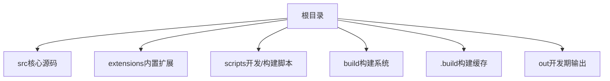
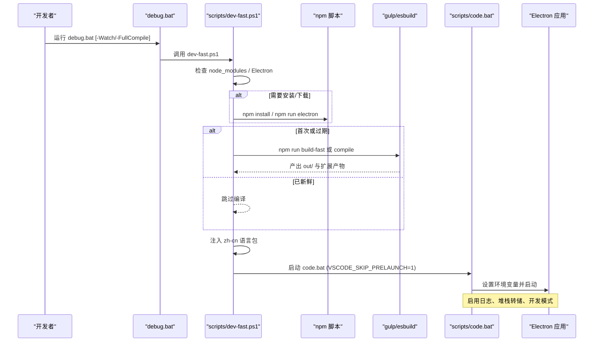
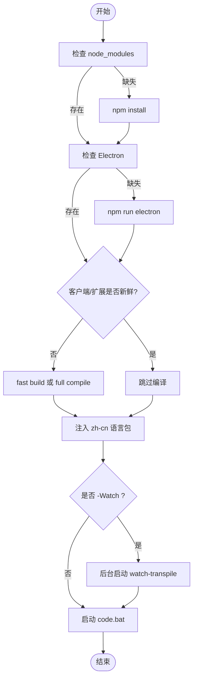
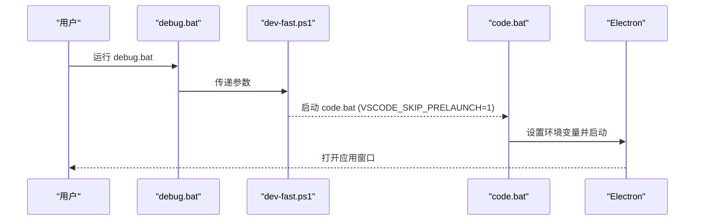

# 开发环境构建

<cite>
**本文引用的文件**
- [README.md](file://README.md)
- [package.json](file://package.json)
- [.nvmrc](file://.nvmrc)
- [scripts/dev-fast.ps1](file://scripts/dev-fast.ps1)
- [debug.bat](file://debug.bat)
- [scripts/code.bat](file://scripts/code.bat)
- [build.bat](file://build.bat)
</cite>

## 目录
1. [简介](#简介)
2. [项目结构](#项目结构)
3. [核心组件](#核心组件)
4. [架构总览](#架构总览)
5. [详细组件分析](#详细组件分析)
6. [依赖关系分析](#依赖关系分析)
7. [性能与编译优化](#性能与编译优化)
8. [故障排查指南](#故障排查指南)
9. [结论](#结论)
10. [附录](#附录)

## 简介
本指南面向希望在本地构建并调试 Kodrix（基于 VS Code/VSCodium 的 AI 原生代码编辑器）的开发者。内容涵盖：
- 环境与依赖安装（Node.js、Electron、VS Code SDK 等）
- 开发服务器启动方式与快速开发脚本 dev-fast.ps1
- 热重载与增量编译配置
- 主进程、渲染进程、扩展宿主进程的调试方法
- 编译优化选项（增量、并行、跳过预检查等）
- 常见问题的定位与解决（端口冲突、依赖版本不匹配等）

## 项目结构
Kodrix 采用“源码 + 内置扩展 + 构建脚本”的分层组织，根目录提供统一的开发与打包入口，关键目录职责如下：
- src：核心 TypeScript/JS 源码与 Electron 主进程、渲染进程、工作区逻辑
- extensions：内置扩展（含 kodrix-local、kodrix-agent-os、kodrix-skills 以及 Copilot 等）
- scripts：开发、构建、修复脚本（dev-fast.ps1、code.bat、build-exe.ps1 等）
- build：gulp/esbuild 构建系统与任务
- .build：构建缓存（Electron 二进制、扩展产物等）
- out：开发期编译输出（main.js、扩展 JS 等）

章节来源
- [README.md:69-85](file://README.md#L69-L85)

## 核心组件
- Node.js 运行时与包管理
  - 版本要求由 .nvmrc 指定；preinstall 钩子会严格校验 Node 主版本与 npm 版本
- Electron 运行时
  - 通过 @vscode/gulp-electron 下载至 .build/electron，由 code.bat 解析 product.json 中的 nameShort 确定可执行名
- 构建系统
  - esbuild 用于快速 transpile；gulp 负责扩展编译、资源拷贝、媒体处理等
  - package.json 中定义 watch、compile、build-fast 等脚本以支持增量与并行
- 启动器与调试
  - debug.bat 调用 scripts/dev-fast.ps1，后者完成依赖/Electron/编译准备后启动 code.bat
  - code.bat 设置 VSCODE_DEV、ELECTRON_ENABLE_LOGGING 等环境变量并启动 Electron

章节来源
- [package.json:1-100](file://package.json#L1-L100)
- [scripts/dev-fast.ps1:1-33](file://scripts/dev-fast.ps1#L1-L33)
- [scripts/code.bat:39-62](file://scripts/code.bat#L39-L62)

## 架构总览
下图展示了从脚本到运行时的完整链路，包括依赖检查、Electron 获取、客户端与扩展编译、语言包注入、Watch 模式与最终启动。

图表来源
- [scripts/dev-fast.ps1:105-193](file://scripts/dev-fast.ps1#L105-L193)
- [scripts/code.bat:12-62](file://scripts/code.bat#L12-L62)

章节来源
- [scripts/dev-fast.ps1:105-193](file://scripts/dev-fast.ps1#L105-L193)
- [scripts/code.bat:12-62](file://scripts/code.bat#L12-L62)

## 详细组件分析

### 快速开发脚本 dev-fast.ps1
- 功能要点
  - 自动检测并安装依赖、下载 Electron
  - 智能判断是否需要全量 compile 或仅 fast build（esbuild transpile + 扩展）
  - 注入简体中文语言包（幂等）
  - 可选 Watch 模式：后台启动 watch-transpile 并在修改 src 时增量重编译
  - 启动 code.bat 并保留额外参数透传
- 关键流程
  - 依赖与环境验证 → 客户端编译 → 扩展编译 → 语言包注入 → 启动应用
- 常用参数
  - -Watch：开启文件监听与增量编译
  - -FullCompile：强制全量 TypeScript 编译
  - -NoLaunch：仅准备环境，不启动应用

图表来源
- [scripts/dev-fast.ps1:51-163](file://scripts/dev-fast.ps1#L51-L163)
- [scripts/dev-fast.ps1:171-193](file://scripts/dev-fast.ps1#L171-L193)

章节来源
- [scripts/dev-fast.ps1:1-33](file://scripts/dev-fast.ps1#L1-L33)
- [scripts/dev-fast.ps1:51-163](file://scripts/dev-fast.ps1#L51-L163)
- [scripts/dev-fast.ps1:171-193](file://scripts/dev-fast.ps1#L171-L193)

### 启动入口 debug.bat 与 code.bat
- debug.bat
  - 统一入口，转发参数到 dev-fast.ps1，支持 -Watch、-FullCompile、-Prepare
  - 错误码捕获并提示
- code.bat
  - 设置 NODE_ENV=development、VSCODE_DEV=1、ELECTRON_ENABLE_LOGGING=1 等
  - 解析 product.json 中的 nameShort 定位 Electron 可执行
  - 默认 locale=zh-cn，支持 --locale 覆盖

图表来源
- [debug.bat:23-42](file://debug.bat#L23-L42)
- [scripts/code.bat:39-62](file://scripts/code.bat#L39-L62)

章节来源
- [debug.bat:1-58](file://debug.bat#L1-L58)
- [scripts/code.bat:1-73](file://scripts/code.bat#L1-L73)

### 构建与打包 build.bat
- 一键打包 Windows EXE 安装包，委托给 scripts/build-exe.ps1
- 首次构建包含 Copilot 扩展 esbuild，耗时较长属正常

章节来源
- [build.bat:1-43](file://build.bat#L1-L43)
- [README.md:97-104](file://README.md#L97-L104)

### 调试环境配置（主进程、渲染进程、扩展宿主）
- 主进程调试
  - 使用 VS Code 的 Node 调试配置，附加到 Electron 主进程（通常由 launch 配置自动附加）
  - 通过 ELECTRON_ENABLE_LOGGING=1、ELECTRON_ENABLE_STACK_DUMPING=1 增强日志
- 渲染进程调试
  - 在开发模式下，可通过浏览器 DevTools 或 VS Code 的 Webview 调试能力进行调试
- 扩展宿主进程调试
  - 针对内置扩展（如 kodrix-*、Copilot），可在其工程内使用各自的 watch/compile 脚本，配合 VS Code 的扩展调试配置进行断点调试
- 实用技巧
  - 使用 dev-fast.ps1 -Watch 开启增量编译，减少等待时间
  - 使用 VSCODE_SKIP_PRELAUNCH=1 跳过预检查，加快启动

章节来源
- [scripts/code.bat:39-62](file://scripts/code.bat#L39-L62)
- [scripts/dev-fast.ps1:158-163](file://scripts/dev-fast.ps1#L158-L163)
- [scripts/dev-fast.ps1:184-193](file://scripts/dev-fast.ps1#L184-L193)

## 依赖关系分析
- Node.js 版本约束
  - .nvmrc 指定 Node 版本；preinstall 钩子严格校验主版本与 npm 版本
- Electron 依赖
  - 通过 @vscode/gulp-electron 下载至 .build/electron，由 code.bat 解析 product.json 中的 nameShort 确定可执行名
- 构建工具链
  - esbuild 用于快速 transpile；gulp 负责扩展编译、资源处理
  - package.json 中 watch、compile、build-fast 等脚本组合实现增量与并行

图表来源
- [package.json:21-22](file://package.json#L21-L22)
- [scripts/code.bat:19-34](file://scripts/code.bat#L19-L34)

章节来源
- [.nvmrc:1-2](file://.nvmrc#L1-L2)
- [package.json:21-22](file://package.json#L21-L22)
- [scripts/code.bat:19-34](file://scripts/code.bat#L19-L34)

## 性能与编译优化
- 增量编译与热重载
  - 使用 dev-fast.ps1 -Watch 开启 watch-transpile，后台监听 src 变更并增量重编译
  - 使用 npm run watch 系列脚本（watch-client、watch-extensions、watch-copilot）分别监听不同模块
- 快速构建
  - build-fast 优先使用 esbuild transpile，避免全量 tsc 编译
  - 若检测到 out/main.js 或扩展产物过期，再触发必要重建
- 并行构建
  - npm-run-all2 用于并行执行多个任务（如 compile-client 与 compile-copilot）
- 跳过预检查
  - 设置 VSCODE_SKIP_PRELAUNCH=1 跳过 preLaunch.ts，缩短启动时间

章节来源
- [scripts/dev-fast.ps1:130-141](file://scripts/dev-fast.ps1#L130-L141)
- [scripts/dev-fast.ps1:158-163](file://scripts/dev-fast.ps1#L158-L163)
- [package.json:27-55](file://package.json#L27-L55)
- [scripts/dev-fast.ps1:184-193](file://scripts/dev-fast.ps1#L184-L193)

## 故障排查指南
- 端口冲突
  - 现象：启动时报端口占用或无法绑定
  - 排查：确认是否有其他实例占用；必要时关闭重复进程或调整端口
- 依赖版本不匹配
  - 现象：preinstall 报错或 native 模块编译失败
  - 排查：确保 Node 版本与 .nvmrc 一致；清理 node_modules 后重新安装
- Electron 可执行未找到
  - 现象：code.bat 提示找不到 Electron 可执行
  - 排查：运行 debug-rebuild.bat 或手动执行 npm run electron 下载
- 中文语言包未生效
  - 现象：界面仍为英文
  - 排查：确认 dev-fast.ps1 已完成语言包注入；必要时执行 -FullCompile 重建 nls.js
- 扩展未更新
  - 现象：修改扩展代码后未生效
  - 排查：确认扩展 out/ 与 src/ 时间戳；必要时执行 gulp 对应扩展的编译任务

章节来源
- [scripts/code.bat:27-34](file://scripts/code.bat#L27-L34)
- [scripts/dev-fast.ps1:143-156](file://scripts/dev-fast.ps1#L143-L156)
- [README.md:97-104](file://README.md#L97-L104)

## 结论
通过 dev-fast.ps1 与配套的 debug.bat、code.bat，Kodrix 提供了高效的本地开发体验：自动依赖与 Electron 管理、增量编译与热重载、并行构建与跳过预检查。结合 VS Code 调试能力，可对主进程、渲染进程与扩展宿主进行精准调试。遵循本文的环境与优化建议，可显著缩短迭代周期并提升开发效率。

## 附录
- 常用命令速查
  - 快速启动：debug.bat
  - 带监听启动：debug.bat -Watch
  - 全量重建并启动：debug-rebuild.bat
  - 仅准备环境：debug.bat -Prepare
  - 打包 EXE：build.bat

章节来源
- [debug.bat:6-15](file://debug.bat#L6-L15)
- [build.bat:6-15](file://build.bat#L6-L15)
- [scripts/dev-fast.ps1:23-33](file://scripts/dev-fast.ps1#L23-L33)