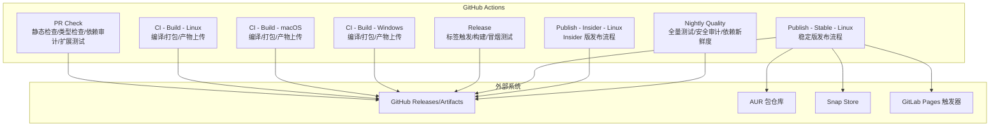
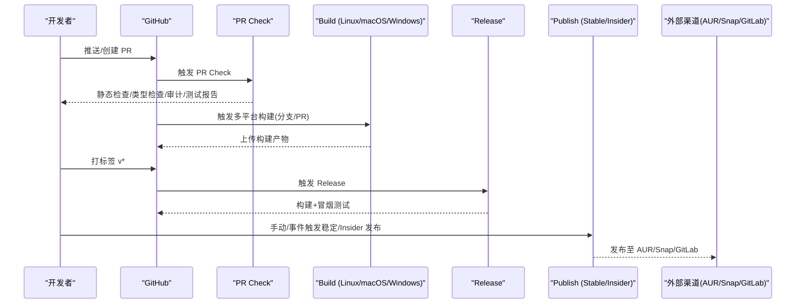
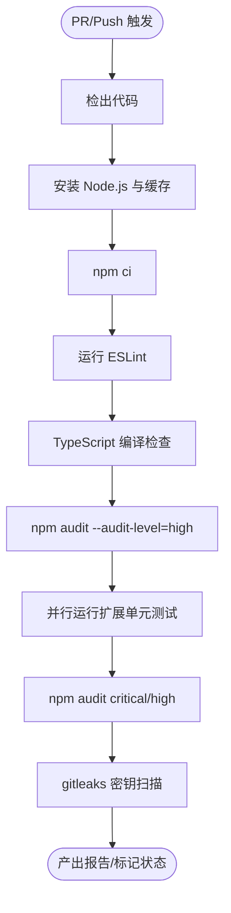
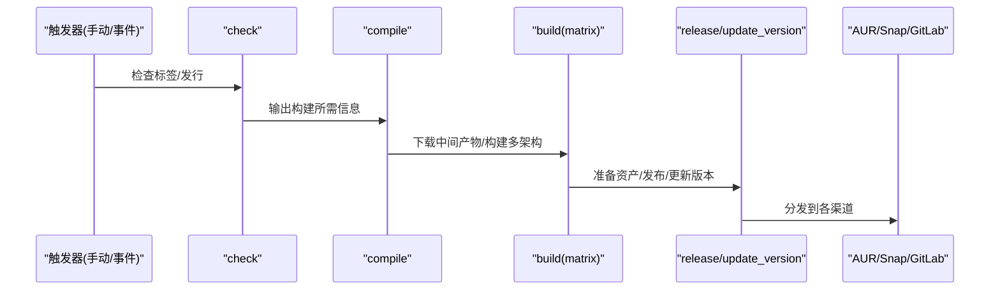
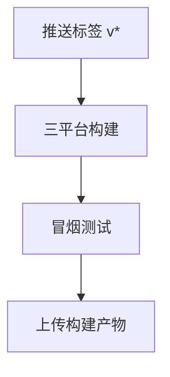
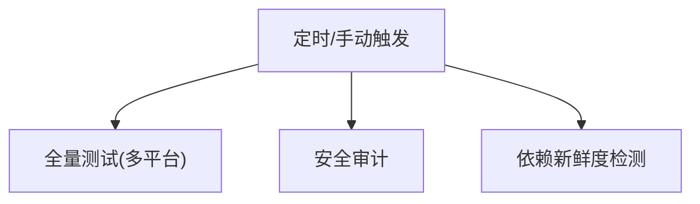
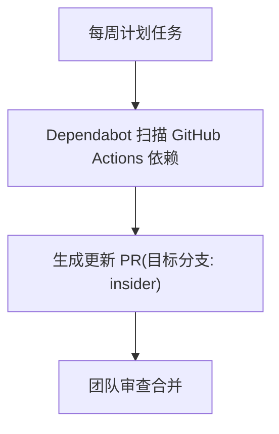
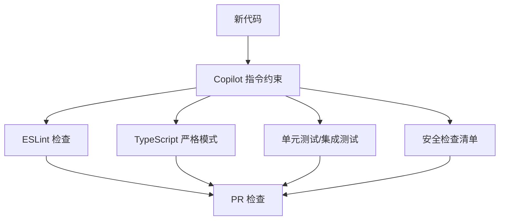
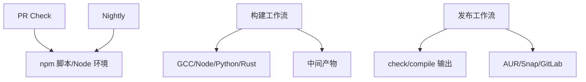

# 持续集成

<cite>
**本文引用的文件**   
- [pr-check.yml](file://.github/workflows/pr-check.yml)
- [ci-build-linux.yml](file://.github/workflows/ci-build-linux.yml)
- [ci-build-macos.yml](file://.github/workflows/ci-build-macos.yml)
- [ci-build-windows.yml](file://.github/workflows/ci-build-windows.yml)
- [release.yml](file://.github/workflows/release.yml)
- [publish-stable-linux.yml](file://.github/workflows/publish-stable-linux.yml)
- [publish-insider-linux.yml](file://.github/workflows/publish-insider-linux.yml)
- [nightly.yml](file://.github/workflows/nightly.yml)
- [dependabot.yml](file://.github/dependabot.yml)
- [copilot-instructions.md](file://.github/copilot-instructions.md)
- [package.json](file://package.json)
</cite>

## 目录
1. [简介](#简介)
2. [项目结构](#项目结构)
3. [核心组件](#核心组件)
4. [架构总览](#架构总览)
5. [详细组件分析](#详细组件分析)
6. [依赖分析](#依赖分析)
7. [性能与可维护性](#性能与可维护性)
8. [故障排除指南](#故障排除指南)
9. [结论](#结论)

## 简介
本文件系统性梳理 Kodrix 的持续集成与持续交付（CI/CD）体系，覆盖 GitHub Actions 工作流、Pull Request 检查、自动化测试、代码质量与安全扫描、依赖更新管理、发布流水线以及常见问题的定位与修复建议。目标是帮助团队快速理解并高效使用现有 CI/CD 能力，同时为后续扩展提供清晰参考。

## 项目结构
Kodrix 的 CI/CD 配置集中在 .github 目录下，按职责拆分为多个工作流：
- PR 检查与基础质量门禁：PR Check
- 多平台构建：Linux/macOS/Windows
- 版本发布与稳定版/Insider 版分发
- 夜间全量测试与安全审计
- 依赖安全与更新治理（Dependabot）
- AI 辅助开发规范（Copilot 指令）

**图示来源**
- [pr-check.yml:1-85](file://.github/workflows/pr-check.yml#L1-L85)
- [ci-build-linux.yml:1-372](file://.github/workflows/ci-build-linux.yml#L1-L372)
- [ci-build-macos.yml:1-91](file://.github/workflows/ci-build-macos.yml#L1-L91)
- [ci-build-windows.yml:1-167](file://.github/workflows/ci-build-windows.yml#L1-L167)
- [release.yml:1-55](file://.github/workflows/release.yml#L1-L55)
- [publish-stable-linux.yml:1-532](file://.github/workflows/publish-stable-linux.yml#L1-L532)
- [publish-insider-linux.yml:1-504](file://.github/workflows/publish-insider-linux.yml#L1-L504)
- [nightly.yml:1-57](file://.github/workflows/nightly.yml#L1-L57)

**章节来源**
- [pr-check.yml:1-85](file://.github/workflows/pr-check.yml#L1-L85)
- [ci-build-linux.yml:1-372](file://.github/workflows/ci-build-linux.yml#L1-L372)
- [ci-build-macos.yml:1-91](file://.github/workflows/ci-build-macos.yml#L1-L91)
- [ci-build-windows.yml:1-167](file://.github/workflows/ci-build-windows.yml#L1-L167)
- [release.yml:1-55](file://.github/workflows/release.yml#L1-L55)
- [publish-stable-linux.yml:1-532](file://.github/workflows/publish-stable-linux.yml#L1-L532)
- [publish-insider-linux.yml:1-504](file://.github/workflows/publish-insider-linux.yml#L1-L504)
- [nightly.yml:1-57](file://.github/workflows/nightly.yml#L1-L57)

## 核心组件
- Pull Request 检查（Lint、TypeScript 编译检查、依赖审计、扩展单元测试、Secret 扫描）
- 多平台构建（Linux/macOS/Windows），支持多架构矩阵与 REH（Remote Host）构建
- 发布流水线（Stable/Insider），包含制品归档、版本库更新、AUR/Snap/GitLab 触发
- 夜间任务（全量测试、安全审计、依赖新鲜度检测）
- Dependabot（GitHub Actions 依赖周更）
- Copilot 指令（编码规范、安全与测试约定）

**章节来源**
- [pr-check.yml:1-85](file://.github/workflows/pr-check.yml#L1-L85)
- [ci-build-linux.yml:1-372](file://.github/workflows/ci-build-linux.yml#L1-L372)
- [ci-build-macos.yml:1-91](file://.github/workflows/ci-build-macos.yml#L1-L91)
- [ci-build-windows.yml:1-167](file://.github/workflows/ci-build-windows.yml#L1-L167)
- [release.yml:1-55](file://.github/workflows/release.yml#L1-L55)
- [publish-stable-linux.yml:1-532](file://.github/workflows/publish-stable-linux.yml#L1-L532)
- [publish-insider-linux.yml:1-504](file://.github/workflows/publish-insider-linux.yml#L1-L504)
- [nightly.yml:1-57](file://.github/workflows/nightly.yml#L1-L57)
- [dependabot.yml:1-10](file://.github/dependabot.yml#L1-L10)
- [copilot-instructions.md:1-88](file://.github/copilot-instructions.md#L1-L88)

## 架构总览
下图展示从代码提交到发布的端到端流程，包括 PR 门禁、多平台构建、制品归档、发布渠道分发与第三方仓库同步。

**图示来源**
- [pr-check.yml:1-85](file://.github/workflows/pr-check.yml#L1-L85)
- [ci-build-linux.yml:1-372](file://.github/workflows/ci-build-linux.yml#L1-L372)
- [ci-build-macos.yml:1-91](file://.github/workflows/ci-build-macos.yml#L1-L91)
- [ci-build-windows.yml:1-167](file://.github/workflows/ci-build-windows.yml#L1-L167)
- [release.yml:1-55](file://.github/workflows/release.yml#L1-L55)
- [publish-stable-linux.yml:1-532](file://.github/workflows/publish-stable-linux.yml#L1-L532)
- [publish-insider-linux.yml:1-504](file://.github/workflows/publish-insider-linux.yml#L1-L504)

## 详细组件分析

### Pull Request 检查流程
- 触发条件：对 main 分支的 PR 与 push
- 并发控制：同 PR 取消进行中任务，避免重复执行
- Lint 与类型检查：ESLint + TypeScript 编译检查
- 依赖审计：npm audit（高严重级别告警，允许继续）
- 扩展单元测试：针对 kodrix-agent-os、kodrix-local、kodrix-skills 并行执行
- 安全扫描：npm audit（critical/high）+ gitleaks 密钥扫描

**图示来源**
- [pr-check.yml:1-85](file://.github/workflows/pr-check.yml#L1-L85)

**章节来源**
- [pr-check.yml:1-85](file://.github/workflows/pr-check.yml#L1-L85)

### 多平台构建（Linux/macOS/Windows）
- Linux
  - 编译阶段：准备 GCC/Node/Python，克隆 VSCode 源码，构建产物压缩上传
  - 构建阶段：多架构矩阵（x64/arm64/armhf/riscv64/loong64/ppc64le），容器化构建，生成二进制与 REH 产物
  - 资源准备：可选 AppImage 等资产生成与上传
- macOS
  - 双架构（Intel/Apple Silicon），Node/Python 环境准备，构建与产物上传
- Windows
  - 编译阶段：Node/Python 环境，VSCode 源码构建与产物压缩
  - 构建阶段：x64/arm64 矩阵，MSI 打包开关由变量控制，产物与校验和上传

**图示来源**
- [ci-build-linux.yml:38-201](file://.github/workflows/ci-build-linux.yml#L38-L201)
- [ci-build-macos.yml:36-91](file://.github/workflows/ci-build-macos.yml#L36-L91)
- [ci-build-windows.yml:36-167](file://.github/workflows/ci-build-windows.yml#L36-L167)

**章节来源**
- [ci-build-linux.yml:1-372](file://.github/workflows/ci-build-linux.yml#L1-L372)
- [ci-build-macos.yml:1-91](file://.github/workflows/ci-build-macos.yml#L1-L91)
- [ci-build-windows.yml:1-167](file://.github/workflows/ci-build-windows.yml#L1-L167)

### 发布流水线（Stable/Insider）
- 稳定版（Stable）
  - 检查阶段：确认已有标签/发行，计算是否需要构建
  - 编译阶段：准备工具链，构建并上传中间产物
  - 构建阶段：多架构矩阵，调用打包脚本，准备资产，发布到 GitHub Releases，更新版本库
  - 渠道分发：AUR、Snap、GitLab Pages 触发
- Insider 版
  - 与稳定版类似，但目标仓库与产物名称不同，AUR/Snap 渠道独立

**图示来源**
- [publish-stable-linux.yml:23-231](file://.github/workflows/publish-stable-linux.yml#L23-L231)
- [publish-insider-linux.yml:23-230](file://.github/workflows/publish-insider-linux.yml#L23-L230)

**章节来源**
- [publish-stable-linux.yml:1-532](file://.github/workflows/publish-stable-linux.yml#L1-L532)
- [publish-insider-linux.yml:1-504](file://.github/workflows/publish-insider-linux.yml#L1-L504)

### 版本标签触发（Release）
- 触发条件：推送 v* 标签
- 步骤：
  - 三平台构建（Ubuntu/Windows/macOS）
  - 冒烟测试（smoketest）
  - 产物上传（供后续发布使用）

**图示来源**
- [release.yml:1-55](file://.github/workflows/release.yml#L1-L55)

**章节来源**
- [release.yml:1-55](file://.github/workflows/release.yml#L1-L55)

### 夜间任务（Nightly Quality）
- 全量测试：跨平台运行所有扩展测试，收集覆盖率
- 安全审计：执行自定义安全审计脚本
- 依赖新鲜度：检测 dev 依赖更新情况（不阻断）

**图示来源**
- [nightly.yml:1-57](file://.github/workflows/nightly.yml#L1-L57)

**章节来源**
- [nightly.yml:1-57](file://.github/workflows/nightly.yml#L1-L57)

### 依赖更新管理（Dependabot）
- 监控范围：GitHub Actions 依赖
- 目标分支：insider
- 调度频率：每周一次
- 冷却期：默认 7 天，降低频繁 PR 噪音

**图示来源**
- [dependabot.yml:1-10](file://.github/dependabot.yml#L1-L10)

**章节来源**
- [dependabot.yml:1-10](file://.github/dependabot.yml#L1-L10)

### 代码审查辅助（Copilot 指令与规则）
- 编码规范：TypeScript strict、禁止 any、import type、禁用 console.log/warn、异步 I/O、资源释放
- 安全约定：路径遍历防护、命令注入防护、网络请求超时与大小限制、禁止硬编码密钥
- 测试要求：新增模块需单元测试；扩展集成测试位于指定目录；提交前运行扩展测试
- 验证清单：ESLint 零警告、编译通过、disposables 注册、无同步 I/O、计时器清理、命令文档化、配置变更反映在 package.json

**图示来源**
- [copilot-instructions.md:31-88](file://.github/copilot-instructions.md#L31-L88)
- [pr-check.yml:14-31](file://.github/workflows/pr-check.yml#L14-L31)

**章节来源**
- [copilot-instructions.md:1-88](file://.github/copilot-instructions.md#L1-L88)
- [pr-check.yml:14-31](file://.github/workflows/pr-check.yml#L14-L31)

## 依赖分析
- 工作流耦合关系
  - PR Check 与 Nightly 均依赖 npm 脚本与 Node 环境
  - 构建工作流依赖工具链（GCC/Node/Python/Rust）与中间产物
  - 发布工作流依赖 check/compile 的输出，并在 build 后执行 release/update_version
- 外部依赖
  - GitHub Releases/Artifacts
  - AUR（Arch User Repository）
  - Snap Store
  - GitLab Pages 触发器

**图示来源**
- [pr-check.yml:1-85](file://.github/workflows/pr-check.yml#L1-L85)
- [nightly.yml:1-57](file://.github/workflows/nightly.yml#L1-L57)
- [ci-build-linux.yml:38-201](file://.github/workflows/ci-build-linux.yml#L38-L201)
- [publish-stable-linux.yml:23-231](file://.github/workflows/publish-stable-linux.yml#L23-L231)

**章节来源**
- [pr-check.yml:1-85](file://.github/workflows/pr-check.yml#L1-L85)
- [nightly.yml:1-57](file://.github/workflows/nightly.yml#L1-L57)
- [ci-build-linux.yml:1-372](file://.github/workflows/ci-build-linux.yml#L1-L372)
- [publish-stable-linux.yml:1-532](file://.github/workflows/publish-stable-linux.yml#L1-L532)

## 性能与可维护性
- 并发与取消：PR Check 启用 concurrency 取消进行中任务，减少资源浪费
- 矩阵构建：Linux/macOS/Windows 多架构矩阵提升覆盖率，但会增加构建时长
- 缓存策略：Node 依赖缓存加速安装
- 失败容忍：部分审计步骤设置 continue-on-error，避免阻塞关键流程
- 环境变量控制：通过 vars/secrets 控制是否构建特定产物（如 MSI、AppImage、SNAP）

优化建议
- 将耗时较长的任务拆分到独立工作流，按需触发
- 引入增量构建与缓存分层（如 Rust/Python 依赖缓存）
- 对长尾任务增加重试与超时保护
- 统一日志格式与结构化输出，便于检索与分析

[本节为通用指导，无需具体文件引用]

## 故障排除指南
- PR Check 失败
  - ESLint 报错：根据错误提示修复代码风格问题，确保零警告
  - TypeScript 编译失败：检查类型定义与 import type 的使用
  - npm audit 高严重级别：评估风险或升级依赖
  - 扩展单元测试失败：查看对应扩展的测试结果工件
  - gitleaks 发现密钥：移除硬编码密钥，改用 secrets 管理
- 构建失败
  - 工具链缺失：确认 GCC/Node/Python/Rust 版本与环境
  - 依赖安装失败：检查网络代理与镜像源
  - 多架构构建失败：确认容器镜像与架构匹配
  - 产物上传失败：检查权限与存储空间
- 发布失败
  - 标签/版本冲突：检查 check_tags.sh 逻辑与版本号
  - 渠道发布失败：核对 AUR/Snap/GitLab 凭据与通道配置
  - 版本库更新失败：确认 STRONGER_GITHUB_TOKEN 权限

排查要点
- 查看工作流日志中的 step 输出与错误堆栈
- 检查环境变量与 secrets 是否正确注入
- 使用本地复现脚本（scripts/test-*.sh）缩小问题范围
- 关注 vars/disabled 开关对构建的影响

**章节来源**
- [pr-check.yml:14-85](file://.github/workflows/pr-check.yml#L14-L85)
- [ci-build-linux.yml:59-201](file://.github/workflows/ci-build-linux.yml#L59-L201)
- [ci-build-macos.yml:60-91](file://.github/workflows/ci-build-macos.yml#L60-L91)
- [ci-build-windows.yml:60-167](file://.github/workflows/ci-build-windows.yml#L60-L167)
- [publish-stable-linux.yml:176-231](file://.github/workflows/publish-stable-linux.yml#L176-L231)
- [publish-insider-linux.yml:176-230](file://.github/workflows/publish-insider-linux.yml#L176-L230)

## 结论
Kodrix 的 CI/CD 体系以 GitHub Actions 为核心，覆盖 PR 门禁、多平台构建、制品归档、多渠道发布与夜间质量保障。通过 Dependabot 与 Copilot 指令，项目在依赖治理与代码质量方面形成闭环。建议在保持现有稳定性的基础上，逐步增强缓存与增量构建能力，完善日志与可观测性，进一步提升流水线效率与可维护性。