# 持续集成

<cite>
**本文引用的文件**   
- [build.yml](file://.github/workflows/build.yml)
- [pr-check.yml](file://.github/workflows/pr-check.yml)
- [nightly.yml](file://.github/workflows/nightly.yml)
- [lint-zizmor.yml](file://.github/workflows/lint-zizmor.yml)
- [dependabot.yml](file://.github/dependabot.yml)
- [copilot-instructions.md](file://.github/copilot-instructions.md)
- [zizmor.yml](file://.github/zizmor.yml)
- [package.json](file://package.json)
</cite>

## 更新摘要
**所做更改**   
- GitHub Actions 工作流基础设施重大增强，新增 validate-workflow 作业进行 actionlint 语法验证、security-scan 作业进行依赖漏洞扫描和 gitleaks 密钥检测
- 实现 release 作业自动化发布管理，支持三平台构建产物自动打包、校验和发布到 GitHub Releases
- 改进构建矩阵配置和工件命名标准化，统一使用 Kodrix-* 前缀的产物名称
- 增强权限管理和缓存策略，优化构建性能和安全性
- 新增 SBOM（软件物料清单）生成和 SHA256 校验和验证
- 保持原有的分支策略、安全检查和质量保障流程

## 目录
1. [简介](#简介)
2. [项目结构](#项目结构)
3. [核心组件](#核心组件)
4. [架构总览](#架构总览)
5. [详细组件分析](#详细组件分析)
6. [依赖分析](#依赖分析)
7. [性能与可维护性](#性能与可维护性)
8. [故障排除指南](#故障排除指南)
9. [结论](#结论)

## 简介
本文件系统性梳理 Kodrix 的持续集成与持续交付（CI/CD）体系，覆盖 GitHub Actions 工作流、Pull Request 检查、自动化测试、代码质量与安全扫描、依赖更新管理、发布流水线以及常见问题的定位与修复建议。目标是帮助团队快速理解并高效使用现有 CI/CD 能力，同时为后续扩展提供清晰参考。

## 项目结构
Kodrix 的 CI/CD 配置集中在 .github 目录下，经过重大重构后采用统一的工作流架构：
- 统一构建流程：build.yml 处理三平台构建、工作流验证、安全扫描和自动化发布
- PR 检查与基础质量门禁：PR Check
- 夜间质量保障：Nightly Quality
- 安全扫描：Lint Zizmor
- 依赖安全与更新治理（Dependabot）
- AI 辅助开发规范（Copilot 指令）

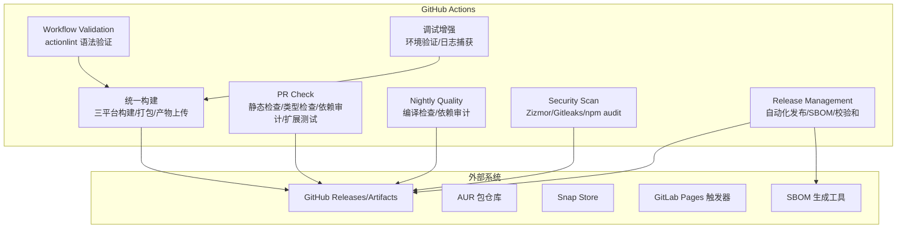

**图示来源**
- [build.yml:1-330](file://.github/workflows/build.yml#L1-L330)
- [pr-check.yml:1-79](file://.github/workflows/pr-check.yml#L1-L79)
- [nightly.yml:1-44](file://.github/workflows/nightly.yml#L1-L44)
- [lint-zizmor.yml:1-33](file://.github/workflows/lint-zizmor.yml#L1-L33)

**章节来源**
- [build.yml:1-330](file://.github/workflows/build.yml#L1-L330)
- [pr-check.yml:1-79](file://.github/workflows/pr-check.yml#L1-L79)
- [nightly.yml:1-44](file://.github/workflows/nightly.yml#L1-L44)
- [lint-zizmor.yml:1-33](file://.github/workflows/lint-zizmor.yml#L1-L33)

## 核心组件
- **统一构建流程**：支持 Windows x64、Linux x64、macOS arm64 三平台构建
- **工作流验证**：actionlint 语法验证确保工作流配置正确性
- **安全扫描**：npm audit high 级别漏洞扫描 + gitleaks 密钥检测
- **Pull Request 检查**：ESLint + TypeScript 编译检查、扩展单元测试、安全扫描
- **夜间质量保障**：全量编译检查、依赖审计、过时依赖报告
- **自动化发布**：三平台构建产物自动打包、校验和发布到 GitHub Releases
- **依赖更新管理**：Dependabot 每周自动更新 GitHub Actions 依赖
- **AI 辅助开发规范**：Copilot 指令约束编码标准、安全约定和测试要求
- **增强调试能力**：改进的 npm 安装失败诊断、环境验证和自动调试日志捕获

**章节来源**
- [build.yml:1-330](file://.github/workflows/build.yml#L1-L330)
- [pr-check.yml:1-79](file://.github/workflows/pr-check.yml#L1-L79)
- [nightly.yml:1-44](file://.github/workflows/nightly.yml#L1-L44)
- [lint-zizmor.yml:1-33](file://.github/workflows/lint-zizmor.yml#L1-L33)
- [dependabot.yml:1-10](file://.github/dependabot.yml#L1-L10)
- [copilot-instructions.md:1-88](file://.github/copilot-instructions.md#L1-L88)

## 架构总览
下图展示从代码提交到发布的端到端流程，包括 PR 门禁、工作流验证、统一构建、制品归档、安全扫描、依赖治理和自动化发布。

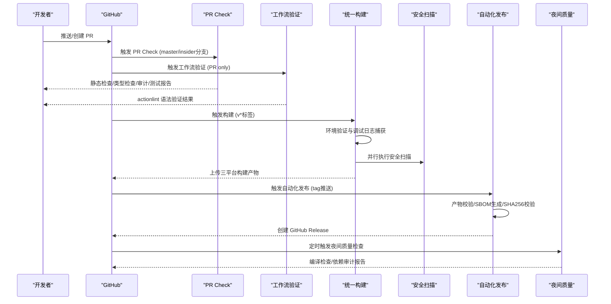

**图示来源**
- [pr-check.yml:3-11](file://.github/workflows/pr-check.yml#L3-L11)
- [build.yml:21-35](file://.github/workflows/build.yml#L21-L35)
- [build.yml:38-49](file://.github/workflows/build.yml#L38-L49)
- [build.yml:50-80](file://.github/workflows/build.yml#L50-L80)
- [build.yml:216-330](file://.github/workflows/build.yml#L216-L330)
- [nightly.yml:3-6](file://.github/workflows/nightly.yml#L3-L6)

## 详细组件分析

### Pull Request 检查流程
**更新** 依赖安装已从 npm ci 更改为 npm install --no-audit --no-fund，解决了 package-lock.json 与 package.json overrides 不同步导致的构建失败问题

- 触发条件：对 master、insider 分支的 PR 与 push
- 并发控制：同 PR 取消进行中任务，避免重复执行
- Lint 与类型检查：ESLint + TypeScript 编译检查
- 依赖审计：npm audit（仅 critical 严重级别告警）
- 扩展单元测试：针对 kodrix-agent-os、kodrix-local、kodrix-skills 并行执行
- 安全扫描：npm audit critical + gitleaks 密钥扫描

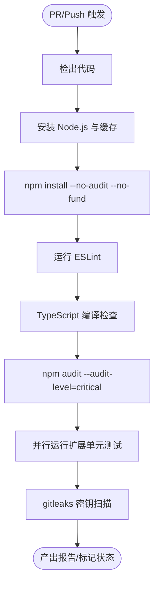

**图示来源**
- [pr-check.yml:1-79](file://.github/workflows/pr-check.yml#L1-L79)

**章节来源**
- [pr-check.yml:1-79](file://.github/workflows/pr-check.yml#L1-L79)

### 工作流验证（Validate Workflow）
**新增** 在 PR 检查中集成了 actionlint 语法验证，确保 GitHub Actions 工作流配置的正确性和最佳实践

- 触发条件：仅在 PR 事件中执行
- 验证工具：actionlint 用于检查工作流 YAML 语法
- 验证范围：重点检查 build.yml 工作流文件
- 错误处理：发现语法错误时立即阻断 PR 合并

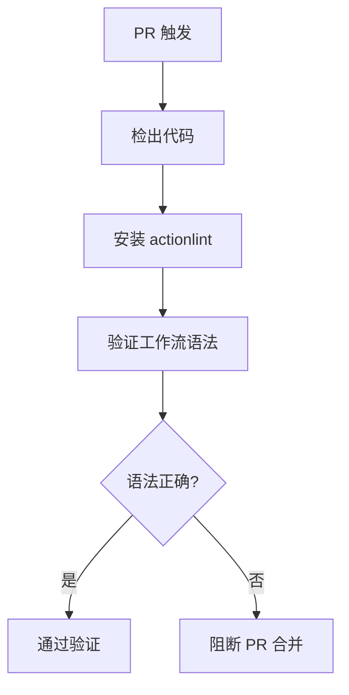

**图示来源**
- [build.yml:38-49](file://.github/workflows/build.yml#L38-L49)

**章节来源**
- [build.yml:38-49](file://.github/workflows/build.yml#L38-L49)

### 安全扫描（Security Scan）
**新增** 独立的 security-scan 作业，提供更全面的安全保障

- 触发条件：仅在 PR 事件中执行
- 依赖漏洞扫描：npm audit --audit-level=high 检测高危漏洞
- 密钥泄露检测：gitleaks 扫描代码中的敏感信息
- 审计报告：生成详细的漏洞报告供审查
- 权限最小化：使用 GITHUB_TOKEN 进行安全扫描

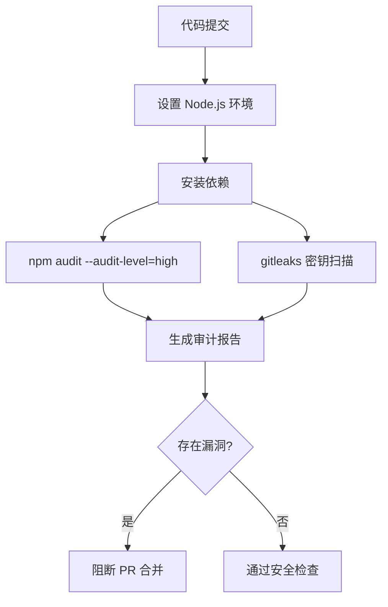

**图示来源**
- [build.yml:50-80](file://.github/workflows/build.yml#L50-L80)

**章节来源**
- [build.yml:50-80](file://.github/workflows/build.yml#L50-L80)

### 统一构建流程（三平台）
**更新** 替代了原有的多个独立构建文件，现在通过单一 build.yml 文件处理所有平台的构建。依赖安装已优化为使用 npm install 而非 npm ci，以确保更好的兼容性和稳定性。新增了增强的调试功能，包括环境验证和自动调试日志捕获。

- **Windows x64**：windows-2022 环境，构建 vscode-win32-x64-min
- **Linux x64**：ubuntu-22.04 环境，构建 vscode-linux-x64-min  
- **macOS arm64**：macos-14 环境，构建 vscode-darwin-arm64-min
- 产物格式：tar.gz 压缩包，包含完整可执行程序
- 构建优化：跳过 Node 版本检查、Playwright 浏览器下载、代码签名等耗时步骤
- **依赖安装优化**：使用 npm install --no-audit --no-fund 替代 npm ci，解决 overrides 同步问题
- **增强调试功能**：环境验证、npm 安装失败时的自动调试日志捕获

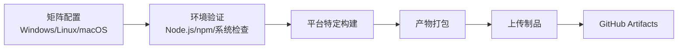

**图示来源**
- [build.yml:82-113](file://.github/workflows/build.yml#L82-L113)
- [build.yml:152-163](file://.github/workflows/build.yml#L152-L163)
- [build.yml:168-214](file://.github/workflows/build.yml#L168-L214)

**章节来源**
- [build.yml:1-330](file://.github/workflows/build.yml#L1-L330)

### 自动化发布管理（Release）
**新增** 完整的自动化发布流程，支持三平台构建产物的自动打包、校验和发布

- **触发条件**：当推送 v* 标签时自动触发
- **产物收集**：下载所有平台的构建产物
- **完整性验证**：验证必需文件存在性（SHA256SUMS.txt、BUILD_REPORT.json）
- **SBOM 生成**：为每个平台生成软件物料清单
- **校验和计算**：生成 SHA256 校验和文件
- **GitHub Release 创建**：自动创建带发布说明的 Release
- **通知机制**：成功发布后输出 Release URL

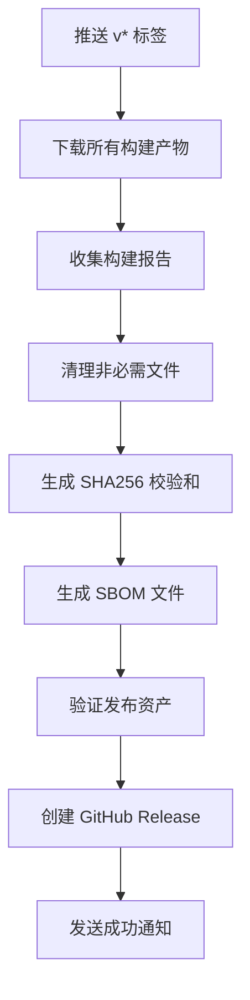

**图示来源**
- [build.yml:216-330](file://.github/workflows/build.yml#L216-L330)

**章节来源**
- [build.yml:216-330](file://.github/workflows/build.yml#L216-L330)

### 夜间质量保障
**更新** 简化了夜间任务，专注于编译检查和依赖审计，移除了完整的测试套件执行。依赖安装同样优化为使用 npm install 以提升稳定性。

- **全量编译检查**：执行 gulp compile-build-with-mangling 确保完整构建
- **依赖审计**：npm audit critical 级别安全扫描
- **过时依赖报告**：npm-check-updates 生成依赖更新报告（不阻断构建）
- 调度频率：每天 UTC 04:00（北京时间 12:00）

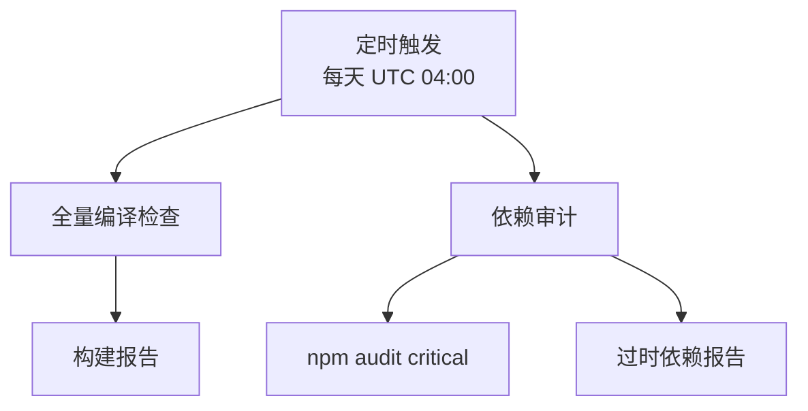

**图示来源**
- [nightly.yml:3-44](file://.github/workflows/nightly.yml#L3-L44)

**章节来源**
- [nightly.yml:1-44](file://.github/workflows/nightly.yml#L1-L44)

### 安全扫描与合规检查
**更新** 集成了多种安全扫描工具，提供更全面的安全保障。依赖安装已优化为使用 npm install 以避免潜在的锁定文件冲突。

- **Zizmor 工作流安全检查**：检测 GitHub Actions 工作流中的安全问题
- **Gitleaks 密钥扫描**：检测代码中的敏感信息和硬编码密钥
- **npm audit critical**：仅报告 critical 级别的依赖漏洞
- 权限最小化：zizmor 工作流使用空权限集合

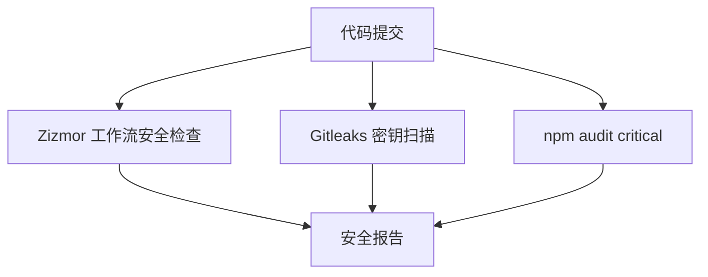

**图示来源**
- [lint-zizmor.yml:18-33](file://.github/workflows/lint-zizmor.yml#L18-L33)
- [pr-check.yml:59-79](file://.github/workflows/pr-check.yml#L59-L79)

**章节来源**
- [lint-zizmor.yml:1-33](file://.github/workflows/lint-zizmor.yml#L1-L33)
- [pr-check.yml:59-79](file://.github/workflows/pr-check.yml#L59-L79)

### 依赖更新管理（Dependabot）
- 监控范围：GitHub Actions 依赖
- 目标分支：insider
- 调度频率：每周一次
- 冷却期：默认 7 天，降低频繁 PR 噪音

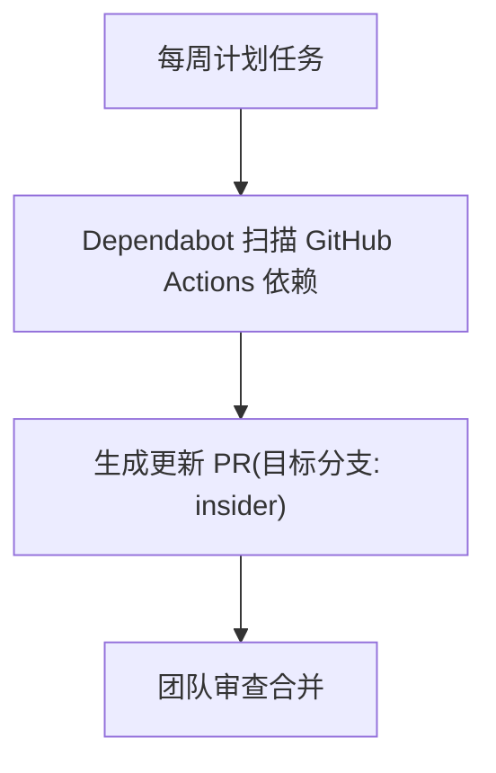

**图示来源**
- [dependabot.yml:1-10](file://.github/dependabot.yml#L1-L10)

**章节来源**
- [dependabot.yml:1-10](file://.github/dependabot.yml#L1-L10)

### 代码审查辅助（Copilot 指令与规则）
- 编码规范：TypeScript strict、禁止 any、import type、禁用 console.log/warn、异步 I/O、资源释放
- 安全约定：路径遍历防护、命令注入防护、网络请求超时与大小限制、禁止硬编码密钥
- 测试要求：新增模块需单元测试；扩展集成测试位于指定目录；提交前运行扩展测试
- 验证清单：ESLint 零警告、编译通过、disposables 注册、无同步 I/O、计时器清理、命令文档化、配置变更反映在 package.json

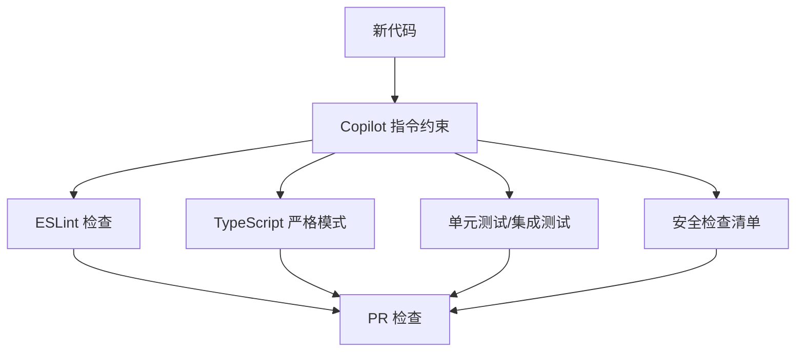

**图示来源**
- [copilot-instructions.md:31-88](file://.github/copilot-instructions.md#L31-L88)
- [pr-check.yml:18-33](file://.github/workflows/pr-check.yml#L18-L33)

**章节来源**
- [copilot-instructions.md:1-88](file://.github/copilot-instructions.md#L1-L88)
- [pr-check.yml:18-33](file://.github/workflows/pr-check.yml#L18-L33)

### 增强调试功能
**新增** 在构建流程中添加了强大的调试功能，显著提升了问题诊断效率：

- **环境验证**：在安装依赖前检查 Node.js、npm 和系统环境
- **智能错误处理**：当 npm install 失败时，自动捕获并显示最新的 npm 调试日志
- **调试日志捕获**：自动查找并输出 ~/.npm/_logs/ 目录中最新的 debug.log 文件的最后 300 行
- **磁盘空间检查**：构建前后检查磁盘使用情况，帮助识别存储空间不足问题

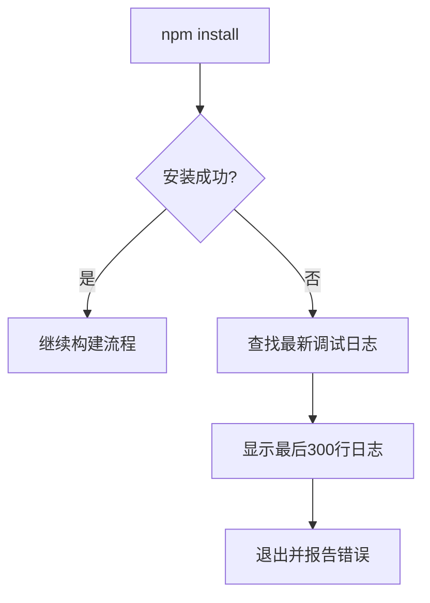

**图示来源**
- [build.yml:152-163](file://.github/workflows/build.yml#L152-L163)

**章节来源**
- [build.yml:152-163](file://.github/workflows/build.yml#L152-L163)

## 依赖分析
- 工作流耦合关系
  - PR Check 与 Nightly 均依赖 npm 脚本与 Node 环境
  - 统一构建工作流依赖工具链（GCC/Node/Python）与中间产物
  - 安全扫描工作流独立运行，提供额外的安全保障
  - 工作流验证和安全扫描作为 PR 检查的前置条件
  - 自动化发布依赖于成功的构建流程
- 外部依赖
  - GitHub Releases/Artifacts
  - Dependabot 依赖更新服务
  - Gitleaks 安全扫描服务
  - Zizmor 工作流安全检查服务
  - actionlint 工作流语法验证工具
  - SBOM 生成工具

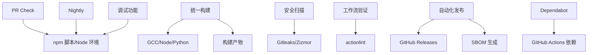

**图示来源**
- [pr-check.yml:1-79](file://.github/workflows/pr-check.yml#L1-L79)
- [nightly.yml:1-44](file://.github/workflows/nightly.yml#L1-L44)
- [build.yml:1-330](file://.github/workflows/build.yml#L1-L330)
- [lint-zizmor.yml:1-33](file://.github/workflows/lint-zizmor.yml#L1-L33)
- [dependabot.yml:1-10](file://.github/dependabot.yml#L1-L10)

**章节来源**
- [pr-check.yml:1-79](file://.github/workflows/pr-check.yml#L1-L79)
- [nightly.yml:1-44](file://.github/workflows/nightly.yml#L1-L44)
- [build.yml:1-330](file://.github/workflows/build.yml#L1-L330)
- [lint-zizmor.yml:1-33](file://.github/workflows/lint-zizmor.yml#L1-L33)
- [dependabot.yml:1-10](file://.github/dependabot.yml#L1-L10)

## 性能与可维护性
- **并发与取消**：PR Check 启用 concurrency 取消进行中任务，减少资源浪费
- **矩阵构建**：三平台矩阵构建提升覆盖率，但会增加构建时长
- **缓存策略**：Node 依赖缓存加速安装，基于 package-lock.json 的 hash 自动失效
- **失败容忍**：部分审计步骤设置 continue-on-error，避免阻塞关键流程
- **环境变量控制**：通过环境变量控制构建优化选项（如跳过代码签名、浏览器下载等）
- **依赖安装优化**：使用 npm install 替代 npm ci 提升了构建稳定性，避免了 package-lock.json 与 overrides 不同步的问题
- **增强调试能力**：改进的错误诊断和日志捕获功能显著提升了问题排查效率
- **权限最小化**：各作业使用最小必要权限，提高安全性
- **工件标准化**：统一的产物命名规范（Kodrix-*），便于管理和分发

**优化建议**
- 利用统一构建流程的优势，进一步优化各平台构建时间
- 引入增量构建与缓存分层（如 Rust/Python 依赖缓存）
- 对长尾任务增加重试与超时保护
- 统一日志格式与结构化输出，便于检索与分析
- 考虑定期同步 package-lock.json 与 package.json overrides 以减少未来冲突
- 利用增强的调试功能快速定位环境问题
- 优化 SBOM 生成性能，考虑并行处理
- 建立构建产物版本追踪和回滚机制

## 故障排除指南
- **PR Check 失败**
  - ESLint 报错：根据错误提示修复代码风格问题，确保零警告
  - TypeScript 编译失败：检查类型定义与 import type 的使用
  - npm audit critical：评估风险或升级依赖
  - 扩展单元测试失败：查看对应扩展的测试结果工件
  - gitleaks 发现密钥：移除硬编码密钥，改用 secrets 管理
  - **依赖安装失败**：检查 package.json overrides 配置是否与 package-lock.json 同步
  - **工作流验证失败**：检查 GitHub Actions 工作流 YAML 语法，使用 actionlint 本地验证
- **构建失败**
  - 工具链缺失：确认 GCC/Node/Python 版本与环境
  - 依赖安装失败：检查网络代理与镜像源，确认使用 npm install 而非 npm ci
  - **npm 安装错误诊断**：查看自动捕获的调试日志，重点关注最后 300 行的错误信息
  - **环境验证失败**：检查 Node.js 版本、npm 版本和系统依赖
  - 多架构构建失败：确认容器镜像与架构匹配
  - 产物上传失败：检查权限与存储空间
  - **发布失败**：检查构建产物完整性，确认三平台产物都存在
- **夜间任务失败**
  - 编译检查失败：检查 gulp 任务配置与依赖
  - 依赖审计失败：评估 critical 级别漏洞风险
  - 过时依赖报告：根据报告更新依赖版本
- **安全扫描失败**
  - npm audit high：评估高危漏洞风险，及时升级依赖
  - gitleaks 误报：调整 .gitleaks.toml 配置文件排除误报
  - **工作流验证失败**：修复 GitHub Actions 工作流语法错误

**排查要点**
- 查看工作流日志中的 step 输出与错误堆栈
- 检查环境变量与 secrets 是否正确注入
- 使用本地复现脚本（scripts/test-*.sh）缩小问题范围
- 关注环境变量开关对构建的影响
- **重点关注**：如果构建失败，检查是否误用了 npm ci 而不是 npm install
- **调试技巧**：利用自动捕获的 npm 调试日志快速定位安装问题
- **环境检查**：确认 Node.js、npm 和系统环境符合预期
- **发布验证**：检查生成的 SHA256SUMS.txt 和 BUILD_REPORT.json 文件完整性
- **SBOM 检查**：确认 SBOM 文件生成成功且格式正确

**章节来源**
- [pr-check.yml:18-79](file://.github/workflows/pr-check.yml#L18-L79)
- [build.yml:152-163](file://.github/workflows/build.yml#L152-L163)
- [build.yml:69-133](file://.github/workflows/build.yml#L69-L133)
- [nightly.yml:13-44](file://.github/workflows/nightly.yml#L13-L44)
- [build.yml:281-302](file://.github/workflows/build.yml#L281-L302)

## 结论
Kodrix 的 CI/CD 体系经过重大重构后，采用了更加简洁高效的统一架构。通过单一构建文件处理三平台构建、工作流验证、安全扫描和自动化发布，大幅简化了维护复杂度；PR 检查流程专注于快速反馈；夜间任务聚焦于编译检查和依赖审计；安全扫描提供了多层次的保护。**特别重要的是，新增的工作流验证、安全扫描和自动化发布功能显著提升了 CI/CD 的完整性和可靠性，通过 actionlint 语法验证、npm audit 漏洞扫描和 gitleaks 密钥检测，构建了全方位的质量保障体系。**最新的依赖安装策略优化（从 npm ci 切换到 npm install）进一步提升了构建稳定性和兼容性，有效解决了 package-lock.json 与 package.json overrides 不同步的问题。**自动化发布流程的引入实现了从构建到发布的完整闭环，支持三平台构建产物的自动打包、校验和发布，同时生成 SBOM 文件和 SHA256 校验和，确保了发布过程的可追溯性和安全性。**这种设计在保证代码质量的同时，显著提升了构建效率和可维护性。建议在保持现有稳定性的基础上，继续优化构建缓存策略，增强日志可观测性，进一步提升流水线效率。