# 构建与部署

<cite>
**本文引用的文件**
- [package.json](file://package.json)
- [product.json](file://product.json)
- [gulpfile.mjs](file://gulpfile.mjs)
- [.github/workflows/build.yml](file://.github/workflows/build.yml)
- [.github/workflows/pr-check.yml](file://.github/workflows/pr-check.yml)
- [.github/workflows/nightly.yml](file://.github/workflows/nightly.yml)
- [.nvmrc](file://.nvmrc)
- [.gitleaks.toml](file://.gitleaks.toml)
- [scripts/build-exe.ps1](file://scripts/build-exe.ps1)
</cite>

## 更新摘要
**变更内容**
- 统一三平台构建工作流：使用单一 `.github/workflows/build.yml` 替代多个平台特定工作流，支持 Windows x64、Linux x64、macOS arm64 并行构建
- 标准化制品命名约定：采用 `Kodrix-<version>-platform-arch.tar.gz` 格式（如 Kodrix-1.128.0-win32-x64.tar.gz）
- Node.js 版本管理：通过 `.nvmrc` 文件统一管理 Node.js 版本（24.17.0），所有 CI 流水线均使用该配置
- 增强安全扫描集成：在 PR 检查中集成 npm audit 和 Gitleaks 安全扫描，防止敏感信息泄露
- 现代化 CI/CD 流水线：简化了构建流程，提高了构建效率和可维护性
- **依赖管理优化**：重新组织了 package.json 中的可选依赖跟踪，将过时的依赖项移至 `_outdatedDependencies` 部分进行专门管理，移除了对 @parcel/watcher 的直接依赖以提升构建性能

## 目录
1. [简介](#简介)
2. [项目结构](#项目结构)
3. [核心组件](#核心组件)
4. [架构总览](#架构总览)
5. [详细组件分析](#详细组件分析)
6. [依赖分析](#依赖分析)
7. [性能考虑](#性能考虑)
8. [故障排除指南](#故障排除指南)
9. [结论](#结论)
10. [附录](#附录)

## 简介
本文件面向 DevOps 工程师与发布经理，系统性说明 Kodrix 的构建与部署体系。内容覆盖：
- 构建系统：Gulp + esbuild 的任务编排、TypeScript 转译、扩展与媒体资源打包、产物最小化与平台打包。
- 开发环境：快速编译、调试启动、热重载（watch）与编译加速策略。
- 生产打包：Windows EXE、macOS DMG、Linux AppImage/REH 等产物的生成流程。
- 持续集成：统一三平台 CI 流水线、自动化测试、制品归档与发布。
- 部署最佳实践：容器化、云分发与企业内部分发建议。
- 性能优化与故障排除：常见瓶颈定位与解决路径。

## 项目结构
Kodrix 采用"根级脚本 + Gulp 任务 + 平台专用脚本"的分层组织方式：
- 根级 package.json 暴露统一入口（compile/watch/minify/package 等）。
- gulpfile.mjs 作为入口转发到 build/gulpfile.ts，集中注册任务。
- .github/workflows/build.yml 提供统一的三平台构建流水线。
- scripts/ 提供 Windows 安装包构建与快速开发启动脚本。
- dev/ 提供跨平台构建包装器与补丁管理。
- .nvmrc 统一管理 Node.js 版本要求。

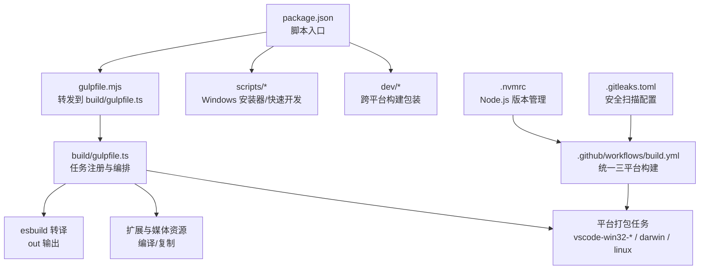

**图示来源**
- [package.json:12-89](file://package.json#L12-L89)
- [gulpfile.mjs:1-6](file://gulpfile.mjs#L1-L6)
- [.github/workflows/build.yml:1-132](file://.github/workflows/build.yml#L1-L132)
- [.nvmrc:1-2](file://.nvmrc#L1-L2)
- [.gitleaks.toml:1-46](file://.gitleaks.toml#L1-L46)

**章节来源**
- [package.json:12-89](file://package.json#L12-L89)
- [gulpfile.mjs:1-6](file://gulpfile.mjs#L1-L6)
- [.github/workflows/build.yml:1-132](file://.github/workflows/build.yml#L1-L132)

## 核心组件
- 构建编排：通过 Gulp 任务串联 TypeScript 转译、esbuild 转译、扩展编译、资源复制与最小化。
- 客户端转译：支持全量 compile 与快速 transpile（esbuild），并配合 watch 实现增量更新。
- 扩展与媒体：并行编译内置扩展与媒体资源，提升整体构建吞吐。
- 平台打包：按目标平台调用对应任务生成可分发的安装包或应用包。
- 统一 CI 流水线：单一工作流文件支持多平台并行构建，标准化制品命名。
- Node.js 版本管理：通过 .nvmrc 文件确保所有环境使用一致的 Node.js 版本。
- 安全扫描：集成 npm audit 和 Gitleaks，自动检测安全漏洞和敏感信息泄露。
- **依赖管理优化**：重新组织了可选依赖跟踪机制，将过时依赖项移至专门的 `_outdatedDependencies` 部分进行集中管理，移除了对 @parcel/watcher 的直接依赖以提升构建性能。

**章节来源**
- [build/gulpfile.ts:26-47](file://build/gulpfile.ts#L26-L47)
- [package.json:27-56](file://package.json#L27-L56)
- [.github/workflows/build.yml:27-53](file://.github/workflows/build.yml#L27-L53)
- [.nvmrc:1-2](file://.nvmrc#L1-L2)
- [.github/workflows/pr-check.yml:59-80](file://.github/workflows/pr-check.yml#L59-L80)

## 架构总览
下图展示从源码到最终产物的关键路径：开发者触发 npm 脚本 → Gulp 任务 → esbuild/TSC → 平台打包 → CI 产出制品。

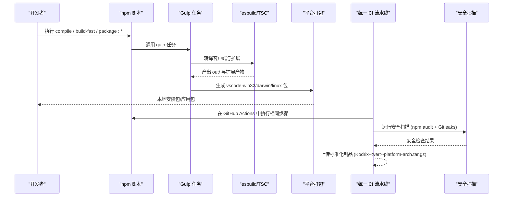

**图示来源**
- [package.json:27-89](file://package.json#L27-L89)
- [build/gulpfile.ts:26-47](file://build/gulpfile.ts#L26-L47)
- [.github/workflows/build.yml:98-132](file://.github/workflows/build.yml#L98-L132)
- [.github/workflows/pr-check.yml:59-80](file://.github/workflows/pr-check.yml#L59-L80)

## 详细组件分析

### 构建系统与任务编排（Gulp + esbuild）
- 任务入口：gulpfile.mjs 将工作委托给 build/gulpfile.ts。
- 客户端转译：
  - 全量编译：compile-client 清理 out、复制图标、生成 API 提案名与扩展点名，再执行 TSC 编译。
  - 快速转译：transpile-client-esbuild 使用 esbuild 直接转译为 out，适合开发期增量。
- 扩展与媒体：并行编译扩展与媒体资源，减少等待时间。
- Watch 模式：watch-client 监听类型检查与资源变更，配合 watch-extensions 实现热更新。

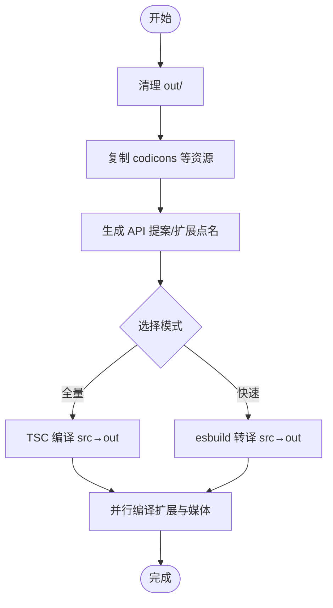

**图示来源**
- [build/gulpfile.ts:26-47](file://build/gulpfile.ts#L26-L47)

**章节来源**
- [gulpfile.mjs:1-6](file://gulpfile.mjs#L1-L6)
- [build/gulpfile.ts:26-47](file://build/gulpfile.ts#L26-L47)

### 统一三平台构建流水线（GitHub Actions）
**更新** 已采用统一的 `.github/workflows/build.yml` 替代多个平台特定工作流，支持 Windows x64、Linux x64、macOS arm64 并行构建。

- 矩阵构建：使用 strategy.matrix 定义三个平台的构建参数，包括 runner、platform、arch、gulp-task 等。
- 标准化制品命名：采用 `Kodrix-<version>-platform-arch.tar.gz` 格式，便于识别和管理。
- 环境变量管理：针对不同平台设置特定的环境变量，如 VSCODE_SKIP_SETUPENV、CSC_IDENTITY_AUTO_DISCOVERY 等。
- 依赖安装：自动处理各平台的系统依赖，如 Linux 的 libkrb5-dev 和 build-essential。

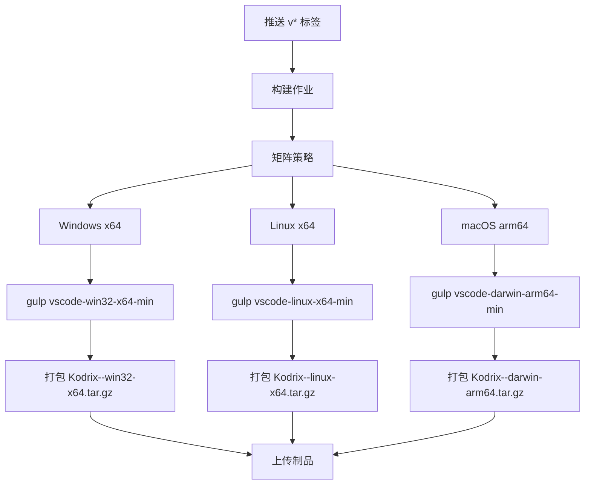

**图示来源**
- [.github/workflows/build.yml:31-53](file://.github/workflows/build.yml#L31-L53)
- [.github/workflows/build.yml:108-132](file://.github/workflows/build.yml#L108-L132)

**章节来源**
- [.github/workflows/build.yml:1-132](file://.github/workflows/build.yml#L1-L132)

### Node.js 版本管理
**新增** 通过 `.nvmrc` 文件统一管理 Node.js 版本，确保所有环境的一致性。

- 版本锁定：`.nvmrc` 文件指定 Node.js 版本为 24.17.0。
- CI 集成：所有 GitHub Actions 工作流均使用 `node-version-file: '.nvmrc'` 自动获取版本。
- 预安装校验：preinstall.ts 严格校验 Node.js 版本，确保同 major 且 ≥ .nvmrc 版本。
- 开发环境：开发者需安装匹配的 Node.js 版本以避免构建问题。

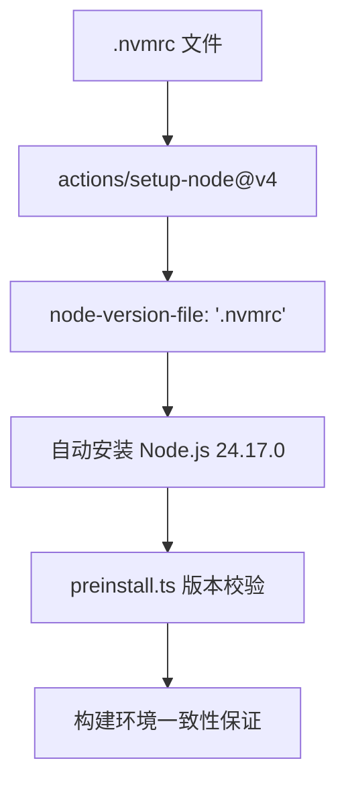

**图示来源**
- [.nvmrc:1-2](file://.nvmrc#L1-L2)
- [.github/workflows/build.yml:73-77](file://.github/workflows/build.yml#L73-L77)
- [.github/workflows/pr-check.yml:24-27](file://.github/workflows/pr-check.yml#L24-L27)

**章节来源**
- [.nvmrc:1-2](file://.nvmrc#L1-L2)
- [.github/workflows/build.yml:73-77](file://.github/workflows/build.yml#L73-L77)
- [.github/workflows/pr-check.yml:24-27](file://.github/workflows/pr-check.yml#L24-L27)

### 安全扫描与质量保证
**新增** 集成增强的安全扫描功能，在 PR 检查中自动执行安全审计。

- npm audit：检测依赖中的安全漏洞，仅报告 critical 级别问题。
- Gitleaks：扫描代码中的敏感信息泄露，如 API 密钥、内部端点等。
- 自定义规则：`.gitleaks.toml` 定义了针对 Kodrix 项目的特定安全规则。
- 白名单机制：允许构建产物、测试夹具等已知安全的路径和标识符。

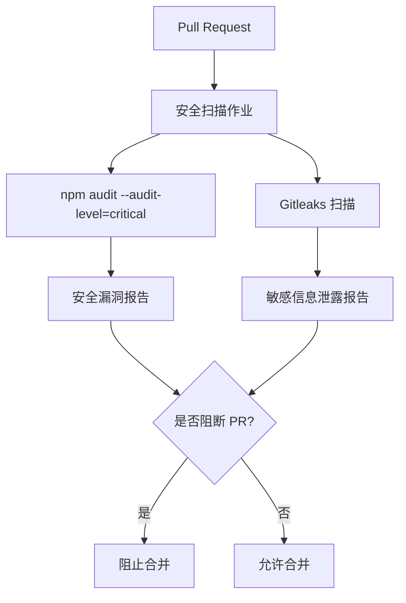

**图示来源**
- [.github/workflows/pr-check.yml:59-80](file://.github/workflows/pr-check.yml#L59-L80)
- [.gitleaks.toml:1-46](file://.gitleaks.toml#L1-L46)

**章节来源**
- [.github/workflows/pr-check.yml:59-80](file://.github/workflows/pr-check.yml#L59-L80)
- [.gitleaks.toml:1-46](file://.gitleaks.toml#L1-L46)

### 开发环境与调试（快速启动、热重载、编译加速）
- 快速启动：scripts/dev-fast.ps1 负责依赖检测、Electron 下载、增量编译（优先 esbuild）、内置扩展编译、中文语言包注入与启动。
- 热重载：通过 watch-transpile 与 watch-extensions 后台进程监听源文件变化，自动重建受影响模块。
- 编译加速：
  - 首次或强制全量时使用 compile；日常开发使用 build-fast（esbuild transpile + 扩展增量）。
  - 跳过预启动阶段以缩短冷启动时间。
  - 智能判断 out 与 src 的时间戳，避免无效重编译。

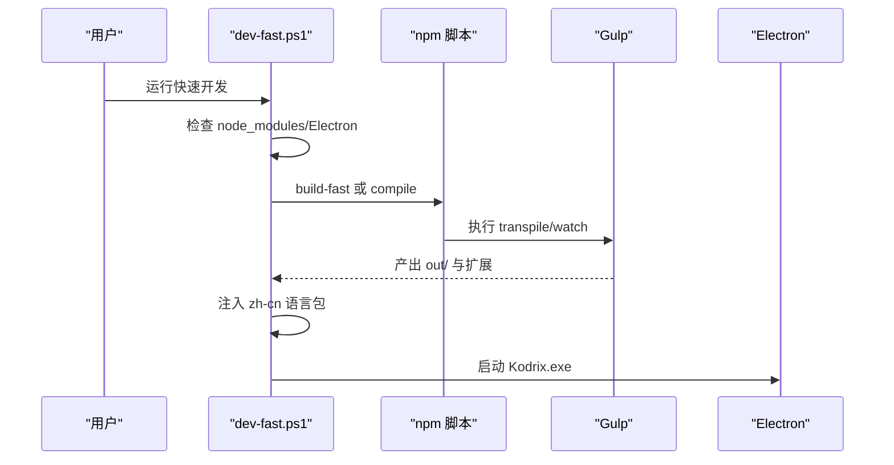

**图示来源**
- [scripts/dev-fast.ps1:105-156](file://scripts/dev-fast.ps1#L105-L156)
- [scripts/dev-fast.ps1:158-188](file://scripts/dev-fast.ps1#L158-L188)
- [package.json:27-56](file://package.json#L27-L56)

**章节来源**
- [scripts/dev-fast.ps1:105-188](file://scripts/dev-fast.ps1#L105-L188)
- [package.json:27-56](file://package.json#L27-L56)

### 产品配置与元数据管理
- 产品信息：product.json 定义了应用名称、版本、许可证等核心元数据。
- 平台特定配置：包含 Windows、macOS、Linux 的平台特定设置。
- 扩展管理：定义了内置扩展列表和扩展市场配置。
- 功能开关：通过 quality 字段控制不同版本的特性启用。

**章节来源**
- [product.json:1-800](file://product.json#L1-800)

### 生产环境打包（Windows EXE、macOS DMG、Linux AppImage/REH）
- Windows：
  - 使用 scripts/build-exe.ps1 一键构建 Inno Setup 安装包，内部调用 gulp 任务生成 vscode-win32-*-min 并准备更新工具，最终输出 KodrixSetup.exe。
  - 支持 user/system 两种安装目标与 x64/arm64 架构。
- macOS：
  - CI 通过 ./build.sh 构建并 prepare_assets.sh 生成产物，通常包含 DMG。
- Linux：
  - CI 使用 ./build/linux/package_bin.sh 与 package_reh.sh 生成二进制与 REH（远程主机）包，prepare_assets.sh 生成 AppImage 等。

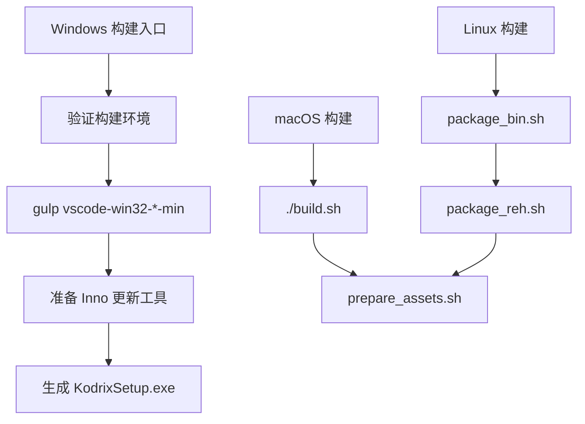

**图示来源**
- [scripts/build-exe.ps1:70-134](file://scripts/build-exe.ps1#L70-L134)
- [.github/workflows/ci-build-macos.yml:74-82](file://.github/workflows/ci-build-macos.yml#L74-L82)
- [.github/workflows/ci-build-linux.yml:176-192](file://.github/workflows/ci-build-linux.yml#L176-L192)

**章节来源**
- [scripts/build-exe.ps1:70-134](file://scripts/build-exe.ps1#L70-L134)
- [.github/workflows/ci-build-macos.yml:74-82](file://.github/workflows/ci-build-macos.yml#L74-L82)
- [.github/workflows/ci-build-linux.yml:176-192](file://.github/workflows/ci-build-linux.yml#L176-L192)

### 持续集成与发布（GitHub Actions）
**更新** 已采用统一的构建工作流，简化了 CI 流程并提高了可维护性。

- 统一构建流水线：
  - build.yml：处理版本发布，支持三平台并行构建和标准化制品命名。
  - pr-check.yml：处理 Pull Request 检查，包括 lint、类型检查和单元测试。
  - nightly.yml：每日质量检查，执行完整编译和依赖审计。
- 标准化制品命名：
  - Windows: `Kodrix-<version>-win32-x64.tar.gz`
  - Linux: `Kodrix-<version>-linux-x64.tar.gz`
  - macOS: `Kodrix-<version>-darwin-arm64.tar.gz`

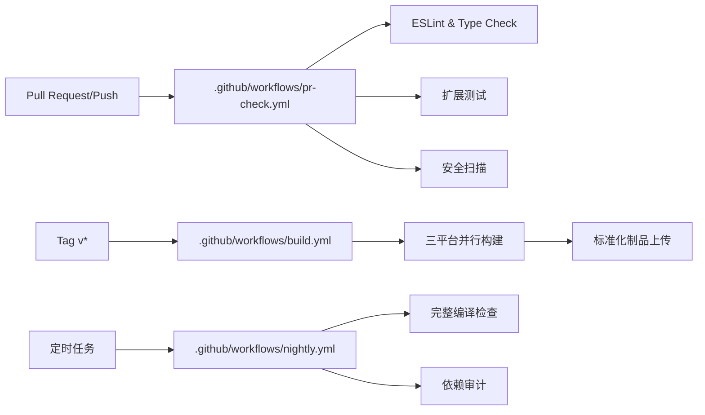

**图示来源**
- [.github/workflows/build.yml:13-17](file://.github/workflows/build.yml#L13-L17)
- [.github/workflows/pr-check.yml:3-11](file://.github/workflows/pr-check.yml#L3-L11)
- [.github/workflows/nightly.yml:3-7](file://.github/workflows/nightly.yml#L3-L7)

**章节来源**
- [.github/workflows/build.yml:1-132](file://.github/workflows/build.yml#L1-L132)
- [.github/workflows/pr-check.yml:1-79](file://.github/workflows/pr-check.yml#L1-L79)
- [.github/workflows/nightly.yml:1-44](file://.github/workflows/nightly.yml#L1-L44)

### 依赖管理与维护优化
**新增** 重新组织了 package.json 中的依赖管理机制，特别关注可选依赖的跟踪和维护，移除了对 @parcel/watcher 的直接依赖以提升构建性能。

- **可选依赖优化**：
  - 将 `windows-foreground-love` 等可选依赖明确分类到 `optionalDependencies` 部分。
  - 移除了不必要的可选依赖声明，简化依赖树结构。
  - **移除 @parcel/watcher 依赖**：移除了对 @parcel/watcher 的直接依赖，减少了原生模块编译开销，提升了构建性能。
- **过时依赖管理**：
  - 引入 `_outdatedDependencies` 字段专门跟踪过时依赖项。
  - 详细记录了每个过时依赖的升级建议和迁移注意事项。
  - 包含 husky、rimraf、glob、event-stream 等依赖的版本状态和升级计划。
- **依赖安全加固**：
  - 使用 overrides 字段强制指定关键依赖的安全版本。
  - 对存在安全风险的依赖（如 event-stream）进行版本锁定。
  - 定期通过 npm audit 检查依赖安全性。

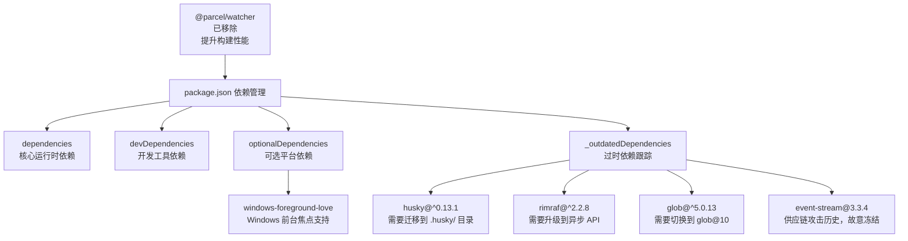

**图示来源**
- [package.json:288-296](file://package.json#L288-L296)
- [package.json:117](file://package.json#L117)

**章节来源**
- [package.json:288-296](file://package.json#L288-L296)
- [package.json:117](file://package.json#L117)

### 构建性能优化
- 开发期：
  - 优先使用 build-fast（esbuild transpile）而非全量 compile，显著降低首建与增量时间。
  - 启用 watch-transpile 与 watch-extensions，实现秒级热更新。
  - 跳过 preLaunch 阶段以减少启动开销。
- 生产期：
  - 使用最小化任务（minify-vscode/reh/reh-web）压缩体积。
  - 并行编译扩展与媒体资源，提升吞吐。
  - 利用缓存（node_modules、Electron 二进制）减少重复下载与编译。
- CI 优化：
  - 使用 matrix 策略并行构建多平台，提高整体效率。
  - 合理设置超时时间和并发控制，避免资源浪费。
- **依赖管理性能**：
  - 精简可选依赖声明，减少安装时间。
  - 系统化的过时依赖跟踪，避免累积技术债务。
  - **移除 @parcel/watcher 依赖**：消除了原生模块编译开销，显著提升构建速度。

**章节来源**
- [scripts/dev-fast.ps1:130-156](file://scripts/dev-fast.ps1#L130-L156)
- [package.json:27-56](file://package.json#L27-L56)
- [.github/workflows/build.yml:31-53](file://.github/workflows/build.yml#L31-L53)

## 依赖分析
- 构建依赖：
  - Gulp 任务编排与插件生态。
  - esbuild 用于快速转译。
  - TypeScript 与类型检查工具。
  - 平台工具链（Inno Setup、GCC、Python、Node.js）。
- 运行时依赖：
  - Electron 作为桌面宿主。
  - 内置扩展与媒体资源。
  - 平台特定原生模块（如 SSH、终端等）。
- **依赖管理改进**：
  - 优化的可选依赖分类，提高依赖树的清晰度。
  - 系统的过时依赖跟踪机制，便于维护和升级规划。
  - 增强的依赖安全控制，通过 overrides 和版本锁定确保安全。
  - **移除 @parcel/watcher 依赖**：减少了原生模块编译开销，提升了构建性能和稳定性。

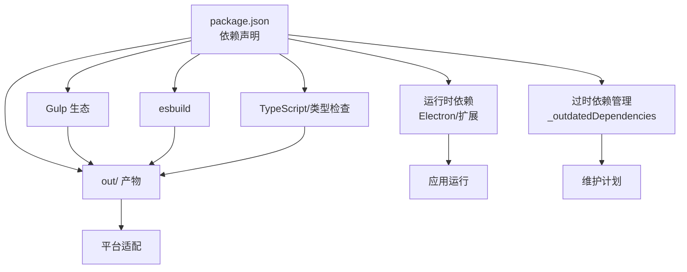

**图示来源**
- [package.json:101-296](file://package.json#L101-L296)

**章节来源**
- [package.json:101-296](file://package.json#L101-L296)

## 性能考虑
- 构建速度：
  - 使用 esbuild 替代 TSC 进行开发期转译，显著提升增量构建速度。
  - 并行任务：扩展与媒体资源编译并行执行。
  - 缓存策略：复用 node_modules 与 Electron 二进制，避免重复下载。
- 产物体积：
  - 生产构建启用最小化任务，减少包体大小。
  - 仅包含必要扩展与资源，避免冗余。
- 内存与稳定性：
  - 适当提高 Node.js 内存限制（如 --max-old-space-size）。
  - 监控长时间构建任务的失败率与超时配置。
- CI 性能：
  - 使用 matrix 策略并行构建，充分利用 GitHub Actions 资源。
  - 合理设置超时时间，避免长时间占用构建队列。
- **依赖管理性能**：
  - 精简可选依赖声明，减少安装时间。
  - 系统化的过时依赖跟踪，避免累积技术债务。
  - **移除 @parcel/watcher 依赖**：消除了原生模块编译开销，显著提升构建速度和稳定性。

## 故障排除指南
- 构建环境缺失：
  - Windows：确保 Inno Setup 与 Visual Studio 构建工具可用；若缺少 inno_updater.exe/vcruntime140.dll，自动更新功能可能受限。
  - Linux/macOS：确保 GCC、Python、Node.js 版本匹配，必要时安装 libkrb5-dev 等系统库。
- 依赖问题：
  - 首次构建较慢属正常，尤其是扩展的 esbuild 并行编译。
  - 若 node_modules 损坏，删除后重新 npm install。
  - **依赖管理问题**：检查 `_outdatedDependencies` 中的过时依赖，按照建议进行升级。
  - **@parcel/watcher 相关问题**：如果构建过程中出现原生模块相关错误，确认已成功移除 @parcel/watcher 依赖。
- 启动失败：
  - 确认 Electron 已正确下载到 .build/electron。
  - 检查 Node.js 版本是否符合 .nvmrc。
  - 若 out/main.js 过期，执行 full compile 或使用 debug-rebuild.bat。
- CI 失败：
  - 检查矩阵任务是否被禁用变量控制。
  - 确认 artifacts 名称与路径一致，确保上传成功。
  - 查看安全扫描结果，修复 npm audit 和 Gitleaks 报告的漏洞。
- Node.js 版本问题：
  - 确保本地安装的 Node.js 版本与 .nvmrc 一致（24.17.0）。
  - 使用 nvm 或其他版本管理工具切换正确的 Node.js 版本。
- 安全扫描失败：
  - 检查 .gitleaks.toml 配置是否正确。
  - 修复发现的敏感信息泄露问题。
  - 更新有安全漏洞的依赖包。
- **依赖维护问题**：
  - 定期检查 `_outdatedDependencies` 中的过时依赖。
  - 按照 TODO 注释中的建议进行依赖升级。
  - 注意 event-stream 等依赖的安全风险，保持版本锁定。
  - **构建性能问题**：确认 @parcel/watcher 依赖已被移除，避免原生模块编译导致的性能问题。

**章节来源**
- [scripts/build-exe.ps1:101-111](file://scripts/build-exe.ps1#L101-L111)
- [scripts/dev-fast.ps1:119-128](file://scripts/dev-fast.ps1#L119-L128)
- [.github/workflows/build.yml:136-192](file://.github/workflows/build.yml#L136-L192)
- [.github/workflows/pr-check.yml:59-80](file://.github/workflows/pr-check.yml#L59-L80)
- [package.json:291-296](file://package.json#L291-L296)
- [package.json:117](file://package.json#L117)

## 结论
Kodrix 的构建与部署体系以 Gulp 为核心编排，结合 esbuild 实现高效开发体验，并通过现代化的统一 CI 流水线完成多端打包与发布。新的统一三平台构建工作流、标准化的制品命名约定、严格的 Node.js 版本管理和增强的安全扫描功能，进一步提升了构建效率、可维护性和安全性。**最新的依赖管理优化**通过重新组织可选依赖跟踪、引入系统的过时依赖管理机制，以及移除 @parcel/watcher 依赖来提升构建性能，为项目的长期维护奠定了坚实基础。遵循本文档的流程与最佳实践，可稳定地实现从代码到产品的端到端交付。

## 附录
- 常用命令参考：
  - 开发：npm run build-fast、npm run watch、npm run watch-transpile
  - 构建：npm run compile、npm run minify-vscode
  - 打包：npm run package:win32、CI 中的平台打包任务
  - 测试：npm run test-node、npm run test-extension
- 环境变量：
  - VSCODE_ARCH、VSCODE_QUALITY、DISABLE_UPDATE 等由 CI 与构建脚本设置，影响构建行为与产物命名。
- Node.js 版本管理：
  - 通过 .nvmrc 文件统一管理 Node.js 版本（24.17.0）
  - 所有 CI 流水线均使用 node-version-file: '.nvmrc'
  - 预安装脚本严格校验 Node.js 版本兼容性
- 安全扫描配置：
  - npm audit 用于检测依赖安全漏洞
  - Gitleaks 用于检测敏感信息泄露
  - 自定义规则配置文件 .gitleaks.toml
- 制品命名规范：
  - 格式：Kodrix-<version>-platform-arch.tar.gz
  - 示例：Kodrix-1.128.0-win32-x64.tar.gz
  - 支持平台：win32、linux、darwin
  - 支持架构：x64、arm64
- **依赖管理最佳实践**：
  - 定期检查 `_outdatedDependencies` 中的过时依赖
  - 按照 TODO 注释中的建议进行依赖升级
  - 使用 overrides 字段强制指定安全版本
  - 保持 event-stream 等高风险依赖的版本锁定
  - 优化可选依赖声明，减少不必要的依赖安装
  - **移除 @parcel/watcher 依赖**：避免原生模块编译开销，提升构建性能