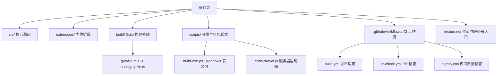
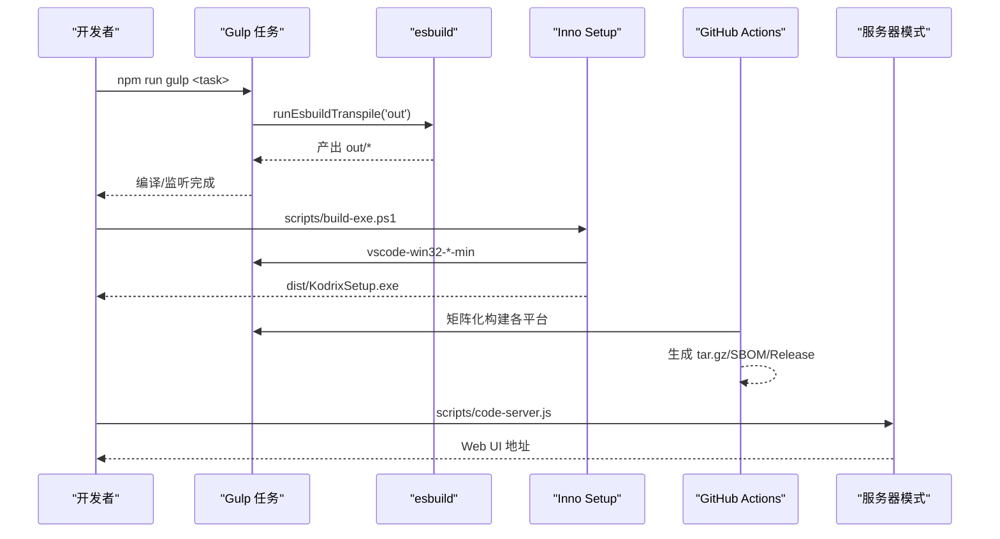
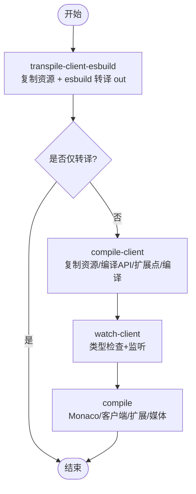
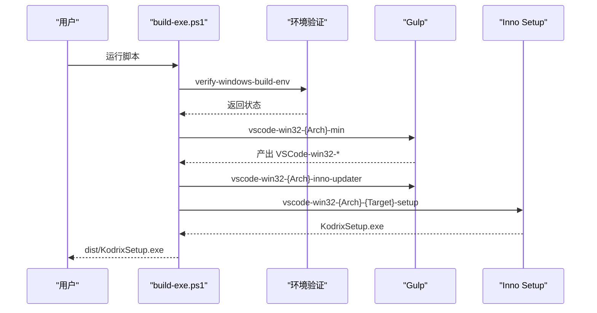
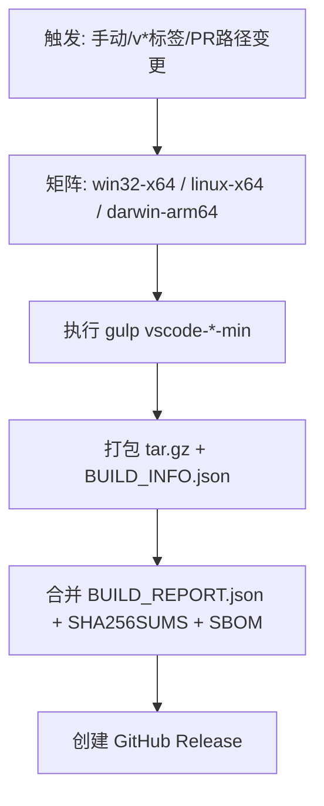
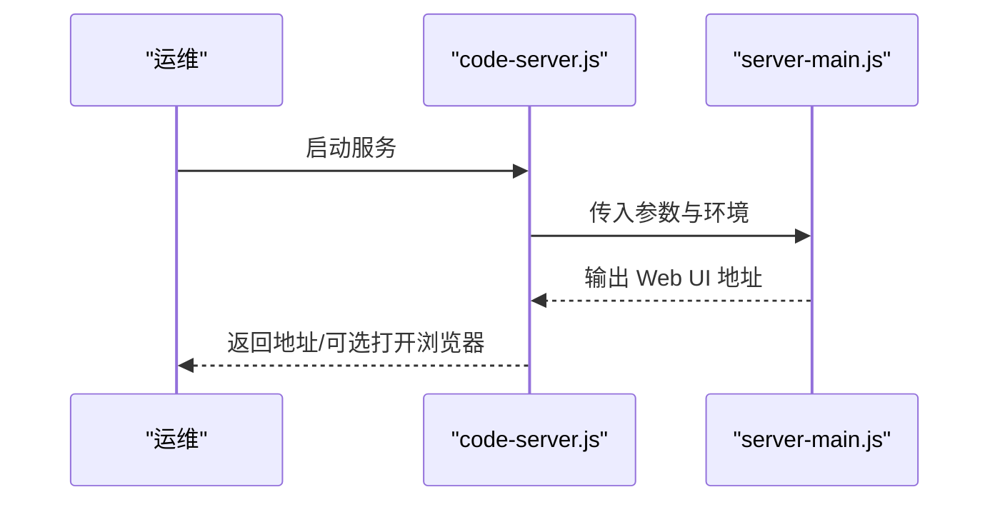
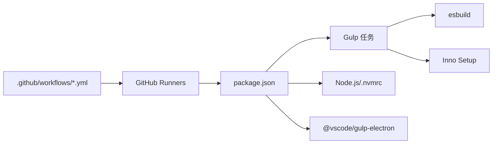

# 构建与部署

<cite>
**本文引用的文件**
- [README.md](file://README.md)
- [package.json](file://package.json)
- [gulpfile.mjs](file://gulpfile.mjs)
- [build/gulpfile.ts](file://build/gulpfile.ts)
- [.github/workflows/build.yml](file://.github/workflows/build.yml)
- [.github/workflows/pr-check.yml](file://.github/workflows/pr-check.yml)
- [.github/workflows/nightly.yml](file://.github/workflows/nightly.yml)
- [scripts/build-exe.ps1](file://scripts/build-exe.ps1)
- [scripts/code-server.js](file://scripts/code-server.js)
</cite>

## 目录
1. [简介](#简介)
2. [项目结构](#项目结构)
3. [核心组件](#核心组件)
4. [架构总览](#架构总览)
5. [详细组件分析](#详细组件分析)
6. [依赖关系分析](#依赖关系分析)
7. [性能考虑](#性能考虑)
8. [故障排除指南](#故障排除指南)
9. [结论](#结论)
10. [附录](#附录)

## 简介
本文件面向企业用户，提供 KodrixCode 的完整构建与部署方案。内容覆盖：
- 构建系统（Gulp + esbuild）工作原理与自定义任务
- Windows EXE 打包流程与跨平台构建配置
- CI/CD 流水线设置（PR 检查、夜间构建、发布）
- 服务器模式部署方式、远程会话管理、安全配置建议
- 性能优化、监控日志配置与排障指南

KodrixCode 基于 VS Code/VSCodium 构建体系，使用 Gulp 编排任务、esbuild 进行快速转译与打包，并通过 GitHub Actions 实现三平台产物构建与发布。

## 项目结构
仓库根目录包含源码、扩展、构建脚本、补丁、测试与文档等。构建系统入口位于 build 目录，通过 gulpfile.mjs 转发到 build/gulpfile.ts，统一注册编译、监听、扩展构建等任务。CI 工作流位于 .github/workflows，涵盖 PR 检查、夜间质量检查与发布构建。Windows 安装包由 scripts/build-exe.ps1 驱动 Inno Setup 完成最终打包。

**章节来源**
- [README.md:69-85](file://README.md#L69-L85)
- [gulpfile.mjs:1-6](file://gulpfile.mjs#L1-L6)
- [build/gulpfile.ts:1-62](file://build/gulpfile.ts#L1-L62)

## 核心组件
- 构建系统
  - Gulp 任务编排：注册 transpile-client、compile-client、watch-client、compile 等任务，并调用 esbuild 进行转译。
  - esbuild 集成：通过 runEsbuildTranspile('out', false) 执行 out 目录的快速转译，支持开发时增量构建。
- 包管理与脚本
  - package.json 定义 Node/Node/npm 版本要求与常用脚本（如 compile、watch、package:win32）。
  - preinstall/postinstall 钩子用于环境校验与依赖安装。
- Windows 安装包
  - scripts/build-exe.ps1 负责验证环境、执行 gulp vscode-win32-*-min、准备 Inno Updater、生成安装包并复制到 dist。
- CI/CD
  - .github/workflows/build.yml 触发条件为手动或 v* 标签推送，矩阵化构建 Windows/Linux/macOS 产物，生成 tar.gz 与 SBOM，创建 Release。
  - pr-check.yml 在 PR 上执行 ESLint、TypeScript 类型检查与扩展测试。
  - nightly.yml 定时执行全量编译检查与依赖审计。
- 服务器模式
  - scripts/code-server.js 启动 out/server-main.js，设置 VSCODE_SERVER_PORT=9888，解析 Web UI 地址并可自动打开浏览器。

**章节来源**
- [build/gulpfile.ts:26-47](file://build/gulpfile.ts#L26-L47)
- [package.json:16-104](file://package.json#L16-L104)
- [scripts/build-exe.ps1:1-143](file://scripts/build-exe.ps1#L1-L143)
- [.github/workflows/build.yml:21-220](file://.github/workflows/build.yml#L21-L220)
- [.github/workflows/pr-check.yml:17-79](file://.github/workflows/pr-check.yml#L17-L79)
- [.github/workflows/nightly.yml:8-43](file://.github/workflows/nightly.yml#L8-L43)
- [scripts/code-server.js:13-72](file://scripts/code-server.js#L13-L72)

## 架构总览
下图展示从代码到可分发产物的整体流程，包括本地开发、CI 构建、Windows 安装包与服务器模式。

**图表来源**
- [build/gulpfile.ts:26-47](file://build/gulpfile.ts#L26-L47)
- [scripts/build-exe.ps1:97-143](file://scripts/build-exe.ps1#L97-L143)
- [.github/workflows/build.yml:81-220](file://.github/workflows/build.yml#L81-L220)
- [scripts/code-server.js:40-72](file://scripts/code-server.js#L40-L72)

## 详细组件分析

### 构建系统（Gulp + esbuild）
- 任务注册与组合
  - transpile-client-esbuild：复制图标资源后执行 esbuild 转译 out 目录。
  - transpile-client：清理 out 并执行 TypeScript 转译。
  - compile-client：复制资源、编译 API 提案名与扩展点名、执行编译任务。
  - watch-client：并行执行类型检查与监听任务。
  - compile：并行执行 Monaco 类型检查、客户端编译、扩展编译与媒体编译。
- 开发体验
  - 通过 watch 与 esbuild 实现热更新与快速增量编译。
  - 配合 package.json 中的 watch/watchd 脚本实现后台守护。

**图表来源**
- [build/gulpfile.ts:26-47](file://build/gulpfile.ts#L26-L47)

**章节来源**
- [build/gulpfile.ts:26-47](file://build/gulpfile.ts#L26-L47)
- [package.json:31-59](file://package.json#L31-L59)

### Windows EXE 打包流程
- 环境验证：verify-windows-build-env.ps1 检查 Visual Studio Build Tools、Python 等。
- 应用构建：执行 gulp vscode-win32-{Arch}-min，产出 VSCode-win32-* 文件夹。
- Inno Updater：准备 inno_updater.exe 与 vcruntime140.dll（若缺失会警告但继续）。
- 安装包构建：执行 gulp vscode-win32-{Arch}-{user|system}-setup，生成 KodrixSetup.exe。
- 输出：复制到 dist 目录，命名包含版本号与架构。

**图表来源**
- [scripts/build-exe.ps1:70-143](file://scripts/build-exe.ps1#L70-L143)

**章节来源**
- [scripts/build-exe.ps1:1-143](file://scripts/build-exe.ps1#L1-L143)
- [package.json:27-31](file://package.json#L27-L31)

### 跨平台构建配置（CI）
- 触发条件：workflow_dispatch 或 push v* 标签；PR 路径变更时也会触发部分检查。
- 矩阵构建：Windows x64、Linux x64、macOS arm64，分别执行对应 gulp-task。
- 环境变量：VSCODE_ARCH、npm_config_arch、VSCODE_SKIP_NODE_VERSION_CHECK、PLAYWRIGHT_SKIP_BROWSER_DOWNLOAD、VSCODE_SKIP_SETUPENV、CSC_IDENTITY_AUTO_DISCOVERY。
- 产物：tar.gz 归档与 BUILD_INFO.json，随后合并为 BUILD_REPORT.json，生成 SHA256SUMS 与 SBOM，创建 GitHub Release。

**图表来源**
- [.github/workflows/build.yml:21-220](file://.github/workflows/build.yml#L21-L220)

**章节来源**
- [.github/workflows/build.yml:21-220](file://.github/workflows/build.yml#L21-L220)

### 服务器模式部署与远程会话
- 启动方式：scripts/code-server.js 设置端口 9888，启动 out/server-main.js，解析 Web UI 地址并可选择自动打开浏览器。
- 进程管理：捕获 SIGINT/SIGTERM 以优雅退出；stdout 中匹配 Web UI 地址。
- 远程会话：结合仓库内 CLI 与 tunnels 能力（见 cli/ 目录），可实现远程连接与会话管理；生产部署建议启用反向代理与访问控制。

**图表来源**
- [scripts/code-server.js:13-72](file://scripts/code-server.js#L13-L72)

**章节来源**
- [scripts/code-server.js:13-72](file://scripts/code-server.js#L13-L72)

### 安全配置建议（服务器模式）
- 网络层
  - 使用反向代理（Nginx/Caddy）绑定内网 IP 或域名，启用 HTTPS 与强密码策略。
  - 限制端口暴露范围，仅允许可信网络访问。
- 认证与授权
  - 启用代理层的身份认证（Basic/Digest/OIDC），并结合组织策略。
  - 对敏感命令与接口进行白名单过滤（参考 patches/ 中的安全补丁实践）。
- 运行时安全
  - 最小权限原则运行服务进程，隔离文件系统与网络访问。
  - 定期扫描依赖漏洞（CI 已集成 npm audit 与 gitleaks）。

[本节为通用安全建议，不直接分析具体文件]

## 依赖关系分析
- 构建工具链
  - Gulp 作为任务编排器，esbuild 作为高性能转译器，二者协同实现快速编译与监听。
  - Inno Setup 用于 Windows 安装包封装，依赖上游提供的 inno_updater 与运行时库。
- CI 依赖
  - actions/setup-node 缓存 npm 依赖，actions/setup-python 满足 node-gyp 需求。
  - 矩阵化 runner 确保多平台一致性。
- 运行时依赖
  - Node.js 版本需匹配 .nvmrc；Electron 通过 @vscode/gulp-electron 下载至 .build/electron。
  - 扩展（如 Copilot）首次 esbuild 打包耗时较长属正常现象。

**图表来源**
- [package.json:1-12](file://package.json#L1-L12)
- [package.json:203-219](file://package.json#L203-L219)
- [.github/workflows/build.yml:132-177](file://.github/workflows/build.yml#L132-L177)

**章节来源**
- [package.json:1-12](file://package.json#L1-L12)
- [package.json:203-219](file://package.json#L203-L219)
- [.github/workflows/build.yml:132-177](file://.github/workflows/build.yml#L132-L177)

## 性能考虑
- 构建性能
  - 使用 esbuild 进行快速转译，避免全量重编译；开发时使用 watch 模式增量更新。
  - CI 中启用 npm 缓存与并行矩阵构建，缩短构建时间。
  - 首次 Copilot 扩展 esbuild 打包耗时较长，属于预期行为。
- 运行时性能
  - 服务器模式建议启用反向代理与 HTTP/2，减少握手开销。
  - 合理配置日志轮转与保留策略，避免磁盘占用过高影响性能。
- 资源利用
  - 在 CI 中设置超时与磁盘空间检查，防止资源耗尽导致失败。
  - 使用最小化构建（*-min）减少产物体积与传输成本。

[本节提供通用指导，不直接分析具体文件]

## 故障排除指南
- 构建失败
  - 检查 Node 版本是否符合 .nvmrc；必要时设置 VSCODE_SKIP_NODE_VERSION_CHECK=1。
  - Linux 构建缺少系统依赖时，按 CI 脚本安装 libkrb5-dev 与 build-essential。
  - macOS 签名失败时，设置 CSC_IDENTITY_AUTO_DISCOVERY=false 跳过签名。
- Windows 安装包问题
  - 确认 Inno Setup 6+ 已安装且 ISCC.exe 在 PATH。
  - 若 inno_updater.exe 或 vcruntime140.dll 缺失，将失去自动更新能力，需补充上游提供文件。
- 服务器模式无法访问
  - 确认端口 9888 未被占用；检查防火墙与反向代理配置。
  - 查看 code-server.js 输出的 Web UI 地址，确认服务已启动。
- 依赖与原生模块
  - 首次安装可能较慢；如遇 native 模块编译失败，检查 Python 与 Visual Studio Build Tools。
  - 使用 debug-rebuild.bat 恢复环境与重新编译。

**章节来源**
- [.github/workflows/build.yml:114-177](file://.github/workflows/build.yml#L114-L177)
- [scripts/build-exe.ps1:101-111](file://scripts/build-exe.ps1#L101-L111)
- [scripts/code-server.js:31-56](file://scripts/code-server.js#L31-L56)
- [README.md:97-104](file://README.md#L97-L104)

## 结论
KodrixCode 采用成熟的 Gulp + esbuild 构建体系，结合 GitHub Actions 实现三平台自动化构建与发布。Windows 安装包通过 Inno Setup 完成封装，服务器模式便于远程部署与协作。企业用户可基于本文档完成本地构建、CI 集成、服务器部署与安全加固，并获得性能优化与故障排除的实践指导。

[本节为总结性内容，不直接分析具体文件]

## 附录
- 常用命令
  - 开发：npm run dev:prepare、npm run compile、npm run watch
  - 打包：npm run package:win32、npm run package:win32-user、npm run package:win32-system
  - 服务器：./scripts/code-server.sh|bat [--launch]
- 关键环境变量
  - VSCODE_SERVER_PORT=9888（服务器端口）
  - VSCODE_SKIP_NODE_VERSION_CHECK=1（跳过 Node 版本检查）
  - PLAYWRIGHT_SKIP_BROWSER_DOWNLOAD=1（跳过浏览器下载）
  - VSCODE_SKIP_SETUPENV=1（Linux 跳过 setupenv）
  - CSC_IDENTITY_AUTO_DISCOVERY=false（macOS 跳过签名）

**章节来源**
- [package.json:27-31](file://package.json#L27-L31)
- [scripts/code-server.js:31-36](file://scripts/code-server.js#L31-L36)
- [.github/workflows/build.yml:114-123](file://.github/workflows/build.yml#L114-L123)