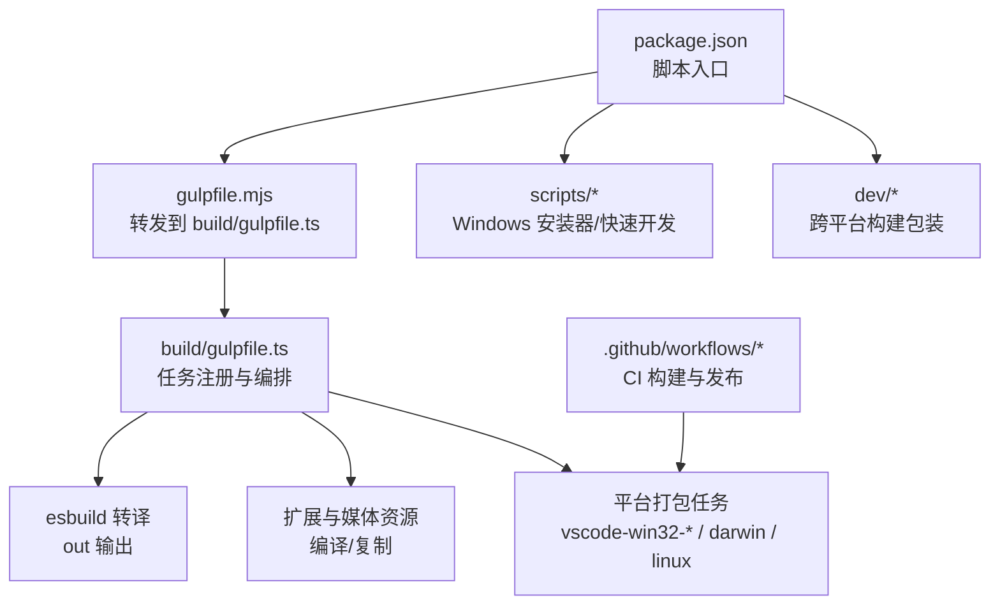
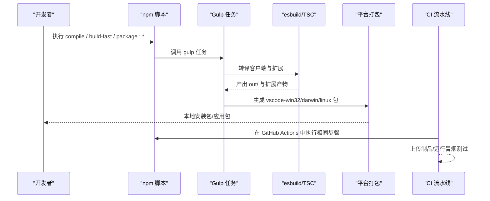
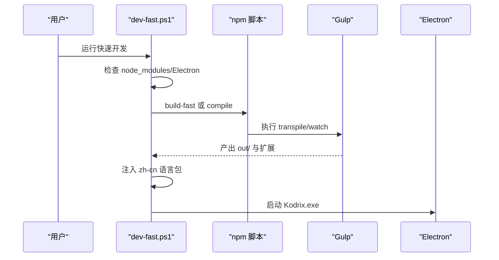
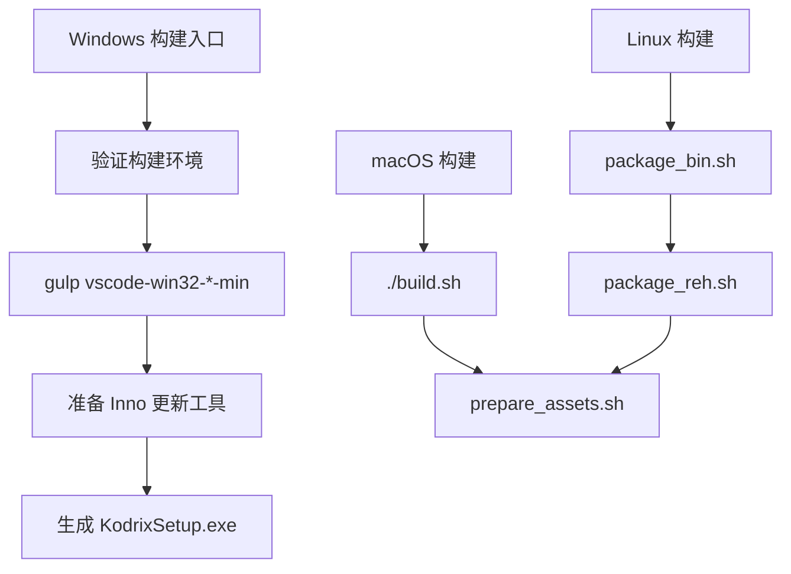
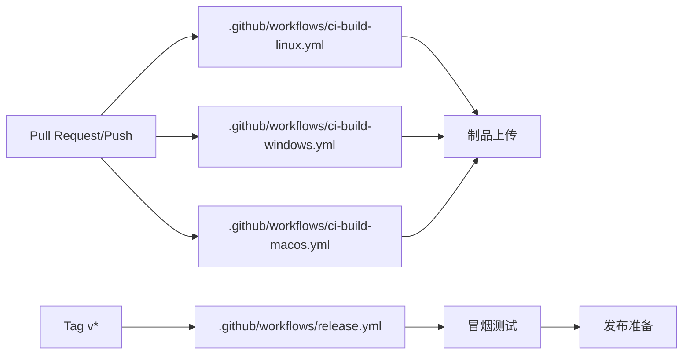
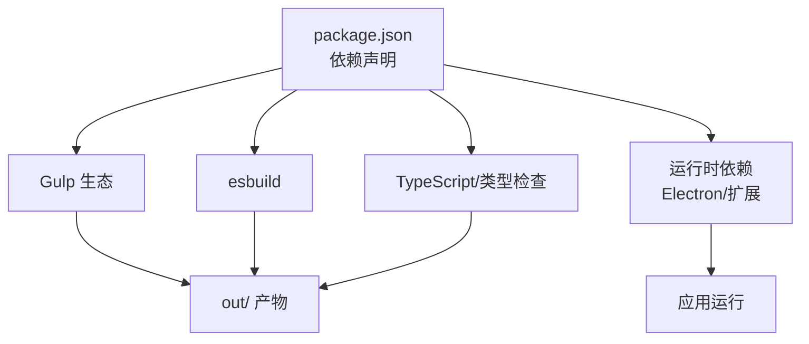

# 构建与部署

<cite>
**本文引用的文件**
- [package.json](file://package.json)
- [gulpfile.mjs](file://gulpfile.mjs)
- [build/gulpfile.ts](file://build/gulpfile.ts)
- [scripts/build-exe.ps1](file://scripts/build-exe.ps1)
- [scripts/dev-fast.ps1](file://scripts/dev-fast.ps1)
- [dev/build.sh](file://dev/build.sh)
- [dev/build.ps1](file://dev/build.ps1)
- [.github/workflows/ci-build-linux.yml](file://.github/workflows/ci-build-linux.yml)
- [.github/workflows/ci-build-windows.yml](file://.github/workflows/ci-build-windows.yml)
- [.github/workflows/ci-build-macos.yml](file://.github/workflows/ci-build-macos.yml)
- [.github/workflows/release.yml](file://.github/workflows/release.yml)
</cite>

## 目录
1. [简介](#简介)
2. [项目结构](#项目结构)
3. [核心组件](#核心组件)
4. [架构总览](#架构总览)
5. [详细组件分析](#详细组件分析)
6. [依赖分析](#依赖分析)
7. [性能考虑](#性能考虑)
8. [故障排除指南](#故障排除指南)
9. [结论](#结论)
10. [附录](#附录)

## 简介
本文件面向 DevOps 工程师与发布经理，系统性说明 Kodrix 的构建与部署体系。内容覆盖：
- 构建系统：Gulp + esbuild 的任务编排、TypeScript 转译、扩展与媒体资源打包、产物最小化与平台打包。
- 开发环境：快速编译、调试启动、热重载（watch）与编译加速策略。
- 生产打包：Windows EXE、macOS DMG、Linux AppImage/REH 等产物的生成流程。
- 持续集成：多平台 CI 流水线、自动化测试、制品归档与发布。
- 部署最佳实践：容器化、云分发与企业内部分发建议。
- 性能优化与故障排除：常见瓶颈定位与解决路径。

## 项目结构
Kodrix 采用“根级脚本 + Gulp 任务 + 平台专用脚本”的分层组织方式：
- 根级 package.json 暴露统一入口（compile/watch/minify/package 等）。
- gulpfile.mjs 作为入口转发到 build/gulpfile.ts，集中注册任务。
- build/gulpfile.ts 定义客户端转译、扩展编译、esbuild 转译、watch 等任务。
- scripts/ 提供 Windows 安装包构建与快速开发启动脚本。
- dev/ 提供跨平台构建包装器与补丁管理。
- .github/workflows/ 提供 Linux/macOS/Windows 的 CI 构建与发布流水线。

**图示来源**
- [package.json:12-89](file://package.json#L12-L89)
- [gulpfile.mjs:1-6](file://gulpfile.mjs#L1-L6)
- [build/gulpfile.ts:26-47](file://build/gulpfile.ts#L26-L47)

**章节来源**
- [package.json:12-89](file://package.json#L12-L89)
- [gulpfile.mjs:1-6](file://gulpfile.mjs#L1-L6)
- [build/gulpfile.ts:26-47](file://build/gulpfile.ts#L26-L47)

## 核心组件
- 构建编排：通过 Gulp 任务串联 TypeScript 转译、esbuild 转译、扩展编译、资源复制与最小化。
- 客户端转译：支持全量 compile 与快速 transpile（esbuild），并配合 watch 实现增量更新。
- 扩展与媒体：并行编译内置扩展与媒体资源，提升整体构建吞吐。
- 平台打包：按目标平台调用对应任务生成可分发的安装包或应用包。
- 开发体验：提供快速启动脚本，自动处理依赖、Electron 下载、增量编译与中文语言包注入。

**章节来源**
- [build/gulpfile.ts:26-47](file://build/gulpfile.ts#L26-L47)
- [package.json:27-56](file://package.json#L27-L56)
- [scripts/dev-fast.ps1:105-156](file://scripts/dev-fast.ps1#L105-L156)

## 架构总览
下图展示从源码到最终产物的关键路径：开发者触发 npm 脚本 → Gulp 任务 → esbuild/TSC → 平台打包 → CI 产出制品。

**图示来源**
- [package.json:27-89](file://package.json#L27-L89)
- [build/gulpfile.ts:26-47](file://build/gulpfile.ts#L26-L47)
- [.github/workflows/release.yml:23-27](file://.github/workflows/release.yml#L23-L27)

## 详细组件分析

### 构建系统与任务编排（Gulp + esbuild）
- 任务入口：gulpfile.mjs 将工作委托给 build/gulpfile.ts。
- 客户端转译：
  - 全量编译：compile-client 清理 out、复制图标、生成 API 提案名与扩展点名，再执行 TSC 编译。
  - 快速转译：transpile-client-esbuild 使用 esbuild 直接转译为 out，适合开发期增量。
- 扩展与媒体：并行编译扩展与媒体资源，减少等待时间。
- Watch 模式：watch-client 监听类型检查与资源变更，配合 watch-extensions 实现热更新。

**图示来源**
- [build/gulpfile.ts:26-47](file://build/gulpfile.ts#L26-L47)

**章节来源**
- [gulpfile.mjs:1-6](file://gulpfile.mjs#L1-L6)
- [build/gulpfile.ts:26-47](file://build/gulpfile.ts#L26-L47)

### 开发环境与调试（快速启动、热重载、编译加速）
- 快速启动：scripts/dev-fast.ps1 负责依赖检测、Electron 下载、增量编译（优先 esbuild）、内置扩展编译、中文语言包注入与启动。
- 热重载：通过 watch-transpile 与 watch-extensions 后台进程监听源文件变化，自动重建受影响模块。
- 编译加速：
  - 首次或强制全量时使用 compile；日常开发使用 build-fast（esbuild transpile + 扩展增量）。
  - 跳过预启动阶段以缩短冷启动时间。
  - 智能判断 out 与 src 的时间戳，避免无效重编译。

**图示来源**
- [scripts/dev-fast.ps1:105-156](file://scripts/dev-fast.ps1#L105-L156)
- [scripts/dev-fast.ps1:158-188](file://scripts/dev-fast.ps1#L158-L188)
- [package.json:27-56](file://package.json#L27-L56)

**章节来源**
- [scripts/dev-fast.ps1:105-188](file://scripts/dev-fast.ps1#L105-L188)
- [package.json:27-56](file://package.json#L27-L56)

### 生产环境打包（Windows EXE、macOS DMG、Linux AppImage/REH）
- Windows：
  - 使用 scripts/build-exe.ps1 一键构建 Inno Setup 安装包，内部调用 gulp 任务生成 vscode-win32-*-min 并准备更新工具，最终输出 KodrixSetup.exe。
  - 支持 user/system 两种安装目标与 x64/arm64 架构。
- macOS：
  - CI 通过 ./build.sh 构建并 prepare_assets.sh 生成产物，通常包含 DMG。
- Linux：
  - CI 使用 ./build/linux/package_bin.sh 与 package_reh.sh 生成二进制与 REH（远程主机）包，prepare_assets.sh 生成 AppImage 等。

**图示来源**
- [scripts/build-exe.ps1:70-134](file://scripts/build-exe.ps1#L70-L134)
- [.github/workflows/ci-build-macos.yml:74-82](file://.github/workflows/ci-build-macos.yml#L74-L82)
- [.github/workflows/ci-build-linux.yml:176-192](file://.github/workflows/ci-build-linux.yml#L176-L192)

**章节来源**
- [scripts/build-exe.ps1:70-134](file://scripts/build-exe.ps1#L70-L134)
- [.github/workflows/ci-build-macos.yml:74-82](file://.github/workflows/ci-build-macos.yml#L74-L82)
- [.github/workflows/ci-build-linux.yml:176-192](file://.github/workflows/ci-build-linux.yml#L176-L192)

### 持续集成与发布（GitHub Actions）
- 多平台 CI：
  - Linux：编译工件、多架构构建、REH/Alpine 构建、制品上传。
  - Windows：编译工件、多架构构建、MSI/EXE 产物准备。
  - macOS：双架构构建与制品准备。
- 发布流水线：
  - release.yml 在标签推送时触发，执行编译、扩展测试、平台打包与制品上传，随后进行冒烟测试与发布准备。

**图示来源**
- [.github/workflows/ci-build-linux.yml:38-100](file://.github/workflows/ci-build-linux.yml#L38-L100)
- [.github/workflows/ci-build-windows.yml:36-92](file://.github/workflows/ci-build-windows.yml#L36-L92)
- [.github/workflows/ci-build-macos.yml:36-90](file://.github/workflows/ci-build-macos.yml#L36-L90)
- [.github/workflows/release.yml:8-31](file://.github/workflows/release.yml#L8-L31)

**章节来源**
- [.github/workflows/ci-build-linux.yml:38-100](file://.github/workflows/ci-build-linux.yml#L38-L100)
- [.github/workflows/ci-build-windows.yml:36-92](file://.github/workflows/ci-build-windows.yml#L36-L92)
- [.github/workflows/ci-build-macos.yml:36-90](file://.github/workflows/ci-build-macos.yml#L36-L90)
- [.github/workflows/release.yml:8-31](file://.github/workflows/release.yml#L8-L31)

### 构建性能优化
- 开发期：
  - 优先使用 build-fast（esbuild transpile）而非全量 compile，显著降低首建与增量时间。
  - 启用 watch-transpile 与 watch-extensions，实现秒级热更新。
  - 跳过 preLaunch 阶段以减少启动开销。
- 生产期：
  - 使用最小化任务（minify-vscode/reh/reh-web）压缩体积。
  - 并行编译扩展与媒体资源，提升吞吐。
  - 利用缓存（node_modules、Electron 二进制）减少重复下载与编译。

**章节来源**
- [scripts/dev-fast.ps1:130-156](file://scripts/dev-fast.ps1#L130-L156)
- [package.json:27-56](file://package.json#L27-L56)

## 依赖分析
- 构建依赖：
  - Gulp 任务编排与插件生态。
  - esbuild 用于快速转译。
  - TypeScript 与类型检查工具。
  - 平台工具链（Inno Setup、GCC、Python、Node.js）。
- 运行时依赖：
  - Electron 作为桌面宿主。
  - 内置扩展与媒体资源。
  - 平台特定原生模块（如 SSH、终端等）。

**图示来源**
- [package.json:101-271](file://package.json#L101-L271)

**章节来源**
- [package.json:101-271](file://package.json#L101-L271)

## 性能考虑
- 构建速度：
  - 使用 esbuild 替代 TSC 进行开发期转译，显著提升增量构建速度。
  - 并行任务：扩展与媒体资源编译并行执行。
  - 缓存策略：复用 node_modules 与 Electron 二进制，避免重复下载。
- 产物体积：
  - 生产构建启用最小化任务，减少包体大小。
  - 仅包含必要扩展与资源，避免冗余。
- 内存与稳定性：
  - 适当提高 Node.js 内存限制（如 --max-old-space-size）。
  - 监控长时间构建任务的失败率与超时配置。

[本节为通用指导，不直接分析具体文件]

## 故障排除指南
- 构建环境缺失：
  - Windows：确保 Inno Setup 与 Visual Studio 构建工具可用；若缺少 inno_updater.exe/vcruntime140.dll，自动更新功能可能受限。
  - Linux/macOS：确保 GCC、Python、Node.js 版本匹配，必要时安装 libkrb5-dev 等系统库。
- 依赖问题：
  - 首次构建较慢属正常，尤其是扩展的 esbuild 并行编译。
  - 若 node_modules 损坏，删除后重新 npm install。
- 启动失败：
  - 确认 Electron 已正确下载到 .build/electron。
  - 检查 Node.js 版本是否符合 .nvmrc。
  - 若 out/main.js 过期，执行 full compile 或使用 debug-rebuild.bat。
- CI 失败：
  - 检查矩阵任务是否被禁用变量控制。
  - 确认 artifacts 名称与路径一致，确保上传成功。

**章节来源**
- [scripts/build-exe.ps1:101-111](file://scripts/build-exe.ps1#L101-L111)
- [scripts/dev-fast.ps1:119-128](file://scripts/dev-fast.ps1#L119-L128)
- [.github/workflows/ci-build-linux.yml:136-192](file://.github/workflows/ci-build-linux.yml#L136-L192)

## 结论
Kodrix 的构建与部署体系以 Gulp 为核心编排，结合 esbuild 实现高效开发体验，并通过平台脚本与 CI 流水线完成多端打包与发布。遵循本文档的流程与最佳实践，可稳定地实现从代码到产品的端到端交付。

[本节为总结性内容，不直接分析具体文件]

## 附录
- 常用命令参考：
  - 开发：npm run build-fast、npm run watch、npm run watch-transpile
  - 构建：npm run compile、npm run minify-vscode
  - 打包：npm run package:win32、CI 中的平台打包任务
- 环境变量：
  - VSCODE_ARCH、VSCODE_QUALITY、DISABLE_UPDATE 等由 CI 与构建脚本设置，影响构建行为与产物命名。

[本节为补充信息，不直接分析具体文件]