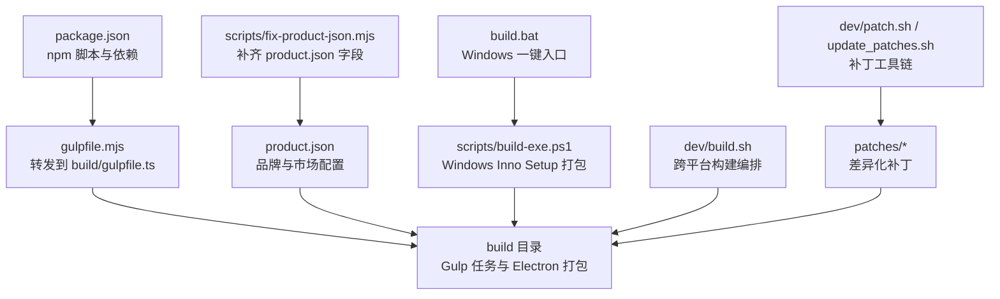
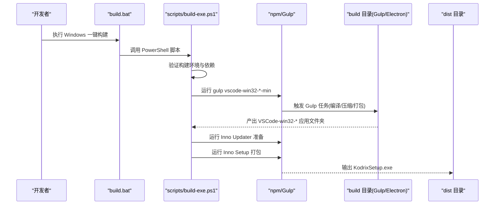
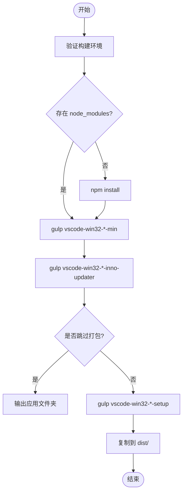
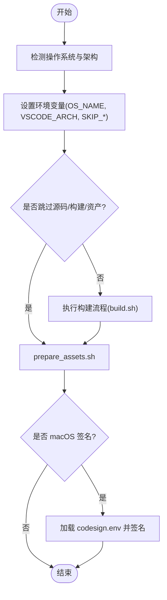
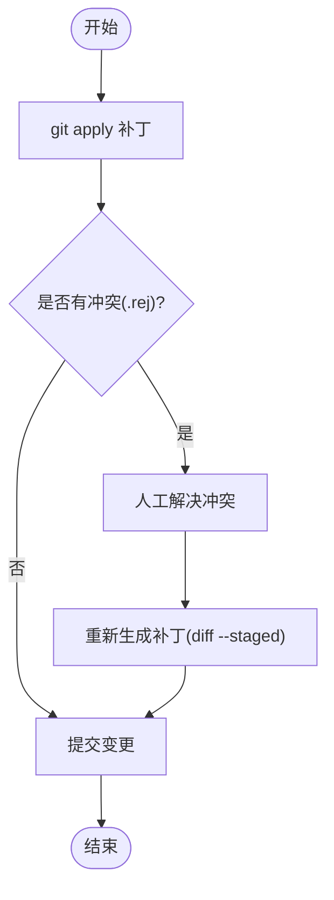
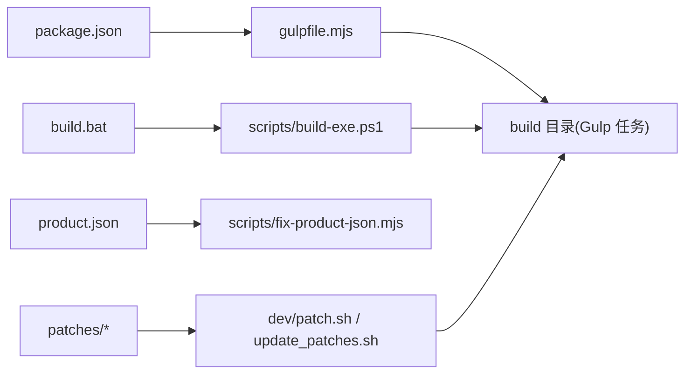

# 生产环境打包

<cite>
**本文引用的文件**   
- [package.json](file://package.json)
- [product.json](file://product.json)
- [gulpfile.mjs](file://gulpfile.mjs)
- [build.bat](file://build.bat)
- [scripts/build-exe.ps1](file://scripts/build-exe.ps1)
- [dev/build.sh](file://dev/build.sh)
- [dev/patch.sh](file://dev/patch.sh)
- [dev/update_patches.sh](file://dev/update_patches.sh)
- [scripts/fix-product-json.mjs](file://scripts/fix-product-json.mjs)
</cite>

## 目录
1. [简介](#简介)
2. [项目结构](#项目结构)
3. [核心组件](#核心组件)
4. [架构总览](#架构总览)
5. [详细组件分析](#详细组件分析)
6. [依赖关系分析](#依赖关系分析)
7. [性能与构建优化](#性能与构建优化)
8. [故障排查指南](#故障排查指南)
9. [结论](#结论)
10. [附录](#附录)

## 简介
本文件面向生产环境的 Kodrix 打包与发布，覆盖以下关键主题：
- 代码压缩、资源优化、签名验证等构建关键环节
- 跨平台打包流程（Windows EXE、macOS DMG、Linux AppImage）
- 产品定制化配置（通过 product.json 修改品牌信息、默认设置、市场链接等）
- 补丁系统使用与维护（对 VSCodium/VSCodium 上游的差异化补丁）
- 构建产物管理（版本号控制、发布渠道、回滚机制）
- 构建性能优化（缓存策略、并行构建、增量编译）

Kodrix 基于 VS Code 源码树进行二次开发，复用其 Gulp 构建体系与 Electron 打包能力；同时通过 patches 目录维护差异化变更，并通过 product.json 注入品牌与市场相关配置。

## 项目结构
围绕生产打包的关键目录与文件如下：
- 根级脚本与入口
  - build.bat：Windows 一键构建入口，委托 scripts/build-exe.ps1
  - package.json：定义 npm 脚本、依赖与构建任务入口
  - gulpfile.mjs：转发到 build/gulpfile.ts，实际构建逻辑在 build 目录
- 平台构建脚本
  - scripts/build-exe.ps1：Windows Inno Setup 安装包构建
  - dev/build.sh：通用构建编排脚本（含环境变量、平台识别、资产准备）
- 产品与品牌配置
  - product.json：产品名称、协议、扩展市场、崩溃上报、内置扩展等
  - scripts/fix-product-json.mjs：修复/补齐 product.json 中缺失字段（如 Open VSX、Copilot 授权范围等）
- 补丁系统
  - patches/*：按类别与平台组织的补丁集合
  - dev/patch.sh：交互式生成/应用补丁
  - dev/update_patches.sh：批量校验并更新补丁冲突

图表来源
- [package.json:12-100](file://package.json#L12-L100)
- [gulpfile.mjs:1-6](file://gulpfile.mjs#L1-L6)
- [scripts/build-exe.ps1:1-143](file://scripts/build-exe.ps1#L1-L143)
- [build.bat:1-43](file://build.bat#L1-L43)
- [dev/build.sh:1-163](file://dev/build.sh#L1-L163)
- [scripts/fix-product-json.mjs:1-144](file://scripts/fix-product-json.mjs#L1-L144)
- [product.json:1-800](file://product.json#L1-L800)

章节来源
- [package.json:12-100](file://package.json#L12-L100)
- [gulpfile.mjs:1-6](file://gulpfile.mjs#L1-L6)
- [build.bat:1-43](file://build.bat#L1-L43)
- [scripts/build-exe.ps1:1-143](file://scripts/build-exe.ps1#L1-L143)
- [dev/build.sh:1-163](file://dev/build.sh#L1-L163)
- [scripts/fix-product-json.mjs:1-144](file://scripts/fix-product-json.mjs#L1-L144)
- [product.json:1-800](file://product.json#L1-L800)

## 核心组件
- 构建入口与任务编排
  - package.json 中的 npm 脚本提供 compile、minify-vscode、compile-build 等任务，统一调用 Gulp
  - gulpfile.mjs 将任务转发至 build/gulpfile.ts，由 Gulp 驱动 TypeScript 转译、esbuild 压缩、Electron 打包等
- Windows 安装包构建
  - build.bat 作为 Windows 一键入口，调用 scripts/build-exe.ps1
  - scripts/build-exe.ps1 负责：环境检查、依赖安装、Gulp 构建桌面应用、Inno Updater 准备、Inno Setup 打包、输出 dist 目录
- 跨平台构建编排
  - dev/build.sh 负责平台识别、环境变量设置、可选跳过源/构建/资产步骤，并在 macOS 下处理签名环境变量
- 产品配置与修复
  - product.json 集中定义品牌名、URL 协议、扩展市场地址、崩溃上报、内置扩展等
  - scripts/fix-product-json.mjs 自动补齐 defaultChatAgent、trustedExtensionAuthAccess、extensionsGallery、linkProtectionTrustedDomains 等字段，确保扩展市场与 Copilot 功能可用
- 补丁系统
  - patches/* 存放差异化补丁；dev/patch.sh 用于交互式生成/应用补丁；dev/update_patches.sh 批量检测并更新补丁冲突

章节来源
- [package.json:12-100](file://package.json#L12-L100)
- [gulpfile.mjs:1-6](file://gulpfile.mjs#L1-L6)
- [scripts/build-exe.ps1:1-143](file://scripts/build-exe.ps1#L1-L143)
- [build.bat:1-43](file://build.bat#L1-L43)
- [dev/build.sh:1-163](file://dev/build.sh#L1-L163)
- [scripts/fix-product-json.mjs:1-144](file://scripts/fix-product-json.mjs#L1-L144)
- [product.json:1-800](file://product.json#L1-L800)

## 架构总览
下图展示从命令行到最终产物的端到端流程，包括 Windows EXE 与跨平台构建路径。

图表来源
- [build.bat:1-43](file://build.bat#L1-L43)
- [scripts/build-exe.ps1:1-143](file://scripts/build-exe.ps1#L1-L143)
- [package.json:12-100](file://package.json#L12-L100)

## 详细组件分析

### Windows EXE 打包流程
- 入口与参数
  - build.bat 支持 -Target system、-Arch arm64、-SkipPackage、-Force 等参数
  - scripts/build-exe.ps1 接收 Arch、Target、SkipPackage、Force 参数
- 构建阶段
  - 环境检查：verify-windows-build-env.ps1
  - 依赖安装：npm install（若 node_modules 不存在）
  - 应用构建：gulp vscode-win32-$Arch-min（首次包含 copilot esbuild 并行编译）
  - Inno Updater 准备：gulp vscode-win32-$Arch-inno-updater
  - Inno Setup 打包：gulp vscode-win32-$Arch-$Target-setup
  - 产物复制：复制到 dist/Kodrix-{version}-{Arch}-{User|System}Setup.exe
- 注意事项
  - 若缺少 inno_updater.exe 或 vcruntime140.dll，会警告自动更新功能不可用
  - SkipPackage 仅输出应用文件夹，不生成安装包

图表来源
- [scripts/build-exe.ps1:1-143](file://scripts/build-exe.ps1#L1-L143)
- [build.bat:1-43](file://build.bat#L1-L43)

章节来源
- [scripts/build-exe.ps1:1-143](file://scripts/build-exe.ps1#L1-L143)
- [build.bat:1-43](file://build.bat#L1-L43)

### 跨平台打包（macOS DMG、Linux AppImage）
- 通用编排
  - dev/build.sh 根据操作系统设置 OS_NAME（darwin/windows/linux），并设置 VSCODE_ARCH、VSCODE_QUALITY、SKIP_* 等环境变量
  - 可跳过源码获取、构建、资产准备等步骤，便于 CI 与本地快速迭代
  - macOS 下读取 dev/osx/codesign.env 以启用签名流程
- 产物说明
  - 该脚本为通用编排层，具体平台产物（DMG/AppImage）由底层构建任务（Gulp/Electron）完成
  - 建议在 CI 中结合平台矩阵并行构建多架构产物

图表来源
- [dev/build.sh:1-163](file://dev/build.sh#L1-L163)

章节来源
- [dev/build.sh:1-163](file://dev/build.sh#L1-L163)

### 产品定制化配置（product.json）
- 品牌与元数据
  - nameShort/nameLong/applicationName/dataFolderName/sharedDataFolderName/serverDataFolderName/win32* 系列键值用于标识产品名、数据目录、Windows 注册表与应用 ID
  - urlProtocol、licenseName、licenseFileName、quality 等定义协议、许可与质量通道
- 扩展市场与链接保护
  - extensionsGallery.serviceUrl/itemUrl/resourceUrlTemplate 等指向 Open VSX
  - linkProtectionTrustedDomains 包含 https://open-vsx.org
- 崩溃上报与内置扩展
  - crashReporter.companyName/productName 指定崩溃上报品牌
  - builtInExtensions/builtInExtensionsEnabledWithAutoUpdates 控制内置扩展与自动更新
- 自动化修复
  - scripts/fix-product-json.mjs 自动补齐 defaultChatAgent、trustedExtensionAuthAccess、extensionsGallery、linkProtectionTrustedDomains 等字段，避免上游合并导致缺失

建议实践
- 修改 product.json 后，先运行 scripts/fix-product-json.mjs 以确保关键字段完整
- 如需更换扩展市场或信任域名，请同步更新 extensionsGallery 与 linkProtectionTrustedDomains

章节来源
- [product.json:1-800](file://product.json#L1-L800)
- [scripts/fix-product-json.mjs:1-144](file://scripts/fix-product-json.mjs#L1-L144)

### 补丁系统（对上游的差异化）
- 补丁组织
  - patches/* 包含通用补丁与平台特定补丁（alpine/linux/osx/windows）
  - 命名规范：前缀数字表示分组顺序，如 00-、10-、20- 等
- 工具链
  - dev/patch.sh：交互式应用/生成补丁，支持 .patch 与 .json 动作文件，自动处理冲突与 .rej 文件
  - dev/update_patches.sh：遍历所有补丁，尝试 git apply，必要时生成 .rej 并提示人工解决，随后重新生成补丁
- 使用建议
  - 新增差异时，优先以补丁形式维护，避免直接修改上游源码
  - 定期运行 update_patches.sh 以适配上游变更，减少冲突累积

图表来源
- [dev/patch.sh:1-134](file://dev/patch.sh#L1-L134)
- [dev/update_patches.sh:1-240](file://dev/update_patches.sh#L1-L240)

章节来源
- [dev/patch.sh:1-134](file://dev/patch.sh#L1-L134)
- [dev/update_patches.sh:1-240](file://dev/update_patches.sh#L1-L240)

## 依赖关系分析
- npm 脚本与 Gulp
  - package.json 定义 compile/minify-vscode/compile-build 等脚本，统一调用 gulp
  - gulpfile.mjs 转发到 build/gulpfile.ts，由 Gulp 驱动各平台构建任务
- Windows 构建链路
  - build.bat → scripts/build-exe.ps1 → npm run gulp → Gulp 任务 → Electron/Inno Setup
- 产品配置链路
  - product.json → scripts/fix-product-json.mjs（运行时/构建前修复）→ 构建产物嵌入品牌与市场配置
- 补丁链路
  - patches/* → dev/patch.sh / dev/update_patches.sh → 应用到源码树 → 参与后续构建

图表来源
- [package.json:12-100](file://package.json#L12-L100)
- [gulpfile.mjs:1-6](file://gulpfile.mjs#L1-L6)
- [scripts/build-exe.ps1:1-143](file://scripts/build-exe.ps1#L1-L143)
- [build.bat:1-43](file://build.bat#L1-L43)
- [scripts/fix-product-json.mjs:1-144](file://scripts/fix-product-json.mjs#L1-L144)
- [dev/patch.sh:1-134](file://dev/patch.sh#L1-L134)
- [dev/update_patches.sh:1-240](file://dev/update_patches.sh#L1-L240)

章节来源
- [package.json:12-100](file://package.json#L12-L100)
- [gulpfile.mjs:1-6](file://gulpfile.mjs#L1-L6)
- [scripts/build-exe.ps1:1-143](file://scripts/build-exe.ps1#L1-L143)
- [build.bat:1-43](file://build.bat#L1-L43)
- [scripts/fix-product-json.mjs:1-144](file://scripts/fix-product-json.mjs#L1-L144)
- [dev/patch.sh:1-134](file://dev/patch.sh#L1-L134)
- [dev/update_patches.sh:1-240](file://dev/update_patches.sh#L1-L240)

## 性能与构建优化
- 并行构建
  - package.json 中使用 npm-run-all2 并行执行 client 与 copilot 扩展编译（compile-client、compile-copilot）
  - scripts/build-exe.ps1 注释指出首次构建包含 copilot esbuild 7 路并行编译
- 增量与缓存
  - scripts/build-exe.ps1 对安装包有 1 小时缓存判断（若未过期则跳过重建）
  - 可通过 -Force 强制重建，-SkipPackage 仅输出应用文件夹以减少重复打包
- 构建体积与速度
  - 使用 minify-vscode/minify-vscode-reh 等任务进行压缩
  - 可在 CI 中缓存 node_modules 与构建中间产物，缩短冷启动时间
- 建议
  - 在 CI 中分层缓存：依赖层（node_modules）、编译层（out/）、打包层（VSCode-win32-*）
  - 针对大扩展（如 copilot）单独缓存其构建产物，提升整体效率

章节来源
- [package.json:27-31](file://package.json#L27-L31)
- [scripts/build-exe.ps1:14-14](file://scripts/build-exe.ps1#L14-L14)
- [scripts/build-exe.ps1:89-95](file://scripts/build-exe.ps1#L89-L95)

## 故障排查指南
- Windows 构建失败
  - 检查 verify-windows-build-env.ps1 的输出，确认 Visual Studio Build Tools、Python 等依赖已就绪
  - 若缺少 inno_updater.exe/vcruntime140.dll，自动更新功能不可用，但安装包仍可生成
- 扩展市场无法访问
  - 确认 product.json 中 extensionsGallery 指向 Open VSX，且 linkProtectionTrustedDomains 包含 open-vsx.org
  - 运行 scripts/fix-product-json.mjs 自动补齐缺失字段
- 补丁冲突
  - 使用 dev/patch.sh 交互式解决 .rej 冲突，完成后重新生成补丁
  - 使用 dev/update_patches.sh 批量检测并更新补丁，必要时逐文件解决冲突
- macOS 签名问题
  - 确保 dev/osx/codesign.env 存在并正确配置证书信息，dev/build.sh 会在资产准备阶段加载

章节来源
- [scripts/build-exe.ps1:101-110](file://scripts/build-exe.ps1#L101-L110)
- [scripts/fix-product-json.mjs:64-123](file://scripts/fix-product-json.mjs#L64-L123)
- [dev/patch.sh:117-131](file://dev/patch.sh#L117-L131)
- [dev/update_patches.sh:102-135](file://dev/update_patches.sh#L102-L135)
- [dev/build.sh:150-162](file://dev/build.sh#L150-L162)

## 结论
Kodrix 的生产打包体系以 Gulp 与 Electron 为核心，辅以 PowerShell/Bash 脚本进行平台化封装。通过 product.json 实现品牌与市场定制，通过 patches 维护对上游的差异，通过 scripts/fix-product-json.mjs 保证配置完整性。建议在 CI 中采用分层缓存与并行构建策略，并结合 dev/build.sh 的环境变量控制，实现稳定高效的跨平台发布。

## 附录
- 常用命令
  - Windows 一键构建：build.bat
  - Windows 自定义参数：scripts/build-exe.ps1 -Target system/-Arch arm64/-SkipPackage/-Force
  - 跨平台编排：dev/build.sh（支持 -i/-l/-o/-p/-s 参数）
  - 产品配置修复：scripts/fix-product-json.mjs
  - 补丁工具：dev/patch.sh、dev/update_patches.sh

章节来源
- [build.bat:1-43](file://build.bat#L1-L43)
- [scripts/build-exe.ps1:16-36](file://scripts/build-exe.ps1#L16-L36)
- [dev/build.sh:22-44](file://dev/build.sh#L22-L44)
- [scripts/fix-product-json.mjs:1-144](file://scripts/fix-product-json.mjs#L1-L144)
- [dev/patch.sh:1-134](file://dev/patch.sh#L1-L134)
- [dev/update_patches.sh:1-240](file://dev/update_patches.sh#L1-L240)