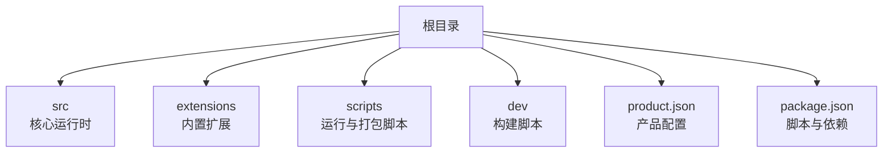
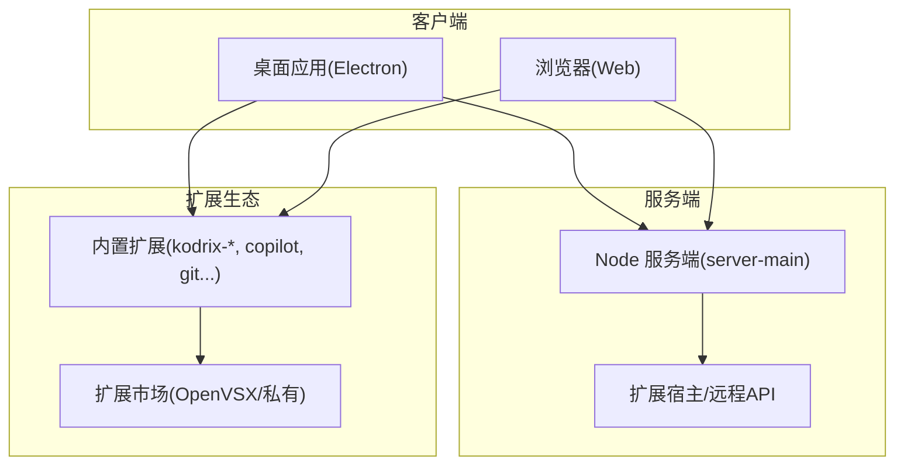
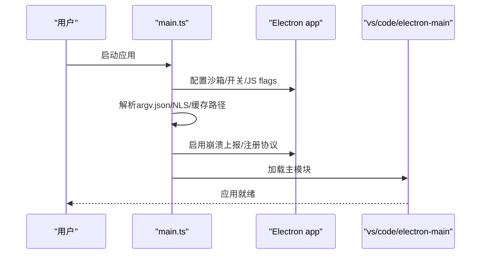
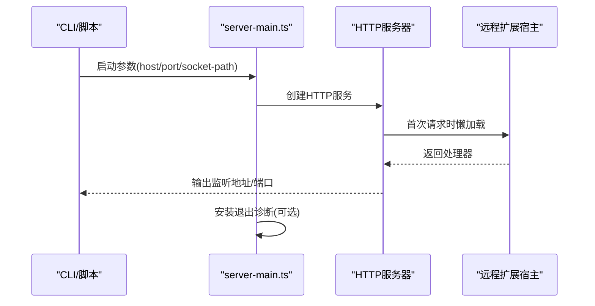
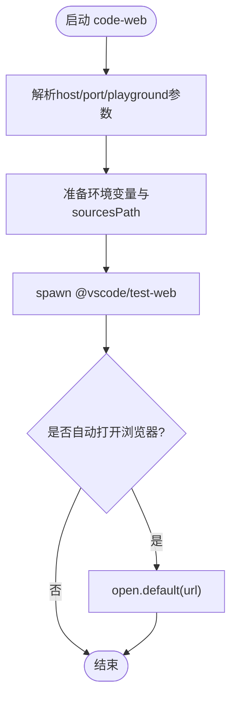
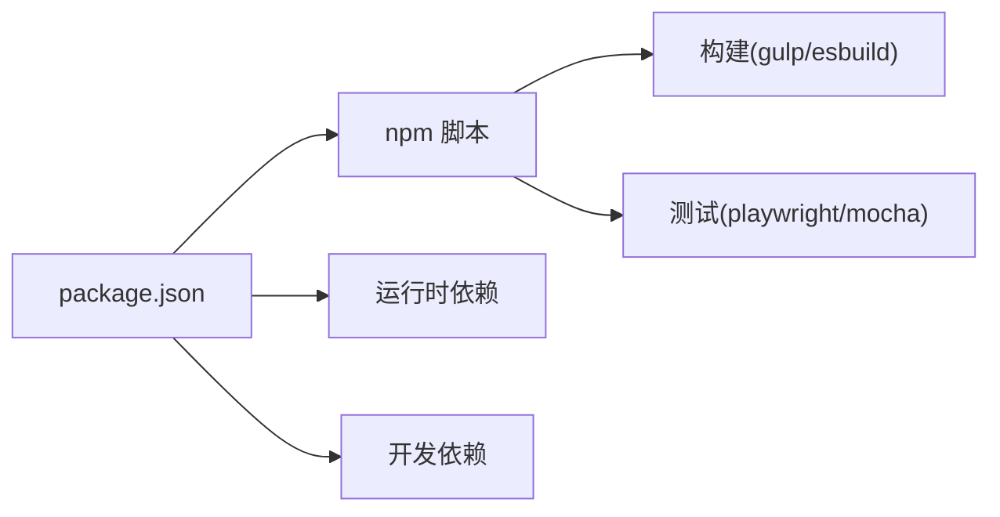
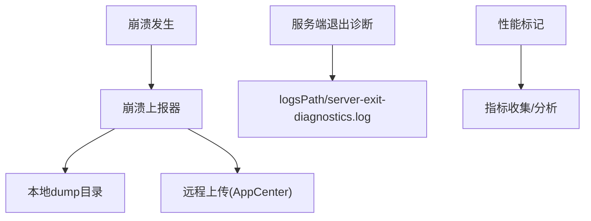

# 部署策略

<cite>
**本文引用的文件**   
- [README.md](file://README.md)
- [package.json](file://package.json)
- [product.json](file://product.json)
- [src/main.ts](file://src/main.ts)
- [src/server-main.ts](file://src/server-main.ts)
- [scripts/code-server.js](file://scripts/code-server.js)
- [scripts/code-web.js](file://scripts/code-web.js)
- [dev/build.sh](file://dev/build.sh)
</cite>

## 目录
1. [简介](#简介)
2. [项目结构](#项目结构)
3. [核心组件](#核心组件)
4. [架构总览](#架构总览)
5. [详细组件分析](#详细组件分析)
6. [依赖关系分析](#依赖关系分析)
7. [性能与生产优化](#性能与生产优化)
8. [监控与日志](#监控与日志)
9. [容器化与编排](#容器化与编排)
10. [云部署最佳实践](#云部署最佳实践)
11. [企业内部分发与私有市场](#企业内部分发与私有市场)
12. [故障排查指南](#故障排查指南)
13. [结论](#结论)

## 简介
本文件面向运维工程师，提供 Kodrix 的完整部署策略参考。内容覆盖桌面应用分发、远程服务器部署、Web 版本部署、容器化与编排、云平台部署、企业内部分发（私有扩展市场、内部模型服务、自定义策略）、性能调优、监控与日志采集等主题。Kodrix 基于 VS Code/VSCodium 构建体系，支持 Electron 桌面端、Node 服务端与 Web 模式运行，并提供丰富的扩展生态与企业级能力。

## 项目结构
仓库采用“核心源码 + 内置扩展 + 构建脚本”的组织方式：
- src：核心运行时（Electron 主进程、Node 服务端）
- extensions：内置扩展（含 kodrix-*、copilot 等）
- scripts：开发/打包/运行辅助脚本
- dev：跨平台构建脚本与环境准备
- product.json：产品品牌、扩展市场、协议、数据目录等配置
- package.json：脚本入口、依赖、构建任务

**图表来源**
- [README.md:69-85](file://README.md#L69-L85)
- [package.json:1-100](file://package.json#L1-L100)

**章节来源**
- [README.md:69-85](file://README.md#L69-L85)
- [package.json:1-100](file://package.json#L1-L100)

## 核心组件
- Electron 桌面端入口：负责应用生命周期、沙箱、崩溃上报、命令行开关、NLS 本地化、缓存路径等。
- Node 服务端入口：启动 HTTP/WebSocket 服务，处理远程扩展宿主请求，端口解析与监听，退出诊断。
- 运行脚本：code-server.js 启动服务端；code-web.js 启动 Web 测试/开发环境。
- 产品配置：product.json 定义扩展市场、协议、数据目录、默认聊天代理等。
- 构建脚本：dev/build.sh 用于跨平台构建流程与环境变量设置。

**章节来源**
- [src/main.ts:1-120](file://src/main.ts#L1-L120)
- [src/server-main.ts:1-120](file://src/server-main.ts#L1-L120)
- [scripts/code-server.js:1-72](file://scripts/code-server.js#L1-L72)
- [scripts/code-web.js:1-168](file://scripts/code-web.js#L1-L168)
- [product.json:1-120](file://product.json#L1-L120)
- [dev/build.sh:1-163](file://dev/build.sh#L1-L163)

## 架构总览
Kodrix 支持三种主要运行形态：
- 桌面应用（Electron）：本地 GUI，集成扩展与 AI 能力。
- 远程服务器（Node）：HTTP/WebSocket 服务，供客户端或 Web 访问。
- Web 模式：通过 @vscode/test-web 或自托管静态资源在浏览器中运行。

**图表来源**
- [src/main.ts:210-220](file://src/main.ts#L210-L220)
- [src/server-main.ts:90-147](file://src/server-main.ts#L90-L147)
- [scripts/code-web.js:87-104](file://scripts/code-web.js#L87-L104)
- [product.json:53-61](file://product.json#L53-L61)

## 详细组件分析

### 桌面应用（Electron）启动流程
- 解析 CLI 参数与 argv.json，设置 Electron/Chromium 开关、JS flags、特性开关。
- 初始化 NLS、用户数据目录、代码缓存路径。
- 启用沙箱与崩溃上报，注册自定义协议。
- 加载主模块并进入应用就绪流程。

**图表来源**
- [src/main.ts:234-378](file://src/main.ts#L234-L378)
- [src/main.ts:509-599](file://src/main.ts#L509-L599)
- [src/main.ts:729-748](file://src/main.ts#L729-L748)

**章节来源**
- [src/main.ts:234-378](file://src/main.ts#L234-L378)
- [src/main.ts:509-599](file://src/main.ts#L509-L599)
- [src/main.ts:729-748](file://src/main.ts#L729-L748)

### 远程服务器（Node）启动流程
- 解析 host/port/socket-path 等参数，支持端口范围自动选择空闲端口。
- 创建 HTTP 服务器，首次请求时懒加载远程扩展宿主服务。
- 输出监听地址与扩展宿主监听信息，记录性能标记。
- 安装进程退出诊断（可选），捕获信号与未捕获异常。

**图表来源**
- [src/server-main.ts:90-147](file://src/server-main.ts#L90-L147)
- [src/server-main.ts:293-348](file://src/server-main.ts#L293-L348)
- [src/server-main.ts:176-282](file://src/server-main.ts#L176-L282)

**章节来源**
- [src/server-main.ts:90-147](file://src/server-main.ts#L90-L147)
- [src/server-main.ts:293-348](file://src/server-main.ts#L293-L348)
- [src/server-main.ts:176-282](file://src/server-main.ts#L176-L282)

### Web 模式与开发工具
- code-web.js 使用 @vscode/test-web 启动 Web 开发环境，支持 playground 扩展与内存文件系统示例。
- 可指定 host/port，自动打开系统浏览器。
- 下载并管理 vscode-web-playground 扩展以增强开发体验。

**图表来源**
- [scripts/code-web.js:25-85](file://scripts/code-web.js#L25-L85)
- [scripts/code-web.js:87-104](file://scripts/code-web.js#L87-L104)
- [scripts/code-web.js:131-165](file://scripts/code-web.js#L131-L165)

**章节来源**
- [scripts/code-web.js:25-85](file://scripts/code-web.js#L25-L85)
- [scripts/code-web.js:87-104](file://scripts/code-web.js#L87-L104)
- [scripts/code-web.js:131-165](file://scripts/code-web.js#L131-L165)

### 产品配置与市场
- product.json 定义扩展市场 URL、链接保护域名、协议、数据目录、默认聊天代理等。
- 扩展市场默认指向 OpenVSX，便于去中心化扩展分发。
- 可通过 product.json 调整扩展行为与 API 提案启用列表。

**章节来源**
- [product.json:53-61](file://product.json#L53-L61)
- [product.json:723-789](file://product.json#L723-L789)

## 依赖关系分析
- 构建与脚本：package.json 定义了 npm 脚本、gulp/esbuild 构建、test/web 相关依赖。
- 运行时依赖：包含 SSH、WebSocket、SQLite、xterm、代理、遥测等库。
- 开发依赖：包含 Playwright、Mocha、ESLint、Gulp、Electron 等。

**图表来源**
- [package.json:1-100](file://package.json#L1-L100)
- [package.json:101-167](file://package.json#L101-L167)
- [package.json:168-272](file://package.json#L168-L272)

**章节来源**
- [package.json:1-100](file://package.json#L1-L100)
- [package.json:101-167](file://package.json#L101-L167)
- [package.json:168-272](file://package.json#L168-L272)

## 性能与生产优化
- 内存与并发
  - 构建阶段设置 NODE_OPTIONS 最大堆大小，避免 esbuild/gulp 内存不足。
  - Electron 主进程增加 WebGL 上下文上限，提升终端渲染性能。
  - 合理配置 V8 JS flags，结合 argv.json 注入 js-flags。
- 缓存与启动速度
  - 启用 V8 代码缓存（非开发模式且存在 commit），加速后续启动。
  - 使用 dev-fast.ps1 跳过预启动以提升开发体验。
- 网络与代理
  - 支持 http-proxy-agent/https-proxy-agent，适配企业代理环境。
  - 通过 argv.json 配置 proxy-bypass-list，绕过特定主机。

**章节来源**
- [dev/build.sh:74-82](file://dev/build.sh#L74-L82)
- [src/main.ts:341-378](file://src/main.ts#L341-L378)
- [src/main.ts:729-748](file://src/main.ts#L729-L748)
- [package.json:101-167](file://package.json#L101-L167)

## 监控与日志
- 崩溃上报
  - Electron 主进程支持本地 dump 目录或远程上传（AppCenter）。
  - 可通过 --crash-reporter-directory 指定本地目录，避免上传。
- 服务端退出诊断
  - server-main.ts 提供退出诊断写入 logsPath 或 tmpdir，记录进程状态、内存、活跃资源、信号与未捕获异常。
- 性能标记
  - 服务端记录 start/firstRequest/firstWebSocket/started 等性能标记，便于定位首包与连接建立耗时。

**图表来源**
- [src/main.ts:509-599](file://src/main.ts#L509-L599)
- [src/server-main.ts:176-282](file://src/server-main.ts#L176-L282)
- [src/server-main.ts:23-24](file://src/server-main.ts#L23-L24)
- [src/server-main.ts:91-107](file://src/server-main.ts#L91-L107)
- [src/server-main.ts:143-147](file://src/server-main.ts#L143-L147)

**章节来源**
- [src/main.ts:509-599](file://src/main.ts#L509-L599)
- [src/server-main.ts:176-282](file://src/server-main.ts#L176-L282)
- [src/server-main.ts:23-24](file://src/server-main.ts#L23-L24)
- [src/server-main.ts:91-107](file://src/server-main.ts#L91-L107)
- [src/server-main.ts:143-147](file://src/server-main.ts#L143-L147)

## 容器化与编排
- Dockerfile 建议要点
  - 基础镜像：选用 Node LTS（与 .nvmrc 一致）+ 必要系统依赖（如 xterm、SSH、SQLite 原生模块所需）。
  - 构建阶段：执行 npm ci、编译客户端与扩展（compile-client/compile-copilot）、最小化产物。
  - 运行阶段：仅复制 out 与必要资源，暴露端口（默认 8000 或自定义），以非 root 用户运行。
  - 健康检查：通过 curl 访问 /health 或检测 server-main 输出中的监听地址。
- docker-compose 建议要点
  - 服务：kodrix-server（Node 服务端）、反向代理（nginx/caddy）、可选数据库（SQLite 文件卷持久化）。
  - 环境变量：VSCODE_SERVER_HOST、VSCODE_SERVER_PORT、VSCODE_NLS_CONFIG、代理相关变量。
  - 卷挂载：/data/.kodrix-server 持久化工作区与配置，/logs 持久化日志。
  - 安全：限制端口映射、启用 TLS、使用只读根文件系统（必要时允许写日志/缓存目录）。

说明：仓库未提供现成 Dockerfile/docker-compose，以上为基于现有运行入口与配置的通用实践建议。

**章节来源**
- [src/server-main.ts:113-147](file://src/server-main.ts#L113-L147)
- [scripts/code-server.js:31-37](file://scripts/code-server.js#L31-L37)
- [product.json:4-8](file://product.json#L4-L8)

## 云部署最佳实践
- AWS
  - ECS/Fargate：无服务器容器部署，配合 ALB 暴露 HTTPS，EFS 持久化工作区。
  - EKS：高可用集群，HPA 按 CPU/内存扩缩容，外部 DNS/TLS 由 Ingress 管理。
  - S3：存放扩展包与静态资源，CDN 加速。
- Azure
  - Container Apps：弹性伸缩，集成 Key Vault 管理密钥。
  - AKS：标准 Kubernetes 集群，使用 Application Gateway Ingress Controller。
  - Blob Storage：扩展包与制品存储。
- Google Cloud
  - Cloud Run：无服务器容器，自动缩放，适合轻量负载。
  - GKE：全功能 Kubernetes，配合 LoadBalancer 与 Cloud Armor。
  - Cloud Storage：扩展包与静态资源。

通用建议：
- 使用只读镜像、最小权限原则、集中日志与指标采集。
- 通过环境变量注入代理、证书、扩展市场地址等敏感配置。
- 使用蓝绿/金丝雀发布，结合健康检查与滚动更新。

[本节为概念性指导，不直接分析具体文件]

## 企业内部分发与私有市场
- 私有扩展市场
  - 将 product.json 的 extensionsGallery.serviceUrl 指向企业内部 OpenVSX 或自建市场。
  - 配置 linkProtectionTrustedDomains 允许内部域名。
- 内部模型服务
  - 通过 BYOK（Bring Your Own Key）与 endpointUrls 配置内部 LLM 网关。
  - 使用 providerStore/providerSecrets 管理凭据，providerSync 同步配置。
- 自定义策略
  - 利用 policy-watcher 与 exportPolicyData 导出策略数据，结合企业策略中心下发。
  - 通过 argv.json 控制 log-level、disable-hardware-acceleration 等运行时开关。

**章节来源**
- [product.json:53-61](file://product.json#L53-L61)
- [extensions/kodrix-local/src/byokRegister.ts](file://extensions/kodrix-local/src/byokRegister.ts)
- [extensions/kodrix-local/src/endpointUrls.ts](file://extensions/kodrix-local/src/endpointUrls.ts)
- [extensions/kodrix-local/src/providerStore.ts](file://extensions/kodrix-local/src/providerStore.ts)
- [extensions/kodrix-local/src/providerSecrets.ts](file://extensions/kodrix-local/src/providerSecrets.ts)
- [extensions/kodrix-local/src/providerSync.ts](file://extensions/kodrix-local/src/providerSync.ts)
- [package.json:72](file://package.json#L72)

## 故障排查指南
- 启动卡死/原生模块问题
  - 检查 Node 版本与 .nvmrc 一致性，确保 npm < 12。
  - 清理 .build/out 后重新构建，确认 native 模块编译成功。
- 中文语言包问题
  - 确认 zh-cn 语言包已注入，必要时手动安装官方语言包。
- 远程连接失败
  - 检查 server-main 输出的监听地址与端口，确认防火墙/安全组放行。
  - 使用 --port 范围或固定端口，避免冲突。
- 崩溃与退出
  - 查看崩溃 dump 目录或远程上报结果。
  - 启用 server-exit-diagnostics.log，分析进程退出原因与资源状态。

**章节来源**
- [README.md:97-104](file://README.md#L97-L104)
- [src/server-main.ts:176-282](file://src/server-main.ts#L176-L282)
- [src/main.ts:509-599](file://src/main.ts#L509-L599)

## 结论
Kodrix 提供了从桌面端到 Web 端的完整运行形态，并通过 product.json 与扩展生态实现灵活的企业定制。在生产环境中，建议采用容器化部署、云平台托管、私有扩展市场与内部模型服务，并结合性能优化、监控与日志采集，确保稳定性与可观测性。本文档为运维工程师提供了从架构到落地的全流程参考。