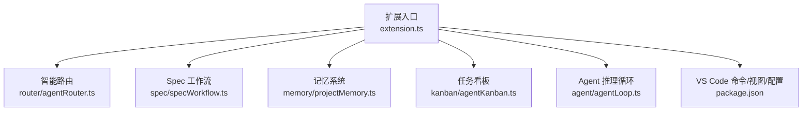
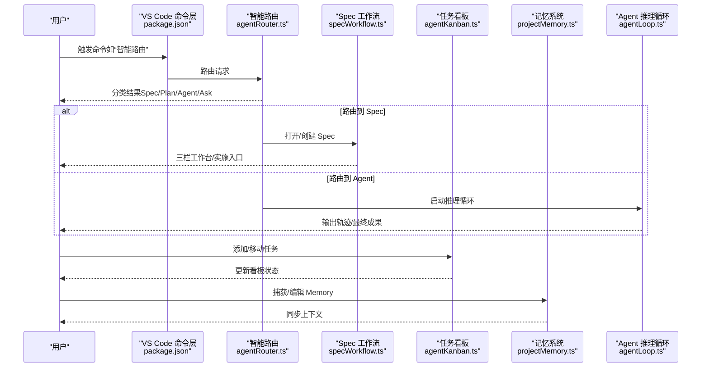
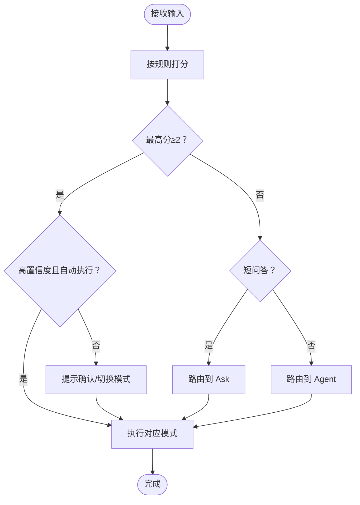
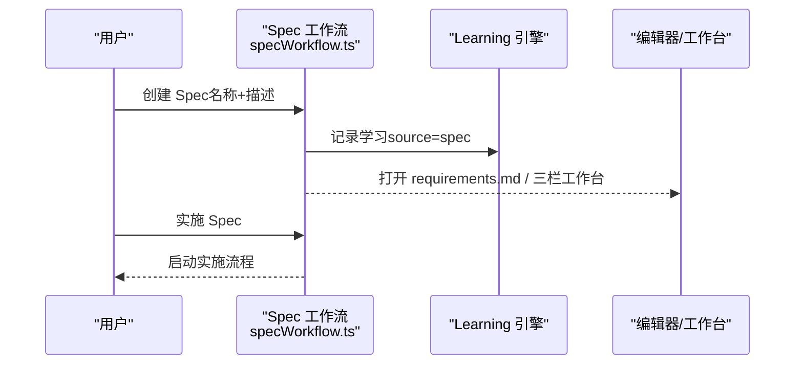
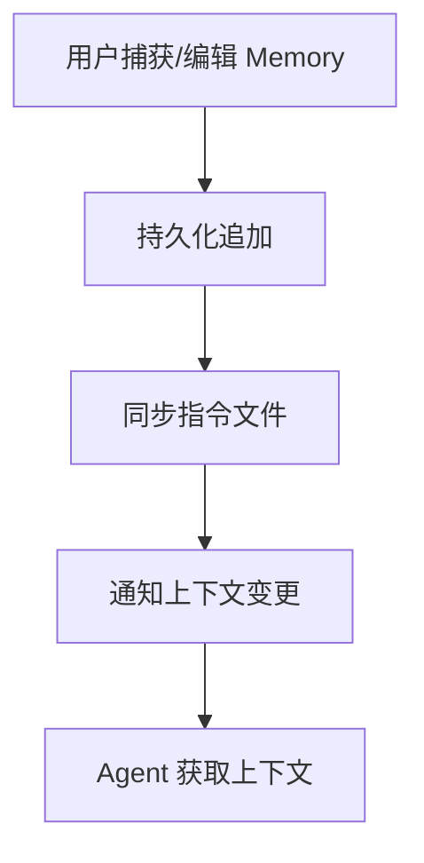
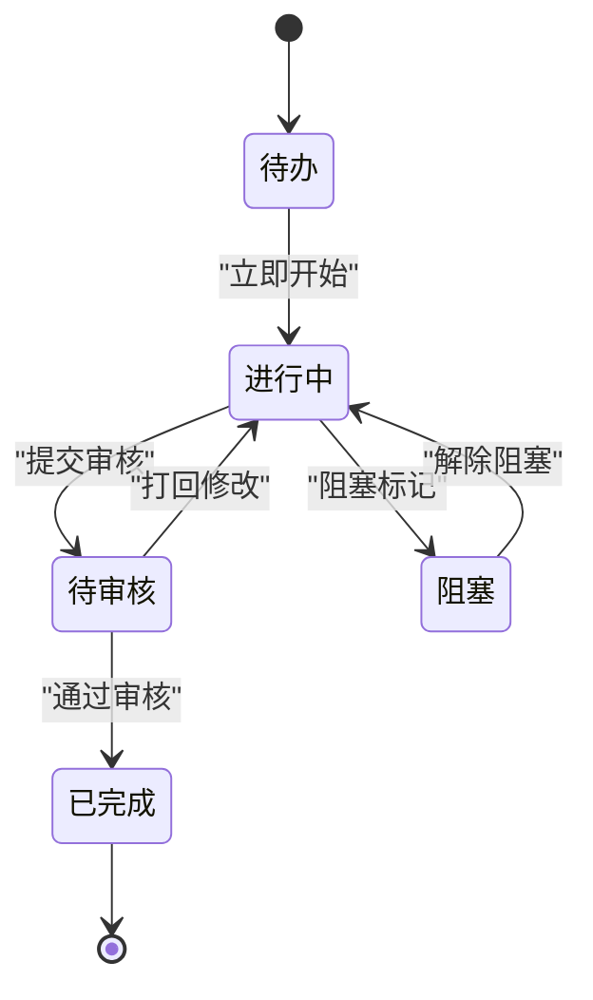
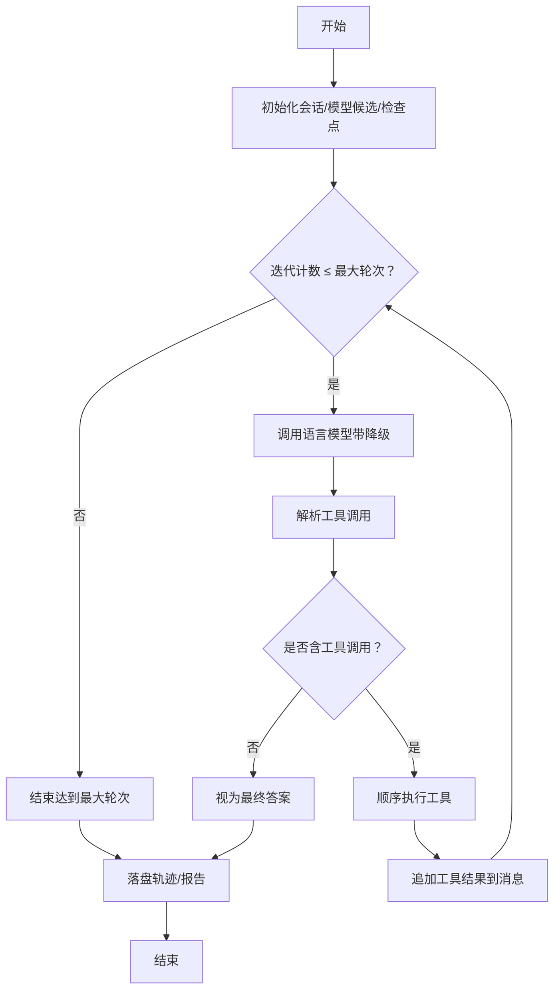
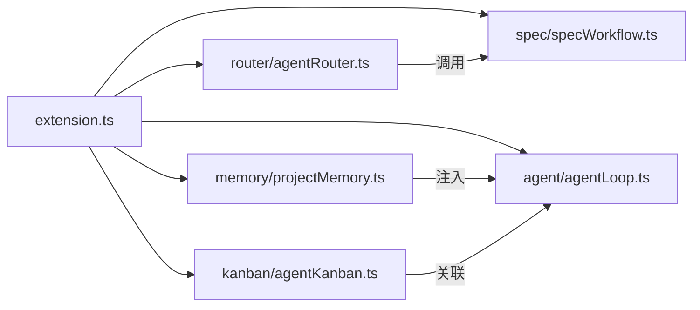

# Agent 操作系统架构

<cite>
**本文引用的文件**   
- [extension.ts](file://extensions/kodrix-agent-os/src/extension.ts)
- [package.json](file://extensions/kodrix-agent-os/package.json)
- [agentLoop.ts](file://extensions/kodrix-agent-os/src/agent/agentLoop.ts)
- [agentRouter.ts](file://extensions/kodrix-agent-os/src/router/agentRouter.ts)
- [specWorkflow.ts](file://extensions/kodrix-agent-os/src/spec/specWorkflow.ts)
- [projectMemory.ts](file://extensions/kodrix-agent-os/src/memory/projectMemory.ts)
- [agentKanban.ts](file://extensions/kodrix-agent-os/src/kanban/agentKanban.ts)
</cite>

## 目录
1. [引言](#引言)
2. [项目结构](#项目结构)
3. [核心组件](#核心组件)
4. [架构总览](#架构总览)
5. [详细组件分析](#详细组件分析)
6. [依赖关系分析](#依赖关系分析)
7. [性能与可靠性](#性能与可靠性)
8. [故障排查指南](#故障排查指南)
9. [结论](#结论)
10. [附录：扩展指南](#附录扩展指南)

## 引言
本文件面向开发者，系统性阐述 Kodrix Agent OS 的架构设计与实现要点，覆盖以下关键主题：
- 智能路由机制：对用户输入进行意图分类，自动分发到 Spec、Plan、Agent 或 Ask。
- Spec 驱动工作流：从需求到设计再到任务的结构化推进。
- Memory 记忆系统：跨会话知识沉淀与上下文注入。
- Kanban 任务看板：可视化任务状态流转与会话关联。
- Agent 生命周期管理、任务调度算法、上下文管理机制。
- Spec 文档结构定义、状态转换逻辑、执行引擎设计。
- 组件架构图、时序图、状态机图，以及扩展新 Agent 类型与工作流的实践指导。

## 项目结构
Kodrix Agent OS 以 VS Code 扩展形式存在，入口为 extension.ts，负责注册命令、事件监听与各子系统初始化。核心能力分布在 agent、router、spec、memory、kanban 等子模块中，并通过 package.json 暴露命令、视图、快捷键与配置项。

图表来源
- [extension.ts:158-222](file://extensions/kodrix-agent-os/src/extension.ts#L158-L222)
- [package.json:23-537](file://extensions/kodrix-agent-os/package.json#L23-L537)

章节来源
- [extension.ts:158-222](file://extensions/kodrix-agent-os/src/extension.ts#L158-L222)
- [package.json:23-537](file://extensions/kodrix-agent-os/package.json#L23-L537)

## 核心组件
- 智能路由（Router）：基于规则评分对输入进行分类，支持高置信度自动执行与低置信度二次确认。
- Spec 工作流（Spec Workflow）：创建三件套（需求/设计/任务），提供工作台与实施入口。
- Memory 记忆系统（Project Memory）：持久化项目知识，同步至指令集并注入上下文。
- Kanban 任务看板（Agent Kanban）：任务 CRUD、状态迁移、会话联动与统计。
- Agent 推理循环（Agent Loop）：端到端工具调用循环，支持 Plan 只读模式、检查点、轨迹记录与续聊。

章节来源
- [agentRouter.ts:1-265](file://extensions/kodrix-agent-os/src/router/agentRouter.ts#L1-L265)
- [specWorkflow.ts:1-88](file://extensions/kodrix-agent-os/src/spec/specWorkflow.ts#L1-L88)
- [projectMemory.ts:1-92](file://extensions/kodrix-agent-os/src/memory/projectMemory.ts#L1-L92)
- [agentKanban.ts:1-295](file://extensions/kodrix-agent-os/src/kanban/agentKanban.ts#L1-L295)
- [agentLoop.ts:1-816](file://extensions/kodrix-agent-os/src/agent/agentLoop.ts#L1-L816)

## 架构总览
下图展示用户交互到各子系统的数据流向与控制流。

图表来源
- [package.json:78-453](file://extensions/kodrix-agent-os/package.json#L78-L453)
- [agentRouter.ts:141-248](file://extensions/kodrix-agent-os/src/router/agentRouter.ts#L141-L248)
- [specWorkflow.ts:16-79](file://extensions/kodrix-agent-os/src/spec/specWorkflow.ts#L16-L79)
- [agentKanban.ts:138-295](file://extensions/kodrix-agent-os/src/kanban/agentKanban.ts#L138-L295)
- [projectMemory.ts:19-58](file://extensions/kodrix-agent-os/src/memory/projectMemory.ts#L19-L58)
- [agentLoop.ts:486-657](file://extensions/kodrix-agent-os/src/agent/agentLoop.ts#L486-L657)

## 详细组件分析

### 智能路由机制（Router）
- 意图分类：通过多组正则权重打分，选择最高分目标；短问答优先归入 Ask。
- 自动执行：当置信度高且开启 autoExecute 时直接执行，否则弹出确认或允许切换模式。
- 历史记录：保存最近一次路由结果，支持重复执行。
- 执行策略：根据目标分别打开 Spec 工作台、Plan 模式、Ask 模式或 Agent 模式。

图表来源
- [agentRouter.ts:30-113](file://extensions/kodrix-agent-os/src/router/agentRouter.ts#L30-L113)
- [agentRouter.ts:141-248](file://extensions/kodrix-agent-os/src/router/agentRouter.ts#L141-L248)

章节来源
- [agentRouter.ts:1-265](file://extensions/kodrix-agent-os/src/router/agentRouter.ts#L1-L265)

### Spec 驱动工作流（Spec Workflow）
- 创建流程：引导输入功能名与描述，生成 .kodrix/specs/<slug>/ 三件套，并可选择打开三栏工作台或直接进入实施。
- 工作台与实施：提供 openWorkbench 与 implement 入口，便于从需求→设计→任务的逐步推进。
- 学习沉淀：新建 Spec 会记录 Learning 元数据，增强系统“越用越聪明”。

图表来源
- [specWorkflow.ts:16-79](file://extensions/kodrix-agent-os/src/spec/specWorkflow.ts#L16-L79)

章节来源
- [specWorkflow.ts:1-88](file://extensions/kodrix-agent-os/src/spec/specWorkflow.ts#L1-L88)

### Memory 记忆系统（Project Memory）
- 写入与同步：appendMemoryEntry 将条目追加到 Memory 文件，并同步到指令集，通知上下文变更。
- 捕获与查看：支持从选中文本或手动输入捕获 Memory，并提供查看命令。
- 上下文注入：在启用时自动将 Memory 内容注入指令与上下文，供 Agent 使用。

图表来源
- [projectMemory.ts:19-58](file://extensions/kodrix-agent-os/src/memory/projectMemory.ts#L19-L58)

章节来源
- [projectMemory.ts:1-92](file://extensions/kodrix-agent-os/src/memory/projectMemory.ts#L1-L92)

### Kanban 任务看板（Agent Kanban）
- 数据结构：任务包含 id、title、description、status、时间戳与可选 sessionHint。
- 状态管理：todo/in_progress/review/blocked/done，支持排序、过滤与统计。
- 交互流程：添加任务、移动状态、删除任务、打开关联会话；点击“立即开始”自动切换到 in_progress。
- 视图集成：TreeDataProvider 渲染任务列表，命令面板与菜单项绑定操作。

图表来源
- [agentKanban.ts:12-34](file://extensions/kodrix-agent-os/src/kanban/agentKanban.ts#L12-L34)
- [agentKanban.ts:177-237](file://extensions/kodrix-agent-os/src/kanban/agentKanban.ts#L177-L237)

章节来源
- [agentKanban.ts:1-295](file://extensions/kodrix-agent-os/src/kanban/agentKanban.ts#L1-L295)

### Agent 推理循环（Agent Loop）
- 工具协议：模型输出结构化 <tool_call/> 块，解析器容错提取 name + arguments。
- 内置工具：read_file、write_file、edit_file、list_dir、search、codebase_search、run_command、propose_changes、complete。
- 收敛控制：maxIterations、总超时、CancellationToken 中断、错误恢复与降级。
- 计划模式：planOnly 仅允许只读工具与 complete，输出实施计划。
- 轨迹与续聊：每轮记录 thought/tool_result/final，支持基于上次运行结果的续聊。
- 检查点：运行前自动创建检查点，失败可回滚。

图表来源
- [agentLoop.ts:112-141](file://extensions/kodrix-agent-os/src/agent/agentLoop.ts#L112-L141)
- [agentLoop.ts:486-657](file://extensions/kodrix-agent-os/src/agent/agentLoop.ts#L486-L657)

章节来源
- [agentLoop.ts:1-816](file://extensions/kodrix-agent-os/src/agent/agentLoop.ts#L1-L816)

## 依赖关系分析
- 扩展入口 extension.ts 集中注册所有子系统，确保命令、事件与资源统一生命周期管理。
- Router 依赖 Spec 辅助函数（如 listSpecSlugs）与日志、事件总线。
- Spec 工作流依赖 Learning 引擎记录学习事件。
- Memory 系统依赖 InstructionRegistry 与 ContextEvents 进行指令同步与上下文刷新。
- Kanban 看板独立持久化 JSON 数据，提供 TreeDataProvider 与命令绑定。
- Agent Loop 依赖 Model Router、Terminal AI、Apply Manager、Checkpoint 与 Threads。

图表来源
- [extension.ts:158-222](file://extensions/kodrix-agent-os/src/extension.ts#L158-L222)
- [agentRouter.ts:1-265](file://extensions/kodrix-agent-os/src/router/agentRouter.ts#L1-L265)
- [specWorkflow.ts:1-88](file://extensions/kodrix-agent-os/src/spec/specWorkflow.ts#L1-L88)
- [projectMemory.ts:1-92](file://extensions/kodrix-agent-os/src/memory/projectMemory.ts#L1-L92)
- [agentKanban.ts:1-295](file://extensions/kodrix-agent-os/src/kanban/agentKanban.ts#L1-L295)
- [agentLoop.ts:1-816](file://extensions/kodrix-agent-os/src/agent/agentLoop.ts#L1-L816)

章节来源
- [extension.ts:158-222](file://extensions/kodrix-agent-os/src/extension.ts#L158-L222)

## 性能与可靠性
- 模型调用与降级：Agent Loop 维护候选模型列表，失败自动降级下一个可用模型，避免单点故障。
- 超时与取消：每轮请求设置请求级超时，结合 CancellationToken 支持外部中断。
- 工具安全：路径校验限制在工作区内；命令执行受 allowCommands 开关控制。
- 索引与检索：codebase_search 优先使用内存索引，必要时懒构建，减少 IO 开销。
- 检查点保护：Agent 运行前自动创建检查点，失败可回滚，提升安全性与可恢复性。
- 看板与 Memory：本地 JSON 读写，轻量高效；Memory 变更触发指令同步与上下文刷新，避免频繁 UI 重绘。

[本节为通用性能建议，不直接分析具体文件]

## 故障排查指南
- 激活失败：extension.ts 包裹 activateInternal 的错误边界，失败时显示用户可见错误信息。
- 路由未生效：检查 kodrix.features.agentRouter 配置与 autoExecute 设置；查看 lastRoute 记录。
- Spec 无法创建：检查工作区权限与 .kodrix 目录；确认 slug 生成与文件写入。
- Memory 未注入：确认 memory 功能开关；检查 onDidSaveTextDocument 监听与指令同步。
- Kanban 无数据：确认 getKanbanPath 返回有效路径；检查 JSON 格式与权限。
- Agent Loop 失败：查看轨迹文件（agent-runs/*.md）；检查模型配置、工具权限与终端命令执行。

章节来源
- [extension.ts:158-168](file://extensions/kodrix-agent-os/src/extension.ts#L158-L168)
- [agentRouter.ts:141-189](file://extensions/kodrix-agent-os/src/router/agentRouter.ts#L141-L189)
- [specWorkflow.ts:16-56](file://extensions/kodrix-agent-os/src/spec/specWorkflow.ts#L16-L56)
- [projectMemory.ts:60-83](file://extensions/kodrix-agent-os/src/memory/projectMemory.ts#L60-L83)
- [agentKanban.ts:36-61](file://extensions/kodrix-agent-os/src/kanban/agentKanban.ts#L36-L61)
- [agentLoop.ts:512-607](file://extensions/kodrix-agent-os/src/agent/agentLoop.ts#L512-L607)

## 结论
Kodrix Agent OS 以“智能路由 + Spec 驱动 + Memory + Kanban + Agent 推理循环”为核心，形成从想法到实现的闭环流水线。其设计强调：
- 可观测：完整轨迹、检查点、看板与 Learning 仪表盘。
- 可扩展：插件化的工具集、路由规则与 Spec 工作流。
- 可靠：模型降级、超时与取消、路径安全与命令白名单。
- 易用：命令面板、快捷键与工作区内嵌设置页。

[本节为总结性内容，不直接分析具体文件]

## 附录：扩展指南

### 扩展新的 Agent 类型
- 在 router 中添加新的路由类别与匹配规则，并在 executeRoute 中实现对应分支。
- 若需要专用工具集，可在 Agent Loop 中通过 tools 参数过滤默认工具，或扩展 DEFAULT_TOOLS。
- 为新 Agent 类型注册命令与视图入口，并在 extension.ts 中完成生命周期注册。

章节来源
- [agentRouter.ts:30-56](file://extensions/kodrix-agent-os/src/router/agentRouter.ts#L30-L56)
- [agentRouter.ts:192-248](file://extensions/kodrix-agent-os/src/router/agentRouter.ts#L192-L248)
- [agentLoop.ts:467-478](file://extensions/kodrix-agent-os/src/agent/agentLoop.ts#L467-L478)
- [extension.ts:158-222](file://extensions/kodrix-agent-os/src/extension.ts#L158-L222)

### 扩展新的工作流（Spec 风格）
- 在 specHelpers 中新增工作流模板与创建逻辑，并在 specWorkflow.ts 中提供命令入口。
- 将新工作流接入 Learning 引擎，记录 source/category 以便后续分析与仪表盘展示。
- 在工作台或命令面板中暴露新工作流的创建与实施入口。

章节来源
- [specWorkflow.ts:16-79](file://extensions/kodrix-agent-os/src/spec/specWorkflow.ts#L16-L79)

### 扩展新的记忆维度
- 在 memory 模块中新增持久化与读取方法，并在 projectMemory.ts 中提供命令与注入逻辑。
- 将新维度纳入指令同步与上下文注入，确保 Agent 能感知最新知识。

章节来源
- [projectMemory.ts:19-58](file://extensions/kodrix-agent-os/src/memory/projectMemory.ts#L19-L58)

### 扩展新的看板状态
- 在 agentKanban.ts 中扩展 STATUS_CONFIG 与 moveKanbanTask 的状态选择逻辑。
- 更新视图渲染与统计计算，确保 UI 与数据一致。

章节来源
- [agentKanban.ts:28-34](file://extensions/kodrix-agent-os/src/kanban/agentKanban.ts#L28-L34)
- [agentKanban.ts:177-209](file://extensions/kodrix-agent-os/src/kanban/agentKanban.ts#L177-L209)
- [agentKanban.ts:257-266](file://extensions/kodrix-agent-os/src/kanban/agentKanban.ts#L257-L266)