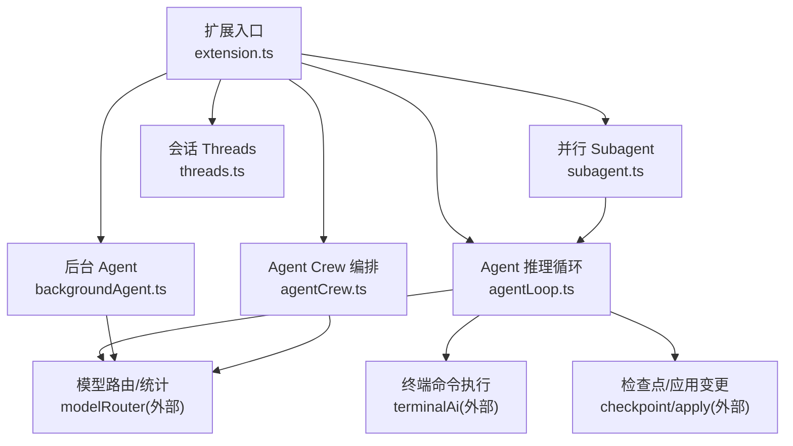
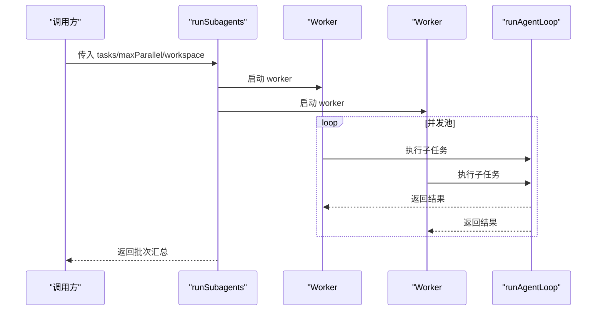
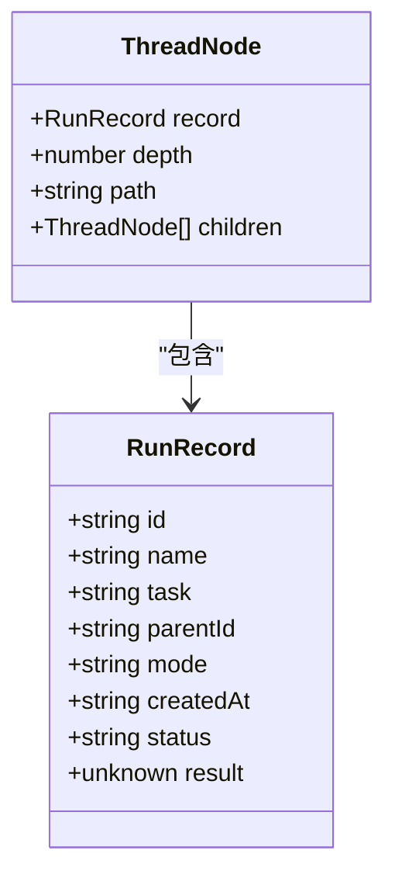
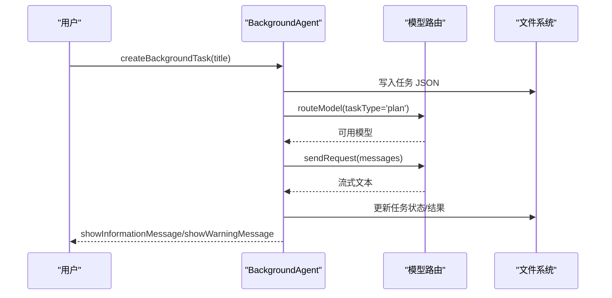
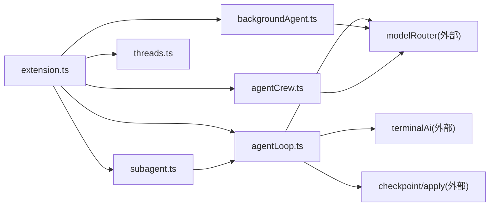

# Agent 生命周期管理

<cite>
**本文引用的文件**   
- [extension.ts](file://extensions/kodrix-agent-os/src/extension.ts)
- [agentLoop.ts](file://extensions/kodrix-agent-os/src/agent/agentLoop.ts)
- [subagent.ts](file://extensions/kodrix-agent-os/src/agent/subagent.ts)
- [threads.ts](file://extensions/kodrix-agent-os/src/agent/threads.ts)
- [backgroundAgent.ts](file://extensions/kodrix-agent-os/src/background/backgroundAgent.ts)
- [agentCrew.ts](file://extensions/kodrix-agent-os/src/crew/agentCrew.ts)
- [package.nls.json](file://extensions/kodrix-agent-os/package.nls.json)
</cite>

## 目录
1. [引言](#引言)
2. [项目结构](#项目结构)
3. [核心组件](#核心组件)
4. [架构总览](#架构总览)
5. [详细组件分析](#详细组件分析)
6. [依赖关系分析](#依赖关系分析)
7. [性能与并发](#性能与并发)
8. [故障排查指南](#故障排查指南)
9. [结论](#结论)
10. [附录：自定义 Agent 开发指南](#附录自定义-agent-开发指南)

## 引言
本文件系统性梳理 Kodrix Agent OS 中“Agent 生命周期管理”的设计与实现，覆盖 Agent 的创建、初始化、运行、销毁各阶段；解释状态机设计、事件驱动机制、资源管理策略；说明 Agent 间通信协议、消息传递与协作机制；并给出注册表、监控指标、调试工具的使用方式。同时提供自定义 Agent 类型开发指南、生命周期钩子、错误恢复机制，以及后台任务调度、并发控制与性能优化建议。

## 项目结构
Kodrix Agent OS 以 VS Code 扩展形式组织，核心入口在 extension.ts，负责统一注册命令、面板、监听器与后台能力。Agent 相关能力分布在 agent、background、crew 等模块：
- agent：端到端推理循环、并行派生子 Agent、会话 Threads（树/分支/命名/搜索）
- background：后台 Agent 派发、执行、结果展示
- crew：多 Agent Crew 编排、任务 DAG、自动推进
- 共享常量、模型路由、日志、路径等基础设施由其他模块提供



**图示来源**
- [extension.ts:158-222](file://extensions/kodrix-agent-os/src/extension.ts#L158-L222)
- [agentLoop.ts:486-656](file://extensions/kodrix-agent-os/src/agent/agentLoop.ts#L486-L656)
- [subagent.ts:54-108](file://extensions/kodrix-agent-os/src/agent/subagent.ts#L54-L108)
- [threads.ts:44-96](file://extensions/kodrix-agent-os/src/agent/threads.ts#L44-L96)
- [backgroundAgent.ts:87-138](file://extensions/kodrix-agent-os/src/background/backgroundAgent.ts#L87-L138)
- [agentCrew.ts:1-33](file://extensions/kodrix-agent-os/src/crew/agentCrew.ts#L1-L33)

**章节来源**
- [extension.ts:158-222](file://extensions/kodrix-agent-os/src/extension.ts#L158-L222)

## 核心组件
- Agent 推理循环（Agent Loop）：端到端 LLM 自主决策 → 工具调用 → 观察结果 → 迭代收敛，支持计划模式、续聊、轨迹落盘、检查点回滚。
- Subagent 并行派生：将主任务拆分为多个独立上下文子任务，受限并发池并行执行，汇总报告落盘。
- Threads 会话树：基于 .json 元数据构建会话树，支持浏览、重命名、搜索、打开记录。
- Background Agent：后台派发任务，异步执行，结果持久化与通知。
- Agent Crew：多角色、多任务的编排框架，支持自动推进、依赖图、可视化。

**章节来源**
- [agentLoop.ts:1-14](file://extensions/kodrix-agent-os/src/agent/agentLoop.ts#L1-L14)
- [subagent.ts:1-10](file://extensions/kodrix-agent-os/src/agent/subagent.ts#L1-L10)
- [threads.ts:1-10](file://extensions/kodrix-agent-os/src/agent/threads.ts#L1-L10)
- [backgroundAgent.ts:1-9](file://extensions/kodrix-agent-os/src/background/backgroundAgent.ts#L1-L9)
- [agentCrew.ts:1-15](file://extensions/kodrix-agent-os/src/crew/agentCrew.ts#L1-L15)

## 架构总览
Agent 生命周期贯穿“创建 → 初始化 → 运行 → 销毁”，由扩展入口统一装配，并通过命令面板与 Webview 暴露交互。

```mermaid
sequenceDiagram
participant User as "用户"
participant Ext as "扩展入口<br/>extension.ts"
participant Cmd as "命令处理器"
participant Loop as "Agent 推理循环<br/>agentLoop.ts"
participant Model as "模型路由<br/>modelRouter"
participant FS as "文件系统"
User->>Ext : 激活扩展
Ext->>Cmd : 注册命令/监听器
User->>Cmd : 触发 Agent 运行命令
Cmd->>Loop : runAgentLoop(opts)
Loop->>Model : routeModel/getModelCandidates
Model-->>Loop : 候选模型列表
Loop->>FS : 创建检查点/写入轨迹
Loop-->>Cmd : 返回运行结果
Cmd-->>User : 打开记录/提示状态
```

**图示来源**
- [extension.ts:158-222](file://extensions/kodrix-agent-os/src/extension.ts#L158-L222)
- [agentLoop.ts:486-656](file://extensions/kodrix-agent-os/src/agent/agentLoop.ts#L486-L656)

## 详细组件分析

### Agent 推理循环（Agent Loop）
- 生命周期阶段
  - 创建：runAgentLoop 接收任务描述、工作区、最大迭代、超时、模型偏好、工具集、进度回调、取消令牌、是否创建检查点、是否续聊、是否仅计划模式。
  - 初始化：读取配置、选择工具集、准备系统提示、构建初始消息、选择模型候选、创建检查点。
  - 运行：每轮调用 LLM，解析工具调用，顺序执行工具，收集结果，追加到消息历史，直到完成或达到限制。
  - 销毁：清理定时器、取消令牌、释放资源，返回结构化结果（状态、输出、轨迹、迭代次数、耗时、检查点 ID）。
- 状态机
  - 状态：completed / failed / cancelled / max_iterations
  - 转换：
    - 无工具调用 → completed
    - 达到最大迭代 → max_iterations
    - 超时/取消 → failed/cancelled
    - 所有模型失败 → failed
- 事件驱动
  - onUpdate(phase, detail) 推送 thinking/tool/final 等阶段信息
  - 模型降级时触发 onUpdata 提示
- 资源管理
  - CancellationTokenSource 在 finally 中 dispose
  - 请求级超时 + 总超时双重保护
  - 检查点可选创建，便于回滚
- 工具协议
  - XML 块 <tool_call name/arguments> 解析，容错处理
  - 内置工具：read_file/write_file/edit_file/list_dir/search/codebase_search/run_command/propose_changes/complete
  - 路径安全：resolveInWorkspace 限制在工作区内
- 轨迹与持久化
  - 每轮 thought/tool_result/final 写入 trace
  - 渲染为 Markdown 文档，保存 .md/.json 记录
  - 支持续聊：buildHistoryContext 注入历史摘要

```mermaid
flowchart TD
Start(["开始 runAgentLoop"]) --> Init["初始化：读取配置/工具集/消息/模型候选/检查点"]
Init --> Loop{"迭代计数 <= 最大迭代?"}
Loop --> |否| MaxIter["标记 max_iterations"] --> End(["结束"])
Loop --> |是| CheckCancel["检查取消/超时"]
CheckCancel --> |已取消| Cancelled["标记 cancelled"] --> End
CheckCancel --> |未取消| CallLLM["调用 LLM带降级"]
CallLLM --> ParseCalls["解析工具调用"]
ParseCalls --> HasCall{"存在工具调用?"}
HasCall --> |否| Finalize["提取最终文本/标记 completed"] --> End
HasCall --> |是| ExecTools["顺序执行工具/记录结果"]
ExecTools --> AppendMsg["追加 tool_result 到消息历史"]
AppendMsg --> Loop
```



**图示来源**
- [agentLoop.ts:486-656](file://extensions/kodrix-agent-os/src/agent/agentLoop.ts#L486-L656)

**章节来源**
- [agentLoop.ts:112-141](file://extensions/kodrix-agent-os/src/agent/agentLoop.ts#L112-L141)
- [agentLoop.ts:145-192](file://extensions/kodrix-agent-os/src/agent/agentLoop.ts#L145-L192)
- [agentLoop.ts:198-478](file://extensions/kodrix-agent-os/src/agent/agentLoop.ts#L198-L478)
- [agentLoop.ts:486-656](file://extensions/kodrix-agent-os/src/agent/agentLoop.ts#L486-L656)
- [agentLoop.ts:659-707](file://extensions/kodrix-agent-os/src/agent/agentLoop.ts#L659-L707)

### Subagent 并行派生
- 生命周期阶段
  - 创建：runSubagents 接收父任务、子任务列表、工作区、并发上限、进度回调
  - 初始化：计算并发 worker 数量，分配任务索引
  - 运行：每个 worker 调用 runAgentLoop，独立上下文、独立轨迹、独立检查点
  - 销毁：汇总结果，渲染报告，落盘 .md/.json
- 并发控制
  - Promise.all 启动固定数量的 worker，内部 while(true) 自旋取任务，线程安全 next++
- 错误恢复
  - 单个子任务异常不影响其它任务，记录 error 字段
- 报告与命令
  - renderSubagentReport 生成汇总表格与详情
  - 命令：subagentRun/subagentList



**图示来源**
- [subagent.ts:54-108](file://extensions/kodrix-agent-os/src/agent/subagent.ts#L54-L108)

**章节来源**
- [subagent.ts:21-46](file://extensions/kodrix-agent-os/src/agent/subagent.ts#L21-L46)
- [subagent.ts:54-108](file://extensions/kodrix-agent-os/src/agent/subagent.ts#L54-L108)
- [subagent.ts:112-136](file://extensions/kodrix-agent-os/src/agent/subagent.ts#L112-L136)
- [subagent.ts:140-209](file://extensions/kodrix-agent-os/src/agent/subagent.ts#L140-L209)

### Threads 会话树
- 数据结构
  - RunRecord：id/name/task/parentId/mode/createdAt/status/result
  - ThreadNode：record/depth/path/children
- 功能
  - loadRuns：读取 .json 记录，兼容旧格式
  - buildThreadTree：按 parentId 构建树，计算 path 编号
  - 命令：threadsTree/threadsRename/threadsSearch
- 交互
  - QuickPick 树状缩进展示，点击打开对应 .md 记录



**图示来源**
- [threads.ts:19-39](file://extensions/kodrix-agent-os/src/agent/threads.ts#L19-L39)

**章节来源**
- [threads.ts:44-96](file://extensions/kodrix-agent-os/src/agent/threads.ts#L44-L96)
- [threads.ts:100-175](file://extensions/kodrix-agent-os/src/agent/threads.ts#L100-L175)
- [threads.ts:180-202](file://extensions/kodrix-agent-os/src/agent/threads.ts#L180-L202)

### Background Agent 后台任务
- 生命周期阶段
  - 创建：createBackgroundTask 生成任务对象，立即写盘，后台异步执行
  - 运行：routeModel 获取模型，sendRequest 流式响应，截断结果长度
  - 销毁：更新 finishedAt，写盘，UI 通知
- 存储与展示
  - .kodrix/background/<id>.json
  - Webview 面板展示任务队列，支持刷新与打开详情
- 命令
  - backgroundPanel/backgroundDispatch/backgroundList



**图示来源**
- [backgroundAgent.ts:87-138](file://extensions/kodrix-agent-os/src/background/backgroundAgent.ts#L87-L138)
- [backgroundAgent.ts:140-159](file://extensions/kodrix-agent-os/src/background/backgroundAgent.ts#L140-L159)

**章节来源**
- [backgroundAgent.ts:25-48](file://extensions/kodrix-agent-os/src/background/backgroundAgent.ts#L25-L48)
- [backgroundAgent.ts:63-84](file://extensions/kodrix-agent-os/src/background/backgroundAgent.ts#L63-L84)
- [backgroundAgent.ts:87-138](file://extensions/kodrix-agent-os/src/background/backgroundAgent.ts#L87-L138)
- [backgroundAgent.ts:140-159](file://extensions/kodrix-agent-os/src/background/backgroundAgent.ts#L140-L159)
- [backgroundAgent.ts:164-203](file://extensions/kodrix-agent-os/src/background/backgroundAgent.ts#L164-L203)
- [backgroundAgent.ts:205-267](file://extensions/kodrix-agent-os/src/background/backgroundAgent.ts#L205-L267)

### Agent Crew 多智能体编排
- 角色与任务
  - AgentRole：architect/coder/reviewer/tester/devops/custom
  - CrewTask：title/description/assignedRole/dependencies/status/mode/result/error/createdAt/updatedAt
  - CrewConfig：name/workflow/agents/tasks/createdAt/updatedAt
- 工作流
  - sequential/parallel/review-gate
- 特性
  - 真并行执行：Promise.allSettled + 并发池
  - 跨 Agent 上下文传递：依赖任务输出自动注入下游 prompt
  - 自动状态推进：完成后写回 crew.json，触发下一波可运行任务
  - 双执行模式：auto/chat
- 命令
  - crew.create/addTask/runNext/runAll/markDone/status/visualize

**章节来源**
- [agentCrew.ts:34-80](file://extensions/kodrix-agent-os/src/crew/agentCrew.ts#L34-L80)
- [agentCrew.ts:202-233](file://extensions/kodrix-agent-os/src/crew/agentCrew.ts#L202-L233)
- [agentCrew.ts:727-761](file://extensions/kodrix-agent-os/src/crew/agentCrew.ts#L727-L761)

## 依赖关系分析
- 扩展入口 extension.ts 负责统一注册所有能力，包括 Agent Loop、Subagent、Threads、Background Agent、Crew 等
- Agent Loop 依赖 modelRouter（模型路由）、terminalAi（终端命令）、checkpoint/apply（检查点与应用变更）
- Subagent 复用 Agent Loop，形成组合关系
- Background Agent 依赖 modelRouter 与 profile/userProfile
- Crew 依赖 modelRouter、userProfile、shared/constants



**图示来源**
- [extension.ts:158-222](file://extensions/kodrix-agent-os/src/extension.ts#L158-L222)
- [agentLoop.ts:18-33](file://extensions/kodrix-agent-os/src/agent/agentLoop.ts#L18-L33)
- [subagent.ts:12-17](file://extensions/kodrix-agent-os/src/agent/subagent.ts#L12-L17)
- [backgroundAgent.ts:14-23](file://extensions/kodrix-agent-os/src/background/backgroundAgent.ts#L14-L23)
- [agentCrew.ts:17-33](file://extensions/kodrix-agent-os/src/crew/agentCrew.ts#L17-L33)

**章节来源**
- [extension.ts:158-222](file://extensions/kodrix-agent-os/src/extension.ts#L158-L222)

## 性能与并发
- Agent Loop
  - 请求级超时与总超时双重保护，避免模型挂起
  - 模型候选列表支持自动降级，提升鲁棒性
  - 工具执行结果截断，控制上下文大小
- Subagent
  - 固定并发池 worker，避免无限并行导致资源耗尽
  - 单任务失败不阻塞其它任务
- Background Agent
  - 后台异步执行，不阻塞 UI
  - 结果长度限制，避免过大输出影响性能
- Crew
  - 真并行执行，Promise.allSettled 保证部分失败不影响整体
  - 原子文件写入（先临时再 rename），防止崩溃产生不完整配置

[本节为通用指导，无需具体文件分析]

## 故障排查指南
- 无可用语言模型
  - 现象：Agent Loop/Background Agent 直接返回失败
  - 处理：检查 Manage Models 配置 BYOK 模型
- 模型调用失败
  - 现象：trace 中出现模型降级或失败记录
  - 处理：查看候选模型列表，确认网络与密钥
- 工具执行异常
  - 现象：tool_result 显示错误信息
  - 处理：核对参数与工作区路径，必要时使用 read_file/list_dir 先验证
- 会话记录缺失
  - 现象：Threads 无法找到记录
  - 处理：检查工作区 .kodrix/agent-runs 是否存在，确认权限
- 后台任务未完成
  - 现象：任务状态为 running 或 failed
  - 处理：查看 .kodrix/background/<id>.json，确认超时或模型响应

**章节来源**
- [agentLoop.ts:566-606](file://extensions/kodrix-agent-os/src/agent/agentLoop.ts#L566-L606)
- [backgroundAgent.ts:87-138](file://extensions/kodrix-agent-os/src/background/backgroundAgent.ts#L87-L138)
- [threads.ts:44-65](file://extensions/kodrix-agent-os/src/agent/threads.ts#L44-L65)

## 结论
Kodrix Agent OS 通过 Agent Loop、Subagent、Threads、Background Agent 与 Crew 的组合，构建了完整的 Agent 生命周期管理体系。其核心优势在于：
- 清晰的阶段划分与状态机设计
- 事件驱动的进度反馈与模型降级
- 严格的资源管理与安全检查
- 强大的并发与并行能力
- 完善的持久化与可观测性

这些能力共同支撑了从想法到产品的自动化流水线，以及与多 Agent 协作的工程化标准。

[本节为总结性内容，无需具体文件分析]

## 附录：自定义 Agent 开发指南
- 自定义 Agent 类型
  - 参考 DEFAULT_TOOLS 的结构，定义新的 AgentTool，实现 execute(args, session)
  - 在 runAgentLoop 的工具集中注册新工具
- 生命周期钩子
  - 使用 onUpdate(phase, detail) 在 thinking/tool/final 阶段上报进度
  - 在 finally 中确保 CancellationTokenSource.dispose()
- 错误恢复机制
  - 捕获工具执行异常，返回 ok=false 与错误信息
  - 利用检查点 checkpointId 进行回滚
- 后台任务调度
  - 使用 createBackgroundTask 派发任务，结合 listBackgroundTasks 与 Webview 面板监控
- 并发控制
  - 使用 runSubagents 的 maxParallel 控制并发池大小
- 性能优化策略
  - 合理设置 maxIterations 与 timeoutMs
  - 使用 planOnly 模式进行只读分析，减少副作用
  - 利用 codebase_search 语义检索，降低全量扫描开销

**章节来源**
- [agentLoop.ts:468-478](file://extensions/kodrix-agent-os/src/agent/agentLoop.ts#L468-L478)
- [agentLoop.ts:486-506](file://extensions/kodrix-agent-os/src/agent/agentLoop.ts#L486-L506)
- [agentLoop.ts:527-538](file://extensions/kodrix-agent-os/src/agent/agentLoop.ts#L527-L538)
- [backgroundAgent.ts:140-159](file://extensions/kodrix-agent-os/src/background/backgroundAgent.ts#L140-L159)
- [subagent.ts:54-108](file://extensions/kodrix-agent-os/src/agent/subagent.ts#L54-L108)