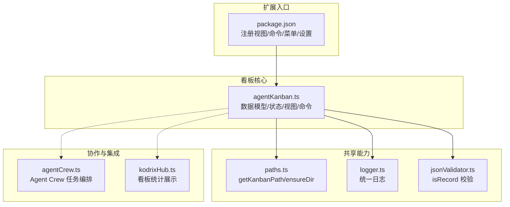
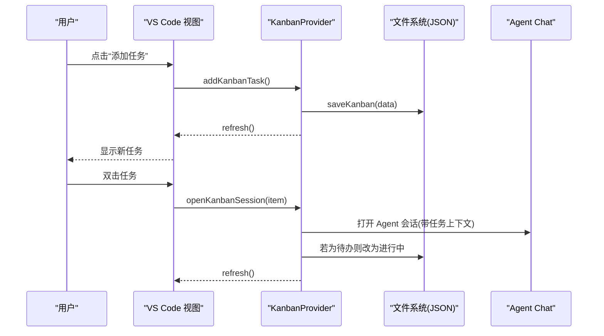
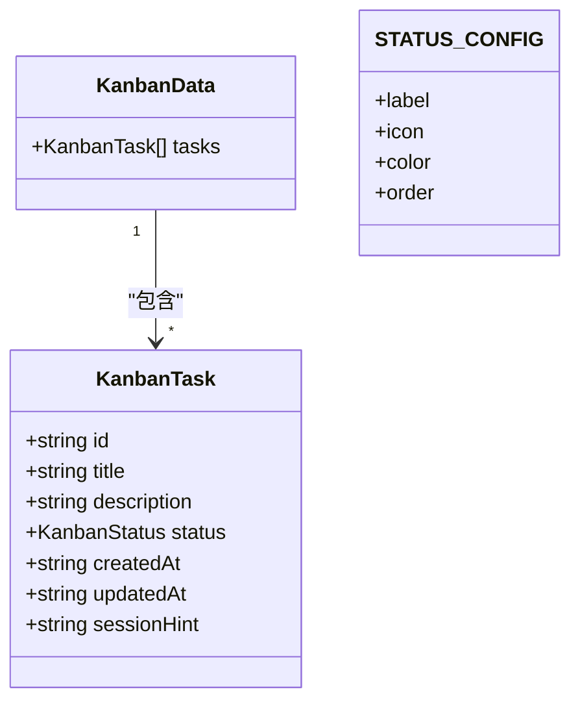
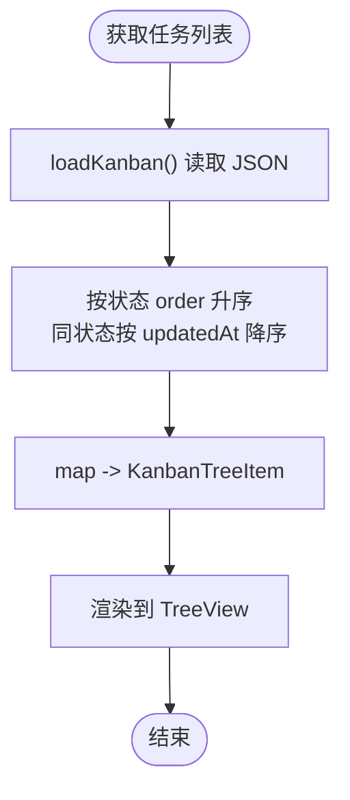
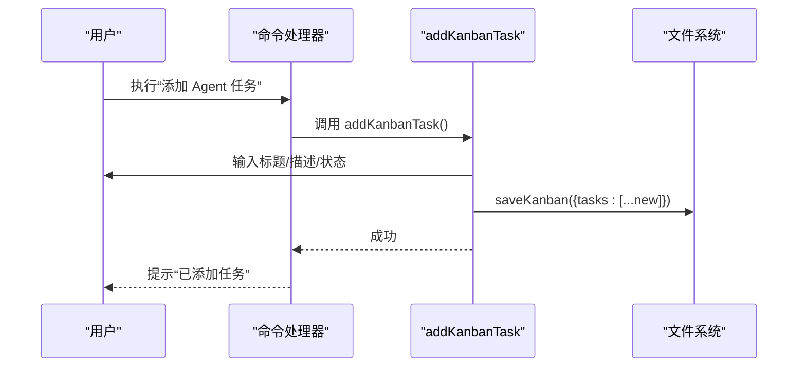
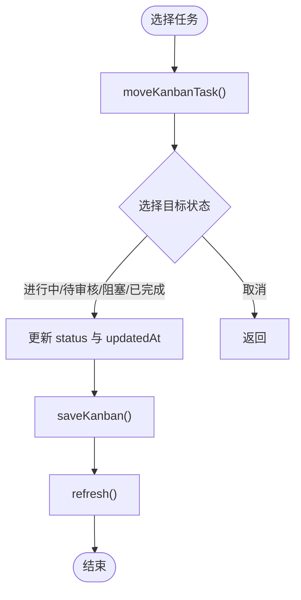
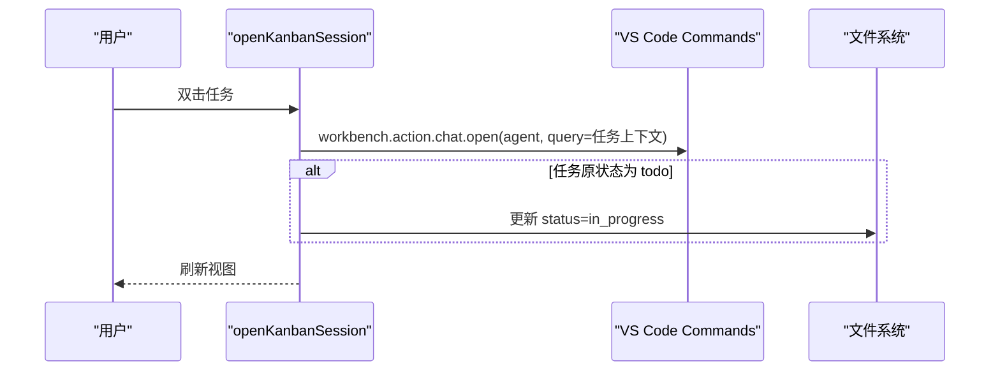
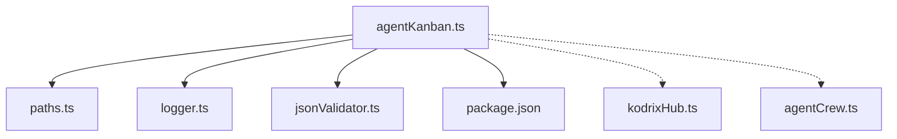

# Kanban 任务看板

<cite>
**本文引用的文件**   
- [agentKanban.ts](file://extensions/kodrix-agent-os/src/kanban/agentKanban.ts)
- [package.json](file://extensions/kodrix-agent-os/package.json)
- [paths.ts](file://extensions/kodrix-agent-os/src/paths.ts)
- [logger.ts](file://extensions/kodrix-agent-os/src/logger.ts)
- [jsonValidator.ts](file://extensions/kodrix-agent-os/src/utils/jsonValidator.ts)
- [kodrixHub.ts](file://extensions/kodrix-agent-os/src/experience/kodrixHub.ts)
- [agentCrew.ts](file://extensions/kodrix-agent-os/src/crew/agentCrew.ts)
</cite>

## 目录
1. [简介](#简介)
2. [项目结构](#项目结构)
3. [核心组件](#核心组件)
4. [架构总览](#架构总览)
5. [详细组件分析](#详细组件分析)
6. [依赖关系分析](#依赖关系分析)
7. [性能与可扩展性](#性能与可扩展性)
8. [故障排查指南](#故障排查指南)
9. [结论](#结论)
10. [附录：配置与集成示例](#附录配置与集成示例)

## 简介
本文件面向“Kodrix Agent OS”扩展中的 **Kanban 任务看板**，系统性说明其数据模型、状态定义、列布局、任务创建/分配/跟踪/完成流程、团队协作与权限控制现状、冲突处理策略、视图渲染与交互机制、实时更新方式，以及与 Agent 工作流（尤其是 Crew）的集成和数据同步机制。文档同时给出可操作的配置项、自定义列类型建议、以及外部工具集成的接口思路。

## 项目结构
Kanban 功能位于 `extensions/kodrix-agent-os` 扩展中，核心实现集中在 `src/kanban/agentKanban.ts`，并通过 VS Code 扩展清单注册命令、菜单和视图。持久化路径由共享路径模块提供，日志通过统一 logger 输出，看板统计被 Hub 页面消费。

**图表来源**
- [package.json:69-77](file://extensions/kodrix-agent-os/package.json#L69-L77)
- [package.json:120-148](file://extensions/kodrix-agent-os/package.json#L120-L148)
- [package.json:512-537](file://extensions/kodrix-agent-os/package.json#L512-L537)
- [package.json:566-570](file://extensions/kodrix-agent-os/package.json#L566-L570)
- [package.json:647-651](file://extensions/kodrix-agent-os/package.json#L647-L651)
- [agentKanban.ts:1-12](file://extensions/kodrix-agent-os/src/kanban/agentKanban.ts#L1-L12)
- [agentKanban.ts:268-294](file://extensions/kodrix-agent-os/src/kanban/agentKanban.ts#L268-L294)
- [kodrixHub.ts:39-45](file://extensions/kodrix-agent-os/src/experience/kodrixHub.ts#L39-L45)

**章节来源**
- [agentKanban.ts:1-12](file://extensions/kodrix-agent-os/src/kanban/agentKanban.ts#L1-L12)
- [package.json:69-77](file://extensions/kodrix-agent-os/package.json#L69-L77)
- [package.json:120-148](file://extensions/kodrix-agent-os/package.json#L120-L148)
- [package.json:512-537](file://extensions/kodrix-agent-os/package.json#L512-L537)
- [package.json:566-570](file://extensions/kodrix-agent-os/package.json#L566-L570)
- [package.json:647-651](file://extensions/kodrix-agent-os/package.json#L647-L651)

## 核心组件
- 数据模型与状态
  - 任务类型：`KanbanTask`
  - 状态枚举：`KanbanStatus`
  - 看板数据结构：`KanbanData`
  - 状态元信息：`STATUS_CONFIG`
- 视图与交互
  - 树节点：`KanbanTreeItem`
  - 数据提供者：`KanbanProvider`
- 命令与操作
  - 添加任务：`addKanbanTask`
  - 移动状态：`moveKanbanTask`
  - 打开会话：`openKanbanSession`
  - 删除任务：`deleteKanbanTask`
  - 刷新与聚焦：`registerKanban`
- 持久化与统计
  - 读取/写入：`loadKanban` / `saveKanban`
  - 统计：`getKanbanStats`

**章节来源**
- [agentKanban.ts:12-34](file://extensions/kodrix-agent-os/src/kanban/agentKanban.ts#L12-L34)
- [agentKanban.ts:36-61](file://extensions/kodrix-agent-os/src/kanban/agentKanban.ts#L36-L61)
- [agentKanban.ts:75-136](file://extensions/kodrix-agent-os/src/kanban/agentKanban.ts#L75-L136)
- [agentKanban.ts:138-255](file://extensions/kodrix-agent-os/src/kanban/agentKanban.ts#L138-L255)
- [agentKanban.ts:257-294](file://extensions/kodrix-agent-os/src/kanban/agentKanban.ts#L257-L294)

## 架构总览
看板以 VS Code Tree View 为载体，通过 `TreeDataProvider` 从本地 JSON 文件加载任务列表，按状态顺序与更新时间排序后渲染。所有写操作均落盘并触发视图刷新。看板与 Agent Chat 打通，支持从看板直接打开 Agent 会话；看板统计被 Hub 页面聚合展示。

**图表来源**
- [agentKanban.ts:138-175](file://extensions/kodrix-agent-os/src/kanban/agentKanban.ts#L138-L175)
- [agentKanban.ts:211-238](file://extensions/kodrix-agent-os/src/kanban/agentKanban.ts#L211-L238)
- [agentKanban.ts:268-294](file://extensions/kodrix-agent-os/src/kanban/agentKanban.ts#L268-L294)

## 详细组件分析

### 数据模型与状态定义
- `KanbanTask`
  - 字段包括唯一标识、标题、可选描述、状态、创建时间、更新时间、可选会话提示。
- `KanbanStatus`
  - 包含五种状态：`todo`（待办）、`in_progress`（进行中）、`review`（待审核）、`blocked`（阻塞）、`done`（已完成）。
- `STATUS_CONFIG`
  - 为每个状态定义标签、图标、主题色与排序权重，用于视图渲染与排序。
- `KanbanData`
  - 仅包含任务数组，作为 JSON 文件的根结构。

**图表来源**
- [agentKanban.ts:12-34](file://extensions/kodrix-agent-os/src/kanban/agentKanban.ts#L12-L34)

**章节来源**
- [agentKanban.ts:12-34](file://extensions/kodrix-agent-os/src/kanban/agentKanban.ts#L12-L34)

### 列布局与视图渲染
- 列布局
  - 当前采用“扁平列表”而非多列拖拽看板。任务按 `STATUS_CONFIG.order` 升序排列，同状态内按更新时间倒序。
- 视图渲染
  - `KanbanTreeItem` 根据任务状态选择图标与颜色，并在 tooltip 中展示描述、状态、创建/更新时间及关联会话提示。
  - `KanbanProvider.getChildren` 负责加载数据、排序与映射为树节点。
- 交互
  - 双击任务打开 Agent 会话；右键或行内菜单提供“移动状态”“打开会话”“删除任务”。

**图表来源**
- [agentKanban.ts:111-136](file://extensions/kodrix-agent-os/src/kanban/agentKanban.ts#L111-L136)
- [agentKanban.ts:75-109](file://extensions/kodrix-agent-os/src/kanban/agentKanban.ts#L75-L109)

**章节来源**
- [agentKanban.ts:75-136](file://extensions/kodrix-agent-os/src/kanban/agentKanban.ts#L75-L136)

### 任务生命周期流程

#### 创建任务
- 通过命令 `kodrix.kanban.addTask` 调用 `addKanbanTask`。
- 依次输入标题、描述（可选），选择初始状态（默认“待办”，也可选“立即开始”）。
- 生成唯一 ID，写入 JSON，刷新视图。

**图表来源**
- [agentKanban.ts:138-175](file://extensions/kodrix-agent-os/src/kanban/agentKanban.ts#L138-L175)
- [agentKanban.ts:54-61](file://extensions/kodrix-agent-os/src/kanban/agentKanban.ts#L54-L61)

**章节来源**
- [agentKanban.ts:138-175](file://extensions/kodrix-agent-os/src/kanban/agentKanban.ts#L138-L175)

#### 分配与跟踪
- 分配
  - 当前看板任务未绑定具体人员；可通过 `sessionHint` 记录关联会话或人工备注。
- 跟踪
  - 使用 `createdAt` / `updatedAt` 展示相对时间（如“刚刚”“X分钟前”“X小时前”等）。
  - 在 tooltip 中展示完整时间戳与描述。

**章节来源**
- [agentKanban.ts:63-73](file://extensions/kodrix-agent-os/src/kanban/agentKanban.ts#L63-L73)
- [agentKanban.ts:91-101](file://extensions/kodrix-agent-os/src/kanban/agentKanban.ts#L91-L101)

#### 完成与关闭
- 完成
  - 通过“移动任务状态”将任务移动到“已完成”。
- 关闭
  - 删除任务会二次确认，确认后从列表中移除并保存。

**图表来源**
- [agentKanban.ts:177-209](file://extensions/kodrix-agent-os/src/kanban/agentKanban.ts#L177-L209)
- [agentKanban.ts:240-255](file://extensions/kodrix-agent-os/src/kanban/agentKanban.ts#L240-L255)

**章节来源**
- [agentKanban.ts:177-209](file://extensions/kodrix-agent-os/src/kanban/agentKanban.ts#L177-L209)
- [agentKanban.ts:240-255](file://extensions/kodrix-agent-os/src/kanban/agentKanban.ts#L240-L255)

### 与 Agent 工作流的集成

#### 看板 → Agent Chat
- 双击任务打开 Agent Chat，自动注入任务标题与描述。
- 若任务原状态为“待办”，打开会话时自动改为“进行中”。

**图表来源**
- [agentKanban.ts:211-238](file://extensions/kodrix-agent-os/src/kanban/agentKanban.ts#L211-L238)

**章节来源**
- [agentKanban.ts:211-238](file://extensions/kodrix-agent-os/src/kanban/agentKanban.ts#L211-L238)

#### 看板 ↔ Crew 任务
- Crew 是更高级的多智能体编排层，拥有独立的任务模型与执行器。
- 看板任务与 Crew 任务并非同一实体；二者可通过约定（如标题/描述/会话提示）进行关联，但代码中未实现双向自动同步。
- 建议在任务描述或 `sessionHint` 中引用 Crew 任务 ID，或在 Crew 报告中回链看板任务。

**图表来源**
- [agentKanban.ts:14-22](file://extensions/kodrix-agent-os/src/kanban/agentKanban.ts#L14-L22)
- [agentCrew.ts:50-80](file://extensions/kodrix-agent-os/src/crew/agentCrew.ts#L50-L80)

**章节来源**
- [agentKanban.ts:14-22](file://extensions/kodrix-agent-os/src/kanban/agentKanban.ts#L14-L22)
- [agentCrew.ts:50-80](file://extensions/kodrix-agent-os/src/crew/agentCrew.ts#L50-L80)

### 团队协作机制、权限控制与冲突解决
- 团队协作
  - 当前看板无内置成员管理与会话级协作；可通过 `sessionHint` 记录负责人或会话链接。
- 权限控制
  - 未实现基于角色的访问控制；所有具备工作区访问权限的用户均可读写看板 JSON。
- 冲突解决
  - 当前为单进程 VS Code 扩展运行，不存在并发写竞争。
  - 若多人编辑同一工作区且各自修改看板 JSON，可能出现覆盖问题。建议：
    - 避免多人同时编辑看板文件；
    - 或将看板迁移至版本控制系统（Git）以获得合并历史与冲突提示。

**章节来源**
- [agentKanban.ts:36-61](file://extensions/kodrix-agent-os/src/kanban/agentKanban.ts#L36-L61)

### 拖拽交互与实时更新
- 拖拽
  - 当前未实现拖拽列间移动；状态变更通过“移动任务状态”命令完成。
- 实时更新
  - 每次写操作后调用 `provider.refresh()` 触发视图重绘。
  - 未实现文件监听实时同步；如需实时同步，可在 `registerKanban` 中增加 `fs.watch` 监听看板文件变化并刷新视图。

**章节来源**
- [agentKanban.ts:268-294](file://extensions/kodrix-agent-os/src/kanban/agentKanban.ts#L268-L294)

## 依赖关系分析

**图表来源**
- [agentKanban.ts:5-9](file://extensions/kodrix-agent-os/src/kanban/agentKanban.ts#L5-L9)
- [agentKanban.ts:268-294](file://extensions/kodrix-agent-os/src/kanban/agentKanban.ts#L268-L294)
- [kodrixHub.ts:39-45](file://extensions/kodrix-agent-os/src/experience/kodrixHub.ts#L39-L45)

**章节来源**
- [agentKanban.ts:5-9](file://extensions/kodrix-agent-os/src/kanban/agentKanban.ts#L5-L9)
- [agentKanban.ts:268-294](file://extensions/kodrix-agent-os/src/kanban/agentKanban.ts#L268-L294)
- [kodrixHub.ts:39-45](file://extensions/kodrix-agent-os/src/experience/kodrixHub.ts#L39-L45)

## 性能与可扩展性
- 性能
  - 看板数据量较小时，JSON 全量读写与排序开销可忽略。
  - 当任务数量增长时，建议：
    - 分页或虚拟滚动；
    - 对大文件进行增量更新（追加日志+快照）；
    - 引入索引（如按状态分片存储）。
- 可扩展性
  - 自定义列类型：可在 `STATUS_CONFIG` 中新增状态，并在 `moveKanbanTask` 的状态选择中加入新状态。
  - 自定义渲染：扩展 `KanbanTreeItem` 的 tooltip、命令或图标。
  - 外部集成：通过命令暴露 API，供其他扩展或脚本调用。

**章节来源**
- [agentKanban.ts:28-34](file://extensions/kodrix-agent-os/src/kanban/agentKanban.ts#L28-L34)
- [agentKanban.ts:177-209](file://extensions/kodrix-agent-os/src/kanban/agentKanban.ts#L177-L209)

## 故障排查指南
- 无法打开工作区
  - 现象：添加任务时提示“请先打开工作区”。
  - 原因：未打开任何工作区导致看板路径不可用。
  - 处理：先打开一个工作区。
- 看板数据损坏
  - 现象：加载失败，控制台出现警告。
  - 原因：JSON 结构不合法或缺少 `tasks` 数组。
  - 处理：系统会自动重置为空看板；检查并修复 JSON 文件。
- 看板未显示
  - 现象：侧边栏没有“Agent 看板”。
  - 原因：功能开关被关闭。
  - 处理：启用设置 `kodrix.features.kanban`。
- 已完成任务不显示
  - 现象：看不到“已完成”任务。
  - 原因：设置 `kodrix.kanban.showCompleted` 为 false。
  - 处理：开启该设置。

**章节来源**
- [agentKanban.ts:138-142](file://extensions/kodrix-agent-os/src/kanban/agentKanban.ts#L138-L142)
- [agentKanban.ts:36-51](file://extensions/kodrix-agent-os/src/kanban/agentKanban.ts#L36-L51)
- [package.json:566-570](file://extensions/kodrix-agent-os/package.json#L566-L570)
- [package.json:647-651](file://extensions/kodrix-agent-os/package.json#L647-L651)

## 结论
Kanban 看板提供了轻量、直观的任务管理与 Agent 会话联动能力，适合个人或小团队快速推进开发。当前实现以 VS Code Tree View 为中心，通过 JSON 文件持久化，并与 Agent Chat 打通。若需更强的协作与可视化体验，可在现有基础上扩展列布局、拖拽、权限控制与实时同步，并将看板与 Crew 任务建立更紧密的双向集成。

## 附录：配置与集成示例

### 看板配置项
- 功能开关
  - `kodrix.features.kanban`：启用/禁用 Agent 看板。
- 显示选项
  - `kodrix.kanban.showCompleted`：在看板中显示已完成任务。

**章节来源**
- [package.json:566-570](file://extensions/kodrix-agent-os/package.json#L566-L570)
- [package.json:647-651](file://extensions/kodrix-agent-os/package.json#L647-L651)

### 自定义列类型（状态）
- 步骤
  - 在 `STATUS_CONFIG` 中添加新状态键值（含 label/icon/color/order）。
  - 在 `moveKanbanTask` 的状态选择中加入新状态。
  - 根据需要调整 `KanbanTreeItem` 的颜色或图标逻辑。

**章节来源**
- [agentKanban.ts:28-34](file://extensions/kodrix-agent-os/src/kanban/agentKanban.ts#L28-L34)
- [agentKanban.ts:177-209](file://extensions/kodrix-agent-os/src/kanban/agentKanban.ts#L177-L209)

### 与外部工具集成
- 通过命令暴露能力
  - `kodrix.kanban.addTask`
  - `kodrix.kanban.moveTask`
  - `kodrix.kanban.openSession`
  - `kodrix.kanban.deleteTask`
  - `kodrix.kanban.refresh`
  - `kodrix.kanban.focus`
- 外部脚本或扩展可通过 VS Code Command API 调用上述命令，实现自动化创建、流转与查看看板任务。

**章节来源**
- [package.json:120-148](file://extensions/kodrix-agent-os/package.json#L120-L148)
- [agentKanban.ts:268-294](file://extensions/kodrix-agent-os/src/kanban/agentKanban.ts#L268-L294)

### 与 Agent 工作流的数据同步建议
- 看板任务 ↔ Crew 任务
  - 在任务描述或 `sessionHint` 中记录对方任务的 ID 或链接。
  - 在 Crew 执行报告或看板任务结果中回链对方。
  - 未来可实现双向同步：当 Crew 任务状态变化时，自动更新看板任务状态；反之亦然。

**章节来源**
- [agentKanban.ts:14-22](file://extensions/kodrix-agent-os/src/kanban/agentKanban.ts#L14-L22)
- [agentCrew.ts:50-80](file://extensions/kodrix-agent-os/src/crew/agentCrew.ts#L50-L80)