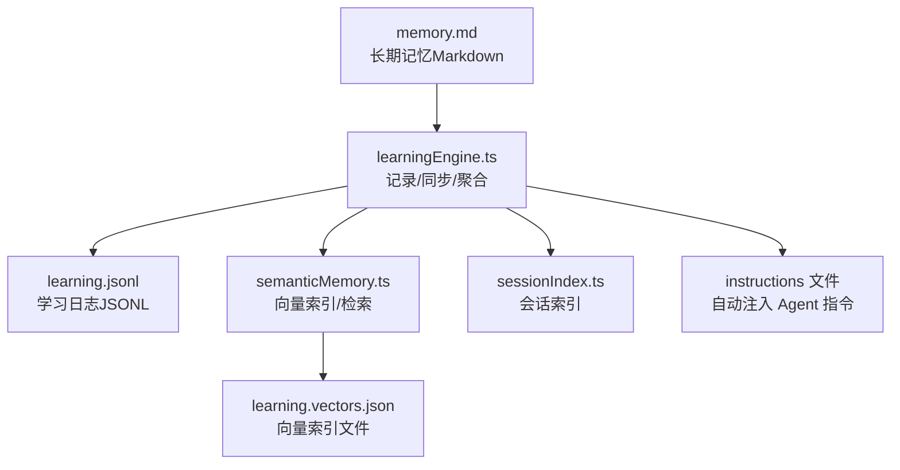
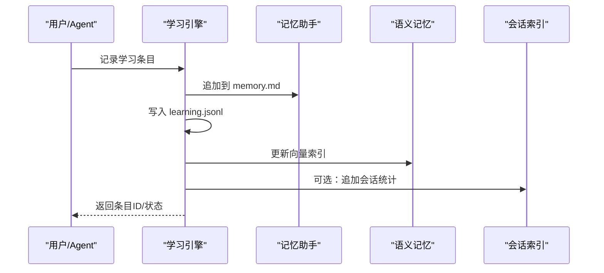
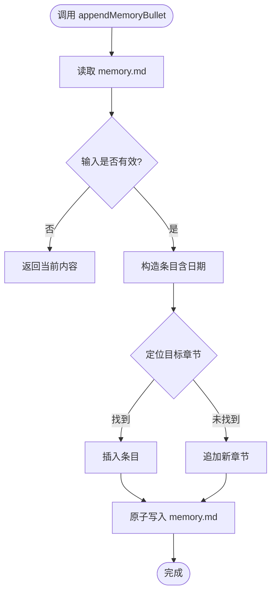
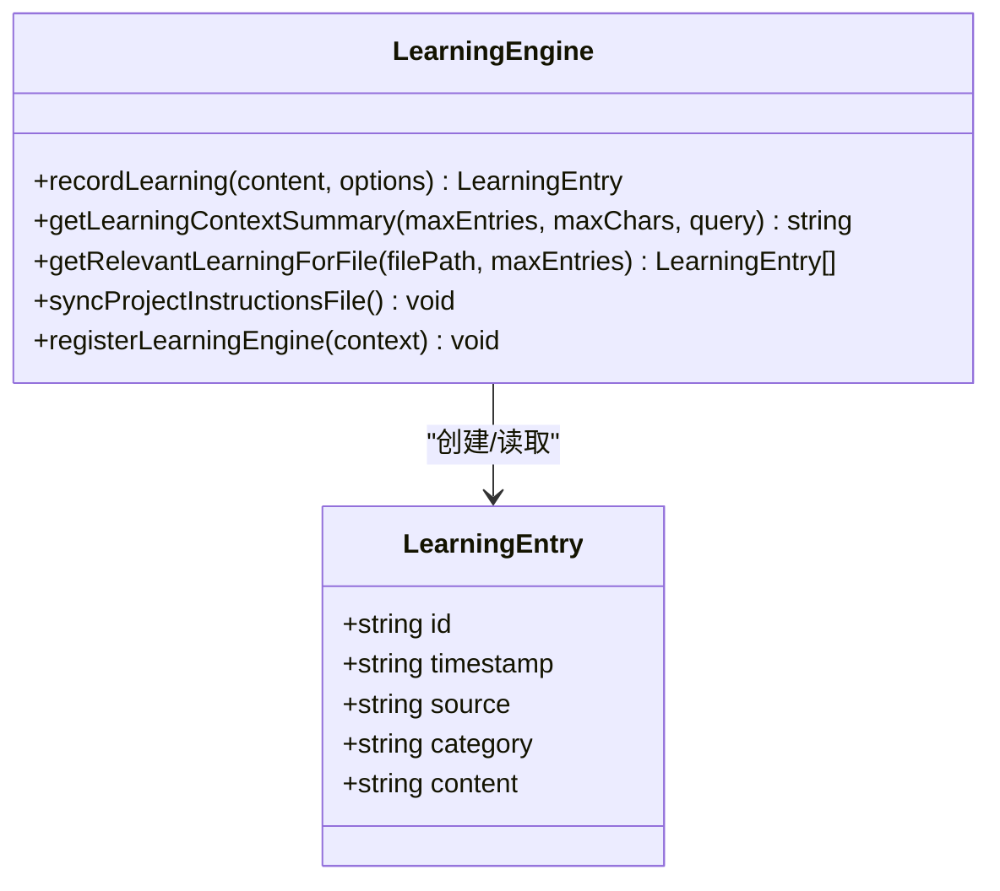
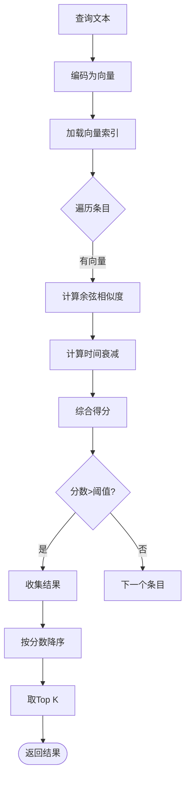
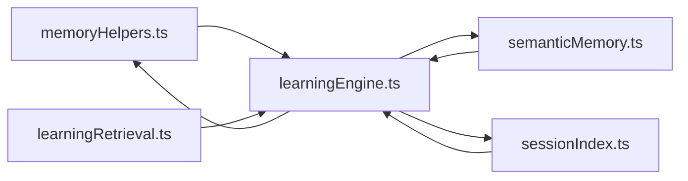

# Memory 记忆系统

<cite>
**本文引用的文件**
- [memoryHelpers.ts](file://extensions/kodrix-agent-os/src/memory/memoryHelpers.ts)
- [semanticMemory.ts](file://extensions/kodrix-agent-os/src/learning/semanticMemory.ts)
- [learningEngine.ts](file://extensions/kodrix-agent-os/src/learning/learningEngine.ts)
- [learningRetrieval.ts](file://extensions/kodrix-agent-os/src/learning/learningRetrieval.ts)
- [sessionIndex.ts](file://extensions/kodrix-agent-os/src/learning/sessionIndex.ts)
</cite>

## 目录
1. [简介](#简介)
2. [项目结构](#项目结构)
3. [核心组件](#核心组件)
4. [架构总览](#架构总览)
5. [详细组件分析](#详细组件分析)
6. [依赖关系分析](#依赖关系分析)
7. [性能考量](#性能考量)
8. [故障排查指南](#故障排查指南)
9. [结论](#结论)
10. [附录](#附录)

## 简介
本文件系统化梳理 Kodrix Agent OS 中的 Memory 记忆系统，覆盖存储结构、索引机制、检索算法、短期/长期/工作记忆的区分与管理策略，以及编码、压缩、去重、过期清理、记忆图谱、相似度计算、上下文关联等关键能力。同时提供查询 API、批量操作接口与性能调优建议，并说明如何扩展新的记忆类型与检索策略。

## 项目结构
记忆系统由“持久化记忆”“学习日志”“语义向量索引”“会话索引”四部分组成：
- 持久化记忆：以 Markdown 形式维护 memory.md，作为人类可读的长期知识基线。
- 学习日志：JSONL 格式记录结构化学习条目（LearningEntry），用于跨会话沉淀。
- 语义向量索引：TF-IDF 词向量 + 余弦相似度，实现语义检索与时间衰减排序。
- 会话索引：记录会话处理统计，辅助仪表盘展示与增量重建。

图表来源
- [memoryHelpers.ts:35-99](file://extensions/kodrix-agent-os/src/memory/memoryHelpers.ts#L35-L99)
- [learningEngine.ts:86-157](file://extensions/kodrix-agent-os/src/learning/learningEngine.ts#L86-L157)
- [semanticMemory.ts:24-81](file://extensions/kodrix-agent-os/src/learning/semanticMemory.ts#L24-L81)
- [sessionIndex.ts:19-48](file://extensions/kodrix-agent-os/src/learning/sessionIndex.ts#L19-L48)

章节来源
- [memoryHelpers.ts:35-99](file://extensions/kodrix-agent-os/src/memory/memoryHelpers.ts#L35-L99)
- [learningEngine.ts:86-157](file://extensions/kodrix-agent-os/src/learning/learningEngine.ts#L86-L157)
- [semanticMemory.ts:24-81](file://extensions/kodrix-agent-os/src/learning/semanticMemory.ts#L24-L81)
- [sessionIndex.ts:19-48](file://extensions/kodrix-agent-os/src/learning/sessionIndex.ts#L19-L48)

## 核心组件
- 记忆读写助手（memoryHelpers.ts）
  - 负责 memory.md 的读取、确保存在、追加条目与原子写入。
  - 默认模板包含架构偏好、命名规范、常用库、团队约定、已知陷阱等章节。
- 学习引擎（learningEngine.ts）
  - 记录学习条目（LearningEntry）、分类推断、写入 JSONL、触发语义索引更新、限流同步 Instructions 文件。
  - 提供上下文摘要、相关条目检索、统计信息、Dashboard 面板与命令注册。
- 语义记忆（semanticMemory.ts）
  - 维护 TF-IDF 向量索引（learning.vectors.json），支持按查询文本进行相似度检索，加入时间衰减。
  - 提供重建索引、统计、智能建议等能力。
- 分类推断（learningRetrieval.ts）
  - 基于关键词启发式将内容归类为架构、约定、模式、陷阱、偏好等类别。
- 会话索引（sessionIndex.ts）
  - 维护会话处理统计，供 Dashboard 展示与增量重建参考。

章节来源
- [memoryHelpers.ts:35-99](file://extensions/kodrix-agent-os/src/memory/memoryHelpers.ts#L35-L99)
- [learningEngine.ts:61-157](file://extensions/kodrix-agent-os/src/learning/learningEngine.ts#L61-L157)
- [semanticMemory.ts:24-81](file://extensions/kodrix-agent-os/src/learning/semanticMemory.ts#L24-L81)
- [learningRetrieval.ts:11-30](file://extensions/kodrix-agent-os/src/learning/learningRetrieval.ts#L11-L30)
- [sessionIndex.ts:19-48](file://extensions/kodrix-agent-os/src/learning/sessionIndex.ts#L19-L48)

## 架构总览
记忆系统采用“双轨”设计：
- 长期记忆（memory.md）：人类可读、可编辑，作为项目约定与偏好的权威源。
- 学习日志（learning.jsonl）+ 语义索引（learning.vectors.json）：机器可读、可检索，支撑“越用越聪明”的主动上下文补全。

图表来源
- [learningEngine.ts:98-126](file://extensions/kodrix-agent-os/src/learning/learningEngine.ts#L98-L126)
- [memoryHelpers.ts:72-99](file://extensions/kodrix-agent-os/src/memory/memoryHelpers.ts#L72-L99)
- [semanticMemory.ts:132-141](file://extensions/kodrix-agent-os/src/learning/semanticMemory.ts#L132-L141)
- [sessionIndex.ts:50-54](file://extensions/kodrix-agent-os/src/learning/sessionIndex.ts#L50-L54)

## 详细组件分析

### 组件A：记忆读写助手（memoryHelpers.ts）
- 职责
  - 只读读取 memory.md 内容，不存在时返回默认模板但不写盘。
  - 确保 memory.md 存在（首次写入默认模板）。
  - 在指定章节下插入新条目（优先“捕获记录”，其次“团队约定”）。
  - 原子写入避免并发损坏。
- 数据结构
  - memory.md：Markdown 文档，包含多个章节；新增条目带日期后缀。
- 复杂度
  - 插入操作按行扫描，时间复杂度 O(n)，n 为行数。
- 错误处理
  - 文件不存在或读取失败时返回默认内容或跳过。
- 优化点
  - 对大文件可考虑缓存行号映射或使用分段写入。

图表来源
- [memoryHelpers.ts:72-99](file://extensions/kodrix-agent-os/src/memory/memoryHelpers.ts#L72-L99)

章节来源
- [memoryHelpers.ts:35-99](file://extensions/kodrix-agent-os/src/memory/memoryHelpers.ts#L35-L99)

### 组件B：学习引擎（learningEngine.ts）
- 职责
  - 记录学习条目（LearningEntry），写入 JSONL，触发语义索引更新，限流同步 Instructions 文件。
  - 生成上下文摘要、相关条目检索、统计信息、Dashboard 面板。
  - 启动时延迟重建语义索引，避免阻塞激活。
- 数据结构
  - LearningEntry：id、timestamp、source、category、content。
  - Instructions 文件：包含 frontmatter 与自动生成的近期学习摘要。
- 复杂度
  - 记录条目：O(1) 追加；索引更新：O(d) 维度 d=128；检索：O(m·d) m 为条目数。
- 错误处理
  - JSONL 解析异常跳过；Instructions 同步失败不影响主流程。
- 优化点
  - 限流写入 Instructions；日志超限后保留最新 N 条；使用原子写入。

图表来源
- [learningEngine.ts:30-36](file://extensions/kodrix-agent-os/src/learning/learningEngine.ts#L30-L36)
- [learningEngine.ts:98-157](file://extensions/kodrix-agent-os/src/learning/learningEngine.ts#L98-L157)
- [learningEngine.ts:340-359](file://extensions/kodrix-agent-os/src/learning/learningEngine.ts#L340-L359)

章节来源
- [learningEngine.ts:61-157](file://extensions/kodrix-agent-os/src/learning/learningEngine.ts#L61-L157)
- [learningEngine.ts:340-359](file://extensions/kodrix-agent-os/src/learning/learningEngine.ts#L340-L359)

### 组件C：语义记忆（semanticMemory.ts）
- 职责
  - 维护向量索引（learning.vectors.json），支持语义检索与时间衰减排序。
  - 提供重建索引、统计、智能建议等能力。
- 数据结构
  - VectorIndex：version、dim、entries（id→向量）、updatedAt。
  - ScoredMemory：entry + score。
- 算法
  - 编码：TF-IDF 词向量（固定维度 128）。
  - 相似度：余弦相似度。
  - 时间衰减：半衰期 30 天，综合得分 = 相似度×(0.7 + 0.3×衰减)。
- 复杂度
  - 索引构建：O(m·d)；检索：O(m·d)；重建：O(m·d)。
- 错误处理
  - 索引文件损坏则重置；无效条目跳过。
- 优化点
  - 内存缓存 entries（基于 mtime 失效）；写入前清理无效 ID。

图表来源
- [semanticMemory.ts:148-186](file://extensions/kodrix-agent-os/src/learning/semanticMemory.ts#L148-L186)
- [semanticMemory.ts:215-236](file://extensions/kodrix-agent-os/src/learning/semanticMemory.ts#L215-L236)

章节来源
- [semanticMemory.ts:24-81](file://extensions/kodrix-agent-os/src/learning/semanticMemory.ts#L24-L81)
- [semanticMemory.ts:132-186](file://extensions/kodrix-agent-os/src/learning/semanticMemory.ts#L132-L186)
- [semanticMemory.ts:215-250](file://extensions/kodrix-agent-os/src/learning/semanticMemory.ts#L215-L250)

### 组件D：分类推断（learningRetrieval.ts）
- 职责
  - 基于关键词启发式将内容归类为架构、约定、模式、陷阱、偏好等类别。
- 复杂度
  - 正则匹配，时间复杂度 O(n)，n 为内容长度。
- 错误处理
  - 无匹配时归为 other。

章节来源
- [learningRetrieval.ts:11-30](file://extensions/kodrix-agent-os/src/learning/learningRetrieval.ts#L11-L30)

### 组件E：会话索引（sessionIndex.ts）
- 职责
  - 维护会话处理统计，供 Dashboard 展示与增量重建参考。
- 数据结构
  - SessionIndexEntry：sessionId、processedAt、insightCount、userMessages、summary。
- 复杂度
  - 追加与保存：O(1) 追加，O(k) 保存（保留最近 k 条）。

章节来源
- [sessionIndex.ts:19-48](file://extensions/kodrix-agent-os/src/learning/sessionIndex.ts#L19-L48)
- [sessionIndex.ts:50-63](file://extensions/kodrix-agent-os/src/learning/sessionIndex.ts#L50-L63)

## 依赖关系分析
- memoryHelpers.ts 被 learningEngine.ts 引用，用于持久化 memory.md。
- learningEngine.ts 依赖 semanticMemory.ts 进行索引更新与检索，依赖 learningRetrieval.ts 进行分类推断，依赖 sessionIndex.ts 获取会话统计。
- semanticMemory.ts 依赖路径工具与文本向量化模块（共享），并读取 learning.jsonl。

图表来源
- [learningEngine.ts:11-20](file://extensions/kodrix-agent-os/src/learning/learningEngine.ts#L11-L20)
- [semanticMemory.ts:12-18](file://extensions/kodrix-agent-os/src/learning/semanticMemory.ts#L12-L18)
- [memoryHelpers.ts:5-7](file://extensions/kodrix-agent-os/src/memory/memoryHelpers.ts#L5-L7)

章节来源
- [learningEngine.ts:11-20](file://extensions/kodrix-agent-os/src/learning/learningEngine.ts#L11-L20)
- [semanticMemory.ts:12-18](file://extensions/kodrix-agent-os/src/learning/semanticMemory.ts#L12-L18)
- [memoryHelpers.ts:5-7](file://extensions/kodrix-agent-os/src/memory/memoryHelpers.ts#L5-L7)

## 性能考量
- 索引构建与检索
  - 向量维度固定为 128，检索复杂度 O(m·d)，m 为条目数；可通过限制 topK 与过滤低分结果降低开销。
- 缓存策略
  - 语义记忆模块对 entries 使用内存缓存，基于文件 mtime 失效，减少重复读盘。
- 写入优化
  - Instructions 同步限流（1s 内仅一次）；JSONL 超限时保留最新 N 条；原子写入避免竞争。
- I/O 优化
  - 延迟重建语义索引至扩展激活后，避免阻塞启动。
- 可扩展性
  - 若条目规模增长，可引入分页检索、增量索引更新、磁盘索引分片等策略。

[本节为通用指导，不直接分析具体文件]

## 故障排查指南
- 语义索引损坏
  - 现象：loadIndex 抛出异常或形状无效。
  - 处理：重置索引为空，等待下次重建；检查 learning.jsonl 完整性。
- JSONL 解析异常
  - 现象：学习日志中存在损坏行。
  - 处理：跳过损坏行；必要时清理或重建索引。
- Instructions 同步失败
  - 现象：写入 instructions 文件失败。
  - 处理：非关键错误，不影响主流程；检查权限与磁盘空间。
- 缓存不一致
  - 现象：entries 缓存未更新。
  - 处理：调用 invalidateEntryCache 或在写入后重新读取。

章节来源
- [semanticMemory.ts:45-60](file://extensions/kodrix-agent-os/src/learning/semanticMemory.ts#L45-L60)
- [learningEngine.ts:86-96](file://extensions/kodrix-agent-os/src/learning/learningEngine.ts#L86-L96)
- [semanticMemory.ts:125-128](file://extensions/kodrix-agent-os/src/learning/semanticMemory.ts#L125-L128)

## 结论
该记忆系统通过“长期记忆 + 学习日志 + 语义索引”的双轨设计，实现了人类可读与机器可检索的统一。短期/长期/工作记忆的区分体现在：
- 短期记忆：会话级上下文与临时缓存（如内存缓存 entries）。
- 长期记忆：memory.md 与 learning.jsonl，跨会话持久化。
- 工作记忆：检索过程中的中间结果（如 ScoredMemory 列表）。
系统具备编码（TF-IDF）、相似度（余弦）、时间衰减、压缩（日志截断）、去重（清理无效 ID）、过期清理（半衰期权重）等能力，并提供丰富的查询 API 与批量操作接口。未来可扩展新的记忆类型与检索策略，以提升准确率与性能。

[本节为总结性内容，不直接分析具体文件]

## 附录

### 记忆类型与管理策略
- 短期记忆
  - 用途：会话内临时上下文，如检索中间结果、UI 缓存。
  - 管理：内存缓存，基于 mtime 失效；会话结束后可丢弃。
- 长期记忆
  - 用途：项目约定、架构偏好、常见模式等。
  - 管理：memory.md 与 learning.jsonl；定期重建索引；日志截断保留最新条目。
- 工作记忆
  - 用途：检索过程中的评分、排序、TopK 结果。
  - 管理：函数作用域内变量；避免持久化。

[本节为概念性内容，不直接分析具体文件]

### 记忆查询 API 与批量操作
- 查询 API
  - searchSimilar(query, topK)：语义检索，返回 ScoredMemory 列表。
  - getSemanticContext(query, maxChars)：生成语义上下文摘要。
  - getTopicalMemories(contextHint, maxEntries)：基于上下文提示获取相关记忆。
  - getLearningContextSummary(maxEntries, maxChars, query?)：学习上下文摘要。
  - getRelevantLearningForFile(filePath, maxEntries)：文件相关学习条目。
- 批量操作
  - rebuildIndex()：重建全部索引。
  - indexLearningEntry(entry)：单条索引更新。
  - recordLearning(content, options)：记录学习条目并触发索引更新。
  - appendSessionIndex(entry)：追加会话统计。

章节来源
- [semanticMemory.ts:132-186](file://extensions/kodrix-agent-os/src/learning/semanticMemory.ts#L132-L186)
- [semanticMemory.ts:191-210](file://extensions/kodrix-agent-os/src/learning/semanticMemory.ts#L191-L210)
- [semanticMemory.ts:215-236](file://extensions/kodrix-agent-os/src/learning/semanticMemory.ts#L215-L236)
- [learningEngine.ts:98-126](file://extensions/kodrix-agent-os/src/learning/learningEngine.ts#L98-L126)
- [learningEngine.ts:159-181](file://extensions/kodrix-agent-os/src/learning/learningEngine.ts#L159-L181)
- [sessionIndex.ts:50-54](file://extensions/kodrix-agent-os/src/learning/sessionIndex.ts#L50-L54)

### 扩展指南
- 新增记忆类型
  - 在 LearningCategory 中扩展新类别；更新 inferLearningCategory 的分类规则。
  - 在 memory.md 模板中增加对应章节，便于人工维护。
- 新增检索策略
  - 在 semanticMemory 中扩展编码与相似度算法；保持维度一致或动态适配。
  - 提供新的查询 API，并在 learningEngine 中集成上下文摘要与推荐。
- 性能调优
  - 调整 topK、阈值、半衰期等参数；引入分页与增量索引；监控索引大小与检索耗时。

章节来源
- [learningEngine.ts:27-36](file://extensions/kodrix-agent-os/src/learning/learningEngine.ts#L27-L36)
- [learningRetrieval.ts:11-30](file://extensions/kodrix-agent-os/src/learning/learningRetrieval.ts#L11-L30)
- [semanticMemory.ts:24-34](file://extensions/kodrix-agent-os/src/learning/semanticMemory.ts#L24-L34)
- [semanticMemory.ts:148-186](file://extensions/kodrix-agent-os/src/learning/semanticMemory.ts#L148-L186)