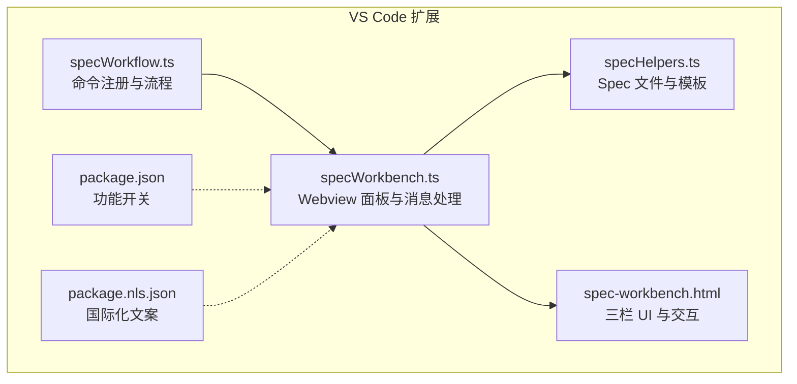
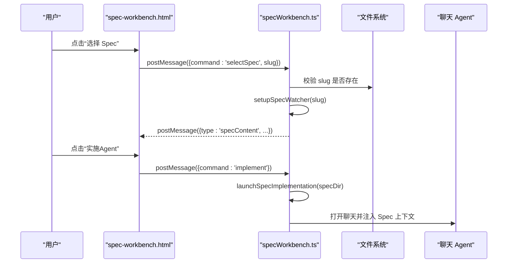
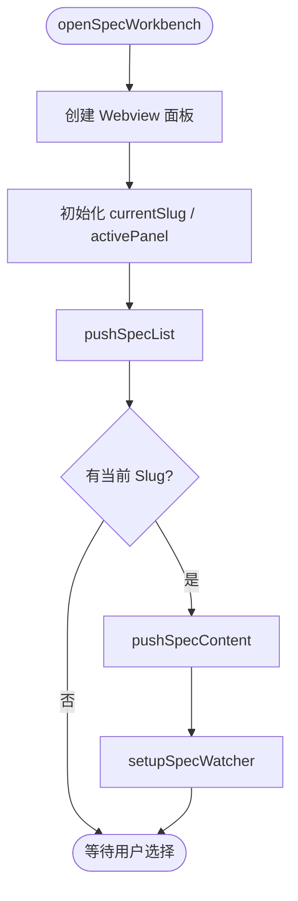
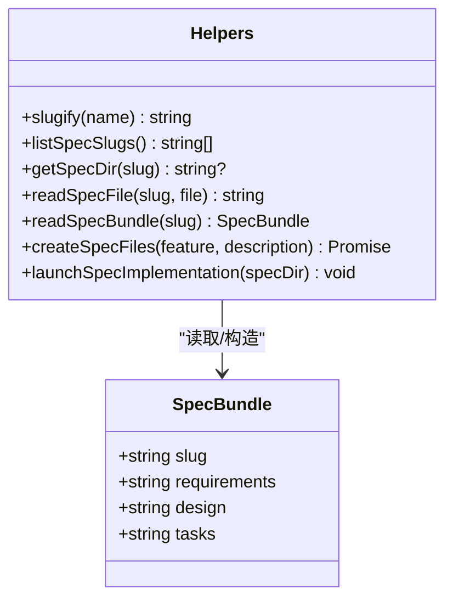
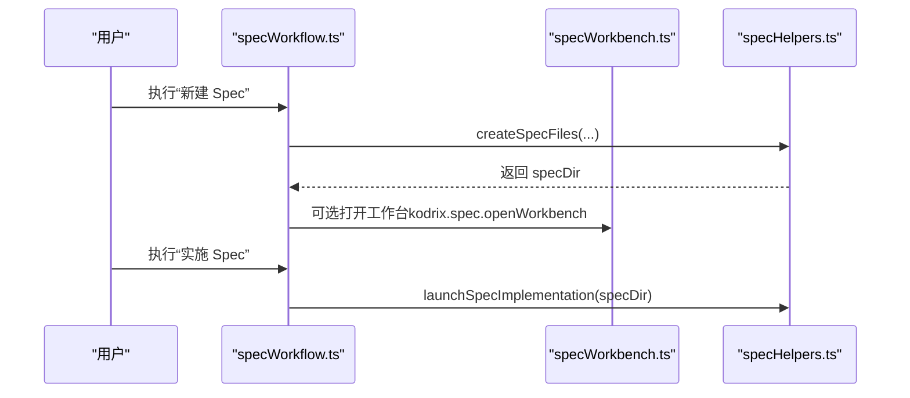
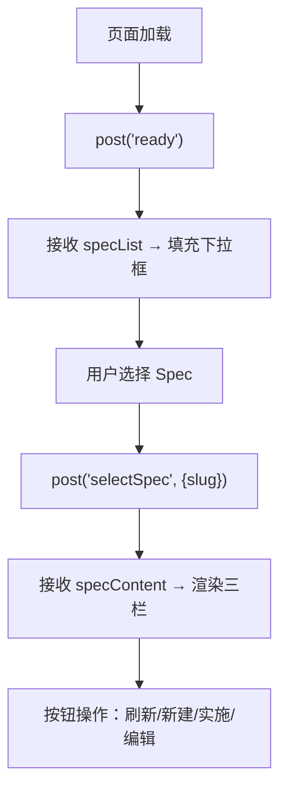
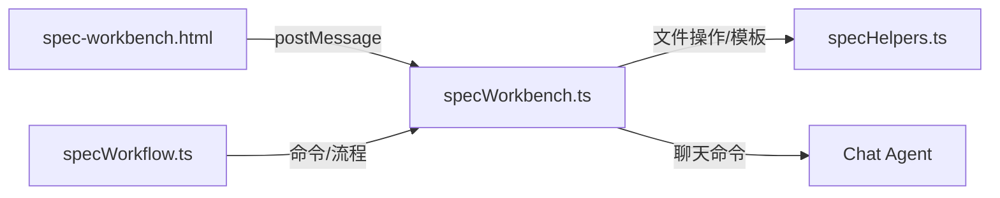

# Spec 工作台

<cite>
**本文引用的文件**   
- [specWorkbench.ts](file://extensions/kodrix-agent-os/src/spec/specWorkbench.ts)
- [specHelpers.ts](file://extensions/kodrix-agent-os/src/spec/specHelpers.ts)
- [specWorkflow.ts](file://extensions/kodrix-agent-os/src/spec/specWorkflow.ts)
- [spec-workbench.html](file://extensions/kodrix-agent-os/resources/spec-workbench.html)
- [package.json](file://extensions/kodrix-agent-os/package.json)
- [package.nls.json](file://extensions/kodrix-agent-os/package.nls.json)
</cite>

## 目录
1. [简介](#简介)
2. [项目结构](#项目结构)
3. [核心组件](#核心组件)
4. [架构总览](#架构总览)
5. [详细组件分析](#详细组件分析)
6. [依赖关系分析](#依赖关系分析)
7. [性能与体验特性](#性能与体验特性)
8. [配置项与主题定制](#配置项与主题定制)
9. [快捷键与扩展点](#快捷键与扩展点)
10. [常见使用场景与最佳实践](#常见使用场景与最佳实践)
11. [故障排查](#故障排查)
12. [结论](#结论)

## 简介
Spec 工作台是 Kodrix Agent OS 中的“需求→设计→任务”三栏式 Spec 驱动工作流实现，提供可视化编辑、实时预览、与 Agent 实施联动等能力。其 UI 基于 VS Code Webview 构建，后端通过 TypeScript 模块管理 Spec 文件、监听变更并桥接命令面板与聊天 Agent。

该文档面向两类读者：
- 使用者：了解如何创建/编辑/实施 Spec，以及如何利用工作台提升效率。
- 开发者：理解编辑器扩展点、数据模型、消息协议与可定制项，以便集成自定义组件或二次开发。

## 项目结构
Spec 工作台由以下关键部分组成：
- 后端逻辑：specWorkbench.ts（Webview 面板、消息处理、文件监听）
- 共享工具：specHelpers.ts（Spec 文件读写、模板生成、Agent 实施入口）
- 工作流命令：specWorkflow.ts（命令注册、创建/打开/实施流程）
- 前端界面：spec-workbench.html（三栏布局、按钮交互、列表渲染）
- 扩展配置：package.json（功能开关）、package.nls.json（国际化文案）

**图表来源**
- [specWorkbench.ts:143-191](file://extensions/kodrix-agent-os/src/spec/specWorkbench.ts#L143-L191)
- [specHelpers.ts:10-64](file://extensions/kodrix-agent-os/src/spec/specHelpers.ts#L10-L64)
- [specWorkflow.ts:81-87](file://extensions/kodrix-agent-os/src/spec/specWorkflow.ts#L81-L87)
- [spec-workbench.html:260-303](file://extensions/kodrix-agent-os/resources/spec-workbench.html#L260-L303)
- [package.json:555-560](file://extensions/kodrix-agent-os/package.json#L555-L560)
- [package.nls.json:16-19](file://extensions/kodrix-agent-os/package.nls.json#L16-L19)

**章节来源**
- [specWorkbench.ts:1-199](file://extensions/kodrix-agent-os/src/spec/specWorkbench.ts#L1-L199)
- [specHelpers.ts:1-268](file://extensions/kodrix-agent-os/src/spec/specHelpers.ts#L1-L268)
- [specWorkflow.ts:1-88](file://extensions/kodrix-agent-os/src/spec/specWorkflow.ts#L1-L88)
- [spec-workbench.html:1-393](file://extensions/kodrix-agent-os/resources/spec-workbench.html#L1-L393)
- [package.json:555-560](file://extensions/kodrix-agent-os/package.json#L555-L560)
- [package.nls.json:16-19](file://extensions/kodrix-agent-os/package.nls.json#L16-L19)

## 核心组件
- 三栏工作台面板：以 Webview 形式展示 Requirements、Design、Tasks 三列内容，支持选择已有 Spec、新建 Spec、在编辑器中打开对应文件、触发 Agent 实施。
- 文件监听与实时更新：基于文件系统监听器，当当前 Spec 的 .kodrix/specs/{slug} 下文件变化时，自动刷新 Webview 内容。
- Spec 数据模型：每个 Spec 包含 requirements.md、design.md、tasks.md 三个 Markdown 文件；提供 slug 作为唯一标识。
- 命令与工作流：提供创建、打开、实施 Spec 的命令，并与聊天 Agent 模式联动，将 Spec 内容作为提示词的一部分发送给 Agent。

**章节来源**
- [specWorkbench.ts:26-66](file://extensions/kodrix-agent-os/src/spec/specWorkbench.ts#L26-L66)
- [specHelpers.ts:10-64](file://extensions/kodrix-agent-os/src/spec/specHelpers.ts#L10-L64)
- [specWorkflow.ts:16-79](file://extensions/kodrix-agent-os/src/spec/specWorkflow.ts#L16-L79)

## 架构总览
Spec 工作台采用“后端 TS + 前端 HTML Webview”的双端架构：
- 后端负责：
  - 创建/打开/实施 Spec 的命令注册与流程编排
  - 维护当前选中的 slug、活跃面板、文件监听器
  - 校验来自 Webview 的消息，保证安全（仅允许受支持的 slug 与文件）
  - 读取 Spec Bundle 并通过 postMessage 推送给前端
- 前端负责：
  - 渲染三栏内容与骨架屏
  - 用户交互（选择 Spec、新建、刷新、编辑、实施）
  - 通过 vscode.postMessage 与后端通信

**图表来源**
- [specWorkbench.ts:86-134](file://extensions/kodrix-agent-os/src/spec/specWorkbench.ts#L86-L134)
- [specHelpers.ts:248-266](file://extensions/kodrix-agent-os/src/spec/specHelpers.ts#L248-L266)
- [spec-workbench.html:361-368](file://extensions/kodrix-agent-os/resources/spec-workbench.html#L361-L368)

## 详细组件分析

### 三栏工作台面板（specWorkbench.ts）
- 面板生命周期：
  - openSpecWorkbench：创建 tracked panel，设置标题、资源根路径、脚本启用、隐藏保留上下文
  - onDidReceiveMessage：接收 Webview 消息，分发到 handleMessage
  - onDidDispose：清理 activePanel、currentSlug、watcher
- 消息处理：
  - ready/refresh：推送 specList，若存在 currentSlug 则推送 specContent
  - selectSpec：校验 slug 是否在 listSpecSlugs() 中，更新 currentSlug，推送 content，setupSpecWatcher
  - editFile：校验 file 是否属于 SPEC_FILES，调用 openSpecFile
  - newSpec：创建 Spec 后更新列表与内容
  - implement：检查当前 slug，调用 launchSpecImplementation
- 文件监听：
  - setupSpecWatcher：为当前 slug 创建 RelativePattern 监听 .kodrix/specs/{slug}/**，onChange/onCreate/onDelete 均刷新内容

**图表来源**
- [specWorkbench.ts:143-191](file://extensions/kodrix-agent-os/src/spec/specWorkbench.ts#L143-L191)
- [specWorkbench.ts:48-66](file://extensions/kodrix-agent-os/src/spec/specWorkbench.ts#L48-L66)

**章节来源**
- [specWorkbench.ts:22-66](file://extensions/kodrix-agent-os/src/spec/specWorkbench.ts#L22-L66)
- [specWorkbench.ts:86-141](file://extensions/kodrix-agent-os/src/spec/specWorkbench.ts#L86-L141)
- [specWorkbench.ts:143-191](file://extensions/kodrix-agent-os/src/spec/specWorkbench.ts#L143-L191)

### 共享工具与数据模型（specHelpers.ts）
- 常量与类型：
  - SPEC_FILES = ['requirements.md','design.md','tasks.md']
  - SpecFileName 类型约束
- 核心函数：
  - slugify：规范化功能名为 slug，含路径穿越防护
  - listSpecSlugs：列出 .kodrix/specs 下的目录名
  - getSpecDir：返回 slug 对应的目录路径
  - readSpecFile/readSpecBundle：读取单个文件或三件套 bundle
  - pickSpecSlug/openSpecFile：快速选择与打开文件
  - createSpecFiles：创建三件套文件，带覆盖确认与错误提示
  - launchSpecImplementation：拼接 Spec 内容作为 Agent 提示词，打开聊天 Agent 模式
- 模板：
  - requirementsTemplate：EARS 风格用户故事与验收标准
  - designTemplate：架构概览、数据模型、API 设计、风险缓解
  - tasksTemplate：任务清单、实施顺序、Agent 提示词

**图表来源**
- [specHelpers.ts:10-64](file://extensions/kodrix-agent-os/src/spec/specHelpers.ts#L10-L64)
- [specHelpers.ts:214-266](file://extensions/kodrix-agent-os/src/spec/specHelpers.ts#L214-L266)

**章节来源**
- [specHelpers.ts:10-64](file://extensions/kodrix-agent-os/src/spec/specHelpers.ts#L10-L64)
- [specHelpers.ts:93-212](file://extensions/kodrix-agent-os/src/spec/specHelpers.ts#L93-L212)
- [specHelpers.ts:214-266](file://extensions/kodrix-agent-os/src/spec/specHelpers.ts#L214-L266)

### 工作流命令（specWorkflow.ts）
- 命令注册：
  - kodrix.spec.create：创建 Spec（可选择是否直接打开工作台）
  - kodrix.spec.open：选择并打开某 Spec 的工作台
  - kodrix.spec.implement：选择并实施 Spec（打开聊天 Agent）
- 流程要点：
  - 创建时记录 Learning 事件
  - 创建后可选择“打开三栏工作台”或“实施任务”
  - 打开/实施均通过命令转发到 specWorkbench 或 launchSpecImplementation

**图表来源**
- [specWorkflow.ts:16-79](file://extensions/kodrix-agent-os/src/spec/specWorkflow.ts#L16-L79)
- [specWorkflow.ts:81-87](file://extensions/kodrix-agent-os/src/spec/specWorkflow.ts#L81-L87)

**章节来源**
- [specWorkflow.ts:16-79](file://extensions/kodrix-agent-os/src/spec/specWorkflow.ts#L16-L79)
- [specWorkflow.ts:81-87](file://extensions/kodrix-agent-os/src/spec/specWorkflow.ts#L81-L87)

### 前端界面（spec-workbench.html）
- 布局：
  - header：标题、Spec 下拉框、刷新/新建/实施按钮
  - columns：三栏（Requirements/Design/Tasks），每栏头部带“在编辑器中打开”按钮
- 交互：
  - 选择 Spec → postMessage('selectSpec')
  - 刷新 → postMessage('refresh')
  - 新建 → postMessage('newSpec')
  - 实施 → postMessage('implement')
  - 编辑文件 → postMessage('editFile', {file})
- 渲染：
  - 收到 specList → 填充下拉框
  - 收到 specContent → 渲染三栏文本；Tasks 列解析 checklist 样式
- 视觉：
  - 骨架屏动画、按钮涟漪效果、空状态提示
  - 主题变量继承 VS Code 主题色

**图表来源**
- [spec-workbench.html:260-303](file://extensions/kodrix-agent-os/resources/spec-workbench.html#L260-L303)
- [spec-workbench.html:361-389](file://extensions/kodrix-agent-os/resources/spec-workbench.html#L361-L389)

**章节来源**
- [spec-workbench.html:1-393](file://extensions/kodrix-agent-os/resources/spec-workbench.html#L1-L393)

## 依赖关系分析
- 模块耦合：
  - specWorkbench.ts 依赖 specHelpers.ts 提供的文件操作与模板
  - specWorkflow.ts 复用 specHelpers.ts 的能力，并通过命令调用 specWorkbench.ts
  - spec-workbench.html 通过 postMessage 与 specWorkbench.ts 通信
- 外部依赖：
  - VS Code API：Webview、FileSystemWatcher、commands、window
  - 聊天 Agent：workbench.action.chat.open（mode=agent）
- 安全性：
  - 对来自 Webview 的 slug 与 file 进行白名单校验，防止任意路径访问

**图表来源**
- [specWorkbench.ts:86-134](file://extensions/kodrix-agent-os/src/spec/specWorkbench.ts#L86-L134)
- [specHelpers.ts:248-266](file://extensions/kodrix-agent-os/src/spec/specHelpers.ts#L248-L266)
- [spec-workbench.html:361-389](file://extensions/kodrix-agent-os/resources/spec-workbench.html#L361-L389)

**章节来源**
- [specWorkbench.ts:86-134](file://extensions/kodrix-agent-os/src/spec/specWorkbench.ts#L86-L134)
- [specHelpers.ts:248-266](file://extensions/kodrix-agent-os/src/spec/specHelpers.ts#L248-L266)
- [spec-workbench.html:361-389](file://extensions/kodrix-agent-os/resources/spec-workbench.html#L361-L389)

## 性能与体验特性
- 实时预览：
  - 通过 FileSystemWatcher 监听 .kodrix/specs/{slug}/**，变更即刷新 Webview 内容
- 轻量 UI：
  - 纯 HTML/CSS/JS，无重型框架，骨架屏与 CSS 动画提升感知性能
- 资源限制：
  - 向 Chat Agent 发送的 Spec 内容会截断长度，避免 token 上限溢出
- 内存管理：
  - 切换 Spec 时销毁旧 watcher，避免订阅泄漏
  - 面板关闭时清理 activePanel、currentSlug、watcher

[本节为通用指导，不直接分析具体文件]

## 配置项与主题定制
- 功能开关：
  - kodrix.features.spec：启用 Spec 驱动工作流（Kiro 风格）
- 国际化文案：
  - command.spec.*：新建/打开/打开工作台/实施 Spec 的命令显示名称
- 主题定制：
  - spec-workbench.html 使用 VS Code 主题变量（如 --vscode-editor-background、--vscode-button-background）
  - 可通过 VS Code 主题或用户样式覆盖 CSS 变量以定制外观

**章节来源**
- [package.json:555-560](file://extensions/kodrix-agent-os/package.json#L555-L560)
- [package.nls.json:16-19](file://extensions/kodrix-agent-os/package.nls.json#L16-L19)
- [spec-workbench.html:20-40](file://extensions/kodrix-agent-os/resources/spec-workbench.html#L20-L40)

## 快捷键与扩展点
- 命令面板入口：
  - “新建 Spec (Requirements → Design → Tasks)”
  - “打开 Spec”
  - “打开 Spec 工作台（Kiro）”
  - “实施 Spec 任务（Agent 模式）”
- 快捷键：
  - 仓库未定义 Spec 工作台专属快捷键；可通过命令面板触发
  - 其他 Kodrix 相关快捷键位于本地扩展配置中，但不直接绑定 Spec 工作台
- 扩展点建议：
  - 可在 spec-workbench.html 中添加更多按钮与交互，通过 postMessage 与 specWorkbench.ts 对接
  - 可在 specHelpers.ts 中扩展模板或新增字段（需同步更新 SPEC_FILES 与前端渲染逻辑）
  - 可在 specWorkflow.ts 中注册新命令，复用现有工作流

**章节来源**
- [package.nls.json:16-19](file://extensions/kodrix-agent-os/package.nls.json#L16-L19)
- [spec-workbench.html:361-389](file://extensions/kodrix-agent-os/resources/spec-workbench.html#L361-L389)
- [specHelpers.ts:10-11](file://extensions/kodrix-agent-os/src/spec/specHelpers.ts#L10-L11)

## 常见使用场景与最佳实践
- 从零开始一个新功能：
  - 使用“新建 Spec”输入功能名称与简要描述
  - 在工作台中查看三栏内容，按需补充需求与设计
  - 点击“实施（Agent）”，让 Agent 按 Spec 逐步实现
- 迭代优化已有功能：
  - 在工作台中选择已有 Spec，修改 requirements/design/tasks
  - 文件保存后，工作台自动刷新预览
  - 再次“实施（Agent）”以应用变更
- 团队协作：
  - 将 .kodrix/specs/{slug}/ 纳入版本控制，多人协作编辑
  - 在 tasks.md 中标记完成项，便于追踪进度
- 最佳实践：
  - 保持 requirements 的验收标准清晰，便于 Agent 准确实施
  - design 中明确 API 与数据模型，减少歧义
  - tasks 拆分为可独立完成的子任务，提高并行度

[本节为通用指导，不直接分析具体文件]

## 故障排查
- 无法看到 Spec 列表：
  - 确认已打开工作区且 .kodrix/specs 目录存在
  - 检查是否有权限读取目录
- 选择 Spec 后内容为空：
  - 确认当前 slug 对应的 requirements/design/tasks 文件存在且有内容
- 点击“实施（Agent）”无响应：
  - 确保已选择 Spec
  - 检查聊天 Agent 是否可用
- 文件监听不生效：
  - 确认当前 slug 有效且工作区路径正确
  - 面板关闭后 watcher 会被清理，重新打开工作台即可

**章节来源**
- [specWorkbench.ts:48-66](file://extensions/kodrix-agent-os/src/spec/specWorkbench.ts#L48-L66)
- [specWorkbench.ts:123-134](file://extensions/kodrix-agent-os/src/spec/specWorkbench.ts#L123-L134)
- [specHelpers.ts:214-245](file://extensions/kodrix-agent-os/src/spec/specHelpers.ts#L214-L245)

## 结论
Spec 工作台以简洁的三栏布局与可靠的文件监听机制，提供了从需求到实施的完整闭环。它既适合个人开发者快速落地功能，也适合团队在版本控制下协作推进。通过功能开关、主题变量与可扩展的命令/模板体系，用户与开发者均可按需定制，形成符合自身工作流的 Spec 驱动开发体验。