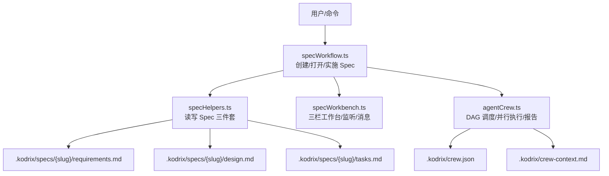
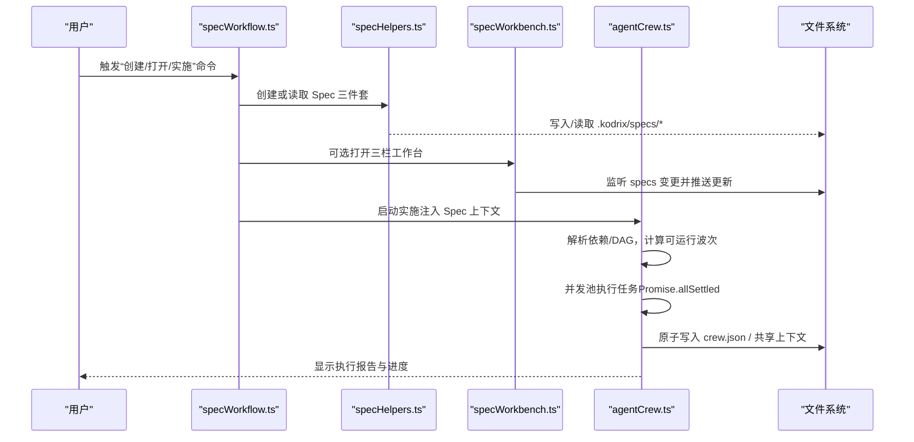
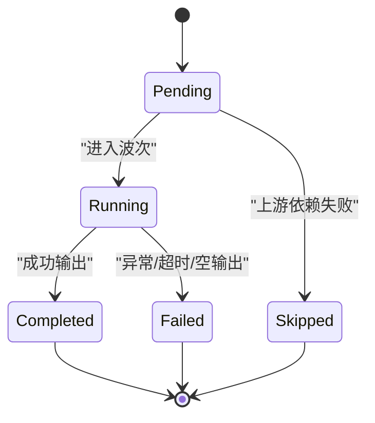
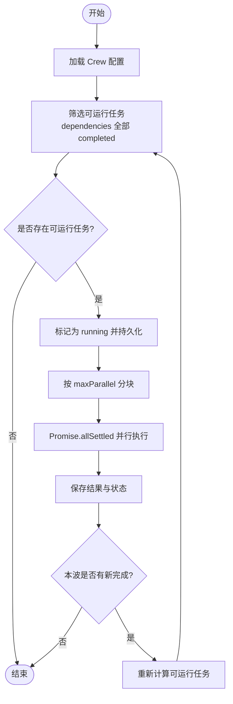
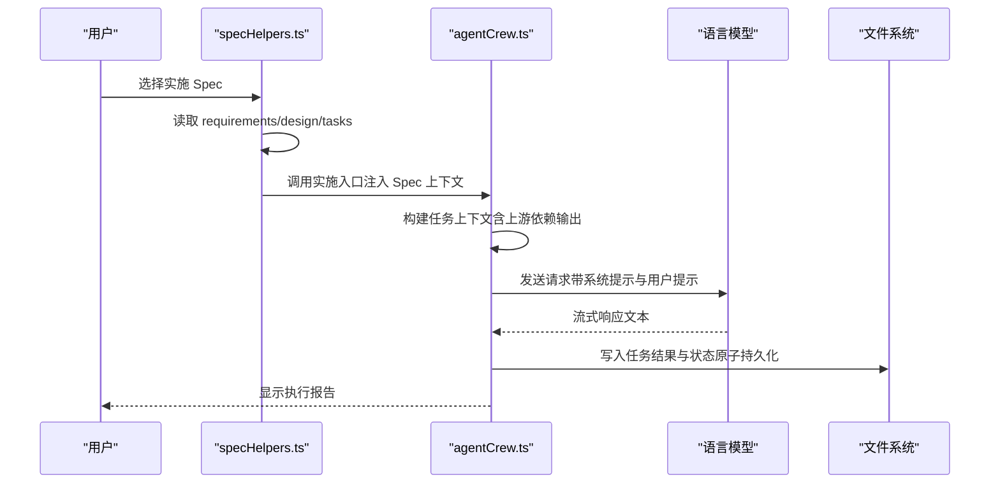
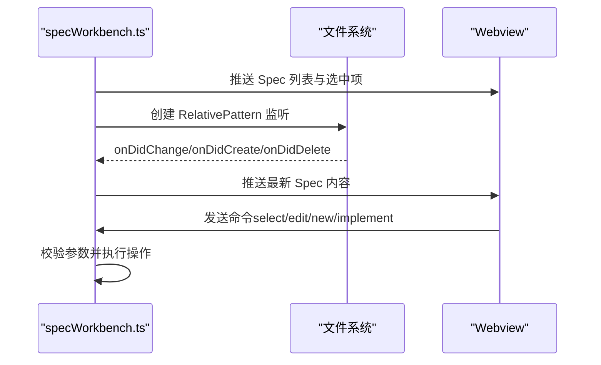
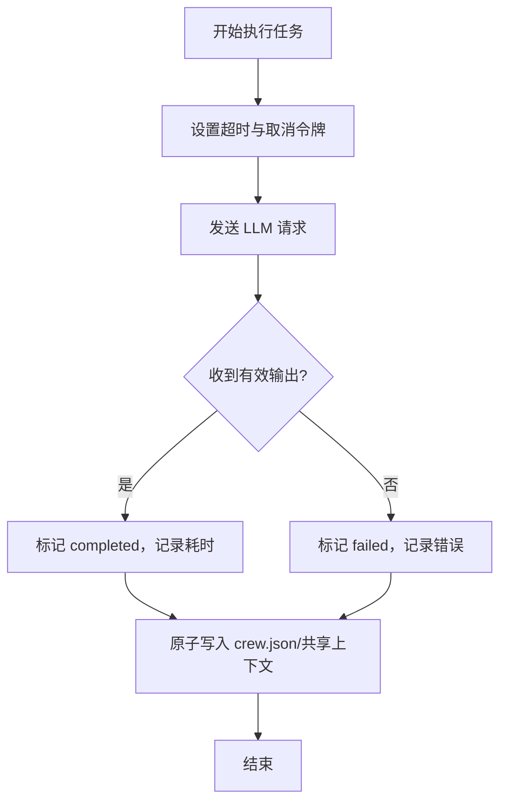
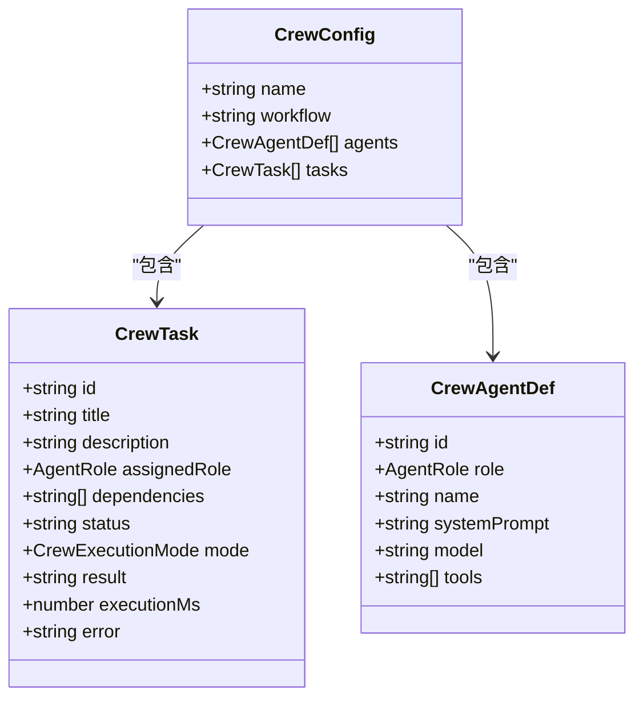
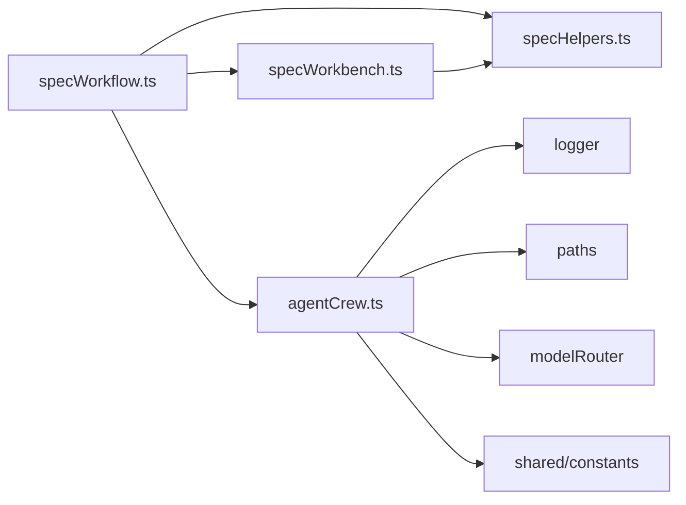

# Spec 工作流引擎

<cite>
**本文引用的文件**
- [specWorkbench.ts](file://extensions/kodrix-agent-os/src/spec/specWorkbench.ts)
- [specWorkflow.ts](file://extensions/kodrix-agent-os/src/spec/specWorkflow.ts)
- [specHelpers.ts](file://extensions/kodrix-agent-os/src/spec/specHelpers.ts)
- [agentCrew.ts](file://extensions/kodrix-agent-os/src/crew/agentCrew.ts)
</cite>

## 目录
1. [简介](#简介)
2. [项目结构](#项目结构)
3. [核心组件](#核心组件)
4. [架构总览](#架构总览)
5. [详细组件分析](#详细组件分析)
6. [依赖关系分析](#依赖关系分析)
7. [性能考量](#性能考量)
8. [故障排查指南](#故障排查指南)
9. [结论](#结论)
10. [附录](#附录)

## 简介
本文件面向“Spec 驱动的工作流引擎”，围绕从需求到代码生成的完整流水线展开，重点覆盖：
- 状态机设计：任务生命周期与推进规则
- 调度算法：依赖解析、波次并行、并发控制
- 执行计划生成：基于 Spec 文档的任务编排与上下文注入
- 错误恢复、重试策略、进度跟踪与日志记录
- 自定义任务类型与执行器的扩展方式

该引擎由两部分协同构成：
- Spec 工作流：以 requirements/design/tasks 三件套为输入，驱动 Agent 实施与结果回写
- Agent Crew 并行执行引擎：提供 DAG 任务图、波次调度、跨 Agent 上下文传递、报告与可视化

## 项目结构
Spec 相关能力集中在 VS Code 扩展中，关键文件职责如下：
- specHelpers.ts：Spec 文件创建、读取、模板、实施入口封装
- specWorkflow.ts：命令注册、创建/打开/实施 Spec 的入口流程
- specWorkbench.ts：三栏工作台（Webview）与文件系统监听、消息路由
- agentCrew.ts：多智能体协作编排框架，提供 DAG 调度、并行执行、上下文传递、报告

图表来源
- [specWorkflow.ts:16-79](file://extensions/kodrix-agent-os/src/spec/specWorkflow.ts#L16-L79)
- [specHelpers.ts:93-266](file://extensions/kodrix-agent-os/src/spec/specHelpers.ts#L93-L266)
- [specWorkbench.ts:26-134](file://extensions/kodrix-agent-os/src/spec/specWorkbench.ts#L26-L134)
- [agentCrew.ts:144-173](file://extensions/kodrix-agent-os/src/crew/agentCrew.ts#L144-L173)

章节来源
- [specWorkflow.ts:16-79](file://extensions/kodrix-agent-os/src/spec/specWorkflow.ts#L16-L79)
- [specHelpers.ts:93-266](file://extensions/kodrix-agent-os/src/spec/specHelpers.ts#L93-L266)
- [specWorkbench.ts:26-134](file://extensions/kodrix-agent-os/src/spec/specWorkbench.ts#L26-L134)
- [agentCrew.ts:144-173](file://extensions/kodrix-agent-os/src/crew/agentCrew.ts#L144-L173)

## 核心组件
- Spec 三件套管理：requirements/design/tasks 的创建、读取、模板填充与限长拼接
- 三栏工作台：Webview 展示与实时更新，安全校验与文件监听
- 实施入口：将 Spec 内容注入 Chat Agent，驱动按任务逐步实现
- 并行执行引擎：DAG 任务图、波次调度、并发池、跨 Agent 上下文传递、原子写入、执行报告

章节来源
- [specHelpers.ts:214-266](file://extensions/kodrix-agent-os/src/spec/specHelpers.ts#L214-L266)
- [specWorkbench.ts:48-134](file://extensions/kodrix-agent-os/src/spec/specWorkbench.ts#L48-L134)
- [agentCrew.ts:306-572](file://extensions/kodrix-agent-os/src/crew/agentCrew.ts#L306-L572)

## 架构总览
Spec 工作流引擎的整体数据与控制流如下：

图表来源
- [specWorkflow.ts:16-79](file://extensions/kodrix-agent-os/src/spec/specWorkflow.ts#L16-L79)
- [specHelpers.ts:214-266](file://extensions/kodrix-agent-os/src/spec/specHelpers.ts#L214-L266)
- [specWorkbench.ts:48-134](file://extensions/kodrix-agent-os/src/spec/specWorkbench.ts#L48-L134)
- [agentCrew.ts:306-572](file://extensions/kodrix-agent-os/src/crew/agentCrew.ts#L306-L572)

## 详细组件分析

### 状态机设计（任务生命周期）
- 状态集合：pending、running、completed、failed、skipped
- 转换规则：
  - pending → running：进入波次时标记
  - running → completed：LLM 成功输出且非空
  - running → failed：无模型、超时、异常或空输出
  - pending → skipped：当上游依赖失败导致下游不可用时（由调度器判定）
- 推进机制：每波完成后检查是否有新完成任务，若存在则计算下一波可运行任务

图表来源
- [agentCrew.ts:50-68](file://extensions/kodrix-agent-os/src/crew/agentCrew.ts#L50-L68)
- [agentCrew.ts:515-572](file://extensions/kodrix-agent-os/src/crew/agentCrew.ts#L515-L572)

章节来源
- [agentCrew.ts:50-68](file://extensions/kodrix-agent-os/src/crew/agentCrew.ts#L50-L68)
- [agentCrew.ts:515-572](file://extensions/kodrix-agent-os/src/crew/agentCrew.ts#L515-L572)

### 任务调度算法（依赖解析与波次并行）
- 依赖解析：仅当所有 dependencies 对应的任务状态为 completed 时，任务才被视为可运行
- 波次划分：同一波内的任务相互独立；分批使用 Promise.allSettled 并行执行
- 并发控制：通过配置项限制最大并发数，避免资源争用
- 级联推进：每波结束后检查是否产生新完成任务，若有则继续下一波

图表来源
- [agentCrew.ts:321-331](file://extensions/kodrix-agent-os/src/crew/agentCrew.ts#L321-L331)
- [agentCrew.ts:515-572](file://extensions/kodrix-agent-os/src/crew/agentCrew.ts#L515-L572)

章节来源
- [agentCrew.ts:321-331](file://extensions/kodrix-agent-os/src/crew/agentCrew.ts#L321-L331)
- [agentCrew.ts:515-572](file://extensions/kodrix-agent-os/src/crew/agentCrew.ts#L515-L572)

### 执行计划生成器（从 Spec 到任务编排）
- 输入：requirements.md、design.md、tasks.md（由模板生成并可编辑）
- 组装上下文：将 Spec 内容截断后注入 Chat Agent 查询，形成实施指令
- 任务编排：在 Crew 模式下，将 Spec 目标转化为 DAG 任务图（角色、依赖、模式）
- 上下文传递：上游任务结果自动注入下游任务的 prompt，支持跨 Agent 知识复用

图表来源
- [specHelpers.ts:248-266](file://extensions/kodrix-agent-os/src/spec/specHelpers.ts#L248-L266)
- [agentCrew.ts:349-398](file://extensions/kodrix-agent-os/src/crew/agentCrew.ts#L349-L398)
- [agentCrew.ts:462-508](file://extensions/kodrix-agent-os/src/crew/agentCrew.ts#L462-L508)

章节来源
- [specHelpers.ts:248-266](file://extensions/kodrix-agent-os/src/spec/specHelpers.ts#L248-L266)
- [agentCrew.ts:349-398](file://extensions/kodrix-agent-os/src/crew/agentCrew.ts#L349-L398)
- [agentCrew.ts:462-508](file://extensions/kodrix-agent-os/src/crew/agentCrew.ts#L462-L508)

### 三栏工作台与实时同步
- Webview 面板：展示 Spec 列表与内容，支持新建、选择、编辑、实施
- 文件监听：对当前 Slug 的 specs 目录进行监听，变更时刷新面板
- 安全校验：严格校验 slug 与文件名，防止任意路径访问

图表来源
- [specWorkbench.ts:26-134](file://extensions/kodrix-agent-os/src/spec/specWorkbench.ts#L26-L134)

章节来源
- [specWorkbench.ts:26-134](file://extensions/kodrix-agent-os/src/spec/specWorkbench.ts#L26-L134)

### 错误恢复机制与重试策略
- 单任务失败不阻塞同波其它任务：使用 Promise.allSettled 收集结果
- 超时控制：每个任务设置超时，取消令牌释放资源
- 原子写入：先写临时文件再 rename，避免进程崩溃导致配置损坏
- 错误记录：任务 error 字段记录失败原因，便于后续诊断与重试

图表来源
- [agentCrew.ts:462-508](file://extensions/kodrix-agent-os/src/crew/agentCrew.ts#L462-L508)
- [agentCrew.ts:164-173](file://extensions/kodrix-agent-os/src/crew/agentCrew.ts#L164-L173)

章节来源
- [agentCrew.ts:462-508](file://extensions/kodrix-agent-os/src/crew/agentCrew.ts#L462-L508)
- [agentCrew.ts:164-173](file://extensions/kodrix-agent-os/src/crew/agentCrew.ts#L164-L173)

### 进度跟踪与日志记录
- 进度：通过 VS Code 进度条展示并行执行过程
- 日志：统一 logger 记录任务执行、失败与共享上下文更新
- 报告：执行结束后生成 Markdown 报告，包含汇总、明细、待办提示

章节来源
- [agentCrew.ts:515-572](file://extensions/kodrix-agent-os/src/crew/agentCrew.ts#L515-L572)
- [agentCrew.ts:574-618](file://extensions/kodrix-agent-os/src/crew/agentCrew.ts#L574-L618)

### 自定义任务类型与执行器开发指南
- 新增角色：在角色定义处扩展新的 AgentRole，并提供 systemPrompt 与工具集
- 新增执行模式：在任务模式枚举中添加新模式（如 chat/auto），并在调度器中处理
- 上下文注入：通过 buildTaskContext 将上游输出与共享上下文注入下游任务
- 持久化：使用 saveCrew 原子写入 crew.json，确保一致性
- 报告增强：在 showCrewExecutionReport 中追加新状态的统计与说明

图表来源
- [agentCrew.ts:34-80](file://extensions/kodrix-agent-os/src/crew/agentCrew.ts#L34-L80)

章节来源
- [agentCrew.ts:34-80](file://extensions/kodrix-agent-os/src/crew/agentCrew.ts#L34-L80)
- [agentCrew.ts:349-398](file://extensions/kodrix-agent-os/src/crew/agentCrew.ts#L349-L398)
- [agentCrew.ts:164-173](file://extensions/kodrix-agent-os/src/crew/agentCrew.ts#L164-L173)

## 依赖关系分析
- 模块耦合：
  - specWorkflow.ts 依赖 specHelpers.ts 与 specWorkbench.ts
  - specWorkbench.ts 依赖 specHelpers.ts 与 Webview 面板工具
  - agentCrew.ts 依赖路径、日志、模型路由、常量等基础设施
- 外部集成点：
  - VS Code API：命令、Webview、文件系统、进度、Chat 命令
  - 语言模型：通过模型路由选择合适模型执行任务
- 潜在循环依赖：当前未见循环导入；各模块职责清晰

图表来源
- [specWorkflow.ts:16-79](file://extensions/kodrix-agent-os/src/spec/specWorkflow.ts#L16-L79)
- [specWorkbench.ts:26-134](file://extensions/kodrix-agent-os/src/spec/specWorkbench.ts#L26-L134)
- [agentCrew.ts:17-32](file://extensions/kodrix-agent-os/src/crew/agentCrew.ts#L17-L32)

章节来源
- [specWorkflow.ts:16-79](file://extensions/kodrix-agent-os/src/spec/specWorkflow.ts#L16-L79)
- [specWorkbench.ts:26-134](file://extensions/kodrix-agent-os/src/spec/specWorkbench.ts#L26-L134)
- [agentCrew.ts:17-32](file://extensions/kodrix-agent-os/src/crew/agentCrew.ts#L17-L32)

## 性能考量
- 并发控制：通过 maxParallel 限制同波并行度，避免过载
- 上下文裁剪：上下游依赖输出与共享上下文均有限长，防止 token 溢出
- 流式响应：使用流式读取减少首字节延迟
- 原子写入：降低磁盘竞争与崩溃风险
- 建议优化：
  - 对大 Spec 进一步分页或摘要，减少上下文体积
  - 引入缓存层，避免重复读取相同文件
  - 增加指标采集（成功率、平均耗时、失败分布）

[本节为通用指导，无需具体文件引用]

## 故障排查指南
- 常见问题：
  - 无可用模型：检查模型路由与 BYOK 配置
  - 任务超时：调整 timeoutMs 或优化任务描述
  - 依赖未就绪：确认上游任务已完成且输出有效
  - 文件权限：检查工作区与 .kodrix 目录权限
- 定位方法：
  - 查看执行报告中的错误字段
  - 检查日志输出与共享上下文文件
  - 使用三栏工作台观察 Spec 变更与状态

章节来源
- [agentCrew.ts:462-508](file://extensions/kodrix-agent-os/src/crew/agentCrew.ts#L462-L508)
- [agentCrew.ts:574-618](file://extensions/kodrix-agent-os/src/crew/agentCrew.ts#L574-L618)

## 结论
Spec 工作流引擎以“需求—设计—任务”为主线，结合 DAG 调度与并行执行，实现了从 Spec 解析到代码生成的闭环。其优势在于：
- 明确的状态机与推进规则，保证执行有序性
- 强大的依赖解析与波次并行，提升整体吞吐
- 跨 Agent 上下文传递，促进知识复用
- 完善的错误恢复、进度跟踪与报告机制

未来可在上下文裁剪、缓存、指标采集等方面持续优化，并扩展更多角色与执行模式以满足复杂场景。

[本节为总结，无需具体文件引用]

## 附录
- 快速上手：
  - 创建 Spec：使用命令创建三件套
  - 打开工作台：查看与编辑 Spec
  - 实施任务：将 Spec 注入 Agent 执行
  - 并行执行：使用 Crew 模式批量执行任务

[本节为补充信息，无需具体文件引用]