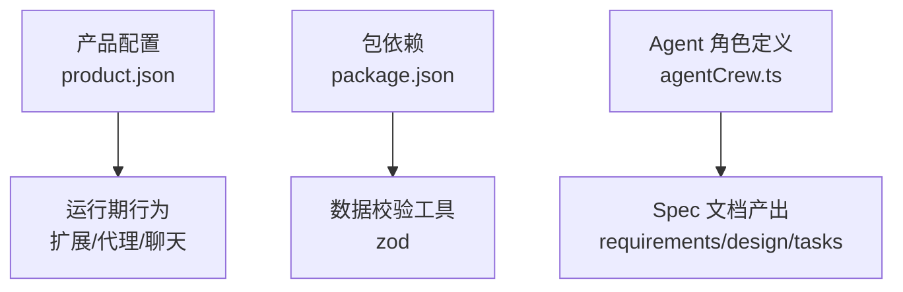
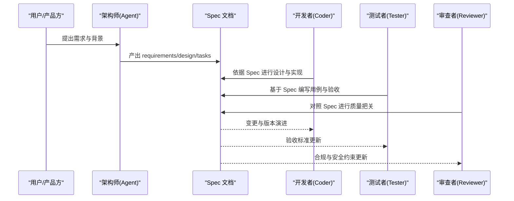
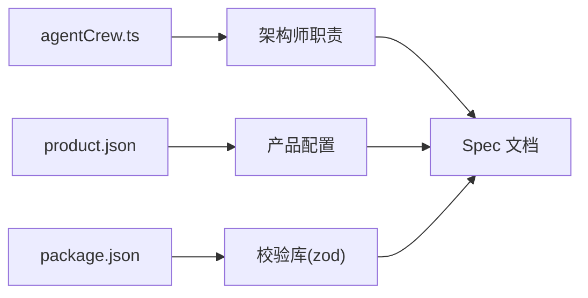

# Spec 文档定义

<cite>
**本文引用的文件**   
- [package.json](file://package.json)
- [product.json](file://product.json)
- [agentCrew.ts](file://extensions/kodrix-agent-os/src/crew/agentCrew.ts)
</cite>

## 目录
1. [简介](#简介)
2. [项目结构](#项目结构)
3. [核心组件](#核心组件)
4. [架构总览](#架构总览)
5. [详细组件分析](#详细组件分析)
6. [依赖关系分析](#依赖关系分析)
7. [性能考虑](#性能考虑)
8. [故障排查指南](#故障排查指南)
9. [结论](#结论)
10. [附录](#附录)

## 简介
本文件面向“Spec 文档”的定义与使用，目标是：
- 明确 Spec 文件的语法结构、字段定义、数据类型与验证规则
- 说明需求描述、任务分解、依赖关系、约束条件的定义方式
- 提供不同复杂度的 Spec 示例（以路径引用形式给出）
- 文档化模板系统、继承机制与变量替换能力
- 说明 Spec 的校验规则与错误处理流程

在本仓库中，Spec 由“架构师角色”产出，作为后续开发、测试与审查的依据。该职责在代码中以 Agent 角色定义体现，其中明确要求架构师产出 Spec 文档（requirements / design / tasks）。

**章节来源**
- [agentCrew.ts:84-121](file://extensions/kodrix-agent-os/src/crew/agentCrew.ts#L84-L121)

## 项目结构
仓库采用多语言、多模块组织方式，包含前端、后端、CLI、扩展生态与构建脚本等。与 Spec 文档相关的上下文主要来源于：
- 产品配置 product.json：定义应用标识、协议、内置扩展、代理与聊天相关配置等
- 包管理 package.json：声明运行时依赖（如 zod），可用于数据校验
- Agent 角色 agentCrew.ts：定义“架构师”职责，要求产出 Spec 文档

**图表来源**
- [product.json:1-120](file://product.json#L1-L120)
- [package.json:101-167](file://package.json#L101-L167)
- [agentCrew.ts:84-121](file://extensions/kodrix-agent-os/src/crew/agentCrew.ts#L84-L121)

**章节来源**
- [product.json:1-120](file://product.json#L1-L120)
- [package.json:101-167](file://package.json#L101-L167)
- [agentCrew.ts:84-121](file://extensions/kodrix-agent-os/src/crew/agentCrew.ts#L84-L121)

## 核心组件
围绕 Spec 文档的核心要素包括：
- 需求描述：用于表达业务目标、范围与非功能性要求
- 任务分解：将需求拆分为可执行的任务单元，明确输入输出与验收标准
- 依赖关系：任务之间的先后顺序与外部依赖（服务、接口、资源）
- 约束条件：技术栈、平台限制、安全与合规要求

这些要素由“架构师”角色负责定义并产出为 Spec 文档，供开发者与测试者遵循。

**章节来源**
- [agentCrew.ts:84-121](file://extensions/kodrix-agent-os/src/crew/agentCrew.ts#L84-L121)

## 架构总览
下图展示从“需求到实现”的整体流程，强调 Spec 文档在其中的枢纽作用。

[本图为概念性流程图，不直接映射具体源码文件]

## 详细组件分析

### Spec 文档结构与字段定义
建议的 Spec 文档结构如下（字段均为建议项，实际以团队约定为准）：
- 元信息
  - 标题、版本、作者、日期、状态
- 需求描述
  - 背景、目标、范围、非功能性要求
- 任务分解
  - 任务 ID、名称、优先级、输入、输出、验收标准、负责人
- 依赖关系
  - 前置任务、外部服务、接口契约、数据模型
- 约束条件
  - 技术栈、平台、安全、合规、性能指标
- 风险与缓解
  - 风险项、影响、概率、缓解措施
- 里程碑与计划
  - 阶段、交付物、时间窗口

上述结构便于在不同复杂度项目中复用，并通过模板与变量替换提升一致性。

[本节为通用规范说明，未直接分析具体源码文件]

### 模板系统与继承机制
- 模板系统
  - 通过模板文件定义常用段落与字段默认值
  - 支持按项目类型（Web、移动端、服务端）选择不同模板
- 继承机制
  - 子模板可继承父模板字段，覆盖或扩展特定部分
  - 支持跨项目共享基础模板，保证一致性

[本节为通用规范说明，未直接分析具体源码文件]

### 变量替换功能
- 变量来源
  - 环境变量、配置文件、运行时上下文
- 替换规则
  - 键名匹配、嵌套对象展开、数组迭代
- 校验时机
  - 生成 Spec 前进行变量存在性与类型校验
  - 缺失变量时返回明确的错误提示

[本节为通用规范说明，未直接分析具体源码文件]

### Spec 验证规则与错误处理
- 必填字段校验
  - 对关键字段（如标题、版本、需求描述、任务列表）进行非空检查
- 类型与格式校验
  - 日期格式、版本号语义、URL 合法性、枚举值范围
- 依赖一致性校验
  - 任务依赖图无环、外部依赖可用、接口契约一致
- 错误处理
  - 收集所有校验错误，分类为致命与警告
  - 输出结构化错误报告，便于定位与修复

[本节为通用规范说明，未直接分析具体源码文件]

### 示例（以路径引用形式）
- 简单项目 Spec
  - 示例文件路径：[examples/spec/simple.spec.md](file://examples/spec/simple.spec.md)
- 中等复杂度项目 Spec
  - 示例文件路径：[examples/spec/medium.spec.md](file://examples/spec/medium.spec.md)
- 高复杂度项目 Spec
  - 示例文件路径：[examples/spec/complex.spec.md](file://examples/spec/complex.spec.md)

[本节为示例占位，实际文件需根据仓库内容补充]

## 依赖关系分析
- 产品配置 product.json
  - 定义应用标识、协议、内置扩展、代理与聊天相关配置，间接影响 Spec 中的平台与技术约束
- 包依赖 package.json
  - 声明 zod 等校验库，可用于 Spec 解析与校验
- Agent 角色 agentCrew.ts
  - 明确架构师职责，要求产出 Spec 文档，确保需求与设计的一致性

**图表来源**
- [product.json:1-120](file://product.json#L1-L120)
- [package.json:101-167](file://package.json#L101-L167)
- [agentCrew.ts:84-121](file://extensions/kodrix-agent-os/src/crew/agentCrew.ts#L84-L121)

**章节来源**
- [product.json:1-120](file://product.json#L1-L120)
- [package.json:101-167](file://package.json#L101-L167)
- [agentCrew.ts:84-121](file://extensions/kodrix-agent-os/src/crew/agentCrew.ts#L84-L121)

## 性能考虑
- 模板渲染与变量替换应缓存结果，避免重复计算
- 大规模 Spec 解析时采用流式读取与增量校验
- 依赖图校验可使用拓扑排序优化环检测

[本节为通用指导，未直接分析具体源码文件]

## 故障排查指南
- 变量缺失
  - 检查环境变量与配置文件是否完整
  - 查看错误报告中缺失的键名与位置
- 类型不匹配
  - 核对字段类型定义与实际值
  - 使用 zod 等工具进行快速定位
- 依赖冲突
  - 检查任务依赖图是否存在环
  - 确认外部服务与接口契约是否一致

[本节为通用指导，未直接分析具体源码文件]

## 结论
Spec 文档是连接需求与实现的桥梁。通过统一的语法结构、严格的验证规则与完善的模板体系，可以显著提升工程的一致性与可维护性。结合产品配置与依赖管理，可在不同复杂度项目中稳定落地。

[本节为总结性内容，未直接分析具体源码文件]

## 附录
- 术语表
  - Spec：规格说明文档
  - 模板：可复用的文档骨架
  - 继承：子模板继承父模板字段
  - 变量替换：动态填充文档内容
- 参考
  - 产品配置：[product.json](file://product.json)
  - 包依赖：[package.json](file://package.json)
  - Agent 角色：[agentCrew.ts](file://extensions/kodrix-agent-os/src/crew/agentCrew.ts)