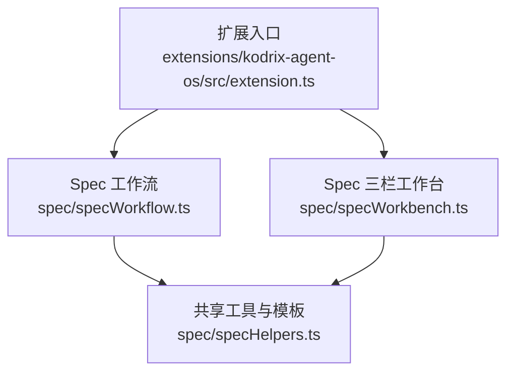
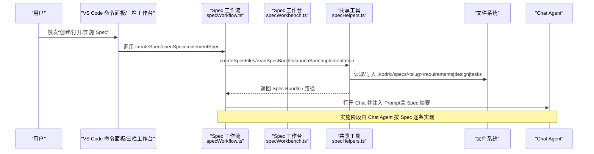
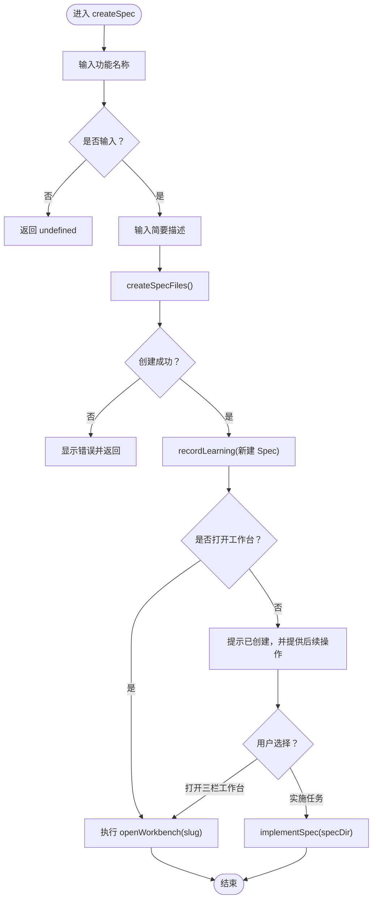
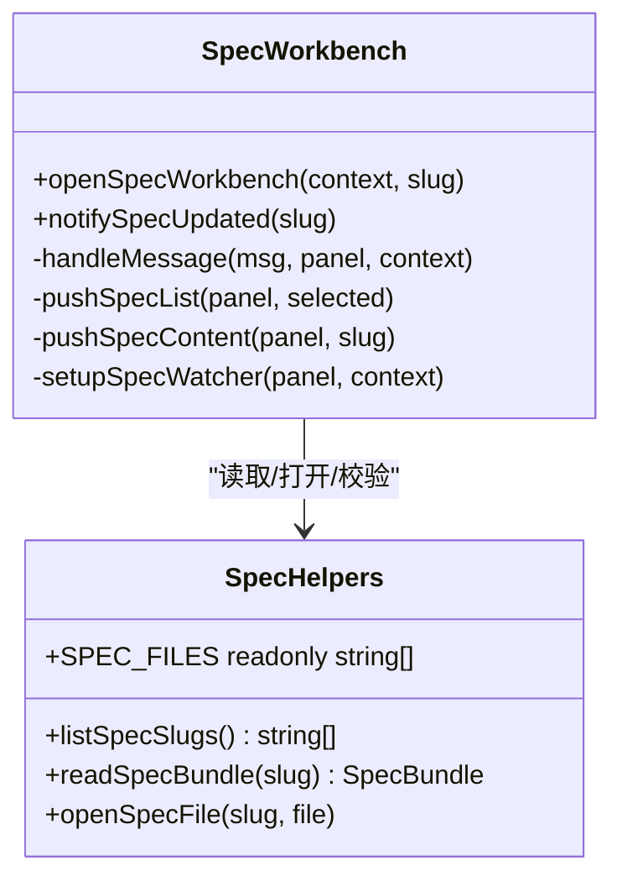
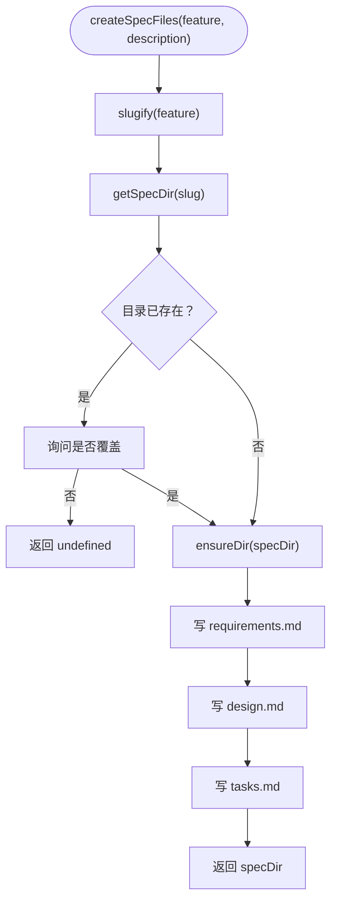
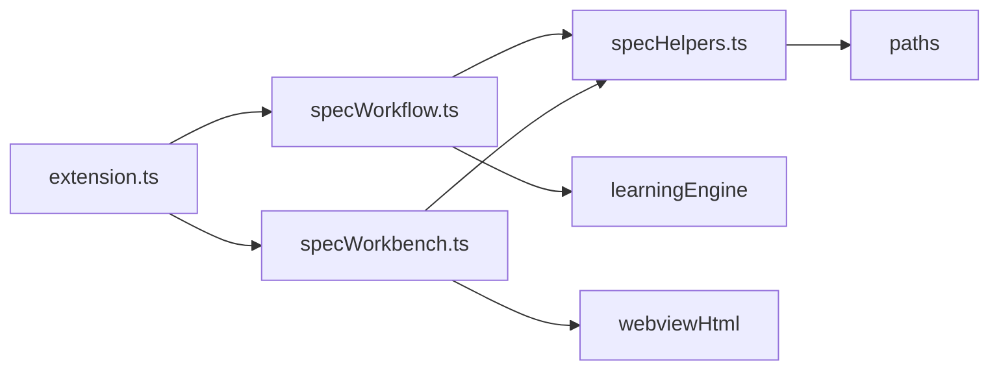
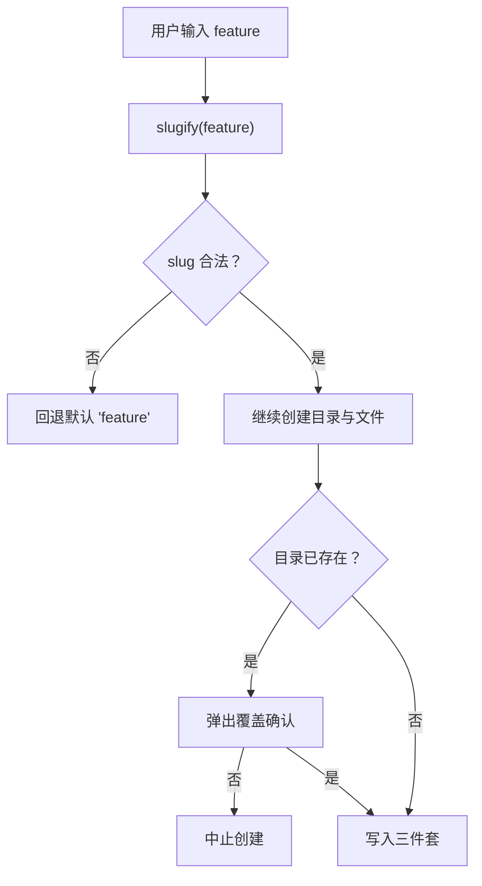
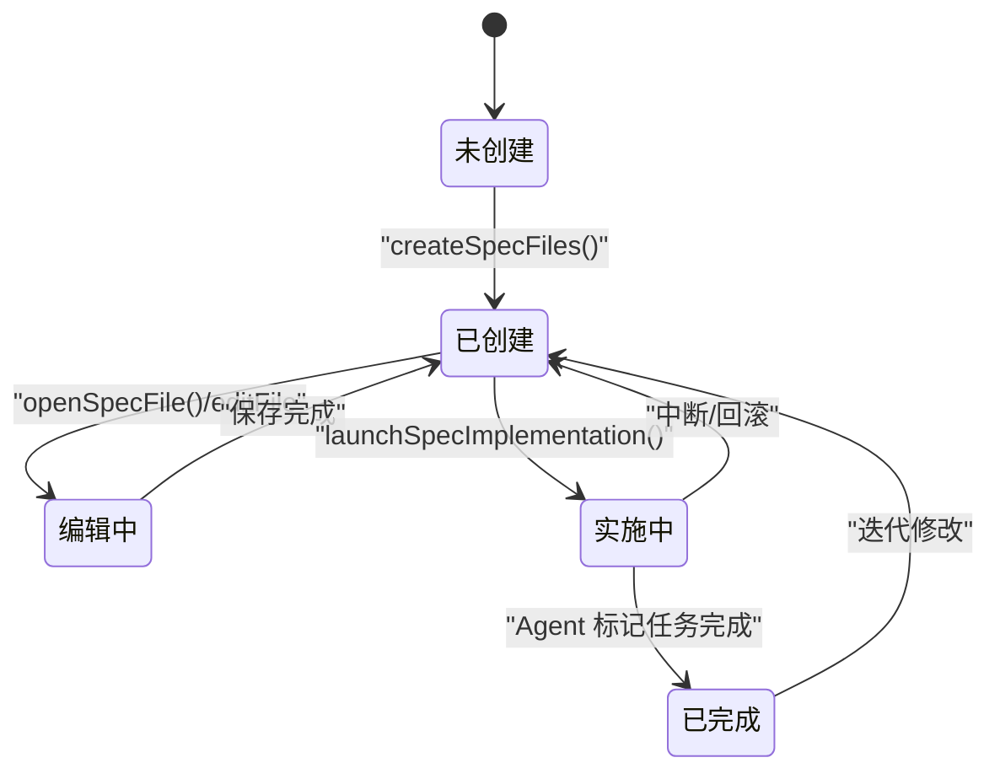
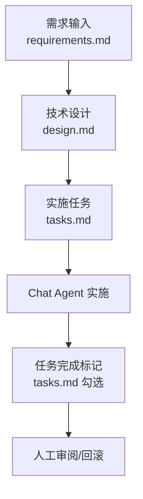

# Spec 驱动工作流

<cite>
**本文引用的文件**   
- [extensions/kodrix-agent-os/src/extension.ts](file://extensions/kodrix-agent-os/src/extension.ts)
- [extensions/kodrix-agent-os/src/spec/specWorkflow.ts](file://extensions/kodrix-agent-os/src/spec/specWorkflow.ts)
- [extensions/kodrix-agent-os/src/spec/specWorkbench.ts](file://extensions/kodrix-agent-os/src/spec/specWorkbench.ts)
- [extensions/kodrix-agent-os/src/spec/specHelpers.ts](file://extensions/kodrix-agent-os/src/spec/specHelpers.ts)
- [AGENTS.md](file://AGENTS.md)
- [docs/项目新发现待修复的缺陷问题审计总报告.md](file://docs/项目新发现待修复的缺陷问题审计总报告.md)
</cite>

## 目录
1. [引言](#引言)
2. [项目结构](#项目结构)
3. [核心组件](#核心组件)
4. [架构总览](#架构总览)
5. [详细组件分析](#详细组件分析)
6. [依赖关系分析](#依赖关系分析)
7. [性能与可扩展性](#性能与可扩展性)
8. [故障排查指南](#故障排查指南)
9. [结论](#结论)
10. [附录：Spec 语法、语义与验证规则](#附录spec-语法语义与验证规则)

## 引言
本文件面向“Spec 驱动工作流”，系统性说明从需求到代码生成的完整流水线，包括：
- Spec 文档的语法结构、语义定义与验证规则
- 需求解析、任务分解、执行计划生成、结果验证
- 状态机设计、转换规则与错误处理机制
- 示例、工作流图、状态转换图
- 自定义 Spec 模板与工作流扩展开发指南

该能力在 Kodrix Agent OS 中以“Kiro 风格 + Qoder Spec-driven”的方式实现，并通过 VS Code 命令面板、Webview 三栏工作台与 Chat Agent 协作完成。

## 项目结构
Spec 相关能力集中在 `extensions/kodrix-agent-os/src/spec` 下，由扩展入口统一注册并对外暴露命令。

**图表来源**
- [extensions/kodrix-agent-os/src/extension.ts:17-18](file://extensions/kodrix-agent-os/src/extension.ts#L17-L18)
- [extensions/kodrix-agent-os/src/spec/specWorkflow.ts:1-14](file://extensions/kodrix-agent-os/src/spec/specWorkflow.ts#L1-L14)
- [extensions/kodrix-agent-os/src/spec/specWorkbench.ts:1-20](file://extensions/kodrix-agent-os/src/spec/specWorkbench.ts#L1-L20)
- [extensions/kodrix-agent-os/src/spec/specHelpers.ts:1-10](file://extensions/kodrix-agent-os/src/spec/specHelpers.ts#L1-L10)

**章节来源**
- [extensions/kodrix-agent-os/src/extension.ts:158-212](file://extensions/kodrix-agent-os/src/extension.ts#L158-L212)
- [AGENTS.md:9-56](file://AGENTS.md#L9-L56)

## 核心组件
- Spec 工作流：负责创建 Spec、打开已有 Spec、启动实施流程。
- Spec 三栏工作台：提供 Webview 界面，展示 requirements/design/tasks 三件套，支持选择、编辑、新建与实施。
- 共享工具与模板：提供 slug 生成、文件读写、模板生成、Spec 目录管理、实施提示词组装等。

关键职责边界：
- 工作流层不直接操作文件系统，而是调用 helpers。
- 工作台层只负责 UI 交互与消息分发，业务逻辑委托给 helpers 与工作流。
- helpers 是纯工具层，避免副作用扩散。

**章节来源**
- [extensions/kodrix-agent-os/src/spec/specWorkflow.ts:16-87](file://extensions/kodrix-agent-os/src/spec/specWorkflow.ts#L16-L87)
- [extensions/kodrix-agent-os/src/spec/specWorkbench.ts:26-199](file://extensions/kodrix-agent-os/src/spec/specWorkbench.ts#L26-L199)
- [extensions/kodrix-agent-os/src/spec/specHelpers.ts:10-268](file://extensions/kodrix-agent-os/src/spec/specHelpers.ts#L10-L268)

## 架构总览
Spec 驱动工作流的整体数据与控制流如下：

**图表来源**
- [extensions/kodrix-agent-os/src/spec/specWorkflow.ts:16-79](file://extensions/kodrix-agent-os/src/spec/specWorkflow.ts#L16-L79)
- [extensions/kodrix-agent-os/src/spec/specWorkbench.ts:86-135](file://extensions/kodrix-agent-os/src/spec/specWorkbench.ts#L86-L135)
- [extensions/kodrix-agent-os/src/spec/specHelpers.ts:214-266](file://extensions/kodrix-agent-os/src/spec/specHelpers.ts#L214-L266)

## 详细组件分析

### 组件一：Spec 工作流（specWorkflow.ts）
- 功能要点
  - 创建 Spec：引导输入功能名与描述，生成三件套，记录学习数据，可选择打开工作台或直接实施。
  - 打开 Spec：选择已有 slug，打开工作台。
  - 实施 Spec：选择或传入目录，调用 launchSpecImplementation 将 Spec 内容注入 Chat Agent。
- 控制流
  - 通过 VS Code 命令注册对外暴露能力。
  - 与 learningEngine 集成，记录“新建 Spec”的学习条目。
- 错误处理
  - 用户取消输入时返回 undefined。
  - 未找到 Spec 时给出警告并中止。

**图表来源**
- [extensions/kodrix-agent-os/src/spec/specWorkflow.ts:16-56](file://extensions/kodrix-agent-os/src/spec/specWorkflow.ts#L16-L56)
- [extensions/kodrix-agent-os/src/spec/specWorkflow.ts:66-79](file://extensions/kodrix-agent-os/src/spec/specWorkflow.ts#L66-L79)

**章节来源**
- [extensions/kodrix-agent-os/src/spec/specWorkflow.ts:16-87](file://extensions/kodrix-agent-os/src/spec/specWorkflow.ts#L16-L87)

### 组件二：Spec 三栏工作台（specWorkbench.ts）
- 功能要点
  - 使用 Webview 展示 Spec 列表与三件套内容。
  - 监听文件系统变化，自动刷新当前 Spec 内容。
  - 校验来自 Webview 的消息，防止任意路径访问。
  - 支持新建 Spec、选择 Spec、编辑文件、实施 Spec。
- 安全策略
  - 仅允许 listSpecSlugs 中的 slug。
  - 仅允许 SPEC_FILES 中的文件名。
- 生命周期
  - 单例 activePanel，切换 Slug 时复用 watcher，dispose 时清理资源。

**图表来源**
- [extensions/kodrix-agent-os/src/spec/specWorkbench.ts:26-199](file://extensions/kodrix-agent-os/src/spec/specWorkbench.ts#L26-L199)
- [extensions/kodrix-agent-os/src/spec/specHelpers.ts:10-91](file://extensions/kodrix-agent-os/src/spec/specHelpers.ts#L10-L91)

**章节来源**
- [extensions/kodrix-agent-os/src/spec/specWorkbench.ts:26-199](file://extensions/kodrix-agent-os/src/spec/specWorkbench.ts#L26-L199)

### 组件三：共享工具与模板（specHelpers.ts）
- 功能要点
  - slugify：规范化功能名为安全 slug，防御路径穿越。
  - listSpecSlugs/getSpecDir：枚举与定位 Spec 目录。
  - readSpecFile/readSpecBundle：读取三件套内容。
  - pickSpecSlug/openSpecFile：交互选择与打开文件。
  - requirementsTemplate/designTemplate/tasksTemplate：生成 Kiro 风格模板。
  - createSpecFiles：创建目录与三个 Markdown 文件，覆盖前需确认。
  - launchSpecImplementation：组装 Prompt，调用 Chat Agent 实施。
- 数据结构
  - SPEC_FILES：受支持的三件套文件名常量。
  - SpecFileName：类型别名，限定为 SPEC_FILES 之一。
  - SpecBundle：包含 slug、requirements、design、tasks。

**图表来源**
- [extensions/kodrix-agent-os/src/spec/specHelpers.ts:13-23](file://extensions/kodrix-agent-os/src/spec/specHelpers.ts#L13-L23)
- [extensions/kodrix-agent-os/src/spec/specHelpers.ts:214-246](file://extensions/kodrix-agent-os/src/spec/specHelpers.ts#L214-L246)

**章节来源**
- [extensions/kodrix-agent-os/src/spec/specHelpers.ts:10-268](file://extensions/kodrix-agent-os/src/spec/specHelpers.ts#L10-L268)

### 组件四：扩展入口与命令注册（extension.ts）
- 作用
  - 在扩展激活时注册 Spec 工作流与工作台命令。
  - 与其他能力（路由、记忆、Wiki、Crew 等）协同。
- 关键点
  - registerSpec 与 registerSpecWorkbench 被调用，暴露命令。
  - 错误边界确保激活失败时给用户可见的错误信息。

**章节来源**
- [extensions/kodrix-agent-os/src/extension.ts:17-18](file://extensions/kodrix-agent-os/src/extension.ts#L17-L18)
- [extensions/kodrix-agent-os/src/extension.ts:158-212](file://extensions/kodrix-agent-os/src/extension.ts#L158-L212)

## 依赖关系分析
- 模块耦合
  - extension.ts 依赖 specWorkflow 与 specWorkbench 进行命令注册。
  - specWorkflow 依赖 specHelpers 进行文件与模板操作。
  - specWorkbench 依赖 specHelpers 进行数据读取与校验。
- 外部依赖
  - vscode API：命令、Webview、文件系统监听、文本编辑器。
  - learningEngine：记录“新建 Spec”的学习条目。
  - paths：获取 specs 根目录。
  - webviewHtml：加载 Webview HTML 模板。

**图表来源**
- [extensions/kodrix-agent-os/src/extension.ts:17-18](file://extensions/kodrix-agent-os/src/extension.ts#L17-L18)
- [extensions/kodrix-agent-os/src/spec/specWorkflow.ts:7-14](file://extensions/kodrix-agent-os/src/spec/specWorkflow.ts#L7-L14)
- [extensions/kodrix-agent-os/src/spec/specWorkbench.ts:7-20](file://extensions/kodrix-agent-os/src/spec/specWorkbench.ts#L7-L20)
- [extensions/kodrix-agent-os/src/spec/specHelpers.ts:8-8](file://extensions/kodrix-agent-os/src/spec/specHelpers.ts#L8-L8)

**章节来源**
- [extensions/kodrix-agent-os/src/extension.ts:158-212](file://extensions/kodrix-agent-os/src/extension.ts#L158-L212)
- [extensions/kodrix-agent-os/src/spec/specWorkflow.ts:1-14](file://extensions/kodrix-agent-os/src/spec/specWorkflow.ts#L1-L14)
- [extensions/kodrix-agent-os/src/spec/specWorkbench.ts:1-20](file://extensions/kodrix-agent-os/src/spec/specWorkbench.ts#L1-L20)
- [extensions/kodrix-agent-os/src/spec/specHelpers.ts:1-10](file://extensions/kodrix-agent-os/src/spec/specHelpers.ts#L1-L10)

## 性能与可扩展性
- 性能
  - 文件系统监听器复用单一实例，避免泄漏；面板 dispose 时清理。
  - Spec 内容读取采用同步 fs.readFileSync，适合小体积 Markdown；超大 Spec 在实施时截断长度以避免 Chat Token 溢出。
- 可扩展性
  - 新增 Spec 字段：扩展 SPEC_FILES 与 SpecBundle，并在工作台与模板中补充。
  - 新增模板：在 specHelpers.ts 增加模板函数，并在 createSpecFiles 中写入。
  - 新增工作流步骤：在 specWorkflow.ts 中编排，保持 helpers 无副作用。

[本节为通用指导，不直接分析具体文件]

## 故障排查指南
- 常见问题
  - 未打开工作区：createSpecFiles 会提示先打开工作区。
  - 同名 Spec 覆盖：会弹出确认对话框，取消则不覆盖。
  - 文件不存在：openSpecFile 会提示文件不存在。
  - 无可用 Spec：pickSpecSlug 会提示先创建。
- 建议排障顺序
  - 检查 .kodrix/specs 目录是否存在与权限。
  - 查看 VS Code 输出通道与错误弹窗。
  - 若实施失败，检查 Chat Agent 是否可正常打开与响应。

**章节来源**
- [extensions/kodrix-agent-os/src/spec/specHelpers.ts:214-246](file://extensions/kodrix-agent-os/src/spec/specHelpers.ts#L214-L246)
- [extensions/kodrix-agent-os/src/spec/specHelpers.ts:66-91](file://extensions/kodrix-agent-os/src/spec/specHelpers.ts#L66-L91)

## 结论
Spec 驱动工作流以“三件套”为核心载体，结合 VS Code 命令与 Webview 工作台，形成从需求到实施的闭环。其优势在于：
- 结构化文档：requirements/design/tasks 明确职责与验收标准。
- 安全可控：slug 校验、文件白名单、覆盖确认。
- 可观测：学习引擎记录活动，便于复盘与知识沉淀。
- 可扩展：模板与工具函数易于扩展，适配不同团队规范。

[本节为总结性内容，不直接分析具体文件]

## 附录：Spec 语法、语义与验证规则

### Spec 文档语法结构
- requirements.md
  - 背景、用户故事（EARS 格式）、验收标准、非功能需求、待澄清问题。
- design.md
  - 架构概览（Mermaid 流程图）、数据模型、API 设计、文件变更计划、依赖与集成、风险与缓解。
- tasks.md
  - 任务列表（T1..Tn）、实施顺序、Agent 提示词（指向 Spec 路径）。

这些模板由 specHelpers.ts 提供，便于快速初始化与保持一致性。

**章节来源**
- [extensions/kodrix-agent-os/src/spec/specHelpers.ts:93-212](file://extensions/kodrix-agent-os/src/spec/specHelpers.ts#L93-L212)

### 语义定义
- requirements：定义“做什么”和“验收标准”，强调 EARS 条件语句。
- design：定义“怎么做”，包括架构、数据模型、API、文件变更、依赖与风险。
- tasks：定义“如何实施”，拆分任务、顺序与 Agent 提示词。

**章节来源**
- [extensions/kodrix-agent-os/src/spec/specHelpers.ts:93-212](file://extensions/kodrix-agent-os/src/spec/specHelpers.ts#L93-L212)

### 验证规则
- slug 安全化：slugify 过滤非法字符、限制长度、防御路径穿越。
- 文件白名单：SPEC_FILES 限定可编辑文件。
- 目录存在性：getSpecDir 与 readSpecFile 对缺失目录/文件做空值处理。
- 覆盖保护：同名 Spec 覆盖前需用户确认。

**图表来源**
- [extensions/kodrix-agent-os/src/spec/specHelpers.ts:13-23](file://extensions/kodrix-agent-os/src/spec/specHelpers.ts#L13-L23)
- [extensions/kodrix-agent-os/src/spec/specHelpers.ts:214-246](file://extensions/kodrix-agent-os/src/spec/specHelpers.ts#L214-L246)

**章节来源**
- [extensions/kodrix-agent-os/src/spec/specHelpers.ts:13-23](file://extensions/kodrix-agent-os/src/spec/specHelpers.ts#L13-L23)
- [extensions/kodrix-agent-os/src/spec/specHelpers.ts:214-246](file://extensions/kodrix-agent-os/src/spec/specHelpers.ts#L214-L246)

### 状态机设计（Spec 生命周期）

[此图为概念性状态机，不直接映射具体源码文件]

### 工作流图（从需求到代码生成）

[此图为概念性工作流，不直接映射具体源码文件]

### 自定义 Spec 模板与工作流扩展指南
- 新增模板
  - 在 specHelpers.ts 新增模板函数，并在 createSpecFiles 中写入。
  - 更新 SpecBundle 与工作台推送逻辑以包含新字段。
- 新增字段
  - 扩展 SPEC_FILES 与 SpecFileName。
  - 在工作台消息处理中增加对新字段的读取与展示。
- 新增工作流步骤
  - 在 specWorkflow.ts 中编排新步骤，保持 helpers 无副作用。
  - 如需持久化状态，建议使用 learningEngine 或独立存储模块。

[本节为通用指导，不直接分析具体文件]

### 已知问题与改进方向
- 审计报告中指出：“Spec 偏模板生成，缺验证与执行追踪”。当前实现提供了模板与基本校验，但尚未内置严格的 Schema 验证与执行追踪。
- 建议后续增强：
  - 引入 JSON Schema 或 Zod 对 Spec 结构进行强校验。
  - 在执行阶段记录任务状态、耗时、变更集，并与 Checkpoint 联动。

**章节来源**
- [docs/项目新发现待修复的缺陷问题审计总报告.md:71-76](file://docs/项目新发现待修复的缺陷问题审计总报告.md#L71-L76)