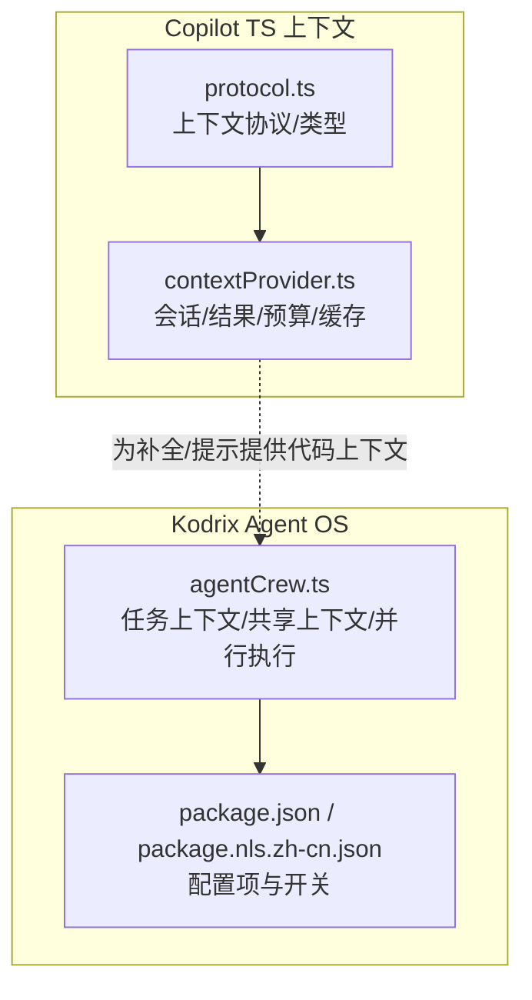
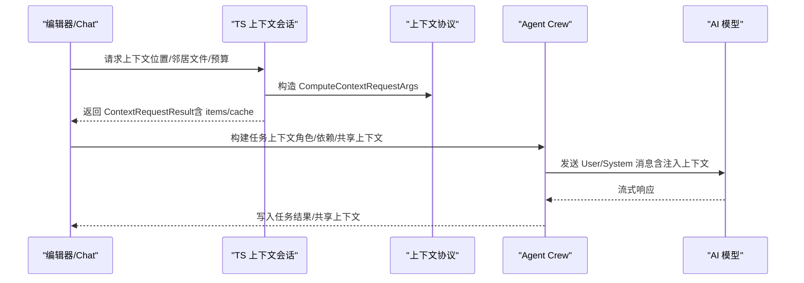
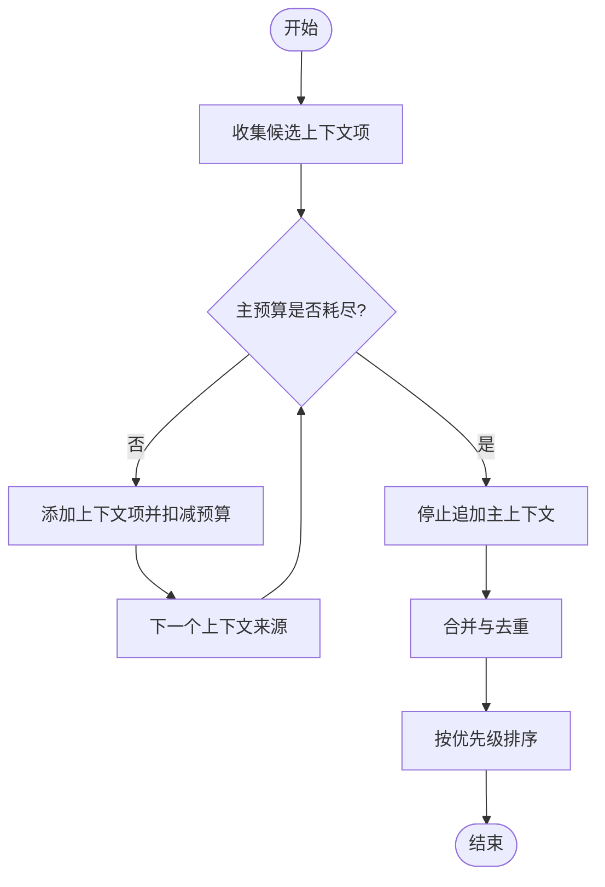
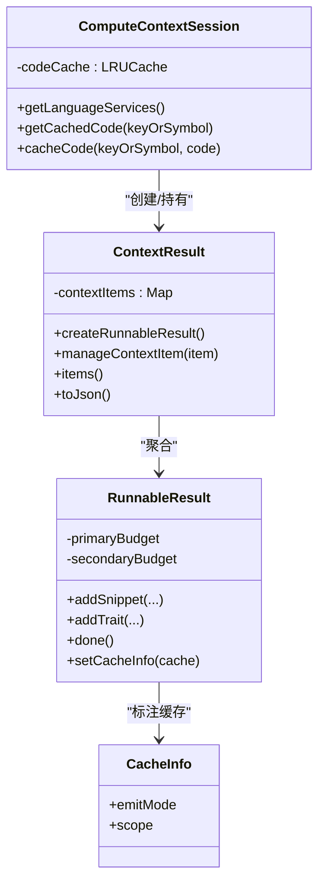
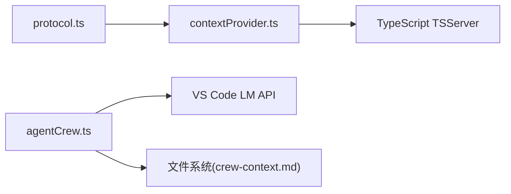

# 上下文管理机制

<cite>
**本文引用的文件**   
- [contextProvider.ts](file://extensions/copilot/src/extension/typescriptContext/serverPlugin/src/common/contextProvider.ts)
- [protocol.ts](file://extensions/copilot/src/extension/typescriptContext/serverPlugin/src/common/protocol.ts)
- [agentCrew.ts](file://extensions/kodrix-agent-os/src/crew/agentCrew.ts)
- [package.nls.zh-cn.json](file://extensions/kodrix-agent-os/package.nls.zh-cn.json)
- [package.json](file://extensions/kodrix-agent-os/package.json)
- [项目非常有必要新实现的核心功能总报告.md](file://docs/项目非常有必要新实现的核心功能总报告.md)
</cite>

## 目录
1. [引言](#引言)
2. [项目结构](#项目结构)
3. [核心组件](#核心组件)
4. [架构总览](#架构总览)
5. [详细组件分析](#详细组件分析)
6. [依赖关系分析](#依赖关系分析)
7. [性能与内存优化](#性能与内存优化)
8. [故障排查指南](#故障排查指南)
9. [结论](#结论)
10. [附录：API 使用与最佳实践](#附录api-使用与最佳实践)

## 引言
本文件系统性梳理 Kodrix 工程中的“上下文管理机制”，覆盖上下文的定义、作用域、继承关系，以及上下文收集、过滤、合并、缓存策略；说明文件上下文、代码上下文、项目上下文的不同处理方式；给出上下文窗口管理、内存优化、增量更新机制；提供上下文 API 使用示例、自定义上下文提供者思路、性能调优建议；并解释与 AI 模型的上下文注入方式与 token 限制处理。

该机制由两部分协同构成：
- TypeScript 语言服务侧的上下文计算框架（Copilot TS 上下文插件）：负责 AST 级符号、引用、片段等“代码上下文”的高效收集、预算控制与缓存。
- Kodrix Agent OS 层：负责将 Wiki/Memory/Learning 等“项目上下文”与任务上下文组装，并通过模型路由与并发执行引擎注入到 AI 模型调用中。

## 项目结构
围绕上下文的关键代码主要分布在两个扩展中：
- extensions/copilot/...typescriptContext/serverPlugin/...：TS 上下文协议、会话、可运行结果、缓存范围、优先级与预算控制。
- extensions/kodrix-agent-os/...crew/agentCrew.ts：多智能体协作编排、任务上下文组装、共享上下文持久化与并行执行。

图表来源
- [protocol.ts:10-75](file://extensions/copilot/src/extension/typescriptContext/serverPlugin/src/common/protocol.ts#L10-L75)
- [contextProvider.ts:36-91](file://extensions/copilot/src/extension/typescriptContext/serverPlugin/src/common/contextProvider.ts#L36-L91)
- [agentCrew.ts:349-398](file://extensions/kodrix-agent-os/src/crew/agentCrew.ts#L349-L398)

章节来源
- [protocol.ts:10-75](file://extensions/copilot/src/extension/typescriptContext/serverPlugin/src/common/protocol.ts#L10-L75)
- [contextProvider.ts:36-91](file://extensions/copilot/src/extension/typescriptContext/serverPlugin/src/common/contextProvider.ts#L36-L91)
- [agentCrew.ts:349-398](file://extensions/kodrix-agent-os/src/crew/agentCrew.ts#L349-L398)

## 核心组件
- 上下文协议与类型（protocol.ts）
  - 定义上下文项类型（Snippet/Trait/RelatedFile/Reference）、缓存范围（File/WithinRange/OutsideRange/NeighborFiles）、可运行结果状态、请求/响应结构、时间统计、错误数据等。
- 上下文会话与结果（contextProvider.ts）
  - RequestContext：封装当前请求的符号表、邻居文件、客户端已知的上下文项。
  - ComputeContextSession：会话级缓存（LRU）、程序选择、代码缓存读写。
  - ContextResult：聚合多个 RunnableResult，维护主/次预算（primary/secondary character budget），去重、排序、序列化。
  - RunnableResult：单个上下文来源的结果，带优先级、预算消耗、缓存信息。
- 任务与共享上下文（agentCrew.ts）
  - buildTaskContext：按角色与依赖输出拼装系统/用户消息，支持最大字符截断。
  - readCrewSharedContext/updateCrewSharedContext：工作区 .kodrix/crew-context.md 的共享上下文读写。
  - runAllRunnableTasks：基于依赖波次的并行执行引擎，支持并发上限与超时。

章节来源
- [protocol.ts:86-235](file://extensions/copilot/src/extension/typescriptContext/serverPlugin/src/common/protocol.ts#L86-L235)
- [protocol.ts:241-400](file://extensions/copilot/src/extension/typescriptContext/serverPlugin/src/common/protocol.ts#L241-L400)
- [contextProvider.ts:36-91](file://extensions/copilot/src/extension/typescriptContext/serverPlugin/src/common/contextProvider.ts#L36-L91)
- [contextProvider.ts:204-295](file://extensions/copilot/src/extension/typescriptContext/serverPlugin/src/common/contextProvider.ts#L204-L295)
- [contextProvider.ts:308-407](file://extensions/copilot/src/extension/typescriptContext/serverPlugin/src/common/contextProvider.ts#L308-L407)
- [contextProvider.ts:433-569](file://extensions/copilot/src/extension/typescriptContext/serverPlugin/src/common/contextProvider.ts#L433-L569)
- [agentCrew.ts:349-398](file://extensions/kodrix-agent-os/src/crew/agentCrew.ts#L349-L398)
- [agentCrew.ts:423-456](file://extensions/kodrix-agent-os/src/crew/agentCrew.ts#L423-L456)
- [agentCrew.ts:515-572](file://extensions/kodrix-agent-os/src/crew/agentCrew.ts#L515-L572)

## 架构总览
上下文在两层协作：
- 代码上下文（AST/符号/片段）：由 Copilot TS 上下文插件生成，受预算与缓存约束，返回给上层用于补全/提示。
- 项目上下文（Wiki/Memory/Learning/任务依赖/共享上下文）：由 Agent OS 组装，注入到 LLM 调用中。

图表来源
- [protocol.ts:402-414](file://extensions/copilot/src/extension/typescriptContext/serverPlugin/src/common/protocol.ts#L402-L414)
- [contextProvider.ts:230-255](file://extensions/copilot/src/extension/typescriptContext/serverPlugin/src/common/contextProvider.ts#L230-L255)
- [agentCrew.ts:462-508](file://extensions/kodrix-agent-os/src/crew/agentCrew.ts#L462-L508)

## 详细组件分析

### 上下文定义与作用域
- 上下文项类型
  - 片段（CodeSnippet）：包含文件名、附加文件、值文本，用于携带相关代码片段。
  - 特性（Trait）：键值对形式的元信息（如模块、目标、版本等）。
  - 相关文件（RelatedFile）：仅携带路径与可选范围。
  - 引用（Reference）：指向服务端或客户端已知上下文项的轻量指针。
- 缓存作用域（CacheScope）
  - File：整个文件有效。
  - WithinRange：仅在指定范围内变更时有效。
  - OutsideRange：仅在指定范围外变更时有效。
  - NeighborFiles：只要邻居文件未变即有效。
- 发射模式（EmitMode）
  - ClientBased/ClientBasedOnTimeout：客户端优先或延迟后落盘，配合作用域进行增量失效。

章节来源
- [protocol.ts:86-235](file://extensions/copilot/src/extension/typescriptContext/serverPlugin/src/common/protocol.ts#L86-L235)
- [protocol.ts:10-75](file://extensions/copilot/src/extension/typescriptContext/serverPlugin/src/common/protocol.ts#L10-L75)

### 上下文收集与过滤
- 收集入口
  - ComputeContextSession.run：遍历候选程序，按 Search.score 评分排序后执行 Search.run。
  - AbstractContextRunnable：封装具体上下文来源（函数/类/模块/源文件等），统一生命周期与预算控制。
- 过滤与优先级
  - ContextResult.items：按 RunnableResult.priority 降序合并，去重（key 唯一），保留最高优先级。
  - Priorities：表达式、局部变量、继承、属性、导入、全局等预置优先级。
- 预算控制
  - CharacterBudget：主/次预算分别控制“主上下文”和“次要上下文”大小，超限时标记 IsFull 并停止追加。

图表来源
- [contextProvider.ts:525-550](file://extensions/copilot/src/extension/typescriptContext/serverPlugin/src/common/contextProvider.ts#L525-L550)
- [protocol.ts:106-116](file://extensions/copilot/src/extension/typescriptContext/serverPlugin/src/common/protocol.ts#L106-L116)

章节来源
- [contextProvider.ts:230-255](file://extensions/copilot/src/extension/typescriptContext/serverPlugin/src/common/contextProvider.ts#L230-L255)
- [contextProvider.ts:525-550](file://extensions/copilot/src/extension/typescriptContext/serverPlugin/src/common/contextProvider.ts#L525-L550)
- [protocol.ts:106-116](file://extensions/copilot/src/extension/typescriptContext/serverPlugin/src/common/protocol.ts#L106-L116)

### 上下文合并与缓存策略
- 合并
  - ContextResult 维护 server-side contextItems Map，避免重复传输；客户端已有项以 Reference 形式复用。
  - RunnableResult 通过 addFromKnownItems/addSnippet/addTrait 逐步累积，并在 done() 后不可变。
- 缓存
  - ComputeContextSession.codeCache：LRU 缓存代码片段，键可为字符串或符号版本化 key。
  - CacheInfo + CacheScope：标注每个可运行结果的缓存有效性范围，结合 EmitMode 决定客户端/服务端行为。
  - useCachedResult：若命中缓存且满足条件（如 clientBased 且 isFull 且作用域为 file/within/outside/neighbor），直接复用。

图表来源
- [contextProvider.ts:204-295](file://extensions/copilot/src/extension/typescriptContext/serverPlugin/src/common/contextProvider.ts#L204-L295)
- [contextProvider.ts:433-569](file://extensions/copilot/src/extension/typescriptContext/serverPlugin/src/common/contextProvider.ts#L433-L569)
- [contextProvider.ts:741-758](file://extensions/copilot/src/extension/typescriptContext/serverPlugin/src/common/contextProvider.ts#L741-L758)
- [protocol.ts:66-75](file://extensions/copilot/src/extension/typescriptContext/serverPlugin/src/common/protocol.ts#L66-L75)

章节来源
- [contextProvider.ts:204-295](file://extensions/copilot/src/extension/typescriptContext/serverPlugin/src/common/contextProvider.ts#L204-L295)
- [contextProvider.ts:433-569](file://extensions/copilot/src/extension/typescriptContext/serverPlugin/src/common/contextProvider.ts#L433-L569)
- [contextProvider.ts:741-758](file://extensions/copilot/src/extension/typescriptContext/serverPlugin/src/common/contextProvider.ts#L741-L758)
- [protocol.ts:66-75](file://extensions/copilot/src/extension/typescriptContext/serverPlugin/src/common/protocol.ts#L66-L75)

### 文件上下文、代码上下文、项目上下文的处理差异
- 文件上下文
  - 由 SourceFileContextProvider 等提供器聚焦于当前文件的片段、符号、邻居文件。
  - 通过 CacheScope.WithinRange/OutsideRange 精确控制失效范围。
- 代码上下文
  - 由 Class/Function/Method/Module 等 Provider 提供跨符号、跨文件的语义关联。
  - 通过 Priorities 与预算控制，确保高价值片段优先入队。
- 项目上下文
  - 由 Agent OS 的 buildTaskContext 与 shared context 文件（.kodrix/crew-context.md）提供。
  - 通过角色 systemPrompt、依赖输出、共享上下文摘要，注入到 LLM 调用中。

章节来源
- [protocol.ts:10-75](file://extensions/copilot/src/extension/typescriptContext/serverPlugin/src/common/protocol.ts#L10-L75)
- [protocol.ts:86-235](file://extensions/copilot/src/extension/typescriptContext/serverPlugin/src/common/protocol.ts#L86-L235)
- [agentCrew.ts:349-398](file://extensions/kodrix-agent-os/src/crew/agentCrew.ts#L349-L398)
- [agentCrew.ts:423-456](file://extensions/kodrix-agent-os/src/crew/agentCrew.ts#L423-L456)

### 上下文窗口管理与 Token 限制处理
- 字符预算（CharacterBudget）
  - 主/次预算分别控制不同上下文层级的大小，超限时标记 IsFull 并停止追加。
  - ContextResult.exhausted 暴露是否因预算耗尽而提前终止。
- 时间预算（timeBudget）
  - 请求参数中包含 timeBudget，用于控制上下文计算的耗时。
- Token 限制对接
  - 上层（Agent OS）在构建 LLM 消息时，对依赖输出与共享上下文进行最大字符截断，防止超出模型上下文窗口。
  - 可通过配置项调整 Agent 推理循环的最大迭代次数与总超时，间接影响整体 token 使用。

章节来源
- [protocol.ts:402-414](file://extensions/copilot/src/extension/typescriptContext/serverPlugin/src/common/protocol.ts#L402-L414)
- [contextProvider.ts:335-393](file://extensions/copilot/src/extension/typescriptContext/serverPlugin/src/common/contextProvider.ts#L335-L393)
- [contextProvider.ts:553-569](file://extensions/copilot/src/extension/typescriptContext/serverPlugin/src/common/contextProvider.ts#L553-L569)
- [agentCrew.ts:349-398](file://extensions/kodrix-agent-os/src/crew/agentCrew.ts#L349-L398)
- [package.json:777-790](file://extensions/kodrix-agent-os/package.json#L777-L790)

### 增量更新机制
- 作用域驱动的缓存失效
  - WithinRange/OutsideRange/NeighborFiles/File 四类作用域，使缓存能随编辑精准失效。
- 客户端/服务端协同
  - ClientBased/EmitMode 允许客户端缓存部分结果，服务端根据状态与作用域决定是否复用。
- 代码缓存
  - LRU 缓存按符号版本化 key 存储，避免重复解析与序列化。

章节来源
- [protocol.ts:10-75](file://extensions/copilot/src/extension/typescriptContext/serverPlugin/src/common/protocol.ts#L10-L75)
- [contextProvider.ts:257-285](file://extensions/copilot/src/extension/typescriptContext/serverPlugin/src/common/contextProvider.ts#L257-L285)
- [contextProvider.ts:741-758](file://extensions/copilot/src/extension/typescriptContext/serverPlugin/src/common/contextProvider.ts#L741-L758)

### 与 AI 模型的上下文注入方式
- 任务上下文注入
  - buildTaskContext 将角色 systemPrompt、任务描述、上游依赖输出、团队共享上下文拼接为用户消息。
  - 通过 vscode.LanguageModelChatMessage.User 发送，支持流式读取。
- 共享上下文持久化
  - crew-context.md 作为跨 Agent 的共享上下文，记录历史任务成果摘要，供后续任务参考。
- 模型路由
  - routeModel 根据任务类型（plan/coding/review/terminal）自动选择模型，减少人工配置成本。

章节来源
- [agentCrew.ts:349-398](file://extensions/kodrix-agent-os/src/crew/agentCrew.ts#L349-L398)
- [agentCrew.ts:403-411](file://extensions/kodrix-agent-os/src/crew/agentCrew.ts#L403-L411)
- [agentCrew.ts:462-508](file://extensions/kodrix-agent-os/src/crew/agentCrew.ts#L462-L508)
- [agentCrew.ts:423-456](file://extensions/kodrix-agent-os/src/crew/agentCrew.ts#L423-L456)

## 依赖关系分析
- 低耦合
  - protocol.ts 仅定义类型与枚举，被 contextProvider.ts 与上层消费方引用。
  - agentCrew.ts 不依赖 TS 上下文插件，但通过 VS Code LM API 与模型交互。
- 关键依赖
  - contextProvider.ts 依赖 typescript tsserverlibrary 与本地工具（LRUCache）。
  - agentCrew.ts 依赖 vscode.workspace/vscode.window/vscode.lm 等运行时 API。

图表来源
- [protocol.ts:1-10](file://extensions/copilot/src/extension/typescriptContext/serverPlugin/src/common/protocol.ts#L1-L10)
- [contextProvider.ts:1-34](file://extensions/copilot/src/extension/typescriptContext/serverPlugin/src/common/contextProvider.ts#L1-L34)
- [agentCrew.ts:17-33](file://extensions/kodrix-agent-os/src/crew/agentCrew.ts#L17-L33)

章节来源
- [protocol.ts:1-10](file://extensions/copilot/src/extension/typescriptContext/serverPlugin/src/common/protocol.ts#L1-L10)
- [contextProvider.ts:1-34](file://extensions/copilot/src/extension/typescriptContext/serverPlugin/src/common/contextProvider.ts#L1-L34)
- [agentCrew.ts:17-33](file://extensions/kodrix-agent-os/src/crew/agentCrew.ts#L17-L33)

## 性能与内存优化
- 预算控制
  - 主/次预算分别限制上下文大小，避免单次请求过大导致卡顿或 OOM。
- 缓存策略
  - LRU 代码缓存 + 作用域缓存，减少重复计算与网络/IO 开销。
- 并发与超时
  - Agent Crew 支持受限并发池（maxParallel）与单任务超时（timeoutMs），防止失控。
- 配置项
  - 可关闭/开启主动上下文感知、语义记忆、Tab 补全通道等，按需平衡性能与体验。

章节来源
- [contextProvider.ts:335-393](file://extensions/copilot/src/extension/typescriptContext/serverPlugin/src/common/contextProvider.ts#L335-L393)
- [contextProvider.ts:204-295](file://extensions/copilot/src/extension/typescriptContext/serverPlugin/src/common/contextProvider.ts#L204-L295)
- [agentCrew.ts:515-572](file://extensions/kodrix-agent-os/src/crew/agentCrew.ts#L515-L572)
- [package.nls.zh-cn.json:103-143](file://extensions/kodrix-agent-os/package.nls.zh-cn.json#L103-L143)

## 故障排查指南
- 上下文未生效
  - 检查是否启用 features.proactiveContext 与 features.contextIntelligence。
  - 确认 Chat 意图检测与输入框旁上下文摘要是否打开。
- 上下文过大或超时
  - 调整 agentLoop.maxIterations 与 agentLoop.timeoutMs。
  - 检查 buildTaskContext 中对依赖输出与共享上下文的截断逻辑。
- 缓存未命中
  - 检查 CacheScope 是否设置正确（WithinRange/OutsideRange/NeighborFiles/File）。
  - 确认 EmitMode 与客户端/服务端状态是否匹配。

章节来源
- [package.nls.zh-cn.json:103-143](file://extensions/kodrix-agent-os/package.nls.zh-cn.json#L103-L143)
- [package.json:777-790](file://extensions/kodrix-agent-os/package.json#L777-L790)
- [agentCrew.ts:349-398](file://extensions/kodrix-agent-os/src/crew/agentCrew.ts#L349-L398)
- [contextProvider.ts:741-758](file://extensions/copilot/src/extension/typescriptContext/serverPlugin/src/common/contextProvider.ts#L741-L758)

## 结论
Kodrix 的上下文管理机制通过“TS 上下文插件 + Agent OS”的双层架构，实现了从 AST 级代码上下文到项目级知识上下文的完整链路。其核心优势在于：
- 精细的作用域与预算控制，保证上下文质量与性能。
- 多层缓存与增量失效，降低重复计算与 IO 压力。
- 灵活的模型路由与并发执行，适配复杂的多智能体协作场景。
- 可配置的主动上下文感知与语义记忆，提升用户体验与准确性。

## 附录：API 使用与最佳实践

### 上下文 API 使用示例（概念性步骤）
- 发起上下文请求
  - 构造 ComputeContextRequestArgs（包含 startTime/timeBudget/primaryCharacterBudget/secondaryCharacterBudget/neighborFiles/clientSideRunnableResults）。
  - 接收 ContextRequestResult，解析 runnableResults 与 contextItems。
- 消费上下文项
  - 对 Reference 类型，通过 key 获取实际内容（客户端或服务端）。
  - 对 Snippet/Trait/RelatedFile，直接使用其 value/name/fileName/range。
- 注入到 LLM
  - 使用 vscode.LanguageModelChatMessage.User 将系统提示与任务上下文组合为单条消息。
  - 流式读取 response.stream，聚合文本并写入任务结果。

章节来源
- [protocol.ts:402-414](file://extensions/copilot/src/extension/typescriptContext/serverPlugin/src/common/protocol.ts#L402-L414)
- [protocol.ts:362-400](file://extensions/copilot/src/extension/typescriptContext/serverPlugin/src/common/protocol.ts#L362-L400)
- [agentCrew.ts:462-508](file://extensions/kodrix-agent-os/src/crew/agentCrew.ts#L462-L508)

### 自定义上下文提供者（概念性指导）
- 实现抽象基类
  - 继承 AbstractContextRunnable，实现 getActiveSourceFile/createRunnableResult/run。
- 注册与调度
  - 通过 ComputeContextSession 的 run 方法，将自定义 Provider 纳入搜索与执行流程。
- 预算与缓存
  - 在 run 中使用 result.addSnippet/addTrait 添加上下文项，注意预算与优先级。
  - 使用 createCacheScope 标注作用域，便于增量失效。

章节来源
- [contextProvider.ts:707-789](file://extensions/copilot/src/extension/typescriptContext/serverPlugin/src/common/contextProvider.ts#L707-L789)
- [contextProvider.ts:230-255](file://extensions/copilot/src/extension/typescriptContext/serverPlugin/src/common/contextProvider.ts#L230-L255)

### 性能调优建议
- 合理设置 primaryCharacterBudget/secondaryCharacterBudget，避免主上下文过大。
- 使用 WithinRange/OutsideRange 缩小缓存作用域，提高命中率。
- 关闭不必要的 features（如 semanticMemory/predictiveCompletion）以降低后台开销。
- 调整 agentLoop.maxIterations/timeoutMs，防止长轮询导致的资源占用。

章节来源
- [protocol.ts:402-414](file://extensions/copilot/src/extension/typescriptContext/serverPlugin/src/common/protocol.ts#L402-L414)
- [protocol.ts:10-75](file://extensions/copilot/src/extension/typescriptContext/serverPlugin/src/common/protocol.ts#L10-L75)
- [package.nls.zh-cn.json:103-143](file://extensions/kodrix-agent-os/package.nls.zh-cn.json#L103-L143)
- [package.json:777-790](file://extensions/kodrix-agent-os/package.json#L777-L790)