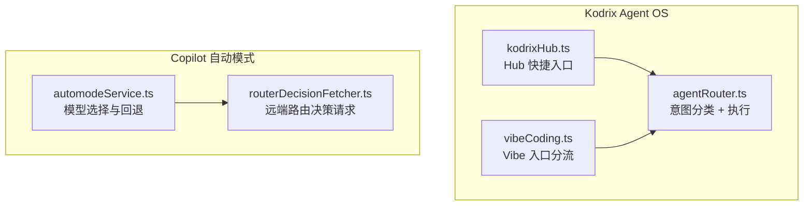
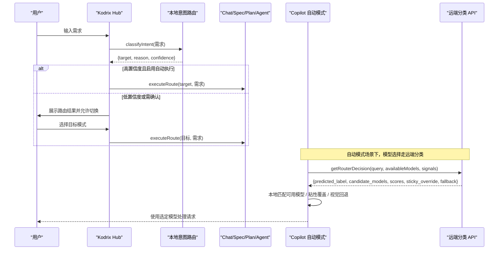
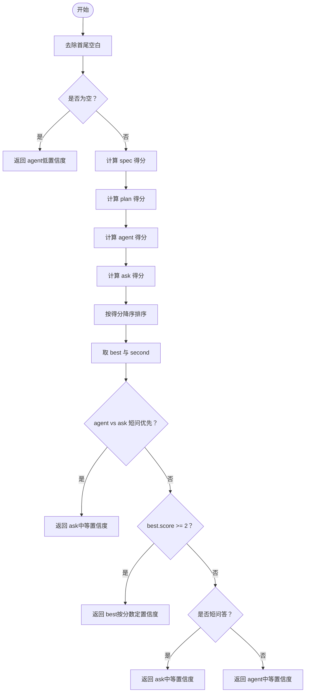
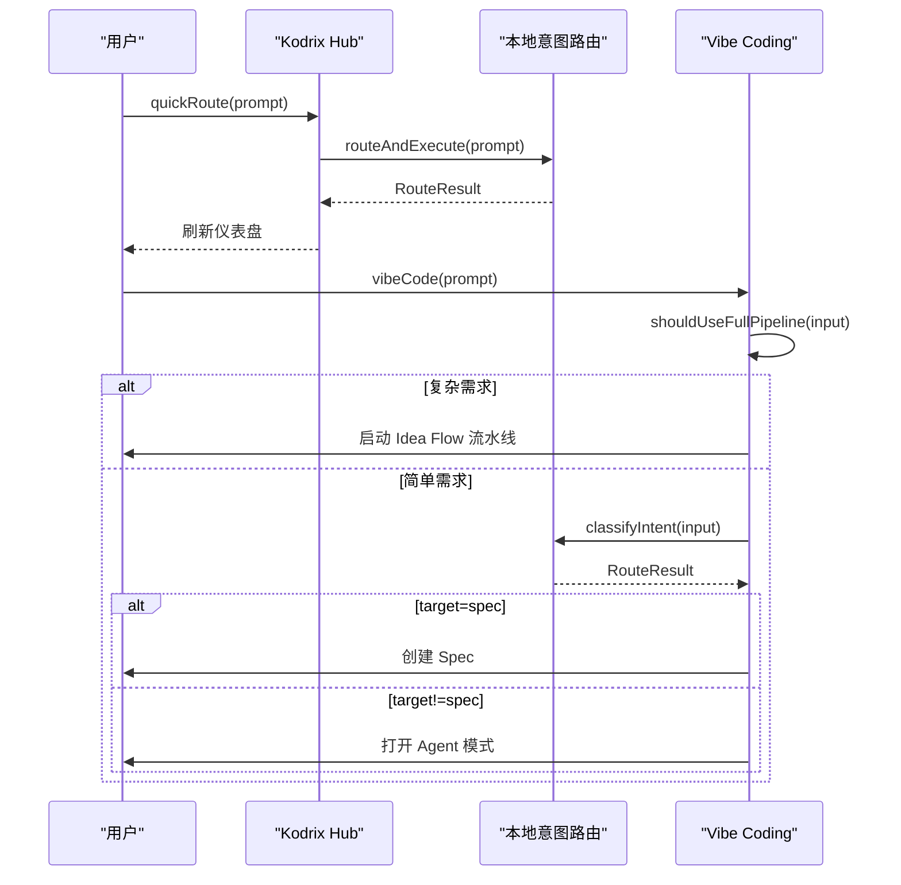
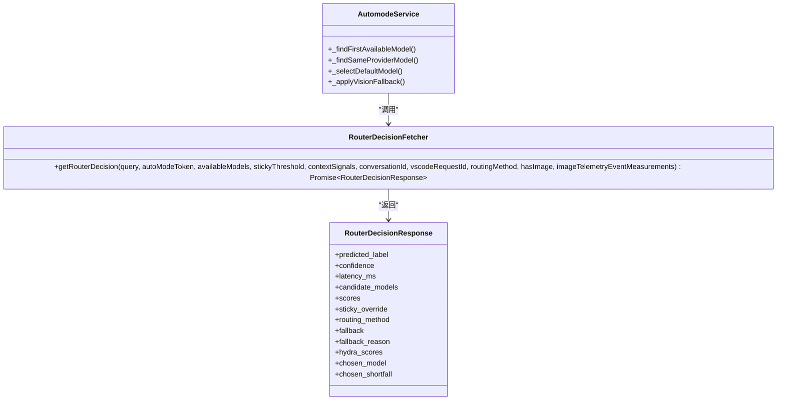
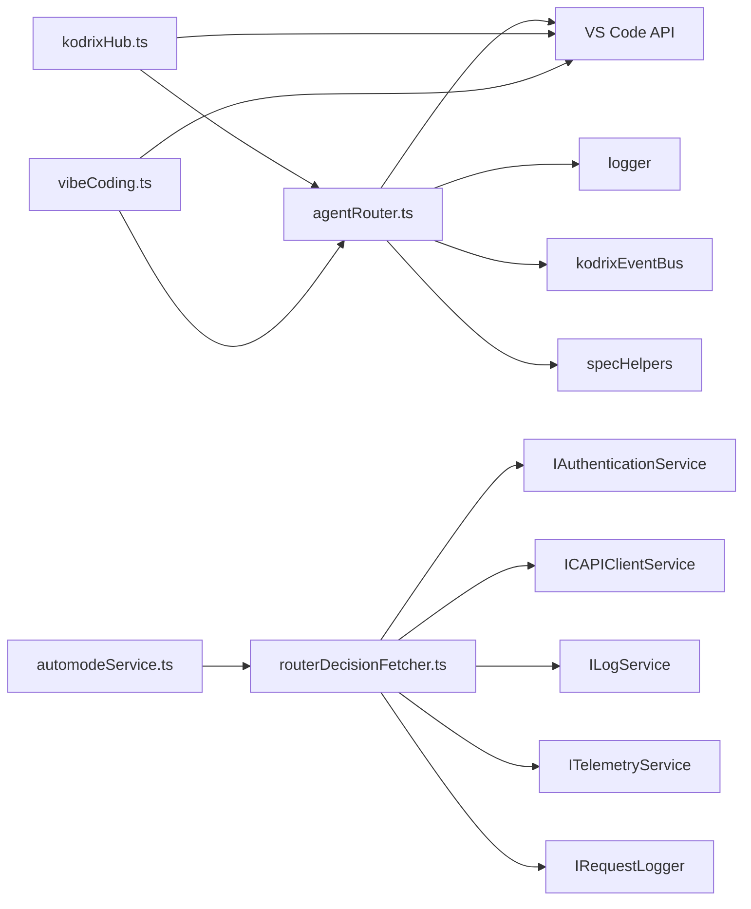
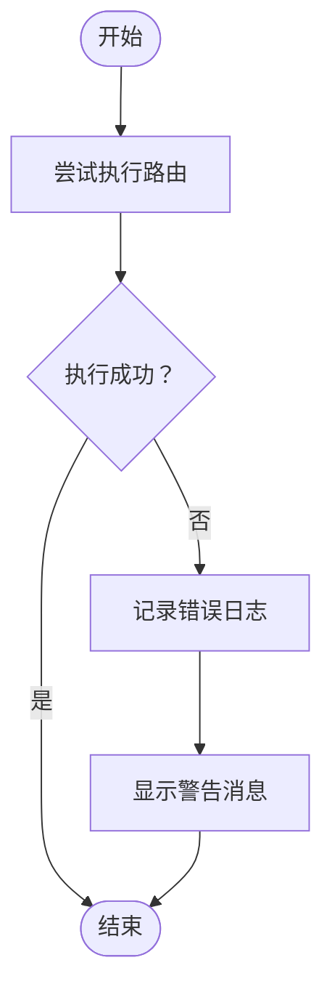

# 智能路由机制

<cite>
**本文引用的文件**   
- [agentRouter.ts](file://extensions/kodrix-agent-os/src/router/agentRouter.ts)
- [kodrixHub.ts](file://extensions/kodrix-agent-os/src/experience/kodrixHub.ts)
- [vibeCoding.ts](file://extensions/kodrix-agent-os/src/experience/vibeCoding.ts)
- [routerDecisionFetcher.ts](file://extensions/copilot/src/platform/endpoint/node/routerDecisionFetcher.ts)
- [automodeService.ts](file://extensions/copilot/src/platform/endpoint/node/automodeService.ts)
- [项目非常有必要新实现的核心功能总报告.md](file://docs/项目非常有必要新实现的核心功能总报告.md)
</cite>

## 目录
1. [引言](#引言)
2. [项目结构](#项目结构)
3. [核心组件](#核心组件)
4. [架构总览](#架构总览)
5. [详细组件分析](#详细组件分析)
6. [依赖关系分析](#依赖关系分析)
7. [性能与优化](#性能与优化)
8. [故障转移与容错](#故障转移与容错)
9. [配置与优先级管理](#配置与优先级管理)
10. [自定义路由最佳实践](#自定义路由最佳实践)
11. [常见问题排查](#常见问题排查)
12. [结论](#结论)

## 引言
本文件面向“智能路由机制”的完整技术文档，聚焦以下目标：
- 解释路由器的核心设计模式：任务分类算法、模型选择策略、负载均衡机制。
- 说明如何根据任务类型、复杂度、上下文信息动态选择合适的 AI 模型与 Agent。
- 梳理路由规则配置、优先级管理、故障转移机制。
- 提供路由决策流程图、模型映射表、性能优化策略。
- 给出自定义路由逻辑的实现示例与最佳实践。

仓库中存在两类互补的路由能力：
- 本地意图路由：基于正则权重与置信度，将用户输入自动分发到 Spec / Plan / Agent / Ask 四种工作流入口。
- Copilot 自动模式路由：通过远程分类 API 返回候选模型与评分，结合本地可用模型集合进行最终选择，并支持粘性覆盖与回退。

## 项目结构
与智能路由直接相关的代码主要分布在两个扩展中：
- `extensions/kodrix-agent-os`：Kodrix 自研的本地意图路由与 Hub/Vibe 入口。
- `extensions/copilot`：Copilot 自动模式的远端路由决策与模型选择服务。

图表来源
- [agentRouter.ts:1-265](file://extensions/kodrix-agent-os/src/router/agentRouter.ts#L1-L265)
- [kodrixHub.ts:1-273](file://extensions/kodrix-agent-os/src/experience/kodrixHub.ts#L1-L273)
- [vibeCoding.ts:1-136](file://extensions/kodrix-agent-os/src/experience/vibeCoding.ts#L1-L136)
- [routerDecisionFetcher.ts:1-215](file://extensions/copilot/src/platform/endpoint/node/routerDecisionFetcher.ts#L1-L215)
- [automodeService.ts:371-477](file://extensions/copilot/src/platform/endpoint/node/automodeService.ts#L371-L477)

章节来源
- [agentRouter.ts:1-265](file://extensions/kodrix-agent-os/src/router/agentRouter.ts#L1-L265)
- [kodrixHub.ts:1-273](file://extensions/kodrix-agent-os/src/experience/kodrixHub.ts#L1-L273)
- [vibeCoding.ts:1-136](file://extensions/kodrix-agent-os/src/experience/vibeCoding.ts#L1-L136)
- [routerDecisionFetcher.ts:1-215](file://extensions/copilot/src/platform/endpoint/node/routerDecisionFetcher.ts#L1-L215)
- [automodeService.ts:371-477](file://extensions/copilot/src/platform/endpoint/node/automodeService.ts#L371-L477)

## 核心组件
- 本地意图路由器（Kodrix）
  - 职责：对自然语言输入进行意图分类，输出目标模式（spec/plan/agent/ask）、原因与置信度；随后执行对应命令或打开 Chat 会话。
  - 关键函数：`classifyIntent`、`executeRoute`、`routeAgentPrompt`、`routeAndExecute`、`registerRouter`。
- Hub 与 Vibe 入口
  - 职责：作为用户交互入口，调用本地意图路由或直接进入 Idea Flow 流水线。
  - 关键函数：`openKodrixHub`、`handleMessage`、`vibeCode`、`shouldUseFullPipeline`。
- Copilot 自动模式路由
  - 职责：向远端分类 API 发起请求，获取预测标签、候选模型、评分、粘性覆盖等结果；在本地匹配可用模型，必要时应用视觉回退与默认模型选择。
  - 关键类/函数：`RouterDecisionFetcher.getRouterDecision`、`AutomodeService` 中的模型选择与回退逻辑。

章节来源
- [agentRouter.ts:72-113](file://extensions/kodrix-agent-os/src/router/agentRouter.ts#L72-L113)
- [agentRouter.ts:141-248](file://extensions/kodrix-agent-os/src/router/agentRouter.ts#L141-L248)
- [kodrixHub.ts:175-226](file://extensions/kodrix-agent-os/src/experience/kodrixHub.ts#L175-L226)
- [vibeCoding.ts:20-93](file://extensions/kodrix-agent-os/src/experience/vibeCoding.ts#L20-L93)
- [routerDecisionFetcher.ts:60-213](file://extensions/copilot/src/platform/endpoint/node/routerDecisionFetcher.ts#L60-L213)
- [automodeService.ts:371-477](file://extensions/copilot/src/platform/endpoint/node/automodeService.ts#L371-L477)

## 架构总览
整体路由架构分为两层：
- 第一层：本地意图路由（Kodrix），负责快速判断用户意图与工作流入口。
- 第二层：Copilot 自动模式路由，负责从远端分类服务获取模型建议，并在本地完成模型匹配与回退。

图表来源
- [kodrixHub.ts:175-226](file://extensions/kodrix-agent-os/src/experience/kodrixHub.ts#L175-L226)
- [agentRouter.ts:141-248](file://extensions/kodrix-agent-os/src/router/agentRouter.ts#L141-L248)
- [routerDecisionFetcher.ts:70-213](file://extensions/copilot/src/platform/endpoint/node/routerDecisionFetcher.ts#L70-L213)
- [automodeService.ts:371-477](file://extensions/copilot/src/platform/endpoint/node/automodeService.ts#L371-L477)

## 详细组件分析

### 本地意图路由（Kodrix）
- 设计模式
  - 规则引擎：为每个目标模式定义一组正则模式与权重，计算总分后排序取最高分。
  - 置信度分级：根据分数阈值映射为 high/medium/low。
  - 特殊修正：短问答优先 ask；空输入默认 agent。
- 数据流
  - 输入：用户文本。
  - 处理：scorePatterns → 排序 → 置信度判定 → 特殊修正。
  - 输出：RouteResult（target/reason/confidence）。
- 执行路径
  - routeAgentPrompt：读取开关、显示输入框、按置信度决定是否自动执行。
  - executeRoute：根据 target 打开对应命令或 Chat 会话。
  - routeAndExecute：Hub 快捷入口，始终执行并记录历史。

图表来源
- [agentRouter.ts:58-113](file://extensions/kodrix-agent-os/src/router/agentRouter.ts#L58-L113)

章节来源
- [agentRouter.ts:30-56](file://extensions/kodrix-agent-os/src/router/agentRouter.ts#L30-L56)
- [agentRouter.ts:58-113](file://extensions/kodrix-agent-os/src/router/agentRouter.ts#L58-L113)
- [agentRouter.ts:141-248](file://extensions/kodrix-agent-os/src/router/agentRouter.ts#L141-L248)

### Hub 与 Vibe 入口
- Hub
  - 提供“快速路由”入口，直接调用 `routeAndExecute`，并刷新仪表盘。
  - 提供“意图检测”预览，将 classifyIntent 的结果以人类可读标签展示。
- Vibe Coding
  - 先判断是否应进入 Idea Flow 全量流水线（复杂/模糊/多功能描述）。
  - 否则调用 classifyIntent，若为 spec 则创建 Spec，否则进入 Agent 模式。

图表来源
- [kodrixHub.ts:175-226](file://extensions/kodrix-agent-os/src/experience/kodrixHub.ts#L175-L226)
- [vibeCoding.ts:20-93](file://extensions/kodrix-agent-os/src/experience/vibeCoding.ts#L20-L93)
- [agentRouter.ts:243-248](file://extensions/kodrix-agent-os/src/router/agentRouter.ts#L243-L248)

章节来源
- [kodrixHub.ts:175-226](file://extensions/kodrix-agent-os/src/experience/kodrixHub.ts#L175-L226)
- [vibeCoding.ts:20-93](file://extensions/kodrix-agent-os/src/experience/vibeCoding.ts#L20-L93)

### Copilot 自动模式路由
- 远端分类 API
  - 请求体包含 prompt、available_models、contextSignals、sticky_threshold、routing_method、has_image 等。
  - 响应体包含 predicted_label、confidence、scores、candidate_models、sticky_override、fallback、hydra_scores、chosen_model 等。
  - 错误处理：非 OK 状态码抛出 RouterDecisionError，携带 errorCode。
- 本地模型选择
  - 优先尝试匹配 candidate_models 中的已知端点。
  - 若未匹配，则回退到默认模型选择逻辑。
  - 支持粘性覆盖（sticky_override）与视觉回退（vision fallback）。

图表来源
- [routerDecisionFetcher.ts:16-32](file://extensions/copilot/src/platform/endpoint/node/routerDecisionFetcher.ts#L16-L32)
- [routerDecisionFetcher.ts:60-213](file://extensions/copilot/src/platform/endpoint/node/routerDecisionFetcher.ts#L60-L213)
- [automodeService.ts:371-477](file://extensions/copilot/src/platform/endpoint/node/automodeService.ts#L371-L477)

章节来源
- [routerDecisionFetcher.ts:16-32](file://extensions/copilot/src/platform/endpoint/node/routerDecisionFetcher.ts#L16-L32)
- [routerDecisionFetcher.ts:70-213](file://extensions/copilot/src/platform/endpoint/node/routerDecisionFetcher.ts#L70-L213)
- [automodeService.ts:371-477](file://extensions/copilot/src/platform/endpoint/node/automodeService.ts#L371-L477)

## 依赖关系分析
- 本地意图路由依赖 VS Code API（workspace configuration、window、commands）与 Kodrix 内部模块（logger、eventBus、specHelpers）。
- Hub 与 Vibe 依赖本地意图路由与 VS Code 命令体系。
- Copilot 自动模式路由依赖认证服务、网络请求、日志与遥测服务。

图表来源
- [agentRouter.ts:1-265](file://extensions/kodrix-agent-os/src/router/agentRouter.ts#L1-L265)
- [kodrixHub.ts:1-273](file://extensions/kodrix-agent-os/src/experience/kodrixHub.ts#L1-L273)
- [vibeCoding.ts:1-136](file://extensions/kodrix-agent-os/src/experience/vibeCoding.ts#L1-L136)
- [routerDecisionFetcher.ts:1-215](file://extensions/copilot/src/platform/endpoint/node/routerDecisionFetcher.ts#L1-L215)

章节来源
- [agentRouter.ts:1-265](file://extensions/kodrix-agent-os/src/router/agentRouter.ts#L1-L265)
- [kodrixHub.ts:1-273](file://extensions/kodrix-agent-os/src/experience/kodrixHub.ts#L1-L273)
- [vibeCoding.ts:1-136](file://extensions/kodrix-agent-os/src/experience/vibeCoding.ts#L1-L136)
- [routerDecisionFetcher.ts:1-215](file://extensions/copilot/src/platform/endpoint/node/routerDecisionFetcher.ts#L1-L215)

## 性能与优化
- 本地意图路由
  - 时间复杂度：O(P)，P 为所有模式数量；空间复杂度：O(S)，S 为模式数组大小。
  - 优化建议：
    - 预编译正则表达式（当前已声明常量数组，避免重复构造）。
    - 对高频模式设置更高权重，减少误判导致的二次确认。
    - 限制输入长度（已有短问答分支），降低正则匹配开销。
- Copilot 自动模式路由
  - 网络延迟：请求超时 2.5 秒，避免长时间阻塞。
  - 遥测与日志：记录端到端延迟、候选模型、粘性覆盖、Hydra 多维评分等，便于性能分析与 A/B 实验。
  - 优化建议：
    - 缓存最近一次路由决策（session 级别），减少重复请求。
    - 对 candidate_models 做本地快速匹配，避免不必要的回退。
    - 合理设置 sticky_threshold，减少频繁切换模型带来的抖动。

章节来源
- [agentRouter.ts:58-113](file://extensions/kodrix-agent-os/src/router/agentRouter.ts#L58-L113)
- [routerDecisionFetcher.ts:70-213](file://extensions/copilot/src/platform/endpoint/node/routerDecisionFetcher.ts#L70-L213)

## 故障转移与容错
- 本地意图路由
  - executeRoute 捕获异常并记录日志，同时向用户展示警告消息。
  - 当路由执行失败时，不中断主流程，仅提示用户。
- Copilot 自动模式路由
  - RouterDecisionError：当远端 API 返回非 OK 状态码时抛出，携带 errorCode，便于上层分类处理。
  - AutomodeService：若 candidate_models 为空或未匹配已知端点，则回退到默认模型选择；支持视觉回退（当请求含图片但模型不支持时）。

图表来源
- [agentRouter.ts:192-234](file://extensions/kodrix-agent-os/src/router/agentRouter.ts#L192-L234)
- [routerDecisionFetcher.ts:102-112](file://extensions/copilot/src/platform/endpoint/node/routerDecisionFetcher.ts#L102-L112)
- [automodeService.ts:371-477](file://extensions/copilot/src/platform/endpoint/node/automodeService.ts#L371-L477)

章节来源
- [agentRouter.ts:192-234](file://extensions/kodrix-agent-os/src/router/agentRouter.ts#L192-L234)
- [routerDecisionFetcher.ts:102-112](file://extensions/copilot/src/platform/endpoint/node/routerDecisionFetcher.ts#L102-L112)
- [automodeService.ts:371-477](file://extensions/copilot/src/platform/endpoint/node/automodeService.ts#L371-L477)

## 配置与优先级管理
- 功能开关
  - `kodrix.features.agentRouter`：控制智能路由是否启用。
  - `kodrix.router.autoExecute`：高置信度时是否自动执行。
  - `kodrix.features.vibeCoding`：控制 Vibe Coding 是否启用。
- 优先级
  - 本地意图路由按模式权重排序，最高分胜出；存在特殊修正（如短问答优先 ask）。
  - Copilot 自动模式路由按远端评分与候选模型顺序选择，支持粘性覆盖与视觉回退。

章节来源
- [agentRouter.ts:141-159](file://extensions/kodrix-agent-os/src/router/agentRouter.ts#L141-L159)
- [vibeCoding.ts:20-25](file://extensions/kodrix-agent-os/src/experience/vibeCoding.ts#L20-L25)
- [routerDecisionFetcher.ts:70-85](file://extensions/copilot/src/platform/endpoint/node/routerDecisionFetcher.ts#L70-L85)
- [automodeService.ts:371-477](file://extensions/copilot/src/platform/endpoint/node/automodeService.ts#L371-L477)

## 自定义路由最佳实践
- 扩展本地意图路由
  - 新增模式：在 SPEC_PATTERNS / PLAN_PATTERNS / AGENT_PATTERNS / ASK_PATTERNS 中添加新的正则与权重。
  - 调整置信度阈值：修改 confidenceFromScore 的逻辑，适应不同业务场景。
  - 增加特殊修正：在 classifyIntent 中增加针对特定领域的前置或后置规则。
- 集成 Copilot 自动模式
  - 传入 contextSignals：如 turn_number、session_id、previous_model 等，帮助远端更精准分类。
  - 设置 sticky_threshold：控制粘性覆盖阈值，减少模型频繁切换。
  - 处理 fallback：当远端返回 fallback=true 时，采用默认模型选择逻辑。

章节来源
- [agentRouter.ts:30-56](file://extensions/kodrix-agent-os/src/router/agentRouter.ts#L30-L56)
- [agentRouter.ts:62-70](file://extensions/kodrix-agent-os/src/router/agentRouter.ts#L62-L70)
- [agentRouter.ts:72-113](file://extensions/kodrix-agent-os/src/router/agentRouter.ts#L72-L113)
- [routerDecisionFetcher.ts:70-85](file://extensions/copilot/src/platform/endpoint/node/routerDecisionFetcher.ts#L70-L85)

## 常见问题排查
- 智能路由未生效
  - 检查 `kodrix.features.agentRouter` 是否启用。
  - 检查 `kodrix.router.autoExecute` 是否导致低置信度请求被拦截。
- 路由结果不符合预期
  - 检查正则模式权重是否合理。
  - 检查是否存在短问答误判为 agent 的情况。
- Copilot 自动模式路由失败
  - 检查远端 API 是否返回非 OK 状态码。
  - 检查 candidate_models 是否与已知端点匹配。
  - 检查是否触发了视觉回退逻辑。

章节来源
- [agentRouter.ts:141-159](file://extensions/kodrix-agent-os/src/router/agentRouter.ts#L141-L159)
- [agentRouter.ts:192-234](file://extensions/kodrix-agent-os/src/router/agentRouter.ts#L192-L234)
- [routerDecisionFetcher.ts:102-112](file://extensions/copilot/src/platform/endpoint/node/routerDecisionFetcher.ts#L102-L112)
- [automodeService.ts:371-477](file://extensions/copilot/src/platform/endpoint/node/automodeService.ts#L371-L477)

## 结论
本项目的智能路由机制由两层构成：本地意图路由负责快速分发工作流入口，Copilot 自动模式路由负责远端分类与模型选择。两者协同工作，既保证了用户体验的流畅性，又提供了灵活的模型选择与回退机制。通过合理的配置、优先级管理与故障转移策略，系统能够在不同场景下稳定运行，并为后续扩展与优化提供了坚实基础。