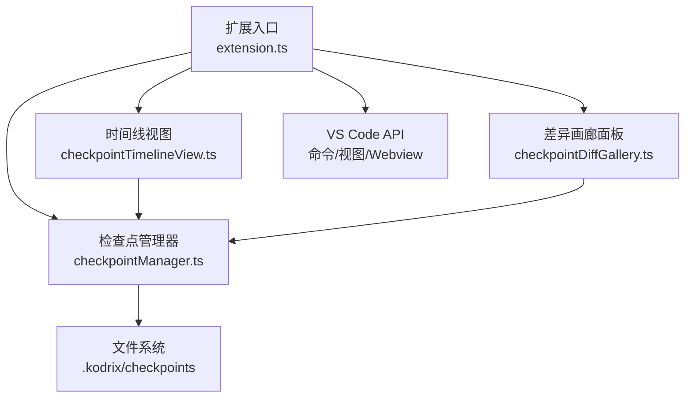
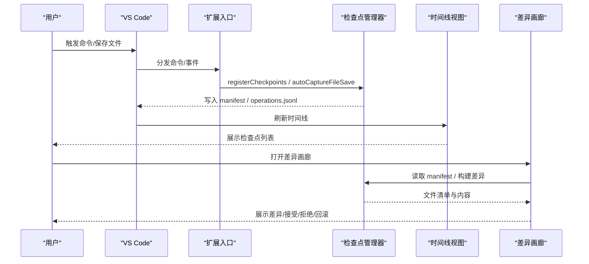
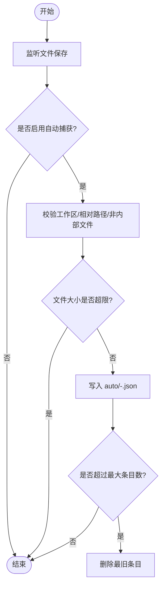
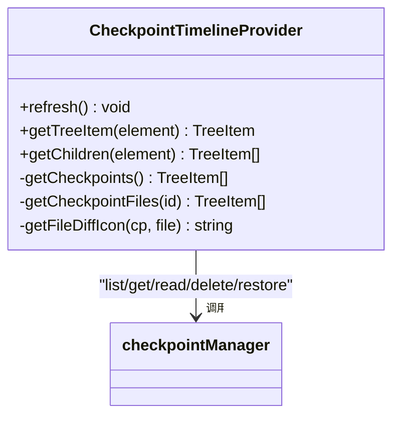
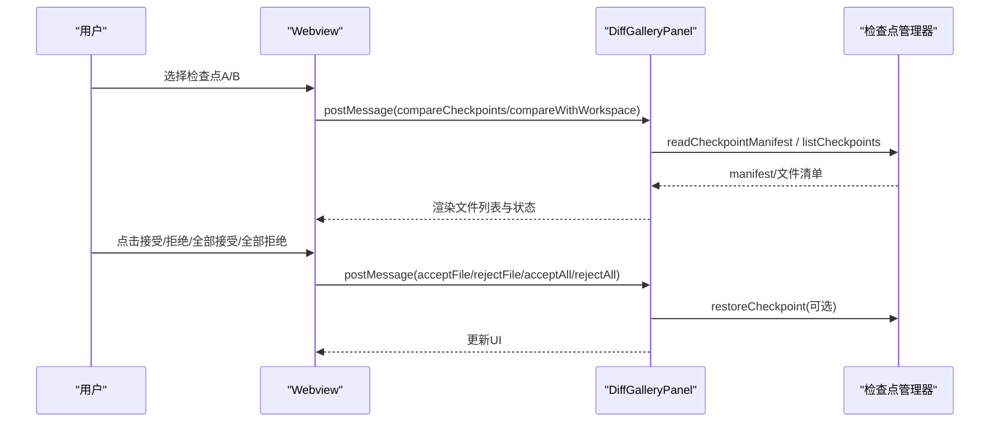
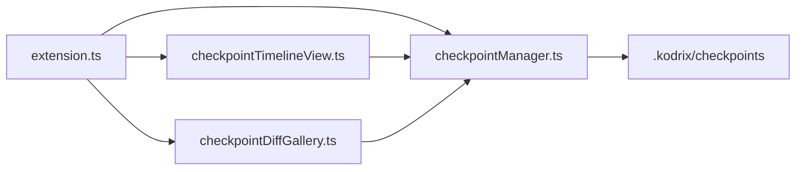

# 检查点可视化系统

<cite>
**本文引用的文件**
- [extensions/kodrix-agent-os/src/checkpoint/checkpointManager.ts](file://extensions/kodrix-agent-os/src/checkpoint/checkpointManager.ts)
- [extensions/kodrix-agent-os/src/checkpoint/checkpointTimelineView.ts](file://extensions/kodrix-agent-os/src/checkpoint/checkpointTimelineView.ts)
- [extensions/kodrix-agent-os/src/checkpoint/checkpointDiffGallery.ts](file://extensions/kodrix-agent-os/src/checkpoint/checkpointDiffGallery.ts)
- [extensions/kodrix-agent-os/src/extension.ts](file://extensions/kodrix-agent-os/src/extension.ts)
- [extensions/kodrix-agent-os/package.json](file://extensions/kodrix-agent-os/package.json)
- [extensions/kodrix-agent-os/src/test/checkpointManager.test.ts](file://extensions/kodrix-agent-os/src/test/checkpointManager.test.ts)
</cite>

## 目录
1. [简介](#简介)
2. [项目结构](#项目结构)
3. [核心组件](#核心组件)
4. [架构总览](#架构总览)
5. [详细组件分析](#详细组件分析)
6. [依赖关系分析](#依赖关系分析)
7. [性能与容量特性](#性能与容量特性)
8. [故障排查指南](#故障排查指南)
9. [结论](#结论)
10. [附录：测试与验证要点](#附录测试与验证要点)

## 简介
本系统为 Kodrix Agent OS 的“检查点可视化”能力，提供代码变更的可回滚、时间线查看与差异对比。它通过自动捕获与手动创建检查点，持久化工作区文件快照，并在侧边栏以树形视图展示；同时提供 Webview 画廊进行多检查点对比、逐文件接受/拒绝与批量回滚。该能力与扩展主入口集成，在激活时注册命令、视图与事件监听。

## 项目结构
围绕检查点功能的核心文件组织如下：
- checkpointManager.ts：检查点的创建、列出、恢复、删除、操作日志与自动捕获等核心逻辑
- checkpointTimelineView.ts：侧边栏 TreeView 时间线，支持展开查看文件、打开 Diff、右键回滚/删除
- checkpointDiffGallery.ts：Webview 差异画廊，支持选择两个检查点或检查点 vs 当前工作区进行对比、逐文件接受/拒绝、批量操作与回滚
- extension.ts：扩展激活入口，统一注册检查点相关模块
- package.json：声明本地化资源、命令、视图容器与配置项，并包含脚本与测试入口

图表来源
- [extensions/kodrix-agent-os/src/extension.ts:169-228](file://extensions/kodrix-agent-os/src/extension.ts#L169-L228)
- [extensions/kodrix-agent-os/src/checkpoint/checkpointManager.ts:1-12](file://extensions/kodrix-agent-os/src/checkpoint/checkpointManager.ts#L1-L12)
- [extensions/kodrix-agent-os/src/checkpoint/checkpointTimelineView.ts:1-23](file://extensions/kodrix-agent-os/src/checkpoint/checkpointTimelineView.ts#L1-L23)
- [extensions/kodrix-agent-os/src/checkpoint/checkpointDiffGallery.ts:1-23](file://extensions/kodrix-agent-os/src/checkpoint/checkpointDiffGallery.ts#L1-L23)

章节来源
- [extensions/kodrix-agent-os/src/extension.ts:169-228](file://extensions/kodrix-agent-os/src/extension.ts#L169-L228)
- [extensions/kodrix-agent-os/package.json:56-84](file://extensions/kodrix-agent-os/package.json#L56-L84)

## 核心组件
- 检查点管理器（checkpointManager）
  - 负责创建/列出/读取/删除检查点，安全恢复，自动捕获保存事件，以及操作日志滚动
  - 关键数据结构：CheckpointFile、CheckpointManifest、CheckpointSummary、CheckpointOperation
- 时间线视图（checkpointTimelineView）
  - TreeDataProvider 实现，按时间倒序展示检查点，展开显示文件清单，支持单文件 Diff、右键回滚/删除
- 差异画廊（checkpointDiffGallery）
  - Webview 面板，支持两检查点对比或检查点 vs 工作区，逐文件接受/拒绝、批量操作、回滚到指定检查点
- 扩展入口（extension.ts）
  - 在 activate 中注册检查点相关命令、视图与画廊，并订阅保存事件触发自动捕获

章节来源
- [extensions/kodrix-agent-os/src/checkpoint/checkpointManager.ts:29-56](file://extensions/kodrix-agent-os/src/checkpoint/checkpointManager.ts#L29-L56)
- [extensions/kodrix-agent-os/src/checkpoint/checkpointTimelineView.ts:31-114](file://extensions/kodrix-agent-os/src/checkpoint/checkpointTimelineView.ts#L31-L114)
- [extensions/kodrix-agent-os/src/checkpoint/checkpointDiffGallery.ts:41-137](file://extensions/kodrix-agent-os/src/checkpoint/checkpointDiffGallery.ts#L41-L137)
- [extensions/kodrix-agent-os/src/extension.ts:213-215](file://extensions/kodrix-agent-os/src/extension.ts#L213-L215)

## 架构总览
检查点系统采用“数据层 + 视图层 + 交互层”的分层设计：
- 数据层：checkpointManager 管理 .kodrix/checkpoints 下的 manifest 与自动捕获条目，提供安全的 restore 路径校验与操作日志滚动
- 视图层：时间线 TreeView 与 Webview 画廊分别提供列表与对比界面
- 交互层：命令注册、QuickPick、TreeView 菜单、Webview 消息通道驱动用户操作

图表来源
- [extensions/kodrix-agent-os/src/extension.ts:213-215](file://extensions/kodrix-agent-os/src/extension.ts#L213-L215)
- [extensions/kodrix-agent-os/src/checkpoint/checkpointManager.ts:378-494](file://extensions/kodrix-agent-os/src/checkpoint/checkpointManager.ts#L378-L494)
- [extensions/kodrix-agent-os/src/checkpoint/checkpointTimelineView.ts:132-242](file://extensions/kodrix-agent-os/src/checkpoint/checkpointTimelineView.ts#L132-L242)
- [extensions/kodrix-agent-os/src/checkpoint/checkpointDiffGallery.ts:61-137](file://extensions/kodrix-agent-os/src/checkpoint/checkpointDiffGallery.ts#L61-L137)

## 详细组件分析

### 检查点管理器（checkpointManager）
- 创建检查点
  - 收集当前打开的工作区内文本文档，过滤 .kodrix 内部文件与大文件，生成 manifest 并落盘
  - 返回检查点 id，供后续操作引用
- 列出与读取
  - listCheckpoints 过滤 auto/ 与 operations.jsonl，按创建时间倒序
  - readCheckpointManifest 读取指定检查点的完整清单
- 安全恢复
  - restoreCheckpoint 对 manifest 中的 relPath 执行路径穿越防护，仅允许在工作区内恢复
- 自动捕获
  - onDidSaveTextDocument 触发 autoCaptureFileSave，将保存的文件快照写入 auto/ 目录，并按 maxEntries 滚动清理
- 操作日志
  - recordOperation 追加 operations.jsonl，超过大小或行数阈值时滚动保留最近 N 条
- 删除与预览
  - deleteCheckpoint 删除指定检查点目录
  - showCheckpointFilesPreview 打开 Markdown 预览文件清单

图表来源
- [extensions/kodrix-agent-os/src/checkpoint/checkpointManager.ts:287-325](file://extensions/kodrix-agent-os/src/checkpoint/checkpointManager.ts#L287-L325)

章节来源
- [extensions/kodrix-agent-os/src/checkpoint/checkpointManager.ts:123-169](file://extensions/kodrix-agent-os/src/checkpoint/checkpointManager.ts#L123-L169)
- [extensions/kodrix-agent-os/src/checkpoint/checkpointManager.ts:171-199](file://extensions/kodrix-agent-os/src/checkpoint/checkpointManager.ts#L171-L199)
- [extensions/kodrix-agent-os/src/checkpoint/checkpointManager.ts:201-231](file://extensions/kodrix-agent-os/src/checkpoint/checkpointManager.ts#L201-L231)
- [extensions/kodrix-agent-os/src/checkpoint/checkpointManager.ts:233-285](file://extensions/kodrix-agent-os/src/checkpoint/checkpointManager.ts#L233-L285)
- [extensions/kodrix-agent-os/src/checkpoint/checkpointManager.ts:378-494](file://extensions/kodrix-agent-os/src/checkpoint/checkpointManager.ts#L378-L494)

### 时间线视图（checkpointTimelineView）
- 树形数据源
  - getChildren 根节点列出所有检查点，子节点列出检查点内文件
- 交互
  - 点击文件打开 Diff（检查点版本 vs 当前工作区）
  - 右键菜单支持回滚与删除
  - 监听保存事件延迟刷新，避免频繁重绘
- 国际化
  - 使用 l10n.t 包裹提示文案

图表来源
- [extensions/kodrix-agent-os/src/checkpoint/checkpointTimelineView.ts:31-114](file://extensions/kodrix-agent-os/src/checkpoint/checkpointTimelineView.ts#L31-L114)
- [extensions/kodrix-agent-os/src/checkpoint/checkpointManager.ts:171-199](file://extensions/kodrix-agent-os/src/checkpoint/checkpointManager.ts#L171-L199)

章节来源
- [extensions/kodrix-agent-os/src/checkpoint/checkpointTimelineView.ts:31-114](file://extensions/kodrix-agent-os/src/checkpoint/checkpointTimelineView.ts#L31-L114)
- [extensions/kodrix-agent-os/src/checkpoint/checkpointTimelineView.ts:132-242](file://extensions/kodrix-agent-os/src/checkpoint/checkpointTimelineView.ts#L132-L242)

### 差异画廊（checkpointDiffGallery）
- 面板生命周期
  - show 创建唯一实例，onDidReceiveMessage 处理前端指令
- 对比模式
  - compareCheckpoints：两检查点对比
  - compareWithWorkspace：检查点 vs 当前工作区（动态构建虚拟 manifest）
- 文件级操作
  - selectFile：打开单文件 Diff
  - acceptFile/rejectFile：接受/拒绝单个文件
  - acceptAll/rejectAll：批量接受/拒绝
  - rollbackTo：回滚到指定检查点
- UI 与 i18n
  - 内置 HTML/CSS，使用 l10n.t 注入中文文案

图表来源
- [extensions/kodrix-agent-os/src/checkpoint/checkpointDiffGallery.ts:61-137](file://extensions/kodrix-agent-os/src/checkpoint/checkpointDiffGallery.ts#L61-L137)
- [extensions/kodrix-agent-os/src/checkpoint/checkpointDiffGallery.ts:195-293](file://extensions/kodrix-agent-os/src/checkpoint/checkpointDiffGallery.ts#L195-L293)
- [extensions/kodrix-agent-os/src/checkpoint/checkpointManager.ts:201-231](file://extensions/kodrix-agent-os/src/checkpoint/checkpointManager.ts#L201-L231)

章节来源
- [extensions/kodrix-agent-os/src/checkpoint/checkpointDiffGallery.ts:41-137](file://extensions/kodrix-agent-os/src/checkpoint/checkpointDiffGallery.ts#L41-L137)
- [extensions/kodrix-agent-os/src/checkpoint/checkpointDiffGallery.ts:195-293](file://extensions/kodrix-agent-os/src/checkpoint/checkpointDiffGallery.ts#L195-L293)
- [extensions/kodrix-agent-os/src/checkpoint/checkpointDiffGallery.ts:664-723](file://extensions/kodrix-agent-os/src/checkpoint/checkpointDiffGallery.ts#L664-L723)

## 依赖关系分析
- 外部依赖
  - vscode API：commands、workspace、window、TreeView、WebviewPanel、l10n
  - 文件系统：fs、path 用于 manifest、auto 条目与 operations.jsonl 读写
- 内部依赖
  - extension.ts 作为装配器，集中注册各模块
  - package.json 声明 localizations、views、commands、configuration，确保 UI 与配置可被 VS Code 识别
- 耦合与内聚
  - 管理器与视图解耦：视图仅通过管理器暴露的函数访问数据与执行操作
  - 画廊与管理器通过消息通道协作，保持 UI 与业务逻辑分离

图表来源
- [extensions/kodrix-agent-os/src/extension.ts:213-215](file://extensions/kodrix-agent-os/src/extension.ts#L213-L215)
- [extensions/kodrix-agent-os/src/checkpoint/checkpointManager.ts:1-12](file://extensions/kodrix-agent-os/src/checkpoint/checkpointManager.ts#L1-L12)
- [extensions/kodrix-agent-os/src/checkpoint/checkpointTimelineView.ts:1-23](file://extensions/kodrix-agent-os/src/checkpoint/checkpointTimelineView.ts#L1-L23)
- [extensions/kodrix-agent-os/src/checkpoint/checkpointDiffGallery.ts:1-23](file://extensions/kodrix-agent-os/src/checkpoint/checkpointDiffGallery.ts#L1-L23)

章节来源
- [extensions/kodrix-agent-os/package.json:56-84](file://extensions/kodrix-agent-os/package.json#L56-L84)
- [extensions/kodrix-agent-os/src/extension.ts:213-215](file://extensions/kodrix-agent-os/src/extension.ts#L213-L215)

## 性能与容量特性
- 自动捕获滚动
  - operations.jsonl 超过 512KB 或超过 2000 行时滚动保留最近条目，避免无限增长
- 快照限制
  - 单次快照限制文件数量与单文件大小，防止大工程导致内存/磁盘压力
- 视图刷新节流
  - 时间线视图在保存后延迟刷新，降低频繁重绘开销
- 差异计算
  - 画廊基于 manifest 构建文件差异，仅比较必要文件，减少 IO 与 CPU 消耗

章节来源
- [extensions/kodrix-agent-os/src/checkpoint/checkpointManager.ts:233-259](file://extensions/kodrix-agent-os/src/checkpoint/checkpointManager.ts#L233-L259)
- [extensions/kodrix-agent-os/src/checkpoint/checkpointManager.ts:143-158](file://extensions/kodrix-agent-os/src/checkpoint/checkpointManager.ts#L143-L158)
- [extensions/kodrix-agent-os/src/checkpoint/checkpointTimelineView.ts:234-242](file://extensions/kodrix-agent-os/src/checkpoint/checkpointTimelineView.ts#L234-L242)

## 故障排查指南
- 无工作区
  - 现象：创建/回滚失败提示请先打开工作区
  - 原因：未检测到 workspaceFolders
  - 处理：先打开一个文件夹工作区
- 路径穿越防护
  - 现象：恢复时跳过不安全路径
  - 原因：manifest 中 relPath 包含绝对路径或 .. 段
  - 处理：修复 manifest 或重新创建检查点
- 自动捕获未生效
  - 现象：保存文件未产生新条目
  - 原因：配置关闭或文件属于 .kodrix 内部/过大
  - 处理：检查配置开关与文件大小
- 时间线不刷新
  - 现象：新增检查点后列表未更新
  - 原因：未触发刷新或延迟刷新尚未完成
  - 处理：手动执行刷新命令或等待延迟刷新

章节来源
- [extensions/kodrix-agent-os/src/checkpoint/checkpointManager.ts:201-231](file://extensions/kodrix-agent-os/src/checkpoint/checkpointManager.ts#L201-L231)
- [extensions/kodrix-agent-os/src/checkpoint/checkpointManager.ts:287-325](file://extensions/kodrix-agent-os/src/checkpoint/checkpointManager.ts#L287-L325)
- [extensions/kodrix-agent-os/src/checkpoint/checkpointTimelineView.ts:234-242](file://extensions/kodrix-agent-os/src/checkpoint/checkpointTimelineView.ts#L234-L242)

## 结论
检查点可视化系统通过“自动捕获 + 手动创建 + 安全恢复 + 可视化对比”形成完整的版本回溯闭环。其分层清晰、职责明确，既能满足日常开发中的快速回滚需求，也能支撑复杂的多检查点对比场景。配合完善的错误处理与容量控制，具备在生产环境稳定运行的基础。

## 附录：测试与验证要点
- 单元测试覆盖
  - 操作日志滚动上限、检查点列表过滤、恢复路径穿越防护、检查点创建与文件写入
- 运行方式
  - 使用扩展的 npm test 脚本编译并运行测试，依赖 runTests.js 提供的 vscode mock
- 验证建议
  - 在无工作区、超大文件、非法路径等边界条件下验证行为
  - 验证自动捕获滚动与时间线刷新频率
  - 验证画廊的批量接受/拒绝与回滚一致性

章节来源
- [extensions/kodrix-agent-os/src/test/checkpointManager.test.ts:1-37](file://extensions/kodrix-agent-os/src/test/checkpointManager.test.ts#L1-L37)
- [extensions/kodrix-agent-os/package.json:902-907](file://extensions/kodrix-agent-os/package.json#L902-L907)