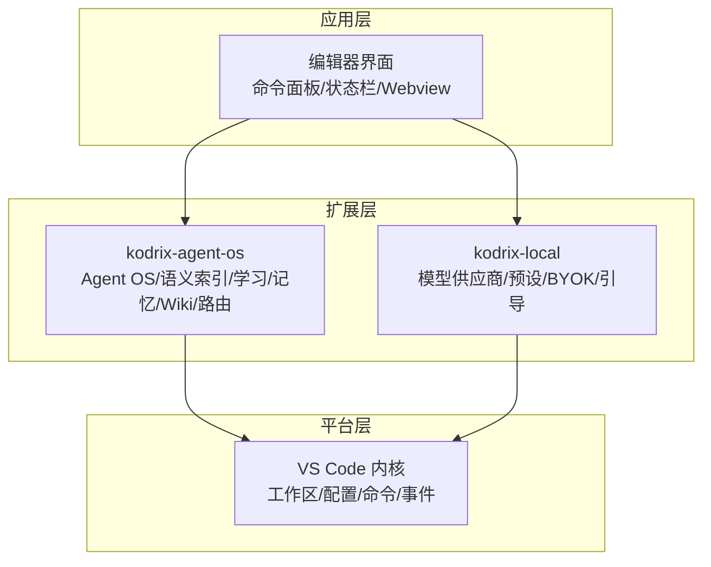
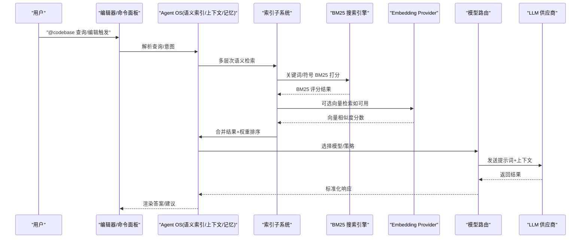
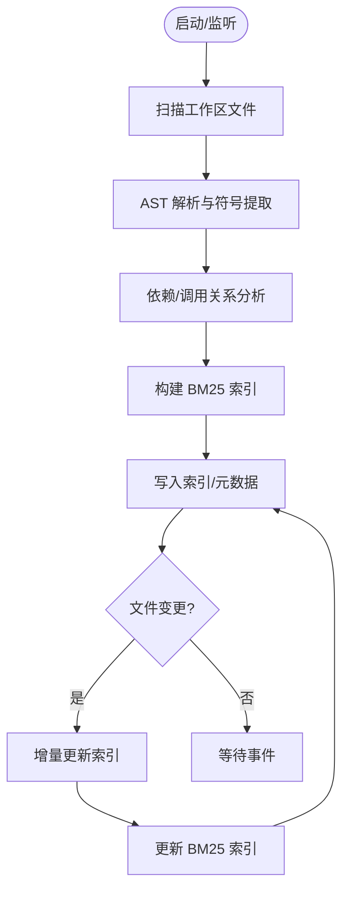
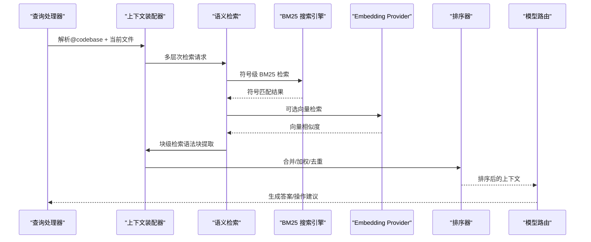
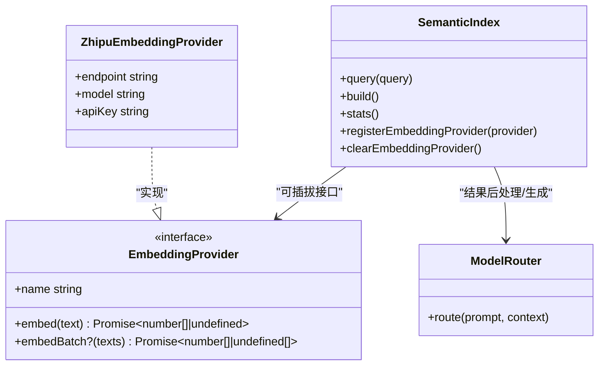
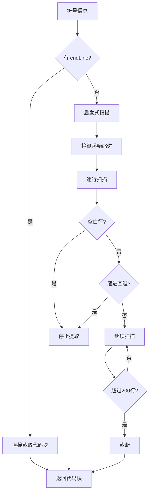
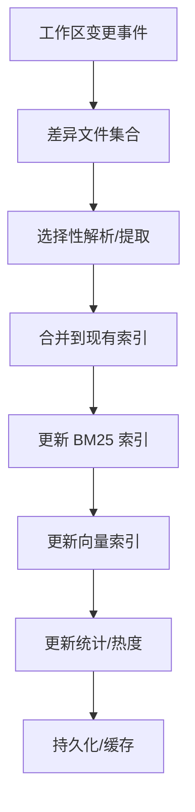
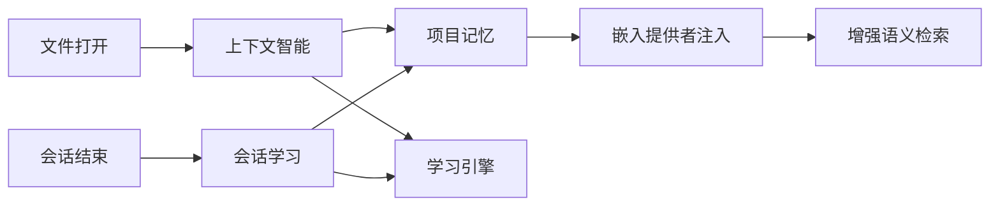
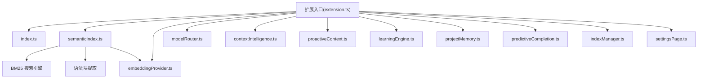

# 代码库智能架构

<cite>
**本文引用的文件**   
- [README.md](file://README.md)
- [extensions/kodrix-agent-os/src/extension.ts](file://extensions/kodrix-agent-os/src/extension.ts)
- [extensions/kodrix-local/src/extension.ts](file://extensions/kodrix-local/src/extension.ts)
- [extensions/kodrix-agent-os/src/codebase/index.ts](file://extensions/kodrix-agent-os/src/codebase/index.ts)
- [extensions/kodrix-agent-os/src/codebase/projectIndexer.ts](file://extensions/kodrix-agent-os/src/codebase/projectIndexer.ts)
- [extensions/kodrix-agent-os/src/codebase/semanticIndex.ts](file://extensions/kodrix-agent-os/src/codebase/semanticIndex.ts)
- [extensions/kodrix-agent-os/src/codebase/embeddingProvider.ts](file://extensions/kodrix-agent-os/src/codebase/embeddingProvider.ts)
- [extensions/kodrix-agent-os/src/codebase/indexManager.ts](file://extensions/kodrix-agent-os/src/codebase/indexManager.ts)
- [extensions/kodrix-agent-os/src/codebase/settingsPage.ts](file://extensions/kodrix-agent-os/src/codebase/settingsPage.ts)
- [extensions/kodrix-agent-os/src/codebase/types.ts](file://extensions/kodrix-agent-os/src/codebase/types.ts)
- [extensions/kodrix-agent-os/src/codebase/predictiveCompletion.ts](file://extensions/kodrix-agent-os/src/codebase/predictiveCompletion.ts)
- [extensions/kodrix-agent-os/src/codebase/codebaseQuery.ts](file://extensions/kodrix-agent-os/src/codebase/codebaseQuery.ts)
- [extensions/kodrix-agent-os/src/model/modelRouter.ts](file://extensions/kodrix-agent-os/src/model/modelRouter.ts)
- [extensions/kodrix-agent-os/src/context/contextIntelligence.ts](file://extensions/kodrix-agent-os/src/context/contextIntelligence.ts)
- [extensions/kodrix-agent-os/src/context/proactiveContext.ts](file://extensions/kodrix-agent-os/src/context/proactiveContext.ts)
- [extensions/kodrix-agent-os/src/learning/learningEngine.ts](file://extensions/kodrix-agent-os/src/learning/learningEngine.ts)
- [extensions/kodrix-agent-os/src/learning/semanticMemory.ts](file://extensions/kodrix-agent-os/src/learning/semanticMemory.ts)
- [extensions/kodrix-agent-os/src/memory/projectMemory.ts](file://extensions/kodrix-agent-os/src/memory/projectMemory.ts)
- [extensions/kodrix-agent-os/src/router/agentRouter.ts](file://extensions/kodrix-agent-os/src/router/agentRouter.ts)
- [extensions/kodrix-agent-os/src/experience/workspaceBootstrap.ts](file://extensions/kodrix-agent-os/src/experience/workspaceBootstrap.ts)
- [extensions/kodrix-agent-os/src/shared/constants.ts](file://extensions/kodrix-agent-os/src/shared/constants.ts)
</cite>

## 更新摘要
**变更内容**   
- 增强了语义索引系统，新增 BM25 搜索算法实现
- 实现了可插拔的嵌入提供程序架构，支持多种 LLM 供应商
- 添加了语法块级别的检索能力，对标 Cursor 的 syntax-block embedding
- 完善了多层次的检索策略（符号级、块级、文件级）
- 优化了检索回退机制，确保在无向量服务时仍能正常工作

## 目录
1. [简介](#简介)
2. [项目结构](#项目结构)
3. [核心组件](#核心组件)
4. [架构总览](#架构总览)
5. [详细组件分析](#详细组件分析)
6. [依赖关系分析](#依赖关系分析)
7. [性能与大规模工程优化](#性能与大规模工程优化)
8. [故障排查指南](#故障排查指南)
9. [结论](#结论)
10. [附录：扩展开发指南](#附录扩展开发指南)

## 简介
本仓库是 VS Code / VSCodium 的 AI 原生定制分支，围绕"多 Agent 协作、语义索引、自然语言代码问答、模型路由"构建。其核心目标是：在本地可构建、可调试的工程中，提供全工程语义理解、上下文感知、向量检索与多供应商 LLM 能力，并通过可扩展的扩展体系（kodrix-agent-os、kodrix-local）实现功能解耦与演进。

**最新更新**：语义索引系统已显著增强，集成了 BM25 搜索算法、可插拔嵌入提供程序和语法块级别检索能力，提供了更强大和灵活的代码语义理解方案。

## 项目结构
- src：VS Code 内核与运行时入口
- extensions：内置扩展集合，其中 kodrix-agent-os 承载 Agent OS、语义索引、学习引擎、记忆、Wiki、路由等；kodrix-local 承载模型供应商、BYOK、预设迁移、工作区引导等
- marketplace：Skill 示例包与目录
- scripts/build/dev：构建、打包与开发脚本
- docs：产品文档与审计/体检报告

**图表来源**
- [README.md:69-85](file://README.md#L69-L85)
- [extensions/kodrix-agent-os/src/extension.ts:158-239](file://extensions/kodrix-agent-os/src/extension.ts#L158-L239)
- [extensions/kodrix-local/src/extension.ts:84-179](file://extensions/kodrix-local/src/extension.ts#L84-L179)

**章节来源**
- [README.md:1-122](file://README.md#L1-L122)

## 核心组件
- **增强的语义索引子系统**：集成 BM25 搜索算法，支持文件扫描、AST 解析、符号提取、依赖分析、增量更新与统计展示
- **多层次自然语言代码问答**：@codebase 查询理解、BM25 与向量混合检索、上下文构建、结果排序
- **可插拔嵌入模型集成**：支持智谱 embedding-3 等多种 LLM 供应商，可通过配置动态启用/切换
- **语法块级别检索**：对标 Cursor 的 syntax-block embedding，提供更精确的代码片段匹配
- **模型路由**：多供应商预设与 BYOK，统一接入 LLM
- **上下文与记忆**：主动上下文感知、会话学习、项目记忆、Learning Engine
- **索引管理面板与设置页**：可视化索引状态、重建索引、查看统计

**章节来源**
- [extensions/kodrix-agent-os/src/extension.ts:214-306](file://extensions/kodrix-agent-os/src/extension.ts#L214-L306)
- [extensions/kodrix-agent-os/src/codebase/semanticIndex.ts:15-69](file://extensions/kodrix-agent-os/src/codebase/semanticIndex.ts#L15-L69)
- [extensions/kodrix-agent-os/src/codebase/embeddingProvider.ts:1-87](file://extensions/kodrix-agent-os/src/codebase/embeddingProvider.ts#L1-L87)
- [extensions/kodrix-agent-os/src/codebase/codebaseQuery.ts:324-362](file://extensions/kodrix-agent-os/src/codebase/codebaseQuery.ts#L324-L362)

## 架构总览
整体数据流从"用户输入/编辑事件"出发，经"查询理解与意图识别"，进入"多层次语义索引与检索"，再结合"上下文与记忆"进行"结果排序与组装"，最终通过"模型路由"调用 LLM 生成回答或执行动作。

**图表来源**
- [extensions/kodrix-agent-os/src/extension.ts:214-306](file://extensions/kodrix-agent-os/src/extension.ts#L214-L306)
- [extensions/kodrix-agent-os/src/codebase/semanticIndex.ts:338-356](file://extensions/kodrix-agent-os/src/codebase/semanticIndex.ts#L338-L356)
- [extensions/kodrix-agent-os/src/codebase/embeddingProvider.ts:24-87](file://extensions/kodrix-agent-os/src/codebase/embeddingProvider.ts#L24-L87)
- [extensions/kodrix-agent-os/src/model/modelRouter.ts](file://extensions/kodrix-agent-os/src/model/modelRouter.ts)

## 详细组件分析

### 增强的语义索引子系统
职责：
- **BM25 搜索实现**：基于标准 BM25 算法的信息检索，提供快速准确的关键词匹配
- 文件扫描与过滤
- AST 解析与符号提取
- 依赖/调用关系抽取
- 索引持久化与增量更新
- 统计与可视化

关键流程：
- 启动时延迟触发初始索引构建
- 监听工作区变更，增量更新
- 提供命令重建索引与查看统计
- **BM25 参数调优**：K1=1.5, B=0.75 的标准信息检索配置

**图表来源**
- [extensions/kodrix-agent-os/src/extension.ts:224-239](file://extensions/kodrix-agent-os/src/extension.ts#L224-L239)
- [extensions/kodrix-agent-os/src/codebase/semanticIndex.ts:34-69](file://extensions/kodrix-agent-os/src/codebase/semanticIndex.ts#L34-L69)
- [extensions/kodrix-agent-os/src/codebase/projectIndexer.ts](file://extensions/kodrix-agent-os/src/codebase/projectIndexer.ts)

**章节来源**
- [extensions/kodrix-agent-os/src/extension.ts:224-306](file://extensions/kodrix-agent-os/src/extension.ts#L224-L306)
- [extensions/kodrix-agent-os/src/codebase/semanticIndex.ts:34-69](file://extensions/kodrix-agent-os/src/codebase/semanticIndex.ts#L34-L69)
- [extensions/kodrix-agent-os/src/codebase/projectIndexer.ts](file://extensions/kodrix-agent-os/src/codebase/projectIndexer.ts)

### 多层次自然语言代码问答
流程要点：
- **查询理解**：解析 @codebase 指令与工作区上下文
- **多层次检索**：
  - 符号级检索：基于 BM25 和向量的符号匹配
  - **语法块级检索**：对标 Cursor 的 syntax-block embedding，提取完整代码块
  - 文件级检索：跳过已命中符号的文件，避免重复
- **上下文构建**：合并 Memory/Learning/当前文件相关片段
- **结果排序**：基于相关性、热度、时间衰减等策略
- **模型路由**：按策略选择 LLM 供应商并生成回答

**图表来源**
- [extensions/kodrix-agent-os/src/codebase/codebaseQuery.ts:324-362](file://extensions/kodrix-agent-os/src/codebase/codebaseQuery.ts#L324-L362)
- [extensions/kodrix-agent-os/src/codebase/semanticIndex.ts:289-329](file://extensions/kodrix-agent-os/src/codebase/semanticIndex.ts#L289-L329)
- [extensions/kodrix-agent-os/src/codebase/embeddingProvider.ts:24-87](file://extensions/kodrix-agent-os/src/codebase/embeddingProvider.ts#L24-L87)
- [extensions/kodrix-agent-os/src/model/modelRouter.ts](file://extensions/kodrix-agent-os/src/model/modelRouter.ts)

**章节来源**
- [extensions/kodrix-agent-os/src/codebase/codebaseQuery.ts:324-362](file://extensions/kodrix-agent-os/src/codebase/codebaseQuery.ts#L324-L362)
- [extensions/kodrix-agent-os/src/codebase/semanticIndex.ts:289-329](file://extensions/kodrix-agent-os/src/codebase/semanticIndex.ts#L289-L329)
- [extensions/kodrix-agent-os/src/codebase/embeddingProvider.ts:24-87](file://extensions/kodrix-agent-os/src/codebase/embeddingProvider.ts#L24-L87)
- [extensions/kodrix-agent-os/src/model/modelRouter.ts](file://extensions/kodrix-agent-os/src/model/modelRouter.ts)

### 可插拔嵌入模型选择与集成
- **默认支持智谱 embedding-3**，可通过配置开启/关闭与切换 endpoint/model
- **可插拔架构**：支持多种 LLM 供应商的嵌入模型
- **自动回退机制**：当向量服务不可用时，自动回退到 BM25 搜索
- **批量处理优化**：支持批量嵌入以减少 API 调用次数
- **配置项变化时动态注册/清理 Embedding Provider**

**图表来源**
- [extensions/kodrix-agent-os/src/codebase/semanticIndex.ts:155-189](file://extensions/kodrix-agent-os/src/codebase/semanticIndex.ts#L155-L189)
- [extensions/kodrix-agent-os/src/codebase/embeddingProvider.ts:17-87](file://extensions/kodrix-agent-os/src/codebase/embeddingProvider.ts#L17-L87)
- [extensions/kodrix-agent-os/src/model/modelRouter.ts](file://extensions/kodrix-agent-os/src/model/modelRouter.ts)

**章节来源**
- [extensions/kodrix-agent-os/src/extension.ts:141-156](file://extensions/kodrix-agent-os/src/extension.ts#L141-L156)
- [extensions/kodrix-agent-os/src/codebase/embeddingProvider.ts:17-87](file://extensions/kodrix-agent-os/src/codebase/embeddingProvider.ts#L17-L87)

### 语法块级别检索能力
- **精确代码块提取**：基于 AST 的 endLine 信息直接截取，或使用启发式方法推断代码块边界
- **最大行数限制**：截断至 200 行，避免过大块影响 embedding 质量
- **缩进感知**：通过缩进变化检测代码块边界
- **空白行处理**：遇到空白行时停止提取，提高块完整性

**图表来源**
- [extensions/kodrix-agent-os/src/codebase/semanticIndex.ts:289-329](file://extensions/kodrix-agent-os/src/codebase/semanticIndex.ts#L289-L329)

**章节来源**
- [extensions/kodrix-agent-os/src/codebase/semanticIndex.ts:289-329](file://extensions/kodrix-agent-os/src/codebase/semanticIndex.ts#L289-L329)

### 索引存储格式、缓存与增量更新
- **BM25 索引存储**：包含文档ID、词频、文档长度、平均文档长度、文档频率等
- **向量索引存储**：符号、文件、块的向量表示
- **首次构建延迟触发**，避免冷启动阻塞
- **文件监听驱动增量更新**，减少重复解析
- **提供命令重建索引与查看统计**

**图表来源**
- [extensions/kodrix-agent-os/src/extension.ts:224-239](file://extensions/kodrix-agent-os/src/extension.ts#L224-L239)
- [extensions/kodrix-agent-os/src/codebase/semanticIndex.ts:34-69](file://extensions/kodrix-agent-os/src/codebase/semanticIndex.ts#L34-L69)
- [extensions/kodrix-agent-os/src/codebase/projectIndexer.ts](file://extensions/kodrix-agent-os/src/codebase/projectIndexer.ts)

**章节来源**
- [extensions/kodrix-agent-os/src/extension.ts:224-306](file://extensions/kodrix-agent-os/src/extension.ts#L224-L306)
- [extensions/kodrix-agent-os/src/codebase/semanticIndex.ts:34-69](file://extensions/kodrix-agent-os/src/codebase/semanticIndex.ts#L34-L69)
- [extensions/kodrix-agent-os/src/codebase/projectIndexer.ts](file://extensions/kodrix-agent-os/src/codebase/projectIndexer.ts)

### 上下文感知与记忆
- **主动上下文感知**：打开文件时自动关联相关 Memory/Learning
- **会话学习**：Agent 结束自动蒸馏摘要，沉淀到 Memory/Semantic 索引
- **Learning Engine**：TF-IDF 向量 + 余弦检索 + 时间衰减 + 自动分类 + Dashboard
- **项目记忆**：跨会话的知识沉淀与复用
- **语义记忆注入**：支持外部 EmbeddingProvider 注入，提升记忆检索质量

**图表来源**
- [extensions/kodrix-agent-os/src/context/contextIntelligence.ts](file://extensions/kodrix-agent-os/src/context/contextIntelligence.ts)
- [extensions/kodrix-agent-os/src/context/proactiveContext.ts](file://extensions/kodrix-agent-os/src/context/proactiveContext.ts)
- [extensions/kodrix-agent-os/src/learning/learningEngine.ts](file://extensions/kodrix-agent-os/src/learning/learningEngine.ts)
- [extensions/kodrix-agent-os/src/memory/projectMemory.ts](file://extensions/kodrix-agent-os/src/memory/projectMemory.ts)
- [extensions/kodrix-agent-os/src/learning/semanticMemory.ts:26-43](file://extensions/kodrix-agent-os/src/learning/semanticMemory.ts#L26-L43)

**章节来源**
- [extensions/kodrix-agent-os/src/context/contextIntelligence.ts](file://extensions/kodrix-agent-os/src/context/contextIntelligence.ts)
- [extensions/kodrix-agent-os/src/context/proactiveContext.ts](file://extensions/kodrix-agent-os/src/context/proactiveContext.ts)
- [extensions/kodrix-agent-os/src/learning/learningEngine.ts](file://extensions/kodrix-agent-os/src/learning/learningEngine.ts)
- [extensions/kodrix-agent-os/src/memory/projectMemory.ts](file://extensions/kodrix-agent-os/src/memory/projectMemory.ts)
- [extensions/kodrix-agent-os/src/learning/semanticMemory.ts:26-43](file://extensions/kodrix-agent-os/src/learning/semanticMemory.ts#L26-L43)

### 模型路由与多供应商
- **支持多供应商预设与 BYOK**
- **根据策略/负载/成本选择合适模型**
- **与语义索引/上下文组合，形成高质量提示词**

**章节来源**
- [extensions/kodrix-agent-os/src/model/modelRouter.ts](file://extensions/kodrix-agent-os/src/model/modelRouter.ts)
- [extensions/kodrix-local/src/extension.ts:84-179](file://extensions/kodrix-local/src/extension.ts#L84-L179)

### 预测性补全与智能交互
- **编辑时触发预测性补全**，结合语义索引提升准确性
- **与 Agent 编排、Idea Flow 联动**，形成端到端体验

**章节来源**
- [extensions/kodrix-agent-os/src/codebase/predictiveCompletion.ts](file://extensions/kodrix-agent-os/src/codebase/predictiveCompletion.ts)
- [extensions/kodrix-agent-os/src/extension.ts:214-219](file://extensions/kodrix-agent-os/src/extension.ts#L214-L219)

## 依赖关系分析
- **扩展入口集中注册各子模块**，保证低耦合高内聚
- **语义索引依赖 AST 解析与文件系统 API**
- **语义检索可选依赖 Embedding Provider**，支持自动回退到 BM25
- **模型路由独立于具体供应商**，便于扩展新厂商
- **语法块检索依赖 AST 的精确位置信息**

**图表来源**
- [extensions/kodrix-agent-os/src/extension.ts:158-239](file://extensions/kodrix-agent-os/src/extension.ts#L158-L239)
- [extensions/kodrix-agent-os/src/codebase/semanticIndex.ts:155-189](file://extensions/kodrix-agent-os/src/codebase/semanticIndex.ts#L155-L189)

**章节来源**
- [extensions/kodrix-agent-os/src/extension.ts:158-239](file://extensions/kodrix-agent-os/src/extension.ts#L158-L239)

## 性能与大规模工程优化
- **延迟初始化**：启动后延迟触发索引构建，避免阻塞 UI
- **增量更新**：仅对变更文件进行解析与合并
- **并发控制**：文件扫描与解析并行化，限制并发度
- **缓存策略**：索引持久化，避免重复构建；Embedding 结果缓存
- **过滤规则**：排除大型二进制/日志/无关目录，降低 IO 压力
- **BM25 优化**：使用标准信息检索参数，提供快速准确的关键词匹配
- **统计与监控**：提供索引耗时、文件/符号数量、热门符号等指标
- **自动回退机制**：向量服务不可用时自动回退到 BM25，确保系统可用性

**章节来源**
- [extensions/kodrix-agent-os/src/extension.ts:224-239](file://extensions/kodrix-agent-os/src/extension.ts#L224-L239)
- [extensions/kodrix-agent-os/src/codebase/semanticIndex.ts:34-69](file://extensions/kodrix-agent-os/src/codebase/semanticIndex.ts#L34-L69)
- [extensions/kodrix-agent-os/src/codebase/projectIndexer.ts](file://extensions/kodrix-agent-os/src/codebase/projectIndexer.ts)

## 故障排查指南
- **激活失败**：扩展入口捕获异常并显示错误消息
- **索引构建失败**：提供命令重建索引，查看统计定位问题
- **语义检索未生效**：检查 semanticEmbedding.enabled 与 apiKey 配置
- **BM25 搜索无结果**：确认索引已正确构建，检查 tokenization 配置
- **向量检索失败**：检查网络连接、API Key 有效性，系统将自动回退到 BM25
- **语法块提取异常**：检查 AST 解析是否正确，验证 endLine 信息
- **模型路由不可用**：确认预设已应用且网络可达

**章节来源**
- [extensions/kodrix-agent-os/src/extension.ts:158-168](file://extensions/kodrix-agent-os/src/extension.ts#L158-L168)
- [extensions/kodrix-agent-os/src/extension.ts:241-306](file://extensions/kodrix-agent-os/src/extension.ts#L241-L306)
- [extensions/kodrix-agent-os/src/extension.ts:141-156](file://extensions/kodrix-agent-os/src/extension.ts#L141-L156)
- [extensions/kodrix-local/src/extension.ts:84-179](file://extensions/kodrix-local/src/extension.ts#L84-L179)

## 结论
该代码库以 VS Code 为基础，通过 kodrix-agent-os 与 kodrix-local 两大扩展实现了"语义索引 + 向量检索 + 上下文感知 + 多模型路由"的完整闭环。**最新的增强包括 BM25 搜索算法、可插拔嵌入提供程序和语法块级别检索能力**，使系统具备了更强的代码语义理解和更灵活的检索策略。系统具备延迟初始化、增量更新、统计可视化和可扩展的模型接入能力，适合大规模工程与持续演进的 AI 编程场景。

## 附录：扩展开发指南
- **新增语义索引能力**：在 codebase 目录下扩展 projectIndexer/semanticIndex，并在 extension.ts 中注册
- **新增嵌入提供程序**：实现 EmbeddingProvider 接口，支持新的 LLM 供应商
- **新增模型供应商**：在 modelRouter 中增加路由策略，或在 local 扩展中添加预设
- **新增上下文源**：在 context 目录下实现新的上下文提供者，并与 proactiveContext 集成
- **新增学习/记忆条目**：在 learning/memory 中定义数据结构与持久化逻辑
- **新增设置页/面板**：参考 settingsPage/indexManager 的实现模式
- **自定义 BM25 参数**：调整 K1 和 B 参数以优化特定场景的检索效果
- **扩展语法块提取逻辑**：修改 buildBlockDoc 函数以支持更多语言特性

**章节来源**
- [extensions/kodrix-agent-os/src/codebase/semanticIndex.ts:155-189](file://extensions/kodrix-agent-os/src/codebase/semanticIndex.ts#L155-L189)
- [extensions/kodrix-agent-os/src/codebase/embeddingProvider.ts:17-87](file://extensions/kodrix-agent-os/src/codebase/embeddingProvider.ts#L17-L87)
- [extensions/kodrix-agent-os/src/codebase/semanticIndex.ts:289-329](file://extensions/kodrix-agent-os/src/codebase/semanticIndex.ts#L289-L329)
- [extensions/kodrix-agent-os/src/model/modelRouter.ts](file://extensions/kodrix-agent-os/src/model/modelRouter.ts)
- [extensions/kodrix-agent-os/src/context/contextIntelligence.ts](file://extensions/kodrix-agent-os/src/context/contextIntelligence.ts)
- [extensions/kodrix-agent-os/src/learning/learningEngine.ts](file://extensions/kodrix-agent-os/src/learning/learningEngine.ts)
- [extensions/kodrix-agent-os/src/memory/projectMemory.ts](file://extensions/kodrix-agent-os/src/memory/projectMemory.ts)
- [extensions/kodrix-agent-os/src/codebase/settingsPage.ts](file://extensions/kodrix-agent-os/src/codebase/settingsPage.ts)
- [extensions/kodrix-agent-os/src/codebase/indexManager.ts](file://extensions/kodrix-agent-os/src/codebase/indexManager.ts)