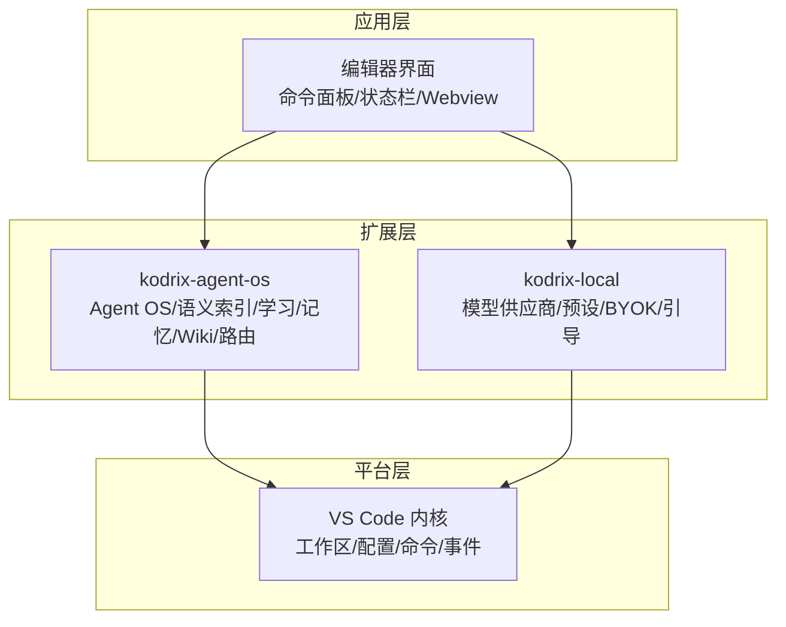
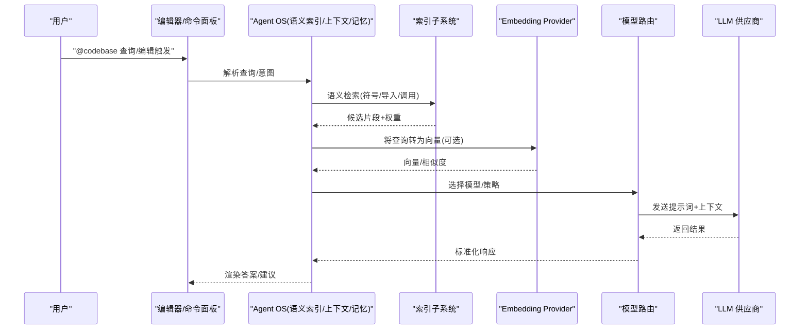
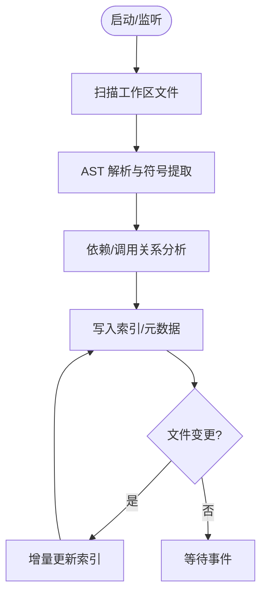
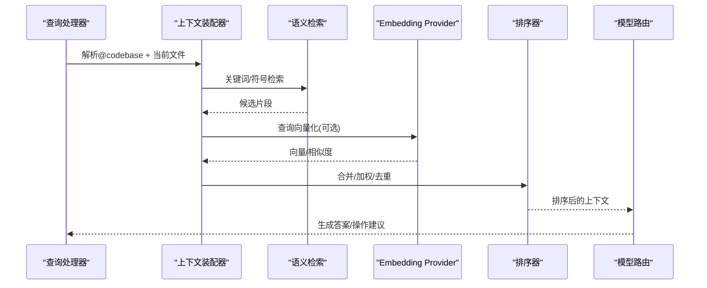
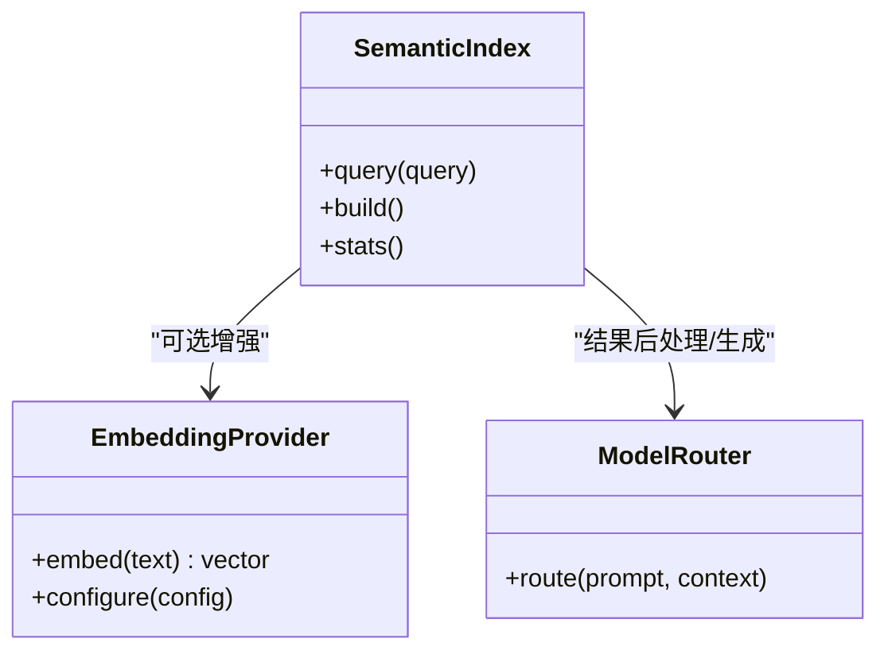
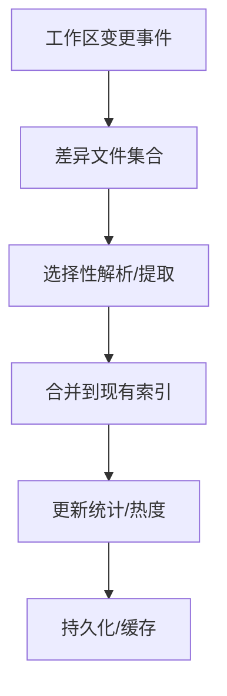
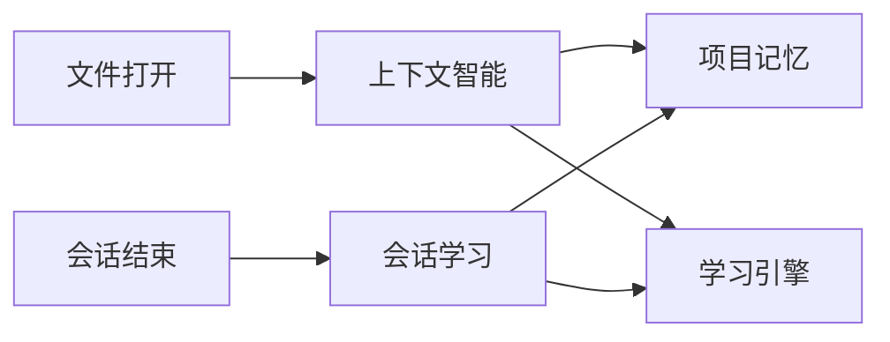
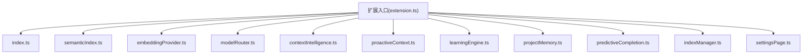

# 代码库智能架构

<cite>
**本文引用的文件**   
- [README.md](file://README.md)
- [extensions/kodrix-agent-os/src/extension.ts](file://extensions/kodrix-agent-os/src/extension.ts)
- [extensions/kodrix-local/src/extension.ts](file://extensions/kodrix-local/src/extension.ts)
- [extensions/kodrix-agent-os/src/codebase/index.ts](file://extensions/kodrix-agent-os/src/codebase/index.ts)
- [extensions/kodrix-agent-os/src/codebase/projectIndexer.ts](file://extensions/kodrix-agent-os/src/codebase/projectIndexer.ts)
- [extensions/kodrix-agent-os/src/codebase/semanticIndex.ts](file://extensions/kodrix-agent-os/src/codebase/semanticIndex.ts)
- [extensions/kodrix-agent-os/src/codebase/embeddingProvider.ts](file://extensions/kodrix-agent-os/src/codebase/embeddingProvider.ts)
- [extensions/kodrix-agent-os/src/codebase/indexManager.ts](file://extensions/kodrix-agent-os/src/codebase/indexManager.ts)
- [extensions/kodrix-agent-os/src/codebase/settingsPage.ts](file://extensions/kodrix-agent-os/src/codebase/settingsPage.ts)
- [extensions/kodrix-agent-os/src/codebase/types.ts](file://extensions/kodrix-agent-os/src/codebase/types.ts)
- [extensions/kodrix-agent-os/src/codebase/predictiveCompletion.ts](file://extensions/kodrix-agent-os/src/codebase/predictiveCompletion.ts)
- [extensions/kodrix-agent-os/src/model/modelRouter.ts](file://extensions/kodrix-agent-os/src/model/modelRouter.ts)
- [extensions/kodrix-agent-os/src/context/contextIntelligence.ts](file://extensions/kodrix-agent-os/src/context/contextIntelligence.ts)
- [extensions/kodrix-agent-os/src/context/proactiveContext.ts](file://extensions/kodrix-agent-os/src/context/proactiveContext.ts)
- [extensions/kodrix-agent-os/src/learning/learningEngine.ts](file://extensions/kodrix-agent-os/src/learning/learningEngine.ts)
- [extensions/kodrix-agent-os/src/memory/projectMemory.ts](file://extensions/kodrix-agent-os/src/memory/projectMemory.ts)
- [extensions/kodrix-agent-os/src/router/agentRouter.ts](file://extensions/kodrix-agent-os/src/router/agentRouter.ts)
- [extensions/kodrix-agent-os/src/experience/workspaceBootstrap.ts](file://extensions/kodrix-agent-os/src/experience/workspaceBootstrap.ts)
- [extensions/kodrix-agent-os/src/shared/constants.ts](file://extensions/kodrix-agent-os/src/shared/constants.ts)
</cite>

## 目录
1. [简介](#简介)
2. [项目结构](#项目结构)
3. [核心组件](#核心组件)
4. [架构总览](#架构总览)
5. [详细组件分析](#详细组件分析)
6. [依赖关系分析](#依赖关系分析)
7. [性能与大规模工程优化](#性能与大规模工程优化)
8. [故障排查指南](#故障排查指南)
9. [结论](#结论)
10. [附录：扩展开发指南](#附录扩展开发指南)

## 简介
本仓库是 VS Code / VSCodium 的 AI 原生定制分支，围绕“多 Agent 协作、语义索引、自然语言代码问答、模型路由”构建。其核心目标是：在本地可构建、可调试的工程中，提供全工程语义理解、上下文感知、向量检索与多供应商 LLM 能力，并通过可扩展的扩展体系（kodrix-agent-os、kodrix-local）实现功能解耦与演进。

## 项目结构
- src：VS Code 内核与运行时入口
- extensions：内置扩展集合，其中 kodrix-agent-os 承载 Agent OS、语义索引、学习引擎、记忆、Wiki、路由等；kodrix-local 承载模型供应商、BYOK、预设迁移、工作区引导等
- marketplace：Skill 示例包与目录
- scripts/build/dev：构建、打包与开发脚本
- docs：产品文档与审计/体检报告

图表来源
- [README.md:69-85](file://README.md#L69-L85)
- [extensions/kodrix-agent-os/src/extension.ts:158-239](file://extensions/kodrix-agent-os/src/extension.ts#L158-L239)
- [extensions/kodrix-local/src/extension.ts:84-179](file://extensions/kodrix-local/src/extension.ts#L84-L179)

章节来源
- [README.md:1-122](file://README.md#L1-L122)

## 核心组件
- 语义索引子系统：负责文件扫描、AST 解析、符号提取、依赖分析、增量更新与统计展示
- 自然语言代码问答：@codebase 查询理解、向量检索、上下文构建、结果排序
- 嵌入模型集成：支持智谱 embedding-3 等，可通过配置动态启用/切换
- 模型路由：多供应商预设与 BYOK，统一接入 LLM
- 上下文与记忆：主动上下文感知、会话学习、项目记忆、Learning Engine
- 索引管理面板与设置页：可视化索引状态、重建索引、查看统计

章节来源
- [extensions/kodrix-agent-os/src/extension.ts:214-306](file://extensions/kodrix-agent-os/src/extension.ts#L214-L306)
- [extensions/kodrix-agent-os/src/codebase/index.ts](file://extensions/kodrix-agent-os/src/codebase/index.ts)
- [extensions/kodrix-agent-os/src/codebase/projectIndexer.ts](file://extensions/kodrix-agent-os/src/codebase/projectIndexer.ts)
- [extensions/kodrix-agent-os/src/codebase/semanticIndex.ts](file://extensions/kodrix-agent-os/src/codebase/semanticIndex.ts)
- [extensions/kodrix-agent-os/src/codebase/embeddingProvider.ts](file://extensions/kodrix-agent-os/src/codebase/embeddingProvider.ts)
- [extensions/kodrix-agent-os/src/codebase/indexManager.ts](file://extensions/kodrix-agent-os/src/codebase/indexManager.ts)
- [extensions/kodrix-agent-os/src/codebase/settingsPage.ts](file://extensions/kodrix-agent-os/src/codebase/settingsPage.ts)
- [extensions/kodrix-agent-os/src/codebase/types.ts](file://extensions/kodrix-agent-os/src/codebase/types.ts)
- [extensions/kodrix-agent-os/src/codebase/predictiveCompletion.ts](file://extensions/kodrix-agent-os/src/codebase/predictiveCompletion.ts)
- [extensions/kodrix-agent-os/src/model/modelRouter.ts](file://extensions/kodrix-agent-os/src/model/modelRouter.ts)
- [extensions/kodrix-agent-os/src/context/contextIntelligence.ts](file://extensions/kodrix-agent-os/src/context/contextIntelligence.ts)
- [extensions/kodrix-agent-os/src/context/proactiveContext.ts](file://extensions/kodrix-agent-os/src/context/proactiveContext.ts)
- [extensions/kodrix-agent-os/src/learning/learningEngine.ts](file://extensions/kodrix-agent-os/src/learning/learningEngine.ts)
- [extensions/kodrix-agent-os/src/memory/projectMemory.ts](file://extensions/kodrix-agent-os/src/memory/projectMemory.ts)
- [extensions/kodrix-agent-os/src/router/agentRouter.ts](file://extensions/kodrix-agent-os/src/router/agentRouter.ts)
- [extensions/kodrix-agent-os/src/experience/workspaceBootstrap.ts](file://extensions/kodrix-agent-os/src/experience/workspaceBootstrap.ts)
- [extensions/kodrix-agent-os/src/shared/constants.ts](file://extensions/kodrix-agent-os/src/shared/constants.ts)

## 架构总览
整体数据流从“用户输入/编辑事件”出发，经“查询理解与意图识别”，进入“语义索引与向量检索”，再结合“上下文与记忆”进行“结果排序与组装”，最终通过“模型路由”调用 LLM 生成回答或执行动作。

图表来源
- [extensions/kodrix-agent-os/src/extension.ts:214-306](file://extensions/kodrix-agent-os/src/extension.ts#L214-L306)
- [extensions/kodrix-agent-os/src/codebase/index.ts](file://extensions/kodrix-agent-os/src/codebase/index.ts)
- [extensions/kodrix-agent-os/src/codebase/semanticIndex.ts](file://extensions/kodrix-agent-os/src/codebase/semanticIndex.ts)
- [extensions/kodrix-agent-os/src/codebase/embeddingProvider.ts](file://extensions/kodrix-agent-os/src/codebase/embeddingProvider.ts)
- [extensions/kodrix-agent-os/src/model/modelRouter.ts](file://extensions/kodrix-agent-os/src/model/modelRouter.ts)

## 详细组件分析

### 语义索引子系统
职责：
- 文件扫描与过滤
- AST 解析与符号提取
- 依赖/调用关系抽取
- 索引持久化与增量更新
- 统计与可视化

关键流程：
- 启动时延迟触发初始索引构建
- 监听工作区变更，增量更新
- 提供命令重建索引与查看统计

图表来源
- [extensions/kodrix-agent-os/src/extension.ts:224-239](file://extensions/kodrix-agent-os/src/extension.ts#L224-L239)
- [extensions/kodrix-agent-os/src/codebase/index.ts](file://extensions/kodrix-agent-os/src/codebase/index.ts)
- [extensions/kodrix-agent-os/src/codebase/projectIndexer.ts](file://extensions/kodrix-agent-os/src/codebase/projectIndexer.ts)

章节来源
- [extensions/kodrix-agent-os/src/extension.ts:224-306](file://extensions/kodrix-agent-os/src/extension.ts#L224-L306)
- [extensions/kodrix-agent-os/src/codebase/index.ts](file://extensions/kodrix-agent-os/src/codebase/index.ts)
- [extensions/kodrix-agent-os/src/codebase/projectIndexer.ts](file://extensions/kodrix-agent-os/src/codebase/projectIndexer.ts)

### 自然语言代码问答
流程要点：
- 查询理解：解析 @codebase 指令与工作区上下文
- 向量检索：可选 Embedding 增强语义匹配
- 上下文构建：合并 Memory/Learning/当前文件相关片段
- 结果排序：基于相关性、热度、时间衰减等策略
- 模型路由：按策略选择 LLM 供应商并生成回答

图表来源
- [extensions/kodrix-agent-os/src/codebase/index.ts](file://extensions/kodrix-agent-os/src/codebase/index.ts)
- [extensions/kodrix-agent-os/src/codebase/semanticIndex.ts](file://extensions/kodrix-agent-os/src/codebase/semanticIndex.ts)
- [extensions/kodrix-agent-os/src/codebase/embeddingProvider.ts](file://extensions/kodrix-agent-os/src/codebase/embeddingProvider.ts)
- [extensions/kodrix-agent-os/src/model/modelRouter.ts](file://extensions/kodrix-agent-os/src/model/modelRouter.ts)

章节来源
- [extensions/kodrix-agent-os/src/codebase/index.ts](file://extensions/kodrix-agent-os/src/codebase/index.ts)
- [extensions/kodrix-agent-os/src/codebase/semanticIndex.ts](file://extensions/kodrix-agent-os/src/codebase/semanticIndex.ts)
- [extensions/kodrix-agent-os/src/codebase/embeddingProvider.ts](file://extensions/kodrix-agent-os/src/codebase/embeddingProvider.ts)
- [extensions/kodrix-agent-os/src/model/modelRouter.ts](file://extensions/kodrix-agent-os/src/model/modelRouter.ts)

### 嵌入模型选择与集成
- 默认支持智谱 embedding-3，可通过配置开启/关闭与切换 endpoint/model
- 配置项变化时动态注册/清理 Embedding Provider
- 为语义检索提供向量维度与相似度计算能力

图表来源
- [extensions/kodrix-agent-os/src/codebase/semanticIndex.ts](file://extensions/kodrix-agent-os/src/codebase/semanticIndex.ts)
- [extensions/kodrix-agent-os/src/codebase/embeddingProvider.ts](file://extensions/kodrix-agent-os/src/codebase/embeddingProvider.ts)
- [extensions/kodrix-agent-os/src/model/modelRouter.ts](file://extensions/kodrix-agent-os/src/model/modelRouter.ts)

章节来源
- [extensions/kodrix-agent-os/src/extension.ts:141-156](file://extensions/kodrix-agent-os/src/extension.ts#L141-L156)
- [extensions/kodrix-agent-os/src/codebase/embeddingProvider.ts](file://extensions/kodrix-agent-os/src/codebase/embeddingProvider.ts)

### 索引存储格式、缓存与增量更新
- 索引包含文件、符号、导入/调用关系、热度与统计信息
- 首次构建延迟触发，避免冷启动阻塞
- 文件监听驱动增量更新，减少重复解析
- 提供命令重建索引与查看统计

图表来源
- [extensions/kodrix-agent-os/src/extension.ts:224-239](file://extensions/kodrix-agent-os/src/extension.ts#L224-L239)
- [extensions/kodrix-agent-os/src/codebase/index.ts](file://extensions/kodrix-agent-os/src/codebase/index.ts)
- [extensions/kodrix-agent-os/src/codebase/projectIndexer.ts](file://extensions/kodrix-agent-os/src/codebase/projectIndexer.ts)

章节来源
- [extensions/kodrix-agent-os/src/extension.ts:224-306](file://extensions/kodrix-agent-os/src/extension.ts#L224-L306)
- [extensions/kodrix-agent-os/src/codebase/index.ts](file://extensions/kodrix-agent-os/src/codebase/index.ts)
- [extensions/kodrix-agent-os/src/codebase/projectIndexer.ts](file://extensions/kodrix-agent-os/src/codebase/projectIndexer.ts)

### 上下文感知与记忆
- 主动上下文感知：打开文件时自动关联相关 Memory/Learning
- 会话学习：Agent 结束自动蒸馏摘要，沉淀到 Memory/Semantic 索引
- Learning Engine：TF-IDF 向量 + 余弦检索 + 时间衰减 + 自动分类 + Dashboard
- 项目记忆：跨会话的知识沉淀与复用

图表来源
- [extensions/kodrix-agent-os/src/context/contextIntelligence.ts](file://extensions/kodrix-agent-os/src/context/contextIntelligence.ts)
- [extensions/kodrix-agent-os/src/context/proactiveContext.ts](file://extensions/kodrix-agent-os/src/context/proactiveContext.ts)
- [extensions/kodrix-agent-os/src/learning/learningEngine.ts](file://extensions/kodrix-agent-os/src/learning/learningEngine.ts)
- [extensions/kodrix-agent-os/src/memory/projectMemory.ts](file://extensions/kodrix-agent-os/src/memory/projectMemory.ts)

章节来源
- [extensions/kodrix-agent-os/src/context/contextIntelligence.ts](file://extensions/kodrix-agent-os/src/context/contextIntelligence.ts)
- [extensions/kodrix-agent-os/src/context/proactiveContext.ts](file://extensions/kodrix-agent-os/src/context/proactiveContext.ts)
- [extensions/kodrix-agent-os/src/learning/learningEngine.ts](file://extensions/kodrix-agent-os/src/learning/learningEngine.ts)
- [extensions/kodrix-agent-os/src/memory/projectMemory.ts](file://extensions/kodrix-agent-os/src/memory/projectMemory.ts)

### 模型路由与多供应商
- 支持多供应商预设与 BYOK
- 根据策略/负载/成本选择合适模型
- 与语义索引/上下文组合，形成高质量提示词

章节来源
- [extensions/kodrix-agent-os/src/model/modelRouter.ts](file://extensions/kodrix-agent-os/src/model/modelRouter.ts)
- [extensions/kodrix-local/src/extension.ts:84-179](file://extensions/kodrix-local/src/extension.ts#L84-L179)

### 预测性补全与智能交互
- 编辑时触发预测性补全，结合语义索引提升准确性
- 与 Agent 编排、Idea Flow 联动，形成端到端体验

章节来源
- [extensions/kodrix-agent-os/src/codebase/predictiveCompletion.ts](file://extensions/kodrix-agent-os/src/codebase/predictiveCompletion.ts)
- [extensions/kodrix-agent-os/src/extension.ts:214-219](file://extensions/kodrix-agent-os/src/extension.ts#L214-L219)

## 依赖关系分析
- 扩展入口集中注册各子模块，保证低耦合高内聚
- 语义索引依赖 AST 解析与文件系统 API
- 语义检索可选依赖 Embedding Provider
- 模型路由独立于具体供应商，便于扩展新厂商

图表来源
- [extensions/kodrix-agent-os/src/extension.ts:158-239](file://extensions/kodrix-agent-os/src/extension.ts#L158-L239)

章节来源
- [extensions/kodrix-agent-os/src/extension.ts:158-239](file://extensions/kodrix-agent-os/src/extension.ts#L158-L239)

## 性能与大规模工程优化
- 延迟初始化：启动后延迟触发索引构建，避免阻塞 UI
- 增量更新：仅对变更文件进行解析与合并
- 并发控制：文件扫描与解析并行化，限制并发度
- 缓存策略：索引持久化，避免重复构建；Embedding 结果缓存
- 过滤规则：排除大型二进制/日志/无关目录，降低 IO 压力
- 统计与监控：提供索引耗时、文件/符号数量、热门符号等指标

章节来源
- [extensions/kodrix-agent-os/src/extension.ts:224-239](file://extensions/kodrix-agent-os/src/extension.ts#L224-L239)
- [extensions/kodrix-agent-os/src/codebase/index.ts](file://extensions/kodrix-agent-os/src/codebase/index.ts)
- [extensions/kodrix-agent-os/src/codebase/projectIndexer.ts](file://extensions/kodrix-agent-os/src/codebase/projectIndexer.ts)

## 故障排查指南
- 激活失败：扩展入口捕获异常并显示错误消息
- 索引构建失败：提供命令重建索引，查看统计定位问题
- 语义检索未生效：检查 semanticEmbedding.enabled 与 apiKey 配置
- 模型路由不可用：确认预设已应用且网络可达

章节来源
- [extensions/kodrix-agent-os/src/extension.ts:158-168](file://extensions/kodrix-agent-os/src/extension.ts#L158-L168)
- [extensions/kodrix-agent-os/src/extension.ts:241-306](file://extensions/kodrix-agent-os/src/extension.ts#L241-L306)
- [extensions/kodrix-agent-os/src/extension.ts:141-156](file://extensions/kodrix-agent-os/src/extension.ts#L141-L156)
- [extensions/kodrix-local/src/extension.ts:84-179](file://extensions/kodrix-local/src/extension.ts#L84-L179)

## 结论
该代码库以 VS Code 为基础，通过 kodrix-agent-os 与 kodrix-local 两大扩展实现了“语义索引 + 向量检索 + 上下文感知 + 多模型路由”的完整闭环。系统具备延迟初始化、增量更新、统计可视化和可扩展的模型接入能力，适合大规模工程与持续演进的 AI 编程场景。

## 附录：扩展开发指南
- 新增语义索引能力：在 codebase 目录下扩展 projectIndexer/semanticIndex，并在 extension.ts 中注册
- 新增模型供应商：在 modelRouter 中增加路由策略，或在 local 扩展中添加预设
- 新增上下文源：在 context 目录下实现新的上下文提供者，并与 proactiveContext 集成
- 新增学习/记忆条目：在 learning/memory 中定义数据结构与持久化逻辑
- 新增设置页/面板：参考 settingsPage/indexManager 的实现模式

章节来源
- [extensions/kodrix-agent-os/src/codebase/index.ts](file://extensions/kodrix-agent-os/src/codebase/index.ts)
- [extensions/kodrix-agent-os/src/codebase/projectIndexer.ts](file://extensions/kodrix-agent-os/src/codebase/projectIndexer.ts)
- [extensions/kodrix-agent-os/src/codebase/semanticIndex.ts](file://extensions/kodrix-agent-os/src/codebase/semanticIndex.ts)
- [extensions/kodrix-agent-os/src/model/modelRouter.ts](file://extensions/kodrix-agent-os/src/model/modelRouter.ts)
- [extensions/kodrix-agent-os/src/context/contextIntelligence.ts](file://extensions/kodrix-agent-os/src/context/contextIntelligence.ts)
- [extensions/kodrix-agent-os/src/learning/learningEngine.ts](file://extensions/kodrix-agent-os/src/learning/learningEngine.ts)
- [extensions/kodrix-agent-os/src/memory/projectMemory.ts](file://extensions/kodrix-agent-os/src/memory/projectMemory.ts)
- [extensions/kodrix-agent-os/src/codebase/settingsPage.ts](file://extensions/kodrix-agent-os/src/codebase/settingsPage.ts)
- [extensions/kodrix-agent-os/src/codebase/indexManager.ts](file://extensions/kodrix-agent-os/src/codebase/indexManager.ts)