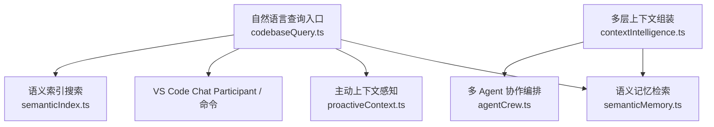
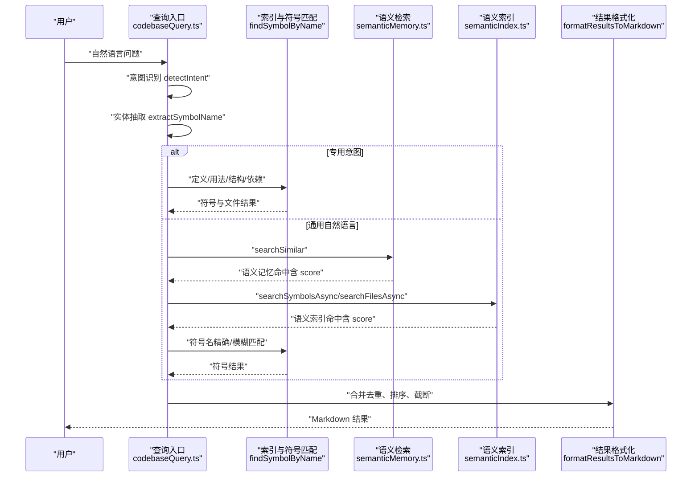
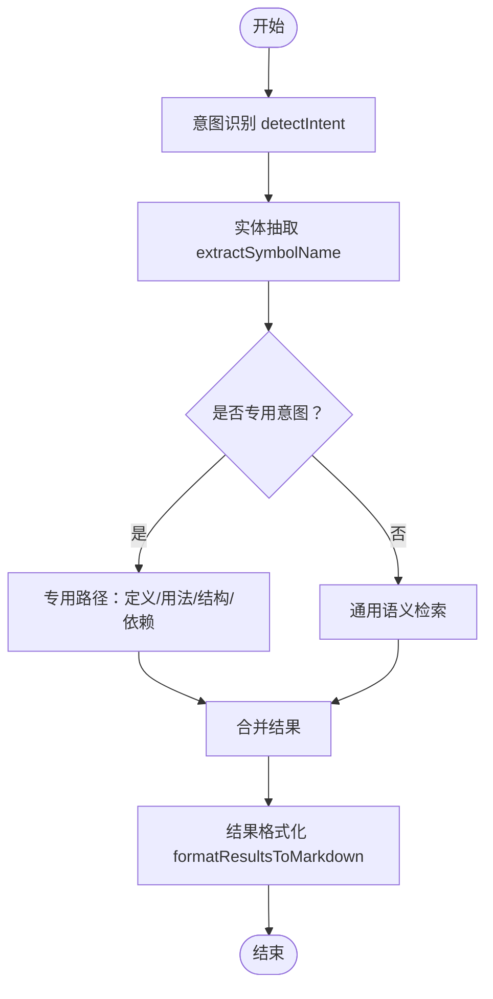
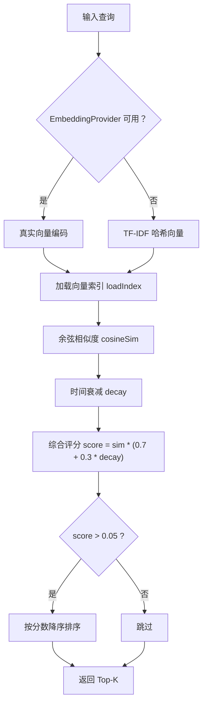
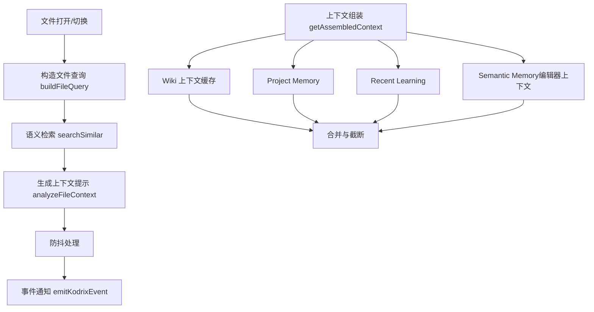
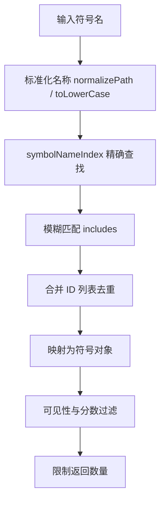
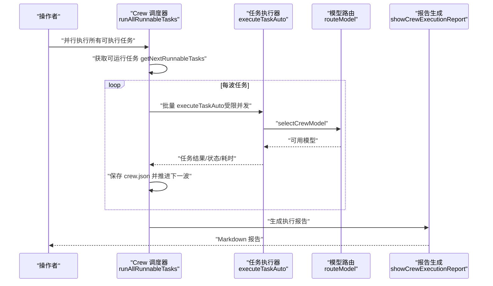
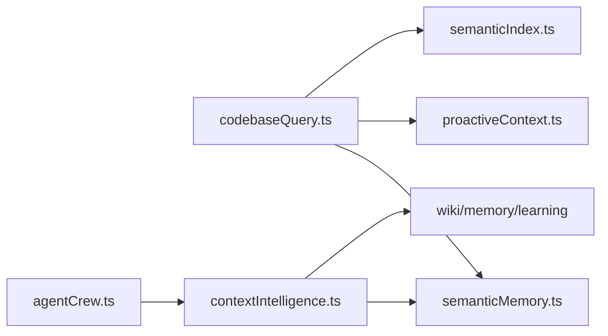

# 代码库查询系统

<cite>
**本文引用的文件**   
- [codebaseQuery.ts](file://extensions/kodrix-agent-os/src/codebase/codebaseQuery.ts)
- [semanticMemory.ts](file://extensions/kodrix-agent-os/src/learning/semanticMemory.ts)
- [proactiveContext.ts](file://extensions/kodrix-agent-os/src/context/proactiveContext.ts)
- [contextIntelligence.ts](file://extensions/kodrix-agent-os/src/context/contextIntelligence.ts)
- [agentCrew.ts](file://extensions/kodrix-agent-os/src/crew/agentCrew.ts)
- [semanticIndex.ts](file://extensions/kodrix-agent-os/src/codebase/semanticIndex.ts)
</cite>

## 更新摘要
**变更内容**   
- 新增自然语言意图识别机制，支持中英文混合查询理解
- 集成 VS Code Chat Participant，提供对话式代码查询体验
- 增强语义搜索能力，支持符号级、文件级和语法块级检索
- 优化查询缓存机制，提升响应性能
- 改进上下文构建策略，支持主动上下文感知

## 目录
1. [引言](#引言)
2. [项目结构](#项目结构)
3. [核心组件](#核心组件)
4. [架构总览](#架构总览)
5. [详细组件分析](#详细组件分析)
6. [依赖关系分析](#依赖关系分析)
7. [性能与优化](#性能与优化)
8. [故障排查指南](#故障排查指南)
9. [结论](#结论)
10. [附录：API 使用示例与最佳实践](#附录api-使用示例与最佳实践)

## 引言
本文件面向"代码库查询系统"的技术与产品文档，聚焦以下目标：
- **自然语言查询理解**：意图识别、实体抽取、查询重写。
- **向量检索实现**：嵌入生成、相似度计算、结果排序。
- **上下文构建策略**：从搜索结果中抽取相关片段与依赖信息。
- **快速符号搜索**：符号索引、模糊匹配、结果过滤。
- **查询性能优化**：缓存、分页、并发处理。
- **VS Code Chat 集成**：对话式代码查询体验。

该系统由多个扩展模块协同工作：自然语言查询入口、语义记忆向量检索、主动上下文感知、多层上下文组装、以及多 Agent 协作编排（用于复杂任务并行执行）。

## 项目结构
围绕代码库查询的核心文件分布如下：
- **自然语言查询入口与意图路由**：`extensions/kodrix-agent-os/src/codebase/codebaseQuery.ts`
- **语义记忆与向量检索**：`extensions/kodrix-agent-os/src/learning/semanticMemory.ts`
- **主动上下文感知**：`extensions/kodrix-agent-os/src/context/proactiveContext.ts`
- **多层上下文组装**：`extensions/kodrix-agent-os/src/context/contextIntelligence.ts`
- **多 Agent 协作编排**：`extensions/kodrix-agent-os/src/crew/agentCrew.ts`
- **语义索引与搜索**：`extensions/kodrix-agent-os/src/codebase/semanticIndex.ts`

**图表来源**
- [codebaseQuery.ts:15-21](file://extensions/kodrix-agent-os/src/codebase/codebaseQuery.ts#L15-L21)
- [semanticMemory.ts:9-17](file://extensions/kodrix-agent-os/src/learning/semanticMemory.ts#L9-L17)
- [proactiveContext.ts:5-8](file://extensions/kodrix-agent-os/src/context/proactiveContext.ts#L5-L8)
- [contextIntelligence.ts:6-20](file://extensions/kodrix-agent-os/src/context/contextIntelligence.ts#L6-L20)
- [agentCrew.ts:17-32](file://extensions/kodrix-agent-os/src/crew/agentCrew.ts#L17-L32)

**章节来源**
- [codebaseQuery.ts:1-22](file://extensions/kodrix-agent-os/src/codebase/codebaseQuery.ts#L1-L22)
- [semanticMemory.ts:1-18](file://extensions/kodrix-agent-os/src/learning/semanticMemory.ts#L1-L18)
- [proactiveContext.ts:1-8](file://extensions/kodrix-agent-os/src/context/proactiveContext.ts#L1-L8)
- [contextIntelligence.ts:1-20](file://extensions/kodrix-agent-os/src/context/contextIntelligence.ts#L1-L20)
- [agentCrew.ts:1-32](file://extensions/kodrix-agent-os/src/crew/agentCrew.ts#L1-L32)

## 核心组件
- **自然语言查询入口**
  - **意图识别**：基于正则模式匹配中文/英文关键词，将用户问题分类为定义、用法、调用者、结构、依赖、架构或通用自然语言。
  - **实体抽取**：从查询中提取符号名（支持引号、驼峰、常量、下划线命名等），并清理无关词。
  - **查询重写**：根据意图选择专用路径（定义查找、用法查找、结构概览、依赖分析），若专用路径无结果则回退到通用语义检索。
  - **结果格式化**：将结构化结果渲染为 Markdown，包含符号属性、文件路径、行号、签名、文档摘要、依赖关系统计等。
  - **Chat Participant 集成**：注册 VS Code Chat Participant，提供 `@codebase` 对话式查询体验。

- **语义记忆与向量检索**
  - **真实 Embedding 支持**：通过 EmbeddingProvider 接口注入真实向量模型，支持任意维度浮点向量。
  - **降级策略**：无 EmbeddingProvider 时自动回退到 TF-IDF 哈希向量（固定维度 128）。
  - **持久化索引**：向量索引持久化为 JSON 文件，按学习日志条目维护，自动清理无效向量。
  - **时间衰减**：结合相似度与新鲜度（半衰期 30 天）进行综合评分。

- **主动上下文感知**
  - 监听活动编辑器变化，对当前文件路径构造查询，检索相关记忆。
  - 防抖处理，避免频繁触发；输出相关计数、顶部匹配内容与分数。

- **多层上下文组装**
  - 组合 Wiki、Memory、Learning、Semantic Memory 等多源上下文。
  - 编辑器上下文提示：优先选中文本，其次光标附近若干行。
  - 截断策略：在段落边界处截断，避免模型收到不完整句子。

- **多 Agent 协作编排**
  - 角色定义（架构师、开发者、审查者、测试者、运维、自定义）。
  - 任务管理：创建 Crew、添加任务、设置依赖、选择执行模式（自动/手动）。
  - 并行执行引擎：按波次调度，受限并发池，Promise.allSettled 非阻塞失败。

**章节来源**
- [codebaseQuery.ts:23-129](file://extensions/kodrix-agent-os/src/codebase/codebaseQuery.ts#L23-L129)
- [codebaseQuery.ts:131-336](file://extensions/kodrix-agent-os/src/codebase/codebaseQuery.ts#L131-L336)
- [codebaseQuery.ts:338-457](file://extensions/kodrix-agent-os/src/codebase/codebaseQuery.ts#L338-L457)
- [codebaseQuery.ts:459-584](file://extensions/kodrix-agent-os/src/codebase/codebaseQuery.ts#L459-L584)
- [semanticMemory.ts:24-81](file://extensions/kodrix-agent-os/src/learning/semanticMemory.ts#L24-L81)
- [semanticMemory.ts:87-141](file://extensions/kodrix-agent-os/src/learning/semanticMemory.ts#L87-L141)
- [semanticMemory.ts:148-186](file://extensions/kodrix-agent-os/src/learning/semanticMemory.ts#L148-L186)
- [semanticMemory.ts:188-272](file://extensions/kodrix-agent-os/src/learning/semanticMemory.ts#L188-L272)
- [proactiveContext.ts:21-40](file://extensions/kodrix-agent-os/src/context/proactiveContext.ts#L21-L40)
- [proactiveContext.ts:46-80](file://extensions/kodrix-agent-os/src/context/proactiveContext.ts#L46-L80)
- [contextIntelligence.ts:36-91](file://extensions/kodrix-agent-os/src/context/contextIntelligence.ts#L36-L91)
- [contextIntelligence.ts:107-156](file://extensions/kodrix-agent-os/src/context/contextIntelligence.ts#L107-L156)
- [contextIntelligence.ts:158-204](file://extensions/kodrix-agent-os/src/context/contextIntelligence.ts#L158-L204)
- [contextIntelligence.ts:256-316](file://extensions/kodrix-agent-os/src/context/contextIntelligence.ts#L256-L316)
- [agentCrew.ts:34-80](file://extensions/kodrix-agent-os/src/crew/agentCrew.ts#L34-L80)
- [agentCrew.ts:142-173](file://extensions/kodrix-agent-os/src/crew/agentCrew.ts#L142-L173)
- [agentCrew.ts:175-234](file://extensions/kodrix-agent-os/src/crew/agentCrew.ts#L175-L234)
- [agentCrew.ts:236-304](file://extensions/kodrix-agent-os/src/crew/agentCrew.ts#L236-L304)
- [agentCrew.ts:306-398](file://extensions/kodrix-agent-os/src/crew/agentCrew.ts#L306-L398)
- [agentCrew.ts:400-508](file://extensions/kodrix-agent-os/src/crew/agentCrew.ts#L400-L508)
- [agentCrew.ts:510-572](file://extensions/kodrix-agent-os/src/crew/agentCrew.ts#L510-L572)
- [agentCrew.ts:574-618](file://extensions/kodrix-agent-os/src/crew/agentCrew.ts#L574-L618)
- [agentCrew.ts:620-707](file://extensions/kodrix-agent-os/src/crew/agentCrew.ts#L620-L707)
- [agentCrew.ts:709-788](file://extensions/kodrix-agent-os/src/crew/agentCrew.ts#L709-L788)

## 架构总览
下图展示了自然语言查询的端到端流程：用户输入经意图识别与实体抽取后，进入专用查询路径或通用语义检索；语义检索依赖向量索引与相似度计算；最终结果经格式化与上下文增强后返回。

**图表来源**
- [codebaseQuery.ts:83-129](file://extensions/kodrix-agent-os/src/codebase/codebaseQuery.ts#L83-L129)
- [codebaseQuery.ts:137-149](file://extensions/kodrix-agent-os/src/codebase/codebaseQuery.ts#L137-L149)
- [codebaseQuery.ts:283-336](file://extensions/kodrix-agent-os/src/codebase/codebaseQuery.ts#L283-L336)
- [semanticMemory.ts:148-186](file://extensions/kodrix-agent-os/src/learning/semanticMemory.ts#L148-L186)
- [semanticIndex.ts:86-144](file://extensions/kodrix-agent-os/src/codebase/semanticIndex.ts#L86-L144)

## 详细组件分析

### 自然语言查询理解机制
- **意图识别**
  - 通过预定义的正则模式集合匹配中英文关键词，将查询归类为 definition、usage、callers、structure、dependency、architecture、natural。
  - 默认回退为 natural，确保通用语义检索兜底。
- **实体抽取**
  - 清理意图相关词与标点，提取符号名：优先引号内文本，其次驼峰、常量、下划线命名，最后取最后一个合法标识符。
- **查询重写**
  - 根据意图选择专用路径：定义查找、用法查找、结构概览、依赖分析；若无结果则回退到通用语义检索。
  - 通用语义检索包括：符号级语义检索、文件级语义检索、语法块级语义检索、符号名精确/模糊匹配，并进行去重与截断。

**图表来源**
- [codebaseQuery.ts:83-129](file://extensions/kodrix-agent-os/src/codebase/codebaseQuery.ts#L83-L129)
- [codebaseQuery.ts:152-275](file://extensions/kodrix-agent-os/src/codebase/codebaseQuery.ts#L152-L275)
- [codebaseQuery.ts:283-336](file://extensions/kodrix-agent-os/src/codebase/codebaseQuery.ts#L283-L336)
- [codebaseQuery.ts:340-413](file://extensions/kodrix-agent-os/src/codebase/codebaseQuery.ts#L340-L413)

**章节来源**
- [codebaseQuery.ts:23-129](file://extensions/kodrix-agent-os/src/codebase/codebaseQuery.ts#L23-L129)
- [codebaseQuery.ts:152-275](file://extensions/kodrix-agent-os/src/codebase/codebaseQuery.ts#L152-L275)
- [codebaseQuery.ts:283-336](file://extensions/kodrix-agent-os/src/codebase/codebaseQuery.ts#L283-L336)
- [codebaseQuery.ts:340-413](file://extensions/kodrix-agent-os/src/codebase/codebaseQuery.ts#L340-L413)

### 向量检索实现原理
- **嵌入生成**
  - **真实 Embedding 支持**：通过 EmbeddingProvider 接口注入真实向量模型，支持任意维度浮点向量。
  - **降级策略**：无 EmbeddingProvider 时自动回退到 TF-IDF 哈希向量（固定维度 128）。
  - **向量索引持久化**：JSON 文件存储，按学习日志条目维护，自动清理无效向量。
- **相似度计算**
  - 余弦相似度（cosineSimilarity）计算查询向量与记忆向量的相似性。
  - 时间衰减因子：结合相似度与新鲜度（半衰期 30 天）进行综合评分。
- **结果排序**
  - 按综合分数降序排序，阈值过滤（score > 0.05），返回 Top-K。
  - 提供语义上下文摘要、主题记忆、重建索引、统计信息等能力。

**图表来源**
- [semanticMemory.ts:24-81](file://extensions/kodrix-agent-os/src/learning/semanticMemory.ts#L24-L81)
- [semanticMemory.ts:148-186](file://extensions/kodrix-agent-os/src/learning/semanticMemory.ts#L148-L186)

**章节来源**
- [semanticMemory.ts:24-81](file://extensions/kodrix-agent-os/src/learning/semanticMemory.ts#L24-L81)
- [semanticMemory.ts:148-186](file://extensions/kodrix-agent-os/src/learning/semanticMemory.ts#L148-L186)

### 上下文构建策略
- **主动上下文感知**
  - 监听活动编辑器变化，构造文件路径查询，检索相关记忆，输出相关计数、顶部匹配内容与分数。
  - 防抖处理，避免频繁触发。
- **多层上下文组装**
  - 组合 Wiki、Memory、Learning、Semantic Memory 等多源上下文。
  - 编辑器上下文提示：优先选中文本，其次光标附近若干行。
  - 截断策略：在段落边界处截断，避免模型收到不完整句子。
  - 状态面板与命令：刷新上下文、显示诊断报告、状态栏摘要。

**图表来源**
- [proactiveContext.ts:21-40](file://extensions/kodrix-agent-os/src/context/proactiveContext.ts#L21-L40)
- [proactiveContext.ts:46-80](file://extensions/kodrix-agent-os/src/context/proactiveContext.ts#L46-L80)
- [contextIntelligence.ts:36-91](file://extensions/kodrix-agent-os/src/context/contextIntelligence.ts#L36-L91)

**章节来源**
- [proactiveContext.ts:21-80](file://extensions/kodrix-agent-os/src/context/proactiveContext.ts#L21-L80)
- [contextIntelligence.ts:36-91](file://extensions/kodrix-agent-os/src/context/contextIntelligence.ts#L36-L91)

### 快速符号搜索
- **符号索引**
  - 通过 symbolNameIndex 与 reverseDependencyGraph 等索引结构，快速定位符号与依赖关系。
- **模糊匹配**
  - findSymbolByName 支持大小写不敏感包含匹配，合并精确与模糊 ID 列表，去重后映射为符号对象。
- **结果过滤**
  - 根据可见性（导出/非导出）赋予不同分数；限制返回数量（如 Top-20）。

**图表来源**
- [codebaseQuery.ts:133-149](file://extensions/kodrix-agent-os/src/codebase/codebaseQuery.ts#L133-L149)
- [codebaseQuery.ts:152-203](file://extensions/kodrix-agent-os/src/codebase/codebaseQuery.ts#L152-L203)

**章节来源**
- [codebaseQuery.ts:133-149](file://extensions/kodrix-agent-os/src/codebase/codebaseQuery.ts#L133-L149)
- [codebaseQuery.ts:152-203](file://extensions/kodrix-agent-os/src/codebase/codebaseQuery.ts#L152-L203)

### 多 Agent 协作编排（并行执行引擎）
- **角色与任务**
  - 预定义角色（架构师、开发者、审查者、测试者、运维、自定义），任务可设置依赖与执行模式（自动/手动）。
- **并行执行**
  - runAllRunnableTasks 循环取"可运行波次"，标记 running，分批并行执行（Promise.allSettled），自动写回结果与状态，级联下一波。
- **跨 Agent 上下文传递**
  - buildTaskContext 将上游任务输出注入下游 prompt，共享上下文文件记录团队成果摘要。
- **执行报告**
  - showCrewExecutionReport 生成 Markdown 报告，汇总任务明细、错误、耗时、待办提示。

**图表来源**
- [agentCrew.ts:306-398](file://extensions/kodrix-agent-os/src/crew/agentCrew.ts#L306-L398)
- [agentCrew.ts:400-508](file://extensions/kodrix-agent-os/src/crew/agentCrew.ts#L400-L508)
- [agentCrew.ts:510-572](file://extensions/kodrix-agent-os/src/crew/agentCrew.ts#L510-L572)
- [agentCrew.ts:574-618](file://extensions/kodrix-agent-os/src/crew/agentCrew.ts#L574-L618)

**章节来源**
- [agentCrew.ts:306-398](file://extensions/kodrix-agent-os/src/crew/agentCrew.ts#L306-L398)
- [agentCrew.ts:400-508](file://extensions/kodrix-agent-os/src/crew/agentCrew.ts#L400-L508)
- [agentCrew.ts:510-572](file://extensions/kodrix-agent-os/src/crew/agentCrew.ts#L510-L572)
- [agentCrew.ts:574-618](file://extensions/kodrix-agent-os/src/crew/agentCrew.ts#L574-L618)

## 依赖关系分析
- **组件耦合**
  - codebaseQuery.ts 依赖 semanticMemory.ts 进行语义检索，依赖 proactiveContext.ts 与 contextIntelligence.ts 进行上下文增强。
  - contextIntelligence.ts 依赖 semanticMemory.ts 与 wiki/memory/learning 等模块，提供多层上下文组装。
  - agentCrew.ts 独立于查询链路，但可与上下文系统协作（注入项目 Wiki + Memory + Semantic Memory）。
- **外部依赖**
  - VS Code API：Chat Participant、命令、进度条、编辑器事件等。
  - 文件系统：学习日志、向量索引、crew.json、共享上下文文件等。

**图表来源**
- [codebaseQuery.ts:15-21](file://extensions/kodrix-agent-os/src/codebase/codebaseQuery.ts#L15-L21)
- [semanticMemory.ts:9-17](file://extensions/kodrix-agent-os/src/learning/semanticMemory.ts#L9-L17)
- [proactiveContext.ts:5-8](file://extensions/kodrix-agent-os/src/context/proactiveContext.ts#L5-L8)
- [contextIntelligence.ts:6-20](file://extensions/kodrix-agent-os/src/context/contextIntelligence.ts#L6-L20)
- [agentCrew.ts:17-32](file://extensions/kodrix-agent-os/src/crew/agentCrew.ts#L17-L32)

**章节来源**
- [codebaseQuery.ts:15-21](file://extensions/kodrix-agent-os/src/codebase/codebaseQuery.ts#L15-L21)
- [semanticMemory.ts:9-17](file://extensions/kodrix-agent-os/src/learning/semanticMemory.ts#L9-L17)
- [proactiveContext.ts:5-8](file://extensions/kodrix-agent-os/src/context/proactiveContext.ts#L5-L8)
- [contextIntelligence.ts:6-20](file://extensions/kodrix-agent-os/src/context/contextIntelligence.ts#L6-L20)
- [agentCrew.ts:17-32](file://extensions/kodrix-agent-os/src/crew/agentCrew.ts#L17-L32)

## 性能与优化
- **查询缓存**
  - semanticMemory.ts 对 learning entries 使用内存缓存，按文件 mtime 失效；向量索引持久化减少重复计算。
  - contextIntelligence.ts 对 Wiki 上下文进行短时缓存，避免冗余 I/O。
  - codebaseQuery.ts 实现多级缓存：查询缓存、符号缓存、依赖缓存、被依赖缓存。
- **结果分页**
  - 语义检索返回 Top-K（如 5/10），符号名匹配限制返回数量（如 Top-20），避免大结果集。
- **并发处理**
  - agentCrew.ts 使用 Promise.allSettled 与 chunkTasks 分批并行执行，受限并发池，单任务失败不阻塞同波其它任务。
- **其他优化**
  - proactiveContext.ts 使用防抖避免频繁触发。
  - codebaseQuery.ts 对长句进行术语截取（最多 10 个词），避免过多遍历。
  - semanticIndex.ts 实现 BM25 算法与语义向量缓存。

**章节来源**
- [semanticMemory.ts:87-141](file://extensions/kodrix-agent-os/src/learning/semanticMemory.ts#L87-L141)
- [contextIntelligence.ts:24-34](file://extensions/kodrix-agent-os/src/context/contextIntelligence.ts#L24-L34)
- [agentCrew.ts:306-398](file://extensions/kodrix-agent-os/src/crew/agentCrew.ts#L306-L398)
- [agentCrew.ts:510-572](file://extensions/kodrix-agent-os/src/crew/agentCrew.ts#L510-L572)
- [proactiveContext.ts:58-69](file://extensions/kodrix-agent-os/src/context/proactiveContext.ts#L58-L69)
- [codebaseQuery.ts:308-336](file://extensions/kodrix-agent-os/src/codebase/codebaseQuery.ts#L308-L336)

## 故障排查指南
- **未找到项目索引**
  - 现象：查询入口返回"未找到项目索引"。
  - 建议：先打开工作区文件夹，等待索引构建完成；检查配置项 `kodrix.features.codebaseQuery` 是否启用。
- **Chat Participant 不可用**
  - 现象：注册 Chat Participant 失败或 API 不可用。
  - 建议：确认 VS Code 版本支持 chat API；检查配置项 `kodrix.features.codebaseQuery`。
- **语义记忆为空**
  - 现象：语义检索无结果。
  - 建议：重建向量索引（rebuildIndex），检查学习日志是否存在有效条目；确认 `kodrix.features.semanticMemory` 已启用。
- **上下文未刷新**
  - 现象：上下文状态未更新。
  - 建议：执行"刷新 Agent 上下文"命令，重新生成 Wiki、同步 Instructions、重建语义索引。
- **Crew 任务失败**
  - 现象：任务状态为 failed，错误信息记录。
  - 建议：检查模型路由是否成功（BYOK 模型配置）、超时设置、上游依赖输出是否正确注入。

**章节来源**
- [codebaseQuery.ts:417-421](file://extensions/kodrix-agent-os/src/codebase/codebaseQuery.ts#L417-L421)
- [codebaseQuery.ts:490-559](file://extensions/kodrix-agent-os/src/codebase/codebaseQuery.ts#L490-L559)
- [semanticMemory.ts:215-236](file://extensions/kodrix-agent-os/src/learning/semanticMemory.ts#L215-L236)
- [contextIntelligence.ts:186-204](file://extensions/kodrix-agent-os/src/context/contextIntelligence.ts#L186-L204)
- [agentCrew.ts:462-508](file://extensions/kodrix-agent-os/src/crew/agentCrew.ts#L462-L508)

## 结论
该代码库查询系统以自然语言查询入口为核心，结合语义记忆向量检索、主动上下文感知与多层上下文组装，形成完整的"理解—检索—增强—呈现"闭环。同时，多 Agent 协作编排提供了复杂任务的并行执行能力，提升工程效率。系统在性能方面采用缓存、分页与并发优化，保障大规模代码库下的响应速度与稳定性。

**重大更新**：系统现已集成 VS Code Chat Participant，提供 `@codebase` 对话式查询体验，支持自然语言意图识别和多层次语义搜索，为用户带来更智能的代码探索体验。

## 附录：API 使用示例与最佳实践
- **自然语言查询**
  - 通过 VS Code Chat Participant 输入"@codebase getUserProfile 在哪定义？"、"@codebase 这个项目有哪些模块？"、"@codebase 谁调用了 createUser？"。
  - 或通过命令"kodrix.codebase.search"输入自然语言问题。
- **语义记忆**
  - 使用"重建语义索引"命令重建向量索引；查看语义统计信息评估索引规模。
- **上下文管理**
  - 使用"刷新 Agent 上下文"命令重新生成 Wiki、同步 Instructions、重建语义索引；查看上下文状态报告。
- **多 Agent 协作**
  - 创建 Crew、添加任务、选择执行模式（自动/手动）、设置依赖；执行"并行执行所有可执行任务"查看执行报告。

**最佳实践**
- **明确意图**：尽量使用具体符号名与清晰的问题描述，提高意图识别准确率。
- **控制查询长度**：避免过长句子，必要时拆分问题。
- **利用上下文**：在编辑关键文件时，主动查看相关记忆与建议，提升上下文质量。
- **合理并发**：在 Crew 执行中，根据机器性能调整最大并发数，避免资源争用。
- **Chat 集成**：充分利用 `@codebase` Chat Participant 进行交互式代码探索。

**章节来源**
- [codebaseQuery.ts:486-584](file://extensions/kodrix-agent-os/src/codebase/codebaseQuery.ts#L486-L584)
- [semanticMemory.ts:215-272](file://extensions/kodrix-agent-os/src/learning/semanticMemory.ts#L215-L272)
- [contextIntelligence.ts:186-254](file://extensions/kodrix-agent-os/src/context/contextIntelligence.ts#L186-L254)
- [agentCrew.ts:175-304](file://extensions/kodrix-agent-os/src/crew/agentCrew.ts#L175-L304)
- [agentCrew.ts:510-618](file://extensions/kodrix-agent-os/src/crew/agentCrew.ts#L510-L618)