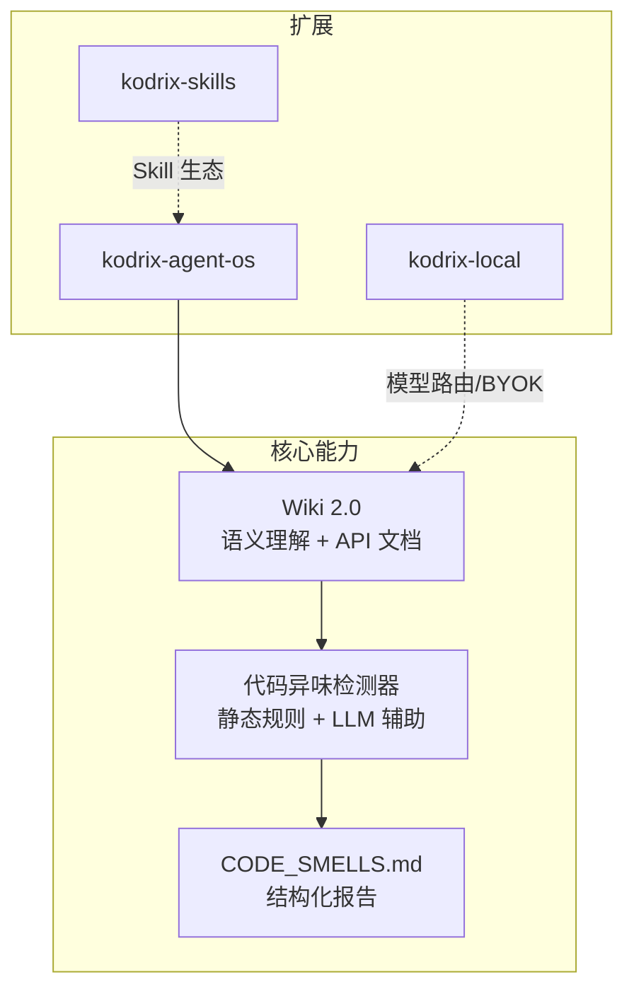
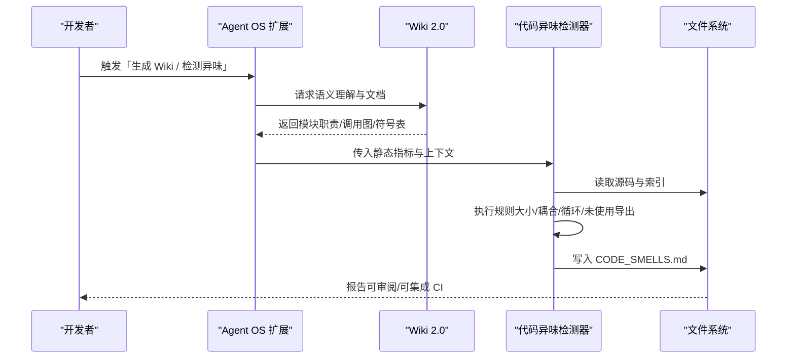
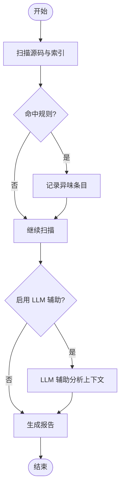
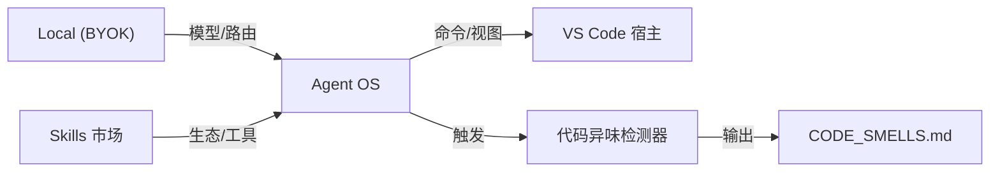

# 代码异味检测器

<cite>
**本文引用的文件**
- [README.md](file://README.md)
- [项目新发现待修复的缺陷问题审计总报告.md](file://docs/项目新发现待修复的缺陷问题审计总报告.md)
- [extensions/kodrix-agent-os/package.json](file://extensions/kodrix-agent-os/package.json)
- [extensions/kodrix-local/package.json](file://extensions/kodrix-local/package.json)
- [extensions/kodrix-skills/package.json](file://extensions/kodrix-skills/package.json)
- [agentLoop.ts](file://extensions/kodrix-agent-os/src/agent/agentLoop.ts)
- [byokRegister.ts](file://extensions/kodrix-local/src/byokRegister.ts)
- [cursorFeatures.ts](file://extensions/kodrix-local/src/cursorFeatures.ts)
- [extension.ts（kodrix-skills）](file://extensions/kodrix-skills/src/extension.ts)
- [marketplaceWebview.ts](file://extensions/kodrix-skills/src/marketplaceWebview.ts)
</cite>

## 目录
1. [简介](#简介)
2. [项目结构](#项目结构)
3. [核心组件](#核心组件)
4. [架构总览](#架构总览)
5. [详细组件分析](#详细组件分析)
6. [依赖关系分析](#依赖关系分析)
7. [性能与可维护性考量](#性能与可维护性考量)
8. [故障排查指南](#故障排查指南)
9. [结论](#结论)
10. [附录](#附录)

## 简介
本仓库是 Kodrix Code，基于 VS Code/VSCodium 深度定制的 AI 原生编辑器。围绕“Agent OS、Skill 市场、本地模型 BYOK”三大扩展，本次文档聚焦“代码异味检测器”这一能力：通过静态规则与 LLM 辅助生成，识别过大文件、高耦合、循环依赖、未使用导出等异味，并输出结构化报告，辅助重构与质量治理。该能力在审计报告中作为 P1 差异化能力之一被实现与闭环。

## 项目结构
- 根目录提供构建、脚本、补丁、测试与产品配置；核心源码位于 src/，内置扩展位于 extensions/。
- 三个 kodrix 扩展各自承担职责：
  - kodrix-agent-os：Agent OS、Idea Flow、Spec、Wiki、Crew、Checkpoint、Codebase 等
  - kodrix-local：本地模型、BYOK、迁移、Cursor 对标编排
  - kodrix-skills：Skill 市场（侧栏/Webview/安装卸载）
- 代码异味检测器由 Agent OS 扩展中的 Wiki 2.0 模块驱动，结合静态分析与 LLM 生成，最终输出 CODE_SMELLS.md 报告。

图表来源
- [extensions/kodrix-agent-os/package.json:23-84](file://extensions/kodrix-agent-os/package.json#L23-L84)
- [extensions/kodrix-local/package.json:23-47](file://extensions/kodrix-local/package.json#L23-L47)
- [extensions/kodrix-skills/package.json:19-51](file://extensions/kodrix-skills/package.json#L19-L51)

章节来源
- [README.md:22-34](file://README.md#L22-L34)

## 核心组件
- Wiki 2.0：负责语义理解与文档生成，无 LLM 时降级为静态生成，确保可用性。
- 代码异味检测器：基于静态规则（文件大小、耦合度、循环依赖、未使用导出）与 LLM 辅助，产出统一格式报告。
- 报告输出：将检测结果写入 CODE_SMELLS.md，便于版本化与审阅。

章节来源
- [项目新发现待修复的缺陷问题审计总报告.md:247-253](file://docs/项目新发现待修复的缺陷问题审计总报告.md#L247-L253)

## 架构总览
代码异味检测器的工作流：
- 输入：工作区源码与索引信息（来自 codebase/index）
- 处理：静态规则扫描 + LLM 辅助分析（可选）
- 输出：标准化报告（CODE_SMELLS.md），供团队评审与自动化流水线消费

图表来源
- [extensions/kodrix-agent-os/package.json:85-483](file://extensions/kodrix-agent-os/package.json#L85-L483)
- [项目新发现待修复的缺陷问题审计总报告.md:247-253](file://docs/项目新发现待修复的缺陷问题审计总报告.md#L247-L253)

## 详细组件分析

### 组件：代码异味检测器（静态规则 + LLM 辅助）
- 目标：识别并报告常见代码异味，降低技术债累积
- 关键规则
  - 过大文件：单文件行数/复杂度阈值
  - 高耦合：跨模块引用密度过高
  - 循环依赖：模块间环状引用
  - 未使用导出：声明但未在工程内引用
- 降级策略：无 LLM 时仅运行静态规则，仍产出基础报告
- 产物：CODE_SMELLS.md（Markdown 表格/清单，便于审阅与自动化）

图表来源
- [项目新发现待修复的缺陷问题审计总报告.md:247-253](file://docs/项目新发现待修复的缺陷问题审计总报告.md#L247-L253)

章节来源
- [项目新发现待修复的缺陷问题审计总报告.md:247-253](file://docs/项目新发现待修复的缺陷问题审计总报告.md#L247-L253)

### 组件：Agent OS 扩展（命令与视图）
- 暴露大量命令用于 Wiki、Spec、Checkpoint、Arena、Crew、Terminal AI、Codebase 等能力
- 通过 contributes.commands/contributes.views 注册 UI 入口，支持国际化 %key% 引用
- 与代码异味检测器协作：通过命令触发检测流程，并在设置中开关相关特性

章节来源
- [extensions/kodrix-agent-os/package.json:23-84](file://extensions/kodrix-agent-os/package.json#L23-L84)
- [extensions/kodrix-agent-os/package.json:85-483](file://extensions/kodrix-agent-os/package.json#L85-L483)

### 组件：Local 扩展（BYOK 与 Cursor 对标）
- BYOK 注册：自动发现本地模型、提示选择或手动输入模型 ID，应用预设并提示后续步骤
- Cursor 对标：一键应用默认配置与体验布局，必要时提示登录状态与窗口打开条件
- 这些能力为异味检测提供模型与上下文支撑（如需要 LLM 辅助时）

章节来源
- [byokRegister.ts:115-126](file://extensions/kodrix-local/src/byokRegister.ts#L115-L126)
- [byokRegister.ts:264-300](file://extensions/kodrix-local/src/byokRegister.ts#L264-L300)
- [byokRegister.ts:307-360](file://extensions/kodrix-local/src/byokRegister.ts#L307-L360)
- [cursorFeatures.ts:53-141](file://extensions/kodrix-local/src/cursorFeatures.ts#L53-L141)

### 组件：Skills 扩展（市场与安装）
- 提供 Skill 市场 Webview，支持刷新、安装、卸载、从 URL/GitHub 安装、导入 Cursor Skills
- 用户交互消息均进行国际化包裹，保证多语言体验
- 与 Agent OS 形成生态互补：Skill 可增强检测规则或报告展示

章节来源
- [extension.ts（kodrix-skills）:67-142](file://extensions/kodrix-skills/src/extension.ts#L67-L142)
- [marketplaceWebview.ts:80-166](file://extensions/kodrix-skills/src/marketplaceWebview.ts#L80-L166)

## 依赖关系分析
- Agent OS 扩展通过命令与视图暴露能力，并与 Local/Skills 扩展协同
- 代码异味检测器依赖：
  - 源码与索引（codebase/index）
  - 可选 LLM（由 Local 扩展的 BYOK/模型路由提供）
  - 文件系统（读写 CODE_SMELLS.md）
- 三扩展通过 package.json 的 contributes 与 activationEvents 与宿主集成

图表来源
- [extensions/kodrix-agent-os/package.json:23-84](file://extensions/kodrix-agent-os/package.json#L23-L84)
- [extensions/kodrix-local/package.json:23-47](file://extensions/kodrix-local/package.json#L23-L47)
- [extensions/kodrix-skills/package.json:19-51](file://extensions/kodrix-skills/package.json#L19-L51)

章节来源
- [extensions/kodrix-agent-os/package.json:23-84](file://extensions/kodrix-agent-os/package.json#L23-L84)
- [extensions/kodrix-local/package.json:23-47](file://extensions/kodrix-local/package.json#L23-L47)
- [extensions/kodrix-skills/package.json:19-51](file://extensions/kodrix-skills/package.json#L19-L51)

## 性能与可维护性考量
- 增量与防抖：索引更新采用防抖减少频繁写入，避免 IO 抖动
- 缓存：查询结果可缓存（TTL + maxEntries），提升重复操作性能
- 降级：无 LLM 时仍可运行静态规则，保障基本可用性
- 可扩展：规则以模块化方式组织，便于新增与灰度发布
- 可观测：通过日志与报告输出，便于定位问题与度量效果

[本节为通用指导，不直接分析具体文件]

## 故障排查指南
- 若无法生成报告：检查是否已构建索引、是否存在权限问题导致无法写入 CODE_SMELLS.md
- 若 LLM 辅助失败：确认 BYOK 配置正确、网络可达、API Key 有效；必要时回退到纯静态规则
- 若命令不可用：核对 package.json 中命令注册与快捷键绑定是否正确
- 若界面文案异常：确认 NLS 文件 key 与 %key% 引用一致

章节来源
- [byokRegister.ts:264-300](file://extensions/kodrix-local/src/byokRegister.ts#L264-L300)
- [extensions/kodrix-agent-os/package.json:85-483](file://extensions/kodrix-agent-os/package.json#L85-L483)

## 结论
代码异味检测器以“静态规则为主、LLM 辅助为辅”的方式，为工程提供低成本、可落地的质量门禁。它嵌入 Agent OS 工作流，配合 Wiki 2.0 与 Skill 生态，既能快速发现问题，又能沉淀为可审阅的报告，助力持续重构与技术债治理。

[本节为总结性内容，不直接分析具体文件]

## 附录
- 参考审计报告中对“代码异味检测器”的实现要点与闭环记录，可作为验收依据
- 如需扩展规则或接入更多数据源，可在 Agent OS 扩展中新增模块并按现有模式集成

章节来源
- [项目新发现待修复的缺陷问题审计总报告.md:247-253](file://docs/项目新发现待修复的缺陷问题审计总报告.md#L247-L253)