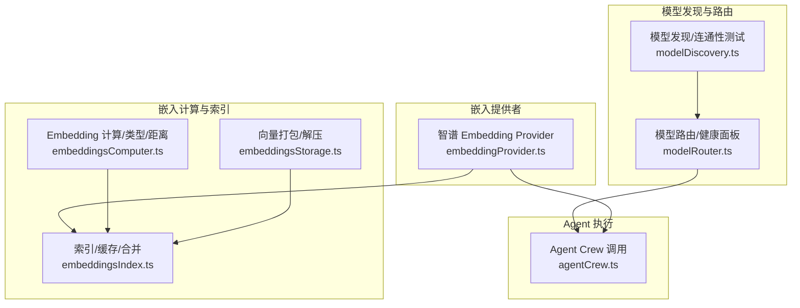
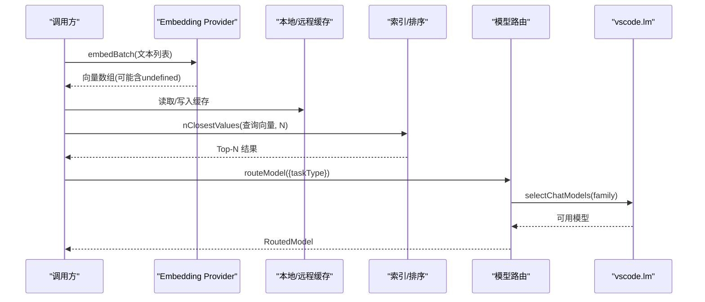
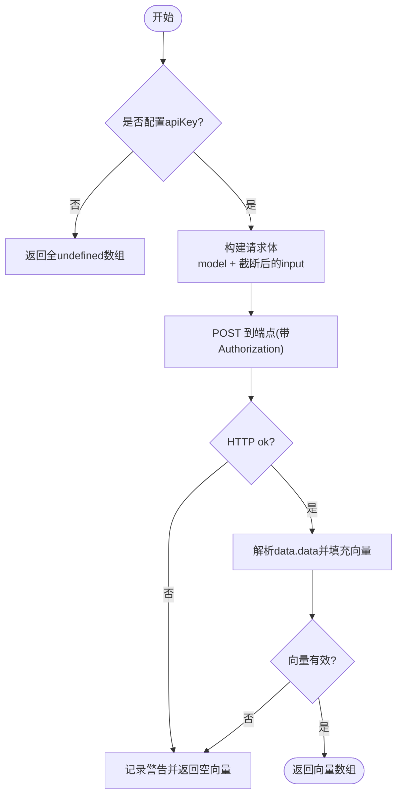
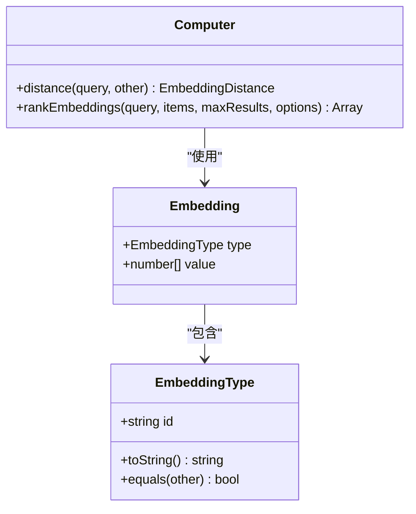
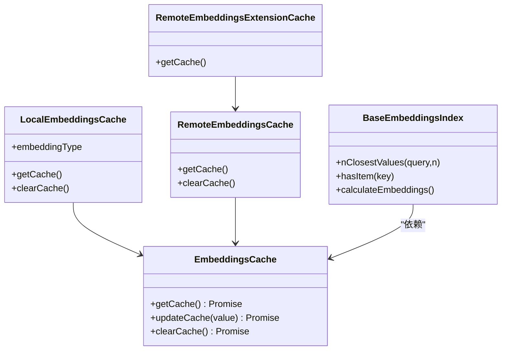
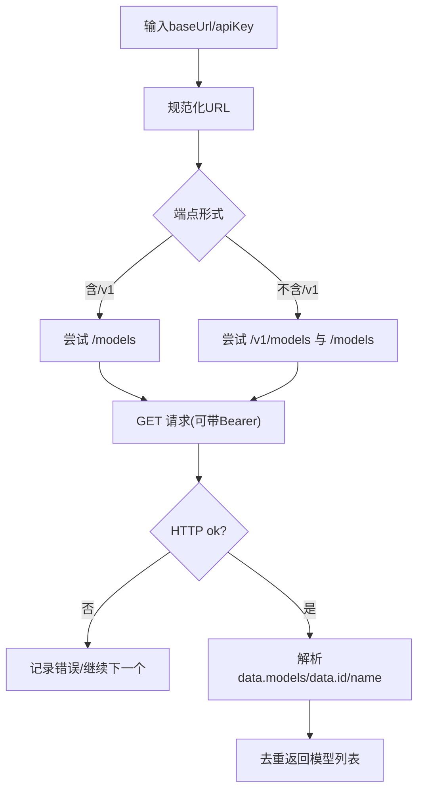
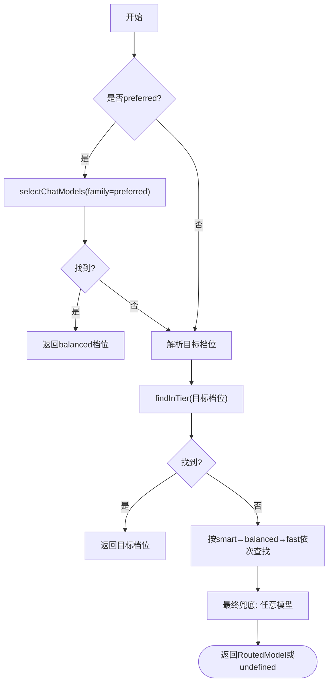
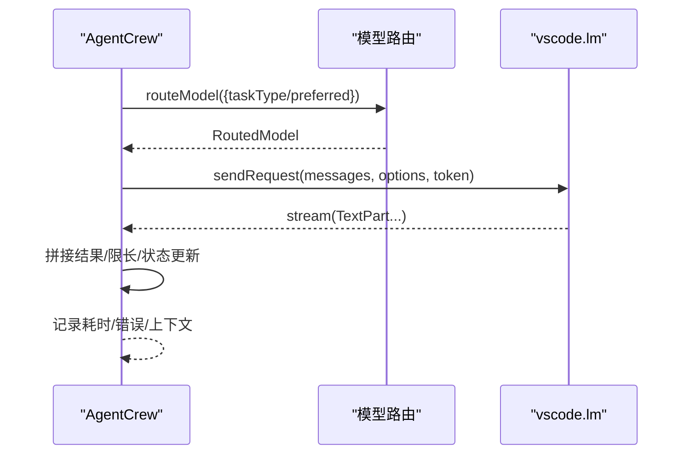
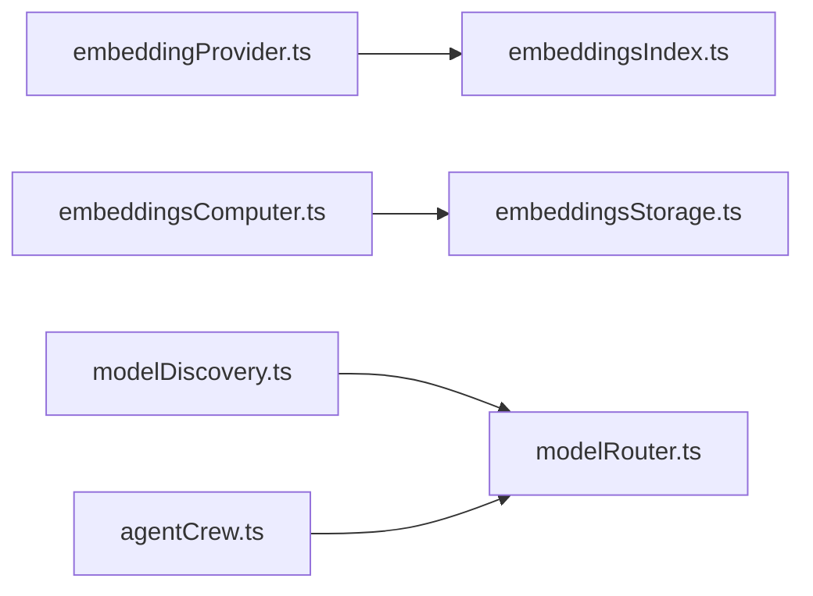

# 嵌入模型系统

<cite>
**本文引用的文件**
- [embeddingProvider.ts](file://extensions/kodrix-agent-os/src/codebase/embeddingProvider.ts)
- [embeddingsComputer.ts](file://extensions/copilot/src/platform/embeddings/common/embeddingsComputer.ts)
- [embeddingsStorage.ts](file://extensions/copilot/src/platform/embeddings/common/embeddingsStorage.ts)
- [embeddingsIndex.ts](file://extensions/copilot/src/platform/embeddings/common/embeddingsIndex.ts)
- [modelDiscovery.ts](file://extensions/kodrix-local/src/modelDiscovery.ts)
- [modelRouter.ts](file://extensions/kodrix-agent-os/src/model/modelRouter.ts)
- [agentCrew.ts](file://extensions/kodrix-agent-os/src/crew/agentCrew.ts)
</cite>

## 目录
1. [简介](#简介)
2. [项目结构](#项目结构)
3. [核心组件](#核心组件)
4. [架构总览](#架构总览)
5. [详细组件分析](#详细组件分析)
6. [依赖关系分析](#依赖关系分析)
7. [性能考量](#性能考量)
8. [故障排查指南](#故障排查指南)
9. [结论](#结论)
10. [附录：新模型集成与配置示例](#附录新模型集成与配置示例)

## 简介
本文件系统性地梳理并文档化 Kodrix 中的“嵌入模型系统”，覆盖 Provider 接口、模型注册与发现、动态加载策略、向量生成流程（文本预处理、模型调用、结果标准化）、缓存与批量处理机制、以及模型选择算法。同时提供面向扩展开发者的新模型接入指南与配置示例，帮助在 OpenAI 兼容端点、Anthropic、本地 Ollama/LM Studio 等后端之间灵活切换，并在语义检索与 Agent 任务中稳定运行。

## 项目结构
嵌入能力横跨多个扩展与模块：
- 智谱 Embedding Provider：实现 OpenAI 兼容的 embeddings 接口，支持批量请求与失败回退。
- Copilot 嵌入计算与索引：定义 EmbeddingType、距离计算、排序、本地/远程缓存、二进制打包与解压。
- 模型发现与连通性测试：OpenAI 兼容端点与 Ollama 的模型列表发现与健康检查。
- 模型路由：按任务类型自动选择 smart/balanced/fast 档位，记录使用日志与健康面板。
- Agent 执行：通过 vscode.lm 发送消息，结合路由与错误处理完成推理。

图表来源
- [embeddingProvider.ts:1-87](file://extensions/kodrix-agent-os/src/codebase/embeddingProvider.ts#L1-L87)
- [embeddingsComputer.ts:1-200](file://extensions/copilot/src/platform/embeddings/common/embeddingsComputer.ts#L1-L200)
- [embeddingsStorage.ts:1-57](file://extensions/copilot/src/platform/embeddings/common/embeddingsStorage.ts#L1-L57)
- [embeddingsIndex.ts:1-564](file://extensions/copilot/src/platform/embeddings/common/embeddingsIndex.ts#L1-L564)
- [modelDiscovery.ts:1-152](file://extensions/kodrix-local/src/modelDiscovery.ts#L1-L152)
- [modelRouter.ts:1-363](file://extensions/kodrix-agent-os/src/model/modelRouter.ts#L1-L363)
- [agentCrew.ts:480-508](file://extensions/kodrix-agent-os/src/crew/agentCrew.ts#L480-L508)

章节来源
- [embeddingProvider.ts:1-87](file://extensions/kodrix-agent-os/src/codebase/embeddingProvider.ts#L1-L87)
- [embeddingsComputer.ts:1-200](file://extensions/copilot/src/platform/embeddings/common/embeddingsComputer.ts#L1-L200)
- [embeddingsStorage.ts:1-57](file://extensions/copilot/src/platform/embeddings/common/embeddingsStorage.ts#L1-L57)
- [embeddingsIndex.ts:1-564](file://extensions/copilot/src/platform/embeddings/common/embeddingsIndex.ts#L1-L564)
- [modelDiscovery.ts:1-152](file://extensions/kodrix-local/src/modelDiscovery.ts#L1-L152)
- [modelRouter.ts:1-363](file://extensions/kodrix-agent-os/src/model/modelRouter.ts#L1-L363)
- [agentCrew.ts:480-508](file://extensions/kodrix-agent-os/src/crew/agentCrew.ts#L480-L508)

## 核心组件
- 嵌入 Provider 接口与实现
  - 统一对外暴露 embed(text) 与 embedBatch(texts)，返回 number[] 或 undefined（失败时）。
  - 默认对接智谱 OpenAI 兼容端点，支持自定义 endpoint/model/超时；输入截断控制 token 成本。
- 嵌入类型与计算
  - 定义 EmbeddingType、Embedding、Embeddings、距离计算与相似度排序 rankEmbeddings。
  - 支持不同量化格式（float32/float16/binary）与维度约束。
- 存储与索引
  - 本地/远程缓存：LocalEmbeddingsCache、RemoteEmbeddingsCache、RemoteEmbeddingsExtensionCache。
  - 向量打包/解压：pack/unpackEmbedding，优化存储体积与兼容性。
  - 基础索引：BaseEmbeddingsIndex 提供 nClosestValues、hasItem、calculateEmbeddings 等。
- 模型发现与路由
  - OpenAI 兼容端点与 Ollama 的模型发现与健康检测。
  - 三档模型路由（smart/balanced/fast），任务类型映射与使用日志、健康面板。
- Agent 调用
  - 通过 vscode.lm.selectChatModels 获取模型，sendRequest 流式消费响应，错误与超时处理。

章节来源
- [embeddingProvider.ts:1-87](file://extensions/kodrix-agent-os/src/codebase/embeddingProvider.ts#L1-L87)
- [embeddingsComputer.ts:1-200](file://extensions/copilot/src/platform/embeddings/common/embeddingsComputer.ts#L1-L200)
- [embeddingsStorage.ts:1-57](file://extensions/copilot/src/platform/embeddings/common/embeddingsStorage.ts#L1-L57)
- [embeddingsIndex.ts:1-564](file://extensions/copilot/src/platform/embeddings/common/embeddingsIndex.ts#L1-L564)
- [modelDiscovery.ts:1-152](file://extensions/kodrix-local/src/modelDiscovery.ts#L1-L152)
- [modelRouter.ts:1-363](file://extensions/kodrix-agent-os/src/model/modelRouter.ts#L1-L363)
- [agentCrew.ts:480-508](file://extensions/kodrix-agent-os/src/crew/agentCrew.ts#L480-L508)

## 架构总览
嵌入系统采用“Provider + 计算/索引 + 缓存 + 路由”的分层设计：
- Provider 层：屏蔽不同后端差异，统一输出向量。
- 计算层：定义类型、距离、排序，保证跨模型一致性。
- 索引与缓存层：本地/远程双缓存，二进制压缩，增量更新。
- 路由层：根据任务类型与可用性选择模型，记录健康指标。
- 应用层：Agent 通过路由与 Provider 完成语义检索与推理。

图表来源
- [embeddingProvider.ts:24-85](file://extensions/kodrix-agent-os/src/codebase/embeddingProvider.ts#L24-L85)
- [embeddingsIndex.ts:470-564](file://extensions/copilot/src/platform/embeddings/common/embeddingsIndex.ts#L470-L564)
- [modelRouter.ts:146-267](file://extensions/kodrix-agent-os/src/model/modelRouter.ts#L146-L267)

## 详细组件分析

### 嵌入 Provider（智谱 OpenAI 兼容）
- 功能要点
  - 构造请求体包含 model 与 input（每项截断至最大字符数）。
  - 设置超时与 AbortController，失败返回 undefined 以便上层回退 BM25。
  - 解析 data.data 数组，按 index 回填向量，校验数值类型。
- 错误与降级
  - HTTP 非 2xx、响应缺少 data、网络异常均记录警告并返回空向量占位。
  - 单条 embed 失败不影响整体批处理，便于容错。

图表来源
- [embeddingProvider.ts:24-85](file://extensions/kodrix-agent-os/src/codebase/embeddingProvider.ts#L24-L85)

章节来源
- [embeddingProvider.ts:1-87](file://extensions/kodrix-agent-os/src/codebase/embeddingProvider.ts#L1-L87)

### 嵌入类型、距离与排序
- 类型与元数据
  - EmbeddingType 标识模型与维度；wellKnownMetadata 描述量化策略（查询/文档）。
- 距离与排序
  - distance 计算点积相似度；rankEmbeddings 过滤阈值、降序排序、可选 maxSpread 多样性控制。
- 复杂度
  - 距离计算 O(d)，排序 O(n log n)。

图表来源
- [embeddingsComputer.ts:10-105](file://extensions/copilot/src/platform/embeddings/common/embeddingsComputer.ts#L10-L105)
- [embeddingsComputer.ts:135-199](file://extensions/copilot/src/platform/embeddings/common/embeddingsComputer.ts#L135-L199)

章节来源
- [embeddingsComputer.ts:1-200](file://extensions/copilot/src/platform/embeddings/common/embeddingsComputer.ts#L1-L200)

### 向量存储与索引
- 存储
  - packEmbedding：按量化策略将向量压缩为 Uint8Array（binary/float32）。
  - unpackEmbedding：反向解压，兼容历史 float32 存储。
- 缓存
  - LocalEmbeddingsCache：工作区/全局存储，版本控制，读写 JSON。
  - RemoteEmbeddingsCache：从 CDN 拉取最新缓存，对比 latest.txt 版本号，增量更新。
  - RemoteEmbeddingsExtensionCache：合并 core 与已安装扩展的 embedding 缓存。
- 索引
  - BaseEmbeddingsIndex：维护 Map<key, item>，nClosestValues 基于 rankEmbeddings 返回 Top-N。
  - calculateEmbeddings：去重并发保护，合并旧索引与缓存，标记 loaded。

图表来源
- [embeddingsStorage.ts:1-57](file://extensions/copilot/src/platform/embeddings/common/embeddingsStorage.ts#L1-L57)
- [embeddingsIndex.ts:61-174](file://extensions/copilot/src/platform/embeddings/common/embeddingsIndex.ts#L61-L174)
- [embeddingsIndex.ts:221-468](file://extensions/copilot/src/platform/embeddings/common/embeddingsIndex.ts#L221-L468)
- [embeddingsIndex.ts:470-564](file://extensions/copilot/src/platform/embeddings/common/embeddingsIndex.ts#L470-L564)

章节来源
- [embeddingsStorage.ts:1-57](file://extensions/copilot/src/platform/embeddings/common/embeddingsStorage.ts#L1-L57)
- [embeddingsIndex.ts:1-564](file://extensions/copilot/src/platform/embeddings/common/embeddingsIndex.ts#L1-L564)

### 模型发现与连通性测试
- OpenAI 兼容端点
  - 规范化 baseUrl，尝试 /v1/models 与 /models，解析 data 或 models 列表，返回唯一模型 ID。
  - testOpenAICompatibleConnection 返回 ok/models/latencyMs/error。
- Ollama
  - 访问 /api/tags，解析 name/model 字段，统计延迟。

图表来源
- [modelDiscovery.ts:14-82](file://extensions/kodrix-local/src/modelDiscovery.ts#L14-L82)
- [modelDiscovery.ts:84-152](file://extensions/kodrix-local/src/modelDiscovery.ts#L84-L152)

章节来源
- [modelDiscovery.ts:1-152](file://extensions/kodrix-local/src/modelDiscovery.ts#L1-L152)

### 模型路由与选择算法
- 档位与映射
  - smart/balanced/fast 三档，TASK_TIER_MAP 将 analysis/review/plan→smart，coding/edit/terminal→balanced，quick/extract→fast。
- 选择优先级
  - preferred 精确指定 → 目标档位 → 其余档位顺序兜底 → 任意可用模型。
- 使用记录与健康面板
  - 每次路由记录 modelName/tier/taskType/durationMs，持久化为 .kodrix/model-router.jsonl，支持滚动清理。
  - getRouterStatus 聚合成功率、平均耗时、最后错误等，Webview 展示。

图表来源
- [modelRouter.ts:58-89](file://extensions/kodrix-agent-os/src/model/modelRouter.ts#L58-L89)
- [modelRouter.ts:146-206](file://extensions/kodrix-agent-os/src/model/modelRouter.ts#L146-L206)
- [modelRouter.ts:208-267](file://extensions/kodrix-agent-os/src/model/modelRouter.ts#L208-L267)
- [modelRouter.ts:269-363](file://extensions/kodrix-agent-os/src/model/modelRouter.ts#L269-L363)

章节来源
- [modelRouter.ts:1-363](file://extensions/kodrix-agent-os/src/model/modelRouter.ts#L1-L363)

### Agent 调用与错误处理
- 通过 vscode.lm.selectChatModels 获取模型，构造 User 消息（系统提示+角色注入+用户指令）。
- sendRequest 流式消费 TextPart，拼接结果并限制长度；捕获异常并记录错误；finally 释放资源。
- 与路由结合：上游可选择 preferred family 或任务类型，由路由决定具体模型。

图表来源
- [agentCrew.ts:480-508](file://extensions/kodrix-agent-os/src/crew/agentCrew.ts#L480-L508)
- [modelRouter.ts:208-267](file://extensions/kodrix-agent-os/src/model/modelRouter.ts#L208-L267)

章节来源
- [agentCrew.ts:480-508](file://extensions/kodrix-agent-os/src/crew/agentCrew.ts#L480-L508)
- [modelRouter.ts:1-363](file://extensions/kodrix-agent-os/src/model/modelRouter.ts#L1-L363)

## 依赖关系分析
- 松耦合
  - Provider 仅依赖 fetch 与 logger，不感知索引细节。
  - 索引层封装缓存与计算，对上层暴露简洁 API。
  - 路由层通过 vscode.lm 抽象模型选择，不关心具体后端。
- 关键依赖链
  - embeddingProvider.ts → embeddingsIndex.ts（用于语义检索）
  - embeddingsComputer.ts → embeddingsStorage.ts（类型与存储）
  - modelDiscovery.ts → modelRouter.ts（发现与路由协同）
  - agentCrew.ts → modelRouter.ts（任务驱动选模）

图表来源
- [embeddingProvider.ts:1-87](file://extensions/kodrix-agent-os/src/codebase/embeddingProvider.ts#L1-L87)
- [embeddingsIndex.ts:1-564](file://extensions/copilot/src/platform/embeddings/common/embeddingsIndex.ts#L1-L564)
- [embeddingsComputer.ts:1-200](file://extensions/copilot/src/platform/embeddings/common/embeddingsComputer.ts#L1-L200)
- [embeddingsStorage.ts:1-57](file://extensions/copilot/src/platform/embeddings/common/embeddingsStorage.ts#L1-L57)
- [modelDiscovery.ts:1-152](file://extensions/kodrix-local/src/modelDiscovery.ts#L1-L152)
- [modelRouter.ts:1-363](file://extensions/kodrix-agent-os/src/model/modelRouter.ts#L1-L363)
- [agentCrew.ts:480-508](file://extensions/kodrix-agent-os/src/crew/agentCrew.ts#L480-L508)

章节来源
- [embeddingProvider.ts:1-87](file://extensions/kodrix-agent-os/src/codebase/embeddingProvider.ts#L1-L87)
- [embeddingsIndex.ts:1-564](file://extensions/copilot/src/platform/embeddings/common/embeddingsIndex.ts#L1-L564)
- [embeddingsComputer.ts:1-200](file://extensions/copilot/src/platform/embeddings/common/embeddingsComputer.ts#L1-L200)
- [embeddingsStorage.ts:1-57](file://extensions/copilot/src/platform/embeddings/common/embeddingsStorage.ts#L1-L57)
- [modelDiscovery.ts:1-152](file://extensions/kodrix-local/src/modelDiscovery.ts#L1-L152)
- [modelRouter.ts:1-363](file://extensions/kodrix-agent-os/src/model/modelRouter.ts#L1-L363)
- [agentCrew.ts:480-508](file://extensions/kodrix-agent-os/src/crew/agentCrew.ts#L480-L508)

## 性能考量
- 批量请求与截断
  - Provider 支持 embedBatch，减少网络往返；单条输入截断控制 token 成本。
- 缓存命中与版本管理
  - 本地/远程缓存按版本键控制失效；RemoteEmbeddingsCache 通过 latest.txt 快速判断是否需要刷新。
- 二进制压缩
  - 对 binary 量化向量进行位打包，显著降低存储体积；unpack 兼容历史 float32。
- 并发与幂等
  - BaseEmbeddingsIndex.calculateEmbeddings 使用 Promise 防抖，避免重复计算。
- 路由开销
  - 路由优先命中 preferred，其次档位池，最后全池兜底；记录耗时用于健康面板。

[本节为通用性能建议，无需特定文件引用]

## 故障排查指南
- 嵌入请求失败
  - 检查 apiKey 与 endpoint 是否正确；查看日志中的 HTTP 状态码与响应结构。
  - 若返回 undefined 向量，上层应回退 BM25 或其他检索策略。
- 缓存未命中或过期
  - 确认 cacheVersion 与 Memento 版本一致；必要时调用 clearCache 重建。
  - 远程缓存不可用时，会回退到本地旧缓存。
- 模型不可用
  - 使用 discoverOpenAIModels/testOpenAICompatibleConnection/testOllamaConnection 验证连通性与模型列表。
  - 通过路由命令查看各档位模型池与最近使用统计，定位失败原因。
- Agent 无响应
  - 检查 sendRequest 是否被取消（token）；确认模型是否返回文本片段；查看错误日志。

章节来源
- [embeddingProvider.ts:24-85](file://extensions/kodrix-agent-os/src/codebase/embeddingProvider.ts#L24-L85)
- [embeddingsIndex.ts:86-174](file://extensions/copilot/src/platform/embeddings/common/embeddingsIndex.ts#L86-L174)
- [embeddingsIndex.ts:221-340](file://extensions/copilot/src/platform/embeddings/common/embeddingsIndex.ts#L221-L340)
- [modelDiscovery.ts:56-152](file://extensions/kodrix-local/src/modelDiscovery.ts#L56-L152)
- [modelRouter.ts:269-363](file://extensions/kodrix-agent-os/src/model/modelRouter.ts#L269-L363)
- [agentCrew.ts:480-508](file://extensions/kodrix-agent-os/src/crew/agentCrew.ts#L480-L508)

## 结论
本嵌入模型系统以 Provider 抽象为核心，结合类型化计算、高效缓存与智能路由，实现了多后端、高可用、可扩展的语义检索与推理支撑。通过批量请求、二进制压缩、版本化缓存与路由健康面板，系统在性能与稳定性上具备工程级保障。未来可在更多 LLM 供应商（如 Anthropic）与本地模型（Ollama/LM Studio）间无缝扩展，进一步提升语义理解与 Agent 协作效率。

[本节为总结性内容，无需特定文件引用]

## 附录：新模型集成与配置示例
- 新增 OpenAI 兼容 Embedding Provider
  - 参考现有 Provider 模式，实现 embed/embedBatch，统一返回 number[] | undefined。
  - 配置项：apiKey、endpoint、model、timeoutMs；失败时返回 undefined 以触发回退。
- 接入 Anthropic
  - 若提供 OpenAI 兼容 embeddings 接口，可直接复用 Provider；否则需新增适配层，将 Anthropic 响应转换为标准向量。
- 接入本地模型（Ollama/LM Studio）
  - 使用 modelDiscovery 的 testOllamaConnection 验证连通性与模型列表。
  - 若本地服务提供 OpenAI 兼容 embeddings，可直接接入 Provider；否则需实现本地推理桥接。
- 配置与启用
  - 在设置中启用 semanticEmbedding 并提供密钥；失败时自动回退 BM25。
  - 通过模型路由命令查看健康面板，评估各模型成功率与耗时。
- 最佳实践
  - 合理设置输入截断与超时，控制成本与延迟。
  - 使用批量接口减少网络开销；利用缓存提升命中率。
  - 在 Agent 任务中结合路由与重试策略，提高鲁棒性。

[本节为操作指南，无需特定文件引用]