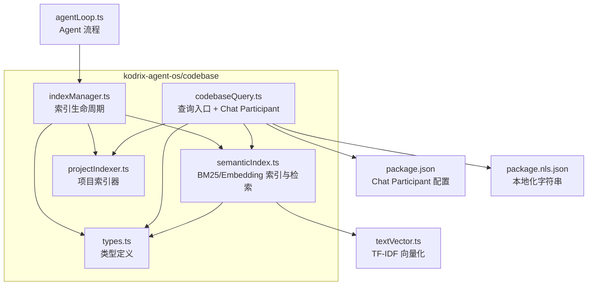
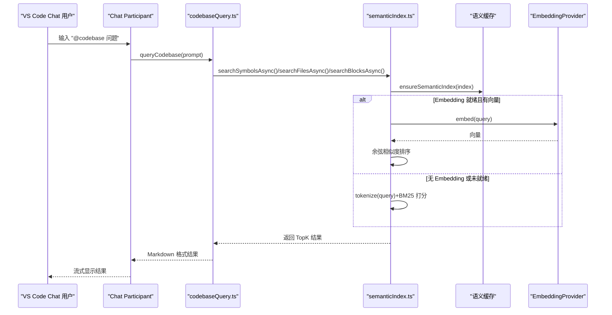
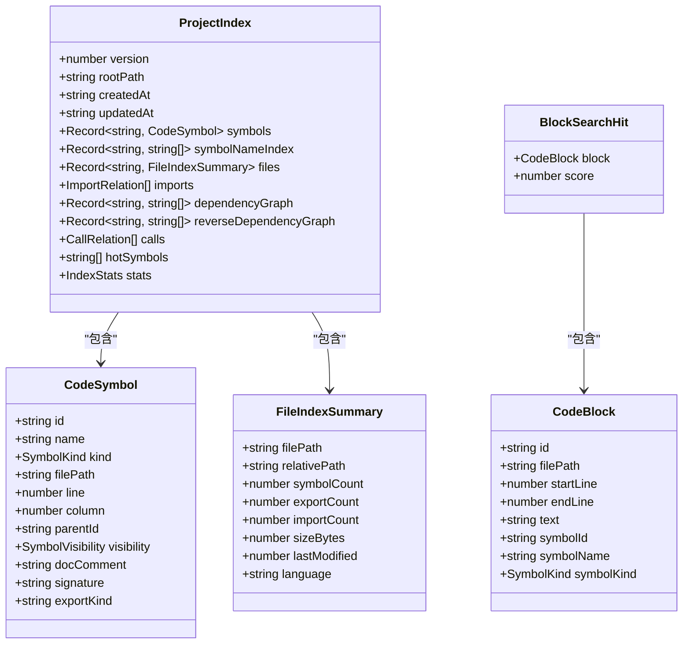
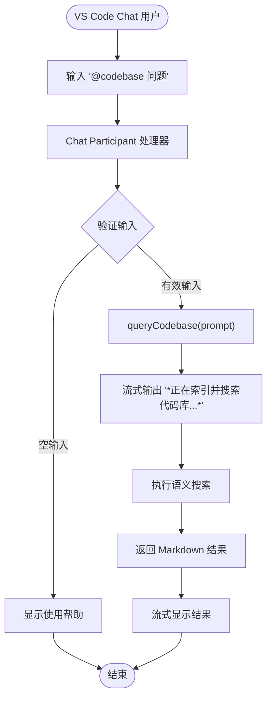
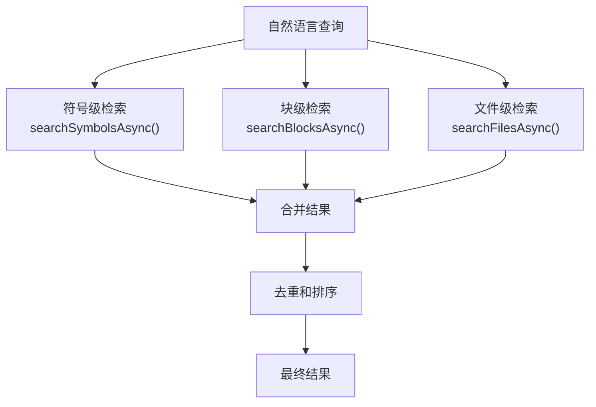
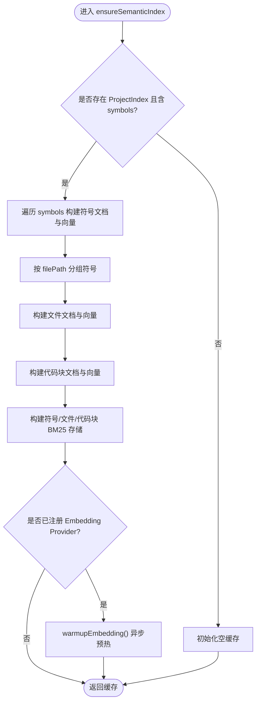
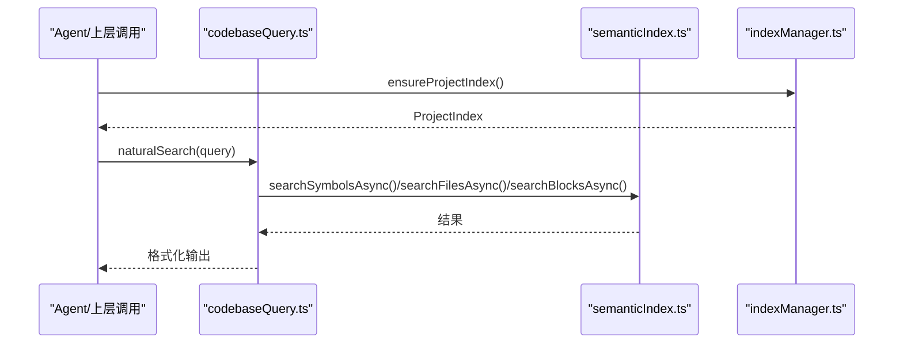
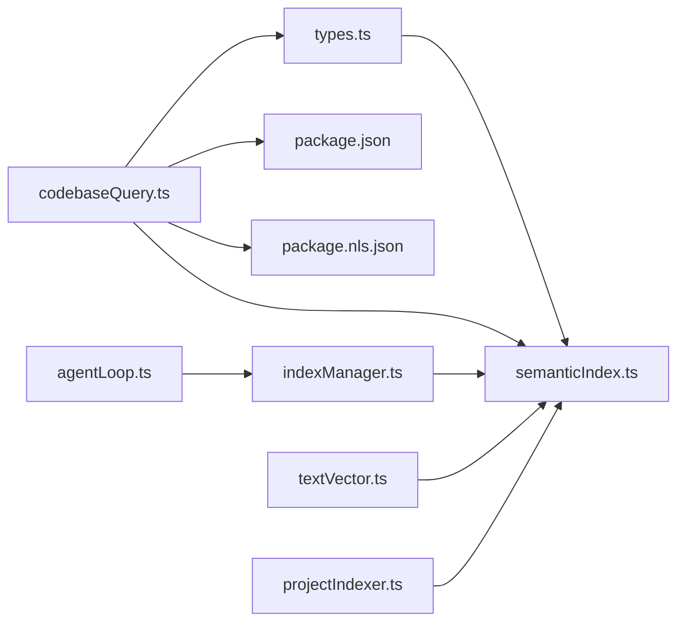

# 语义索引构建

<cite>
**本文引用的文件**   
- [semanticIndex.ts](file://extensions/kodrix-agent-os/src/codebase/semanticIndex.ts)
- [types.ts](file://extensions/kodrix-agent-os/src/codebase/types.ts)
- [codebaseQuery.ts](file://extensions/kodrix-agent-os/src/codebase/codebaseQuery.ts)
- [indexManager.ts](file://extensions/kodrix-agent-os/src/codebase/indexManager.ts)
- [textVector.ts](file://extensions/kodrix-agent-os/src/utils/textVector.ts)
- [projectIndexer.ts](file://extensions/kodrix-agent-os/src/codebase/projectIndexer.ts)
- [agentLoop.ts](file://extensions/kodrix-agent-os/src/agent/agentLoop.ts)
- [package.json](file://extensions/kodrix-agent-os/package.json)
- [package.nls.json](file://extensions/kodrix-agent-os/package.nls.json)
</cite>

## 更新摘要
**变更内容**   
- 新增 VS Code Chat 集成，实现 kodrix.codebase chat participant
- 增强多级检索架构，支持符号级、块级、文件级三层语义搜索
- 改进自然语言查询处理，支持更复杂的意图识别和查询解析
- 优化 Chat Participant 注册机制，提供原生 VS Code 聊天界面集成
- 完善多级别检索结果去重和排序算法

## 目录
1. [引言](#引言)
2. [项目结构](#项目结构)
3. [核心组件](#核心组件)
4. [架构总览](#架构总览)
5. [详细组件分析](#详细组件分析)
6. [VS Code Chat 集成](#vs-code-chat-集成)
7. [多级检索架构](#多级检索架构)
8. [BM25 全文检索实现](#bm25-全文检索实现)
9. [嵌入提供者架构](#嵌入提供者架构)
10. [依赖关系分析](#依赖关系分析)
11. [性能与优化](#性能与优化)
12. [多语言支持](#多语言支持)
13. [增量更新与变更检测](#增量更新与变更检测)
14. [故障排除指南](#故障排除指南)
15. [结论](#结论)

## 引言
本文件系统性阐述 Kodrix 的"语义索引"子系统，覆盖从文件扫描、AST 解析、符号提取、依赖分析到检索与可视化的全链路。重点包括：
- **VS Code Chat 集成**：原生聊天界面中的自然语言代码问答能力
- **多级检索架构**：符号级、块级、文件级的三层语义搜索
- **BM25 全文检索**：零依赖实现的 TF-IDF 加权评分算法
- **可插拔 Embedding 架构**：支持外部向量模型的统一接口设计
- **块级语义搜索**：语法块级别的代码片段检索能力
- **多语言 AST 解析**：TypeScript、JavaScript、Python、Go、Rust 等语言支持
- **增量更新机制**：高效的变更检测与局部重建策略
- **性能优化**：并行处理、智能缓存与内存管理

## 项目结构
语义索引相关代码位于扩展 kodrix-agent-os 的 codebase 子模块中，核心文件如下：
- types.ts：定义索引类型（符号、文件摘要、项目索引、统计信息等）
- semanticIndex.ts：实现 BM25 索引、Embedding Provider 注册与预热、语义文档构建、同步/异步检索
- codebaseQuery.ts：基于 ProjectIndex 的代码查询入口（定义、引用、调用者、结构、自然语言），以及 VS Code Chat Participant 注册
- indexManager.ts：索引生命周期管理（创建、删除、确保存在）
- textVector.ts：轻量 TF-IDF 词向量工具（分词、编码、余弦相似度）
- projectIndexer.ts：项目索引器（文件发现、AST 解析、符号提取）
- agentLoop.ts：Agent 流程中按需获取/构建索引
- package.json：Chat Participant 配置和命令定义
- package.nls.json：本地化字符串定义

**图表来源**
- [semanticIndex.ts:1-540](file://extensions/kodrix-agent-os/src/codebase/semanticIndex.ts#L1-L540)
- [types.ts:1-242](file://extensions/kodrix-agent-os/src/codebase/types.ts#L1-L242)
- [codebaseQuery.ts:1-687](file://extensions/kodrix-agent-os/src/codebase/codebaseQuery.ts#L1-L687)
- [indexManager.ts:1-476](file://extensions/kodrix-agent-os/src/codebase/indexManager.ts#L1-L476)
- [textVector.ts:1-106](file://extensions/kodrix-agent-os/src/utils/textVector.ts#L1-L106)
- [projectIndexer.ts:1-200](file://extensions/kodrix-agent-os/src/codebase/projectIndexer.ts#L1-L200)
- [package.json:29-55](file://extensions/kodrix-agent-os/package.json#L29-L55)
- [package.nls.json:5-10](file://extensions/kodrix-agent-os/package.nls.json#L5-L10)

**章节来源**
- [semanticIndex.ts:1-540](file://extensions/kodrix-agent-os/src/codebase/semanticIndex.ts#L1-L540)
- [types.ts:1-242](file://extensions/kodrix-agent-os/src/codebase/types.ts#L1-L242)
- [codebaseQuery.ts:1-687](file://extensions/kodrix-agent-os/src/codebase/codebaseQuery.ts#L1-L687)
- [indexManager.ts:1-476](file://extensions/kodrix-agent-os/src/codebase/indexManager.ts#L1-L476)
- [textVector.ts:1-106](file://extensions/kodrix-agent-os/src/utils/textVector.ts#L1-L106)
- [projectIndexer.ts:1-200](file://extensions/kodrix-agent-os/src/codebase/projectIndexer.ts#L1-L200)
- [package.json:29-55](file://extensions/kodrix-agent-os/package.json#L29-L55)
- [package.nls.json:5-10](file://extensions/kodrix-agent-os/package.nls.json#L5-L10)

## 核心组件
- **类型层（types.ts）**
  - CodeSymbol：符号唯一标识、名称、种类、位置、父符号、可见性、签名、导出方式等
  - FileIndexSummary：文件路径、相对路径、符号/导出/导入计数、大小、修改时间、语言
  - ProjectIndex：版本、根路径、时间戳、符号表、符号名索引、文件索引、导入关系、依赖图、反向依赖图、调用关系、热门符号、统计信息
  - IndexStats：文件/符号/导入/调用总数、语言分布、构建耗时
  - IndexerConfig：包含扩展名、排除目录/glob、最大文件大小、是否监听增量
  - CodeBlock：语法块数据结构，包含文件路径、行号范围、完整文本、关联符号信息
  - BlockSearchHit：块级搜索结果，包含代码块和匹配分数
- **语义索引层（semanticIndex.ts）**
  - BM25 存储与打分：按文档词频、平均长度、逆文档频率计算分数
  - 语义缓存：绑定 ProjectIndex 对象，避免重复构建；提供失效接口
  - Embedding Provider：可插拔外部向量模型/API，支持批量编码与预热；失败回退 BM25
  - 文档构建：buildSymbolDoc/buildFileDoc/buildBlockDoc 将符号/文件/代码块聚合为文本用于 BM25 或 Embedding
  - 检索 API：searchSymbols/searchFiles/searchBlocksAsync（同步 BM25），searchSymbolsAsync/searchFilesAsync（优先 Embedding，否则回退 BM25）
- **查询层（codebaseQuery.ts）**
  - 面向 Agent 的查询入口：definition/usage/callers/structure/natural
  - 内部使用 ProjectIndex 进行符号查找、依赖分析、结果格式化
  - 意图识别：中文查询模式匹配与意图分类
  - VS Code Chat Participant 注册：kodrix.codebase chat participant 实现
- **索引管理层（indexManager.ts）**
  - ensureProjectIndex/deleteProjectIndex 等生命周期方法
  - Webview 面板管理，实时状态展示
- **项目索引器（projectIndexer.ts）**
  - 文件发现与过滤：支持 glob 模式、.cursorignore 配置
  - AST 解析：TypeScript 语法树构建与符号提取
  - 多语言支持：Python、Go、Rust 等语言的 AST 解析
- **向量化层（textVector.ts）**
  - tokenize：中英文混合分词，停用词过滤，bigram 切分
  - encodeText：TF-IDF 近似编码，固定维度稀疏向量
  - cosineSimilarity：余弦相似度计算

**章节来源**
- [types.ts:6-242](file://extensions/kodrix-agent-os/src/codebase/types.ts#L6-L242)
- [semanticIndex.ts:1-540](file://extensions/kodrix-agent-os/src/codebase/semanticIndex.ts#L1-L540)
- [codebaseQuery.ts:1-687](file://extensions/kodrix-agent-os/src/codebase/codebaseQuery.ts#L1-L687)
- [indexManager.ts:1-476](file://extensions/kodrix-agent-os/src/codebase/indexManager.ts#L1-L476)
- [projectIndexer.ts:1-200](file://extensions/kodrix-agent-os/src/codebase/projectIndexer.ts#L1-L200)
- [textVector.ts:1-106](file://extensions/kodrix-agent-os/src/utils/textVector.ts#L1-L106)

## 架构总览
语义索引系统采用"三层检索"架构，并通过 VS Code Chat 集成提供自然语言交互界面：
- **第一层**：Embedding 向量检索（可选，需注册 EmbeddingProvider）
- **第二层**：块级语义检索（语法块级别的代码片段匹配）
- **第三层**：BM25 文本检索（默认，零外部依赖）
- **Chat 集成层**：VS Code 原生聊天界面，支持 @codebase 自然语言查询

**图表来源**
- [codebaseQuery.ts:589-660](file://extensions/kodrix-agent-os/src/codebase/codebaseQuery.ts#L589-L660)
- [semanticIndex.ts:380-450](file://extensions/kodrix-agent-os/src/codebase/semanticIndex.ts#L380-L450)

## 详细组件分析

### 类型与数据模型（types.ts）
- **CodeSymbol**
  - 关键字段：id、name、kind、filePath、line/column、parentId、visibility、docComment、signature、exportKind
  - 用途：统一表示各语言的符号实体，供索引、检索、可视化使用
- **FileIndexSummary**
  - 关键字段：filePath、relativePath、symbolCount/exportCount/importCount、sizeBytes、lastModified、language
  - 用途：文件级元数据，辅助增量更新与统计
- **ProjectIndex**
  - 关键字段：version/rootPath/createdAt/updatedAt、symbols/symbolNameIndex/files、imports/dependencyGraph/reverseDependencyGraph、calls/hotSymbols/stats
  - 用途：工程级索引的核心载体，承载符号、依赖、调用、热度与统计
- **IndexStats/IndexerConfig**
  - 用途：统计构建指标与配置过滤规则
- **CodeBlock**
  - 关键字段：id、filePath、startLine/endLine、text、symbolId/symbolName/symbolKind
  - 用途：语法块级检索的数据结构，支持精确的代码片段定位
- **BlockSearchHit**
  - 关键字段：block、score
  - 用途：块级检索结果封装，包含代码块和匹配分数

**图表来源**
- [types.ts:6-142](file://extensions/kodrix-agent-os/src/codebase/types.ts#L6-L142)
- [types.ts:200-242](file://extensions/kodrix-agent-os/src/codebase/types.ts#L200-L242)

**章节来源**
- [types.ts:6-142](file://extensions/kodrix-agent-os/src/codebase/types.ts#L6-L142)
- [types.ts:200-242](file://extensions/kodrix-agent-os/src/codebase/types.ts#L200-L242)

### VS Code Chat 集成
新增的 VS Code Chat 集成提供了原生的自然语言代码问答体验：

- **Chat Participant 注册**
  - 通过 `createChatParticipant('kodrix.codebase', ...)` 注册聊天参与者
  - 支持流式响应，实时显示查询进度和结果
  - 自动处理取消请求和用户反馈
- **自然语言查询处理**
  - 支持多种查询格式：`@codebase getUserProfile 在哪定义？`
  - 内置示例提示，引导用户使用
  - 错误处理和友好提示信息
- **命令备选入口**
  - 提供 `kodrix.codebase.search` 命令作为备用查询方式
  - 支持在聊天面板中直接执行查询
- **配置控制**
  - 通过 `kodrix.features.codebaseQuery` 配置项启用/禁用功能
  - 支持国际化和本地化

**图表来源**
- [codebaseQuery.ts:589-660](file://extensions/kodrix-agent-os/src/codebase/codebaseQuery.ts#L589-L660)

**章节来源**
- [codebaseQuery.ts:589-660](file://extensions/kodrix-agent-os/src/codebase/codebaseQuery.ts#L589-L660)
- [package.json:29-55](file://extensions/kodrix-agent-os/package.json#L29-L55)
- [package.nls.json:5-10](file://extensions/kodrix-agent-os/package.nls.json#L5-L10)

### 多级检索架构
增强的多级检索架构支持三个层次的语义搜索：

- **符号级检索（Symbol Level）**
  - 针对具体的函数、类、变量等符号进行语义匹配
  - 优先级最高，得分权重 0.4 + hit.score
  - 返回符号详细信息、签名、文档注释等
- **块级检索（Block Level）**
  - 对标 Cursor syntax-block embedding，支持代码片段级别的语义匹配
  - 优先级中等，得分权重 0.35 + hit.score
  - 返回完整的代码块文本和行号范围
- **文件级检索（File Level）**
  - 针对整个文件的语义匹配
  - 优先级最低，得分权重 0.25 + hit.score
  - 主要用于文件级别的上下文理解

**图表来源**
- [codebaseQuery.ts:316-400](file://extensions/kodrix-agent-os/src/codebase/codebaseQuery.ts#L316-L400)

**章节来源**
- [codebaseQuery.ts:316-400](file://extensions/kodrix-agent-os/src/codebase/codebaseQuery.ts#L316-L400)
- [semanticIndex.ts:452-526](file://extensions/kodrix-agent-os/src/codebase/semanticIndex.ts#L452-L526)

### 语义索引与检索（semanticIndex.ts）
- **BM25 构建与打分**
  - buildBm25：对文档集合分词、统计词频、文档长度、平均长度、逆文档频率
  - bm25Score：标准 BM25 公式计算查询与文档的相关度
- **语义缓存**
  - ensureSemanticIndex：按 ProjectIndex 构建符号/文件/代码块向量与 BM25 索引；绑定 index 对象，重建自动失效
  - invalidateSemanticIndex：主动失效缓存
- **Embedding Provider**
  - registerEmbeddingProvider/clearEmbeddingProvider/getEmbeddingProvider：注册/清除/获取外部向量提供方
  - warmupEmbedding：异步预热符号/文件/代码块向量；支持批量 embedBatch；失败时 ready=true 并回退 BM25
- **文档构建**
  - buildSymbolDoc：name+kind+parentName+signature+docComment
  - buildFileDoc：relativePath+聚合符号名+部分 docComment
  - buildBlockDoc：提取完整代码块文本，支持精确位置截取与启发式扫描
- **检索 API**
  - searchSymbols/searchFiles：同步 BM25
  - searchSymbolsAsync/searchFilesAsync：优先 Embedding 余弦相似度，否则回退 BM25
  - searchBlocksAsync：块级语义检索，支持代码片段级别匹配

**图表来源**
- [semanticIndex.ts:86-144](file://extensions/kodrix-agent-os/src/codebase/semanticIndex.ts#L86-L144)
- [semanticIndex.ts:192-261](file://extensions/kodrix-agent-os/src/codebase/semanticIndex.ts#L192-L261)

**章节来源**
- [semanticIndex.ts:34-69](file://extensions/kodrix-agent-os/src/codebase/semanticIndex.ts#L34-L69)
- [semanticIndex.ts:86-144](file://extensions/kodrix-agent-os/src/codebase/semanticIndex.ts#L86-L144)
- [semanticIndex.ts:155-261](file://extensions/kodrix-agent-os/src/codebase/semanticIndex.ts#L155-L261)
- [semanticIndex.ts:265-329](file://extensions/kodrix-agent-os/src/codebase/semanticIndex.ts#L265-L329)
- [semanticIndex.ts:338-526](file://extensions/kodrix-agent-os/src/codebase/semanticIndex.ts#L338-L526)

### 查询入口（codebaseQuery.ts）
- **意图识别**：中文查询模式匹配，支持 definition/usage/callers/structure/dependency/architecture/natural 等意图
- **符号提取**：从自然语言查询中提取目标符号名，支持驼峰命名、常量命名等多种格式
- **多层检索**：语义检索（符号级 + 块级 + 文件级）+ 符号名精确/模糊匹配混合
- **结果格式化**：Markdown 格式输出，包含符号详情、依赖关系、代码片段等信息
- **Chat Participant 注册**：kodrix.codebase chat participant 实现，支持 VS Code 原生聊天界面

**图表来源**
- [codebaseQuery.ts:316-400](file://extensions/kodrix-agent-os/src/codebase/codebaseQuery.ts#L316-L400)
- [indexManager.ts:1-476](file://extensions/kodrix-agent-os/src/codebase/indexManager.ts#L1-L476)

**章节来源**
- [codebaseQuery.ts:1-687](file://extensions/kodrix-agent-os/src/codebase/codebaseQuery.ts#L1-L687)

### 索引生命周期（indexManager.ts 与 agentLoop.ts）
- **indexManager.ts**：提供 ensureProjectIndex/deleteProjectIndex 等方法，负责索引的创建与清理
- **Webview 面板**：实时显示索引状态、进度条、文件列表，支持暂停/恢复/重建操作
- **agentLoop.ts**：在 Agent 任务执行前动态获取或构建索引，保证后续查询可用

**章节来源**
- [indexManager.ts:1-476](file://extensions/kodrix-agent-os/src/codebase/indexManager.ts#L1-L476)
- [agentLoop.ts:340-360](file://extensions/kodrix-agent-os/src/agent/agentLoop.ts#L340-L360)

## VS Code Chat 集成

### Chat Participant 实现
VS Code Chat 集成是本次更新的核心功能，提供了原生的自然语言代码问答体验：

- **注册机制**
  - 使用 `vscode.chat.createChatParticipant('kodrix.codebase', handler)` 注册聊天参与者
  - 支持流式响应，通过 `stream.markdown()` 实时输出结果
  - 自动处理取消请求和用户反馈
- **查询处理**
  - 接收用户输入的 prompt，调用 `queryCodebase()` 执行语义搜索
  - 支持多种查询格式，如 `@codebase getUserProfile 在哪定义？`
  - 内置使用示例和错误处理
- **配置管理**
  - 通过 `kodrix.features.codebaseQuery` 配置项控制功能开关
  - 支持国际化和本地化字符串

### 命令备选入口
除了 Chat Participant，还提供了传统的命令入口：

- **kodrix.codebase.search**
  - 通过输入框获取用户查询
  - 在聊天面板中执行搜索
  - 打开 Markdown 文档显示结果

**章节来源**
- [codebaseQuery.ts:589-687](file://extensions/kodrix-agent-os/src/codebase/codebaseQuery.ts#L589-L687)
- [package.json:29-55](file://extensions/kodrix-agent-os/package.json#L29-L55)
- [package.nls.json:5-10](file://extensions/kodrix-agent-os/package.nls.json#L5-L10)

## 多级检索架构

### 三层检索策略
增强的多级检索架构实现了三个层次的语义搜索：

- **符号级检索（Symbol Level）**
  - 针对具体的函数、类、变量等符号进行语义匹配
  - 使用 `searchSymbolsAsync()` 进行检索
  - 返回符号详细信息，包括签名、文档注释、行号等
  - 得分权重：0.4 + hit.score，最高可达 0.95
- **块级检索（Block Level）**
  - 对标 Cursor syntax-block embedding，支持代码片段级别的语义匹配
  - 使用 `searchBlocksAsync()` 进行检索
  - 返回完整的代码块文本和行号范围
  - 得分权重：0.35 + hit.score，最高可达 0.9
- **文件级检索（File Level）**
  - 针对整个文件的语义匹配
  - 使用 `searchFilesAsync()` 进行检索
  - 主要用于文件级别的上下文理解
  - 得分权重：0.25 + hit.score，最高可达 0.7

### 结果去重和排序
- **去重机制**
  - 基于文件路径和行号进行去重，避免重复结果
  - 跳过已命中符号的文件，避免冗余
- **排序策略**
  - 按得分降序排列
  - 综合考虑语义匹配度和相关性
- **限制数量**
  - 符号级最多返回 10 个结果
  - 块级最多返回 8 个结果
  - 文件级最多返回 5 个结果

**章节来源**
- [codebaseQuery.ts:316-400](file://extensions/kodrix-agent-os/src/codebase/codebaseQuery.ts#L316-L400)
- [semanticIndex.ts:452-526](file://extensions/kodrix-agent-os/src/codebase/semanticIndex.ts#L452-L526)

## BM25 全文检索实现
BM25（Best Matching 25）是一种经典的全文检索算法，在 Kodrix 中实现了完整的 TF-IDF 加权评分机制：

- **核心参数**：BM25_K1=1.5（词频饱和参数），BM25_B=0.75（文档长度归一化参数）
- **文档构建**：符号文档包含名称、类型、父符号、签名、文档注释；文件文档包含相对路径、符号名聚合、文档注释片段
- **分词处理**：中英文混合分词，英文停用词过滤，中文 bigram 切分
- **评分计算**：标准 BM25 公式，考虑词频、逆文档频率、文档长度等因素
- **性能优化**：预编译分词结果，Map 数据结构快速查找，批量处理减少重复计算

**章节来源**
- [semanticIndex.ts:15-69](file://extensions/kodrix-agent-os/src/codebase/semanticIndex.ts#L15-L69)
- [textVector.ts:24-50](file://extensions/kodrix-agent-os/src/utils/textVector.ts#L24-L50)

## 嵌入提供者架构
可插拔的 Embedding Provider 架构支持外部向量模型的无缝集成：

- **统一接口**：EmbeddingProvider 接口定义 embed/embedBatch 方法，支持单条和批量编码
- **状态管理**：EmbeddingState 维护 provider、向量缓存、就绪状态、构建进程
- **异步预热**：warmupEmbedding 函数异步构建符号、文件、代码块的向量表示
- **批量优化**：支持 embedBatch 方法减少网络往返，提升批量编码效率
- **容错机制**：预热失败时标记 ready=true 但向量为空，检索时自动回退到 BM25
- **配置管理**：registerEmbeddingProvider/clearEmbeddingProvider 动态切换向量模型

**章节来源**
- [semanticIndex.ts:155-261](file://extensions/kodrix-agent-os/src/codebase/semanticIndex.ts#L155-L261)

## 依赖关系分析
- **语义索引与类型解耦**：semanticIndex.ts 仅依赖 types.ts 中的数据结构
- **查询层依赖索引层**：codebaseQuery.ts 通过 ProjectIndex 与 semanticIndex.ts 提供的检索 API 工作
- **索引生命周期由 indexManager.ts 管理**，并在 agentLoop.ts 中被消费
- **Chat Participant 依赖 VS Code API**：通过 vscode.chat API 注册聊天参与者
- **配置依赖 package.json**：Chat Participant 配置和命令定义
- **多语言解析依赖 tree-sitter-wasm 与 vscode-languagedetection**
- **向量化层独立**：textVector.ts 提供零依赖的 TF-IDF 向量化能力

**图表来源**
- [semanticIndex.ts:1-540](file://extensions/kodrix-agent-os/src/codebase/semanticIndex.ts#L1-L540)
- [types.ts:1-242](file://extensions/kodrix-agent-os/src/codebase/types.ts#L1-L242)
- [codebaseQuery.ts:1-687](file://extensions/kodrix-agent-os/src/codebase/codebaseQuery.ts#L1-L687)
- [indexManager.ts:1-476](file://extensions/kodrix-agent-os/src/codebase/indexManager.ts#L1-L476)
- [textVector.ts:1-106](file://extensions/kodrix-agent-os/src/utils/textVector.ts#L1-L106)
- [projectIndexer.ts:1-200](file://extensions/kodrix-agent-os/src/codebase/projectIndexer.ts#L1-L200)
- [package.json:29-55](file://extensions/kodrix-agent-os/package.json#L29-L55)
- [package.nls.json:5-10](file://extensions/kodrix-agent-os/package.nls.json#L5-L10)

**章节来源**
- [semanticIndex.ts:1-540](file://extensions/kodrix-agent-os/src/codebase/semanticIndex.ts#L1-L540)
- [types.ts:1-242](file://extensions/kodrix-agent-os/src/codebase/types.ts#L1-L242)
- [codebaseQuery.ts:1-687](file://extensions/kodrix-agent-os/src/codebase/codebaseQuery.ts#L1-L687)
- [indexManager.ts:1-476](file://extensions/kodrix-agent-os/src/codebase/indexManager.ts#L1-L476)
- [textVector.ts:1-106](file://extensions/kodrix-agent-os/src/utils/textVector.ts#L1-L106)
- [projectIndexer.ts:1-200](file://extensions/kodrix-agent-os/src/codebase/projectIndexer.ts#L1-L200)
- [package.json:29-55](file://extensions/kodrix-agent-os/package.json#L29-L55)
- [package.nls.json:5-10](file://extensions/kodrix-agent-os/package.nls.json#L5-L10)

## 性能与优化
- **并行处理**
  - 文件扫描与 AST 解析阶段使用 worker 池或并发队列，限制并发度以避免 IO/CPU 抖动
  - Embedding 预热支持批量 embedBatch 减少网络往返
  - 分词与向量化操作并行处理
- **缓存机制**
  - 语义缓存：ensureSemanticIndex 绑定 ProjectIndex 对象，避免重复构建；invalidateSemanticIndex 支持主动失效
  - 查询缓存：QueryCache 类提供 TTL 机制的查询结果缓存
  - BM25 与向量缓存分离，便于独立失效与扩容
- **内存管理**
  - 控制文件级符号聚合数量（如限制每个文件聚合符号数），避免噪声与过大文档
  - 大文件跳过（IndexerConfig.maxFileSize）
  - 代码块大小限制（MAX_BLOCK_LINES=200）
- **检索优化**
  - 优先 Embedding 余弦相似度，失败快速回退 BM25
  - 对查询进行分词与去噪，减少无效计算
  - 预编译正则表达式，避免重复编译开销
- **Chat 优化**
  - 流式响应减少用户等待时间
  - 自动取消请求处理，避免资源浪费

**章节来源**
- [semanticIndex.ts:86-144](file://extensions/kodrix-agent-os/src/codebase/semanticIndex.ts#L86-L144)
- [semanticIndex.ts:192-261](file://extensions/kodrix-agent-os/src/codebase/semanticIndex.ts#L192-L261)
- [semanticIndex.ts:298-329](file://extensions/kodrix-agent-os/src/codebase/semanticIndex.ts#L298-L329)
- [codebaseQuery.ts:15-30](file://extensions/kodrix-agent-os/src/codebase/codebaseQuery.ts#L15-L30)
- [projectIndexer.ts:42-93](file://extensions/kodrix-agent-os/src/codebase/projectIndexer.ts#L42-L93)

## 多语言支持
- **解析器依赖**
  - tree-sitter-wasm：跨平台 WebAssembly 语法树解析器，支持 TS/JS/Python/Rust/Go 等多语言
  - vscode-languagedetection：语言检测工具，辅助根据内容推断语言
- **解析流程**
  - 文件扫描 → 语言检测 → 选择对应 parser → 生成 AST → 提取符号与依赖 → 写入 ProjectIndex
- **可扩展性**
  - 新增语言只需注册对应的 tree-sitter 语法与符号提取逻辑，复用统一的 CodeSymbol 与 ProjectIndex 结构
- **当前支持**
  - TypeScript/JavaScript：原生 TypeScript AST 解析
  - Python/Go/Rust：通过 tree-sitter-wasm 实现跨语言解析
  - 配置文件：DEFAULT_CONFIG 定义支持的扩展名列表

**章节来源**
- [projectIndexer.ts:23-29](file://extensions/kodrix-agent-os/src/codebase/projectIndexer.ts#L23-L29)
- [types.ts:6-142](file://extensions/kodrix-agent-os/src/codebase/types.ts#L6-L142)

## 增量更新与变更检测
- **触发条件**
  - 文件新增/修改/删除、索引配置变化（includeExtensions/excludeDirs/excludeGlobs/maxFileSize/watch）
- **变更检测算法**
  - 基于 FileIndexSummary.lastModified 与 sizeBytes 判断文件是否变化
  - 对比旧 ProjectIndex 的 files 映射，仅重算受影响文件的符号与依赖
- **增量构建步骤**
  - 读取变更集 → 重新解析 AST → 更新符号表与依赖图 → 刷新 BM25/向量缓存（局部失效）→ 更新 stats
- **一致性保障**
  - 索引重建后自动失效语义缓存（_cacheIndex 校验）
  - Embedding 预热失败时降级 BM25，保证可用性
- **监控与反馈**
  - onIndexStateChange 事件机制，实时更新 UI 状态
  - 进度跟踪与错误处理

**章节来源**
- [semanticIndex.ts:86-151](file://extensions/kodrix-agent-os/src/codebase/semanticIndex.ts#L86-L151)
- [types.ts:92-142](file://extensions/kodrix-agent-os/src/codebase/types.ts#L92-L142)
- [types.ts:229-242](file://extensions/kodrix-agent-os/src/codebase/types.ts#L229-L242)

## 故障排除指南
- **症状：Chat Participant 无法启动**
  - 检查 `kodrix.features.codebaseQuery` 配置是否启用
  - 确认 VS Code 版本支持 chat API
  - 查看日志中的 `[CodebaseQuery] Chat participant registration skipped` 消息
- **症状：检索结果为空或延迟高**
  - 检查是否已注册 EmbeddingProvider 且预热完成；若未就绪，系统将回退 BM25
  - 确认 ensureSemanticIndex 已被调用且 _cacheIndex 与当前 ProjectIndex 一致
  - 验证分词结果是否为空，检查 query 是否包含有效 token
- **症状：索引未更新**
  - 检查 IndexerConfig.watch 是否开启；确认 lastModified/sizeBytes 是否正确记录
  - 调用 invalidateSemanticIndex 强制失效缓存后重试
  - 验证 .cursorignore 配置是否正确排除文件
- **症状：内存占用过高**
  - 调整 maxFileSize 与聚合符号上限；减少文件级文档噪声
  - 关闭不必要的 EmbeddingProvider 或降低维度
  - 检查是否有过大的代码块被索引（MAX_BLOCK_LINES 限制）
- **症状：多语言解析异常**
  - 确认 tree-sitter-wasm 与 vscode-languagedetection 依赖可用
  - 检查文件扩展名是否在 includeExtensions 中
  - 验证文件格式是否符合对应语言的语法规则
- **症状：块级搜索不准确**
  - 检查符号的 endLine 信息是否准确
  - 验证代码块提取逻辑是否正确处理缩进和空白行
  - 调整 MAX_BLOCK_LINES 参数以平衡上下文完整性与性能

**章节来源**
- [semanticIndex.ts:86-151](file://extensions/kodrix-agent-os/src/codebase/semanticIndex.ts#L86-L151)
- [semanticIndex.ts:192-261](file://extensions/kodrix-agent-os/src/codebase/semanticIndex.ts#L192-L261)
- [semanticIndex.ts:298-329](file://extensions/kodrix-agent-os/src/codebase/semanticIndex.ts#L298-L329)
- [projectIndexer.ts:95-135](file://extensions/kodrix-agent-os/src/codebase/projectIndexer.ts#L95-L135)
- [codebaseQuery.ts:589-660](file://extensions/kodrix-agent-os/src/codebase/codebaseQuery.ts#L589-L660)

## 结论
该语义索引子系统以 ProjectIndex 为核心，结合 VS Code Chat 集成、多级检索架构、BM25 全文检索、可插拔 Embedding 架构和块级语义搜索，提供了高性能、可扩展、多语言支持的代码理解能力。通过类型化设计、智能缓存与增量更新机制，系统在大规模仓库中仍能保持毫秒级响应与稳定可用性。

**主要优势**：
- **VS Code Chat 集成**：原生聊天界面中的自然语言代码问答能力
- **多级检索架构**：符号级、块级、文件级的三层语义搜索
- **BM25 全文检索**：零依赖实现，提供可靠的文本相似度计算
- **可插拔架构**：支持多种外部向量模型，灵活适配不同场景需求
- **块级语义搜索**：对标业界先进方案，提供代码片段级别的精准匹配
- **多语言支持**：广泛的编程语言覆盖，统一的符号抽象层
- **性能优化**：多层次缓存、并行处理、内存管理等优化策略

**未来演进方向**：
- 引入更强大的本地/云端 Embedding 模型，提升语义检索精度
- 完善增量更新的细粒度失效策略与并发调度
- 增强多语言 AST 解析覆盖率与符号提取质量
- 提供更丰富的可视化与诊断工具，辅助索引维护与问题定位
- 探索混合检索策略，结合关键词匹配与语义匹配的各自优势
- 进一步优化 Chat Participant 的用户体验和交互流畅度