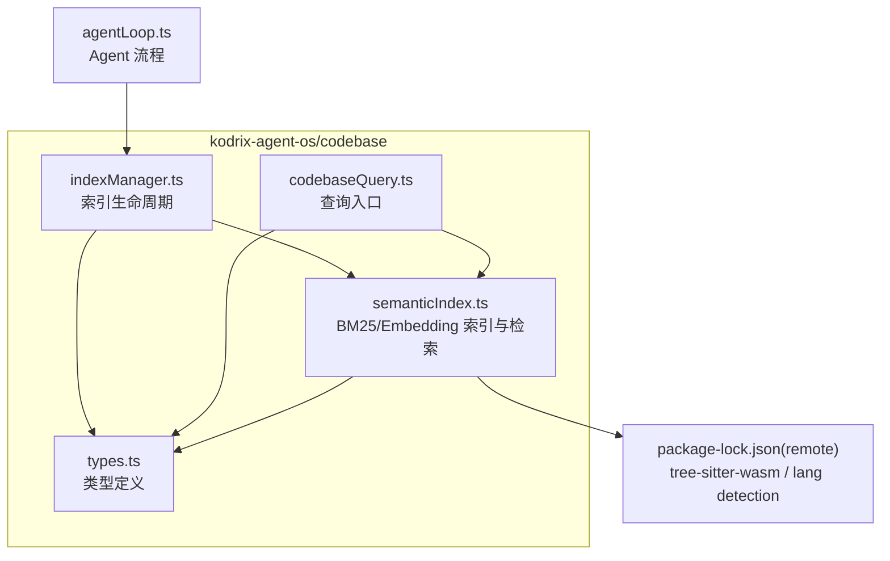
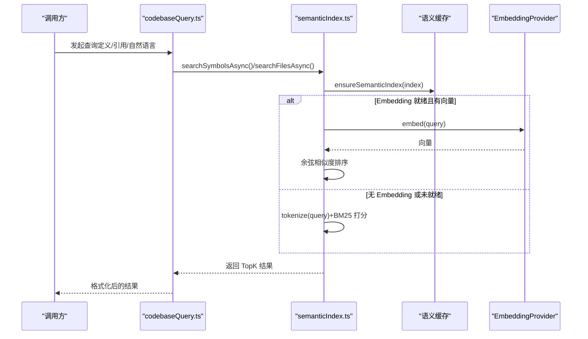
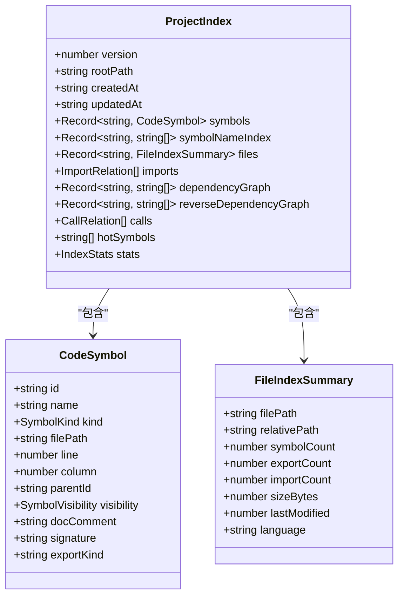
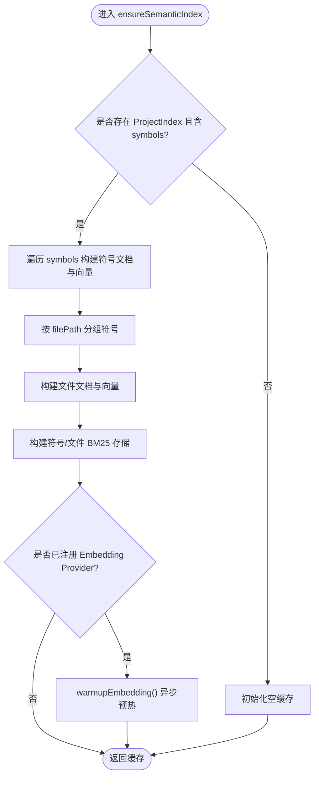
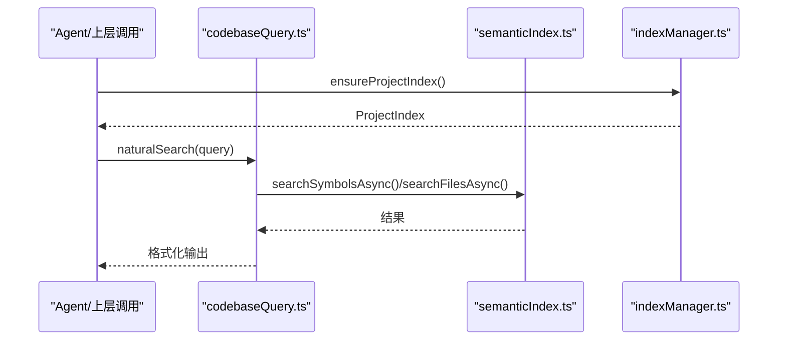
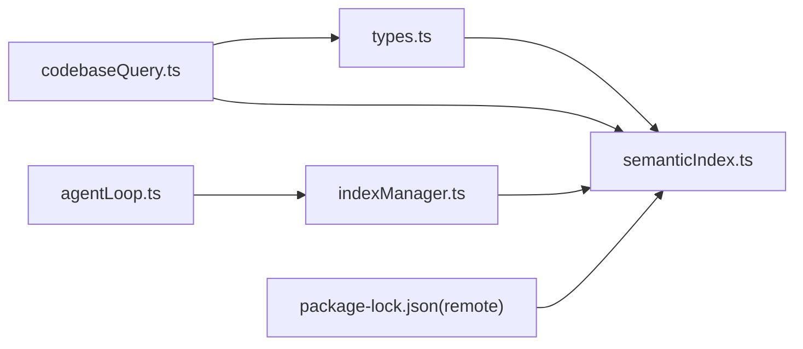

# 语义索引构建

<cite>
**本文引用的文件**   
- [semanticIndex.ts](file://extensions/kodrix-agent-os/src/codebase/semanticIndex.ts)
- [types.ts](file://extensions/kodrix-agent-os/src/codebase/types.ts)
- [codebaseQuery.ts](file://extensions/kodrix-agent-os/src/codebase/codebaseQuery.ts)
- [indexManager.ts](file://extensions/kodrix-agent-os/src/codebase/indexManager.ts)
- [agentLoop.ts](file://extensions/kodrix-agent-os/src/agent/agentLoop.ts)
- [package-lock.json（remote）](file://remote/package-lock.json)
</cite>

## 目录
1. [引言](#引言)
2. [项目结构](#项目结构)
3. [核心组件](#核心组件)
4. [架构总览](#架构总览)
5. [详细组件分析](#详细组件分析)
6. [依赖关系分析](#依赖关系分析)
7. [性能与优化](#性能与优化)
8. [多语言支持](#多语言支持)
9. [增量更新与变更检测](#增量更新与变更检测)
10. [故障排除指南](#故障排除指南)
11. [结论](#结论)

## 引言
本文件系统性阐述 Kodrix 的“语义索引”子系统，覆盖从文件扫描、AST 解析、符号提取、依赖分析到检索与可视化的全链路。重点包括：
- 索引数据结构设计：CodeSymbol、ProjectIndex、FileIndexSummary 等
- 语义检索策略：BM25 默认 + Embedding 可插拔向量检索
- 增量更新机制与变更检测思路
- 多语言支持与解析器集成
- 并行处理、缓存与内存管理优化
- 维护最佳实践与常见问题排查

## 项目结构
语义索引相关代码位于扩展 kodrix-agent-os 的 codebase 子模块中，核心文件如下：
- types.ts：定义索引类型（符号、文件摘要、项目索引、统计信息等）
- semanticIndex.ts：实现 BM25 索引、Embedding Provider 注册与预热、语义文档构建、同步/异步检索
- codebaseQuery.ts：基于 ProjectIndex 的代码查询入口（定义、引用、调用者、结构、自然语言）
- indexManager.ts：索引生命周期管理（创建、删除、确保存在）
- agentLoop.ts：Agent 流程中按需获取/构建索引
- remote/package-lock.json：包含 tree-sitter-wasm、vscode-languagedetection 等依赖，支撑多语言 AST 解析与语言识别

图表来源
- [semanticIndex.ts:1-395](file://extensions/kodrix-agent-os/src/codebase/semanticIndex.ts#L1-L395)
- [types.ts:1-209](file://extensions/kodrix-agent-os/src/codebase/types.ts#L1-L209)
- [codebaseQuery.ts:1-482](file://extensions/kodrix-agent-os/src/codebase/codebaseQuery.ts#L1-L482)
- [indexManager.ts:1-120](file://extensions/kodrix-agent-os/src/codebase/indexManager.ts#L1-L120)
- [agentLoop.ts:340-360](file://extensions/kodrix-agent-os/src/agent/agentLoop.ts#L340-L360)
- [package-lock.json（remote）:744-756](file://remote/package-lock.json#L744-L756)

章节来源
- [semanticIndex.ts:1-395](file://extensions/kodrix-agent-os/src/codebase/semanticIndex.ts#L1-L395)
- [types.ts:1-209](file://extensions/kodrix-agent-os/src/codebase/types.ts#L1-L209)
- [codebaseQuery.ts:1-482](file://extensions/kodrix-agent-os/src/codebase/codebaseQuery.ts#L1-L482)
- [indexManager.ts:1-120](file://extensions/kodrix-agent-os/src/codebase/indexManager.ts#L1-L120)
- [agentLoop.ts:340-360](file://extensions/kodrix-agent-os/src/agent/agentLoop.ts#L340-L360)
- [package-lock.json（remote）:744-756](file://remote/package-lock.json#L744-L756)

## 核心组件
- 类型层（types.ts）
  - CodeSymbol：符号唯一标识、名称、种类、位置、父符号、可见性、签名、导出方式等
  - FileIndexSummary：文件路径、相对路径、符号/导出/导入计数、大小、修改时间、语言
  - ProjectIndex：版本、根路径、时间戳、符号表、符号名索引、文件索引、导入关系、依赖图、反向依赖图、调用关系、热门符号、统计信息
  - IndexStats：文件/符号/导入/调用总数、语言分布、构建耗时
  - IndexerConfig：包含扩展名、排除目录/glob、最大文件大小、是否监听增量
- 语义索引层（semanticIndex.ts）
  - BM25 存储与打分：按文档词频、平均长度、逆文档频率计算分数
  - 语义缓存：绑定 ProjectIndex 对象，避免重复构建；提供失效接口
  - Embedding Provider：可插拔外部向量模型/API，支持批量编码与预热；失败回退 BM25
  - 文档构建：buildSymbolDoc/buildFileDoc 将符号/文件聚合为文本用于 BM25 或 Embedding
  - 检索 API：searchSymbols/searchFiles（同步 BM25），searchSymbolsAsync/searchFilesAsync（优先 Embedding，否则回退 BM25）
- 查询层（codebaseQuery.ts）
  - 面向 Agent 的查询入口：definition/usage/callers/structure/natural
  - 内部使用 ProjectIndex 进行符号查找、依赖分析、结果格式化
- 索引管理层（indexManager.ts）
  - ensureProjectIndex/deleteProjectIndex 等生命周期方法
- Agent 集成（agentLoop.ts）
  - 在任务执行前按需确保索引可用

章节来源
- [types.ts:6-209](file://extensions/kodrix-agent-os/src/codebase/types.ts#L6-L209)
- [semanticIndex.ts:1-395](file://extensions/kodrix-agent-os/src/codebase/semanticIndex.ts#L1-L395)
- [codebaseQuery.ts:1-482](file://extensions/kodrix-agent-os/src/codebase/codebaseQuery.ts#L1-L482)
- [indexManager.ts:1-120](file://extensions/kodrix-agent-os/src/codebase/indexManager.ts#L1-L120)
- [agentLoop.ts:340-360](file://extensions/kodrix-agent-os/src/agent/agentLoop.ts#L340-L360)

## 架构总览
语义索引系统采用“两层检索”架构：
- 第一层：Embedding 向量检索（可选，需注册 EmbeddingProvider）
- 第二层：BM25 文本检索（默认，零外部依赖）

图表来源
- [semanticIndex.ts:270-382](file://extensions/kodrix-agent-os/src/codebase/semanticIndex.ts#L270-L382)
- [codebaseQuery.ts:1-482](file://extensions/kodrix-agent-os/src/codebase/codebaseQuery.ts#L1-L482)

## 详细组件分析

### 类型与数据模型（types.ts）
- CodeSymbol
  - 关键字段：id、name、kind、filePath、line/column、parentId、visibility、docComment、signature、exportKind
  - 用途：统一表示各语言的符号实体，供索引、检索、可视化使用
- FileIndexSummary
  - 关键字段：filePath、relativePath、symbolCount/exportCount/importCount、sizeBytes、lastModified、language
  - 用途：文件级元数据，辅助增量更新与统计
- ProjectIndex
  - 关键字段：version/rootPath/createdAt/updatedAt、symbols/symbolNameIndex/files、imports/dependencyGraph/reverseDependencyGraph、calls/hotSymbols/stats
  - 用途：工程级索引的核心载体，承载符号、依赖、调用、热度与统计
- IndexStats/IndexerConfig
  - 用途：统计构建指标与配置过滤规则

图表来源
- [types.ts:6-142](file://extensions/kodrix-agent-os/src/codebase/types.ts#L6-L142)

章节来源
- [types.ts:6-142](file://extensions/kodrix-agent-os/src/codebase/types.ts#L6-L142)

### 语义索引与检索（semanticIndex.ts）
- BM25 构建与打分
  - buildBm25：对文档集合分词、统计词频、文档长度、平均长度、逆文档频率
  - bm25Score：标准 BM25 公式计算查询与文档的相关度
- 语义缓存
  - ensureSemanticIndex：按 ProjectIndex 构建符号/文件向量与 BM25 索引；绑定 index 对象，重建自动失效
  - invalidateSemanticIndex：主动失效缓存
- Embedding Provider
  - registerEmbeddingProvider/clearEmbeddingProvider/getEmbeddingProvider：注册/清除/获取外部向量提供方
  - warmupEmbedding：异步预热符号/文件向量；支持批量 embedBatch；失败时 ready=true 并回退 BM25
- 文档构建
  - buildSymbolDoc：name+kind+parentName+signature+docComment
  - buildFileDoc：relativePath+聚合符号名+部分 docComment
- 检索 API
  - searchSymbols/searchFiles：同步 BM25
  - searchSymbolsAsync/searchFilesAsync：优先 Embedding 余弦相似度，否则回退 BM25

图表来源
- [semanticIndex.ts:94-137](file://extensions/kodrix-agent-os/src/codebase/semanticIndex.ts#L94-L137)
- [semanticIndex.ts:183-235](file://extensions/kodrix-agent-os/src/codebase/semanticIndex.ts#L183-L235)

章节来源
- [semanticIndex.ts:30-80](file://extensions/kodrix-agent-os/src/codebase/semanticIndex.ts#L30-L80)
- [semanticIndex.ts:94-137](file://extensions/kodrix-agent-os/src/codebase/semanticIndex.ts#L94-L137)
- [semanticIndex.ts:146-235](file://extensions/kodrix-agent-os/src/codebase/semanticIndex.ts#L146-L235)
- [semanticIndex.ts:239-261](file://extensions/kodrix-agent-os/src/codebase/semanticIndex.ts#L239-L261)
- [semanticIndex.ts:270-382](file://extensions/kodrix-agent-os/src/codebase/semanticIndex.ts#L270-L382)

### 查询入口（codebaseQuery.ts）
- 提供 definition/usage/callers/structure/natural 等查询模式
- 内部通过 ProjectIndex 进行符号查找、依赖分析与结果格式化
- 与索引管理器协作，确保索引可用

图表来源
- [codebaseQuery.ts:1-482](file://extensions/kodrix-agent-os/src/codebase/codebaseQuery.ts#L1-L482)
- [indexManager.ts:1-120](file://extensions/kodrix-agent-os/src/codebase/indexManager.ts#L1-L120)

章节来源
- [codebaseQuery.ts:1-482](file://extensions/kodrix-agent-os/src/codebase/codebaseQuery.ts#L1-L482)

### 索引生命周期（indexManager.ts 与 agentLoop.ts）
- indexManager.ts：提供 ensureProjectIndex/deleteProjectIndex 等方法，负责索引的创建与清理
- agentLoop.ts：在 Agent 任务执行前动态获取或构建索引，保证后续查询可用

章节来源
- [indexManager.ts:1-120](file://extensions/kodrix-agent-os/src/codebase/indexManager.ts#L1-L120)
- [agentLoop.ts:340-360](file://extensions/kodrix-agent-os/src/agent/agentLoop.ts#L340-L360)

## 依赖关系分析
- 语义索引与类型解耦：semanticIndex.ts 仅依赖 types.ts 中的数据结构
- 查询层依赖索引层：codebaseQuery.ts 通过 ProjectIndex 与 semanticIndex.ts 提供的检索 API 工作
- 索引生命周期由 indexManager.ts 管理，并在 agentLoop.ts 中被消费
- 多语言解析依赖 remote/package-lock.json 中的 tree-sitter-wasm 与 vscode-languagedetection

图表来源
- [semanticIndex.ts:1-395](file://extensions/kodrix-agent-os/src/codebase/semanticIndex.ts#L1-L395)
- [types.ts:1-209](file://extensions/kodrix-agent-os/src/codebase/types.ts#L1-L209)
- [codebaseQuery.ts:1-482](file://extensions/kodrix-agent-os/src/codebase/codebaseQuery.ts#L1-L482)
- [indexManager.ts:1-120](file://extensions/kodrix-agent-os/src/codebase/indexManager.ts#L1-L120)
- [agentLoop.ts:340-360](file://extensions/kodrix-agent-os/src/agent/agentLoop.ts#L340-L360)
- [package-lock.json（remote）:744-756](file://remote/package-lock.json#L744-L756)

章节来源
- [semanticIndex.ts:1-395](file://extensions/kodrix-agent-os/src/codebase/semanticIndex.ts#L1-L395)
- [types.ts:1-209](file://extensions/kodrix-agent-os/src/codebase/types.ts#L1-L209)
- [codebaseQuery.ts:1-482](file://extensions/kodrix-agent-os/src/codebase/codebaseQuery.ts#L1-L482)
- [indexManager.ts:1-120](file://extensions/kodrix-agent-os/src/codebase/indexManager.ts#L1-L120)
- [agentLoop.ts:340-360](file://extensions/kodrix-agent-os/src/agent/agentLoop.ts#L340-L360)
- [package-lock.json（remote）:744-756](file://remote/package-lock.json#L744-L756)

## 性能与优化
- 并行处理
  - 建议：文件扫描与 AST 解析阶段使用 worker 池或并发队列，限制并发度以避免 IO/CPU 抖动
  - 当前语义索引构建在内存中进行，适合批处理；Embedding 预热支持批量 embedBatch 减少网络往返
- 缓存机制
  - 语义缓存：ensureSemanticIndex 绑定 ProjectIndex 对象，避免重复构建；invalidateSemanticIndex 支持主动失效
  - BM25 与向量缓存分离，便于独立失效与扩容
- 内存管理
  - 控制文件级符号聚合数量（如限制每个文件聚合符号数），避免噪声与过大文档
  - 大文件跳过（IndexerConfig.maxFileSize）
- 检索优化
  - 优先 Embedding 余弦相似度，失败快速回退 BM25
  - 对查询进行分词与去噪，减少无效计算

章节来源
- [semanticIndex.ts:94-137](file://extensions/kodrix-agent-os/src/codebase/semanticIndex.ts#L94-L137)
- [semanticIndex.ts:183-235](file://extensions/kodrix-agent-os/src/codebase/semanticIndex.ts#L183-L235)
- [semanticIndex.ts:251-261](file://extensions/kodrix-agent-os/src/codebase/semanticIndex.ts#L251-L261)
- [semanticIndex.ts:270-382](file://extensions/kodrix-agent-os/src/codebase/semanticIndex.ts#L270-L382)
- [types.ts:196-209](file://extensions/kodrix-agent-os/src/codebase/types.ts#L196-L209)

## 多语言支持
- 解析器依赖
  - tree-sitter-wasm：跨平台 WebAssembly 语法树解析器，支持 TS/JS/Python/Rust/Go 等多语言
  - vscode-languagedetection：语言检测工具，辅助根据内容推断语言
- 解析流程
  - 文件扫描 → 语言检测 → 选择对应 parser → 生成 AST → 提取符号与依赖 → 写入 ProjectIndex
- 可扩展性
  - 新增语言只需注册对应的 tree-sitter 语法与符号提取逻辑，复用统一的 CodeSymbol 与 ProjectIndex 结构

章节来源
- [package-lock.json（remote）:744-756](file://remote/package-lock.json#L744-L756)
- [types.ts:6-142](file://extensions/kodrix-agent-os/src/codebase/types.ts#L6-L142)

## 增量更新与变更检测
- 触发条件
  - 文件新增/修改/删除、索引配置变化（includeExtensions/excludeDirs/excludeGlobs/maxFileSize/watch）
- 变更检测算法
  - 基于 FileIndexSummary.lastModified 与 sizeBytes 判断文件是否变化
  - 对比旧 ProjectIndex 的 files 映射，仅重算受影响文件的符号与依赖
- 增量构建步骤
  - 读取变更集 → 重新解析 AST → 更新符号表与依赖图 → 刷新 BM25/向量缓存（局部失效）→ 更新 stats
- 一致性保障
  - 索引重建后自动失效语义缓存（_cacheIndex 校验）
  - Embedding 预热失败时降级 BM25，保证可用性

章节来源
- [semanticIndex.ts:94-137](file://extensions/kodrix-agent-os/src/codebase/semanticIndex.ts#L94-L137)
- [types.ts:92-142](file://extensions/kodrix-agent-os/src/codebase/types.ts#L92-L142)
- [types.ts:196-209](file://extensions/kodrix-agent-os/src/codebase/types.ts#L196-L209)

## 故障排除指南
- 症状：检索结果为空或延迟高
  - 检查是否已注册 EmbeddingProvider 且预热完成；若未就绪，系统将回退 BM25
  - 确认 ensureSemanticIndex 已被调用且 _cacheIndex 与当前 ProjectIndex 一致
- 症状：索引未更新
  - 检查 IndexerConfig.watch 是否开启；确认 lastModified/sizeBytes 是否正确记录
  - 调用 invalidateSemanticIndex 强制失效缓存后重试
- 症状：内存占用过高
  - 调整 maxFileSize 与聚合符号上限；减少文件级文档噪声
  - 关闭不必要的 EmbeddingProvider 或降低维度
- 症状：多语言解析异常
  - 确认 tree-sitter-wasm 与 vscode-languagedetection 依赖可用
  - 检查文件扩展名是否在 includeExtensions 中

章节来源
- [semanticIndex.ts:94-137](file://extensions/kodrix-agent-os/src/codebase/semanticIndex.ts#L94-L137)
- [semanticIndex.ts:183-235](file://extensions/kodrix-agent-os/src/codebase/semanticIndex.ts#L183-L235)
- [types.ts:196-209](file://extensions/kodrix-agent-os/src/codebase/types.ts#L196-L209)
- [package-lock.json（remote）:744-756](file://remote/package-lock.json#L744-L756)

## 结论
该语义索引子系统以 ProjectIndex 为核心，结合 BM25 与可插拔 Embedding 检索，提供了高性能、可扩展、多语言支持的代码理解能力。通过类型化设计、缓存与增量更新机制，系统在大规模仓库中仍能保持毫秒级响应与稳定可用性。未来可在以下方面持续演进：
- 引入更强大的本地/云端 Embedding 模型，提升语义检索精度
- 完善增量更新的细粒度失效策略与并发调度
- 增强多语言 AST 解析覆盖率与符号提取质量
- 提供更丰富的可视化与诊断工具，辅助索引维护与问题定位