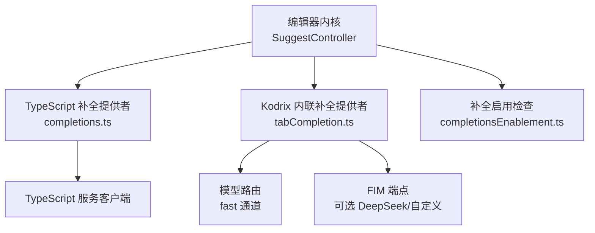
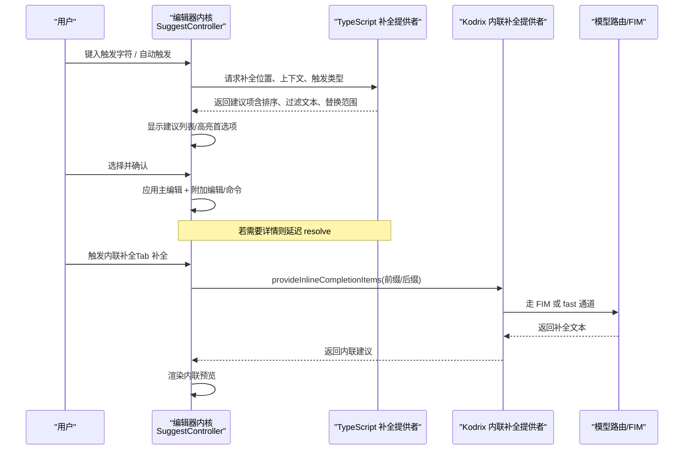
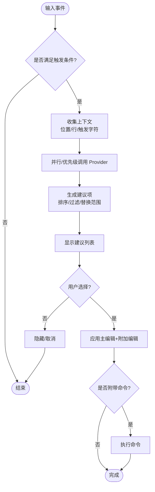
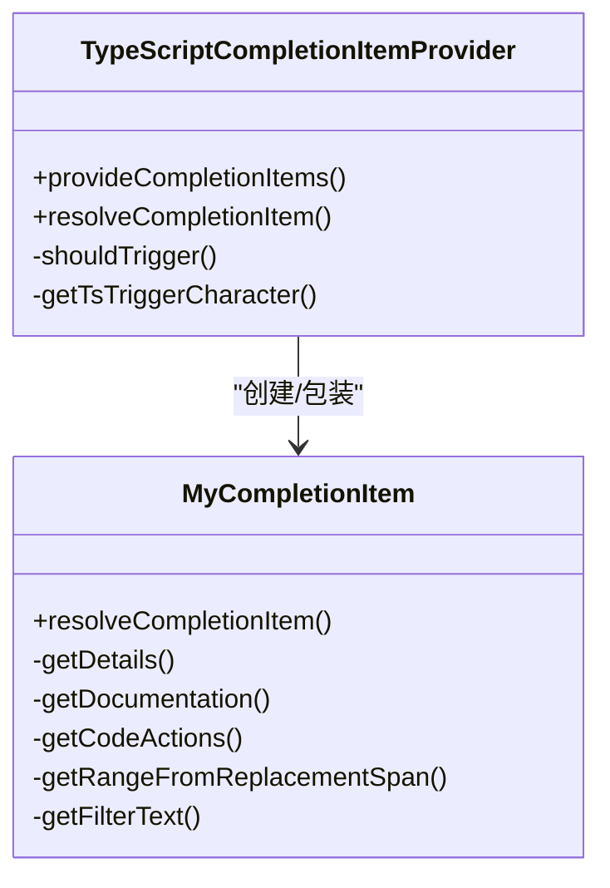
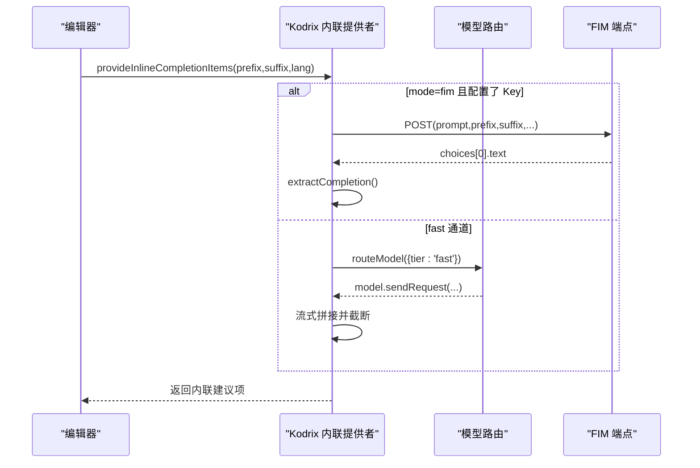
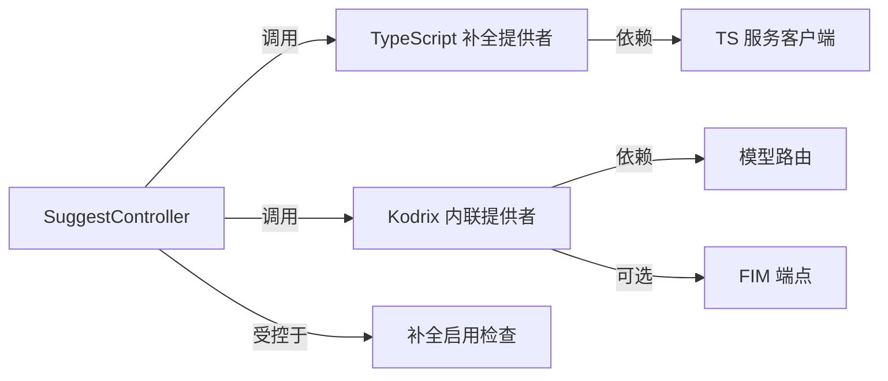

# 预测性补全

<cite>
**本文引用的文件**
- [completionsEnablement.ts](file://src/vs/editor/common/services/completionsEnablement.ts)
- [completions.ts](file://extensions/typescript-language-features/src/languageFeatures/completions.ts)
- [suggestController.ts](file://src/vs/editor/contrib/suggest/browser/suggestController.ts)
- [tabCompletion.ts](file://extensions/kodrix-agent-os/src/completion/tabCompletion.ts)
</cite>

## 目录
1. [简介](#简介)
2. [项目结构](#项目结构)
3. [核心组件](#核心组件)
4. [架构总览](#架构总览)
5. [详细组件分析](#详细组件分析)
6. [依赖关系分析](#依赖关系分析)
7. [性能考量](#性能考量)
8. [故障排查指南](#故障排查指南)
9. [结论](#结论)
10. [附录](#附录)

## 简介
本文件围绕“预测性补全”能力，系统梳理代码补全的触发机制、上下文分析、受影响调用点查找、编辑建议生成策略、编辑器集成方式与性能优化。内容基于仓库中现有实现进行归纳：包括编辑器内置建议控制器、TypeScript 语言特性提供的智能补全、以及 Kodrix 自研的 Tab 补全（内联补全）通道。文档同时给出扩展开发指南与自定义规则配置方法，帮助读者在既有基础上扩展或定制补全行为。

## 项目结构
本次文档聚焦以下关键模块：
- 编辑器建议控制器：负责触发、展示、插入建议项，管理状态与交互。
- TypeScript 语言特性：提供基于 TS/JS 的智能补全（符号、导入、函数调用等）。
- Kodrix Tab 补全：提供内联补全（Inline Completion），支持 FIM 与 fast 双通道。
- 补全启用开关：按语言/资源维度控制是否启用外部补全（如 Copilot）。

图表来源
- [suggestController.ts:114-236](file://src/vs/editor/contrib/suggest/browser/suggestController.ts#L114-L236)
- [completions.ts:682-827](file://extensions/typescript-language-features/src/languageFeatures/completions.ts#L682-L827)
- [tabCompletion.ts:189-231](file://extensions/kodrix-agent-os/src/completion/tabCompletion.ts#L189-L231)
- [completionsEnablement.ts:27-78](file://src/vs/editor/common/services/completionsEnablement.ts#L27-L78)

章节来源
- [suggestController.ts:114-236](file://src/vs/editor/contrib/suggest/browser/suggestController.ts#L114-L236)
- [completions.ts:682-827](file://extensions/typescript-language-features/src/languageFeatures/completions.ts#L682-L827)
- [tabCompletion.ts:189-231](file://extensions/kodrix-agent-os/src/completion/tabCompletion.ts#L189-L231)
- [completionsEnablement.ts:27-78](file://src/vs/editor/common/services/completionsEnablement.ts#L27-L78)

## 核心组件
- 编辑器建议控制器（SuggestController）
  - 职责：监听输入事件、触发建议、维护建议列表与选中项、处理提交字符、执行插入与命令、统计遥测。
  - 关键点：自动/手动触发、选择模式、撤销栈边界、异步附加编辑应用、可插拔预选择器。
- TypeScript 补全提供者（completions.ts）
  - 职责：将 TS 服务的 completionInfo 转换为编辑器 CompletionItem；处理成员访问、替换范围、过滤文本、函数调用补全、导入语句补全、代码动作合并。
  - 关键点：触发字符映射、isMemberCompletion/isNewIdentifierLocation、completeFunctionCalls、autoImportSuggestions。
- Kodrix Tab 补全（tabCompletion.ts）
  - 职责：注册 InlineCompletionItemProvider；构建前缀/后缀上下文；通过 FIM 或 fast 通道生成补全文本；记录接受/拒绝统计。
  - 关键点：默认关闭、mode=fim/fast、超时与取消、流式响应截断、纯函数 prompt 构建与结果提取。
- 补全启用检查（completionsEnablement.ts）
  - 职责：根据产品配置与资源级配置判断某语言是否启用外部补全（如 Copilot）。
  - 关键点：全局与语言级覆盖、默认禁用兜底。

章节来源
- [suggestController.ts:114-236](file://src/vs/editor/contrib/suggest/browser/suggestController.ts#L114-L236)
- [completions.ts:682-827](file://extensions/typescript-language-features/src/languageFeatures/completions.ts#L682-L827)
- [tabCompletion.ts:1-231](file://extensions/kodrix-agent-os/src/completion/tabCompletion.ts#L1-L231)
- [completionsEnablement.ts:27-78](file://src/vs/editor/common/services/completionsEnablement.ts#L27-L78)

## 架构总览
下图展示了从用户输入到补全结果展示的端到端流程，涵盖编辑器内核、TS 语言服务与 Kodrix 内联补全通道。

图表来源
- [suggestController.ts:233-276](file://src/vs/editor/contrib/suggest/browser/suggestController.ts#L233-L276)
- [completions.ts:700-827](file://extensions/typescript-language-features/src/languageFeatures/completions.ts#L700-L827)
- [tabCompletion.ts:189-231](file://extensions/kodrix-agent-os/src/completion/tabCompletion.ts#L189-L231)

## 详细组件分析

### 编辑器建议控制器（SuggestController）
- 触发机制
  - 支持自动触发与显式触发；根据触发类型与配置决定焦点与选择模式。
  - 使用 LineSuffix 跟踪光标右侧变化，保证插入时偏移计算正确。
- 上下文分析与作用域
  - 通过 CompletionItemProvider 传入的上下文（触发字符、位置、文档）决定补全范围与过滤文本。
  - 支持“替代建议”与“记忆选择”，结合 ISuggestItemPreselector 提升命中质量。
- 插入与命令
  - 先应用同步附加编辑，再插入主文本；必要时触发命令（如重新触发建议）。
  - 对异步附加编辑采用监听与取消策略，避免与后续输入冲突。
- 状态管理与交互
  - 管理 widget 显示/隐藏、滚动保持、撤销边界、Aria 提示。
  - 遥测上报接受项的索引、解析耗时、命令耗时等指标。

图表来源
- [suggestController.ts:233-276](file://src/vs/editor/contrib/suggest/browser/suggestController.ts#L233-L276)
- [suggestController.ts:308-509](file://src/vs/editor/contrib/suggest/browser/suggestController.ts#L308-L509)

章节来源
- [suggestController.ts:114-236](file://src/vs/editor/contrib/suggest/browser/suggestController.ts#L114-L236)
- [suggestController.ts:308-509](file://src/vs/editor/contrib/suggest/browser/suggestController.ts#L308-L509)

### TypeScript 语言特性补全（completions.ts）
- 触发与上下文
  - 触发字符包含 . " ' ` / @ < # 空格等；根据 API 版本决定是否允许空格触发导入补全。
  - 识别 isNewIdentifierLocation 与 isMemberCompletion，用于调整过滤文本与替换范围。
- 作用域与导入关系
  - 支持 includeExternalModuleExports（自动导入）、importStatementSuggestions（import 语句补全）。
  - 对包引入与 import 语句场景进行标记，便于统计与差异化处理。
- 受影响调用点查找算法（概念说明）
  - 当前实现通过 TS 服务返回的 entries 与 metadata 反映可用符号与上下文；具体 AST 遍历与调用链追踪由 TS 服务端完成。
  - 本地侧负责将 TS 协议项转换为编辑器 CompletionItem，并处理替换范围、过滤文本、函数调用补全等。
- 编辑建议生成策略
  - 排序：sortText、sourceDisplay、hasAction 影响优先级。
  - 过滤：filterText 针对 this.#、this.、括号访问器等特殊场景优化。
  - 函数调用：completeFunctionCalls 控制是否生成带参数的 snippet，并在合适时机触发参数提示。
  - 代码动作：合并当前文件的额外编辑，跨文件编辑转为命令。

图表来源
- [completions.ts:682-827](file://extensions/typescript-language-features/src/languageFeatures/completions.ts#L682-L827)
- [completions.ts:51-536](file://extensions/typescript-language-features/src/languageFeatures/completions.ts#L51-L536)

章节来源
- [completions.ts:682-827](file://extensions/typescript-language-features/src/languageFeatures/completions.ts#L682-L827)
- [completions.ts:51-536](file://extensions/typescript-language-features/src/languageFeatures/completions.ts#L51-L536)

### Kodrix Tab 补全（tabCompletion.ts）
- 触发与上下文
  - 默认关闭，需开启配置；提供 InlineCompletionItemProvider。
  - 构造 prefix/suffix 作为上下文，语言 id 用于风格一致。
- 双通道策略
  - mode=fim：优先尝试 FIM 端点（DeepSeek 或自定义 OpenAI 兼容），失败降级 fast。
  - mode=fast：走模型路由 fast 档，流式读取并截断长度。
- 生成与提取
  - buildCompletionPrompt/buildFimPrompt 为纯函数，便于测试与复用。
  - extractCompletion 从 LLM 输出中提取首个代码块，去除多余空白与换行。
- 编辑器集成
  - 返回内联建议项，附带接受命令；记录建议/接受统计。

图表来源
- [tabCompletion.ts:50-82](file://extensions/kodrix-agent-os/src/completion/tabCompletion.ts#L50-L82)
- [tabCompletion.ts:84-187](file://extensions/kodrix-agent-os/src/completion/tabCompletion.ts#L84-L187)
- [tabCompletion.ts:189-231](file://extensions/kodrix-agent-os/src/completion/tabCompletion.ts#L189-L231)

章节来源
- [tabCompletion.ts:1-231](file://extensions/kodrix-agent-os/src/completion/tabCompletion.ts#L1-L231)

### 补全启用检查（completionsEnablement.ts）
- 按语言/资源维度启用外部补全（如 Copilot）。
- 支持全局与语言级覆盖；未配置时默认禁用。

章节来源
- [completionsEnablement.ts:27-78](file://src/vs/editor/common/services/completionsEnablement.ts#L27-L78)

## 依赖关系分析
- SuggestController 依赖多个内部服务（命令、上下文键、遥测、日志、内存服务等），并通过 CompletionItemProvider 接口与语言特性扩展解耦。
- TypeScript 补全提供者依赖 TS 服务客户端，将 TS 协议项转换为编辑器 CompletionItem。
- Kodrix Tab 补全依赖模型路由与可选 FIM 端点，具备降级路径。
- 补全启用检查依赖产品配置与服务，统一对外部补全的启停策略。

图表来源
- [suggestController.ts:114-236](file://src/vs/editor/contrib/suggest/browser/suggestController.ts#L114-L236)
- [completions.ts:682-827](file://extensions/typescript-language-features/src/languageFeatures/completions.ts#L682-L827)
- [tabCompletion.ts:189-231](file://extensions/kodrix-agent-os/src/completion/tabCompletion.ts#L189-L231)
- [completionsEnablement.ts:27-78](file://src/vs/editor/common/services/completionsEnablement.ts#L27-L78)

章节来源
- [suggestController.ts:114-236](file://src/vs/editor/contrib/suggest/browser/suggestController.ts#L114-L236)
- [completions.ts:682-827](file://extensions/typescript-language-features/src/languageFeatures/completions.ts#L682-L827)
- [tabCompletion.ts:189-231](file://extensions/kodrix-agent-os/src/completion/tabCompletion.ts#L189-L231)
- [completionsEnablement.ts:27-78](file://src/vs/editor/common/services/completionsEnablement.ts#L27-L78)

## 性能考量
- 异步与取消
  - 编辑器建议在获取详情时支持取消令牌，避免重复请求与浪费。
  - Tab 补全使用 AbortController 与超时，防止长尾请求阻塞。
- 结果缓存与增量
  - TS 服务层负责增量更新与缓存（updateGraphDurationMs 等指标可见）；本地侧仅做转换与展示。
  - 建议控制器对附加编辑进行增量应用，减少重绘与滚动抖动。
- 流式与截断
  - Tab 补全 fast 通道流式读取，达到最大字符数即停止，降低网络与解析开销。
- 统计与观测
  - 编辑器与 TS 补全均上报遥测数据，便于定位瓶颈与优化体验。

章节来源
- [completions.ts:829-865](file://extensions/typescript-language-features/src/languageFeatures/completions.ts#L829-L865)
- [tabCompletion.ts:127-187](file://extensions/kodrix-agent-os/src/completion/tabCompletion.ts#L127-L187)
- [suggestController.ts:511-571](file://src/vs/editor/contrib/suggest/browser/suggestController.ts#L511-L571)

## 故障排查指南
- 补全未触发
  - 检查编辑器建议是否启用、语言级补全是否被禁用。
  - 对于外部补全（如 Copilot），确认启用设置与资源级配置。
- 补全项不准确
  - 检查触发字符与上下文（isNewIdentifierLocation、isMemberCompletion）。
  - 查看 filterText 与 sortText 是否被异常覆盖。
- 内联补全不生效
  - 确认 Tab 补全已开启；检查 FIM Key/Endpoint 配置；观察降级到 fast 通道的日志。
- 插入后行为异常
  - 检查附加编辑与命令是否正确应用；关注撤销边界与滚动状态恢复。

章节来源
- [completionsEnablement.ts:27-78](file://src/vs/editor/common/services/completionsEnablement.ts#L27-L78)
- [completions.ts:700-827](file://extensions/typescript-language-features/src/languageFeatures/completions.ts#L700-L827)
- [tabCompletion.ts:164-231](file://extensions/kodrix-agent-os/src/completion/tabCompletion.ts#L164-L231)
- [suggestController.ts:308-509](file://src/vs/editor/contrib/suggest/browser/suggestController.ts#L308-L509)

## 结论
本项目在编辑器内核层面提供了健壮的补全控制器，结合 TypeScript 语言特性的智能补全与 Kodrix 自研的内联补全通道，形成了“传统建议 + 内联预测”的双轨体系。通过异步取消、流式响应、增量更新与遥测统计，整体具备良好的性能与可观测性。未来可在 AST 级影响分析、更细粒度的上下文感知与多通道融合方面继续演进。

## 附录

### 扩展开发指南
- 注册新的补全提供者
  - 实现 CompletionItemProvider 接口，注册到对应文档选择器与触发字符。
  - 在 provideCompletionItems 中根据上下文构造建议项，合理设置 range、filterText、sortText。
  - 如需详情，实现 resolveCompletionItem 以延迟加载文档与附加编辑。
- 注册内联补全提供者
  - 实现 InlineCompletionItemProvider，提供前缀/后缀上下文，调用模型路由或 FIM 端点。
  - 注意超时与取消，限制返回长度，确保用户体验流畅。
- 接入启用控制
  - 使用补全启用检查服务，按语言/资源维度控制外部补全的启停。

章节来源
- [completions.ts:929-947](file://extensions/typescript-language-features/src/languageFeatures/completions.ts#L929-L947)
- [tabCompletion.ts:189-231](file://extensions/kodrix-agent-os/src/completion/tabCompletion.ts#L189-L231)
- [completionsEnablement.ts:27-78](file://src/vs/editor/common/services/completionsEnablement.ts#L27-L78)

### 自定义补全规则配置
- 编辑器建议
  - 可通过 suggest.enabled、insertMode、selectionMode 等配置控制行为。
  - 使用 CommitCharacters 与 additionalTextEdits 增强插入体验。
- TypeScript 补全
  - completeFunctionCalls、nameSuggestions、pathSuggestions、autoImportSuggestions、importStatementSuggestions 等配置项控制补全范围与行为。
- Kodrix Tab 补全
  - 通过配置项启用/禁用、选择模式（fim/fast）、FIM 端点与模型、超时与最大结果长度等。

章节来源
- [completions.ts:653-680](file://extensions/typescript-language-features/src/languageFeatures/completions.ts#L653-L680)
- [tabCompletion.ts:164-187](file://extensions/kodrix-agent-os/src/completion/tabCompletion.ts#L164-L187)