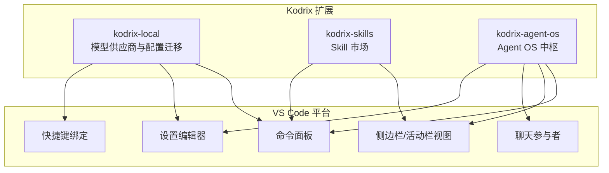
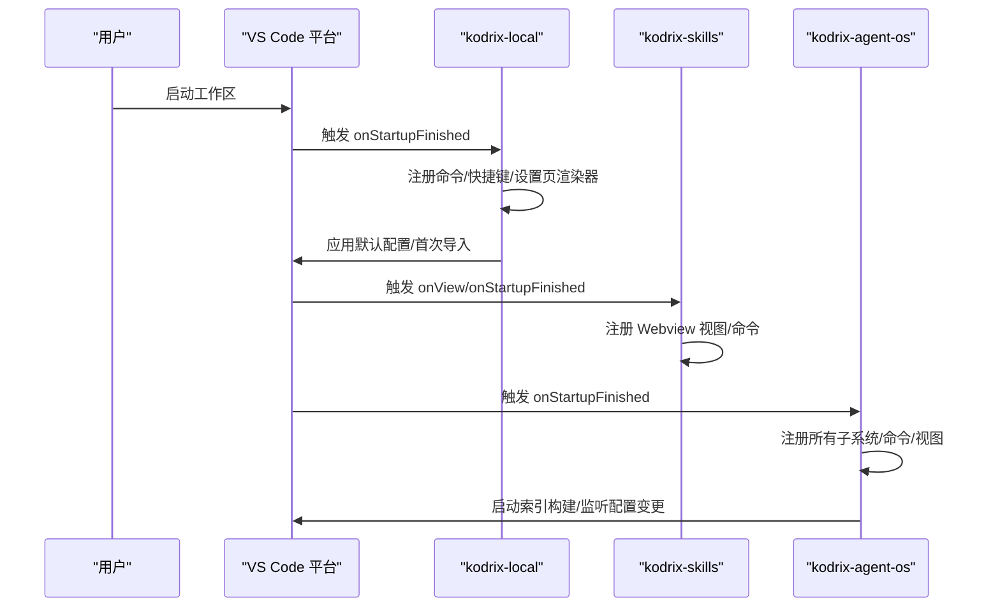
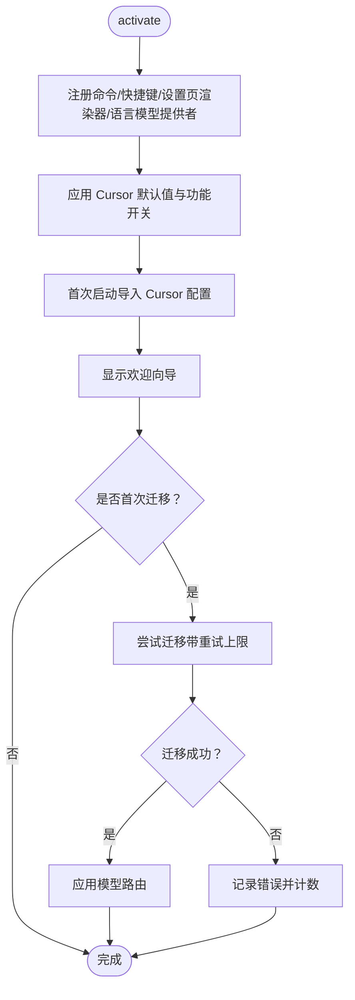
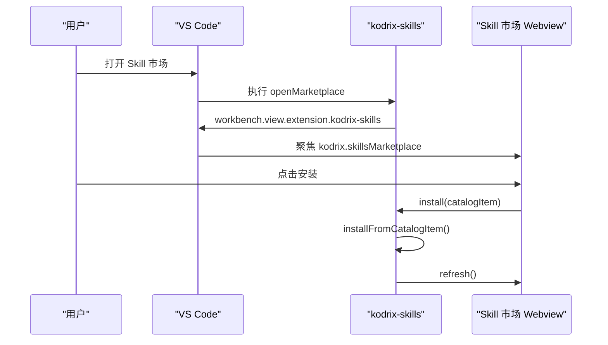
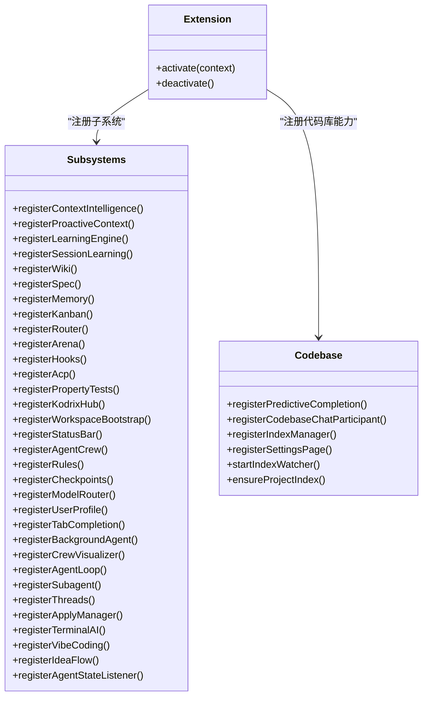
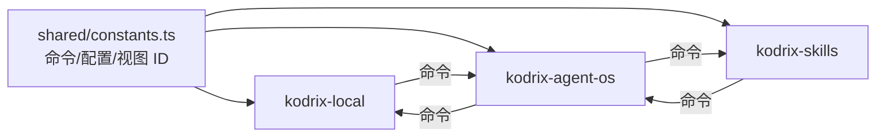

# 扩展架构设计

<cite>
**本文引用的文件**   
- [extensions/kodrix-local/package.json](file://extensions/kodrix-local/package.json)
- [extensions/kodrix-local/src/extension.ts](file://extensions/kodrix-local/src/extension.ts)
- [extensions/kodrix-skills/package.json](file://extensions/kodrix-skills/package.json)
- [extensions/kodrix-skills/src/extension.ts](file://extensions/kodrix-skills/src/extension.ts)
- [extensions/kodrix-agent-os/package.json](file://extensions/kodrix-agent-os/package.json)
- [extensions/kodrix-agent-os/src/extension.ts](file://extensions/kodrix-agent-os/src/extension.ts)
- [extensions/kodrix-agent-os/src/shared/constants.ts](file://extensions/kodrix-agent-os/src/shared/constants.ts)
</cite>

## 目录
1. [引言](#引言)
2. [项目结构](#项目结构)
3. [核心组件](#核心组件)
4. [架构总览](#架构总览)
5. [详细组件分析](#详细组件分析)
6. [依赖关系分析](#依赖关系分析)
7. [性能与可扩展性](#性能与可扩展性)
8. [调试、测试与部署](#调试测试与部署)
9. [安全与沙箱机制](#安全与沙箱机制)
10. [扩展开发者指南](#扩展开发者指南)
11. [结论](#结论)

## 引言
本文件面向扩展开发者，系统性说明 Kodrix 在 VS Code 扩展点机制上的定制实现。重点覆盖：
- 扩展生命周期管理：激活时机、命令注册、Webview 视图、设置页渲染器、聊天参与者等。
- API 暴露策略：通过 package.json contributes 暴露命令、视图、配置项、快捷键、语言模型提供者、聊天参与者等。
- 安全沙箱机制：VS Code 扩展运行于隔离进程，Kodrix 在此基础上增加路径校验、重试上限、超时控制、可回滚检查点等。
- 内置扩展组织与依赖：kodrix-local（本地模型与供应商）、kodrix-skills（Skill 市场）、kodrix-agent-os（Agent OS）。
- 扩展注册表、服务发现、消息传递：以 VS Code 命令面板、事件总线、Webview 通信为主。
- 开发、调试、测试、部署流程：基于 Gulp 编译、VS Code 调试配置、单元测试与集成测试。

## 项目结构
Kodrix 的扩展体系位于 extensions 目录下，三个核心扩展分别承担不同职责：
- kodrix-local：本地/云端模型供应商配置、Cursor 风格快捷键、一键导入、Provider Workbench 设置页。
- kodrix-skills：Skill 技能市场，支持卡片安装、搜索、GitHub/URL 安装、导入 Cursor Skills。
- kodrix-agent-os：Agent OS 中枢，整合 Wiki、Spec、Memory、Kanban、Router、Arena、Hooks、ACP、Codebase Intelligence、Idea Flow、Crew、Checkpoint、Terminal AI 等能力。

**图表来源**
- [extensions/kodrix-local/package.json:23-273](file://extensions/kodrix-local/package.json#L23-L273)
- [extensions/kodrix-skills/package.json:19-122](file://extensions/kodrix-skills/package.json#L19-L122)
- [extensions/kodrix-agent-os/package.json:23-537](file://extensions/kodrix-agent-os/package.json#L23-L537)

**章节来源**
- [extensions/kodrix-local/package.json:1-283](file://extensions/kodrix-local/package.json#L1-L283)
- [extensions/kodrix-skills/package.json:1-135](file://extensions/kodrix-skills/package.json#L1-L135)
- [extensions/kodrix-agent-os/package.json:1-800](file://extensions/kodrix-agent-os/package.json#L1-L800)

## 核心组件
- kodrix-local：负责模型供应商预设、API Key 输入、Cursor 功能默认值应用、首次启动导入、Provider Workbench 设置页、语言模型提供者注册。
- kodrix-skills：提供 Skill 市场 Webview，支持刷新、安装、卸载、从 URL/GitHub 安装、导入 Cursor Skills，并维护 agentSkillsLocations 配置。
- kodrix-agent-os：集中注册大量子系统（上下文智能、记忆、学习引擎、Wiki、Spec、Kanban、Router、Arena、Hooks、ACP、属性测试、Hub、Workspace Bootstrap、状态栏、Crew、Rules、Checkpoints、Model Router、UserProfile、Tab Completion、Background Agent、Crew Visualizer、Agent Loop、Subagent、Threads、Apply Manager、Terminal AI、Vibe Coding、Idea Flow、Agent State Bridge、Codebase Index、Embedding Provider、Index Manager、Settings Page），并提供全工程语义索引构建与统计。

**章节来源**
- [extensions/kodrix-local/src/extension.ts:84-217](file://extensions/kodrix-local/src/extension.ts#L84-L217)
- [extensions/kodrix-skills/src/extension.ts:62-155](file://extensions/kodrix-skills/src/extension.ts#L62-L155)
- [extensions/kodrix-agent-os/src/extension.ts:158-321](file://extensions/kodrix-agent-os/src/extension.ts#L158-L321)

## 架构总览
Kodrix 扩展架构遵循 VS Code 扩展点规范，并通过 package.json 声明式暴露能力；运行时由 extension.ts 统一激活与注册。

**图表来源**
- [extensions/kodrix-local/package.json:15-21](file://extensions/kodrix-local/package.json#L15-L21)
- [extensions/kodrix-skills/package.json:14-18](file://extensions/kodrix-skills/package.json#L14-L18)
- [extensions/kodrix-agent-os/package.json:15-22](file://extensions/kodrix-agent-os/package.json#L15-L22)
- [extensions/kodrix-local/src/extension.ts:94-217](file://extensions/kodrix-local/src/extension.ts#L94-L217)
- [extensions/kodrix-skills/src/extension.ts:71-155](file://extensions/kodrix-skills/src/extension.ts#L71-L155)
- [extensions/kodrix-agent-os/src/extension.ts:170-321](file://extensions/kodrix-agent-os/src/extension.ts#L170-L321)

## 详细组件分析

### kodrix-local：本地模型与供应商配置
- 激活流程：
  - 立即注册轻量命令、快捷键、设置页渲染器、语言模型提供者。
  - 异步应用 Cursor 风格默认值、首次导入、欢迎向导。
  - 首次迁移逻辑带重试上限，避免永久失败。
- 关键能力：
  - 模型供应商预设选择与 API Key 输入。
  - Provider Workbench 设置页（settingsEditorRenderer）。
  - 命令：迁移配置、浏览预设、打开 Provider Workbench、应用预设、欢迎向导、从 Cursor 导入、添加选区到聊天、行内编辑、Plan 模式、Composer、@Codebase 上下文、构建代码库索引、后台/云端继续、应用 Cursor 功能默认配置、打开 Agents 窗口等。
  - 配置项：migrateOnFirstRun、importCursorOnFirstRun、modelRoutes、features.*、providerWorkbench.panel 等。
  - 快捷键：Ctrl+L/Ctrl+I/Ctrl+K/Ctrl+Shift+L/Ctrl+Shift+A/Ctrl+Shift+Alt+A 等。

**图表来源**
- [extensions/kodrix-local/src/extension.ts:94-217](file://extensions/kodrix-local/src/extension.ts#L94-L217)

**章节来源**
- [extensions/kodrix-local/package.json:23-273](file://extensions/kodrix-local/package.json#L23-L273)
- [extensions/kodrix-local/src/extension.ts:84-217](file://extensions/kodrix-local/src/extension.ts#L84-L217)

### kodrix-skills：Skill 市场
- 激活流程：
  - 注册 Webview 视图 provider。
  - 注册命令：刷新、打开市场、安装、卸载、从 URL 安装、导入 Cursor Skills、搜索 GitHub。
  - 初始化 agentSkillsLocations 配置（~/.agents/skills 与 ~/.cursor/skills）。
- 关键能力：
  - Skill 市场 Webview（activitybar 视图容器 + webview 视图）。
  - 安装/卸载 Skill，支持 CatalogItem 与字符串 ID。
  - 从 URL/GitHub 安装 Skill，进度通知。
  - 导入 Cursor Skills，刷新市场列表。

**图表来源**
- [extensions/kodrix-skills/src/extension.ts:71-155](file://extensions/kodrix-skills/src/extension.ts#L71-L155)
- [extensions/kodrix-skills/package.json:33-103](file://extensions/kodrix-skills/package.json#L33-L103)

**章节来源**
- [extensions/kodrix-skills/package.json:1-135](file://extensions/kodrix-skills/package.json#L1-L135)
- [extensions/kodrix-skills/src/extension.ts:62-155](file://extensions/kodrix-skills/src/extension.ts#L62-L155)

### kodrix-agent-os：Agent OS 中枢
- 激活流程：
  - 立即注册所有子系统（上下文智能、记忆、学习引擎、Wiki、Spec、Kanban、Router、Arena、Hooks、ACP、属性测试、Hub、Workspace Bootstrap、状态栏、Crew、Rules、Checkpoints、Model Router、UserProfile、Tab Completion、Background Agent、Crew Visualizer、Agent Loop、Subagent、Threads、Apply Manager、Terminal AI、Vibe Coding、Idea Flow、Agent State Bridge）。
  - 注册 Codebase Intelligence（预测补全、聊天参与者、索引管理器、设置页）。
  - 后台启动项目索引构建与文件监听，支持手动重建索引与查看统计。
  - 监听配置变更（如 semanticEmbedding）动态启用/禁用 Embedding Provider。
- 关键能力：
  - 命令面板：生成 Repo Wiki、新建/打开 Spec、实施 Spec、查看 Memory、看板任务操作、智能路由、Arena 对比、安装 Hooks、注册 ACP、属性测试、Welcome、Learning 捕获/仪表盘、上下文状态/刷新、Hub 打开、重复上次路由、Crew 创建/任务/执行/状态、Vibe Coding、Idea Flow、Rules 创建/同步、代码库问答/索引/统计、终端 AI、Checkpoint 创建/列表/恢复、规则查看、模型路由状态、用户画像查看/重置、后台任务派发/列表/面板、Crew 可视化、Agent 运行/列表/续聊、计划模式、Subagent 并行派生/报告、Threads 树/重命名/搜索、后台会话视图、ACP 委派/历史、Tab 补全统计等。
  - 快捷键：Hub、Spec 工作台、智能路由、Learning、Vibe Coding、Idea Flow、代码库问答、终端 AI Prompt/Run。
  - 视图：Explorer 中 Agent Kanban。
  - 设置页：settingsEditorRenderer 自定义设置页。
  - 聊天参与者：codebase 自然语言代码问答。

**图表来源**
- [extensions/kodrix-agent-os/src/extension.ts:170-321](file://extensions/kodrix-agent-os/src/extension.ts#L170-L321)

**章节来源**
- [extensions/kodrix-agent-os/package.json:23-537](file://extensions/kodrix-agent-os/package.json#L23-L537)
- [extensions/kodrix-agent-os/src/extension.ts:158-321](file://extensions/kodrix-agent-os/src/extension.ts#L158-L321)

## 依赖关系分析
- 命令 ID 共享：kodrix-agent-os 的 shared/constants.ts 集中定义跨扩展的命令 ID（如 openProviderWorkbench、skillsOpenMarketplace 等），便于其他扩展调用。
- 配置键共享：CONFIG_SECTION、CONFIG_FEATURES、FEATURE_FLAGS、VIEW_IDS、SKILLS_DIR、CURSOR_SKILLS_DIR 等常量在多个模块间复用，确保一致性。
- 扩展间协作：
  - kodrix-local 通过命令面板打开 kodrix-agent-os 的 Hub 与 Agent OS 概览。
  - kodrix-skills 提供 Skill 市场，供用户安装后由 Agent OS 或 Local 扩展消费。
  - kodrix-agent-os 通过命令调用 Local 与 Skills 的能力（如 openProviderWorkbench、skillsOpenMarketplace）。

**图表来源**
- [extensions/kodrix-agent-os/src/shared/constants.ts:71-176](file://extensions/kodrix-agent-os/src/shared/constants.ts#L71-L176)

**章节来源**
- [extensions/kodrix-agent-os/src/shared/constants.ts:37-176](file://extensions/kodrix-agent-os/src/shared/constants.ts#L37-L176)

## 性能与可扩展性
- 延迟加载：Webview 视图按需激活（onView），减少启动开销。
- 异步非阻塞：首次导入、欢迎向导、索引构建使用异步与定时器，避免阻塞 UI。
- 重试与上限：迁移逻辑带重试上限，防止无限重试。
- 配置监听：动态启用/禁用 Embedding Provider，避免不必要的资源占用。
- 索引增量：支持自动索引新文件夹与手动重建索引，提供统计信息。

[本节为通用指导，不直接分析具体文件]

## 调试、测试与部署
- 编译与监听：
  - kodrix-local：`gulp compile-extension:kodrix-local`、`gulp watch-extension:kodrix-local`
  - kodrix-skills：`gulp compile-extension:kodrix-skills`、`gulp watch-extension:kodrix-skills`
- 调试：
  - 使用 VS Code 调试配置（通常位于 .vscode/launch.json，未在提供的结构中展示），按扩展入口文件（out/extension）进行断点调试。
- 测试：
  - 各扩展包含 test 目录，可使用 VS Code Test Explorer 或命令行运行单元测试与集成测试。
- 部署：
  - 打包为 VSIX 后发布至 VS Code Marketplace 或通过企业私有源分发。
  - 注意 package.json 中的 engines.vscode 版本要求与 enabledApiProposals。

**章节来源**
- [extensions/kodrix-local/package.json:275-281](file://extensions/kodrix-local/package.json#L275-L281)
- [extensions/kodrix-skills/package.json:124-133](file://extensions/kodrix-skills/package.json#L124-L133)

## 安全与沙箱机制
- VS Code 扩展运行于隔离进程，限制对系统资源的直接访问。
- Kodrix 增强安全：
  - 路径穿越防护（Checkpoint 回滚）。
  - 重试上限（迁移逻辑）。
  - 超时控制（Agent Loop、Idea Flow、Terminal AI 等）。
  - 可回滚检查点（Checkpoint 快照与恢复）。
  - 配置项开关（如 allowCommands、autoIndexNewFolders、semanticEmbedding.enabled）用于控制敏感能力。

**章节来源**
- [extensions/kodrix-agent-os/src/shared/constants.ts:332-390](file://extensions/kodrix-agent-os/src/shared/constants.ts#L332-L390)
- [extensions/kodrix-agent-os/src/extension.ts:224-306](file://extensions/kodrix-agent-os/src/extension.ts#L224-L306)

## 扩展开发者指南
- 开发步骤：
  1. 在 extensions 目录下创建新扩展文件夹，编写 package.json 声明 contributes（commands、views、configuration、keybindings、settingsEditorRenderers、chatParticipants 等）。
  2. 实现 extension.ts 入口，注册命令、视图、事件监听，处理激活逻辑。
  3. 使用 Gulp 任务编译与监听（参考现有扩展 scripts）。
  4. 编写单元测试与集成测试，放在 test 目录。
  5. 调试：配置 VS Code 调试器，断点调试 extension.ts。
  6. 部署：打包为 VSIX，发布至 Marketplace 或企业内部源。
- 最佳实践：
  - 使用 shared/constants.ts 集中管理命令 ID、配置键、视图 ID，避免魔术字符串。
  - 异步操作使用 withProgress 显示进度，提升用户体验。
  - 配置变更监听，动态启用/禁用功能，避免资源浪费。
  - 错误处理：捕获异常并显示用户可见的错误信息，记录日志。
  - 安全：对用户输入进行校验，限制路径访问，设置超时与重试上限。

**章节来源**
- [extensions/kodrix-agent-os/src/shared/constants.ts:71-176](file://extensions/kodrix-agent-os/src/shared/constants.ts#L71-L176)
- [extensions/kodrix-skills/src/extension.ts:99-134](file://extensions/kodrix-skills/src/extension.ts#L99-L134)
- [extensions/kodrix-local/src/extension.ts:181-217](file://extensions/kodrix-local/src/extension.ts#L181-L217)

## 结论
Kodrix 的扩展架构以 VS Code 扩展点为基础，通过 kodrix-local、kodrix-skills、kodrix-agent-os 三个核心扩展协同工作，实现了模型供应商管理、Skill 市场、Agent OS 中枢等能力。扩展生命周期管理清晰，API 暴露策略规范，安全沙箱机制完善。开发者可基于现有模式快速开发自定义扩展，增强编辑器功能。