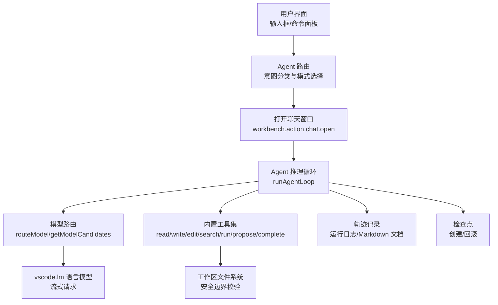
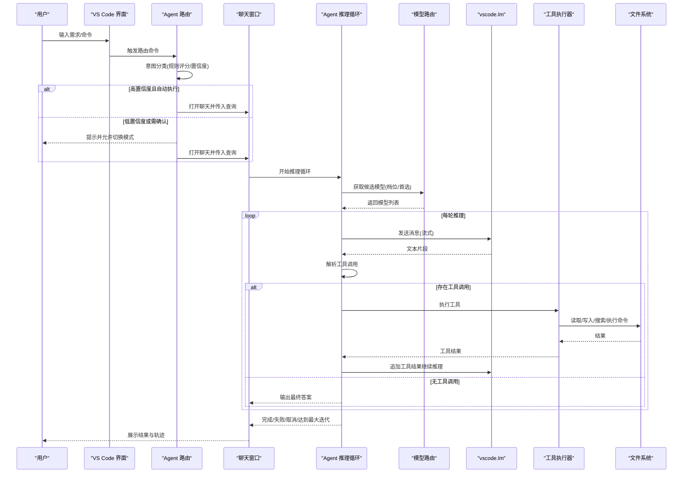
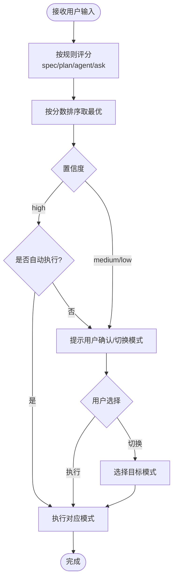
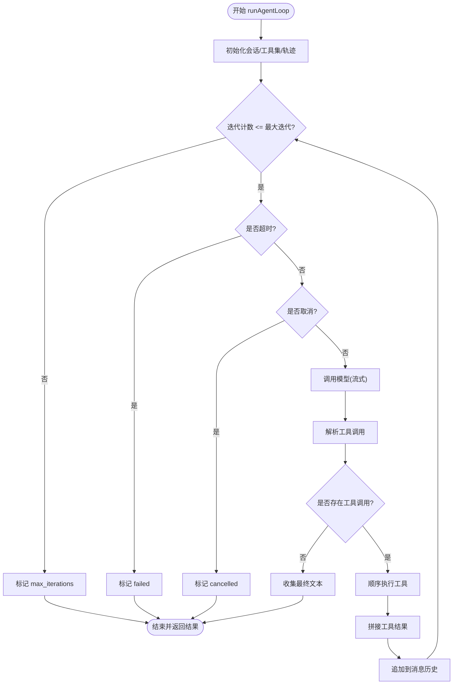
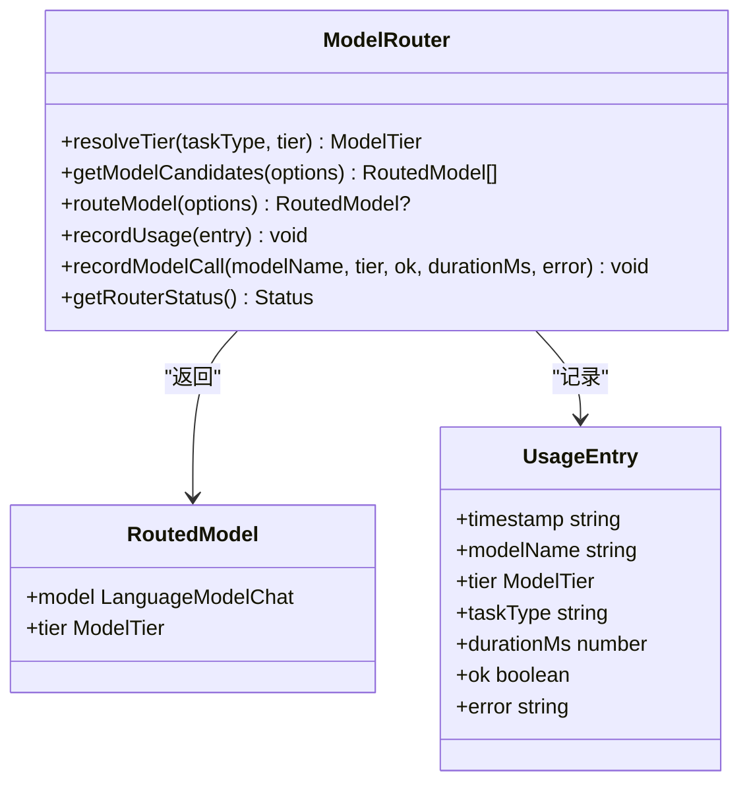
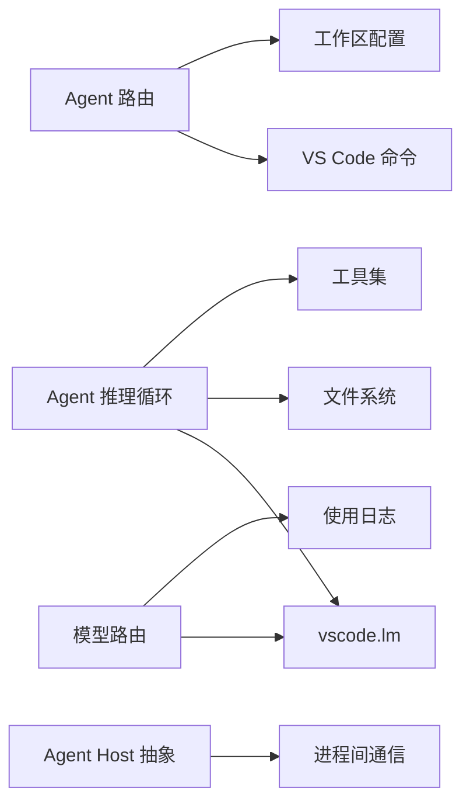

# 数据流设计

<cite>
**本文引用的文件**
- [agentRouter.ts](file://extensions/kodrix-agent-os/src/router/agentRouter.ts)
- [agentLoop.ts](file://extensions/kodrix-agent-os/src/agent/agentLoop.ts)
- [modelRouter.ts](file://extensions/kodrix-agent-os/src/model/modelRouter.ts)
- [agent.ts](file://src/vs/platform/agentHost/common/agent.ts)
- [CLAUDE.md](file://.claude/CLAUDE.md)
</cite>

## 目录
1. [引言](#引言)
2. [项目结构](#项目结构)
3. [核心组件](#核心组件)
4. [架构总览](#架构总览)
5. [详细组件分析](#详细组件分析)
6. [依赖关系分析](#依赖关系分析)
7. [性能考虑](#性能考虑)
8. [故障排查指南](#故障排查指南)
9. [结论](#结论)
10. [附录](#附录)

## 引言
本文件面向“从用户输入到 AI 响应”的完整数据流转，覆盖：
- 用户界面交互与命令解析
- Agent 路由（意图识别与模式选择）
- 模型路由（多模型池、档位选择、故障转移）
- 推理循环（工具调用、执行、收敛控制）
- 结果展示与状态同步
- 异步处理、错误处理、事件驱动、缓存与内存管理、性能监控
- 可观测性与调试追踪

目标是帮助开发者理解并优化端到端数据流，确保高可用、可观测、可扩展。

## 项目结构
Kodrix 在 VS Code 扩展生态中实现 AI 能力，关键路径位于 kodrix-agent-os 扩展：
- 路由层：根据用户输入自动选择 Spec/Plan/Agent/Ask 模式
- 推理层：自研 Agent Loop，基于 vscode.lm 进行流式推理与工具调用
- 模型层：多模型 Auto 路由，按任务类型选择 smart/balanced/fast 档位
- 平台层：Agent Host 进程抽象，用于主进程与 Agent 宿主进程的通信

图表来源
- [agentRouter.ts:141-234](file://extensions/kodrix-agent-os/src/router/agentRouter.ts#L141-L234)
- [agentLoop.ts:486-657](file://extensions/kodrix-agent-os/src/agent/agentLoop.ts#L486-L657)
- [modelRouter.ts:167-267](file://extensions/kodrix-agent-os/src/model/modelRouter.ts#L167-L267)

章节来源
- [CLAUDE.md:9-29](file://.claude/CLAUDE.md#L9-L29)

## 核心组件
- Agent 路由：规则评分 + 置信度门控 + 持久化最近路由 + 自动/交互式执行
- Agent 推理循环：LLM 决策 → 解析工具调用 → 顺序执行 → 结果回填 → 收敛控制（迭代上限/超时/取消）
- 模型路由：三档模型池（smart/balanced/fast），任务类型映射，故障转移，使用日志与健康面板
- 平台抽象：Agent Host 启动与连接抽象，便于跨进程通信与生命周期管理

章节来源
- [agentRouter.ts:10-113](file://extensions/kodrix-agent-os/src/router/agentRouter.ts#L10-L113)
- [agentLoop.ts:37-108](file://extensions/kodrix-agent-os/src/agent/agentLoop.ts#L37-L108)
- [modelRouter.ts:26-75](file://extensions/kodrix-agent-os/src/model/modelRouter.ts#L26-L75)
- [agent.ts:10-27](file://src/vs/platform/agentHost/common/agent.ts#L10-L27)

## 架构总览
端到端数据流时序如下：

图表来源
- [agentRouter.ts:141-234](file://extensions/kodrix-agent-os/src/router/agentRouter.ts#L141-L234)
- [agentLoop.ts:486-657](file://extensions/kodrix-agent-os/src/agent/agentLoop.ts#L486-L657)
- [modelRouter.ts:167-267](file://extensions/kodrix-agent-os/src/model/modelRouter.ts#L167-L267)

## 详细组件分析

### Agent 路由（意图识别与模式选择）
- 规则评分：为 spec/plan/agent/ask 四类目标定义正则权重，计算总分并排序
- 置信度：score≥3→high，≥2→medium，否则 low；短问答优先 ask
- 自动执行：高置信度且开启 autoExecute 时直接执行；否则弹出确认并支持手动切换
- 持久化：记录最近一次路由（目标、提示、原因、置信度、时间戳）
- 执行：通过 VS Code 命令打开聊天窗口并传入查询，spec 模式可能先创建/打开 Spec 工作台

图表来源
- [agentRouter.ts:30-113](file://extensions/kodrix-agent-os/src/router/agentRouter.ts#L30-L113)
- [agentRouter.ts:141-190](file://extensions/kodrix-agent-os/src/router/agentRouter.ts#L141-L190)
- [agentRouter.ts:192-234](file://extensions/kodrix-agent-os/src/router/agentRouter.ts#L192-L234)

章节来源
- [agentRouter.ts:10-113](file://extensions/kodrix-agent-os/src/router/agentRouter.ts#L10-L113)
- [agentRouter.ts:141-234](file://extensions/kodrix-agent-os/src/router/agentRouter.ts#L141-L234)

### Agent 推理循环（工具调用与收敛控制）
- 系统提示：明确工具协议（XML 块）、可用工具、安全约束（仅工作区内路径）
- 工具集：read_file/write_file/edit_file/list_dir/search/codebase_search/run_command/propose_changes/complete
- 解析器：正则提取 <tool_call/name/arguments>，容错跳过不完整块
- 执行流程：每轮 LLM 输出 → 解析工具调用 → 顺序执行 → 结果回填 → 下一轮
- 收敛控制：最大迭代次数、总超时、CancellationToken 中断、计划模式（只读工具）
- 轨迹记录：每步 thought/tool_result/final 写入 Markdown 与 JSON，支持续聊上下文
- 检查点：运行前自动创建检查点，支持回滚 Agent 改动

图表来源
- [agentLoop.ts:112-141](file://extensions/kodrix-agent-os/src/agent/agentLoop.ts#L112-L141)
- [agentLoop.ts:157-192](file://extensions/kodrix-agent-os/src/agent/agentLoop.ts#L157-L192)
- [agentLoop.ts:486-657](file://extensions/kodrix-agent-os/src/agent/agentLoop.ts#L486-L657)

章节来源
- [agentLoop.ts:37-108](file://extensions/kodrix-agent-os/src/agent/agentLoop.ts#L37-L108)
- [agentLoop.ts:198-478](file://extensions/kodrix-agent-os/src/agent/agentLoop.ts#L198-L478)
- [agentLoop.ts:486-657](file://extensions/kodrix-agent-os/src/agent/agentLoop.ts#L486-L657)

### 模型路由（多模型池与故障转移）
- 档位映射：analysis/review/plan→smart；coding/edit/terminal→balanced；quick/extract→fast
- 查找策略：preferred family → 目标档位 → 全池兜底 → 任意可用
- 故障转移：Agent Loop 内逐个尝试候选模型，失败降级下一个
- 使用日志：记录每次路由/推理的模型、档位、耗时、成功/失败、错误信息
- 健康面板：聚合成功率、平均耗时、最后错误，便于监控

图表来源
- [modelRouter.ts:26-75](file://extensions/kodrix-agent-os/src/model/modelRouter.ts#L26-L75)
- [modelRouter.ts:167-267](file://extensions/kodrix-agent-os/src/model/modelRouter.ts#L167-L267)
- [modelRouter.ts:270-295](file://extensions/kodrix-agent-os/src/model/modelRouter.ts#L270-L295)

章节来源
- [modelRouter.ts:91-144](file://extensions/kodrix-agent-os/src/model/modelRouter.ts#L91-L144)
- [modelRouter.ts:167-267](file://extensions/kodrix-agent-os/src/model/modelRouter.ts#L167-L267)
- [modelRouter.ts:270-363](file://extensions/kodrix-agent-os/src/model/modelRouter.ts#L270-L363)

### 平台层：Agent Host 进程抽象
- IAgentHostStarter：负责启动 Agent 宿主进程并建立连接
- IAgentHostConnection：提供通道客户端、资源存储、进程退出事件
- 用途：将 Agent 相关重负载隔离到独立进程，提升稳定性与可维护性

章节来源
- [agent.ts:10-27](file://src/vs/platform/agentHost/common/agent.ts#L10-L27)

## 依赖关系分析
- 路由依赖 VS Code 命令与工作区配置
- 推理循环依赖 vscode.lm 与文件系统，并通过工具集访问代码库
- 模型路由依赖 vscode.lm.selectChatModels 与本地日志文件
- 平台层提供进程间通信抽象，解耦主进程与 Agent 宿主

图表来源
- [agentRouter.ts:141-234](file://extensions/kodrix-agent-os/src/router/agentRouter.ts#L141-L234)
- [agentLoop.ts:486-657](file://extensions/kodrix-agent-os/src/agent/agentLoop.ts#L486-L657)
- [modelRouter.ts:167-267](file://extensions/kodrix-agent-os/src/model/modelRouter.ts#L167-L267)
- [agent.ts:10-27](file://src/vs/platform/agentHost/common/agent.ts#L10-L27)

章节来源
- [CLAUDE.md:9-29](file://.claude/CLAUDE.md#L9-L29)

## 性能考虑
- 语义检索缓存：codebase_search 优先使用内存索引，避免每次全量读盘；未构建索引时提示先构建
- 流式推理：vscode.lm 流式返回文本片段，减少首字节延迟
- 超时与取消：请求级超时与 CancellationToken，防止模型挂起阻塞
- 工具结果截断：限制工具输出长度，避免消息膨胀
- 检查点：运行前创建检查点，降低失败回滚成本
- 模型故障转移：候选模型依次尝试，提高可用性
- 日志滚动：模型使用日志按上限滚动，控制磁盘占用

[本节为通用性能建议，不直接分析具体文件]

## 故障排查指南
- 路由问题：检查意图分类规则与置信度阈值；查看最近路由记录；确认自动执行开关
- 模型问题：查看模型健康面板（成功率、平均耗时、最后错误）；确认 BYOK 配置与可用模型族
- 工具执行失败：检查路径越界、文件不存在、匹配唯一性、命令超时；查看轨迹中的 tool_result
- 超时/取消：确认最大迭代与总超时设置；检查 CancellationToken 是否正确传递
- 进程异常：通过 onDidProcessExit 监听宿主进程退出；结合 OutputChannel 日志定位

章节来源
- [agentRouter.ts:192-234](file://extensions/kodrix-agent-os/src/router/agentRouter.ts#L192-L234)
- [agentLoop.ts:552-657](file://extensions/kodrix-agent-os/src/agent/agentLoop.ts#L552-L657)
- [modelRouter.ts:270-363](file://extensions/kodrix-agent-os/src/model/modelRouter.ts#L270-L363)
- [agent.ts:13-27](file://src/vs/platform/agentHost/common/agent.ts#L13-L27)

## 结论
本数据流以“路由—推理—模型—工具—展示”为主线，具备：
- 明确的意图分类与模式选择
- 强大的工具调用与收敛控制
- 多模型池与故障转移
- 完整的轨迹记录与健康监控
- 进程隔离与事件驱动基础

建议持续优化：
- 增强主动上下文感知（意图检测与上下文摘要）
- 完善并发冲突检测（多 Agent 同文件编辑）
- 强化缓存与增量索引（语义检索与代码库索引）
- 扩展可视化（Checkpoint 时间线与 Diff 画廊）

## 附录
- 最佳实践
  - 所有新模块遵循 TypeScript strict 与 ESLint 零警告
  - 使用 OutputChannel 替代 console 日志
  - 所有异步 I/O 使用 fs.promises，避免阻塞扩展主机
  - 严格路径校验，禁止路径穿越
  - 网络请求必须带超时与大小限制
  - 所有定时器与监听器需在 dispose 中清理

章节来源
- [CLAUDE.md:31-88](file://.claude/CLAUDE.md#L31-L88)