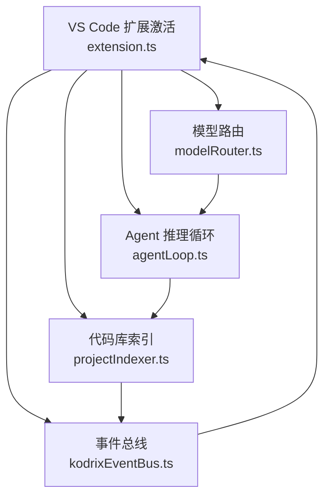
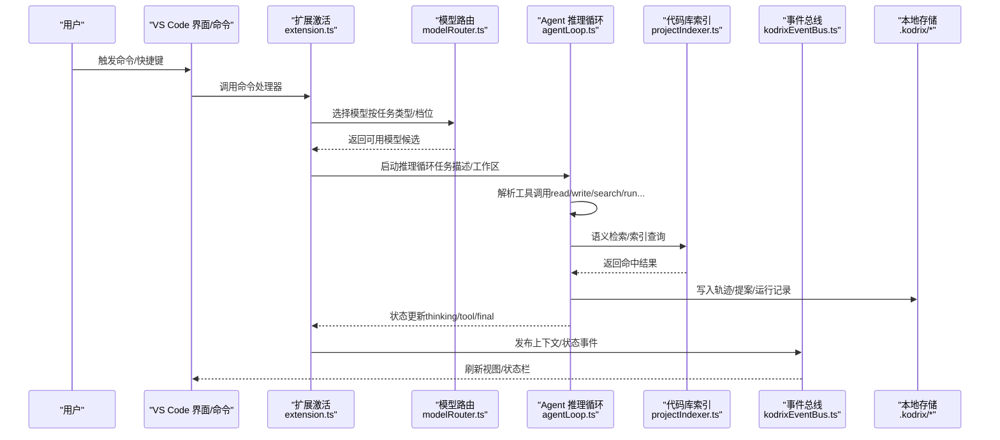
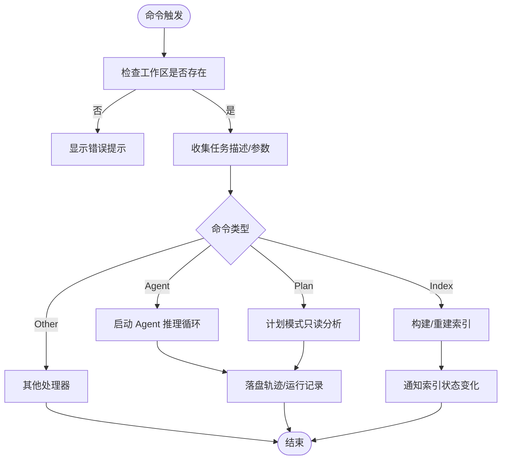
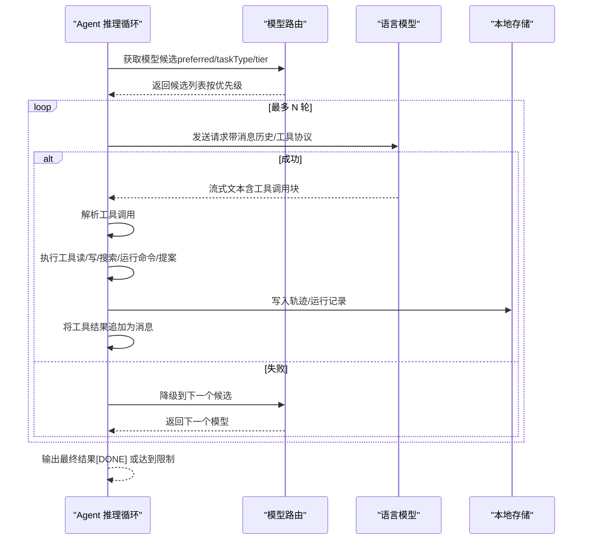
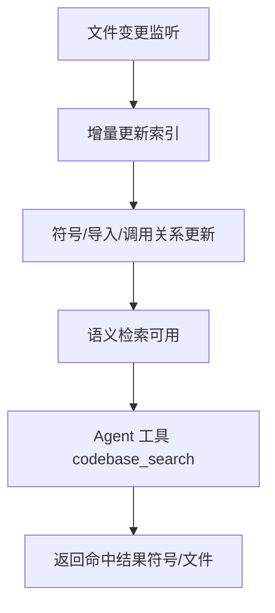
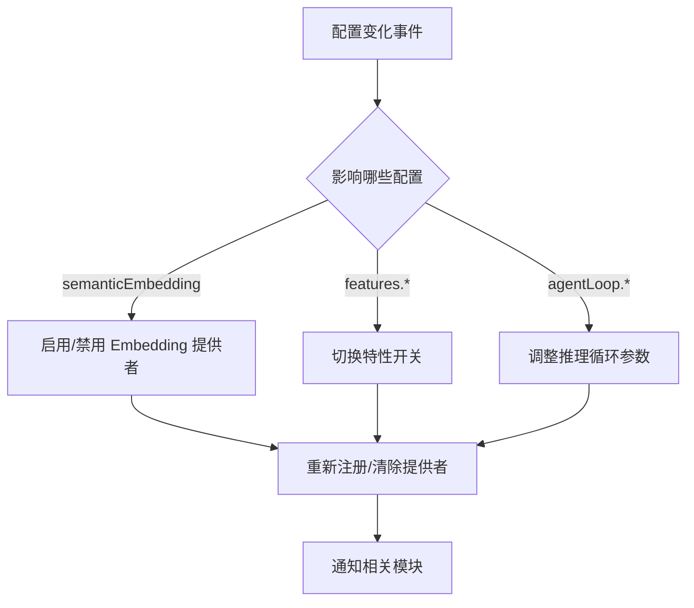
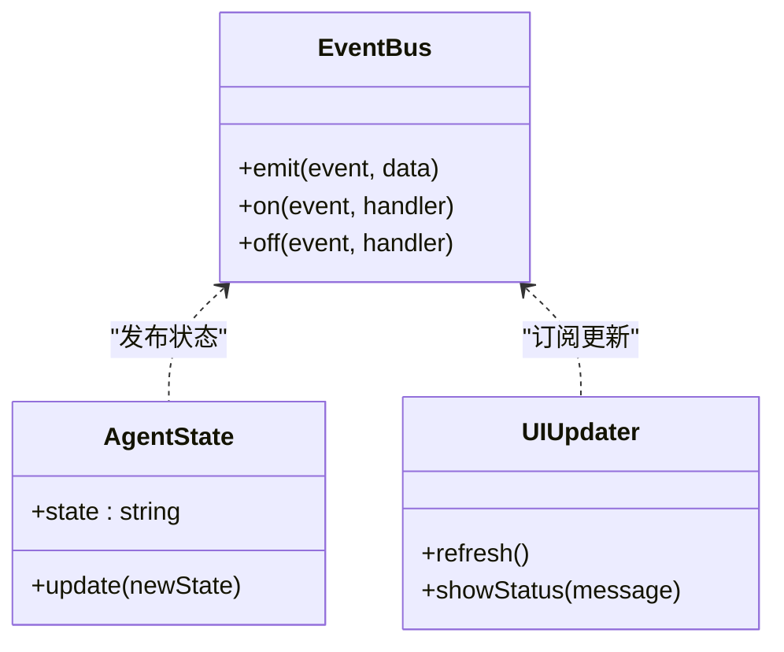
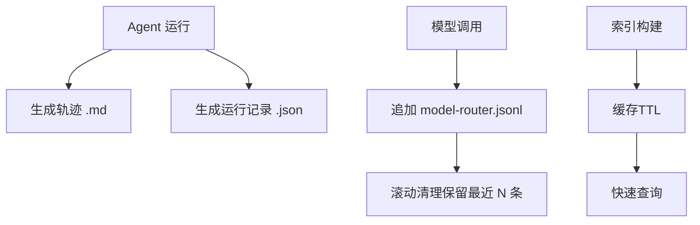
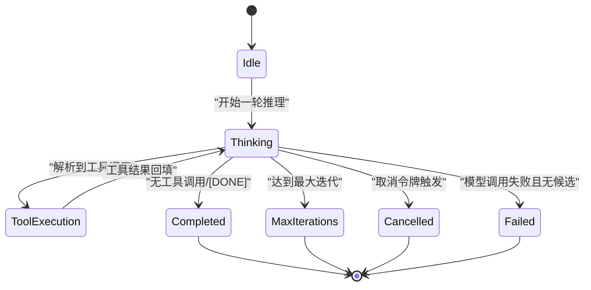
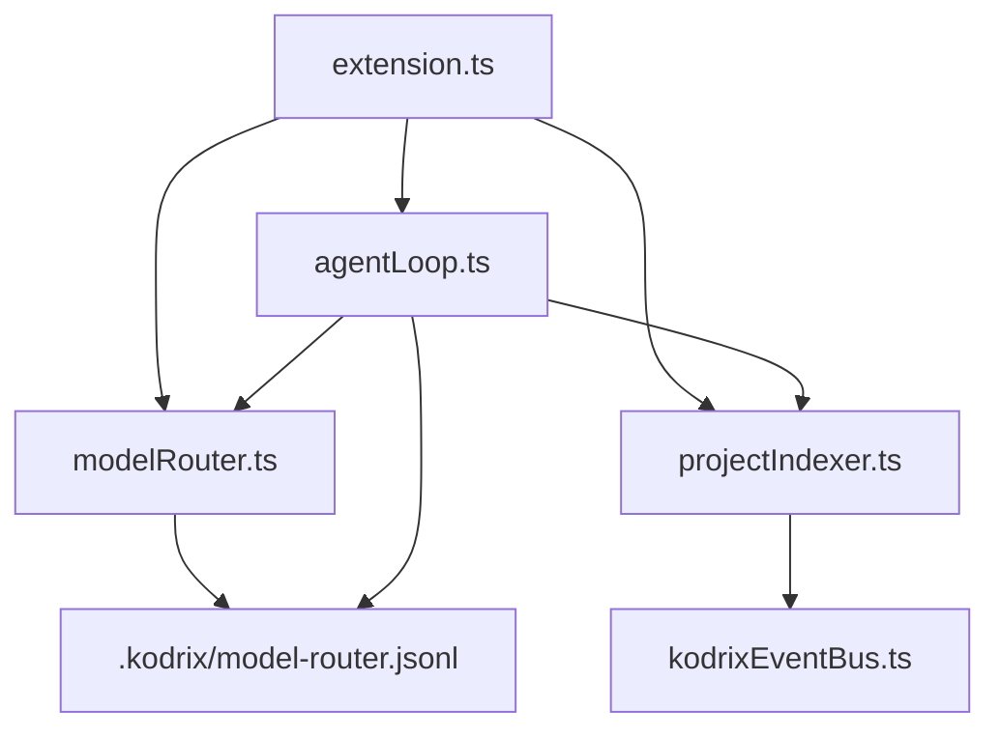

# 数据流设计

<cite>
**本文引用的文件**
- [extension.ts](file://extensions/kodrix-agent-os/src/extension.ts)
- [agentLoop.ts](file://extensions/kodrix-agent-os/src/agent/agentLoop.ts)
- [modelRouter.ts](file://extensions/kodrix-agent-os/src/model/modelRouter.ts)
- [constants.ts](file://extensions/kodrix-agent-os/src/shared/constants.ts)
- [projectIndexer.ts](file://extensions/kodrix-agent-os/src/codebase/projectIndexer.ts)
- [kodrixEventBus.ts](file://extensions/kodrix-agent-os/src/context/kodrixEventBus.ts)
- [package.json](file://extensions/kodrix-agent-os/package.json)
</cite>

## 目录
1. [简介](#简介)
2. [项目结构](#项目结构)
3. [核心组件](#核心组件)
4. [架构总览](#架构总览)
5. [详细组件分析](#详细组件分析)
6. [依赖关系分析](#依赖关系分析)
7. [性能考量](#性能考量)
8. [故障排查指南](#故障排查指南)
9. [结论](#结论)
10. [附录](#附录)

## 简介
本文件面向 KodrixCode 的数据流设计，聚焦以下目标：
- 用户输入处理、AI 请求发送、响应数据处理与状态更新传播的端到端流程
- 事件驱动架构的实现：事件发布订阅、异步处理、错误处理与重试机制
- 四类数据流：同步操作流、异步 AI 调用流、文件变更监听流、配置更新流
- 数据持久化策略：本地存储、缓存机制、数据同步
- 提供数据流图与状态转换图，帮助开发者理解并扩展系统

## 项目结构
KodrixCode 的 Agent OS 扩展以 VS Code 扩展为载体，通过激活入口统一注册命令、视图、事件监听与后台任务。关键路径包括：
- 扩展激活与模块装配：在激活阶段集中注册各子系统（路由、Agent、索引、学习引擎等）
- 模型路由：按任务类型选择合适模型族，支持降级与使用记录
- Agent 推理循环：LLM 输出工具调用 → 解析执行 → 结果回填 → 迭代收敛
- 代码库索引：全工程语义索引构建与增量更新，支撑语义检索与预测补全
- 事件总线：跨模块实时事件，用于上下文变化、状态同步等

图表来源
- [extension.ts:170-259](file://extensions/kodrix-agent-os/src/extension.ts#L170-L259)
- [modelRouter.ts:167-267](file://extensions/kodrix-agent-os/src/model/modelRouter.ts#L167-L267)
- [agentLoop.ts:487-658](file://extensions/kodrix-agent-os/src/agent/agentLoop.ts#L487-L658)
- [projectIndexer.ts:765-790](file://extensions/kodrix-agent-os/src/codebase/projectIndexer.ts#L765-L790)
- [kodrixEventBus.ts:1-32](file://extensions/kodrix-agent-os/src/context/kodrixEventBus.ts#L1-L32)

章节来源
- [extension.ts:170-259](file://extensions/kodrix-agent-os/src/extension.ts#L170-L259)
- [package.json:15-21](file://extensions/kodrix-agent-os/package.json#L15-L21)

## 核心组件
- 扩展激活与装配：集中注册命令、视图、事件监听、索引与设置页，确保启动时完成所有能力接入
- 模型路由：三档模型池（smart/balanced/fast），按任务类型自动映射，支持精确指定与兜底查找，记录使用日志
- Agent 推理循环：端到端 tool-use loop，包含工具集（读/写/编辑/搜索/运行命令/提案/完成）、收敛控制（最大迭代、超时、取消令牌）、轨迹落盘
- 代码库索引：AST 级符号索引、导入/调用关系、语义检索；支持增量更新与统计展示
- 事件总线：跨模块事件通道，用于上下文变化、状态同步、UI 刷新等

章节来源
- [extension.ts:170-259](file://extensions/kodrix-agent-os/src/extension.ts#L170-L259)
- [modelRouter.ts:167-267](file://extensions/kodrix-agent-os/src/model/modelRouter.ts#L167-L267)
- [agentLoop.ts:487-658](file://extensions/kodrix-agent-os/src/agent/agentLoop.ts#L487-L658)
- [projectIndexer.ts:765-790](file://extensions/kodrix-agent-os/src/codebase/projectIndexer.ts#L765-L790)
- [kodrixEventBus.ts:1-32](file://extensions/kodrix-agent-os/src/context/kodrixEventBus.ts#L1-L32)

## 架构总览
下图展示了从用户输入到 AI 请求、再到响应处理与状态更新的完整数据流，以及事件驱动与持久化的参与点。

图表来源
- [extension.ts:170-259](file://extensions/kodrix-agent-os/src/extension.ts#L170-L259)
- [modelRouter.ts:167-267](file://extensions/kodrix-agent-os/src/model/modelRouter.ts#L167-L267)
- [agentLoop.ts:487-658](file://extensions/kodrix-agent-os/src/agent/agentLoop.ts#L487-L658)
- [projectIndexer.ts:765-790](file://extensions/kodrix-agent-os/src/codebase/projectIndexer.ts#L765-L790)
- [kodrixEventBus.ts:1-32](file://extensions/kodrix-agent-os/src/context/kodrixEventBus.ts#L1-L32)

## 详细组件分析

### 用户输入处理与命令分发
- 命令注册：扩展激活时集中注册大量命令（如 Hub、Router、Agent、Checkpoint、Apply、Terminal AI 等）
- 输入收集：通过输入框或快捷键获取任务描述，校验工作区存在性
- 分发策略：根据命令 ID 路由到对应处理器，必要时创建进度提示与消息反馈

图表来源
- [extension.ts:275-344](file://extensions/kodrix-agent-os/src/extension.ts#L275-L344)
- [constants.ts:73-170](file://extensions/kodrix-agent-os/src/shared/constants.ts#L73-L170)

章节来源
- [extension.ts:275-344](file://extensions/kodrix-agent-os/src/extension.ts#L275-L344)
- [constants.ts:73-170](file://extensions/kodrix-agent-os/src/shared/constants.ts#L73-L170)

### 异步 AI 调用流（模型路由与推理循环）
- 模型路由：优先精确指定 family，其次按任务类型映射档位，最后全池兜底；失败时记录并使用日志滚动清理
- 推理循环：每轮 LLM 输出 → 解析工具调用 → 顺序执行工具 → 结果回填 → 继续下一轮；支持取消令牌、超时、最大迭代
- 故障转移：模型调用失败自动降级下一个候选；记录每次调用的成功/失败与耗时

图表来源
- [modelRouter.ts:167-267](file://extensions/kodrix-agent-os/src/model/modelRouter.ts#L167-L267)
- [agentLoop.ts:487-658](file://extensions/kodrix-agent-os/src/agent/agentLoop.ts#L487-L658)

章节来源
- [modelRouter.ts:167-267](file://extensions/kodrix-agent-os/src/model/modelRouter.ts#L167-L267)
- [agentLoop.ts:487-658](file://extensions/kodrix-agent-os/src/agent/agentLoop.ts#L487-L658)

### 文件变更监听流（索引与增量更新）
- 索引构建：启动后延迟构建全工程索引，支持“新文件夹自动索引”开关
- 增量更新：文件变更触发索引增量更新，保持符号/导入/调用关系最新
- 语义检索：Agent 工具 codebase_search 优先使用内存索引，避免全量读盘

图表来源
- [extension.ts:258-272](file://extensions/kodrix-agent-os/src/extension.ts#L258-L272)
- [projectIndexer.ts:765-790](file://extensions/kodrix-agent-os/src/codebase/projectIndexer.ts#L765-L790)
- [agentLoop.ts:346-391](file://extensions/kodrix-agent-os/src/agent/agentLoop.ts#L346-L391)

章节来源
- [extension.ts:258-272](file://extensions/kodrix-agent-os/src/extension.ts#L258-L272)
- [projectIndexer.ts:765-790](file://extensions/kodrix-agent-os/src/codebase/projectIndexer.ts#L765-L790)
- [agentLoop.ts:346-391](file://extensions/kodrix-agent-os/src/agent/agentLoop.ts#L346-L391)

### 配置更新流（特性开关与行为调整）
- 配置监听：监听 kodrix.* 配置变化（如 semanticEmbedding.enabled），动态启用/禁用功能
- 特性开关：通过 feature flags 控制 Wiki、Memory、Context、IdeaFlow、Codebase Intelligence 等
- 行为调整：Agent Loop 的最大迭代、超时、是否允许命令执行、是否创建检查点等均可配置

图表来源
- [extension.ts:204-210](file://extensions/kodrix-agent-os/src/extension.ts#L204-L210)
- [constants.ts:44-57](file://extensions/kodrix-agent-os/src/shared/constants.ts#L44-L57)
- [constants.ts:365-383](file://extensions/kodrix-agent-os/src/shared/constants.ts#L365-L383)

章节来源
- [extension.ts:204-210](file://extensions/kodrix-agent-os/src/extension.ts#L204-L210)
- [constants.ts:44-57](file://extensions/kodrix-agent-os/src/shared/constants.ts#L44-L57)
- [constants.ts:365-383](file://extensions/kodrix-agent-os/src/shared/constants.ts#L365-L383)

### 事件驱动架构（发布订阅与状态传播）
- 事件总线：跨模块实时事件，用于上下文变化、状态同步、UI 刷新
- 状态桥接：Agent 状态（idle/thinking/tool/final）通过事件广播，驱动 UI 与面板更新
- 订阅者：Hub、状态栏、Webview 等订阅事件，实现解耦与可扩展的状态传播

图表来源
- [kodrixEventBus.ts:1-32](file://extensions/kodrix-agent-os/src/context/kodrixEventBus.ts#L1-L32)
- [agentLoop.ts:553-658](file://extensions/kodrix-agent-os/src/agent/agentLoop.ts#L553-L658)

章节来源
- [kodrixEventBus.ts:1-32](file://extensions/kodrix-agent-os/src/context/kodrixEventBus.ts#L1-L32)
- [agentLoop.ts:553-658](file://extensions/kodrix-agent-os/src/agent/agentLoop.ts#L553-L658)

### 数据持久化策略（本地存储、缓存、同步）
- 工作区元数据：.kodrix 目录存放 agent-runs、apply、background、model-router.jsonl 等
- 轨迹与运行记录：每次 Agent 运行生成 .md 与 .json 文件，支持续聊与分支
- 使用日志：模型路由使用记录按行追加，超过阈值滚动清理
- 缓存机制：索引与 Wiki 缓存 TTL 控制，减少重复计算与 IO

图表来源
- [agentLoop.ts:712-720](file://extensions/kodrix-agent-os/src/agent/agentLoop.ts#L712-L720)
- [modelRouter.ts:101-118](file://extensions/kodrix-agent-os/src/model/modelRouter.ts#L101-L118)
- [constants.ts:192-196](file://extensions/kodrix-agent-os/src/shared/constants.ts#L192-L196)

章节来源
- [agentLoop.ts:712-720](file://extensions/kodrix-agent-os/src/agent/agentLoop.ts#L712-L720)
- [modelRouter.ts:101-118](file://extensions/kodrix-agent-os/src/model/modelRouter.ts#L101-L118)
- [constants.ts:192-196](file://extensions/kodrix-agent-os/src/shared/constants.ts#L192-L196)

### 状态转换图（Agent 推理循环）

图表来源
- [agentLoop.ts:553-658](file://extensions/kodrix-agent-os/src/agent/agentLoop.ts#L553-L658)

## 依赖关系分析
- 扩展激活依赖：集中注册各模块，形成松耦合的插件体系
- 模型路由依赖：vscode.lm.selectChatModels，零外部依赖，兼容 BYOK
- Agent 循环依赖：终端命令执行、索引查询、应用提案管理
- 索引依赖：AST 解析、符号提取、导入/调用关系构建
- 事件依赖：跨模块事件总线，解耦状态传播

图表来源
- [extension.ts:170-259](file://extensions/kodrix-agent-os/src/extension.ts#L170-L259)
- [modelRouter.ts:167-267](file://extensions/kodrix-agent-os/src/model/modelRouter.ts#L167-L267)
- [agentLoop.ts:487-658](file://extensions/kodrix-agent-os/src/agent/agentLoop.ts#L487-L658)
- [projectIndexer.ts:765-790](file://extensions/kodrix-agent-os/src/codebase/projectIndexer.ts#L765-L790)
- [kodrixEventBus.ts:1-32](file://extensions/kodrix-agent-os/src/context/kodrixEventBus.ts#L1-L32)

章节来源
- [extension.ts:170-259](file://extensions/kodrix-agent-os/src/extension.ts#L170-L259)
- [modelRouter.ts:167-267](file://extensions/kodrix-agent-os/src/model/modelRouter.ts#L167-L267)
- [agentLoop.ts:487-658](file://extensions/kodrix-agent-os/src/agent/agentLoop.ts#L487-L658)
- [projectIndexer.ts:765-790](file://extensions/kodrix-agent-os/src/codebase/projectIndexer.ts#L765-L790)
- [kodrixEventBus.ts:1-32](file://extensions/kodrix-agent-os/src/context/kodrixEventBus.ts#L1-L32)

## 性能考量
- 模型路由：按任务类型选择档位，减少高成本模型的使用；失败自动降级，提升可用性
- Agent 循环：最大迭代与超时控制，避免无限循环；工具结果截断，防止上下文爆炸
- 索引构建：延迟启动与增量更新，降低启动开销；语义检索优先内存索引，减少 IO
- 配置监听：按需启用/禁用功能，避免不必要的资源消耗
- 日志滚动：使用日志与运行记录滚动清理，防止磁盘膨胀

## 故障排查指南
- 模型不可用：检查 vscode.lm.selectChatModels 是否返回模型；查看 model-router.jsonl 中的失败记录
- Agent 未收敛：检查最大迭代与超时配置；查看轨迹文件确认工具调用是否合理
- 索引构建失败：检查工作区权限与文件数量；手动触发重建索引并查看统计
- 配置未生效：确认配置键是否正确；检查 onDidChangeConfiguration 是否触发
- 事件未传播：检查事件总线订阅是否注册；确认事件名称与数据结构一致

章节来源
- [modelRouter.ts:101-118](file://extensions/kodrix-agent-os/src/model/modelRouter.ts#L101-L118)
- [agentLoop.ts:553-658](file://extensions/kodrix-agent-os/src/agent/agentLoop.ts#L553-L658)
- [extension.ts:275-344](file://extensions/kodrix-agent-os/src/extension.ts#L275-L344)

## 结论
KodrixCode 的数据流设计以事件驱动为核心，结合模型路由、Agent 推理循环、代码库索引与持久化策略，实现了从用户输入到 AI 响应、再到状态更新与 UI 刷新的完整闭环。通过配置化与模块化，系统具备良好的可扩展性与可维护性，适合复杂开发场景下的智能辅助需求。

## 附录
- 命令参考：详见 package.json 中 contributes.commands 定义
- 配置项：详见 constants.ts 中 CONFIG_* 与 FEATURE_FLAGS 定义
- 路径约定：工作区 .kodrix 目录用于存放元数据与运行记录

章节来源
- [package.json:86-483](file://extensions/kodrix-agent-os/package.json#L86-L483)
- [constants.ts:39-57](file://extensions/kodrix-agent-os/src/shared/constants.ts#L39-L57)
- [constants.ts:13-17](file://extensions/kodrix-agent-os/src/shared/constants.ts#L13-L17)