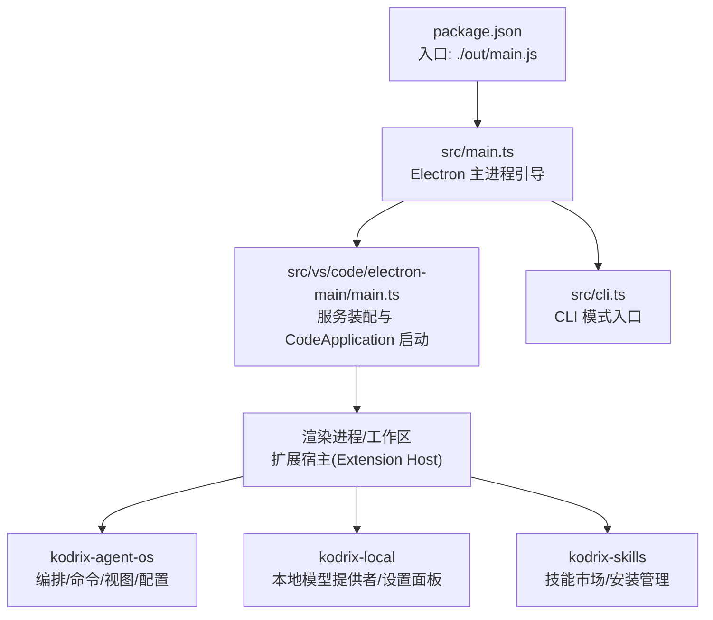
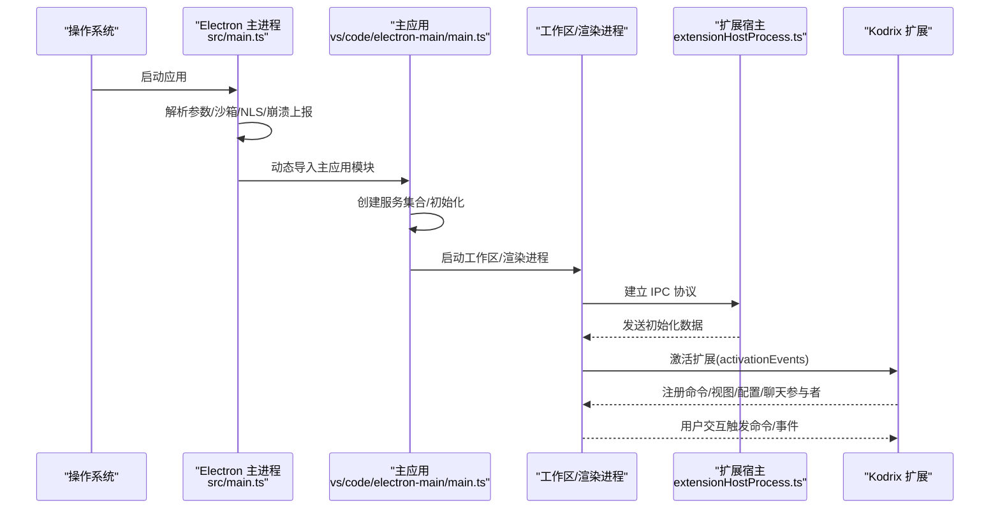
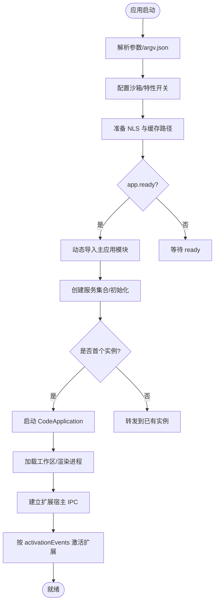
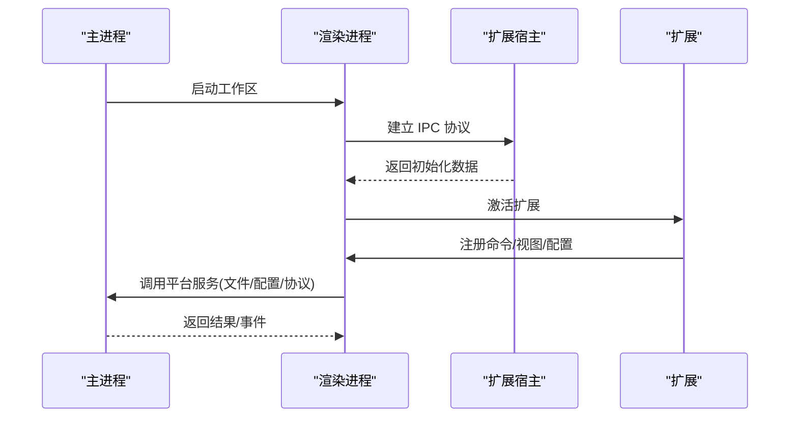
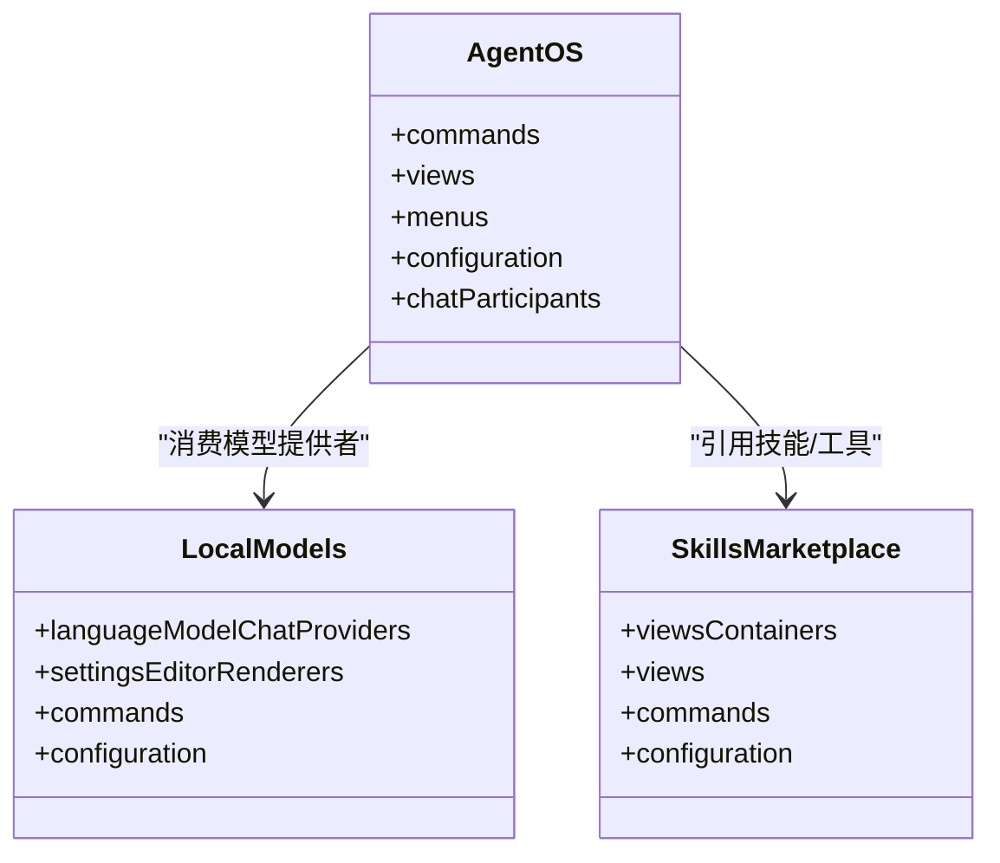
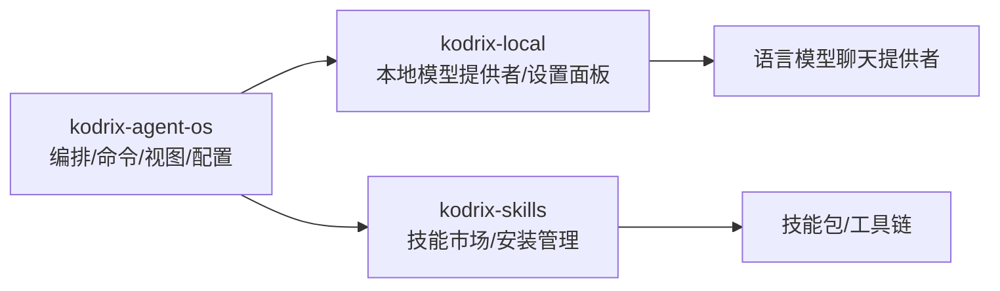
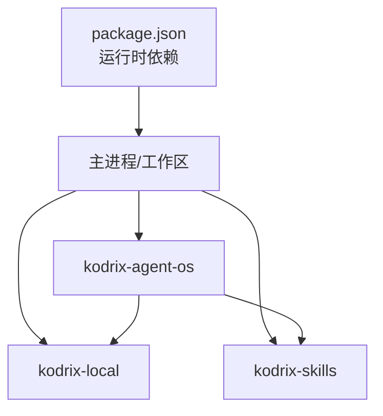

# 架构设计

<cite>
**本文引用的文件**
- [package.json](file://package.json)
- [src/main.ts](file://src/main.ts)
- [src/cli.ts](file://src/cli.ts)
- [src/vs/code/electron-main/main.ts](file://src/vs/code/electron-main/main.ts)
- [src/vs/workbench/api/node/extensionHostProcess.ts](file://src/vs/workbench/api/node/extensionHostProcess.ts)
- [extensions/kodrix-agent-os/package.json](file://extensions/kodrix-agent-os/package.json)
- [extensions/kodrix-local/package.json](file://extensions/kodrix-local/package.json)
- [extensions/kodrix-skills/package.json](file://extensions/kodrix-skills/package.json)
</cite>

## 目录
1. [简介](#简介)
2. [项目结构](#项目结构)
3. [核心组件](#核心组件)
4. [架构总览](#架构总览)
5. [详细组件分析](#详细组件分析)
6. [依赖关系分析](#依赖关系分析)
7. [性能考量](#性能考量)
8. [故障排查指南](#故障排查指南)
9. [结论](#结论)
10. [附录](#附录)

## 简介
本架构设计文档面向 KodrixCode，系统性阐述基于 Electron + VS Code 的工作台架构、主进程与渲染进程的通信机制、VS Code 框架的定制方式与扩展体系。重点解释启动流程、模块加载顺序、数据流设计，并深入说明 kodrix-* 系列扩展（kodrix-agent-os、kodrix-local、kodrix-skills）的职责分工与协作关系。文档提供架构图表与交互图，帮助开发者快速理解系统全貌，指导后续功能开发与扩展。

## 项目结构
KodrixCode 以 VS Code 源码为基础，通过 Electron 作为宿主，结合内置与自定义扩展实现 AI 增强型开发体验。根级 package.json 定义入口 main 指向 out/main.js；Electron 主进程由 src/main.ts 引导，随后动态导入 vs/code/electron-main/main.ts 完成服务装配与应用启动。CLI 入口 src/cli.ts 用于命令行模式，独立于 GUI 工作流。

图表来源
- [package.json:13-14](file://package.json#L13-L14)
- [src/main.ts:211-220](file://src/main.ts#L211-L220)
- [src/vs/code/electron-main/main.ts:90-160](file://src/vs/code/electron-main/main.ts#L90-L160)
- [src/cli.ts:6-26](file://src/cli.ts#L6-L26)

章节来源
- [package.json:1-100](file://package.json#L1-L100)
- [src/main.ts:1-220](file://src/main.ts#L1-L220)
- [src/cli.ts:1-27](file://src/cli.ts#L1-L27)

## 核心组件
- Electron 主进程引导：负责沙箱策略、NLS 国际化、崩溃上报、协议注册、argv.json 解析与特性开关，最终动态导入主应用模块。
- 主应用服务装配：创建实例化容器，注册日志、文件、状态、配置、生命周期、请求、主题、签名、隧道、协议等核心服务，并启动 CodeApplication。
- 扩展宿主：在渲染进程侧建立与主进程的 IPC 通道，加载扩展并执行其贡献点（命令、视图、菜单、配置、聊天参与者等）。
- Kodrix 扩展族：
  - kodrix-agent-os：编排层，暴露大量命令、视图、配置项，集成聊天参与者与工作区上下文。
  - kodrix-local：本地模型提供者与设置面板，注入语言模型聊天提供者，支持预设与迁移。
  - kodrix-skills：技能市场与安装管理，提供 Webview 展示与安装/卸载能力。

章节来源
- [src/main.ts:23-220](file://src/main.ts#L23-L220)
- [src/vs/code/electron-main/main.ts:101-296](file://src/vs/code/electron-main/main.ts#L101-L296)
- [src/vs/workbench/api/node/extensionHostProcess.ts:293-476](file://src/vs/workbench/api/node/extensionHostProcess.ts#L293-L476)
- [extensions/kodrix-agent-os/package.json:15-800](file://extensions/kodrix-agent-os/package.json#L15-L800)
- [extensions/kodrix-local/package.json:15-281](file://extensions/kodrix-local/package.json#L15-L281)
- [extensions/kodrix-skills/package.json:14-135](file://extensions/kodrix-skills/package.json#L14-L135)

## 架构总览
下图展示了从 Electron 启动到工作区运行、再到扩展激活的整体流程，以及主进程与渲染进程之间的 IPC 通信路径。

图表来源
- [src/main.ts:211-220](file://src/main.ts#L211-L220)
- [src/vs/code/electron-main/main.ts:101-160](file://src/vs/code/electron-main/main.ts#L101-L160)
- [src/vs/workbench/api/node/extensionHostProcess.ts:439-476](file://src/vs/workbench/api/node/extensionHostProcess.ts#L439-L476)
- [extensions/kodrix-agent-os/package.json:15-800](file://extensions/kodrix-agent-os/package.json#L15-L800)

## 详细组件分析

### 启动流程与模块加载顺序
- 主进程引导阶段：
  - 解析 CLI 参数与 argv.json，设置沙箱、日志、崩溃上报、协议白名单。
  - 准备 NLS 配置与代码缓存路径，监听 app 'ready' 后调用 onReady。
  - 动态导入主应用模块，完成服务装配与应用启动。
- 主应用服务装配：
  - 构建 ServiceCollection，注册产品、环境、日志、文件、状态、配置、生命周期、请求、主题、签名、隧道、协议等服务。
  - 尝试成为唯一实例（IPC 端口占用检测），处理多实例转发与等待标记。
  - 启动 CodeApplication，进入工作区生命周期。
- 扩展宿主连接：
  - 渲染进程与扩展宿主建立协议通道，交换初始化数据。
  - 根据 activationEvents 激活扩展，注册贡献点并响应用户操作。

图表来源
- [src/main.ts:23-220](file://src/main.ts#L23-L220)
- [src/vs/code/electron-main/main.ts:101-160](file://src/vs/code/electron-main/main.ts#L101-L160)
- [src/vs/workbench/api/node/extensionHostProcess.ts:439-476](file://src/vs/workbench/api/node/extensionHostProcess.ts#L439-L476)

章节来源
- [src/main.ts:23-220](file://src/main.ts#L23-L220)
- [src/vs/code/electron-main/main.ts:101-160](file://src/vs/code/electron-main/main.ts#L101-L160)
- [src/vs/workbench/api/node/extensionHostProcess.ts:439-476](file://src/vs/workbench/api/node/extensionHostProcess.ts#L439-L476)

### 主进程与渲染进程通信机制
- 主进程通过 NodeIPC 服务器/客户端进行实例间通信，确保单实例运行并将新启动的参数转发给已有实例。
- 渲染进程与扩展宿主之间通过自定义协议传递消息，包含初始化数据、终止信号等。
- 扩展在渲染进程中运行，通过 VS Code API 与主进程服务交互（如文件、配置、命令、聊天参与者等）。

图表来源
- [src/vs/code/electron-main/main.ts:351-479](file://src/vs/code/electron-main/main.ts#L351-L479)
- [src/vs/workbench/api/node/extensionHostProcess.ts:293-476](file://src/vs/workbench/api/node/extensionHostProcess.ts#L293-L476)

章节来源
- [src/vs/code/electron-main/main.ts:351-479](file://src/vs/code/electron-main/main.ts#L351-L479)
- [src/vs/workbench/api/node/extensionHostProcess.ts:293-476](file://src/vs/workbench/api/node/extensionHostProcess.ts#L293-L476)

### VS Code 框架定制方式
- 通过主进程服务装配注入自定义策略、托管设置、策略聚合器（MultiplexPolicyService）、文件/用户数据提供者等。
- 使用 protocol 服务注册自定义 scheme（如 vscode-webview、vscode-file），赋予安全与跨域能力。
- 通过 extensionHost 协议与扩展生态对接，使 kodrix-* 扩展以标准 VS Code 扩展形式集成。

章节来源
- [src/vs/code/electron-main/main.ts:166-296](file://src/vs/code/electron-main/main.ts#L166-L296)
- [src/main.ts:96-113](file://src/main.ts#L96-L113)

### 扩展体系的设计模式
- 贡献点驱动：kodrix-agent-os 通过 contributes 声明命令、视图、菜单、配置、聊天参与者等，遵循 VS Code 扩展契约。
- 激活事件：kodrix-* 扩展统一使用 onStartupFinished 或特定设置渲染器事件，按需延迟加载。
- 模块化组织：kodrix-agent-os 将功能拆分为 agent、kanban、memory、router、terminal 等子模块，便于维护与测试。
- 提供者模式：kodrix-local 注册 languageModelChatProviders，为聊天与智能补全提供本地模型能力。

图表来源
- [extensions/kodrix-agent-os/package.json:15-800](file://extensions/kodrix-agent-os/package.json#L15-L800)
- [extensions/kodrix-local/package.json:15-281](file://extensions/kodrix-local/package.json#L15-L281)
- [extensions/kodrix-skills/package.json:14-135](file://extensions/kodrix-skills/package.json#L14-L135)

章节来源
- [extensions/kodrix-agent-os/package.json:15-800](file://extensions/kodrix-agent-os/package.json#L15-L800)
- [extensions/kodrix-local/package.json:15-281](file://extensions/kodrix-local/package.json#L15-L281)
- [extensions/kodrix-skills/package.json:14-135](file://extensions/kodrix-skills/package.json#L14-L135)

### kodrix-* 系列扩展职责分工
- kodrix-agent-os：编排与交互中枢，提供命令、看板、记忆、路由、终端 AI、会话学习等能力，并通过聊天参与者与工作区上下文联动。
- kodrix-local：本地模型提供者与设置面板，注入语言模型聊天提供者，支持预设、迁移、密钥管理与工作区面板。
- kodrix-skills：技能市场与安装管理，提供 Webview 界面与安装/卸载/搜索能力，扩展可插拔的工具链。

图表来源
- [extensions/kodrix-agent-os/package.json:15-800](file://extensions/kodrix-agent-os/package.json#L15-L800)
- [extensions/kodrix-local/package.json:15-281](file://extensions/kodrix-local/package.json#L15-L281)
- [extensions/kodrix-skills/package.json:14-135](file://extensions/kodrix-skills/package.json#L14-L135)

章节来源
- [extensions/kodrix-agent-os/package.json:15-800](file://extensions/kodrix-agent-os/package.json#L15-L800)
- [extensions/kodrix-local/package.json:15-281](file://extensions/kodrix-local/package.json#L15-L281)
- [extensions/kodrix-skills/package.json:14-135](file://extensions/kodrix-skills/package.json#L14-L135)

## 依赖关系分析
- 运行时依赖：Electron、Node、Xterm、SQLite、代理与安全相关库等，支撑桌面端能力与网络访问。
- 扩展依赖：kodrix-agent-os 依赖 VS Code 扩展 API 与聊天参与者能力；kodrix-local 依赖语言模型聊天提供者接口；kodrix-skills 依赖工作区视图与 Webview。
- 内部耦合：主进程服务装配对日志、文件、配置、策略、协议等存在强耦合；扩展通过标准 API 解耦。

图表来源
- [package.json:105-170](file://package.json#L105-L170)
- [extensions/kodrix-agent-os/package.json:15-800](file://extensions/kodrix-agent-os/package.json#L15-L800)
- [extensions/kodrix-local/package.json:15-281](file://extensions/kodrix-local/package.json#L15-L281)
- [extensions/kodrix-skills/package.json:14-135](file://extensions/kodrix-skills/package.json#L14-L135)

章节来源
- [package.json:105-170](file://package.json#L105-L170)
- [extensions/kodrix-agent-os/package.json:15-800](file://extensions/kodrix-agent-os/package.json#L15-L800)
- [extensions/kodrix-local/package.json:15-281](file://extensions/kodrix-local/package.json#L15-L281)
- [extensions/kodrix-skills/package.json:14-135](file://extensions/kodrix-skills/package.json#L14-L135)

## 性能考量
- 启动性能：启用 V8 代码缓存、延迟 spdlog 初始化、并行初始化状态与配置，减少冷启动时间。
- 资源隔离：通过沙箱与特性开关控制 GPU、Blink 行为，避免不必要的开销。
- 扩展懒加载：基于 activationEvents 按需激活，降低初始内存占用。
- IPC 优化：主进程实例间复用连接，避免重复启动；扩展宿主与渲染进程协议缓冲消息，减少抖动。

[本节为通用性能建议，不直接分析具体文件]

## 故障排查指南
- 多实例冲突：若出现端口占用或无响应，检查主进程实例锁定与 IPC 连接逻辑，必要时清理残留句柄并重试。
- 权限问题：当无法写入用户数据或扩展目录时，提示用户检查目录权限与路径合法性。
- 崩溃上报：确认崩溃目录与上传 URL 配置，开发模式下可禁用上传以避免误报。
- 扩展激活失败：查看 activationEvents 与贡献点是否正确声明，检查日志输出与错误堆栈。

章节来源
- [src/vs/code/electron-main/main.ts:351-479](file://src/vs/code/electron-main/main.ts#L351-L479)
- [src/vs/code/electron-main/main.ts:481-505](file://src/vs/code/electron-main/main.ts#L481-L505)
- [src/main.ts:509-599](file://src/main.ts#L509-L599)

## 结论
KodrixCode 以 VS Code 为核心，通过 Electron 主进程引导与服务装配，结合 kodrix-* 系列扩展形成完整的 AI 增强型开发工作台。主进程负责稳定、安全与可扩展的基础设施，渲染进程承载 UI 与交互，扩展体系通过标准贡献点与激活事件实现解耦与模块化。该架构兼顾了启动性能、资源隔离与扩展生态，为后续功能演进与二次开发提供了坚实基础。

[本节为总结性内容，不直接分析具体文件]

## 附录
- 关键入口与脚本：
  - 主进程入口：src/main.ts
  - 主应用模块：src/vs/code/electron-main/main.ts
  - CLI 入口：src/cli.ts
  - 扩展宿主：src/vs/workbench/api/node/extensionHostProcess.ts
- 扩展清单：
  - kodrix-agent-os：extensions/kodrix-agent-os/package.json
  - kodrix-local：extensions/kodrix-local/package.json
  - kodrix-skills：extensions/kodrix-skills/package.json

[本节为索引信息，不直接分析具体文件]