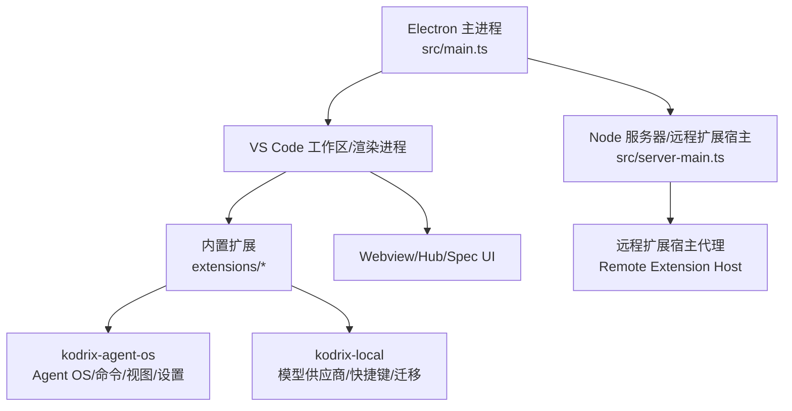
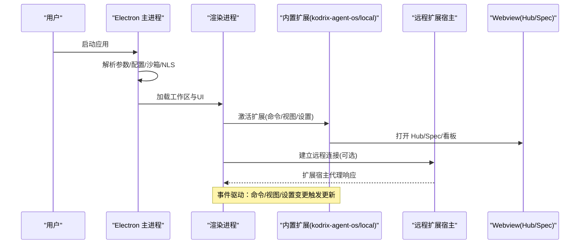
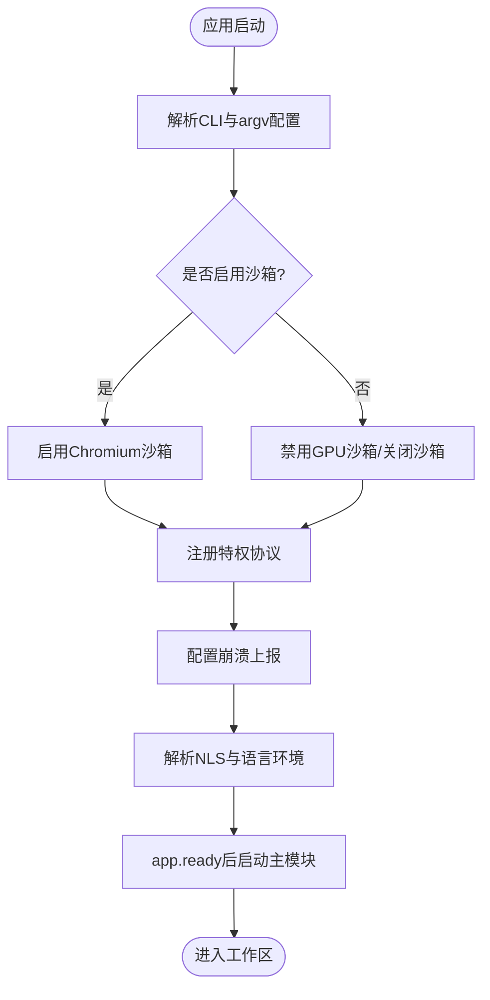
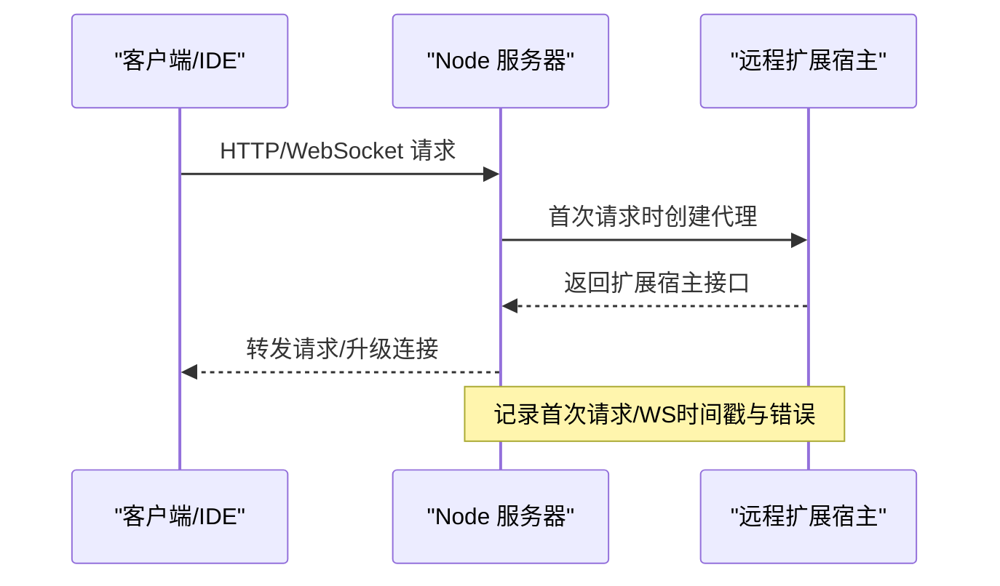
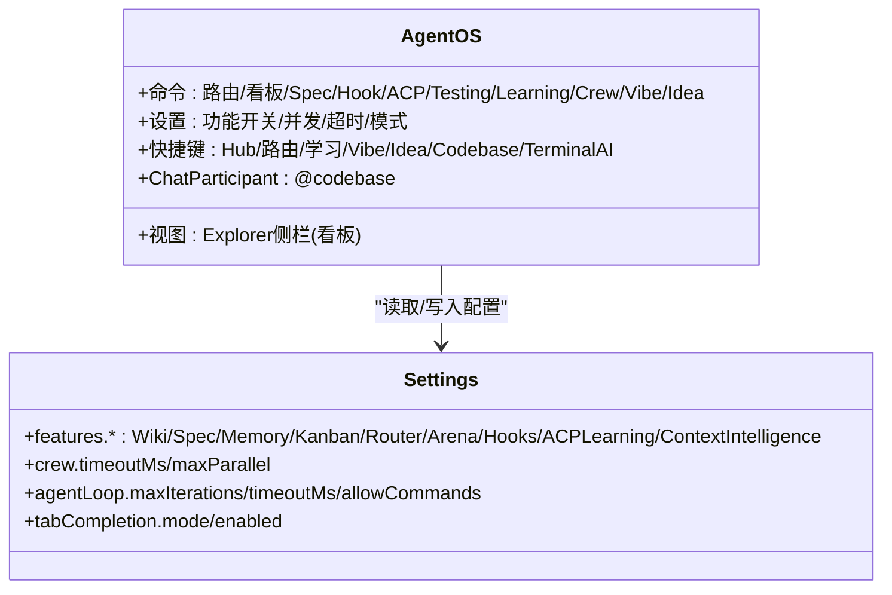
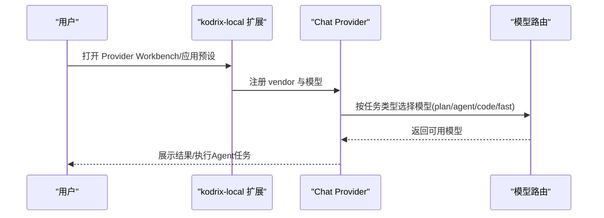
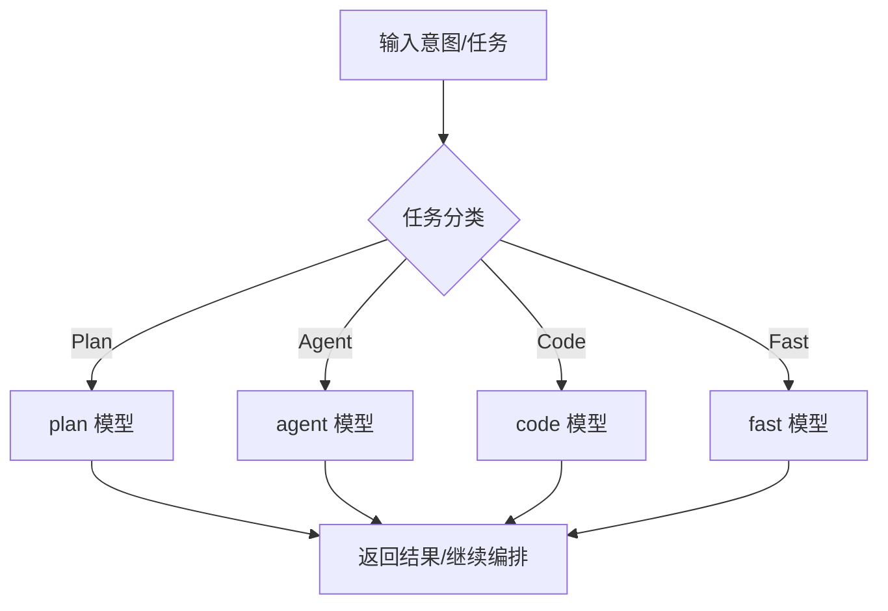
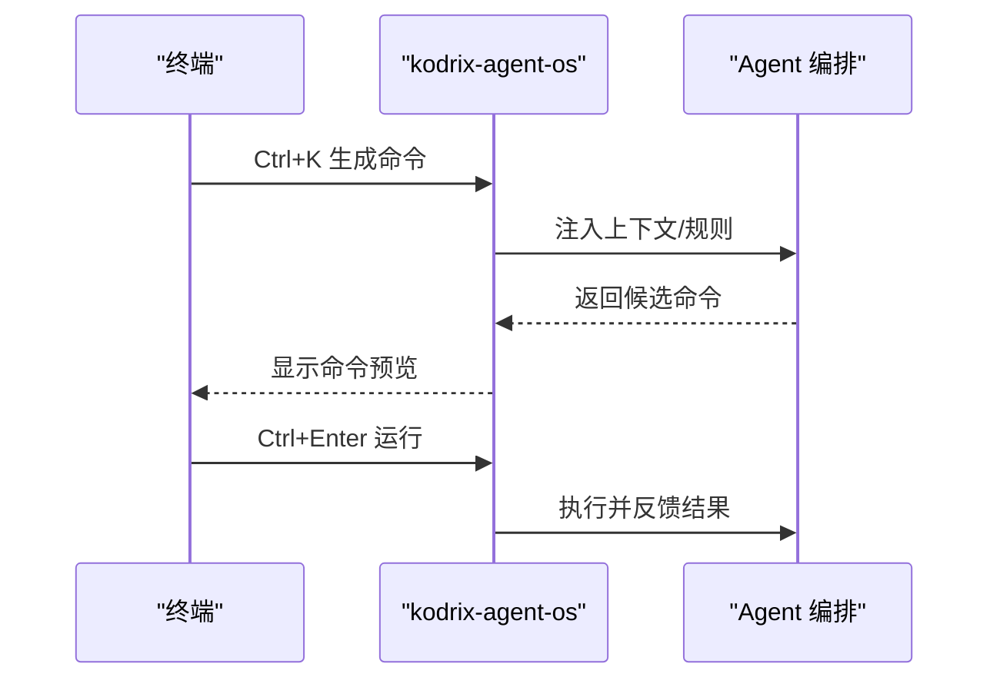
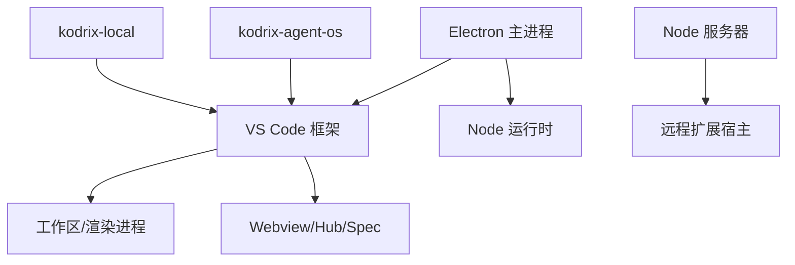

# 架构设计

<cite>
**本文引用的文件**
- [README.md](file://README.md)
- [package.json](file://package.json)
- [src/main.ts](file://src/main.ts)
- [src/server-main.ts](file://src/server-main.ts)
- [extensions/kodrix-agent-os/package.json](file://extensions/kodrix-agent-os/package.json)
- [extensions/kodrix-local/package.json](file://extensions/kodrix-local/package.json)
- [docs/项目非常有必要新实现的核心功能总报告.md](file://docs/项目非常有必要新实现的核心功能总报告.md)
</cite>

## 目录
1. [简介](#简介)
2. [项目结构](#项目结构)
3. [核心组件](#核心组件)
4. [架构总览](#架构总览)
5. [详细组件分析](#详细组件分析)
6. [依赖关系分析](#依赖关系分析)
7. [性能考虑](#性能考虑)
8. [故障排查指南](#故障排查指南)
9. [结论](#结论)
10. [附录](#附录)

## 简介
Kodrix Code 是基于 VS Code / VSCodium 的 AI 原生代码编辑器，围绕“本地优先、模块化、事件驱动”的架构理念，将 Electron 主进程、渲染进程与扩展宿主进程解耦，并通过内置扩展体系（kodrix-agent-os、kodrix-local 等）提供 Agent 操作系统、代码库智能引擎、模型路由机制、终端 AI 集成等能力。其目标是让开发者在本地即可构建、调试并持续增强 AI 辅助开发体验，同时保持与上游 VS Code/VSCodium 生态兼容。

## 项目结构
仓库采用分层与特性混合的组织方式：
- src：Electron 主进程与服务器入口、引导与运行时配置、NLS、性能埋点等
- extensions：内置扩展集合，包含 kodrix-agent-os（Agent OS）、kodrix-local（本地模型与供应商管理）、以及 Copilot、Git、语言包等
- scripts：开发与打包脚本、远程/会话服务启动脚本
- build：构建系统（gulp/esbuild）与产物
- marketplace：Skill 示例与目录
- docs：产品规划、体检与审计报告
- test：单元、集成、冒烟测试

图表来源
- [src/main.ts:155-221](file://src/main.ts#L155-L221)
- [src/server-main.ts:91-147](file://src/server-main.ts#L91-L147)
- [extensions/kodrix-agent-os/package.json:23-454](file://extensions/kodrix-agent-os/package.json#L23-L454)
- [extensions/kodrix-local/package.json:23-273](file://extensions/kodrix-local/package.json#L23-L273)

章节来源
- [README.md:69-85](file://README.md#L69-L85)
- [package.json:1-100](file://package.json#L1-L100)

## 核心组件
- Electron 主进程：负责应用生命周期、沙箱与安全开关、崩溃上报、协议注册、NLS 与 argv 配置、启动 VS Code 主模块。
- Node 服务器/远程扩展宿主：以 HTTP/WebSocket 暴露远程扩展宿主代理，支持远程调试与多实例。
- 扩展宿主与 Webview：承载内置扩展与自定义 UI（Hub、Spec、看板、设置面板）。
- 内置扩展：
  - kodrix-agent-os：Agent OS、命令、视图、设置、Chat Participant、Terminal AI、Checkpoint、Crew、Learning、Codebase 索引等。
  - kodrix-local：本地/云端模型供应商配置、快捷键、迁移向导、Provider Workbench。
- 模型路由与 Agent 编排：通过设置与命令暴露多模型路由、Arena 对比、智能路由、后台任务与子 Agent。
- 终端 AI 集成：在终端中生成并运行命令，结合 Agent 上下文与规则。

章节来源
- [src/main.ts:155-221](file://src/main.ts#L155-L221)
- [src/server-main.ts:91-147](file://src/server-main.ts#L91-L147)
- [extensions/kodrix-agent-os/package.json:23-454](file://extensions/kodrix-agent-os/package.json#L23-L454)
- [extensions/kodrix-local/package.json:23-273](file://extensions/kodrix-local/package.json#L23-L273)

## 架构总览
Kodrix Code 采用“主进程 + 渲染进程 + 扩展宿主 + 内置扩展”的分层架构，关键交互如下：
- 主进程启动后加载 NLS、配置、安全策略，再动态导入 VS Code 主模块。
- 渲染进程通过扩展 API 与内置扩展通信；Webview 承载 Hub/Spec 等界面。
- 远程服务器进程提供扩展宿主代理，支持远程场景。
- 内置扩展通过 contributes（命令、视图、设置、快捷键、Chat Participant 等）接入工作区。

图表来源
- [src/main.ts:155-221](file://src/main.ts#L155-L221)
- [src/server-main.ts:91-147](file://src/server-main.ts#L91-L147)
- [extensions/kodrix-agent-os/package.json:23-454](file://extensions/kodrix-agent-os/package.json#L23-L454)
- [extensions/kodrix-local/package.json:23-273](file://extensions/kodrix-local/package.json#L23-L273)

## 详细组件分析

### Electron 主进程（启动与安全）
- 职责：解析命令行与 argv 配置、启用沙箱、注册协议、配置崩溃上报、初始化 NLS、加载主模块。
- 关键点：
  - 安全开关：根据参数决定是否启用 Chromium 沙箱与 GPU 沙箱。
  - 协议注册：vscode-webview、vscode-file 等特权协议。
  - 崩溃上报：支持本地目录或 AppCenter 上传。
  - 启动流程：app.ready 后并行准备缓存与 NLS，再启动主模块。

图表来源
- [src/main.ts:36-54](file://src/main.ts#L36-L54)
- [src/main.ts:96-113](file://src/main.ts#L96-L113)
- [src/main.ts:155-221](file://src/main.ts#L155-L221)
- [src/main.ts:509-599](file://src/main.ts#L509-L599)

章节来源
- [src/main.ts:36-54](file://src/main.ts#L36-L54)
- [src/main.ts:96-113](file://src/main.ts#L96-L113)
- [src/main.ts:155-221](file://src/main.ts#L155-L221)
- [src/main.ts:509-599](file://src/main.ts#L509-L599)

### Node 服务器/远程扩展宿主
- 职责：监听 HTTP/WebSocket，提供远程扩展宿主代理；支持端口范围选择、IP 输出、退出诊断。
- 关键点：
  - 首次请求/WebSocket 时懒加载远程宿主。
  - 错误处理与优雅退出。
  - 诊断日志写入 logsPath，便于定位异常退出。

图表来源
- [src/server-main.ts:91-147](file://src/server-main.ts#L91-L147)
- [src/server-main.ts:176-282](file://src/server-main.ts#L176-L282)

章节来源
- [src/server-main.ts:91-147](file://src/server-main.ts#L91-L147)
- [src/server-main.ts:176-282](file://src/server-main.ts#L176-L282)

### 内置扩展：kodrix-agent-os（Agent OS）
- 职责：提供 Agent OS 能力，包括命令、视图、设置、Chat Participant、Terminal AI、Checkpoint、Crew、Learning、Codebase 索引等。
- 关键点：
  - 通过 contributes 暴露大量命令与视图（如 Agent 看板、Spec 工作台、Hub、Learning 仪表盘）。
  - 提供 Chat Participant（@codebase）用于自然语言代码问答。
  - 提供设置项控制功能开关（如智能路由、Arena、Crew、Terminal AI、语义记忆等）。
  - 快捷键绑定常用操作（如 Ctrl+Shift+H 打开 Hub、Ctrl+K 终端 AI 提示）。

图表来源
- [extensions/kodrix-agent-os/package.json:23-454](file://extensions/kodrix-agent-os/package.json#L23-L454)
- [extensions/kodrix-agent-os/package.json:538-800](file://extensions/kodrix-agent-os/package.json#L538-L800)

章节来源
- [extensions/kodrix-agent-os/package.json:23-454](file://extensions/kodrix-agent-os/package.json#L23-L454)
- [extensions/kodrix-agent-os/package.json:538-800](file://extensions/kodrix-agent-os/package.json#L538-L800)

### 内置扩展：kodrix-local（本地模型与供应商）
- 职责：本地大模型与云端 API 供应商配置、Cursor 风格快捷键、一键导入、Provider Workbench。
- 关键点：
  - 声明 languageModelChatProviders（vendor: kodrix），供 Chat 使用。
  - 提供迁移、欢迎向导、Composer、Plan、Agents 窗口等命令。
  - 设置项包含 modelRoutes、Tab 补全、Background/Cloud Agents、Codebase Index 等开关。
  - 快捷键：Ctrl+L 打开 Chat、Ctrl+K 行内编辑、Ctrl+Shift+A 打开 Agents 窗口等。

图表来源
- [extensions/kodrix-local/package.json:23-273](file://extensions/kodrix-local/package.json#L23-L273)

章节来源
- [extensions/kodrix-local/package.json:23-273](file://extensions/kodrix-local/package.json#L23-L273)

### 模型路由机制
- 目标：按任务类型（plan/agent/code/fast）自动选择模型，支持 BYOK 与多供应商预设。
- 实现要点：
  - 通过设置项 kodrix.modelRoutes 指定各任务的模型 ID。
  - 与 kodrix-local 的 provider 管理联动，确保模型可用。
  - 与 Agent 编排（Crew/Subagent/Background）协作，为不同阶段分配合适模型。

图表来源
- [extensions/kodrix-local/package.json:158-171](file://extensions/kodrix-local/package.json#L158-L171)
- [extensions/kodrix-agent-os/package.json:767-776](file://extensions/kodrix-agent-os/package.json#L767-L776)

章节来源
- [extensions/kodrix-local/package.json:158-171](file://extensions/kodrix-local/package.json#L158-L171)
- [extensions/kodrix-agent-os/package.json:767-776](file://extensions/kodrix-agent-os/package.json#L767-L776)

### 终端 AI 集成
- 目标：在终端中使用自然语言生成命令并运行，结合 Agent 上下文与规则。
- 关键点：
  - 快捷键：Ctrl+K 生成命令、Ctrl+Enter 运行。
  - 通过命令与状态机管理 pending 任务。
  - 与 Agent OS 的规则、Memory、Learning 联动，提升命令质量。

图表来源
- [extensions/kodrix-agent-os/package.json:320-328](file://extensions/kodrix-agent-os/package.json#L320-L328)
- [extensions/kodrix-agent-os/package.json:500-510](file://extensions/kodrix-agent-os/package.json#L500-L510)

章节来源
- [extensions/kodrix-agent-os/package.json:320-328](file://extensions/kodrix-agent-os/package.json#L320-L328)
- [extensions/kodrix-agent-os/package.json:500-510](file://extensions/kodrix-agent-os/package.json#L500-L510)

### 扩展点机制与插件体系
- 扩展点：
  - 命令、视图、菜单、快捷键、设置、Chat Participant、Settings Editor Renderer。
  - 通过 package.json 的 contributes 声明，VS Code 工作区自动发现与激活。
- 插件体系：
  - 内置扩展作为第一方插件，提供 Agent OS、本地模型、Copilot 等能力。
  - 可通过 Skill 市场与 catalog 扩展能力（文档提及 marketplace/packages）。
- 设计权衡：
  - 本地优先：默认启用本地索引与记忆，减少对外部依赖。
  - 模块化：每个扩展聚焦单一职责，通过设置与命令组合能力。
  - 事件驱动：命令/视图/设置变更触发 UI 与状态更新。

章节来源
- [extensions/kodrix-agent-os/package.json:23-454](file://extensions/kodrix-agent-os/package.json#L23-L454)
- [extensions/kodrix-local/package.json:23-273](file://extensions/kodrix-local/package.json#L23-L273)
- [README.md:22-34](file://README.md#L22-L34)

## 依赖关系分析
- 运行时依赖：
  - Electron 主进程依赖 Electron API 与 Node 标准库。
  - 服务器进程依赖 Node http/ws 与远程扩展宿主。
  - 内置扩展依赖 VS Code 扩展 API 与 settings/editor 渲染能力。
- 外部依赖：
  - 模型供应商 SDK（如 Anthropic/OpenAI 等，见 package.json 依赖）。
  - 终端与 xterm 相关组件。
  - 遥测与诊断工具（Microsoft 1DS、telemetry-extractor）。

图表来源
- [package.json:101-167](file://package.json#L101-L167)
- [src/main.ts:155-221](file://src/main.ts#L155-L221)
- [src/server-main.ts:91-147](file://src/server-main.ts#L91-L147)

章节来源
- [package.json:101-167](file://package.json#L101-L167)
- [src/main.ts:155-221](file://src/main.ts#L155-L221)
- [src/server-main.ts:91-147](file://src/server-main.ts#L91-L147)

## 性能考虑
- 启动优化：
  - 主进程懒加载主模块，并行准备缓存与 NLS。
  - 服务器首次请求/WS 时懒加载远程宿主。
- 运行时优化：
  - 非关键 Webview 延迟加载，不可见释放资源。
  - 增量索引与缓存（Wiki、Learning、Codebase 索引）。
  - 限制 Agent 推理循环迭代次数与超时，防止失控。
- 可观测性：
  - 性能标记（perf.mark）记录启动与首次请求时间。
  - 服务器退出诊断日志，便于定位异常。

章节来源
- [src/main.ts:155-221](file://src/main.ts#L155-L221)
- [src/server-main.ts:91-147](file://src/server-main.ts#L91-L147)
- [src/server-main.ts:176-282](file://src/server-main.ts#L176-L282)
- [extensions/kodrix-agent-os/package.json:777-786](file://extensions/kodrix-agent-os/package.json#L777-L786)

## 故障排查指南
- 启动问题：
  - 检查 argv.json 是否存在与语法是否正确；若缺失会自动创建默认配置。
  - 确认沙箱与 GPU 沙箱开关是否符合预期。
  - 查看崩溃上报目录或 AppCenter 配置。
- 服务器问题：
  - 检查端口占用与范围选择逻辑。
  - 查看 server-exit-diagnostics.log 中的退出原因与信号。
- 扩展问题：
  - 确认扩展 activationEvents 与 contributes 是否正确。
  - 检查设置项与快捷键冲突。
  - 使用命令面板与视图刷新状态。

章节来源
- [src/main.ts:409-478](file://src/main.ts#L409-L478)
- [src/main.ts:509-599](file://src/main.ts#L509-L599)
- [src/server-main.ts:176-282](file://src/server-main.ts#L176-L282)

## 结论
Kodrix Code 通过清晰的三层架构（主进程、渲染进程、扩展宿主）与模块化扩展体系，实现了“本地优先、事件驱动、可扩展”的 AI 原生编辑器。Agent OS、代码库智能引擎、模型路由与终端 AI 集成为开发者提供了强大的本地化 AI 能力。未来可通过共享 Event Bus、统一状态 Store、Learning 2.0 与 Crew 协作进一步提升智能化与可维护性。

## 附录
- 快速开始与构建：参考 README 与 package.json 脚本。
- 功能路线图：参考“项目非常有必要新实现的核心功能总报告”，明确 P0/P1/P2 优先级与交付节奏。

章节来源
- [README.md:36-104](file://README.md#L36-L104)
- [package.json:12-100](file://package.json#L12-L100)
- [docs/项目非常有必要新实现的核心功能总报告.md:21-172](file://docs/项目非常有必要新实现的核心功能总报告.md#L21-L172)