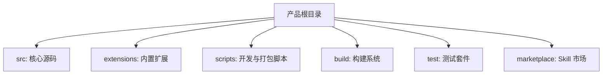
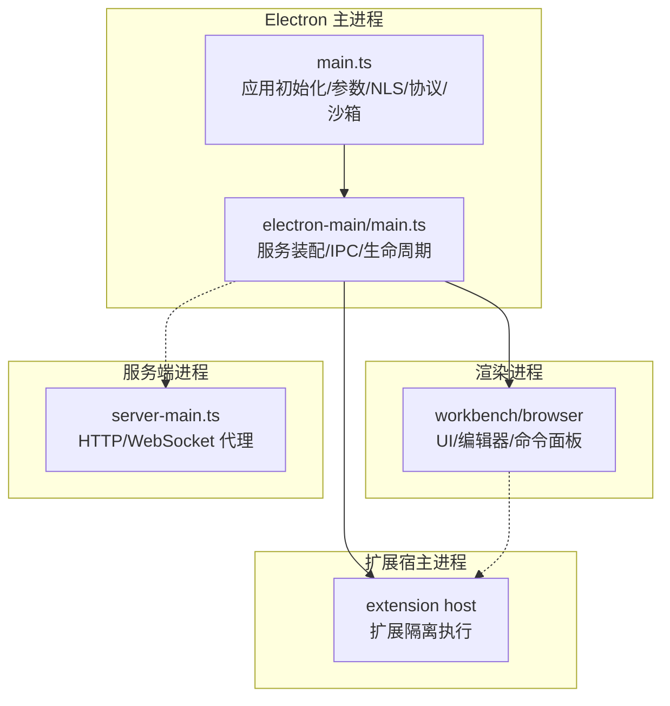
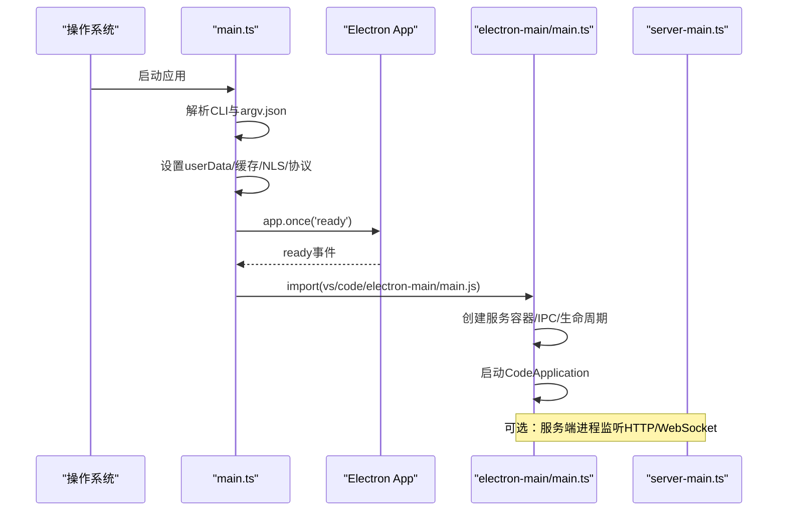
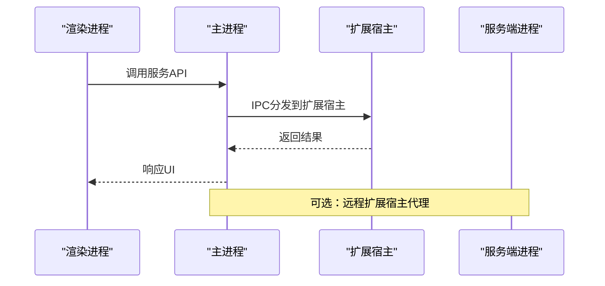
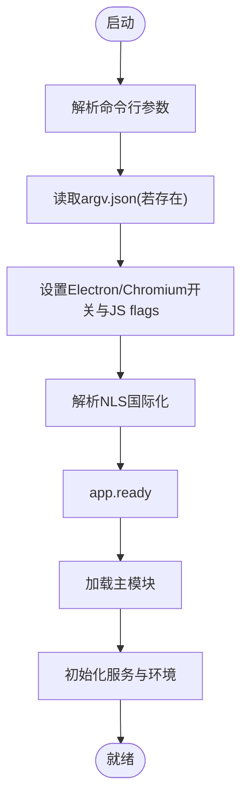
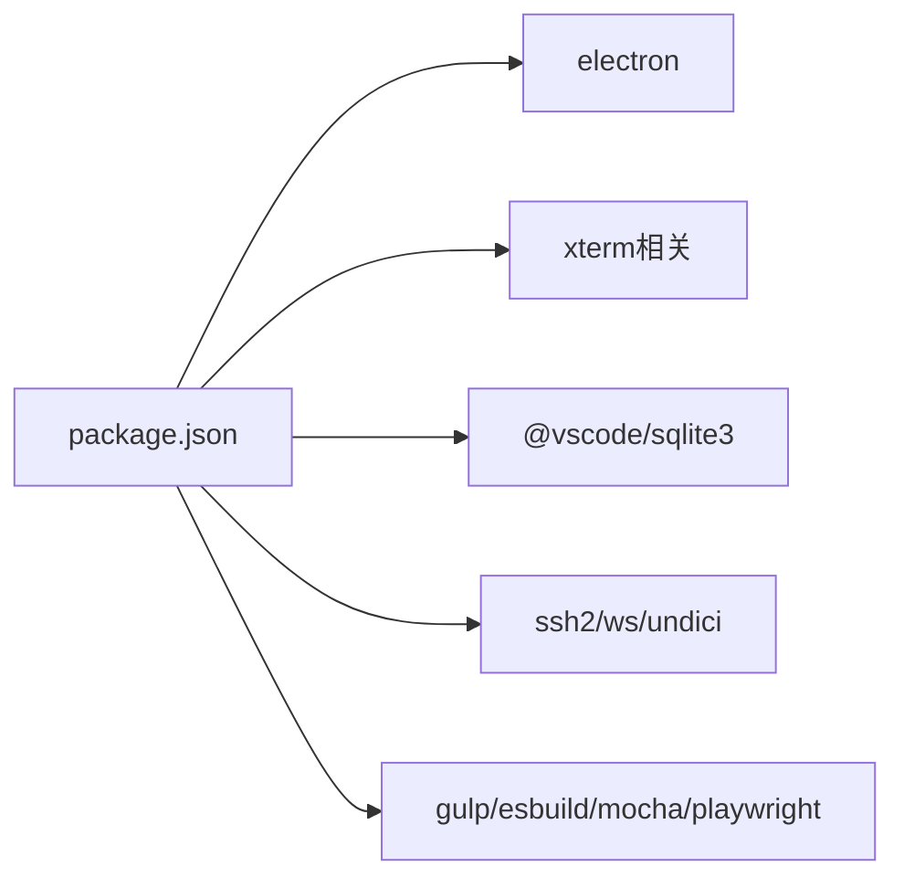

# 系统架构概览

<cite>
**本文引用的文件**   
- [README.md](file://README.md)
- [package.json](file://package.json)
- [src/main.ts](file://src/main.ts)
- [src/cli.ts](file://src/cli.ts)
- [src/server-main.ts](file://src/server-main.ts)
- [src/vs/code/electron-main/main.ts](file://src/vs/code/electron-main/main.ts)
</cite>

## 目录
1. [引言](#引言)
2. [项目结构](#项目结构)
3. [核心组件](#核心组件)
4. [架构总览](#架构总览)
5. [详细组件分析](#详细组件分析)
6. [依赖关系分析](#依赖关系分析)
7. [性能与可维护性考量](#性能与可维护性考量)
8. [故障排查指南](#故障排查指南)
9. [结论](#结论)

## 引言
Kodrix Code 是基于 VS Code / VSCodium 的 AI 原生代码编辑器，采用 Electron 作为桌面运行时，结合 Node.js 服务进程、扩展宿主与渲染进程，形成“本地优先、模块化、事件驱动”的系统架构。其关键设计原则包括：
- 本地优先策略：默认在本地运行工作区、索引、Agent 能力与数据；远程/云端能力按需接入。
- 模块化架构：通过服务注册与依赖注入组织主进程、渲染进程、扩展宿主等模块，降低耦合。
- 事件驱动模式：以生命周期事件、IPC 通道和平台事件协调多进程协作。

本概览面向架构师，提供系统级技术洞察，涵盖启动流程、进程间通信、配置加载顺序、跨平台兼容性与性能优化权衡。

## 项目结构
仓库采用分层与特性混合的组织方式：
- src：核心源码（Electron 主入口、CLI、服务端、VS Code 框架）
- extensions：内置扩展（含 kodrix-*、copilot、git 等）
- scripts：开发、打包、修复脚本
- build：构建系统与产物
- test：单元、集成、冒烟测试
- marketplace：Skill 示例包与目录

**章节来源**
- [README.md:69-85](file://README.md#L69-L85)

## 核心组件
- Electron 主进程入口：负责应用初始化、命令行参数解析、NLS 国际化、Crash Reporter、协议注册、沙箱与安全开关、userData 路径设置，并引导加载主模块。
- CLI 入口：用于命令行工具与服务器管理，支持 portable 模式与 NLS 初始化。
- 服务端入口：Node.js HTTP/WebSocket 服务，处理远程扩展宿主代理请求，支持端口范围选择与诊断日志。
- Electron 主模块：实例单例控制、服务容器创建、IPC 通道建立、用户数据与策略、配置、主题、签名、隧道、协议等服务的装配与生命周期管理。

**章节来源**
- [src/main.ts:10-221](file://src/main.ts#L10-L221)
- [src/cli.ts:6-26](file://src/cli.ts#L6-L26)
- [src/server-main.ts:6-155](file://src/server-main.ts#L6-L155)
- [src/vs/code/electron-main/main.ts:82-164](file://src/vs/code/electron-main/main.ts#L82-L164)

## 架构总览
Kodrix Code 的运行由多个进程协同完成：
- 主进程（Electron main）：应用生命周期、安全与沙箱、协议、用户数据、策略、IPC 通道、扩展与渲染进程调度。
- 渲染进程（Browser/Workbench）：UI 与编辑器体验，消费主进程提供的服务与 API。
- 扩展宿主进程（Extension Host）：隔离执行扩展逻辑，通过 IPC 与主进程通信。
- 服务端进程（Server）：Node.js HTTP/WebSocket 服务，承载远程扩展宿主代理，供远程客户端连接。

**图表来源**
- [src/main.ts:10-221](file://src/main.ts#L10-L221)
- [src/vs/code/electron-main/main.ts:82-164](file://src/vs/code/electron-main/main.ts#L82-L164)
- [src/server-main.ts:6-155](file://src/server-main.ts#L6-L155)

## 详细组件分析

### 启动流程与配置加载顺序
Electron 主进程启动的关键步骤如下：
1. 解析命令行参数与 argv.json 配置，设置 Electron/Chromium 开关与 JS flags。
2. 确定 userData 路径、code cache 路径、NLS 国际化配置。
3. 注册自定义协议（vscode-webview/file/remote-resource）。
4. 在 app.ready 后加载主模块 vs/code/electron-main/main.js。
5. 主模块创建服务容器（环境、日志、文件、状态、策略、配置、主题、签名、隧道、协议等），并启动 CodeApplication。
6. 通过 Node IPC 建立主进程通道，实现单实例控制与二次实例转发。

**图表来源**
- [src/main.ts:36-221](file://src/main.ts#L36-L221)
- [src/vs/code/electron-main/main.ts:101-164](file://src/vs/code/electron-main/main.ts#L101-L164)
- [src/server-main.ts:91-147](file://src/server-main.ts#L91-L147)

**章节来源**
- [src/main.ts:36-221](file://src/main.ts#L36-L221)
- [src/vs/code/electron-main/main.ts:101-164](file://src/vs/code/electron-main/main.ts#L101-L164)

### 进程间通信机制
- 主进程通过 Node IPC 建立主通道，实现单实例控制与二次实例转发。
- 主进程向渲染进程暴露服务通道（如 launch、diagnostics），并通过 ProxyChannel 将服务映射为远程接口。
- 扩展宿主进程通过 IPC 与主进程通信，隔离执行扩展逻辑。
- 服务端进程提供 HTTP/WebSocket 接口，供远程扩展宿主代理使用。

**图表来源**
- [src/vs/code/electron-main/main.ts:351-479](file://src/vs/code/electron-main/main.ts#L351-L479)
- [src/server-main.ts:91-147](file://src/server-main.ts#L91-L147)

**章节来源**
- [src/vs/code/electron-main/main.ts:351-479](file://src/vs/code/electron-main/main.ts#L351-L479)
- [src/server-main.ts:91-147](file://src/server-main.ts#L91-L147)

### 配置加载顺序
- 命令行参数优先级高于 argv.json。
- argv.json 在应用 ready 前同步读取，缺失时生成默认模板。
- NLS 国际化在 early 阶段解析，并在环境变量中传递。
- 主模块再根据 environment/service 层加载用户配置、策略、主题等。

**图表来源**
- [src/main.ts:234-378](file://src/main.ts#L234-L378)
- [src/main.ts:409-498](file://src/main.ts#L409-L498)
- [src/main.ts:193-221](file://src/main.ts#L193-L221)

**章节来源**
- [src/main.ts:234-378](file://src/main.ts#L234-L378)
- [src/main.ts:409-498](file://src/main.ts#L409-L498)
- [src/main.ts:193-221](file://src/main.ts#L193-L221)

### 关键技术决策与设计权衡
- 为什么选择 Electron：复用 Web 生态与 Chromium 内核，快速构建跨平台 IDE；同时提供 Node.js 能力与原生系统集成。
- 跨平台兼容性：通过 platform 分支、UNC 路径支持、XDG 规范、平台策略与受管设置适配 Windows/macOS/Linux。
- 性能优化：V8 code cache、延迟日志初始化、WebGL 上下文上限提升、GPU 通道异步建立、沙箱与硬件加速开关可控。
- 安全与稳定性：Crash Reporter、沙箱、协议白名单、策略与受管设置、Inno Setup 更新互斥检测。

**章节来源**
- [README.md:10-104](file://README.md#L10-L104)
- [src/main.ts:36-221](file://src/main.ts#L36-L221)
- [src/vs/code/electron-main/main.ts:166-295](file://src/vs/code/electron-main/main.ts#L166-L295)

## 依赖关系分析
- package.json 定义主入口 main 指向 out/main.js，表明 Electron 主进程入口。
- 依赖项包含 Electron、xterm、sqlite3、ssh2、ws 等，支撑终端、数据库、SSH、WebSocket 等能力。
- devDependencies 包含构建工具（gulp、esbuild）、测试框架（mocha、playwright）与类型检查工具。

**图表来源**
- [package.json:1-100](file://package.json#L1-L100)
- [package.json:101-272](file://package.json#L101-L272)

**章节来源**
- [package.json:1-100](file://package.json#L1-L100)
- [package.json:101-272](file://package.json#L101-L272)

## 性能与可维护性考量
- 启动性能：V8 code cache、延迟日志初始化、按需加载主模块与服务。
- 渲染性能：提升 WebGL 上下文上限、禁用不必要的 Blink 特性、启用 GPU 通道异步建立。
- 可维护性：服务容器与依赖注入、统一错误处理、生命周期事件、平台差异抽象。
- 可扩展性：扩展宿主隔离、协议与 IPC 通道、策略与受管设置解耦。

[本节为通用指导，不直接分析具体文件]

## 故障排查指南
- 启动卡死或权限问题：检查 userData 与扩展路径是否可写；查看主进程锁文件与 IPC 通道占用情况。
- 中文语言包问题：确认 NLS 配置与 zh-cn/zh-tw 区域映射是否正确。
- 远程服务端口冲突：服务端进程支持端口范围选择，确保可用端口。
- 崩溃报告：启用 Crash Reporter 并指定本地目录或上传 URL，便于定位问题。

**章节来源**
- [src/vs/code/electron-main/main.ts:481-505](file://src/vs/code/electron-main/main.ts#L481-L505)
- [src/server-main.ts:284-348](file://src/server-main.ts#L284-L348)
- [src/main.ts:509-599](file://src/main.ts#L509-L599)

## 结论
Kodrix Code 以 Electron 为主运行时，结合 Node.js 服务端与扩展宿主，构建了“本地优先、模块化、事件驱动”的 IDE 架构。通过严格的配置加载顺序、完善的 IPC 机制与跨平台适配，系统在性能、安全与可维护性之间取得平衡。对架构师而言，建议重点关注：
- 主进程服务装配与生命周期管理
- IPC 通道的职责边界与错误恢复
- 扩展宿主的隔离与资源管理
- 远程服务的安全与性能调优

[本节为总结性内容，不直接分析具体文件]