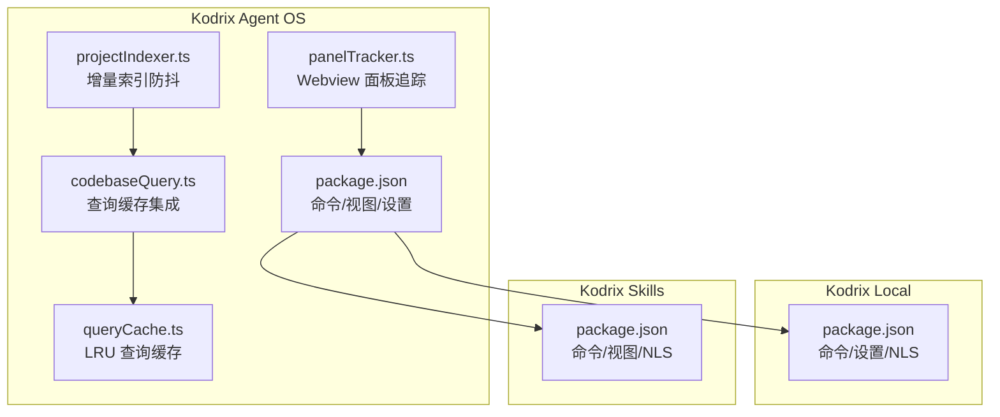
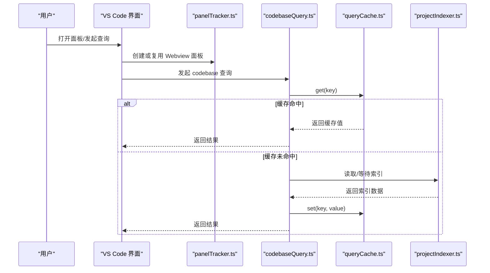
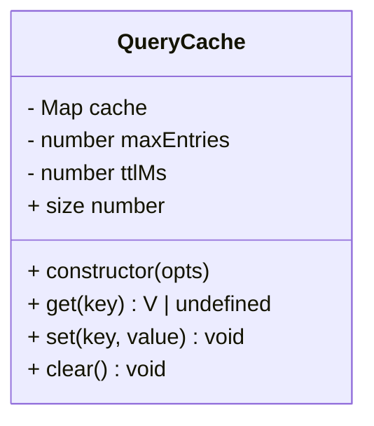
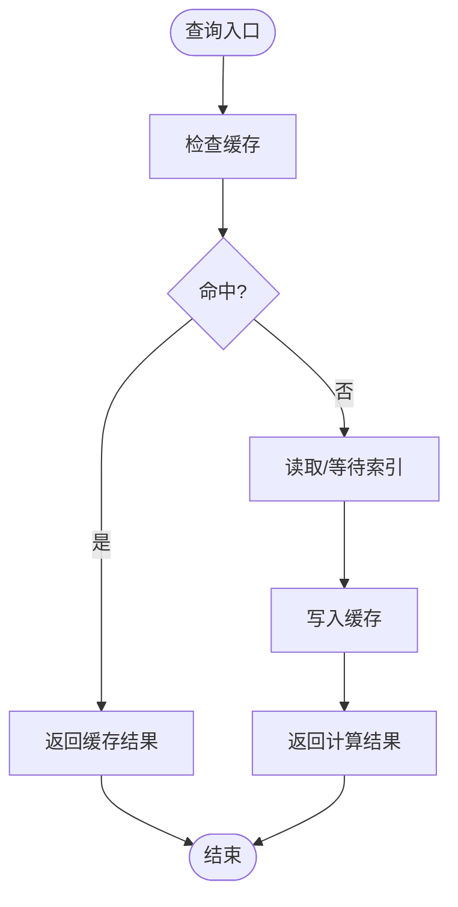
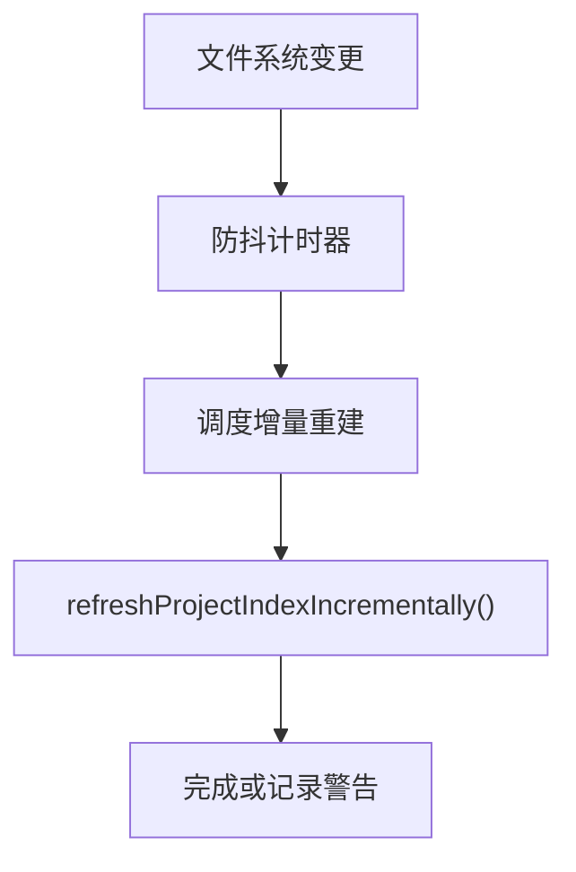
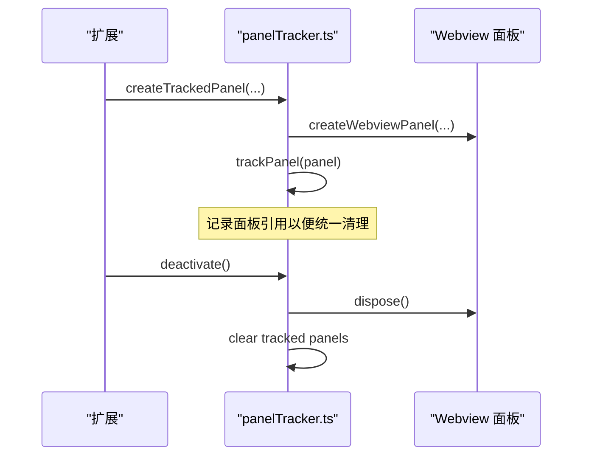
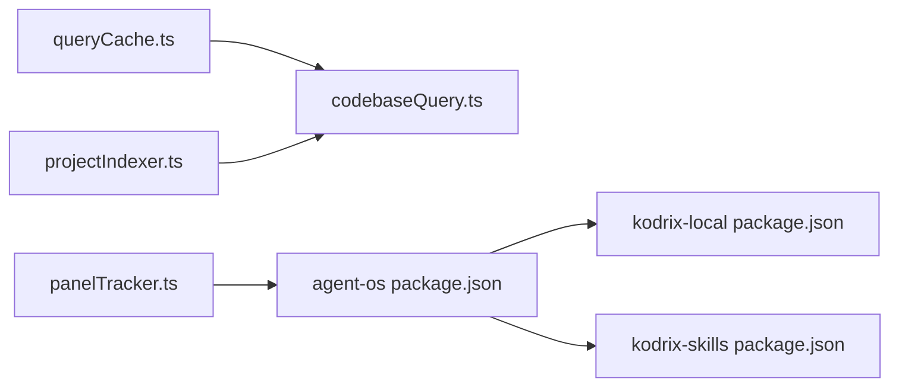

# 性能优化组件

<cite>
**本文引用的文件**   
- [extensions/kodrix-agent-os/src/utils/queryCache.ts](file://extensions/kodrix-agent-os/src/utils/queryCache.ts)
- [extensions/kodrix-agent-os/src/codebase/codebaseQuery.ts](file://extensions/kodrix-agent-os/src/codebase/codebaseQuery.ts)
- [extensions/kodrix-agent-os/src/codebase/projectIndexer.ts](file://extensions/kodrix-agent-os/src/codebase/projectIndexer.ts)
- [extensions/kodrix-agent-os/src/utils/panelTracker.ts](file://extensions/kodrix-agent-os/src/utils/panelTracker.ts)
- [extensions/kodrix-agent-os/package.json](file://extensions/kodrix-agent-os/package.json)
- [extensions/kodrix-local/package.json](file://extensions/kodrix-local/package.json)
- [extensions/kodrix-skills/package.json](file://extensions/kodrix-skills/package.json)
- [docs/项目新发现待修复的缺陷问题审计总报告.md](file://docs/项目新发现待修复的缺陷问题审计总报告.md)
</cite>

## 目录
1. [引言](#引言)
2. [项目结构](#项目结构)
3. [核心组件](#核心组件)
4. [架构总览](#架构总览)
5. [详细组件分析](#详细组件分析)
6. [依赖关系分析](#依赖关系分析)
7. [性能考量](#性能考量)
8. [故障排查指南](#故障排查指南)
9. [结论](#结论)

## 引言
本文件聚焦 Kodrix 仓库中与“性能优化”直接相关的组件与实现，包括：
- Webview 面板复用与延迟销毁
- LRU 查询缓存（TTL + 最大条目）
- 索引增量防抖
- Code Lens for Agents（代码级交互入口）
- NLS 本地化对扩展启动与渲染路径的影响

这些能力主要分布在 `kodrix-agent-os` 扩展中，并通过 VS Code 扩展配置、命令与视图贡献点暴露给用户。

## 项目结构
围绕性能优化的关键落点如下：
- `kodrix-agent-os`
  - `src/utils/queryCache.ts`：通用 LRU 查询缓存
  - `src/codebase/codebaseQuery.ts`：集成查询缓存、按索引状态清理缓存
  - `src/codebase/projectIndexer.ts`：文件变更监听 + 增量重建防抖
  - `src/utils/panelTracker.ts`：Webview 面板统一生命周期管理
  - `package.json`：命令、视图、设置等用户面文案通过 `%key%` 引用，配合 NLS 文件完成本地化
- `kodrix-local` / `kodrix-skills`
  - `package.json`：同样使用 `%key%` 与 `localizations` 声明中文翻译包

**图示来源**
- [extensions/kodrix-agent-os/src/utils/queryCache.ts:1-38](file://extensions/kodrix-agent-os/src/utils/queryCache.ts#L1-L38)
- [extensions/kodrix-agent-os/src/codebase/codebaseQuery.ts:27-40](file://extensions/kodrix-agent-os/src/codebase/codebaseQuery.ts#L27-L40)
- [extensions/kodrix-agent-os/src/codebase/projectIndexer.ts:1591-1617](file://extensions/kodrix-agent-os/src/codebase/projectIndexer.ts#L1591-L1617)
- [extensions/kodrix-agent-os/src/utils/panelTracker.ts:63-89](file://extensions/kodrix-agent-os/src/utils/panelTracker.ts#L63-L89)
- [extensions/kodrix-agent-os/package.json:23-68](file://extensions/kodrix-agent-os/package.json#L23-L68)
- [extensions/kodrix-local/package.json:23-41](file://extensions/kodrix-local/package.json#L23-L41)
- [extensions/kodrix-skills/package.json:19-32](file://extensions/kodrix-skills/package.json#L19-L32)

**章节来源**
- [extensions/kodrix-agent-os/src/utils/queryCache.ts:1-38](file://extensions/kodrix-agent-os/src/utils/queryCache.ts#L1-L38)
- [extensions/kodrix-agent-os/src/codebase/codebaseQuery.ts:27-40](file://extensions/kodrix-agent-os/src/codebase/codebaseQuery.ts#L27-L40)
- [extensions/kodrix-agent-os/src/codebase/projectIndexer.ts:1591-1617](file://extensions/kodrix-agent-os/src/codebase/projectIndexer.ts#L1591-L1617)
- [extensions/kodrix-agent-os/src/utils/panelTracker.ts:63-89](file://extensions/kodrix-agent-os/src/utils/panelTracker.ts#L63-L89)
- [extensions/kodrix-agent-os/package.json:23-68](file://extensions/kodrix-agent-os/package.json#L23-L68)
- [extensions/kodrix-local/package.json:23-41](file://extensions/kodrix-local/package.json#L23-L41)
- [extensions/kodrix-skills/package.json:19-32](file://extensions/kodrix-skills/package.json#L19-L32)

## 核心组件
- LRU 查询缓存（QueryCache）
  - 支持 TTL 过期与最大条目数限制；命中时更新访问顺序，保证最近最少使用淘汰策略。
- 查询缓存集成（codebaseQuery）
  - 为查询、符号、依赖、被依赖等结果建立独立缓存实例；在索引构建完成后清空缓存，避免脏数据。
- 索引增量防抖（projectIndexer）
  - 文件系统事件触发后，延迟执行增量重建，避免频繁全量重建导致 UI 抖动与 IO 压力。
- Webview 面板追踪（panelTracker）
  - 统一管理 Webview 面板创建、追踪与批量销毁，减少重复创建与资源泄漏。
- NLS 本地化
  - 三扩展通过 `package.nls.json` 与 `package.nls.zh-cn.json` 提供多语言文案，降低硬编码字符串带来的维护成本。

**章节来源**
- [extensions/kodrix-agent-os/src/utils/queryCache.ts:1-38](file://extensions/kodrix-agent-os/src/utils/queryCache.ts#L1-L38)
- [extensions/kodrix-agent-os/src/codebase/codebaseQuery.ts:27-40](file://extensions/kodrix-agent-os/src/codebase/codebaseQuery.ts#L27-L40)
- [extensions/kodrix-agent-os/src/codebase/projectIndexer.ts:1591-1617](file://extensions/kodrix-agent-os/src/codebase/projectIndexer.ts#L1591-L1617)
- [extensions/kodrix-agent-os/src/utils/panelTracker.ts:63-89](file://extensions/kodrix-agent-os/src/utils/panelTracker.ts#L63-L89)
- [extensions/kodrix-agent-os/package.json:56-68](file://extensions/kodrix-agent-os/package.json#L56-L68)
- [extensions/kodrix-local/package.json:29-41](file://extensions/kodrix-local/package.json#L29-L41)
- [extensions/kodrix-skills/package.json:20-32](file://extensions/kodrix-skills/package.json#L20-L32)

## 架构总览
下图展示性能优化相关组件之间的协作关系：查询请求先走缓存；未命中则读取索引；索引由文件 watcher 驱动增量重建；所有 Webview 面板通过 tracker 统一管理。

**图示来源**
- [extensions/kodrix-agent-os/src/utils/panelTracker.ts:63-89](file://extensions/kodrix-agent-os/src/utils/panelTracker.ts#L63-L89)
- [extensions/kodrix-agent-os/src/codebase/codebaseQuery.ts:27-40](file://extensions/kodrix-agent-os/src/codebase/codebaseQuery.ts#L27-L40)
- [extensions/kodrix-agent-os/src/utils/queryCache.ts:1-38](file://extensions/kodrix-agent-os/src/utils/queryCache.ts#L1-L38)
- [extensions/kodrix-agent-os/src/codebase/projectIndexer.ts:1591-1617](file://extensions/kodrix-agent-os/src/codebase/projectIndexer.ts#L1591-L1617)

## 详细组件分析

### LRU 查询缓存（QueryCache）
- 设计要点
  - 基于 Map 实现有序访问；每次 get 命中后将键移至末尾，达到 LRU 效果。
  - 支持 TTL：get 时检查过期时间，过期即删除并返回空。
  - 容量控制：set 时若超过 maxEntries，删除最旧项（Map 第一个键）。
- 复杂度
  - get/set/clear：均摊 O(1)。
  - 空间：O(n)，n 为缓存条目数。
- 适用场景
  - 高频、短时有效的查询结果缓存（如 codebase 查询、符号表、依赖关系）。

**图示来源**
- [extensions/kodrix-agent-os/src/utils/queryCache.ts:1-38](file://extensions/kodrix-agent-os/src/utils/queryCache.ts#L1-L38)

**章节来源**
- [extensions/kodrix-agent-os/src/utils/queryCache.ts:1-38](file://extensions/kodrix-agent-os/src/utils/queryCache.ts#L1-L38)

### 查询缓存集成（codebaseQuery）
- 设计要点
  - 为不同查询维度分别创建缓存实例（查询、符号、依赖、被依赖）。
  - 订阅索引状态变化：当索引构建完成时清空所有缓存，确保一致性。
- 关键流程
  - 查询前尝试从缓存获取；未命中则回退到索引层；写入成功后回填缓存。

**图示来源**
- [extensions/kodrix-agent-os/src/codebase/codebaseQuery.ts:27-40](file://extensions/kodrix-agent-os/src/codebase/codebaseQuery.ts#L27-L40)

**章节来源**
- [extensions/kodrix-agent-os/src/codebase/codebaseQuery.ts:27-40](file://extensions/kodrix-agent-os/src/codebase/codebaseQuery.ts#L27-L40)

### 索引增量防抖（projectIndexer）
- 设计要点
  - 使用文件系统 watcher 监听文件增删改。
  - 每次事件触发后延迟执行增量重建，避免短时间内多次重建造成 UI 闪烁与 IO 压力。
- 参数说明
  - 防抖间隔：约 500ms（源码注释明确），平衡响应速度与稳定性。
- 风险与缓解
  - 若增量重建失败，记录警告日志，不中断后续事件处理。

**图示来源**
- [extensions/kodrix-agent-os/src/codebase/projectIndexer.ts:1591-1617](file://extensions/kodrix-agent-os/src/codebase/projectIndexer.ts#L1591-L1617)

**章节来源**
- [extensions/kodrix-agent-os/src/codebase/projectIndexer.ts:1591-1617](file://extensions/kodrix-agent-os/src/codebase/projectIndexer.ts#L1591-L1617)

### Webview 面板复用与延迟销毁（panelTracker）
- 设计要点
  - 统一创建与追踪 Webview 面板，避免重复创建。
  - 在扩展停用或工作区关闭时批量 dispose，防止进程残留。
- 生命周期
  - createTrackedPanel：创建并注册到追踪集合。
  - disposeAllTrackedPanels：遍历并释放所有面板。

**图示来源**
- [extensions/kodrix-agent-os/src/utils/panelTracker.ts:63-89](file://extensions/kodrix-agent-os/src/utils/panelTracker.ts#L63-L89)

**章节来源**
- [extensions/kodrix-agent-os/src/utils/panelTracker.ts:63-89](file://extensions/kodrix-agent-os/src/utils/panelTracker.ts#L63-L89)

### NLS 本地化与用户体验
- 三扩展均在 `package.json` 中声明 `localizations`，指向 `package.nls.zh-cn.json`。
- 命令、视图、设置描述等用户面文案通过 `%key%` 引用，便于统一管理与翻译。
- 该机制有助于减少硬编码字符串，提升可维护性与国际化体验。

**章节来源**
- [extensions/kodrix-agent-os/package.json:56-68](file://extensions/kodrix-agent-os/package.json#L56-L68)
- [extensions/kodrix-local/package.json:29-41](file://extensions/kodrix-local/package.json#L29-L41)
- [extensions/kodrix-skills/package.json:20-32](file://extensions/kodrix-skills/package.json#L20-L32)

## 依赖关系分析
- queryCache.ts 被 codebaseQuery.ts 使用，作为通用缓存基础设施。
- codebaseQuery.ts 依赖 projectIndexer.ts 提供的索引能力。
- panelTracker.ts 与 package.json 的用户面贡献点协同，保障 UI 面板生命周期。
- 三扩展的 package.json 共同遵循 NLS 模式，形成一致的本地化实践。

**图示来源**
- [extensions/kodrix-agent-os/src/utils/queryCache.ts:1-38](file://extensions/kodrix-agent-os/src/utils/queryCache.ts#L1-L38)
- [extensions/kodrix-agent-os/src/codebase/codebaseQuery.ts:27-40](file://extensions/kodrix-agent-os/src/codebase/codebaseQuery.ts#L27-L40)
- [extensions/kodrix-agent-os/src/codebase/projectIndexer.ts:1591-1617](file://extensions/kodrix-agent-os/src/codebase/projectIndexer.ts#L1591-L1617)
- [extensions/kodrix-agent-os/src/utils/panelTracker.ts:63-89](file://extensions/kodrix-agent-os/src/utils/panelTracker.ts#L63-L89)
- [extensions/kodrix-agent-os/package.json:56-68](file://extensions/kodrix-agent-os/package.json#L56-L68)
- [extensions/kodrix-local/package.json:29-41](file://extensions/kodrix-local/package.json#L29-L41)
- [extensions/kodrix-skills/package.json:20-32](file://extensions/kodrix-skills/package.json#L20-L32)

**章节来源**
- [extensions/kodrix-agent-os/src/utils/queryCache.ts:1-38](file://extensions/kodrix-agent-os/src/utils/queryCache.ts#L1-L38)
- [extensions/kodrix-agent-os/src/codebase/codebaseQuery.ts:27-40](file://extensions/kodrix-agent-os/src/codebase/codebaseQuery.ts#L27-L40)
- [extensions/kodrix-agent-os/src/codebase/projectIndexer.ts:1591-1617](file://extensions/kodrix-agent-os/src/codebase/projectIndexer.ts#L1591-L1617)
- [extensions/kodrix-agent-os/src/utils/panelTracker.ts:63-89](file://extensions/kodrix-agent-os/src/utils/panelTracker.ts#L63-L89)
- [extensions/kodrix-agent-os/package.json:56-68](file://extensions/kodrix-agent-os/package.json#L56-L68)
- [extensions/kodrix-local/package.json:29-41](file://extensions/kodrix-local/package.json#L29-L41)
- [extensions/kodrix-skills/package.json:20-32](file://extensions/kodrix-skills/package.json#L20-L32)

## 性能考量
- 查询缓存
  - 优点：显著降低重复查询开销，提升交互流畅度。
  - 注意：需结合索引重建时机清理缓存，避免脏读。
- 索引防抖
  - 优点：抑制高频文件变更导致的频繁重建，稳定 UI 与 IO。
  - 注意：防抖间隔需在响应性与稳定性之间权衡。
- Webview 复用
  - 优点：减少面板创建与销毁开销，避免进程泄漏。
  - 注意：应在扩展停用或工作区关闭时统一清理。
- NLS 本地化
  - 优点：统一文案管理，降低维护成本，改善多语言体验。
  - 注意：确保 `%key%` 与 NLS 文件一一对应，避免缺失键。

[本节为通用指导，无需具体文件引用]

## 故障排查指南
- 查询结果异常或陈旧
  - 检查索引是否已完成构建；确认索引完成后缓存是否被清空。
  - 参考：[extensions/kodrix-agent-os/src/codebase/codebaseQuery.ts:27-40](file://extensions/kodrix-agent-os/src/codebase/codebaseQuery.ts#L27-L40)
- 索引重建频繁或卡顿
  - 检查文件 watcher 是否过于敏感；确认防抖逻辑生效。
  - 参考：[extensions/kodrix-agent-os/src/codebase/projectIndexer.ts:1591-1617](file://extensions/kodrix-agent-os/src/codebase/projectIndexer.ts#L1591-L1617)
- Webview 面板未正确销毁
  - 确认是否在扩展停用或工作区关闭时调用批量 dispose。
  - 参考：[extensions/kodrix-agent-os/src/utils/panelTracker.ts:63-89](file://extensions/kodrix-agent-os/src/utils/panelTracker.ts#L63-L89)
- NLS 文案缺失或错位
  - 核对 `package.json` 中的 `%key%` 与 `package.nls.zh-cn.json` 是否一致。
  - 参考：
    - [extensions/kodrix-agent-os/package.json:56-68](file://extensions/kodrix-agent-os/package.json#L56-L68)
    - [extensions/kodrix-local/package.json:29-41](file://extensions/kodrix-local/package.json#L29-L41)
    - [extensions/kodrix-skills/package.json:20-32](file://extensions/kodrix-skills/package.json#L20-L32)

**章节来源**
- [extensions/kodrix-agent-os/src/codebase/codebaseQuery.ts:27-40](file://extensions/kodrix-agent-os/src/codebase/codebaseQuery.ts#L27-L40)
- [extensions/kodrix-agent-os/src/codebase/projectIndexer.ts:1591-1617](file://extensions/kodrix-agent-os/src/codebase/projectIndexer.ts#L1591-L1617)
- [extensions/kodrix-agent-os/src/utils/panelTracker.ts:63-89](file://extensions/kodrix-agent-os/src/utils/panelTracker.ts#L63-L89)
- [extensions/kodrix-agent-os/package.json:56-68](file://extensions/kodrix-agent-os/package.json#L56-L68)
- [extensions/kodrix-local/package.json:29-41](file://extensions/kodrix-local/package.json#L29-L41)
- [extensions/kodrix-skills/package.json:20-32](file://extensions/kodrix-skills/package.json#L20-L32)

## 结论
本次性能优化围绕“缓存—索引—UI 面板—本地化”四个维度展开：
- 通过 LRU 查询缓存降低重复计算与 IO 压力；
- 通过索引增量防抖提升文件变更时的稳定性；
- 通过 Webview 面板复用与延迟销毁减少资源泄漏；
- 通过 NLS 本地化统一用户面文案，提升可维护性与国际化体验。

上述改进已在审计报告中得到闭环确认，并在多处扩展与文档中得到体现。

**章节来源**
- [docs/项目新发现待修复的缺陷问题审计总报告.md:214-222](file://docs/项目新发现待修复的缺陷问题审计总报告.md#L214-L222)